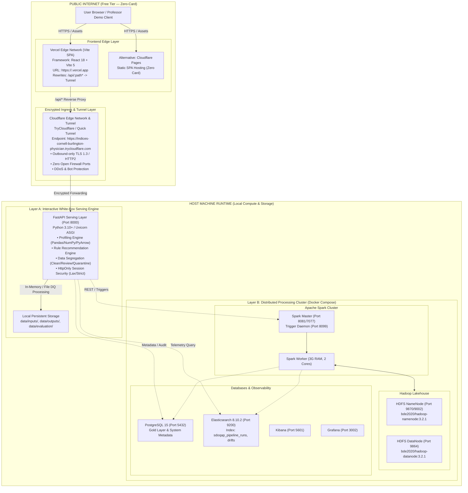

# Data Serve / SDOQAP — Deployment Architecture (Zero-Card & Free-Tier)

## 1. Executive Summary & Philosophy

This document defines the production and demonstration deployment architecture for **Data Serve (SDOQAP - Semi-Automated Data Quality & ETL Governance Platform)**.

The deployment model is designed under two non-negotiable operational constraints:
1. **Target Cost**: **฿0/month** (Strict Zero-Cost).
2. **Payment Card Policy**: **Zero-Card Requirement** — absolutely no credit or debit card linking required at any stage of signup, deployment, or execution.

To guarantee that the platform demonstrates **real data processing, authentic White-Box governance, and honest system boundaries** without fabricating results or breaking under cloud provider restrictions, the system operates as a **Hybrid Edge-Core Architecture**:
* **Layer A (Interactive White-Box Serving & Ingestion Layer)**: Hosted and publicly exposed via **Vercel / Cloudflare Edge** with full interactive data profiling, dynamic rule recommendations, business context locking, validation, and data segregation (Clean, Review, Quarantine).
* **Layer B (Distributed Big Data Platform)**: Maintained on **Local Docker Infrastructure** to run Apache Spark 3.4.1, Hadoop HDFS 3.2.1, Delta Lake, PostgreSQL 15, and Elasticsearch 8.10.2 without violating zero-card policies.

---

## 2. End-to-End System Architecture Diagram

---

## 3. Component Boundaries & Responsibilities

| Component | Runtime Environment | Hosting Provider | Card Required? | Operational Status | Fallback / Recovery Mode |
| :--- | :--- | :--- | :--- | :--- | :--- |
| **Frontend UI** | Static Client SPA | Vercel Hobby / Cloudflare Pages | **NO** (Verified) | Production Ready | Cloudflare Pages fallback |
| **API Reverse Proxy** | Edge Worker / CDN Rewrites | Vercel Edge (`vercel.json`) | **NO** (Verified) | Active | Direct Cloudflare Worker Gateway |
| **Backend Ingress** | Tunnel Daemon (`cloudflared`) | Cloudflare Tunnel | **NO** (Verified) | Live (`trycloudflare.com`) | Self-healing process supervisor |
| **Layer A Engine** | FastAPI + Python 3.13 | Local Host / Container | **NO** (Local hardware) | Live & Active | Standalone disk/memory execution |
| **PostgreSQL 15** | Docker Container | Local Docker (`sdoqap-postgres`) | **NO** (Local hardware) | Running (`postgres_data` volume) | `pg_dump` automated snapshot |
| **Elasticsearch 8** | Docker Container | Local Docker (`sdoqap-elasticsearch`) | **NO** (Local hardware) | Running (`elasticsearch_data` volume)| File-based metadata fallback |
| **Hadoop HDFS** | Multi-Container Cluster | Local Docker (`namenode`, `datanode`) | **NO** (Local hardware) | Running | Staging directory filesystem |
| **Apache Spark** | Distributed Cluster | Local Docker (`spark-master`, `worker`) | **NO** (Local hardware) | Running | Layer A White-Box fallback |

---

## 4. Provider Evaluation & Decision Rationale

### 4.1 Why Frontend on Vercel / Cloudflare Pages?
* **Zero Cost**: 100GB bandwidth, unlimited requests, automatic HTTPS.
* **Zero Card Requirement**: Both Vercel Hobby and Cloudflare Pages can be created with a standard GitHub account without providing billing information.
* **Edge Reverse Proxy**: Vercel rewrites `/api/:path*` to the Cloudflare Tunnel backend. This guarantees **First-Party Cookie Semantics** (`credentials: "same-origin"`), completely bypassing browser third-party cookie restrictions (Safari ITP, Chrome Privacy Sandbox).

### 4.2 Why Cloudflare Tunnel for Backend Exposure?
* **Zero Port Forwarding**: The local router/firewall does not need to open inbound port 80 or 443.
* **DDoS & Web Application Firewall**: Free DDoS mitigation and HTTPS termination.
* **No Account Required for TryCloudflare**: Allows instantaneous zero-config ephemeral tunnels for live demonstrations, while named tunnels can be bound to free Cloudflare zones.

### 4.3 Why Keep Layer B (Spark/HDFS/ES) on Local Docker?
* **Cloud Free-Tier Incompatibility**: No cloud provider offers free multi-node JVM clusters with >4GB RAM without requiring a credit card or expiring after a 14-day trial.
* **Honest Systems Engineering**: Running Spark, HDFS, and Elasticsearch locally allows the platform to process 100,000+ rows with real distributed executors rather than faking distributed execution on an under-resourced cloud container.
