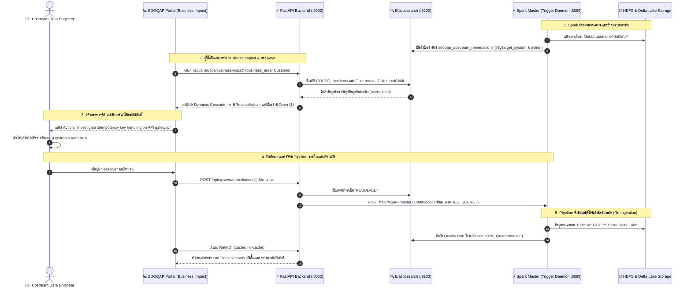

# สถาปัตยกรรมและขั้นตอนการทำงานทั้งระบบ SDOQAP ณ ปัจจุบัน (SDOQAP Master Workflow Architecture)

**โครงการ**: SDOQAP (Smart Data Operations & Quality Assurance Platform)  
**เวอร์ชันระบบ**: 2.5 (Production Release)  
**วันที่บันทึก**: 8 ตุลาคม 2569  
**สถาปัตยกรรม**: 12 Microservices Cluster (Docker Stack)  

---

## 1. แผนภาพแสดงการไหลของข้อมูลและการทำงานทั้งระบบ (Full Master Workflow Diagram)

```mermaid
flowchart TD
    %% =========================================================================
    %% STYLING AND THEME DEFINITIONS
    %% =========================================================================
    classDef sourceStyle fill:#f8fafc,stroke:#475569,stroke-width:1.5px,color:#0f172a;
    classDef ingestStyle fill:#eff6ff,stroke:#2563eb,stroke-width:1.5px,color:#1e3a8a;
    classDef bronzeStyle fill:#fef3c7,stroke:#d97706,stroke-width:1.5px,color:#78350f;
    classDef sparkStyle fill:#faf5ff,stroke:#7c3aed,stroke-width:2px,color:#581c87;
    classDef silverClean fill:#ecfdf5,stroke:#059669,stroke-width:2px,color:#064e3b;
    classDef silverQuar fill:#fef2f2,stroke:#dc2626,stroke-width:2px,color:#7f1d1d;
    classDef esGold fill:#fdf4ff,stroke:#c026d3,stroke-width:1.5px,color:#701a75;
    classDef apiStyle fill:#f0fdfa,stroke:#0d9488,stroke-width:2px,color:#134e4a;
    classDef uiStyle fill:#f0fdf4,stroke:#16a34a,stroke-width:2px,color:#14532d;
    classDef autoStyle fill:#fff1f2,stroke:#e11d48,stroke-width:2px,color:#881337;

    %% =========================================================================
    %% PHASE 1: DATA INGESTION & TRIGGER
    %% =========================================================================
    subgraph P1 ["Phase 1: แหล่งข้อมูลนำเข้าและการทริกเกอร์ (Ingestion & Triggers)"]
        CSV_In["📄 Local Batch CSVs<br>(orders, users, products, bank)"]:::sourceStyle
        API_In["🌐 Upstream REST APIs<br>(Auth API, ERP, CRM)"]:::sourceStyle
        Kafka_Stream["📡 Kafka Message Queue :9092<br>(Streaming Events / Reddit Stream)"]:::sourceStyle
        Spark_Daemon["⚡ Spark Trigger Daemon :8099<br>(Shared Secret Trigger API)"]:::autoStyle
    end

    %% =========================================================================
    %% PHASE 2: BRONZE STORAGE & PRE-FLIGHT
    %% =========================================================================
    subgraph P2 ["Phase 2: พื้นที่จัดเก็บดิบและตรวจสอบสเปก (Bronze & Pre-Flight Gate)"]
        HDFS_Namenode["📁 HDFS Raw Bronze Zone :9870<br>(/data/raw/&lt;table&gt;/)"]:::bronzeStyle
        Postgres_Meta[("🐘 PostgreSQL 15 Metadata :5432<br>(Raw Staging & State Catalogs)")]:::bronzeStyle
        Drift_Check{"🔍 Schema Drift Governance<br>(เปรียบเทียบ schema_registry.json)"}:::ingestStyle
    end

    %% =========================================================================
    %% PHASE 3: SPARK COMPUTATION ENGINE
    %% =========================================================================
    subgraph P3 ["Phase 3: เอนจินประมวลผลและคัดแยกรายแถว (Distributed Spark QA Engine)"]
        Spark_Cluster["⚡ Apache Spark Master & Workers :7077<br>(Bitnami Cluster : 8081 Web UI)"]:::sparkStyle
        Rule_Engine{"🚦 3-Tier Quality Gates<br>1. Static Null/PK Deduplication<br>2. Dynamic Adaptive IQR & Z-Score<br>3. Induced Decision Tree Rules"}:::sparkStyle
    end

    %% =========================================================================
    %% PHASE 4: SILVER MEDALLION STORAGE
    %% =========================================================================
    subgraph P4 ["Phase 4: พื้นที่จัดเก็บข้อมูลแยกคุณภาพ (Silver Medallion Storage)"]
        Delta_Active[("🟢 Delta Lake Active Store<br>/data/active/&lt;table&gt;/<br>(ACID Upsert via MERGE INTO)")]:::silverClean
        HDFS_Quar[("🔴 HDFS Quarantine Zone<br>/data/quarantine/&lt;table&gt;/<br>(แนบ reject_reason, run_id, table)")]:::silverQuar
    end

    %% =========================================================================
    %% PHASE 5: OBSERVABILITY & GOLD INDICES
    %% =========================================================================
    subgraph P5 ["Phase 5: ดัชนีสังเกตการณ์และความเสี่ยง (Observability & Gold Indices)"]
        ES_Cluster[("🔍 Elasticsearch 8.10.2 :9200<br>• sdoqap_quality_runs<br>• sdoqap_pipeline_runs<br>• sdoqap_upstream_remediations<br>• sdoqap_schema_proposals")]:::esGold
        Kibana_UI["📊 Kibana Explorer :5601<br>(White-Box Telemetry Search)"]:::esGold
        Grafana_UI["📈 Grafana Dashboards :3002<br>(Time-Series Metrics & Cluster Health)"]:::esGold
    end

    %% =========================================================================
    %% PHASE 6: BACKEND & BUSINESS IMPACT ENGINE
    %% =========================================================================
    subgraph P6 ["Phase 6: เซอร์วิสวิเคราะห์ผลกระทบทางธุรกิจ (FastAPI Serving & Impact Engine)"]
        FastAPI_Svc["⚡ FastAPI Backend :8002 / :8000<br>(uvicorn main:app --reload)"]:::apiStyle
        Domain_Mapper["🔀 Business Area Domain Mapping<br>• Sales & Revenue (orders)<br>• Customer Insights (users)<br>• Supply Chain & Ops (products)<br>• Executive Reporting (customers)"]:::apiStyle
        COPDQ_Engine["💰 COPDQ 3D Financial Engine<br>• Cost of Correction<br>• Cost of Lost Opportunities<br>• Cost of Risk & Compliance"]:::apiStyle
        Impact_Flow["📊 Dynamic 4-Step Cascade Resolver<br>(Issue → Impact → KPI → Action)"]:::apiStyle
    end

    %% =========================================================================
    %% PHASE 7: CENTRAL PORTAL & SYNCHRONIZED UI
    %% =========================================================================
    subgraph P7 ["Phase 7: แผงควบคุมและธรรมาภิบาลข้อมูล (SDOQAP Portal :80)"]
        Nginx_Proxy["🌐 Nginx Web Proxy :80<br>(Route /api/ to Backend, / to UI)"]:::uiStyle
        View_Exec["👔 View 1: Executive Overview<br>(Score 96.35%, SLA 81.8%, Area Trend)"]:::uiStyle
        View_Biz["🏢 View 2: Business Impact View<br>(Two-Way Synced Cards, Reconciliation)"]:::uiStyle
        View_DQ["📈 View 3: Data Quality View<br>(Real-Time Stream Chart + DAG Lineage)"]:::uiStyle
        View_Cockpit["⚙️ View 4: Technical Cockpit<br>(Schema Approval Gate & Run Logs)"]:::uiStyle
        Gov_Tickets["🎫 Upstream Governance Panel<br>(Open / All Tabs & Remediation Narrative)"]:::uiStyle
        Zustand_Store{{"🔄 Zustand Global Store<br>(selectedAreaFilter, timeRange: all)"}}:::uiStyle
    end

    %% =========================================================================
    %% PHASE 8: EXTERNAL AUTOMATION & CLOSED-LOOP HEALING
    %% =========================================================================
    subgraph P8 ["Phase 8: การแจ้งเตือนและวงจรปิดซ่อมแซมต้นน้ำ (Alerts & Closed-Loop Healing)"]
        n8n_Alerts["📢 n8n Workflow Automation :5678<br>(Slack / Line / Teams Critical Alerts)"]:::autoStyle
        Ollama_AI["🤖 Ollama / Groq Llama 3.3<br>(Error Pattern Classification)"]:::autoStyle
        DE_Action["👨‍💻 Upstream Engineering Teams<br>(Auth API, ERP & Database Patching)"]:::sourceStyle
    end

    %% =========================================================================
    %% PIPELINE WORKFLOW CONNECTIONS
    %% =========================================================================
    CSV_In & API_In -->|Batch File Put| HDFS_Namenode
    Kafka_Stream -->|Micro-Batch Stream| Spark_Cluster
    HDFS_Namenode & Postgres_Meta -->|Fetch Raw Data| Spark_Cluster
    Spark_Daemon -.->|On-demand / Scheduled Trigger| Spark_Cluster

    Spark_Cluster --> Drift_Check
    Drift_Check -->|Safe Drift Score <= 4 / No Drift| Rule_Engine
    Drift_Check -->|Dangerous Drift Score > 4| ES_Cluster
    Drift_Check -->|Trigger Critical Alert| n8n_Alerts

    Rule_Engine -->|Clean Rows| Delta_Active
    Rule_Engine -->|Quarantined Rows| HDFS_Quar

    Delta_Active & HDFS_Quar -->|Aggregate Telemetry Metrics| Spark_Cluster
    HDFS_Quar -.->|Sample Error Rows| Ollama_AI
    Ollama_AI -.->|Classify Root Cause Narrative| ES_Cluster

    Spark_Cluster -->|Index Quality Runs & Remediation Tickets| ES_Cluster
    ES_Cluster --> Kibana_UI & Grafana_UI
    ES_Cluster <-->|Query Metrics, Tickets & Profiles| FastAPI_Svc

    FastAPI_Svc --> Domain_Mapper
    Domain_Mapper --> COPDQ_Engine & Impact_Flow

    Nginx_Proxy --> FastAPI_Svc
    Nginx_Proxy --> View_Exec & View_Biz & View_DQ & View_Cockpit

    COPDQ_Engine & Impact_Flow --> View_Biz
    FastAPI_Svc --> View_Exec & View_DQ & View_Cockpit & Gov_Tickets

    Zustand_Store <-->|Two-Way Domain Sync| View_Exec & View_Biz & Gov_Tickets

    Gov_Tickets -->|Operator Resolves Ticket| FastAPI_Svc
    FastAPI_Svc -->|1. Mark Ticket RESOLVED| ES_Cluster
    FastAPI_Svc -->|2. Trigger Re-run HTTP POST| Spark_Daemon
    
    Gov_Tickets -.->|Dispatch Action Narrative| DE_Action
    DE_Action -->|Patch Bugs / Fix Upstream Constraints| API_In
```

---

## 2. แผนภาพวงจรปิดการแก้ไขปัญหาข้อมูลต้นน้ำ (Closed-Loop Upstream Remediation Flow)

---

## 3. สรุปรายละเอียดการทำงาน 8 ขั้นตอน (Detailed 8-Stage Lifecycle)

### ขั้นที่ 1: การนำเข้าข้อมูลและการสตรีมสด (Ingestion & Triggers)
* **ช่องทางรับข้อมูล 3 ช่องทาง**:
  * **Batch CSV**: อัปโหลดชุดข้อมูลจริงหรือไฟล์รายวันผ่านไดเรกทอรี `data/` เข้าสู่ NameNode HDFS
  * **REST APIs**: ดึงข้อมูลอัปเดตจากระบบต้นน้ำภายนอก (เช่น API ผู้ใช้งาน, ธุรกรรม, แค็ตตาล็อกสินค้า)
  * **Streaming Events**: รับข้อมูลแบบสตรีมผ่าน **Apache Kafka** (พอร์ต `9092`) สำหรับสตรีมข้อมูลที่มีความถี่สูง
* **Spark Trigger Daemon**:
  * ทำงานเป็น Background Service ที่พอร์ต `8099` ของ Spark Master
  * คอยรับคำสั่งทริกเกอร์รันทั้งแบบเป็นรอบเวลา และแบบ On-demand เมื่อมีคำสั่งแก้ไขข้อมูลต้นน้ำ โดยยืนยันตัวตนผ่าน `TRIGGER_SHARED_SECRET`

### ขั้นที่ 2: การตรวจสอบโครงสร้างและธรรมาภิบาลข้อมูล (Bronze Pre-Flight & Schema Drift Gate)
* ข้อมูลดิบที่รับเข้าจะถูกบันทึกลงใน **HDFS Raw Bronze Zone** (`/data/raw/<table_name>/`) ตามสภาพเดิม 100% โดยไม่มีการแก้ไข
* ก่อนที่ Spark จะประมวลผล ระบบจะส่งโครงสร้างคอลัมน์และ Data Type ไปตรวจสอบกับ `schema_registry.json`:
  * **Safe Drift (Severity Score $\le 4$)**: หากพบเฉพาะคอลัมน์ใหม่ที่ปลอดภัย ระบบจะทำการ **Auto-Evolve** อัปเดตสเปกลง Disk และ Elasticsearch โดยอัตโนมัติ
  * **Dangerous Drift (Severity Score $> 4$)**: หากพบคอลัมน์หลักหาย หรือมีการแปลงชนิดข้อมูลที่ไม่ปลอดภัย ระบบจะแคสต์คอลัมน์นั้นเป็น String เพื่อให้ Pipeline ประมวลผลต่อได้โดยไม่ล่ม พร้อมสร้างข้อเสนอรออนุมัติ (`sdoqap_schema_proposals`) และยิง Webhook แจ้งเตือนไปยัง **n8n** เพื่อแจ้งวิศวกรข้อมูลในทันที

### ขั้นที่ 3: เอนจินคัดแยกข้อมูลคุณภาพระดับแถว (Distributed Spark QA Engine)
Spark Cluster รันกฎคุณภาพ 3 ชั้นแบบขนานในหน่วยความจำ (In-Memory Distributed Processing):
1. **Static Rules**: ตรวจสอบค่าว่าง (Null Checks) ในคอลัมน์ที่เป็น Primary Key และทำ Deduplication คัดกรองแถวซ้ำซ้อน
2. **Dynamic & Statistical Rules**: ใช้อัลกอริทึม Auto-IQR (Interquartile Range) และ Z-Score Anomaly ในการตรวจจับตัวเลขที่ผิดปกติเกินค่ามาตรฐาน
3. **Induced Decision Tree Rules**: ประเมินความสัมพันธ์เชิงตรรกะทางธุรกิจข้ามคอลัมน์ เช่น ยอดขายกับปริมาณสินค้า

### ขั้นที่ 4: การจัดเก็บข้อมูลตามสถาปัตยกรรม Medallion (Silver Storage Tiering)
ผลการคัดแยกรายแถว (Row-Level Segregation) ถูกส่งไปยังพื้นที่จัดเก็บ 2 ส่วน:
1. **🟢 Delta Lake Active Store** (`/data/active/<table_name>/`):
   * เก็บเฉพาะแถวข้อมูลที่ถูกต้อง สะอาด และผ่านเกณฑ์ 100%
   * เขียนข้อมูลด้วยคำสั่ง `MERGE INTO` (Upsert) เพื่อรักษา ACID Transactions สำหรับการนำไปใช้งานใน BI หรือโมเดล AI
2. **🔴 HDFS Quarantine Store** (`/data/quarantine/<table_name>/`):
   * แถวที่ผิดเกณฑ์จะถูกแยกมาเก็บที่นี่ทันที โดยไม่ถูกทิ้ง
   * ทุกแถวจะถูกบันทึกกำกับด้วย `run_id`, `table_name`, `timestamp` และ `reject_reason` เพื่อใช้เป็นหลักฐานและนำไปจัดกลุ่มหาสาเหตุ

### ขั้นที่ 5: การสังเกตการณ์และดัชนีเมทาดาต้า (Gold Observability & Telemetry)
ทุกการทำงานของ Pipeline จะถูกประมวลผลเป็นสถิติสะสม (Pre-aggregated Metrics) และบันทึกลง **Elasticsearch 8.10.2**:
* `sdoqap_quality_runs`: เก็บสถิติความสะอาด (Quality Score), ปริมาณแถว Ingest vs Delivered, จำนวนแถวที่ถูกกักกัน
* `sdoqap_pipeline_runs`: เก็บรอบเวลาทำงาน (SLA Duration), ความหน่วงเวลา (Latency)
* `sdoqap_upstream_remediations`: เก็บตั๋วงานแก้ไขปัญหาต้นน้ำ พร้อมระบุระบบเป้าหมาย (`target_system`) และคำแนะนำการแก้ปัญหา (`remediation_action`)
* ผู้ดูแลระบบสามารถใช้ **Kibana** (พอร์ต `5601`) ในการสำรวจดัชนีแบบ White-Box และใช้ **Grafana** (พอร์ต `3002`) ในการดูความเสถียรของโครงสร้างพื้นฐาน

### ขั้นที่ 6: เซอร์วิสวิเคราะห์ผลกระทบทางธุรกิจ (FastAPI Serving & Business Impact Engine)
FastAPI Backend (พอร์ต `8002` ภายนอก / `8000` ภายใน) ทำหน้าที่คำนวณและให้บริการข้อมูล:
1. **Business Area Domain Mapping**: แมปปิ้งความสัมพันธ์ของตารางเข้ากับแผนกธุรกิจขององค์กร:
   * *Sales & Revenue*: ตาราง `orders`, `transaction_records`
   * *Customer Insights*: ตาราง `users`, `mbti`
   * *Supply Chain & Operations*: ตาราง `products`, `dirty_dataset`
   * *Executive Reporting*: ตาราง `customers`, `users`
   * *Finance & Audit*: ตารางการตรวจสอบบัญชี
2. **COPDQ 3D Financial Loss Engine**: คำนวณความสูญเสียทางการเงินจากข้อมูลชำรุด 3 มิติ:
   $$\text{Total COPDQ} = \text{Cost of Correction} + \text{Cost of Lost Opportunities} + \text{Cost of Risk}$$
3. **Dynamic 4-Step Impact Cascade**: แปลงเหตุการณ์ทางเทคนิคล่าสุดเป็นโฟลว์ธุรกิจ 4 ขั้นตอน:
   $$\text{Technical Issue} \longrightarrow \text{Technical Impact} \longrightarrow \text{KPI Impact} \longrightarrow \text{Business Action}$$

### ขั้นที่ 7: แผงควบคุมกลางและการซิงค์ตัวกรองข้อมูล (Central Portal & Two-Way Sync)
React Dashboard (พอร์ต `80` ผ่าน Nginx) แบ่งมุมมองการใช้งานออกเป็น 4 ส่วนที่สอดประสานกันผ่าน **Zustand State Store**:
1. **View 1: Executive Overview**: สรุปคะแนน Data Health Score (96.35%), Pipeline SLA Compliance (81.8%), ปริมาณ Gap การรับส่งข้อมูล, และมูลค่าความเสี่ยง COPDQ
2. **View 2: Business Impact**: แสดงการ์ดแผนกธุรกิจทั้ง 5 แผนก, กราฟกระทบยอด Flow Reconciliation (Ingestion vs Delivery), และแจกแจงต้นทุน COPDQ
   * *Two-Way Filter Synchronization*: เมื่อคลิกการ์ดแผนก เช่น *Customer Insights* ระบบจะกรองตัวเลขและกราฟทั้งหน้าจอให้สอดคล้องกันทันที พร้อมแสดงปุ่ม `Reset Filter`
3. **View 3: Data Quality**: แสดงชาร์ตสตรีมมิ่งสด `DataFlowStreamChart` (พร้อม Ingestion Beacon และ Throughput Ticker) ควบคู่กับผัง Medallion DAG Network
4. **View 4: Technical Cockpit**: หน้าสำหรับวิศวกรข้อมูลในการตรวจสอบประวัติ Run ย้อนหลัง และพิจารณาอนุมัติ/ปฏิเสธโครงสร้างข้อมูล (Schema Evolution Gate)

### ขั้นที่ 8: วงจรปิดแก้ไขปัญหาต้นน้ำและการประมวลผลข้อมูลใหม่ (Closed-Loop Upstream Healing)
1. ในหน้า Business Impact ตาราง **Upstream Governance Tickets** จะแสดงรายการบัตรงานแยกแท็บ **Open** และ **All**
2. แต่ละบัตรงานจะระบุ **Target System** (เช่น Upstream Auth API) และคำแนะนำเชิงลึก **Remediation Action Narrative** (เช่น แนะนำการทำ Idempotency Key หรือ NOT NULL Constraint)
3. เมื่อทีมวิศวกรต้นน้ำแก้ไขที่ระบบต้นทางแล้ว วิศวกรบน Dashboard สามารถกดปุ่ม **Resolve**:
   * ระบบจะยิงคำสั่ง `POST /api/system/remediations/{id}/resolve` เพื่อปรับสถานะเป็น `RESOLVED` บน Elasticsearch
   * FastAPI จะส่งสัญญาณผ่านพอร์ต `8099` ไปยัง Spark Trigger Daemon เพื่อเริ่มประมวลผลข้อมูลรอบใหม่ (Re-conciliation Loop)
   * หน้าจอแดชบอร์ดจะ Refetch ข้อมูลอัตโนมัติโดยไม่ติด Browser Cache (`no-cache`) ทำให้คะแนนคุณภาพและยอด Clean Records ปรับเพิ่มขึ้นทันทีแบบวงจรปิดสมบูรณ์

---

## 4. ตารางสรุปพอร์ตและการสื่อสารภายในระบบ (Service Port & Protocol Matrix)

| Service Name | Container Name | Port Mapping | Protocol / Purpose |
| :--- | :--- | :--- | :--- |
| **Nginx Gateway** | `sdoqap-nginx` | `80:80` | HTTP Reverse Proxy & Web Serving |
| **UI Application** | `sdoqap-ui` | `80/tcp` (Internal) | React 18, Vite 5, Zustand, ECharts |
| **Backend API** | `sdoqap-api` | `8002:8000` | FastAPI, REST Endpoints, Trust-Check Gate |
| **Spark Master** | `sdoqap-spark-master` | `7077:7077` `8081:8080` `8099:8099` | Spark Master IPC Spark Web UI Spark Trigger Daemon (HTTP API) |
| **Spark Worker** | `sdoqap-spark-worker` | Dynamic | Spark Distributed Task Execution |
| **HDFS NameNode** | `sdoqap-namenode` | `9870:9870` `9002:9000` | HDFS Web UI / File System RPC |
| **HDFS DataNode** | `sdoqap-datanode` | `9864:9864` | HDFS Block Storage Transfer |
| **Elasticsearch** | `sdoqap-elasticsearch` | `9200:9200` | Telemetry & Observability Index REST API |
| **Kibana** | `sdoqap-kibana` | `5601:5601` | Index Search & White-Box Log Visualizer |
| **Grafana** | `sdoqap-grafana` | `3002:3000` | Infrastructure & Time-Series Dashboards |
| **Apache Kafka** | `sdoqap-kafka` | `9092:9092` `29092:29092` | Event Streaming Message Broker |
| **Zookeeper** | `sdoqap-zookeeper` | `2181:2181` | Kafka Cluster Coordination |
| **PostgreSQL** | `sdoqap-postgres` | `5432:5432` | Relational Metadata & Catalog DB |
| **n8n Automation** | `sdoqap-n8n` | `5678:5678` | Webhook Alert Workflows (Slack/Teams) |
| **Ollama LLM** | `sdoqap-ollama` | `11434:11434` | Error Pattern & Semantic Classification |
