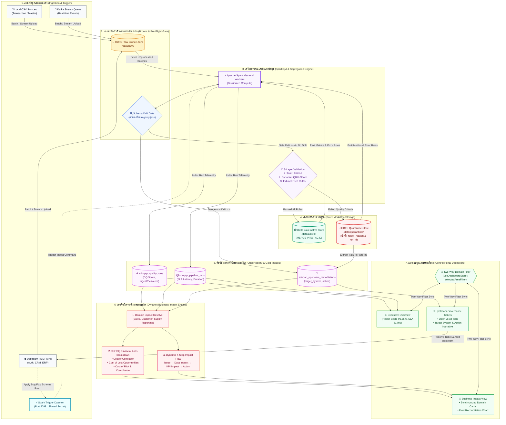
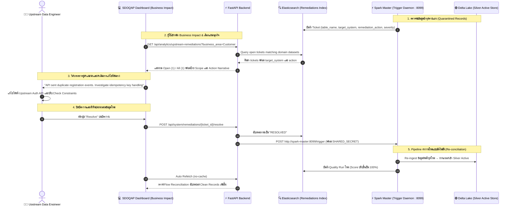

# สถาปัตยกรรมและขั้นตอนการทำงานฉบับปรับปรุงใหม่ (SDOQAP Updated End-to-End Workflow)

**โครงการ**: SDOQAP (Smart Data Operations & Quality Assurance Platform)  
**เวอร์ชันเอกสาร**: 2.5 (Post-Business Impact & Governance Tickets Optimization)  
**วันที่ปรับปรุง**: 7 ตุลาคม 2569  
**สถานะการทำงาน**: ผ่านการทดสอบและใช้งานบน Production Cluster  

---

## 1. แผนภาพขั้นตอนการทำงานภาพรวม (End-to-End System Workflow Diagram)

แผนภาพนี้แสดงลำดับขั้นตอนการประมวลผล การกักแยกข้อมูล การวิเคราะห์ผลกระทบทางธุรกิจ (Dynamic Business Impact) และการส่งต่องานแก้ไขเชิงลึกไปยังทีมวิศวกรต้นน้ำ (Upstream Remediation Closed-Loop)

---

## 2. แผนผังวงจรปิดการแก้ไขปัญหาข้อมูลต้นน้ำ (Closed-Loop Upstream Remediation Flow)

ไดอะแกรมนี้แสดงขั้นตอนการตรวจจับความผิดปกติ การกระจายตั๋วงานที่มีคำแนะนำเชิงเทคนิค (Target System & Remediation Action) ไปยังวิศวกรต้นน้ำ และการสั่ง Re-run Pipeline แบบวงจรปิด

---

## 3. ขั้นตอนการดำเนินงานอย่างละเอียด (Detailed Workflow Steps)

### ขั้นที่ 1: การนำเข้าข้อมูลและการสตรีมสด (Ingestion & Stream Telemetry)
* ข้อมูลนำเข้าจาก 3 ช่องทางหลัก: แฟ้ม CSV ประจำวัน, Webhook/REST API จากระบบภายนอก (Auth API, ERP, CRM) และ Kafka Event Streams
* ระบบเชื่อมต่อกับ `DataFlowStreamChart` ซึ่งเป็น Real-Time Streaming Telemetry Flow บนหน้าเว็บ แสดงสถานะ Ingestion Beacon แบบสด
* **Spark Trigger Daemon**: ทำงานเป็น Background Service ที่พอร์ต `8099` ของคอนเทนเนอร์ `sdoqap-spark-master` เพื่อรับสัญญาณทริกเกอร์การประมวลผลทั้งแบบ Scheduled และ On-demand

### ขั้นที่ 2: การตรวจสอบโครงสร้างกลายพันธุ์ (Schema Drift Governance)
* ทุกแบตช์ข้อมูลจะถูกเปรียบเทียบกับ `schema_registry.json`
* **Auto-Evolution**: หากพบเฉพาะคอลัมน์ใหม่ที่ปลอดภัย (Severity Score $\le 4$) ระบบจะอัปเดตสเปกบนดิสก์และ Elasticsearch โดยอัตโนมัติ
* **Strict Gate**: หากพบคอลัมน์สำคัญขาดหาย หรือชนิดข้อมูลไม่ตรงกัน (Severity Score $> 4$) ระบบจะแปลงคอลัมน์เป็น String เพื่อรักษาการประมวลผลภาพรวม และสร้างบัตรงานแจ้งเตือนระดับ CRITICAL

### ขั้นที่ 3: เอนจินคัดแยกข้อมูลระดับแถว (Row-Level Segregation Engine)
* ข้อมูลวิ่งผ่านการตรวจสอบ 3 ชั้น:
  1. *Static Checks*: ตรวจสอบค่าว่างใน Primary Key และการตรวจจับข้อมูลซ้ำซ้อน (Deduplication)
  2. *Statistical & Dynamic Checks*: ตรวจจับความผิดปกติด้วยขอบเขต IQR (Interquartile Range) และ Z-Score Anomaly
  3. *Business Rule Constraints*: ตรวจสอบตามกฎเฉพาะของแต่ละชุดข้อมูล (เช่น เงื่อนไขรายได้, รหัสสถานะ)
* **การแยกพื้นที่จัดเก็บ (Medallion Storage)**:
  * **แถวที่สะอาด (Clean Records)**: เขียนเข้า Delta Lake Active Store ด้วยคำสั่ง `MERGE INTO` รองรับ ACID Transactions
  * **แถวที่ชำรุด (Quarantined Records)**: แยกบันทึกลง HDFS Quarantine Zone ทันที โดยแนบ `reject_reason` และ `run_id` เพื่อไม่ให้กระทบต่อตารางหลัก

### ขั้นที่ 4: เอนจินวิเคราะห์ผลกระทบทางธุรกิจ (Dynamic Business Impact Engine)
* ระบบนำ Incident ล่าสุดมาจำแนกตาม **Business Area**:
  * **Sales & Revenue**: เชื่อมโยงกับ `orders`, `transaction_records`
  * **Customer Insights**: เชื่อมโยงกับ `users`, `mbti`
  * **Supply Chain & Operations**: เชื่อมโยงกับ `products`, `dirty_dataset`
  * **Executive Reporting**: เชื่อมโยงกับ `customers`, `users`
* คำนวณความสูญเสียทางการเงิน **COPDQ (Cost of Poor Data Quality)** แบบ 3 มิติ:
  $$\text{Total COPDQ} = \text{Cost of Correction} + \text{Cost of Lost Opportunities} + \text{Cost of Risk}$$
* สร้าง Dynamic Impact Cascade 4 ขั้นตอน: ปัญหาทางเทคนิค $\rightarrow$ ผลกระทบต่อปริมาณข้อมูล $\rightarrow$ ผลกระทบต่อ KPI และ แดชบอร์ด $\rightarrow$ แนวทางปฏิบัติการ

### ขั้นที่ 5: การทำงานร่วมกันผ่านแดชบอร์ดและการซิงค์ตัวกรอง (Two-Way Filter Synchronization)
* เมื่อผู้ใช้คลิกเลือกการ์ดแผนกบนหน้าจอ Business Impact หรือเลือกจากดรอปดาวน์ด้านบน:
  * ข้อมูลทั้งหน้าจอ (Executive Overview, กราฟแนวโน้มคุณภาพ, ชาร์ต Reconciliation, และตารางบัตรงาน) จะปรับขอบเขตเข้าสู่แผนกนั้นทันที
  * ผู้ใช้สามารถคลิกปุ่ม `Reset Filter` เพื่อกลับสู่ภาพรวมระดับองค์กรได้ในคลิกเดียว

### ขั้นที่ 6: วงจรปิดแก้ไขปัญหาและซ่อมแซมข้อมูลต้นน้ำ (Closed-Loop Upstream Remediation)
* ตาราง **Upstream Governance Tickets** จะแสดงรายละเอียด:
  * บัตรงานที่ยังเปิดอยู่ (**Open**) เทียบกับทั้งหมด (**All**)
  * ระบบเป้าหมายที่ต้องแก้ไข (**Target System**) เช่น `Upstream Auth API`
  * คำแนะนำการแก้ไขเชิงลึก (**Remediation Action Narrative**) เช่น แนะนำการตั้งค่า Idempotency Key หรือ NOT NULL Constraint
* เมื่อทีมวิศวกรต้นน้ำแก้ไขที่ระบบต้นทางแล้ว สามารถกดปุ่ม `Resolve` บนหน้าเว็บ เพื่อปิดบัตรงานและส่งสัญญาณให้ Spark Trigger Daemon ประมวลผลข้อมูลรอบใหม่อย่างต่อเนื่อง
