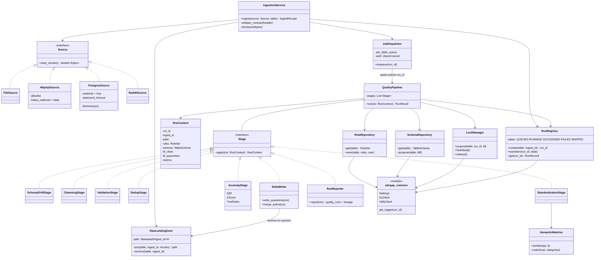
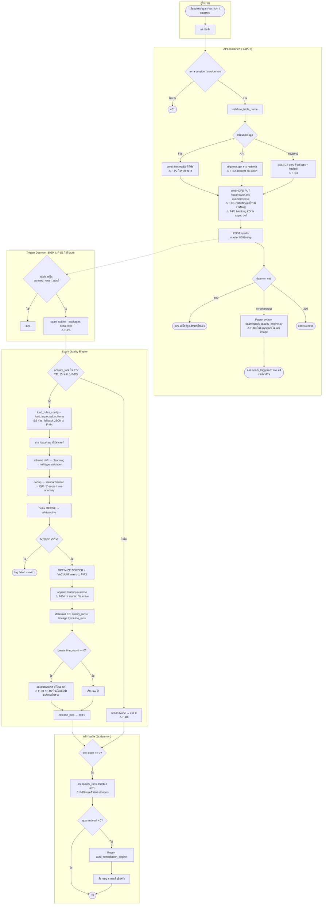
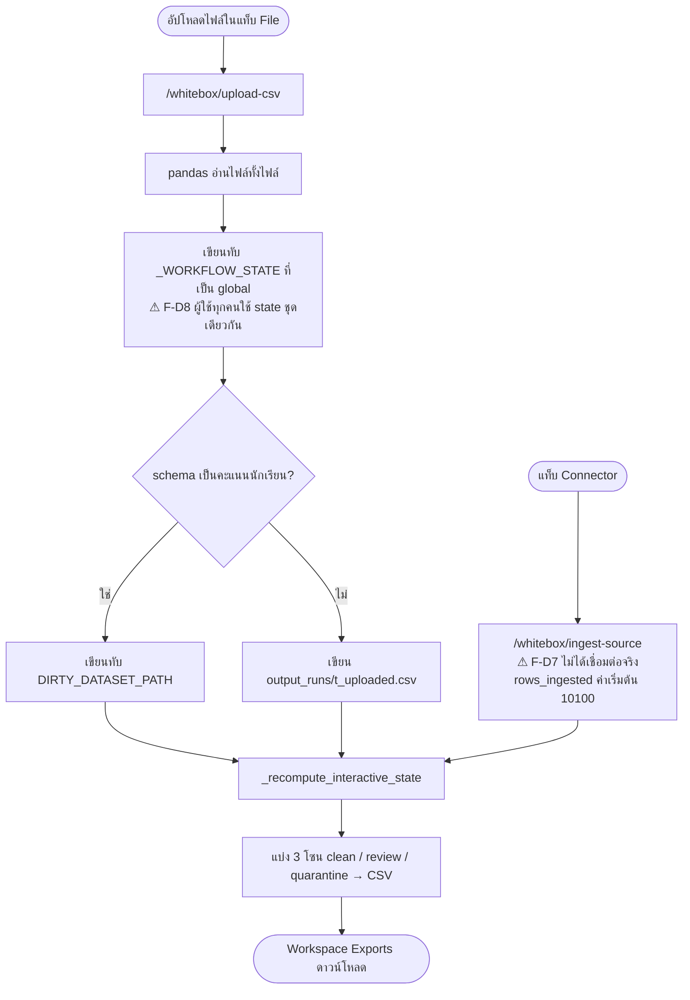
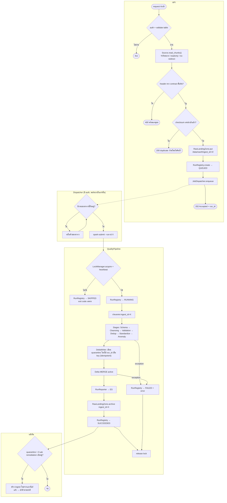

# รีวิวระบบ ETL (SDOQAP): สิ่งที่ควรเพิ่ม ลด และแก้

> วันที่รีวิว: 2026-09-30 · branch `bell` · อ่านจากโค้ดจริง ไม่ได้รันระบบ
> **ขอบเขต:** เส้นทาง ETL ได้แก่ Ingest → Raw Landing → Trigger → Spark Quality/Transform → Load (Delta) → Export รวมเอนจินโต้ตอบ (whitebox) และโครงสร้างพื้นฐานที่เส้นทางนี้ใช้
> **นอกขอบเขต (ไม่แตะ):** ทุกอย่างที่เกี่ยวกับ Dashboard ได้แก่หน้า Dashboards และ Query & Metrics, `api/app/api/analytics.py`, Gold layer (`spark/spark_gold_layer.py`, `api/app/api/gold.py`), Grafana และ Kibana

---

## 1. สรุปสั้น

ระบบมีฟีเจอร์ครบเกินขนาดงานจริง แต่**แกนหลักของ ETL ยังเปราะในสามเรื่อง**:

1. **ข้อมูลหายได้จริงเมื่อมีการอัปโหลดซ้อนกัน**: ทุกการนำเข้าเขียนทับไฟล์เดิม `/data/raw/<t>/<t>.csv` และ Spark ลบโฟลเดอร์ raw ทั้งโฟลเดอร์เมื่อรันจบโดยไม่มีแถวถูกกักกัน ถ้ามีไฟล์ใหม่มาถึงระหว่างที่งานกำลังรัน ไฟล์นั้นจะถูกลบทิ้งโดยไม่เคยถูกประมวลผล (F-D1)
2. **สถานะของงานไม่น่าเชื่อถือ**: API ตอบว่า "triggered" แม้ Spark จะไม่ได้รันจริง (F-D3) งานที่ถูกบล็อกด้วย lock ออกด้วย exit code 0 แล้วไปกระตุ้น auto-remediation จากผลรอบเก่า (F-D6) และไม่มีที่ไหนเก็บสถานะ QUEUED/RUNNING/FAILED ตั้งแต่ต้นจนจบ
3. **ช่องโหว่ด้านความปลอดภัยของจุดนำเข้า**: Trigger Daemon เปิดพอร์ต 8099 ออกนอกเครื่องโดยไม่มี auth (F-S1) การนำเข้าจาก API กันสิ่งที่ไม่อยู่ใน allowlist ได้แบบ fail-open และตาม redirect ไปได้ (F-S2) ส่วนการเช็ก "SELECT-only" ของ RDBMS ถูกข้ามได้ด้วย `SELECT ... INTO` (F-S3)

ด้านโครงสร้างโค้ด ฟังก์ชัน `run_quality_check` เพียงฟังก์ชันเดียวยาวราว 1,200 บรรทัดและทำงาน 15 ขั้นตอน (F-M1) ทำให้เทสต์และแก้ไขได้ยาก ข้อเสนอหลักคือแยกออกเป็น Stage ย่อยตาม Class Diagram ในข้อ 3.2

**ลำดับที่แนะนำ:** Phase 1 ปิดช่องโหว่และปัญหาข้อมูลหาย (ใช้เวลาไม่กี่วัน) → Phase 2 ทำ Landing zone แบบ immutable และ Run registry → Phase 3 refactor Spark engine → Phase 4 ลดขนาดโครงสร้างพื้นฐาน (ดูข้อ 7)

---

## 2. ภาพรวมเส้นทาง ETL ปัจจุบัน

| ชั้น | ไฟล์หลัก | หน้าที่ |
|---|---|---|
| Extract | `api/app/api/pipeline.py` (`/ingest/csv`, `/ingest/api`, `/ingest/rdbms`, `/ingest/reddit`) | รับข้อมูลจากไฟล์, REST API (รวม data.go.th), PostgreSQL, Reddit |
| Raw landing | `upload_to_webhdfs` (`pipeline.py:246`) | เขียน CSV ลง HDFS `/data/raw/<t>/<t>.csv` (overwrite) |
| Trigger | `trigger_spark_job` (`pipeline.py:289`) → `spark/spark_trigger_daemon.py` | HTTP POST `:8099/retry` → `spark-submit` แบบ subprocess |
| Transform + Quality | `spark/spark_quality_engine.py` (`run_quality_check` เริ่มที่บรรทัด 1684) | schema drift, cleansing, validation, dedup, standardization, IQR/Z-score/tree anomaly |
| Load | Delta MERGE ลง `/data/active/<t>` และเพิ่ม (append) ลง `/data/quarantine/<t>` | เก็บข้อมูลสะอาดและข้อมูลที่ถูกกักกัน |
| Metadata | Elasticsearch `sdoqap_quality_runs`, `pipeline_runs`, `lineage_runs`, `run_locks`, `rules_registry`, `schema_registry`, ... | ผลของแต่ละรอบ, กฎ, schema, lock |
| Post-process | `auto_remediation_engine.py`, `ai_rule_advisor.py` | แก้ข้อมูลที่ถูกกักกันด้วย AI แล้วรันตรวจซ้ำ |
| Export | `api/app/api/data_export.py` | อ่าน Parquet/Delta จาก WebHDFS ด้วย pandas |
| เส้นทางโต้ตอบ | `api/app/api/whitebox.py` | pandas ในหน่วยความจำ ใช้กับไฟล์เดียว แบ่งเป็น 3 โซน (clean/review/quarantine) |

---

## 3. Class Diagram

Python ในโปรเจกต์นี้ส่วนใหญ่เขียนเป็น module ที่มีแต่ฟังก์ชัน ไม่ได้เป็น class แผนภาพด้านล่างจึงแทน module ด้วย `<<module>>` และแทนที่เก็บข้อมูลด้วย `<<store>>`

### 3.1 สภาพปัจจุบัน (As-Is)

```mermaid
classDiagram
    direction LR

    class PipelineRouter {
        <<module>>
        pipeline.py
        +ingest_csv(table_name, file)
        +ingest_api(payload)
        +ingest_rdbms(payload)
        +ingest_reddit(payload)
        +retry_pipeline_run(run_id)
        +list_pipeline_runs()
        -upload_to_webhdfs(table, bytes)
        -trigger_spark_job(table)
        -validate_api_ingest_url(url)
        -validate_select_only(sql)
    }
    class WhiteboxRouter {
        <<module>>
        whitebox.py 1801 lines
        -_WORKFLOW_STATE : dict global
        +upload_csv_dataset()
        +ingest_from_connector()
        +execute_pipeline(rules)
        +get_dataset_profile()
        +export_zone_csv(zone)
    }
    class DynamicRulesRouter {
        <<module>>
        dynamic_rules.py
        +get_rules_for_table(t)
        +update_rules_for_table(t, body)
        +approve_proposal(id)
        -_load_rules_config()
        -_save_rules_config()
    }
    class SchemaRouter {
        <<module>>
        schema.py
        +list_proposals()
        +approve_proposal(id)
    }
    class StandardizeRouter {
        <<module>>
        standardize.py
        +approve_item(id)
        +rollback_rules_config()
    }
    class DataExportRouter {
        <<module>>
        data_export.py
        +export_active_data(t)
        +export_quarantine_data(t)
        +delete_table(t)
        -read_parquet_folder_to_df()
    }
    class Auth {
        <<module>>
        auth.py
        +require_session()
        +require_session_or_service_key()
    }
    class ApiConfig {
        <<module>>
        config.py
        +get_es_client() singleton
        +get_http_session()
    }

    class SparkTriggerHandler {
        spark_trigger_daemon.py
        -running_rerun_jobs : set in-memory
        -stream_status : global
        +do_POST_retry()
        +do_POST_stream_start()
        -_try_auto_remediate(table)
    }
    class QualityEngine {
        <<module>>
        spark_quality_engine.py 3044 lines
        +run_quality_check() ~1200 lines
        +acquire_lock(t, run_id)
        +release_lock(t)
        +load_rules_config(t)
        +load_expected_schema(t)
        +apply_dsl_remediation_rules(df)
        +apply_optimized_semantic_standardize(df)
        +create_semantic_standardize_udf()
        +send_n8n_alert()
        -load_env_file()
    }
    class LocalSemanticStandardizer {
        +standardize(val)
        +hybrid_similarity(a, b)
        +n_gram_cosine_similarity(a, b)
    }
    class DynamicRulesEngine {
        <<module>>
        dynamic_rules_engine.py
        +apply_adaptive_rules()
        +compute_value_range_rules()
        +detect_unsupervised_anomalies()
        +generate_rules_from_schema()
        -load_env_file()
        -_get_es_connection()
    }
    class DataProfileStore {
        <<module>>
        data_profile_store.py
        +run_profile_cycle(df, t)
        +compute_psi()
        -_load_env_file()
        -_get_es_connection()
    }
    class AIRuleAdvisor {
        +should_trigger(ctx)
        +run_profile_based_analysis()
        +induce_rules_from_data()
        +log_proposal_to_es()
    }
    class AutoRemediationEngine {
        +run()
        +read_quarantine_data()
        +get_synthesized_dsl_rules()
        +call_groq()
    }
    class SemanticCleanerV1 {
        semantic_cleaner/core/engine.py
        unused by engine
    }
    class SemanticCleanerV2 {
        semantic_cleaner/core/engine_v2.py
        unused by engine
        +transform(df)
    }

    class HDFS {
        <<store>>
        /data/raw/t/t.csv overwrite
        /data/staging
        /data/active Delta
        /data/quarantine Delta
    }
    class Elasticsearch {
        <<store>>
        sdoqap_quality_runs
        sdoqap_pipeline_runs
        sdoqap_run_locks
        sdoqap_rules_registry
        sdoqap_schema_registry
    }
    class RulesConfigJson {
        <<store>>
        spark/rules_config.json
    }
    class SchemaRegistryJson {
        <<store>>
        spark/schema_registry.json
    }
    class ApiLocalFiles {
        <<store>>
        output_runs/*.csv
        workflow_state.json
    }

    PipelineRouter --> Auth
    PipelineRouter --> ApiConfig
    PipelineRouter --> HDFS : WebHDFS PUT
    PipelineRouter --> SparkTriggerHandler : HTTP :8099/retry
    PipelineRouter ..> QualityEngine : fallback Popen (broken)
    WhiteboxRouter --> ApiLocalFiles
    DynamicRulesRouter --> RulesConfigJson : dual write
    DynamicRulesRouter --> Elasticsearch : dual write
    SchemaRouter --> Elasticsearch
    SchemaRouter --> SchemaRegistryJson
    StandardizeRouter --> Elasticsearch
    DataExportRouter --> HDFS : WebHDFS read

    SparkTriggerHandler --> QualityEngine : spark-submit
    SparkTriggerHandler --> AutoRemediationEngine : Popen
    QualityEngine *-- LocalSemanticStandardizer
    QualityEngine --> DynamicRulesEngine
    QualityEngine --> DataProfileStore
    QualityEngine --> AIRuleAdvisor
    QualityEngine --> HDFS
    QualityEngine --> Elasticsearch
    QualityEngine --> RulesConfigJson : fallback
    QualityEngine --> SchemaRegistryJson : fallback
    AutoRemediationEngine --> HDFS
    AutoRemediationEngine --> SparkTriggerHandler : re-trigger
```

**สิ่งที่แผนภาพนี้ชี้ให้เห็น**

- `QualityEngine` เป็น god module ขนาด 3,044 บรรทัด ภายในมีตัวคำนวณความคล้ายของข้อความ (similarity) สองชุดที่ทำงานซ้ำกัน ได้แก่ class `LocalSemanticStandardizer` และฟังก์ชันซ้อนใน `create_semantic_standardize_udf` ส่วน package `semantic_cleaner` v1/v2 ไม่ได้ถูกเอนจินหลักเรียกใช้เลย
- กฎและ schema มี**แหล่งความจริงสองแห่ง** คือไฟล์ JSON และ Elasticsearch โดยฝั่ง API เขียนลงทั้งสองแห่ง แต่ฝั่ง Spark อ่าน Elasticsearch ก่อนแล้วค่อย fallback ไปที่ไฟล์
- ทุก module ในฝั่ง Spark สร้างการเชื่อมต่อ Elasticsearch และโหลด `.env` เอง (`load_env_file` ซ้ำกัน 5 ที่, `_get_es_connection` ซ้ำกัน 4 ที่)
- งาน auto-remediation สั่งรันตรวจซ้ำแบบวนกลับเข้าไปที่ daemon (วงจรแบบนี้คุมได้ยาก)

### 3.2 แบบที่เสนอ (To-Be)

แนวคิดคือแยก `run_quality_check` ออกเป็น Stage ที่ใช้ interface เดียวกัน รวม helper ที่ซ้ำกันไว้ใน `sdoqap_common` และให้แต่ละเรื่องมีที่เก็บข้อมูลเพียงแห่งเดียวผ่าน Repository



**ขอบเขตหน้าที่ของแต่ละ unit**

| Unit | หน้าที่เดียว | แทนที่โค้ดเดิม |
|---|---|---|
| `IngestionService` + `Source` | อ่านข้อมูลเป็น chunk, ตรวจ header ขั้นต้น, ทำ checksum | ส่วนดึงข้อมูลของ `ingest_*` ใน `pipeline.py` |
| `RawLandingZone` | เขียนลง path ที่ไม่ซ้ำกันต่อการนำเข้าหนึ่งครั้ง (immutable) และย้ายไปเก็บ archive แทนการลบ | `upload_to_webhdfs` + ส่วน cleanup ที่ `spark_quality_engine.py:2872-2891` |
| `RunRegistry` | บันทึกสถานะของรอบตั้งแต่ถูกสั่ง ไม่ใช่เฉพาะตอนรันจบ | ข้อมูลที่กระจายอยู่ใน `sdoqap_pipeline_runs`/`quality_runs` และ set ในหน่วยความจำของ daemon |
| `JobDispatcher` | เก็บคิวต่อตาราง ถ้ามีงานของตารางนั้นรันอยู่ให้ต่อคิวไว้แทนการตอบ 409 | `spark_trigger_daemon.py` ส่วน `/retry` |
| `Stage` แต่ละตัว | ขั้นตอนเดียว เทสต์ได้ด้วย SparkSession แบบ local | บล็อก 1–4.2 ภายใน `run_quality_check` |
| `SemanticMatcher` | คำนวณ similarity จากโค้ดชุดเดียว | `LocalSemanticStandardizer`, UDF ที่ซ้ำกัน, `semantic_cleaner` v1/v2 |
| `RuleRepository`/`SchemaRepository` | อ่านและเขียนจากที่เก็บเดียว (ES) โดยใช้ไฟล์ JSON เป็นแค่ seed ตอนเริ่มระบบ | dual-write ใน `dynamic_rules.py:79-160` และ fallback ใน `spark_quality_engine.py:1349,1501` |
| `sdoqap_common` | Settings, ES/HDFS client และ logger ที่ติด `run_id` | `load_env_file` ×5, `_get_es_connection` ×4 และโค้ด parse URL ที่ซ้ำอยู่ในทุกฟังก์ชัน |

---

## 4. Activity Diagram

Mermaid ไม่มี activity diagram ของ UML แบบตรงตัว จึงใช้ flowchart ที่แบ่ง subgraph ตามผู้รับผิดชอบ (swimlane) แทน ป้าย ⚠ ในแผนภาพอ้างถึงรหัสปัญหาในข้อ 5

### 4.1 เส้นทาง Batch ปัจจุบัน (As-Is)



### 4.2 เส้นทางโต้ตอบ (whitebox) ปัจจุบัน



### 4.3 เส้นทาง Batch ที่เสนอ (To-Be)



---

## 5. รายการสิ่งที่ควรแก้ทั้งหมด

ระดับความรุนแรง: 🔴 วิกฤต (ข้อมูลหายหรือโดนโจมตีได้) · 🟠 สูง · 🟡 กลาง · ⚪ ต่ำ

### 5.1 ความถูกต้องของข้อมูลและความน่าเชื่อถือ (D)

| ID | ระดับ | ปัญหา | หลักฐาน | ผลกระทบ | วิธีแก้ |
|---|---|---|---|---|---|
| F-D1 | 🔴 | การนำเข้าเขียนทับไฟล์ raw เดิมทุกครั้ง และเขียน**ก่อน**เช็กว่ามีงานรันอยู่หรือไม่ พอรันจบ Spark ก็ลบ `/data/raw/<t>` ทั้งโฟลเดอร์ | `pipeline.py:253` (`overwrite=true`), `pipeline.py:341-342` (อัปโหลดก่อน trigger), `spark_quality_engine.py:2884` (ลบโฟลเดอร์) | ถ้าอัปโหลดสองครั้งติดกัน ไฟล์แรกหายโดยไม่ถูกประมวลผล หรือไฟล์ที่สองถูกลบหลังจบรอบแรกโดยไม่เคยถูกตรวจ ผู้ใช้เห็นแค่ 409 | ใช้ path ที่ไม่ซ้ำต่อการนำเข้า (`ingest_id=<uuid>`) ส่ง `ingest_id` ให้ Spark อ่านเฉพาะชุดนั้น และลบหรือ archive เฉพาะชุดนั้น |
| F-D2 | 🟠 | ลบ raw ทิ้งเมื่อรันผ่าน จึงไม่มี Bronze layer ถาวร | `spark_quality_engine.py:2872-2891` | แก้กฎแล้วประมวลผลย้อนหลังไม่ได้ และไม่มีหลักฐานต้นฉบับไว้ตรวจสอบย้อนหลัง | ย้ายไป `/data/archive/<t>/ingest_id=X` แล้วให้ `scripts/data_retention_cleanup.py` ลบตามนโยบายระยะเวลา |
| F-D3 | 🔴 | ถ้าเรียก daemon ไม่สำเร็จ API จะ fallback ไปสั่ง `Popen(["python","spark/spark_quality_engine.py"])` ภายใน api container ซึ่งไม่มี pyspark (`api/requirements.txt`) และ path แบบ relative ก็ไม่ถูก แต่ Popen ไม่ error จึงคืนค่า `True` | `pipeline.py:309-315`, `pipeline.py:217-224` | UI แสดง "triggered" ทั้งที่ไม่มีอะไรรันเลย | ลบ fallback ออก ถ้าเรียก daemon ไม่ได้ให้ตอบ 503 และบันทึกสถานะ `TRIGGER_FAILED` |
| F-D4 | 🟠 | ลำดับการเขียนไม่ atomic: MERGE ลง active ก่อน แล้วค่อย append quarantine จากนั้นจึงเขียน ES | `spark_quality_engine.py:2388-2436` | ถ้าล้มระหว่างขั้น active จะอัปเดตไปแล้วแต่ quarantine/ES ยังไม่มี พอ retry ก็ append quarantine ซ้ำภายใต้ run_id ใหม่ | เขียน quarantine ก่อน โดยใช้ `ingest_id` เป็น key (เช็กก่อนเขียนว่ามี partition อยู่แล้วหรือไม่) แล้วค่อย MERGE และบันทึกสถานะรอบใน RunRegistry |
| F-D5 | 🟠 | Lock ใน ES มี TTL ตายตัว 15 นาทีและไม่มี heartbeat | `spark_quality_engine.py:162` | งานที่รันเกิน 15 นาทีถูกรอบใหม่แย่ง lock ได้ ทำให้มีสองงาน MERGE ตารางเดียวกันพร้อมกัน | ต่ออายุ lock (heartbeat) ทุก 1–2 นาทีจาก thread แยก หรือกำหนด TTL ตาม track |
| F-D6 | 🟠 | ถ้าได้ lock ไม่สำเร็จ `run_quality_check` จะ `return None` แล้วโปรเซสออกด้วย exit 0 เหมือนกรณีว่างที่ `:1792`, `:2931` จากนั้น daemon ถือว่ารันสำเร็จและไปค้น `quality_runs` ล่าสุดเพื่อเริ่ม remediation | `spark_quality_engine.py:1699-1701`, `spark_trigger_daemon.py:330`, `:136-191` | remediation อาจเริ่มจากผลของรอบเก่า ส่วนสถานะ "ข้าม" ไม่ถูกบันทึกไว้ที่ไหนเลย | ใช้ exit code เฉพาะ (เช่น 75 = skipped) และให้ daemon อ่านผลตาม `run_id` ที่ตัวเองสั่ง ไม่ใช่ "ผลล่าสุด" |
| F-D7 | 🟠 | `/whitebox/ingest-source` ไม่ได้เชื่อมต่อแหล่งข้อมูลจริง และคืน `rows_ingested` เป็น 10100 เมื่อไม่มีข้อมูล | `whitebox.py:1561-1586` (บรรทัด 1580) | ผู้ใช้เห็นตัวเลขที่ระบบสร้างขึ้นเองเหมือนเป็นผลจริง | ลบ endpoint นี้ หรือส่งต่อไปที่ `/pipeline/ingest/*` ของจริง หรืออย่างน้อยต้องติดป้าย DEMO และไม่คืนตัวเลขปลอม |
| F-D8 | 🟡 | `_WORKFLOW_STATE` เป็น dict ระดับ module ที่ใช้ร่วมกันทุก session และไม่มี lock | `whitebox.py:1176`, `:1516-1518` | ถ้าใช้พร้อมกันสองคน การอัปโหลดของคนหนึ่งจะทับข้อมูลของอีกคน | เก็บ state แยกตาม `session/username` หรือระบุในเอกสารและ UI ให้ชัดว่าใช้ได้ทีละคน (single-user demo) |
| F-D9 | 🟡 | ไม่มีการเช็ก checksum หรือ idempotency ตอนนำเข้า | `pipeline.py:318-348` | อัปโหลดไฟล์เดิมซ้ำจะรัน Spark ซ้ำและเพิ่ม quarantine ซ้ำ | เก็บ sha256 ของไฟล์ไว้ใน RunRegistry แล้วข้ามถ้าเคยนำเข้าแล้ว |
| F-D10 | 🟡 | ไม่ตรวจ contract ขั้นต้นตอนนำเข้า ต้องรอให้ Spark อ่านก่อนจึงรู้ว่าหัวตารางผิด | `pipeline.py:318-348` | กว่าจะรู้ว่าไฟล์ผิดรูปแบบต้องเสียเวลา spark-submit ราว 1–2 นาที | อ่านเฉพาะแถวหัวตารางใน API แล้วเทียบกับ `sdoqap_schema_registry` ก่อนเขียนลง HDFS |

### 5.2 ความปลอดภัย (S)

| ID | ระดับ | ปัญหา | หลักฐาน | วิธีแก้ |
|---|---|---|---|---|
| F-S1 | 🔴 | Trigger Daemon แม็พพอร์ต `8099:8099` ออกไปที่ host ไม่มี auth และไม่ validate ชื่อตาราง ใครที่เข้าถึงเครือข่ายได้ก็สั่ง `spark-submit`, `/gold/rebuild`, `/stream/start` ได้ ส่วนชื่อตารางถูกนำไปต่อเป็น HDFS path ตรงๆ | `docker-compose.yml:143`, `spark_trigger_daemon.py:268-290` | ลบ port mapping ออก (api เรียกผ่านเครือข่ายภายใน Docker อยู่แล้ว) เพิ่ม header ที่เป็น shared secret และใช้ regex เดียวกับ `validation.py` ใน daemon ด้วย |
| F-S2 | 🔴 | `validate_api_ingest_url` ปล่อยผ่านทุก URL ถ้าไม่ได้ตั้ง `API_INGEST_ALLOWED_HOSTS` (fail-open) และ `requests.get` ตาม redirect เป็นค่าเริ่มต้น จึงเลี่ยง allowlist ได้ด้วย redirect ไปที่ `http://elasticsearch:9200` หรือบริการภายในอื่น | `pipeline.py:47-63`, `pipeline.py:455` | เปลี่ยนเป็น fail-closed ตั้ง `allow_redirects=False` (หรือตรวจทุก hop) และปฏิเสธ IP ภายใน (private/loopback) |
| F-S3 | 🟠 | การเช็กว่าเป็น SELECT ดูแค่คำแรก แต่ `SELECT ... INTO new_table` เป็นการสร้างตาราง และฟังก์ชันที่มีผลข้างเคียงก็ยังเรียกได้ | `pipeline.py:25-33`, `:614-628` | ใช้ `conn.set_session(readonly=True)` ร่วมกับ `SET statement_timeout` และเปลี่ยนเป็น `fetchmany` ที่มีเพดานจำนวนแถว |
| F-S4 | 🟠 | รหัสผ่าน ES `sdoqap_secure` เขียนไว้ตรงๆ ใน compose และเป็นค่า default ในโค้ด ส่วน pgadmin ใช้ `admin`/`admin` | `docker-compose.yml:11,18,38,129,175,262,266,340-341`, `api/app/api/config.py:30`, `scripts/data_retention_cleanup.py:15` | ใช้รูป `${ELASTIC_PASSWORD:?required}` ใน compose และลบค่า default ออกจากโค้ด (ให้ครอบคลุม Kibana/Grafana ด้วย แต่ส่วนนั้นอยู่นอกขอบเขตรายงานนี้) |
| F-S5 | 🟡 | Rate limit ใช้ `get_remote_address` แต่ API อยู่หลัง nginx ทุกคำขอจึงมี IP เดียวกันคือ IP ของ nginx | `api/main.py:45` | รัน uvicorn ด้วย `--proxy-headers --forwarded-allow-ips=<nginx>` หรือเขียน key_func ที่อ่าน `X-Real-IP` |
| F-S6 | ⚪ | CORS ตั้ง `allow_origins=["*"]` (ความเสี่ยงต่ำเพราะ `allow_credentials=False` และทุกอย่างผ่าน nginx อยู่แล้ว) | `api/main.py:24-30` | จำกัดให้เหลือ origin ของ nginx หรือลบ middleware ออก |

### 5.3 ประสิทธิภาพ (P)

| ID | ระดับ | ปัญหา | หลักฐาน | วิธีแก้ |
|---|---|---|---|---|
| F-P1 | 🟠 | endpoint ที่เป็น `async def` แต่เรียก I/O แบบ blocking (`requests`, `time.sleep`, `psycopg2`) ทำให้ event loop ค้าง | `pipeline.py:246-287`, `:351-455`, `:601-628` | เปลี่ยนเป็น `def` ธรรมดา (FastAPI จะย้ายไปรันใน threadpool ให้) หรือใช้ `httpx.AsyncClient` คู่กับ `asyncio.sleep` |
| F-P2 | 🟠 | อ่านทั้งไฟล์หรือทั้งผลลัพธ์เข้าหน่วยความจำ ขณะที่ nginx ยอมรับขนาดได้ถึง 1G แต่ api container จำกัด RAM ไว้ที่ 2G | `pipeline.py:325`, `:628`, `nginx/nginx.conf` (`client_max_body_size 1G`), `docker-compose.yml` (api 2G) | ตั้งเพดานขนาดใน API, ส่งต่อไปที่ WebHDFS เป็น stream และใช้ `fetchmany` |
| F-P3 | 🟡 | สั่ง `OPTIMIZE ZORDER` และ `VACUUM` ทุกครั้งที่รัน | `spark_quality_engine.py:2425-2432` | ย้ายไปเป็นงานบำรุงรักษาที่ตั้งเวลาไว้ (เช่นวันละครั้ง หรือทุก N รอบ) |
| F-P4 | 🟡 | ตั้ง `request_timeout=1` ให้ ES client ของ API | `api/app/api/config.py:58` | ใช้ 10 วินาทีเป็นค่าเริ่มต้น และตั้ง timeout สั้นเฉพาะตอน probe |
| F-P5 | ⚪ | สั่ง `spark-submit --packages io.delta:delta-core` ทุกรอบ ทั้งที่ JAR ถูก bake ไว้ใน image แล้ว | `spark_trigger_daemon.py:215,299`, `spark/Dockerfile` | ลบ `--packages` ออก จะเริ่มงานได้เร็วขึ้นและไม่ต้องใช้อินเทอร์เน็ต |
| F-P6 | ⚪ | งาน rerun ใช้ตัวแปร `stream_status` และ `stream_logs` ร่วมกับงาน streaming | `spark_trigger_daemon.py:292-298` | แยก state ของแต่ละชนิดงาน (จะถูกแทนด้วย RunRegistry ใน Phase 2) |

### 5.4 ความดูแลรักษาง่ายของโค้ด (M)

| ID | ระดับ | ปัญหา | หลักฐาน | วิธีแก้ |
|---|---|---|---|---|
| F-M1 | 🟠 | `run_quality_check` ยาวราว 1,200 บรรทัด ทำงาน 15 ขั้นในฟังก์ชันเดียว | `spark_quality_engine.py:1684-2895` | แยกเป็น `Stage` ตามข้อ 3.2 |
| F-M2 | 🟡 | มีตัวจัดหมวดข้อความ (semantic standardizer) 4 ชุด: `LocalSemanticStandardizer`, UDF ที่ซ้ำกัน, `semantic_cleaner` v1 และ v2 | `spark_quality_engine.py:306-441`, `:559-745`, `spark/semantic_cleaner/` | รวมเป็น `SemanticMatcher` ชุดเดียว แล้วลบ v1 และส่วนที่ไม่มีใครเรียกใช้ |
| F-M3 | 🟡 | helper ซ้ำกันหลายที่ ทั้ง `load_env_file` ×5, `_get_es_connection` ×4 และโค้ด parse ES URL ที่ซ้ำอยู่ในทุกฟังก์ชัน | `spark/*.py` | สร้าง `spark/sdoqap_common/` |
| F-M4 | 🟡 | แหล่งความจริงสองแห่งสำหรับกฎ (`rules_config.json` คู่กับ `sdoqap_rules_registry`) และ schema (`schema_registry.json` คู่กับ `sdoqap_schema_registry`) | `dynamic_rules.py:79-160`, `spark_quality_engine.py:1349-1380`, `:1501-1548` | ให้ ES เป็นแหล่งเดียว ส่วนไฟล์ JSON ใช้เป็น seed ตอนเริ่มระบบ ถ้า ES ล่มให้หยุดรัน (fail) แทนการเงียบๆ ไปใช้กฎเก่าจากไฟล์ |
| F-M5 | 🟡 | ไม่มี correlation id ที่ส่งต่อจาก API → daemon → Spark และใช้ `print` แทน logging | `spark/*.py`, `pipeline.py` | ส่ง `run_id`/`ingest_id` ตั้งแต่ API และใช้ logger ที่ผูก id นั้นไว้ |
| F-M6 | ⚪ | คอมเมนต์ประวัติอย่าง `FIX 2A`, `Root Cause Fix`, `Bug 6` กระจายอยู่ทั่วโค้ด | ทั่วไป | ย้ายไปไว้ใน commit message และให้คอมเมนต์อธิบายแค่ "ทำไม" |

### 5.5 การทดสอบและ CI (T)

| ID | ระดับ | ปัญหา | หลักฐาน | วิธีแก้ |
|---|---|---|---|---|
| F-T1 | 🟠 | CI ทำแค่ `docker compose config` กับ `py_compile` 5 ไฟล์ ไม่ได้รัน pytest หรือ vitest เลย | `.github/workflows/ci.yml` | เพิ่มขั้น `pytest tests/` และ `npm test` ใน `ui/` |
| F-T2 | 🟠 | `pytest.ini` ตัด `spark/` ออก จึงไม่มีเทสต์ของเอนจิน Spark อยู่ใน pipeline | `pytest.ini` | หลัง refactor (F-M1) ให้เทสต์แต่ละ Stage ด้วย `SparkSession.builder.master("local[1]")` |
| F-T3 | 🟡 | ไม่มีเทสต์สำหรับตัว validate SSRF/SQL/ชื่อตาราง | `tests/` | เพิ่มเทสต์ของ F-S2/F-S3 (เทสต์ลักษณะนี้เล็กและรันเร็ว) |
| F-T4 | ⚪ | สคริปต์ทดสอบกระจายอยู่ที่ `spark/test_*.py` (6 ไฟล์) ปนกับโค้ดจริง | `spark/` | ย้ายไป `spark/tests/` หรือ `scripts/manual/` |

---

## 6. ควรเพิ่มอะไร / ลดอะไร

### 6.1 ควรเพิ่ม

| สิ่งที่เพิ่ม | เหตุผล | แก้ปัญหา |
|---|---|---|
| **Landing zone แบบ immutable** (`/data/raw/<t>/ingest_id=X/`) + archive | หยุดปัญหาข้อมูลหายและทำให้ประมวลผลย้อนหลังได้ | F-D1, F-D2 |
| **Run Registry** (ดัชนี ES `sdoqap_runs` เก็บสถานะ QUEUED→RUNNING→SUCCEEDED/FAILED/SKIPPED) | ผู้ใช้และ UI ติดตามงานได้ตั้งแต่ถูกสั่งจนจบ | F-D3, F-D6, F-P6 |
| **คิวต่อตารางใน dispatcher** แทนการตอบ 409 | อัปโหลดระหว่างที่งานรันอยู่ก็ไม่ถูกทิ้ง | F-D1 |
| **Idempotency ด้วย checksum** | ไม่รันซ้ำเมื่ออัปโหลดไฟล์เดิม | F-D9 |
| **ตรวจ contract ตั้งแต่ขั้น ingest** (fail fast) | รู้ภายในไม่กี่วินาทีว่าไฟล์ผิดรูปแบบ | F-D10 |
| **`sdoqap_common` package** | ลดโค้ดซ้ำ ตั้งค่า ES/HDFS ไว้ที่เดียว | F-M3 |
| **Heartbeat ให้ lock** | กันงานยาวถูกแย่ง lock | F-D5 |
| **Unit test ของแต่ละ Stage + รันเทสต์ใน CI** | refactor ได้อย่างมั่นใจ | F-T1, F-T2 |
| **Structured logging พร้อม run_id** | debug ข้าม container ได้ | F-M5 |

### 6.2 ควรลด / ตัดออก

| สิ่งที่ลด | หลักฐาน | ข้อเสนอ | ประหยัด |
|---|---|---|---|
| Kafka + Zookeeper | ใช้แค่เดโม Reddit stream (`spark/reddit_stream.py`, `streaming_job.py`) ไม่อยู่ในเส้นทางหลัก | ย้ายไปไว้ใน compose `profiles: [streaming]` | RAM ~900MB, 2 container |
| Ollama | ใช้เป็นฟีเจอร์ AI เสริม ส่วนเอนจินหลักทำงานได้แม้ไม่มี | `profiles: [ai]` | RAM limit 6G |
| pgadmin + ข้อมูล stress test ใน postgres | เครื่องมือช่วยเดโม | `profiles: [tools]` / `[demo]` | 1–2 container |
| `airflow/dags/*` | ไม่มี service Airflow ใน compose ทั้งสองไฟล์ | ลบออก (เป็นโค้ดที่ไม่มีใครใช้) | — |
| ไฟล์ซ้ำ: `scripts/alert_router.py` = `spark/alert_router.py`, `scripts/reddit_stream.py` = `spark/reddit_stream.py` (ใช้ `diff` แล้วเนื้อหาเหมือนกันทุกบรรทัด) | — | เก็บไว้ที่เดียว | — |
| `semantic_cleaner` v1 (`engine.py`, `parser.py`) และ `run_semantic_cleaner.py` | เอนจินหลักไม่ได้ import | ลบหรือรวมเข้ากับ `SemanticMatcher` | — |
| `/whitebox/ingest-source` (connector ปลอม) | F-D7 | ลบออก | — |
| Fallback `Popen` ใน `trigger_spark_job` และ `retry_pipeline_run` | F-D3 | ลบออก | — |
| ไฟล์รกที่ root ของ repo: `temp_input.txt`, `grocery_raw_sales_data*.xlsx` (อยู่ใน `.gitignore` แต่ยังถูก track), `*.txt` ที่ซ้ำกับ `docs/*.md` (`sdoqap_architecture_square.txt`, `technology_stack_map.txt`, `data_segregation_flow.txt`, `schema_drift_governance.txt`), `deployment_report.md`, `docker-swarm-ha.yml` (ตรวจก่อนว่ายังใช้อยู่หรือไม่) | `git ls-files` | `git rm --cached` สำหรับไฟล์ที่ถูก ignore แล้ว และย้ายหรือลบไฟล์ที่ซ้ำ | — |
| `spark/update_rules_for_test.py`, `setup_mbti_1m_test.py`, `read_grocery.py` | สคริปต์ทดลองที่ปนอยู่กับโค้ด production | ย้ายไป `scripts/manual/` | — |

> ไม่ได้เสนอให้ลด Kibana/Grafana/Gold layer เพราะอยู่ในส่วน Dashboard ซึ่งอยู่นอกขอบเขตรายงานนี้

---

## 7. ลำดับการลงมือ (Roadmap)

| Phase | เนื้อหา | ID ที่ปิดได้ | ความเสี่ยงของการเปลี่ยน |
|---|---|---|---|
| **1. Quick wins** (1–3 วัน) | ลบพอร์ต 8099 ออกและเพิ่ม secret, ทำ SSRF แบบ fail-closed + no-redirect, RDBMS readonly, ลบ fallback Popen, แยก exit code ของกรณี skipped, ลบ `--packages`, ลบ ingest-source ปลอม, ลบรหัสผ่าน default, เปิด pytest ใน CI | F-S1, F-S2, F-S3, F-S4, F-D3, F-D6, F-D7, F-P5, F-T1 | ต่ำ: แต่ละข้อเป็นการแก้เฉพาะจุด |
| **2. ความถูกต้องของข้อมูล** (1–2 สัปดาห์) | Landing zone ที่ใช้ `ingest_id`, Run Registry, คิวต่อตาราง, checksum, heartbeat ให้ lock, archive แทนลบ, เปลี่ยนลำดับการเขียนให้ idempotent | F-D1, F-D2, F-D4, F-D5, F-D9, F-P6 | กลาง: เปลี่ยน contract ระหว่าง API กับ Spark (ต้องส่ง `ingest_id`) |
| **3. Refactor เอนจิน** (2–3 สัปดาห์) | `sdoqap_common`, แยก Stage, รวม `SemanticMatcher`, ใช้ ES เป็นแหล่งความจริงเดียว, logging ที่มี run_id, เทสต์ของแต่ละ Stage | F-M1–F-M5, F-T2, F-P3 | กลางถึงสูง: ควรมี golden test (รันข้อมูลชุดเดิมแล้วเทียบผล before/after) ก่อนเริ่ม |
| **4. ลดขนาด infra** (1–2 วัน) | compose profiles, ลบไฟล์ซ้ำและโค้ดที่ไม่ได้ใช้ | ข้อ 6.2 | ต่ำ |

---

## 8. ข้อจำกัดของรีวิวนี้

- อ่านจากโค้ดใน branch `bell` ณ วันที่ 2026-09-30 **ไม่ได้รันระบบ** ข้อ F-D1 และ F-D6 จึงเป็นข้อสรุปจากลำดับของโค้ด ยังไม่ได้ทำให้เกิดซ้ำจริง ควรเขียนเทสต์ที่ทำให้ปัญหาเกิดก่อนลงมือแก้
- เลขบรรทัดอ้างอิงจากสภาพไฟล์ที่ยังมีการแก้ไขค้างอยู่ (ยังไม่ commit) ใน working tree
- ไม่ได้รีวิว UI ในแง่ UX เพราะเน้นที่เส้นทางข้อมูล และไม่ได้รีวิวส่วน Dashboard ตาม constraint
