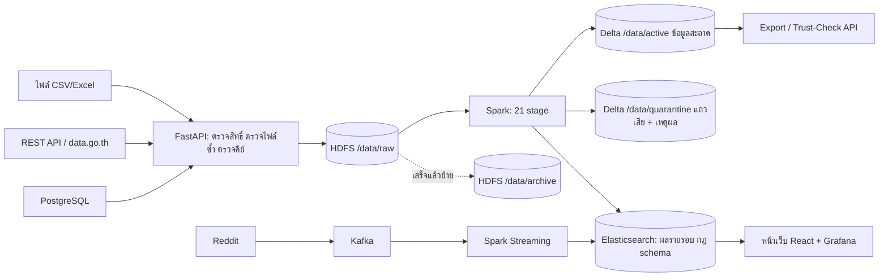

# SDOQAP อธิบายให้เข้าใจก่อนขึ้นพรีเซนต์

> เอกสารคู่กัน: [02-committee-qa.md](02-committee-qa.md) (คำถาม-คำตอบ) · [03-rubric-scorecard.md](03-rubric-scorecard.md) (ผลประเมินตามเกณฑ์)
> รายละเอียดเชิงลึกรายฟีเจอร์อยู่ใน `docs/whitebox-report/00`–`10` เอกสารนี้คือฉบับย่อสำหรับจำและเล่า

## 1. พูดให้จบใน 30 วินาที

SDOQAP (Scalable Data Observability and Quality Assurance Platform) คือระบบ ETL ที่มี "ด่านตรวจคุณภาพ" อยู่ตรงกลาง ข้อมูลจากไฟล์ ฐานข้อมูล API หรือ stream ถูกดึงเข้ามาเก็บเป็นข้อมูลดิบบน HDFS จากนั้น Spark ตรวจและทำความสะอาดทีละขั้น 21 ขั้น แถวที่ผ่านถูกโหลดเข้าโซน active แถวที่ไม่ผ่านถูกแยกไปโซน quarantine พร้อมเหตุผลรายแถว ผลของทุกรอบเก็บใน Elasticsearch แล้วแสดงบนหน้าเว็บ จุดขายคือ "อธิบายได้" ว่าแถวไหนถูกคัดออกเพราะอะไร และกฎปรับได้โดยไม่ต้องแก้โค้ด

## 2. ปัญหาที่ระบบนี้แก้

| ปัญหา | ระบบทำอะไร |
|---|---|
| ข้อมูลเสียไหลเข้ารายงาน/โมเดล (garbage in, garbage out) | คัดแถวเสียออกก่อนถึงผู้ใช้ และเก็บไว้ตรวจย้อนหลัง ไม่ลบทิ้ง |
| ต้นทางเปลี่ยนโครงสร้างตารางโดยไม่บอก (schema drift) | ตรวจพบ สร้างคำขอรออนุมัติ ไม่ปล่อยให้เปลี่ยนเอง |
| ไม่รู้ว่าข้อมูลพังตรงไหน | บันทึกทุกรอบ: กี่แถวเข้า กี่แถวผ่าน เหตุผลที่กักกัน เวลาแต่ละขั้น |
| กฎคุณภาพฝังอยู่ในโค้ด | กฎอยู่ในไฟล์ config และ Elasticsearch แก้ผ่านหน้าเว็บได้ |

## 3. ภาพรวมการไหลของข้อมูล

อ่านแผนภาพตาม ETL:

- **E (Extract)** — `services/api/app/api/pipeline.py` รับข้อมูล 4 ทาง แต่ละครั้งได้ `ingest_id` ของตัวเอง ตรวจ checksum ว่าเคยนำเข้าไฟล์นี้หรือยัง ตรวจว่ามีคอลัมน์คีย์หลัก แล้วเขียนลง `/data/raw/<ตาราง>/<ingest_id>/` จากนั้นเข้าคิวของตารางนั้น
- **T (Transform)** — Spark รัน 21 stage ตามลำดับ (ข้อ 5)
- **L (Load)** — เขียน quarantine ก่อน (ลบของ `ingest_id` เดิมแล้วเขียนใหม่ จึงรันซ้ำได้ไม่ซ้อน) แล้ว MERGE ข้อมูลสะอาดเข้า Delta ตามคีย์หลัก บันทึกผลลง Elasticsearch ย้ายไฟล์ดิบไป archive
- **ใช้ประโยชน์** — Dashboard, export CSV, Trust-Check API (`GET /api/v1/lineage/{table}/trust-check`) ให้ระบบปลายทางถามก่อนใช้ว่าตารางนี้ปลอดภัยไหม

## 4. สองเอนจิน: จุดที่คนสับสนบ่อยที่สุด

| | เอนจินโต้ตอบ (white-box) | เอนจินรอบงาน (Spark) |
|---|---|---|
| โค้ด | `services/api/app/api/whitebox.py` | `services/spark/spark_quality_engine.py` + `services/spark/sdoqap/stages/` |
| เทคโนโลยี | pandas ในหน่วยความจำของ container `api` | Spark + HDFS + Delta Lake |
| ใช้ทำอะไร | ทดลองตั้งกฎกับไฟล์เดียว เห็นผลทันที อธิบายเหตุผลทีละขั้น | ข้อมูลจริง หลายแหล่ง ขนาดใหญ่ เก็บประวัติถาวร |
| ผลลัพธ์ | 3 โซน: สะอาด / รอคนตรวจ / กักกัน | 2 โซน: active / quarantine |
| หน้าเว็บ | Audit Trail, Data Ingestion แท็บ File | Jobs & Pipelines, Workspace Exports, Dashboards, Catalog |
| ข้อจำกัด | state ชุดเดียวใช้ร่วมกันทุกคน สาธิตได้ทีละคน | เริ่มงานช้า (Spark ใช้ราว 60 วินาทีก่อนประมวลผล) |

กับชุดประเมินเดียวกัน สองเอนจินให้ผลไม่เท่ากัน: โต้ตอบ 9,400 / 100 / 600 ส่วน Spark 9,370 / 630 เพราะ Spark ใช้ Z-score เพิ่มและไม่มีโซนรอคนตรวจ ต้องรู้ไว้เพราะสองตัวเลขนี้อยู่ในหน้าเว็บทั้งคู่

## 5. 21 stage จัดเป็น 5 กลุ่ม

| กลุ่ม | stage | ทำอะไรแบบภาษาคน |
|---|---|---|
| ก. จัดโครงสร้าง | `schema_align`, `schema_drift`, `column_filter` | เปลี่ยนชื่อ/ชนิดคอลัมน์ให้ตรง schema ที่ลงทะเบียน, ตรวจว่าโครงสร้างเปลี่ยนไหม, ตัดคอลัมน์ที่ไม่อยู่ใน schema |
| ข. ทำความสะอาด | `auto_clean`, `validation`, `dedup`, `standardize_dates`, `standardize_categories` | แก้ตามกฎ DSL และตัดแถวคีย์ซ้ำ, ตรวจค่าว่าง/ชนิด/วันที่, เก็บแถวล่าสุดของคีย์ซ้ำ, แปลงวันที่ (รวม พ.ศ.), จัดคำให้เป็นหมวดเดียวกัน |
| ค. ตรวจความผิดปกติ | `range_rules`, `anomaly_iqr`, `anomaly_zscore`, `anomaly_induced` | ช่วงค่าตามกฎธุรกิจ (เช่น คะแนน 0–100), outlier ด้วย IQR, anomaly ด้วย Z-score, กฎที่ Decision Tree เรียนรู้ |
| ง. แยกโซน | `quarantine_assembly` | รวมแถวที่ไม่ผ่านจากทุกขั้นพร้อมเหตุผล |
| จ. วัดผลหลังโหลด | `distribution`, `quarantine_breakdown`, `copdq`, `freshness`, `quality_score`, `ai_advisory`, `operational_impact`, `report` | สถิติการกระจาย, สรุปเหตุผลกักกัน, มูลค่าความเสียหาย, ความสดใหม่, คะแนนคุณภาพ, คำแนะนำจาก AI, คะแนนผลกระทบ, บันทึกลง Elasticsearch |

ดูรายการจริงได้ด้วย `docker compose exec -T -w /opt/spark-apps spark-master python -m sdoqap.pipeline --json`

## 6. ที่เก็บข้อมูล

**HDFS** — `/data/raw` (ดิบ รอประมวลผล) → `/data/archive` (ดิบ ประมวลผลแล้ว เก็บไว้รันย้อนหลัง) · `/data/active` (สะอาด, Delta) · `/data/quarantine` (แถวเสีย + `reject_reason`, Delta) เทียบกับ Medallion: raw/archive = Bronze, active = Silver, ดัชนี `sdoqap_gold_*` = Gold

**Elasticsearch** — `sdoqap_quality_runs` (ผลรายรอบ), `sdoqap_runs` (สถานะการนำเข้า), `sdoqap_rules_registry` (กฎ), `sdoqap_schema_registry` / `sdoqap_schema_proposals` (schema และคำขอเปลี่ยน), `sdoqap_gold_*` (สรุปรายวันสำหรับ dashboard)

**ทำไมสองที่** HDFS เก็บข้อมูลก้อนใหญ่ที่ Spark อ่านขนานได้ ส่วน Elasticsearch เก็บเอกสารผลลัพธ์ที่โครงสร้างต่างกันตามตารางและรวมผลข้ามรอบได้เร็ว

## 7. Container 16 ตัว

จำเป็นต่อเส้นทางหลัก 8 ตัว: `elasticsearch`, `namenode`, `datanode`, `spark-master`, `spark-worker`, `api`, `ui`, `nginx` ตัวเสริม: `kibana`, `grafana`, `n8n` (แจ้งเตือน/ตั้งเวลา), `postgres` (ฐานข้อมูลต้นทางตัวอย่าง), `pgadmin`, `ollama` (LLM ในเครื่อง), `zookeeper` + `kafka` (stream) ปิดกลุ่มเสริมได้ด้วย `COMPOSE_PROFILES` ใน `.env`

## 8. ตัวเลขที่ต้องจำ และที่มา

| ตัวเลข | ค่า | ที่มา |
|---|---|---|
| ชุดประเมิน | 10,100 แถว: ถูกต้อง 9,400 + ว่าง 300 + นอกช่วง 200 + outlier 100 + ซ้ำ 100 | `data/evaluation/original/ground_truth.csv` |
| ผล Spark | active 9,370 / quarantine 630 / ตัดซ้ำ 100 | `docs/evaluation/evidence/d-batch-run.json`, `d-detection.json` |
| Detection | recall 100%, precision 95.89%, accuracy 99.7% (TP 700, FP 30, FN 0) | `d-detection.json` |
| IQR 1.5 เทียบ 3.0 | FP 101 → 30, precision 87.39% → 95.89% | `d-detection-iqr1_5.json` |
| เวลาในเอนจิน | 10K 66 วิ · 100K 85 วิ · 500K 203 วิ · 1M 414 วิ | `data/evaluation/output/bench_*.json` (หลัง Task 1 ให้ใช้ค่าใหม่จาก `d-scale.json`) |
| คอขวดที่ 1M | `quarantine_assembly` 146 วิ, `anomaly_iqr` 57 วิ, `operational_impact` 56 วิ, `anomaly_zscore` 49 วิ | `bench_1000000.json` |
| ปริมาณสะสม | 3,576,836 แถว, 183 รอบ, คะแนนคุณภาพเฉลี่ย 94.61, กักกัน 169,851 แถว | `GET /api/v1/kpi/stats` (2026-10-02 ตรวจซ้ำก่อนพรีเซนต์) |
| การทดสอบ | API 156, UI 76, สคริปต์ประเมิน 21, สคริปต์ 18, Spark unit 60 | `docs/testing/evidence/t0-*.txt` (2026-10-01) |
| ทดสอบการใช้งานจริง | 88 ข้อ: ผ่าน 66, ไม่ผ่าน 18, ข้าม 4; บั๊กระดับสูง 6 ตัวแก้แล้วทั้งหมด | `docs/testing/2026-10-01-real-use-test-report.md` |

ข้อมูล 100 เท่า (10K → 1M) ใช้เวลาเพิ่ม 6.3 เท่า เพราะราว 60 วินาทีแรกเป็นต้นทุนคงที่ของการเริ่ม Spark

## 9. คำศัพท์ที่กรรมการอาจให้อธิบาย

| คำ | ความหมายในระบบนี้ |
|---|---|
| IQR (Tukey) | Q1 − k·IQR ถึง Q3 + k·IQR; k=1.5 (inner fence) จับเยอะ, k=3.0 (outer fence) จับเฉพาะค่าสุดโต่ง ระบบใช้ 3.0 กับชุดประเมิน |
| Z-score | ห่างจากค่าเฉลี่ยกี่ส่วนเบี่ยงเบนมาตรฐาน ระบบกักกันเมื่อเกิน 3 |
| Precision / Recall | Precision = ที่กักกันไว้ ผิดจริงกี่ % · Recall = ที่ผิดจริง จับได้กี่ % |
| Quarantine | โซนเก็บแถวที่ไม่ผ่าน พร้อมเหตุผล ไม่ลบทิ้ง เพื่อแก้แล้วนำกลับมาได้ |
| Schema drift | โครงสร้างข้อมูลที่เข้ามาไม่ตรงกับที่ลงทะเบียน เช่น มีคอลัมน์ใหม่ |
| Delta MERGE | upsert ตามคีย์หลัก: คีย์ที่มีอยู่แล้วอัปเดต คีย์ใหม่เพิ่ม รันซ้ำได้ไม่เกิดแถวซ้ำ |
| Idempotent | รันซ้ำกี่ครั้งผลเท่าเดิม |
| PSI | Population Stability Index วัดว่าการกระจายของข้อมูลรอบนี้ต่างจากรอบก่อนแค่ไหน |
| COPDQ | Cost of Poor Data Quality ประมาณมูลค่าความเสียหายจากแถวเสีย: Spark รวมคอลัมน์มูลค่าเงินของแถวที่กักกัน (ถ้าตารางมี) แล้ว API บวกค่าแก้ไข $2 ต่อแถว ค่าคงที่เป็นค่าสมมติ |
| Trust-Check | API ที่ตอบว่าตารางปลอดภัยให้ใช้ไหม จากคะแนนล่าสุดเทียบเกณฑ์ และคำขอ schema ที่ค้าง |
| Medallion | Bronze (ดิบ) → Silver (สะอาด) → Gold (สรุปพร้อมใช้) |

## 10. ข้อจำกัดที่ควรพูดเองก่อนถูกถาม

1. วัดความแม่นยำกับชุดข้อมูลสังเคราะห์ชุดเดียว เกณฑ์ IQR/Z-score เป็นค่าของกรณีทดสอบนี้
2. Z-score กักกันนักศึกษาที่สอบตกจริง 21 คน ทำให้รายชื่อต้องติดตามเหลือ 5 จาก 28
3. คะแนนที่ว่างถูกเติม 0 แล้วจับด้วย IQR ไม่ได้จับในฐานะค่าว่าง
4. แถวซ้ำถูกตัดทิ้งโดยไม่เก็บใน quarantine
5. เอนจินโต้ตอบใช้ได้ทีละคน และปุ่ม "เชื่อมต่อ" ของแท็บ DB/API/Stream เป็นโหมดสาธิต
6. ยังไม่ได้วัดผลของฟีเจอร์นวัตกรรมแยกรายตัว

รายละเอียดและตัวเลขของแต่ละข้ออยู่ใน [03-rubric-scorecard.md](03-rubric-scorecard.md)
