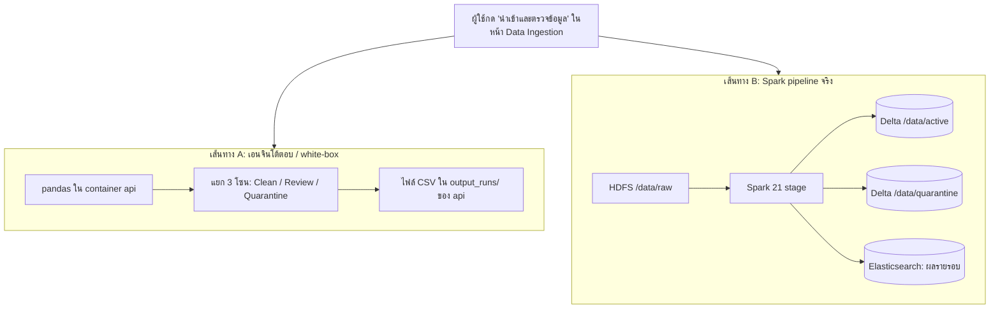

# SDOQAP คู่มือการใช้งานทีละหน้า และ User Journey

> เอกสารชุดเดียวกัน: [01-system-explainer.md](01-system-explainer.md) (ภาพรวมระบบ) · [02-committee-qa.md](02-committee-qa.md) · [03-rubric-scorecard.md](03-rubric-scorecard.md)
> ทุกข้อในเอกสารนี้ตรวจกับโค้ดใน branch `new-optimizer` แล้ว (2026-10-02) ชื่อปุ่มและข้อความเขียนตามที่ปรากฏบนหน้าเว็บจริง

---

## ส่วนที่ 0: เรื่องเดียวที่ต้องเข้าใจก่อน — ระบบมี "สองเส้นทาง"

เหตุผลหลักที่ทำให้งงคือหลายหน้ามีตัวเลขสองชุดที่ไม่เท่ากัน เพราะหลังบ้านมีเอนจินสองตัวทำงานพร้อมกัน

| | เส้นทาง A: เอนจินโต้ตอบ | เส้นทาง B: Spark |
|---|---|---|
| ความเร็ว | เห็นผลทันที (ไม่ถึง 1 วินาที) | ราว 1–2 นาทีต่อรอบ (Spark ใช้เวลาเริ่มราว 60 วินาที) |
| ใช้กับข้อมูลแบบไหน | **เฉพาะไฟล์ที่มีคอลัมน์ `student_id, course, score, study_hours`** | ข้อมูลตารางใดก็ได้ |
| กฎ | 3 กฎตายตัว: ช่วงคะแนน+ค่าว่าง, คีย์ซ้ำ, ค่าผิดปกติ study_hours | กฎใน `rules_config.json` / Elasticsearch ปรับได้ต่อตาราง |
| ผลลัพธ์ | 3 โซน: Clean / Review / Quarantine | 2 โซน: active / quarantine |
| เก็บถาวร? | ไม่ เก็บแค่ไฟล์ CSV ล่าสุดชุดเดียว ใช้ร่วมกันทุกคน | ใช่ ทุกรอบเก็บใน HDFS + Elasticsearch |
| เห็นในหน้า | ส่วนบนของ Ingestion, Expectations & Alerts, Jobs & Pipelines, Workspace Exports และหน้า Audit Trail ทั้งหน้า | ส่วนที่พับไว้ "ตั้งค่าขั้นสูง" / "ประวัติการรัน" / "ส่งออกตารางอื่น", Dashboards, Query & Metrics, Catalog |

**จำง่าย ๆ:** ส่วน *บน* ของหน้าขั้นตอน 1–4 คือ "สนามทดลอง" (เส้นทาง A) ส่วน *ที่พับไว้ด้านล่าง* และหน้ากลุ่ม "ติดตามและตรวจสอบ" คือ "ของจริง" (เส้นทาง B)

ตัวอย่างความต่าง: ไฟล์ประเมิน 10,100 แถว เส้นทาง A ได้ 9,400 / 100 / 600 (Clean/Review/Quarantine) ส่วนเส้นทาง B ได้ active 9,370 / quarantine 630 เพราะ Spark ใช้ Z-score เพิ่มและไม่มีโซน Review

---

## ส่วนที่ 1: ก่อนเริ่มใช้

### 1.1 เปิดระบบ

1. ใน `.env` ที่ root ของโปรเจกต์ ต้องมี `ADMIN_USERNAME`, `ADMIN_PASSWORD`, `SESSION_SECRET_KEY` (ดูตัวอย่างใน `.env.example`) ถ้าไม่มี การ login จะล้มเหลว
2. รัน `start_system.bat` แล้วรอจน script เปิดเว็บให้เอง
3. เปิด `http://localhost:8002/`

### 1.2 Login

- ทุกหน้ายกเว้น Home ต้อง login ถ้ายังไม่ login ระบบพาไปหน้า `/login` เอง
- มีบัญชีผู้ดูแลเพียงบัญชีเดียว คือค่าที่ตั้งใน `.env` ไม่มีการสมัครสมาชิกและไม่มีระบบสิทธิ์แยกบทบาท
- session อยู่ได้ 12 ชั่วโมง
- **ข้อควรระวัง:** หลายปุ่มส่งคำสั่งด้วย `fetch` ตรง ๆ ถ้า session หมดอายุ ปุ่มจะไม่ทำงานและไม่มีข้อความเตือน ถ้ากดแล้วไม่มีอะไรเปลี่ยน ให้ลอง Logout แล้ว Login ใหม่ก่อน

### 1.3 ดูว่าระบบพร้อมหรือยัง

มุมล่างของแถบเมนูซ้ายมีบรรทัดสถานะ (อัปเดตทุก 15 วินาที):

| ข้อความ | ความหมาย |
|---|---|
| ระบบปกติ | ครบทั้ง 11 บริการ |
| N บริการออฟไลน์ | เอาเมาส์ชี้เพื่อดูว่าตัวไหนดับ ถ้าเป็น Kafka/Postgres อาจเพราะปิด profile ไว้ใน `COMPOSE_PROFILES` |
| เชื่อมต่อ API ไม่ได้ | container `api` ยังไม่ขึ้น ใช้งานไม่ได้เลย |

### 1.4 แถบเมนูซ้าย

- **+ นำเข้าข้อมูล** — ทางลัดไปหน้า Data Ingestion
- **ขั้นตอนการทำงาน** — 4 หน้าที่มีเลข 1–4 ทำตามลำดับ
- **ติดตามและตรวจสอบ** — หน้าดูผล ไม่บังคับลำดับ
- ป้าย **"N รอ"** บน Catalog = จำนวนคำขอเปลี่ยน schema ที่รออนุมัติ บน Expectations & Alerts = จำนวนข้อเสนอกฎจาก AI (ถ้ายังไม่มีข้อเสนอจริง ระบบจะแสดงตัวอย่าง 3 รายการ ป้ายจึงขึ้นเกือบตลอด)
- กด **Ctrl+K** เพื่อค้นหาและกระโดดไปหน้าใดก็ได้

---

## ส่วนที่ 2: ขั้นแรก — นำเข้าข้อมูล ต้องเป็นข้อมูลแบบไหน ไฟล์แบบไหน

### 2.1 ช่องทางนำเข้าทั้งหมด

| ช่องทาง | ในหน้าเว็บ | รับอะไร | ทำงานจริงไหม |
|---|---|---|---|
| **ไฟล์** | แท็บ "ไฟล์" | `.csv`, `.xlsx`, `.xls` | **จริง** ส่งเข้าทั้งเส้นทาง A และ B |
| **ฐานข้อมูล** | แท็บ "ฐานข้อมูล" | PostgreSQL เท่านั้น ใช้คำสั่ง `SELECT` | **จริง** ส่งเข้าเส้นทาง B |
| **API** | แท็บ "API" | — | **โหมดสาธิต** ไม่ได้ดึง URL จริง แค่ตรวจข้อมูลชุดที่โหลดไว้อยู่แล้วซ้ำ |
| API (ของจริง) | ไม่มีในหน้าเว็บ ใช้ `test_data_source.bat` ข้อ 2 | JSON array, JSON object, JSON ที่มี `result.records` / `records` / `data` / `items`, หรือ CSV | **จริง** ส่งเข้าเส้นทาง B |
| **Stream** | แท็บ "Stream" | Reddit ผ่าน Kafka | เริ่ม Reddit stream จริง (ต้องเปิด profile `streaming`) แต่ช่อง Broker/Topic/Group ไม่ได้ใช้จริง ผลตรวจที่ขึ้นเป็นโหมดสาธิต |

**สรุป:** ถ้าจะใช้งานจริงผ่านหน้าเว็บ ใช้แท็บ **ไฟล์** หรือ **ฐานข้อมูล** เท่านั้น

### 2.2 ไฟล์ต้องมีหน้าตาแบบไหน

**เงื่อนไขบังคับ (ไม่ผ่านจะขึ้น error):**

| เงื่อนไข | ค่า | ถ้าไม่ผ่าน |
|---|---|---|
| นามสกุล | `.csv`, `.xlsx`, `.xls` | เลือกไฟล์ไม่ได้ |
| ขนาด | ไม่เกิน 200 MB (`MAX_UPLOAD_MB` ใน `.env`) | HTTP 413 |
| ไฟล์ว่าง | ต้องมีข้อมูล | "Uploaded file is empty." |
| แถวแรก | ต้องเป็นหัวคอลัมน์ (header) | Spark จะอ่านแถวแรกเป็นชื่อคอลัมน์เสมอ |
| ชื่อตาราง | ตัวอังกฤษ ตัวเลข `_` หรือ `-` ยาวไม่เกิน 128 ตัว | ช่องในหน้าเว็บแปลงตัวอื่นเป็น `_` ให้อัตโนมัติ |
| คีย์หลัก | ถ้าตารางนี้มี schema ลงทะเบียนไว้ ไฟล์ต้องมีคอลัมน์คีย์หลักครบ | "File is missing primary key column(s) …" |

**ข้อแนะนำ (ไม่บังคับ แต่ผลจะดีกว่า):**

- **CSV ให้บันทึกเป็น UTF-8** ไฟล์ภาษาไทยแบบ TIS-620/ANSI จะอ่านไม่ได้หรือได้ตัวอักษรเพี้ยน (ใน Excel ใช้ "CSV UTF-8")
- **Excel อ่านเฉพาะ sheet แรก** ถ้ามีหลาย sheet ให้ย้ายข้อมูลที่ต้องการไปไว้ sheet แรก
- เป็น**ข้อมูลตาราง** 1 แถว = 1 รายการ ไม่มีเซลล์ผสาน ไม่มีแถวสรุปท้ายตาราง
- **มีคอลัมน์รหัส** (ชื่อมีคำว่า `id`) เพราะระบบใช้หาคีย์หลัก
- ถ้ามีคอลัมน์วันที่ (เช่น `updated_at`) ระบบใช้วัดความสดใหม่ (freshness) และรองรับปี พ.ศ.

### 2.3 ไฟล์ที่ "ตรวจในหน้าเว็บได้เต็มรูปแบบ" กับ "ไฟล์ทั่วไป"

ตรงนี้คือจุดที่งงที่สุด:

| | ไฟล์ที่มีคอลัมน์ `student_id, course, score, study_hours` | ไฟล์ทั่วไป (เช่น ยอดขาย, ลูกค้า) |
|---|---|---|
| การ์ดผลตรวจ 3 ใบในหน้า Ingestion | แสดงครบ | ขึ้นข้อความ "การตรวจคุณภาพอัตโนมัติรองรับเฉพาะข้อมูลที่มีคอลัมน์ …" |
| หน้า Expectations / Jobs / Exports ส่วนบน | ใช้ไฟล์นี้ | **ยังแสดงข้อมูลชุดเดิม** (หัวหน้าอาจขึ้นชื่อไฟล์ใหม่ แต่ตัวเลขเป็นของชุดเก่า) |
| Spark pipeline (เส้นทาง B) | ทำงาน | ทำงาน |
| ดูผลที่ไหน | ทุกหน้า | Jobs & Pipelines → "ประวัติการรัน", Workspace Exports → "ส่งออกตารางอื่น", Dashboards, Query & Metrics |

### 2.4 ระบบหาคีย์หลักอย่างไร

ถ้าตารางนี้**ลงทะเบียนไว้แล้ว**ใน `services/spark/schema_registry.json` ระบบใช้คีย์ตามนั้น เช่น `student_course_scores` ใช้ `student_id + course + semester`

ถ้า**ยังไม่ลงทะเบียน** (ตารางใหม่) Spark จะเดาเอง:

1. หาคอลัมน์ชื่อ `id` หรือ `<ชื่อตาราง>_id` ก่อน แล้วจึงหาคอลัมน์อื่นที่ชื่อมีคำว่า `id`
2. ถ้าคอลัมน์นั้นมีค่าไม่ซ้ำอย่างน้อย 90% ใช้เป็นคีย์
3. ถ้าไม่ถึง ลองรวมกับคอลัมน์ข้อความหรือวันที่ (สูงสุด 3 คอลัมน์)
4. ถ้าหาไม่ได้เลย ใช้ hash ของทั้งแถวแทน (ทุกแถวถูกเก็บไว้ แต่การตัดแถวซ้ำจะจับได้เฉพาะแถวที่เหมือนกันทุกคอลัมน์)

รอบแรกของตารางใหม่ Spark จะบันทึก schema ที่เดาได้ลงทะเบียนให้ รอบถัดไปถ้าโครงสร้างเปลี่ยน จะเกิดคำขอในหน้า Catalog

### 2.5 ไฟล์ตัวอย่างที่พร้อมใช้

| ไฟล์ | ใช้ทดสอบอะไร |
|---|---|
| `data/evaluation/original/dirty_dataset.csv` (10,100 แถว) | **แนะนำที่สุด** ใช้ได้ครบทุกฟีเจอร์ มีเฉลยใน `ground_truth.csv` |
| `data/samples/dirty_course_scores_demo.csv` | ไฟล์คะแนนขนาดเล็ก ใช้ได้ทุกหน้า |
| `data/samples/student_scores/student_scores_sample.csv` | ไฟล์คะแนนอีกชุด มีเฉลย |
| `data/inputs/datasets/customer_churn_100k.csv` | ไฟล์ทั่วไป ใช้ทดสอบเส้นทาง B เท่านั้น |
| `data/samples/global_ecommerce_sales.csv` | ข้อมูลยอดขาย มีกฎลงทะเบียนไว้แล้ว |
| ตาราง `sales_records` ใน PostgreSQL ที่มากับระบบ | ทดสอบแท็บ "ฐานข้อมูล" |

---

## ส่วนที่ 3: แต่ละหน้าทำอะไร ใช้ยังไง ทำอะไรต่อ

รูปแบบของแต่ละหน้า: **ทำอะไร** → **ปุ่มและการใช้งาน** → **ข้อควรรู้** → **ไปต่อ**

---

### 3.1 Home (`/`) — ไม่ต้อง login

**ทำอะไร:** หน้าต้อนรับและสรุปสถานะระบบ

| ส่วน | ความหมาย |
|---|---|
| ปุ่ม **เริ่มนำเข้าข้อมูล** | ไปหน้า Data Ingestion (ถ้ายังไม่ login จะไปหน้า Login ก่อน) |
| ปุ่ม **อ่านคู่มือ** | ไปหน้า Learn & Architecture |
| LIVE INGESTION CHANNELS | สถานะ Kafka / Postgres / REST API: ACTIVE = ครบ, PARTIAL = บางตัว, OFFLINE = ไม่มีเลย |
| AVG Quality Score / Records Checked / Quarantine Rate | สถิติสะสมของ Spark ทุกรอบ (ขึ้น "---" ถ้ายังไม่เคยรัน) |
| Live Infrastructure Connections | 11 บริการ จุดเขียว = ONLINE |
| 4 ขั้นตอน | การ์ดลิงก์ไปหน้า 1–4 |
| เริ่มจากบทบาทของคุณ | Data Engineer → Ingestion, Data Steward → Catalog, ผู้บริหาร → Dashboards, Analyst/ML → Exports |

**ไปต่อ:** กด "เริ่มนำเข้าข้อมูล"

---

### 3.2 Learn & Architecture (`/guide`)

**ทำอะไร:** คู่มือในตัวระบบ อ่านอย่างเดียว ไม่มีปุ่มที่เปลี่ยนข้อมูล

| แท็บ | เนื้อหา |
|---|---|
| **พารามิเตอร์** (ค่าเริ่มต้น) | อธิบายกฎ 5 ชุด: เกณฑ์คะแนนคุณภาพ, คีย์หลักและค่าว่าง, ช่วงค่าและ IQR (สูตร `[Q1 − k×IQR, Q3 + k×IQR]`, k=1.5 มาตรฐาน / 3.0 เฉพาะค่าสุดโต่ง), ความสดใหม่ (SLA), AI Remediation กด "รายละเอียดและค่าแนะนำ" เพื่อดูค่าที่แนะนำ |
| **แต่ละหน้า** | รายชื่อทุกหน้าพร้อมคำอธิบายสั้น ๆ กดเพื่อไปหน้านั้นได้ |
| **สถาปัตยกรรม** | 4 Phase: Landing → Schema Contract → Spark Audit → Serving (หมายเหตุ: ในนี้เรียก Catalog ด้วยชื่อเก่าว่า "Schema Drift Hub") |
| **กรณีศึกษา** | ตารางนโยบายตัวอย่าง ว่ากฎแต่ละข้อเชื่อมกับความต้องการทางธุรกิจอย่างไร |

**ไปต่อ:** การ์ด "ขั้นที่ 1"

---

### 3.3 ขั้นที่ 1: Data Ingestion (`/ingestion`)

**ทำอะไร:** นำข้อมูลเข้า แล้วแสดงผลสำรวจเบื้องต้น (profiling) ทันที

#### การ์ด "แหล่งข้อมูล"

**แท็บ ไฟล์**

1. ลากไฟล์มาวาง หรือกดกรอบ "เลือกไฟล์ หรือลากมาวางที่นี่" กรอบจะเปลี่ยนเป็นชื่อไฟล์และขนาด (กดอีกครั้งเพื่อเปลี่ยนไฟล์)
2. ช่อง **ชื่อตาราง** ระบบเติมจากชื่อไฟล์ให้ **แก้ได้และควรแก้** เพราะชื่อนี้เป็นชื่อตารางใน HDFS และใช้หากฎกับ schema ที่ลงทะเบียนไว้ (เช่น ไฟล์ `dirty_dataset.csv` ควรตั้งเป็น `student_course_scores` เพื่อใช้กฎที่ตั้งไว้)
3. กด **นำเข้าและตรวจข้อมูล** ระบบทำ 2 อย่างพร้อมกัน:
   - ส่งเข้าเอนจินโต้ตอบ (A) → ขึ้น "นำเข้า '…' แล้ว (N แถว)" และการ์ดผลตรวจด้านล่าง
   - ส่งเข้า Spark (B) → ขึ้นบรรทัด **สถานะรอบ:** แล้วเปลี่ยนเองตามลำดับ

| สถานะรอบ | ความหมาย |
|---|---|
| รอคิวตรวจ | ไฟล์ลง HDFS แล้ว รอ Spark |
| กำลังตรวจคุณภาพ | Spark กำลังทำงาน (ราว 1–2 นาที) |
| ตรวจเสร็จแล้ว | ไปดูผลที่ Jobs & Pipelines → ประวัติการรัน |
| ตรวจไม่สำเร็จ | ดูรายละเอียดในประวัติการรัน แล้วกด Retry ได้ |
| ข้าม เพราะมีรอบอื่นกำลังใช้ตารางนี้ | ตารางเดียวกันรันได้ทีละรอบ รอแล้วส่งใหม่ |
| สั่งตรวจไม่สำเร็จ | ติดต่อ Spark trigger daemon ไม่ได้ ตรวจว่า `spark-master` ทำงานอยู่ |

ถ้าขึ้น **"เคยนำเข้าไฟล์นี้แล้ว (รอบ …) จึงไม่ส่งตรวจซ้ำ"** แปลว่าไฟล์เนื้อหาเดียวกันเคยส่งเข้าตารางนี้แล้ว (ตรวจจาก checksum) ถ้าต้องการรันใหม่ ให้ไปกด **Retry** ในหน้า Jobs & Pipelines

**แท็บ ฐานข้อมูล** (ของจริง)

| ช่อง | ใส่อะไร |
|---|---|
| Engine | PostgreSQL (เปลี่ยนไม่ได้) |
| Host & Port | ฐานข้อมูลที่มากับระบบใช้ `postgres` และ `5432` host ต้องอยู่ใน `RDBMS_ALLOWED_HOSTS` ของ `.env` |
| Database Name / Username / Password | ตาม `POSTGRES_DB` / `POSTGRES_USER` / `POSTGRES_PASSWORD` ใน `.env` |
| Source Table Name | ชื่อตารางต้นทาง เช่น `sales_records` และใช้เป็นชื่อตารางปลายทางด้วย |
| คำสั่ง SQL | ไม่บังคับ ถ้าเว้นว่างใช้ `SELECT * FROM <ตาราง>` ต้องขึ้นต้นด้วย `SELECT` คำสั่งเดียว ได้ไม่เกิน 1,000,000 แถว และหมดเวลาที่ 30 วินาที |

กด **ดึงข้อมูลจากฐานข้อมูล** แล้วระบบเปิดการเชื่อมต่อแบบอ่านอย่างเดียว ดึงแถว ลง HDFS และเข้าคิว Spark (ส่งเข้าเส้นทาง B อย่างเดียว การ์ดผลตรวจด้านล่างไม่เปลี่ยน)

**แท็บ API / Stream:** ดูข้อ 2.1 ถ้ากดแล้วขึ้น "โหมดสาธิต: ยังไม่ได้เชื่อมต่อ … จริง" แปลว่าไม่ได้ดึงข้อมูลใหม่

#### การ์ด "ผลตรวจข้อมูล" (เส้นทาง A)

- แถบสรุป: แถวทั้งหมด / คอลัมน์ / แถวไม่ซ้ำ / ประเด็นที่ต้องดูแล (x / 3)
- การ์ด 3 ใบ (เฉพาะไฟล์คะแนนนักศึกษา):

| การ์ด | ตรวจอะไร | ปลายทางของแถวที่เจอ |
|---|---|---|
| **ค่าว่างและช่วงค่า** (`score`) | คะแนนว่าง ต่ำสุด → สูงสุด | Quarantine |
| **เรคคอร์ดซ้ำ** (`student_id + course + semester`) | คีย์ซ้ำ | Quarantine |
| **ค่าผิดปกติ** (`study_hours`) | ค่านอกช่วง Q1/Q3 ± 1.5×IQR | Review |

- ในการ์ดแต่ละใบ:
  - **ทำไมถึงเป็นปัญหา** — คำอธิบาย
  - **ดูตัวอย่าง** — แสดงแถวที่ติดปัญหา 5 แถว
  - ช่องติ๊ก **ใช้สร้างเกณฑ์** — บอกระบบว่าจะใช้ประเด็นนี้สร้างกฎ (บันทึกทันที)
- **ค้นหาเรคคอร์ด** — ค้นในข้อมูลดิบด้วยรหัสนักศึกษา วิชา หรือค่าใดก็ได้
- ปุ่ม **ตรวจใหม่** — โหลดผล profiling ใหม่

**ข้อควรรู้:** การ์ดค่าผิดปกติใช้ 1.5×IQR ตายตัวเสมอ ไม่เปลี่ยนตามค่าที่ตั้งในหน้า Expectations

**ไปต่อ:** ปุ่ม **ถัดไป: Expectations & Alerts →**

---

### 3.4 ขั้นที่ 2: Expectations & Alerts (`/rules`)

**ทำอะไร:** ตั้งกฎคุณภาพ ส่วนบนตั้งกฎของเอนจินโต้ตอบ (A) ส่วนพับ "ตั้งค่าขั้นสูง" ตั้งกฎของ Spark (B) รายตาราง

#### ส่วนบน (เส้นทาง A)

บรรทัด "ชุดข้อมูล `<ชื่อ>` · N แถว" บอกว่ากำลังตั้งกฎให้ข้อมูลชุดไหน

| การ์ด | กฎ | ปรับอะไรได้ (กด "ปรับค่า") | ไม่ผ่านแล้วไปไหน |
|---|---|---|---|
| **กฎที่ 1: ช่วงคะแนนและค่าว่าง** | `score BETWEEN min AND max AND NOT NULL` | คะแนนต่ำสุด (0), คะแนนสูงสุด (100) | Quarantine |
| **กฎที่ 2: ห้ามคีย์ซ้ำ** | `UNIQUE (คีย์)` | คีย์หลัก: `student_id + course + semester` หรือ `record_id` | แถวซ้ำ (ยกเว้นแถวแรก) → Quarantine |
| **กฎที่ 3: ค่าผิดปกติ** | `study_hours <= Q3 + k × IQR` | ตัวคูณ k: 3.0 (เข้มน้อย) หรือ 1.5 (เข้มมาก) | Review |

- ติ๊ก **Active (…)** เพื่อเปิด/ปิดกฎ ตัวเลขในวงเล็บคือจำนวนแถวที่ติดกฎ
- ทุกการเปลี่ยนค่าบันทึกและคำนวณใหม่ทันที
- ตาราง "สรุป" ด้านล่างบอก กฎ / คอลัมน์ / เมื่อไม่ผ่าน / แถวที่ติด / % ผ่าน
- ปุ่ม **บันทึกกฎ** ยืนยันกฎทั้งชุด ปุ่มจะเปลี่ยนเป็น "บันทึกแล้ว HH:MM:SS"

**ข้อควรรู้:** ข้อความยืนยัน "ยืนยันและประมวลผลกฎบน N แถวสำเร็จ: Clean … | Review … | Quarantine …" แสดงอยู่ในส่วน "ตั้งค่าขั้นสูง" ที่พับไว้ และขึ้นแม้การบันทึกล้มเหลว ถ้าไม่แน่ใจให้ไปดูตัวเลขในหน้าถัดไป ส่วนตัวเลข "12.0h / 9.0h" ในตัวเลือก k เป็นข้อความตายตัว ค่าจริงคำนวณจากข้อมูล

#### ส่วนพับ "ตั้งค่าขั้นสูง: ตารางอื่น, AI, Governance" (เส้นทาง B)

| แท็บ | ใช้ทำอะไร |
|---|---|
| **กฎรายตาราง** | ซ้าย: รายชื่อตารางใน HDFS (ไอคอนถังขยะ = **ลบตารางทั้งหมดถาวร**) ขวา: 3 แท็บย่อย ↓ |
| ↳ Rules Editor | Quality Validation Mode (Strict = ค่าตายตัว / Adaptive = เรียนรู้จากประวัติ), Base Target Score (%) เกณฑ์ผ่าน, Data Freshness Mode + Max Allowed Delay (ชั่วโมง), Null Checks Mode, Outliers (IQR) Mode (Off / Auto IQR / Adaptive), Enable AI Rule Advisor กด **Save Rule Overrides** → ยืนยัน → มีผลกับรอบ Spark ถัดไป (เก็บสำรองไว้ 10 เวอร์ชัน) |
| ↳ YAML DSL Export | ดู/คัดลอก/ดาวน์โหลดกฎเป็น YAML (สร้างในเบราว์เซอร์ ไม่ได้เปลี่ยนกฎ) |
| ↳ Column Profiler | % ค่าว่าง และขอบ IQR ของแต่ละคอลัมน์จากรอบ Spark ล่าสุด (ต้องรัน Spark กับตารางนี้แล้วอย่างน้อย 1 รอบ) |
| **ข้อเสนอจาก AI** | ข้อเสนอปรับกฎจาก AI Advisor กด **Approve & Merge** เพื่อรวมเข้ากฎ หรือ **Reject Proposal** (ระบบกันไว้: เกณฑ์คะแนนลดไม่ต่ำกว่า 70% และลดครั้งละไม่เกิน 10%) ถ้าขึ้นแถบเหลือง "แสดงตัวอย่าง" แปลว่ายังไม่มีข้อเสนอจริง การกดอนุมัติจะไม่เปลี่ยนกฎ |
| **ตั้งค่า AI** | ใส่ Groq API key และเลือกรุ่นโมเดล ถ้าไม่เปิด จะใช้กฎ heuristic ในเครื่องแทน |
| **แจ้งแก้ต้นทาง** | ตั๋วแจ้งปัญหาไปยังเจ้าของข้อมูลต้นทาง (สร้างโดย Spark) กด **Close Ticket** เมื่อแก้แล้ว |
| **มาตรฐานข้อมูล** | คิวคำที่ระบบจับคู่หมวดหมู่ไม่ได้ (เช่น "BKK" กับ "Bangkok") กด **Approve** / **Override** (พิมพ์หมวดเอง) / **Reject** |

**ไปต่อ:** ปุ่ม **ถัดไป: Jobs & Pipelines →**

---

### 3.5 ขั้นที่ 3: Jobs & Pipelines (`/pipeline`)

**ทำอะไร:** ดูผลการคัดแยก 3 โซน ตัดสินแถวที่รอคนตรวจ และดูประวัติรอบ Spark

#### ส่วนบน (เส้นทาง A)

- ปุ่ม **รัน Pipeline** — คำนวณ 3 โซนใหม่ด้วยกฎปัจจุบัน **(ไม่ได้สั่ง Spark)**
- ปุ่ม **สร้าง Gold ใหม่** — สั่ง Spark รวมข้อมูล Clean เป็นตารางสรุปรายวันให้ Dashboard (ทำงานเบื้องหลัง หน้าเว็บไม่แสดงผลลัพธ์)
- **Funnel:** นำเข้า → Gate 1 กักกัน (ค่าว่าง/นอกช่วง) → Gate 2 กักกัน (ซ้ำ) → Review → Clean กดแต่ละขั้นเพื่อกรองตารางด้านล่าง

| การ์ด | ความหมาย | ปุ่ม |
|---|---|---|
| **Clean** | ผ่านทุกกฎ หรือคนอนุมัติแล้ว | ดูในตาราง |
| **Review** | ค่าผิดปกติ ส่งให้คนตัดสินแทนการลบ | **อนุมัติ** (ย้ายทั้งหมดไป Clean) / **กักกัน** (ย้ายทั้งหมดไป Quarantine) / **คืนค่า** (ย้อนกลับ) |
| **Quarantine** | ค่าว่าง นอกช่วง หรือซ้ำ | ดูในตาราง / **แจ้งแก้ต้นทาง** (เปลี่ยนสถานะในหน้านี้เท่านั้น ไม่ได้สร้างตั๋วจริง) |

- ตาราง **ตรวจสอบรายแถว**: ค้นหาด้วย Row ID / รหัสนักศึกษา / วิชา กรองตามโซน ดูคอลัมน์ "ประเภทปัญหา" และ "เหตุผล" ของแต่ละแถว แต่ละแถวมีปุ่ม **อนุมัติ** (บังคับไป Clean) / **กักกัน** (บังคับไป Quarantine) โดยไม่มีหน้าต่างยืนยันและย้อนรายแถวไม่ได้ แสดงสูงสุด 15 แถว

#### ส่วนพับ "ประวัติการรัน" (เส้นทาง B)

- ค้นหาด้วยชื่อตารางหรือรหัสรอบ และกรองตามตาราง
- **Recent Pipeline Ingestion Runs**: สถานะ SUCCESS / FAILED / QUARANTINED, ระยะเวลา
  - **ดูข้อมูล** — เปิดแผงแถวข้อมูลจริงของตาราง สลับ "แถวที่ผ่าน" / "แถวที่ถูกกักกัน" (มีคอลัมน์ `reject_reason` สีแดง) ติ๊ก "เฉพาะแถวจากรอบนี้" ได้
  - **Retry** — สั่งรันรอบนั้นใหม่ (เฉพาะรอบที่ล้มเหลวหรือถูกกักกัน) รอบใหม่ขึ้นภายใน 30 วินาที
- **Quality Audit Logs**: Total / Clean / Quarantined / Quality Score ของแต่ละรอบ (เขียว ≥95, เหลือง ≥85, แดง ต่ำกว่านั้น)

**ไปต่อ:** ปุ่ม **ถัดไป: Workspace Exports →**

---

### 3.6 ขั้นที่ 4: Workspace Exports (`/export`)

**ทำอะไร:** ดาวน์โหลดผลลัพธ์ **ทุกไฟล์เป็น CSV** (ไม่มี Excel/JSON)

#### ส่วนบน: ไฟล์ 3 โซน (เส้นทาง A)

- แถบเขียว/แดง **Trust-check**: ตารางชื่อเดียวกันในเส้นทาง B ผ่านเกณฑ์คุณภาพหรือยัง (ต้องมีรอบ Spark แล้ว และไม่มี schema ค้างอนุมัติ) ถ้าขึ้น "No quality runs found for this table." แปลว่ายังไม่เคยรัน Spark กับชื่อนี้

| ไฟล์ | โซน |
|---|---|
| `certified_gold_clean.csv` | Clean |
| `human_review_outliers.csv` | Review |
| `quarantine_root_cause_audit.csv` | Quarantine (มีคอลัมน์ `whitebox_error_type`, `whitebox_rule_applied` บอกเหตุผล) |

- แต่ละแถวมี **ดูตัวอย่าง** / **คัดลอก API URL** (ให้ระบบอื่นดึงไฟล์ผ่าน REST) / **ดาวน์โหลด**
- แถบตัวกรอง: ค้นหา, **แสดง:** (จำนวนแถวตัวอย่าง), **ชื่อไฟล์:** (คำนำหน้าชื่อไฟล์) ไฟล์ที่ได้ชื่อเช่น `student_course_scores_clean_9400rows.csv`
- **ข้อควรรู้:** การค้นหาและ "แสดง:" มีผลกับตัวอย่างเท่านั้น ไฟล์ที่ดาวน์โหลดคือทั้งโซนเสมอ ถ้ายังไม่มีข้อมูล ตัวเลขจะขึ้นค่าตัวอย่าง 9400/100/600

#### ส่วนพับ "ส่งออกตารางอื่น" (เส้นทาง B)

**แท็บ ตาราง Pipeline:** เลือก **Target Data Layer** แล้วเลือก **Table Source** แล้วกด **Export CSV File**

| Layer | ได้อะไร |
|---|---|
| Active Layer (Silver/Clean) | ข้อมูลสะอาดจาก Delta (เปิดใน Excel แล้วภาษาไทยถูกต้อง) |
| Raw Layer (Bronze/Raw CSV) | ไฟล์ดิบล่าสุดตามที่นำเข้า |
| Quarantine Zone (Bad Records) | แถวเสีย พร้อม `reject_reason` และ `rejected_at` |
| Reddit Streaming Dataset | ข้อมูล Reddit (ขึ้นเฉพาะเมื่อมีข้อมูล) |

**แท็บ รายงาน Gold:** Daily Quality Summaries / Common Error Patterns / Financial Loss Estimates (COPDQ) / Schema Drift History และ Range (Last N Days) ต้องกด "สร้าง Gold ใหม่" ในหน้า Jobs & Pipelines ก่อน

ด้านขวาแสดงตัวอย่าง 10 แถวแรก

⚠️ ปุ่มสีแดง **Delete** ลบตารางนั้นถาวรทุกชั้นใน HDFS พร้อมกฎ, schema และประวัติใน Elasticsearch ย้อนกลับไม่ได้

**ไปต่อ:** ปุ่ม **ดู Dashboard**

---

### 3.7 Dashboards (`/dashboard`)

**ทำอะไร:** ภาพรวมคุณภาพข้อมูลจากรอบ Spark ทั้งหมด (เส้นทาง B) มี 4 มุมมอง

| แท็บ | สำหรับใคร | ดูอะไร |
|---|---|---|
| **Executive Overview** | ผู้บริหาร | 4 KPI: Data Health Score (คะแนนเฉลี่ยทุกรอบ ≥95 Good), Pipeline SLA Availability (% รอบที่ไม่ล้มเหลว), Sell-In/Out Gap (*ข้อมูลตัวอย่าง*), Financial COPDQ Risk (*ค่าประมาณจากค่าคงที่สมมติ*) · กราฟคะแนนเทียบเป้า 95% · กรอบ 5 คำถาม WHAT/WHY/IMPACT/HOW MUCH/ACTION · ตารางผลกระทบ · Critical Business Issues (ปุ่ม **Drill-down** ไป Technical Cockpit, **Review Drift** ไป Catalog) |
| **Business Impact** | ฝ่ายธุรกิจ | สุขภาพ 5 ส่วนงาน · แผนภาพจากปัญหาเทคนิคถึงการตัดสินใจ · Sell-In vs Sell-Out (*ตัวอย่าง*) · COPDQ แยก 3 ประเภท (ค่าแก้ไข $2/แถว, โอกาสที่เสียไป, ความเสี่ยง) · ตั๋วแจ้งต้นทาง (ปุ่ม **Resolve**) |
| **Data Quality** | Data Steward | 6 มิติ: Completeness, Uniqueness, Validity, Timeliness, Consistency, Drift Integrity · ตารางอันดับคุณภาพรายตาราง (เกรด A / B+ / B / F) |
| **Technical Cockpit** | วิศวกร | สูตรคะแนน (Clean ÷ ทั้งหมด × 100) · บทวิเคราะห์ AI (ปุ่ม **อัปเดตบทวิเคราะห์ AI**) · แผนภาพ Lineage Bronze→Silver→Gold · ประวัติรอบ (คลิกแถว → Run Inspector → **Retry Run**) · log สด |

- **Export Executive Report** — ดาวน์โหลด CSV สรุป KPI และปัญหา
- **ข้อควรรู้:** ตัวกรอง "Time" ยังไม่ทำงาน ตัวกรอง Business Area/Severity กรองเฉพาะตาราง Critical Business Issues ถ้ายังไม่เคยรัน Spark คะแนนจะขึ้น 100% Good เป็นค่าเริ่มต้น ตัวเลขนั้นไม่ได้มาจากข้อมูลจริง

---

### 3.8 Query & Metrics (`/analytics`)

**ทำอะไร:** แนวโน้มและคำแนะนำ (ต้องมีรอบ Spark อย่างน้อย 2 รอบ)

| ส่วน | ความหมาย |
|---|---|
| **เป้า SLA (%)** | เส้นเป้าในกราฟ (มีผลแค่การแสดงผลในหน้านี้) |
| **พยากรณ์ล่วงหน้า** 7/14/30 วัน | คำนวณจริงแค่ 7 วันแรกด้วย linear regression จาก 10 รอบล่าสุดของตารางที่รันล่าสุด วันที่ 8 เป็นต้นไปหน้าเว็บต่อเส้นเอง |
| การ์ดพยากรณ์ | เส้นคะแนน + แถบความเชื่อมั่น, Stability Index (ยิ่งสูงยิ่งนิ่ง), % วันที่ต่ำกว่าเป้า |
| **รูปแบบข้อผิดพลาด** | จัดกลุ่มเหตุผลการกักกันด้วยคำสำคัญ (ไม่ใช่ k-means) ช่อง "ค้นหาความผิดปกติ" ใช้กรองได้ |
| **ผลกระทบทางธุรกิจ** | ผลต่อ KPI และความเสียหายโดยประมาณ (USD/บาท จากค่าคงที่สมมติ) |
| **คำแนะนำเชิงกฎ** | เช่น "Notify API Devs", "Halt Ingestion", "Restore Backup" ปุ่ม **นำไปใช้** แค่ยืนยันชุดกฎของเอนจินโต้ตอบ ไม่ได้ทำตามคำแนะนำจริง |
| ปุ่ม **คำนวณใหม่** | โหลดทุกส่วนใหม่ (ปกติรีเฟรชเองทุก 60 วินาที) |

**ไปต่อ:** ลิงก์ **ไปที่ Expectations & Alerts →** เพื่อปรับกฎตามคำแนะนำ

---

### 3.9 Catalog (`/schema`)

**ทำอะไร:** อนุมัติหรือปฏิเสธการเปลี่ยนโครงสร้างตาราง (schema drift)

**คำขอเกิดขึ้นเมื่อไร:** เมื่อ Spark รันตารางที่**เคยลงทะเบียนแล้ว** และพบว่าคอลัมน์ไม่ตรง (เพิ่มคอลัมน์ใหม่, คอลัมน์หาย, ชนิดข้อมูลเปลี่ยน) รอบนั้นยังประมวลผลต่อได้ (คอลัมน์หายเติม NULL, ชนิดไม่ตรงแปลงเป็นข้อความ) แต่ schema ที่ลงทะเบียนไว้จะยังไม่เปลี่ยนจนกว่าจะอนุมัติ รอบแรกของตารางใหม่ไม่สร้างคำขอ

**การใช้งาน:**

1. แท็บ **รออนุมัติ** / **อนุมัติแล้ว** / **ปฏิเสธ** (รีเฟรชทุก 10 วินาที) ค้นด้วยชื่อตารางได้
2. คลิกรายการทางซ้าย ด้านขวาแสดง:
   - **สิ่งที่เปลี่ยน**: NEW COLUMN (เขียว) / TYPE MISMATCH (เหลือง) / MISSING COLUMN (แดง)
   - **ดู Schema ที่เสนอ (JSON)**
   - **ตั้งค่าก่อนอนุมัติ**: Primary Key และ Partition Date ⚠️ ระบบเติมค่าให้เอง และค่าที่อยู่ในช่องจะ**เขียนทับ**คีย์ที่ลงทะเบียนไว้ (เช่น `student_course_scores` เติม `student_id` ทับคีย์จริง `student_id + course + semester` ส่วนตารางที่ระบบไม่รู้จักเติม `id`) **ถ้าไม่ต้องการเปลี่ยนคีย์ ให้ลบช่องนี้ให้ว่าง** ช่องว่างจะไม่ถูกส่งไป และคีย์เดิมคงอยู่
3. กด **อนุมัติ** → schema ใหม่ถูกเขียนลง Elasticsearch และ `schema_registry.json` รอบถัดไปใช้ schema นี้ หรือกด **ปฏิเสธ** → schema เดิมไม่เปลี่ยน
4. **อนุมัติทั้งหมด** / **ปฏิเสธทั้งหมด** ทำกับทุกรายการที่รออยู่บนเซิร์ฟเวอร์ ไม่ใช่เฉพาะที่ค้นเจอ และไม่ใช้ค่า Primary Key ที่กรอก

**ส่วนพับ "จำลองการเปลี่ยน Schema (สำหรับทดสอบ)":** สร้างคำขอปลอมเพื่อสาธิต ⚠️ ระบบสร้าง schema ของตารางคะแนนนักศึกษาเสมอไม่ว่าจะพิมพ์ชื่อตารางอะไร **อย่าอนุมัติคำขอจำลองของตารางอื่น** เพราะจะเขียนทับ schema ของตารางนั้น

**ข้อควรรู้:** ข้อความยืนยันตอนปฏิเสธเขียนว่า "ข้อมูลที่เกี่ยวข้องจะถูกกักกัน" แต่จริง ๆ ระบบแค่เปลี่ยนสถานะคำขอ คำขอที่ Spark สร้างจะขึ้น "SEV 1" เสมอ

---

### 3.10 Audit Trail (`/whitebox`)

**ทำอะไร:** สาธิตแบบ "กล่องใส" ว่าระบบคิดอย่างไรทีละขั้น ตั้งแต่รวมตารางจนถึงวัดผลกับเฉลย ใช้ข้อมูลประเมินคะแนนนักศึกษา **เปิดหน้าแล้วระบบรันทุกขั้นให้อัตโนมัติ**

| ขั้น | ผู้ใช้ทำอะไร | ระบบแสดงอะไร |
|---|---|---|
| **0 · เชื่อมโยงตาราง** | ดูผล แล้วกด **Confirm Relationship & Execute Semi-Auto Join →** (หรือ Re-run Join) | ตาราง A (ข้อมูลนักศึกษา) กับ B (คะแนน): ชื่อคอลัมน์ที่ต่างกัน, รูปแบบวันที่ที่ต่างกัน, คีย์ที่จับคู่ได้ (`studentId ⟷ student_id`), อัตราการจับคู่ |
| **1 · สถิติข้อมูลดิบ** | อ่าน หรือกด **Refresh Profiling** | จำนวนแถว/คอลัมน์, % ค่าว่างของ score, แถวซ้ำ, ตารางสถิติรายคอลัมน์ |
| **2 · บริบทธุรกิจ** | กรอกวัตถุประสงค์ ความสำคัญ ความถี่ และติ๊กว่า score บังคับมีค่าไหม รู้ช่วงค่าไหม (0–100) | — |
| **3 · กฎที่ระบบเสนอ** | อ่านเหตุผล "Why did the system recommend this?" ปรับตัวคูณ IQR / ช่วงคะแนน กดยอมรับ/ไม่ยอมรับแต่ละกฎ | กฎที่เสนอพร้อมหลักฐาน: null_check, range_check, auto_iqr, composite_unique, freshness |
| **4 · คัดแยก 3 ทาง** | อ่าน หรือกด **Re-Run Transformation** | Clean / Review / Quarantine, เวลาประมวลผล, ประเภทข้อผิดพลาด |
| **5 · ตรวจผลและใช้งาน** | อ่าน หรือกด **Re-verify SLA Metrics** | เทียบกับเฉลย: Recall, Precision, F1 ต่อประเภทความผิด · รายการแถวที่ถูกแยก (Zero Data Loss) · ตัวอย่างการใช้ข้อมูลสะอาด (คะแนนเฉลี่ยรายวิชา, อัตราผ่าน, การกระจายเกรด) |

- ปุ่ม **รันทุกขั้นอัตโนมัติ** รันใหม่ทั้งหมด
- ปุ่ม **ใครทำอะไร: ผู้ใช้ กับ ระบบ** แสดงการแบ่งหน้าที่ (ใช้ตอนพรีเซนต์ได้ดี)

⚠️ **ข้อควรรู้สำคัญ:** หน้านี้ใช้ข้อมูลชุดเดียวกับเอนจินโต้ตอบ ถ้าเคยอัปโหลดไฟล์คะแนนในหน้า Ingestion หน้านี้จะใช้ไฟล์นั้นแทนชุดประเมิน ขั้น 5 จะไม่มีเฉลยให้เทียบ (ตารางว่าง) และในหน้าเว็บยังไม่มีปุ่มสลับกลับ ถ้าจะพรีเซนต์ขั้น 5 ให้อัปโหลด `data/evaluation/original/dirty_dataset.csv` ในหน้า Ingestion ก่อน

---

## ส่วนที่ 4: User Journey แบบละเอียด

### ตัวละคร

**คุณมายด์** — Data Engineer ของงานทะเบียน ได้รับไฟล์คะแนนสอบปลายภาค 10,100 แถวจากอาจารย์หลายคน ต้องส่งข้อมูลที่สะอาดให้ฝ่ายวิเคราะห์ทำรายงานเกรด และต้องอธิบายได้ว่าตัดแถวไหนออกเพราะอะไร

ไฟล์: `data/evaluation/original/dirty_dataset.csv`
คอลัมน์: `dirty_row_id, record_id, student_id, course, score, semester, study_hours, updated_at`
ปัญหาที่ซ่อนอยู่ (ผู้ใช้ยังไม่รู้): คะแนนว่าง 300, นอกช่วง 200, ชั่วโมงเรียนผิดปกติ 100, ซ้ำ 100

---

### Journey 1: ไฟล์คะแนน ตั้งแต่นำเข้าจนส่งออก (ราว 15 นาที)

**ฉาก 1 — เปิดระบบ (2 นาที)**

| ทำ | เห็น | คิด |
|---|---|---|
| รัน `start_system.bat` | terminal รอ HDFS, Elasticsearch, API แล้วเปิดเบราว์เซอร์ที่ `localhost:8002` | — |
| ดูมุมล่างซ้าย | "ระบบปกติ" | พร้อมใช้ |
| ดูหน้า Home | KPI สะสม, 11 บริการเขียว | — |
| กด **เริ่มนำเข้าข้อมูล** | ถูกพาไปหน้า Login | ต้อง login ก่อน |
| กรอก username/password จาก `.env` แล้วกด **Login** | กลับมาที่หน้า Data Ingestion | — |

**ฉาก 2 — นำเข้าไฟล์ (หน้า Data Ingestion, 3 นาที)**

| ทำ | เห็น |
|---|---|
| แท็บ **ไฟล์** ลาก `dirty_dataset.csv` มาวาง | กรอบเปลี่ยนเป็น "dirty_dataset.csv · ~600 KB" ช่องชื่อตารางขึ้น `dirty_dataset` |
| **แก้ชื่อตารางเป็น `student_course_scores`** | (เพื่อใช้ schema และกฎที่ลงทะเบียนไว้ คีย์ `student_id+course+semester`, IQR 3.0) |
| กด **นำเข้าและตรวจข้อมูล** | "นำเข้า 'dirty_dataset.csv' แล้ว (10,100 แถว)" และ "สถานะรอบ: รอคิวตรวจ" |
| ดูการ์ด "ผลตรวจข้อมูล" | แถวทั้งหมด 10,100 · ประเด็นที่ต้องดูแล 3/3 · พบปัญหา 3 ด้าน: ค่าว่าง · ซ้ำ · ผิดปกติ |
| กด **ดูตัวอย่าง** ในการ์ด "ค่าว่างและช่วงค่า" | เห็นแถว `score=NULL` 5 แถว |
| ติ๊ก **ใช้สร้างเกณฑ์** ครบทั้ง 3 ใบ (ค่าเริ่มต้นติ๊กอยู่แล้ว) | — |
| (รอ 1–2 นาที) | สถานะเปลี่ยนเป็น "กำลังตรวจคุณภาพ" แล้ว "ตรวจเสร็จแล้ว" — Spark รันเบื้องหลังโดยไม่ต้องรอ ทำขั้นต่อไปได้เลย |

> ถ้าขึ้น "เคยนำเข้าไฟล์นี้แล้ว" แปลว่าเคยส่งไฟล์นี้เข้า `student_course_scores` แล้ว ข้อมูลฝั่ง A ยังอัปเดต ส่วนฝั่ง B ไปกด Retry ในฉาก 4 ได้

กด **ถัดไป: Expectations & Alerts →**

**ฉาก 3 — ตั้งกฎ (หน้า Expectations & Alerts, 3 นาที)**

| ทำ | เห็น / เหตุผล |
|---|---|
| ดูบรรทัด "ชุดข้อมูล `student_course_scores` · 10,100 แถว" | ยืนยันว่าตั้งกฎถูกชุด |
| กฎที่ 1 → ปรับค่า: ต่ำสุด 0, สูงสุด 100 | คะแนนสอบอยู่ในช่วง 0–100 |
| กฎที่ 2 → คีย์หลัก `student_id + course + semester` | นักศึกษาคนหนึ่งเรียนวิชาเดิมเทอมเดียวได้ครั้งเดียว |
| กฎที่ 3 → ตัวคูณ k = **3.0** | ไม่อยากส่งแถวเข้าคิวตรวจมากเกินไป (1.5 จับเยอะ ผิดพลาดบ่อยกว่า) |
| ดูตารางสรุป | แต่ละกฎบอก "แถวที่ติด" และ "% ผ่าน" |
| กด **บันทึกกฎ** | ปุ่มเปลี่ยนเป็น "บันทึกแล้ว HH:MM:SS" |

> ถ้าต้องการตั้งเกณฑ์ของ Spark ด้วย: เปิด **ตั้งค่าขั้นสูง** → กฎรายตาราง → เลือก `student_course_scores` → Rules Editor → Base Target Score = 90 → **Save Rule Overrides** → Confirm (มีผลกับรอบ Spark ถัดไป)

กด **ถัดไป: Jobs & Pipelines →**

**ฉาก 4 — คัดแยกและตัดสิน (หน้า Jobs & Pipelines, 4 นาที)**

| ทำ | เห็น |
|---|---|
| กด **รัน Pipeline** | Funnel: นำเข้า 10,100 → Gate 1 / Gate 2 กักกัน → Review → Clean ได้ราว Clean 9,400 · Review 100 · Quarantine 600 |
| กดการ์ด **Review** → ดูในตาราง | 100 แถวที่ `study_hours` สูงผิดปกติ คอลัมน์ "เหตุผล" บอกกฎที่จับได้ |
| ค้นหา `65001` | ดูแถวของนักศึกษาคนนี้ |
| แถวที่ตรวจแล้วว่าจริง (เช่น นักศึกษาขยันจริง) กด **อนุมัติ** ทีละแถว / แถวที่ผิดจริงกด **กักกัน** | แถวย้ายโซนทันที |
| *(หรือ)* กด **อนุมัติ** ที่การ์ด Review แล้ว Confirm | ย้ายทั้ง 100 แถวไป Clean กด **คืนค่า** เพื่อย้อนได้ |
| กดการ์ด **Quarantine** → ดูในตาราง | 600 แถว: ค่าว่าง · นอกช่วง · ซ้ำ ประเภทปัญหาระบุทุกแถว |
| เปิด **ประวัติการรัน** | รอบ Spark ของ `student_course_scores` สถานะ QUARANTINED (มีแถวถูกกักกัน) |
| กด **ดูข้อมูล** → "แถวที่ถูกกักกัน" | แถวจริงใน Delta พร้อม `reject_reason` ราว 630 แถว |
| ใน Quality Audit Logs | Quality Score ของรอบนี้ |

กด **ถัดไป: Workspace Exports →**

**ฉาก 5 — ส่งออก (หน้า Workspace Exports, 2 นาที)**

| ทำ | ได้ |
|---|---|
| ดูแถบ Trust-check | เขียว "ผ่านเกณฑ์คุณภาพ X% (เกณฑ์ Y%)" ถ้า Spark รันเสร็จแล้วและไม่มี schema ค้างอนุมัติ |
| ช่อง **ชื่อไฟล์:** พิมพ์ `final_exam_2026` | — |
| แถว Clean กด **ดาวน์โหลด** | `final_exam_2026_clean_9400rows.csv` → ส่งให้ฝ่ายวิเคราะห์ |
| แถว Quarantine กด **ดาวน์โหลด** | ไฟล์แถวเสียพร้อมเหตุผล → ส่งกลับอาจารย์เจ้าของข้อมูลให้แก้ |
| แถว Clean กด **คัดลอก API URL** | ส่ง URL ให้ทีม BI ดึงอัตโนมัติ |
| *(ทางเลือก)* เปิด **ส่งออกตารางอื่น** → Active Layer → `student_course_scores` → **Export CSV File** | `student_course_scores_active.csv` ข้อมูลสะอาดจาก Spark ที่เก็บถาวร |

**ฉาก 6 — รายงานหัวหน้า (Dashboards / Audit Trail, 2 นาที)**

| ทำ | ได้ |
|---|---|
| **Dashboards** → Executive Overview | Data Health Score, กราฟเทียบเป้า 95%, กรอบ 5 คำถาม |
| แท็บ Data Quality | ตารางอันดับคุณภาพ `student_course_scores` พร้อมเกรด |
| กด **Export Executive Report** | CSV สรุปส่งหัวหน้า |
| **Audit Trail** → ขั้น 5 | หลักฐานว่าระบบจับถูก: Recall / Precision เทียบกับเฉลย (ใช้ได้เพราะไฟล์ที่อัปโหลดคือชุดประเมิน) |

**ผลลัพธ์ของคุณมายด์:** ไฟล์สะอาด 1 ไฟล์ + ไฟล์แถวเสียพร้อมเหตุผล 1 ไฟล์ + รายงาน ไม่มีแถวไหนถูกลบทิ้งโดยไม่มีหลักฐาน

---

### Journey 2: ข้อมูลธุรกิจทั่วไป (ไม่ใช่ไฟล์คะแนน)

**สถานการณ์:** ฝ่ายการตลาดส่งไฟล์ `customer_churn_100k.csv` มาให้ตรวจ

| ขั้น | หน้า | ทำ | สิ่งที่ต่างจาก Journey 1 |
|---|---|---|---|
| 1 | Data Ingestion | วางไฟล์ ตั้งชื่อตาราง `customer_churn` กด **นำเข้าและตรวจข้อมูล** | การ์ดผลตรวจขึ้น "ตรวจอัตโนมัติไม่ได้ (คอลัมน์ไม่ครบ)" — **ปกติ** ไม่ใช่ error |
| 2 | Data Ingestion | รอ "สถานะรอบ" จนขึ้น **ตรวจเสร็จแล้ว** | ตารางใหม่: Spark เดาคีย์หลักและ schema แล้วลงทะเบียนให้ |
| 3 | Expectations & Alerts | **ข้ามส่วนบน** (เป็นของไฟล์คะแนน) เปิด **ตั้งค่าขั้นสูง** → กฎรายตาราง → `customer_churn` → Column Profiler | % ค่าว่างและขอบ IQR ของทุกคอลัมน์ |
| 4 | Expectations & Alerts | Rules Editor ปรับ Base Target Score / Null Checks / Outliers → **Save Rule Overrides** | — |
| 5 | Jobs & Pipelines | เปิด **ประวัติการรัน** → กด **Retry** ที่รอบของ `customer_churn` | รันใหม่ด้วยกฎที่เพิ่งตั้ง |
| 6 | Jobs & Pipelines | **ดูข้อมูล** → สลับ แถวที่ผ่าน / แถวที่ถูกกักกัน | ดู `reject_reason` |
| 7 | Workspace Exports | **ส่งออกตารางอื่น** → Active Layer → `customer_churn` → **Export CSV File** | ไม่ใช้ส่วนบน |
| 8 | Dashboards / Query & Metrics | ดูคะแนน, แนวโน้ม (เมื่อรันครบ 2 รอบขึ้นไป) | — |

---

### Journey 3: ต้นทางเปลี่ยนโครงสร้าง (Schema Drift)

**สถานการณ์:** เดือนถัดมาอาจารย์ส่งไฟล์คะแนนที่เพิ่มคอลัมน์ `gpa_weighted`

| ขั้น | หน้า | ทำ / เห็น |
|---|---|---|
| 1 | Data Ingestion | นำเข้าไฟล์ใหม่เข้าตาราง `student_course_scores` เดิม |
| 2 | (เบื้องหลัง) | Spark พบคอลัมน์ใหม่ รอบนี้ยังผ่านต่อได้ แต่สร้างคำขอ **PENDING** และส่งแจ้งเตือน |
| 3 | แถบเมนู | ป้าย **"1 รอ"** ขึ้นที่ Catalog |
| 4 | Workspace Exports | Trust-check ขึ้นแดง เพราะมี schema ค้างอนุมัติ ระบบปลายทางจะรู้ว่ายังไม่ควรใช้ |
| 5 | Catalog | เลือกคำขอ → เห็น **NEW COLUMN** `gpa_weighted` → ในช่อง "ตั้งค่าก่อนอนุมัติ" **ลบ Primary Key และ Partition Date ให้ว่าง** (ไม่งั้นคีย์ 3 คอลัมน์จะถูกเขียนทับเป็น `student_id` คอลัมน์เดียว) |
| 6 | Catalog | ถ้าคอลัมน์ใหม่ถูกต้องตามที่ตกลงกัน กด **อนุมัติ** → schema ใหม่มีผลรอบหน้า ถ้าต้นทางส่งผิด กด **ปฏิเสธ** แล้วแจ้งต้นทาง |
| 7 | Dashboards | ดู Drift Integrity ในแท็บ Data Quality |

> ถ้าต้องการสาธิตโดยไม่ต้องเตรียมไฟล์ ใช้ส่วนพับ "จำลองการเปลี่ยน Schema" ในหน้า Catalog กับตาราง `student_course_scores` เท่านั้น

---

### Journey 4: ดึงจากฐานข้อมูล PostgreSQL

| ขั้น | ทำ |
|---|---|
| 1 | ตรวจใน `.env` ว่า `RDBMS_ALLOWED_HOSTS` มี `postgres` |
| 2 | Data Ingestion → แท็บ **ฐานข้อมูล** → Host `postgres`, Port `5432`, Database/Username/Password ตาม `.env`, Source Table `sales_records` |
| 3 | คำสั่ง SQL (ไม่บังคับ) เช่น `SELECT * FROM sales_records WHERE region = 'Asia'` |
| 4 | กด **ดึงข้อมูลจากฐานข้อมูล** → "ดึงข้อมูลจากตาราง 'sales_records' (N แถว) เข้าตาราง 'sales_records' แล้ว" + สถานะรอบ |
| 5 | ทำต่อเหมือน Journey 2 ขั้น 3–8 |

---

## ส่วนที่ 5: สรุปจุดที่ทำให้งง

| อาการ | สาเหตุ | ทำอย่างไร |
|---|---|---|
| ตัวเลขหน้าบนกับส่วนพับ / Dashboard ไม่ตรงกัน | คนละเอนจิน (A กับ B) | ดูส่วนที่ 0 |
| อัปโหลดไฟล์ยอดขายแล้วหน้า Expectations ยังขึ้นตัวเลขคะแนนนักศึกษา | เอนจิน A รองรับเฉพาะไฟล์คะแนน | ใช้ส่วนพับ "ตั้งค่าขั้นสูง" / "ประวัติการรัน" |
| แท็บ API กดแล้วได้ข้อมูลเดิม | แท็บนี้เป็นโหมดสาธิต | ใช้ `test_data_source.bat` ข้อ 2 |
| "เคยนำเข้าไฟล์นี้แล้ว" | checksum ซ้ำ | Retry ในหน้า Jobs & Pipelines หรือเปลี่ยนชื่อตาราง |
| "File is missing primary key column(s)" | ตารางลงทะเบียนคีย์ไว้ แต่ไฟล์ไม่มีคอลัมน์นั้น | แก้ไฟล์ หรือใช้ชื่อตารางใหม่ |
| "Host … is not in RDBMS_ALLOWED_HOSTS" | ยังไม่อนุญาต host | เพิ่มใน `.env` แล้ว restart `api` |
| กดปุ่มแล้วไม่มีอะไรเกิดขึ้น | session หมดอายุ | Logout แล้ว Login ใหม่ |
| Dashboard ขึ้น 100% Good ทั้งที่ยังไม่ได้ทำอะไร | ยังไม่มีรอบ Spark ค่าเริ่มต้นเป็น 100 | นำเข้าข้อมูลก่อน |
| Query & Metrics ว่าง | ต้องมีรอบ Spark อย่างน้อย 2 รอบ | นำเข้าหรือ Retry อีกรอบ |
| Audit Trail ขั้น 5 ไม่มีตัวเลข | ข้อมูลเอนจิน A ไม่ใช่ชุดประเมิน | อัปโหลด `dirty_dataset.csv` ในหน้า Ingestion |
| ภาษาไทยในไฟล์ CSV เพี้ยน | ไฟล์ไม่ใช่ UTF-8 | บันทึกเป็น "CSV UTF-8" |
| หลังอนุมัติ schema แล้วแถวซ้ำหายไปเยอะผิดปกติ | ช่อง Primary Key ในหน้า Catalog เขียนทับคีย์เดิม | ลบช่องให้ว่างก่อนกดอนุมัติ ถ้าเขียนทับไปแล้วให้แก้ `primary_key` ใน `schema_registry.json` แล้ว seed เข้า Elasticsearch ใหม่ |
| Sell-In/Out, COPDQ ดูเยอะผิดปกติ | ข้อมูลตัวอย่าง / ค่าคงที่สมมติ | บอกกรรมการตรง ๆ ว่าเป็นตัวอย่าง |

---

## ส่วนที่ 6: ตารางลัด "อยากทำ X ไปหน้าไหน"

| อยากทำ | ไปหน้า | ส่วน |
|---|---|---|
| นำไฟล์เข้า | Data Ingestion | แท็บ ไฟล์ |
| ดึงจากฐานข้อมูล | Data Ingestion | แท็บ ฐานข้อมูล |
| ตั้งกฎไฟล์คะแนน | Expectations & Alerts | ส่วนบน |
| ตั้งกฎตารางอื่น | Expectations & Alerts | ตั้งค่าขั้นสูง → กฎรายตาราง |
| ดูว่าแถวไหนถูกคัดออกเพราะอะไร | Jobs & Pipelines | ตรวจสอบรายแถว / ประวัติการรัน → ดูข้อมูล |
| ตัดสินแถวที่รอตรวจ | Jobs & Pipelines | การ์ด Review |
| รันรอบ Spark ซ้ำ | Jobs & Pipelines | ประวัติการรัน → Retry |
| ดาวน์โหลดข้อมูลสะอาด | Workspace Exports | ส่วนบน (A) หรือ ส่งออกตารางอื่น → Active (B) |
| ดาวน์โหลดแถวเสีย | Workspace Exports | Quarantine |
| อนุมัติการเปลี่ยนโครงสร้าง | Catalog | รออนุมัติ |
| ดูภาพรวมให้ผู้บริหาร | Dashboards | Executive Overview |
| ดูแนวโน้ม/พยากรณ์ | Query & Metrics | — |
| อธิบายเหตุผลของระบบทีละขั้น / พิสูจน์ความแม่นยำ | Audit Trail | ขั้น 0–5 |
| อ่านความหมายพารามิเตอร์ | Learn & Architecture | แท็บ พารามิเตอร์ |
