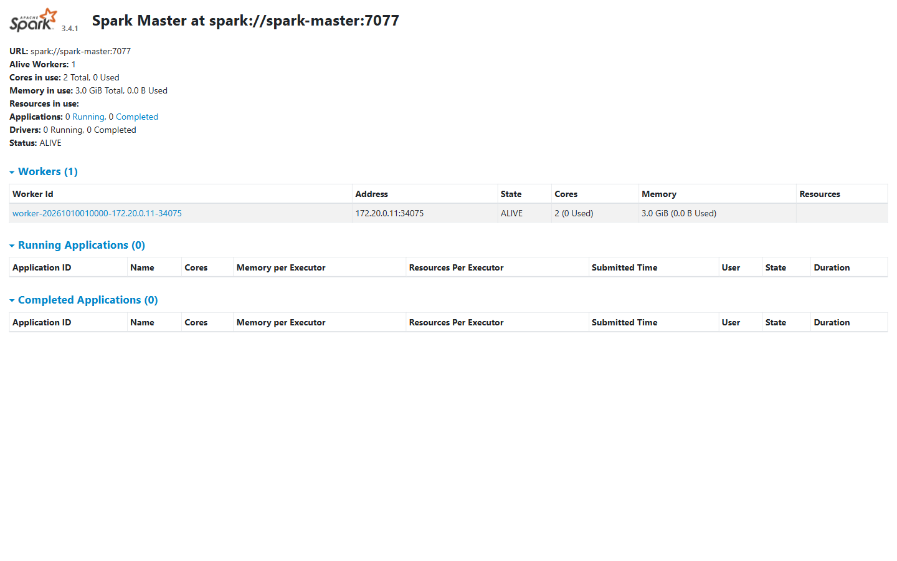
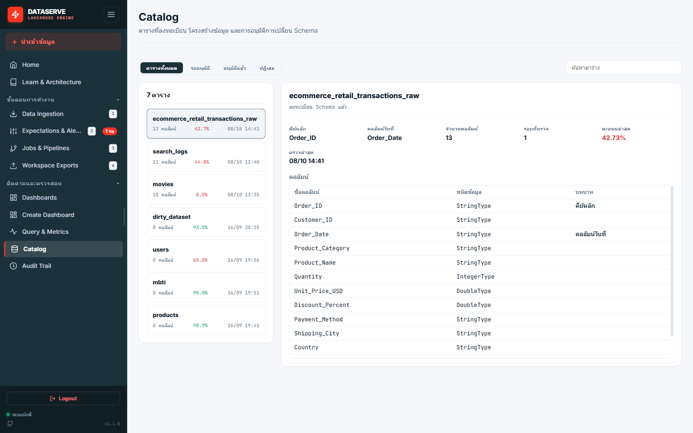
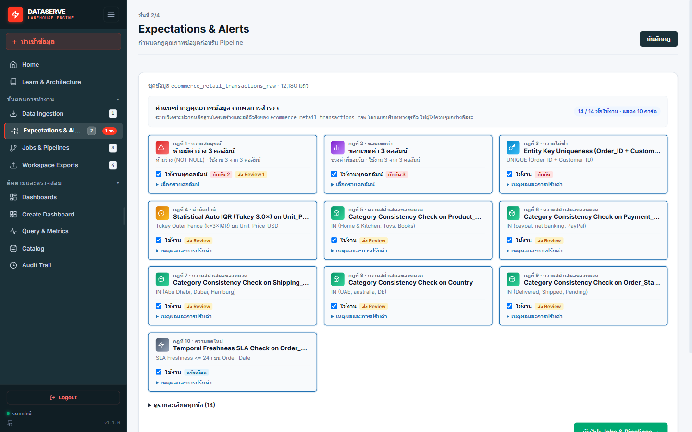
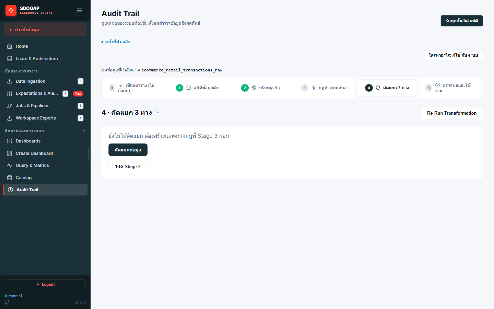
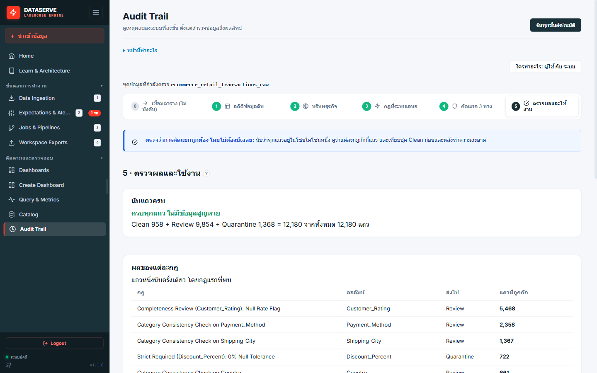
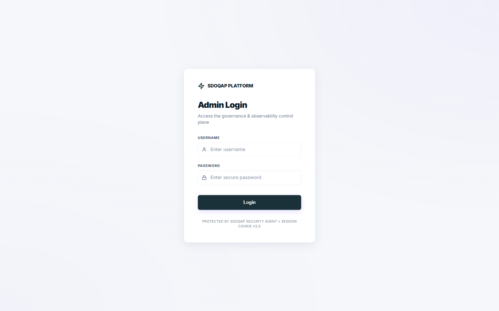

# สไลด์นำเสนอเฉพาะส่วน Data Transformation: 13 ขั้นตอน 5 ภารกิจหลัก (Visual-First 6 Slides)

> **เกณฑ์การประเมิน**: ข้อ 4 · ความครบถ้วนสมบูรณ์ของการเปลี่ยนรูปข้อมูล (Data Transformation) — 10 คะแนน  
> **รูปแบบการนำเสนอ**: Visual-First เน้นภาพประกอบระบบจริงทุกสไลด์ ตัวหนังสือน้อย กระชับ ตรงประเด็น ไม่มีกำแพงข้อความ  
> **เวลาที่ใช้ในการนำเสนอ**: รวมประมาณ 4 นาที (สไลด์ละประมาณ 35–45 วินาที)

---

## Slide 1: ภาพรวมสถาปัตยกรรม Data Transformation (Sequential Deterministic DAG)

* **Title**: Data Transformation Pipeline: Sequential Deterministic DAG
* **Subtitle**: กระบวนการแปลงสภาพและประกันคุณภาพข้อมูลระดับแถวบน Apache Spark & Delta Lake

### ภาพประกอบระบบจริง (Apache Spark Master Web UI)

*(ภาพแผนผังระบบ: `images/transformation_pipeline_diagram.jpg`)*

### สรุปสาระสำคัญ (Key Takeaways)
* **In-Memory DAG Execution**: ประมวลผล 13 Stages ต่อเนื่องบน RAM ผ่าน Apache Spark `RunContext` โดยไม่มี Disk I/O ซ้ำซ้อน
* **5 Core Missions**: แบ่งเป็น 5 ภารกิจหลักครอบคลุมตั้งแต่ Align, Schema Drift, Safe Clean & Dedup, Standardize จนถึง Validation
* **Zero Silent Drop Invariant**: แถวสะอาดเข้า **Silver Active Store** | แถวมีปัญหาเข้า **Silver Quarantine Store** พร้อม `reject_reason`

### บทพูดผู้บรรยาย (~40 วินาที)
"สวัสดีครับ ในส่วนของกระบวนการ Data Transformation ของ DataServe เราออกแบบสถาปัตยกรรมให้ทำงานเป็น Sequential Deterministic DAG จำนวน 13 ขั้นตอนต่อเนื่องบน Apache Spark ครับ โดยควบคุมผ่าน RunContext ทำงานบน RAM ทั้งหมดโดยไม่มีการเขียนดิสก์ซ้ำซ้อน ทั้ง 13 ขั้นตอนนี้ถูกจัดหมวดหมู่เป็น 5 ภารกิจหลัก ตั้งแต่การจัดโครงสร้าง ป้องกันข้อมูลสูญหาย รับมือกับ Schema ที่เปลี่ยนไป ล้างข้อมูล ตัดแถวซ้ำ ปรับมาตรฐานเวลา และตรวจจับความผิดปกติด้วยสถิติขั้นสูง โดยยึดหลักการ Zero Silent Drop คือไม่ลบข้อมูลทิ้งแม้แต่แถวเดียว แต่แยกแถวสะอาด 100% ส่งต่อ Gold Layer และแยกแถวกักกันไว้พร้อมระบุสาเหตุอย่างชัดเจนครับ"

---

## Slide 2: ภารกิจที่ 1 & 2 — จัดโครงสร้าง ป้องกันข้อมูลสูญหาย และรับมือ Schema Drift

* **Title**: Missions 1 & 2: Structural Alignment & Schema Drift Governance
* **Subtitle**: จัดระเบียบโครงสร้าง นวัตกรรม Smart Type Promotion และเกราะป้องกัน Schema เปลี่ยนแปลง

### ภาพประกอบระบบจริง (DataServe Schema Catalog & Drift Governance UI)

*(ภาพแผนผังระบบ: `images/mission1_2_schema_alignment_drift.jpg`)*

### สรุปสาระสำคัญ (Key Takeaways)
* **Mission 1: Alignment & Smart Promotion**:
  * **Dynamic row_hash**: คำนวณ MD5 จากทุกคอลัมน์เป็น Primary Key อัตโนมัติสำหรับตารางที่ไม่มีคีย์หลัก
  * **Smart Type Promotion**: สแกนหาทศนิยม หากพบเศษทศนิยมจะปรับจาก `Integer -> Double` ทันที ป้องกันข้อมูลกลายเป็นค่าว่าง (Zero Data Loss)
* **Mission 2: Schema Drift Governance**:
  * **Low Risk (คอลัมน์ใหม่)**: อนุมัติ Auto-Evolution บน Delta Lake อัตโนมัติ
  * **Critical Risk (คอลัมน์สำคัญหาย/ชนิดข้อมูลเพี้ยน)**: เติมค่าว่างชั่วคราวเพื่อกันระบบหยุดทำงาน กักกันข้อมูลรอบนั้น และส่ง Webhook แจ้งเตือนทีมทันที

### บทพูดผู้บรรยาย (~40 วินาที)
"ในภารกิจที่ 1 เราเริ่มต้นด้วยการจัดโครงสร้างและสร้าง row_hash ด้วย MD5 สิ่งสำคัญคือนวัตกรรม Smart Type Promotion ครับ ในระบบทั่วไปถ้าสคีมาเป็น Integer แต่ข้อมูลส่งทศนิยมมา ข้อมูลจะกลายเป็น Null ทันที แต่ระบบของเราจะสแกนหาเศษทศนิยมก่อน ถ้าพบจะเลื่อนชนิดเป็น Double ให้อัตโนมัติ ช่วยป้องกันข้อมูลสูญหายได้ 100% และในภารกิจที่ 2 หากต้นทางเปลี่ยนโครงสร้างข้อมูล ถ้าเป็นคอลัมน์ใหม่จะขยายตารางให้อัตโนมัติ แต่ถ้าคอลัมน์สำคัญหายไป ระบบจะไม่หยุดทำงาน แต่จะกักกันข้อมูลรอบนั้นและส่งแจ้งเตือนให้ทีม Data ทันทีครับ"

---

## Slide 3: ภารกิจที่ 3 & 4 — ล้างข้อมูล ตัดแถวซ้ำ และปรับมาตรฐานสากล

* **Title**: Missions 3 & 4: Cleansing, Deduplication & Standardization
* **Subtitle**: เยียวยาข้อมูลด้วย Secure DSL Sandbox, ตัดแถวซ้ำ 2 ชั้น และแปลง พ.ศ. เป็น ค.ศ. สากล

### ภาพประกอบระบบจริง (DataServe Expectations & Rules Config UI)

*(ภาพแผนผังระบบ: `images/mission3_4_cleansing_normalization.jpg`)*

### สรุปสาระสำคัญ (Key Takeaways)
* **Mission 3: Safe Cleansing & 2-Layer Dedup**:
  * **DSL Remediation Sandbox**: รองรับ 4 คำสั่งปลอดภัย (`fillna`, `calculate`, `cast`, `filter`) ไร้ความเสี่ยง Code Injection
  * **Business Deduplication**: ตัดแถวซ้ำ 2 ชั้น เก็บเฉพาะแถวล่าสุดไว้ใช้งาน (Active) ส่วนแถวซ้ำสกัดส่งเข้าโซนกักกัน (Quarantine)
* **Mission 4: Standardization & Normalization**:
  * **Buddhist Era Normalization**: ตรวจจับปี พ.ศ. (> 2500) หักออก 543 และจัดรูปแบบเป็น ISO `YYYY-MM-DD` อัตโนมัติ
  * **Category Taxonomy Mapping**: แมปหมวดหมู่ข้อมูลตามพจนานุกรมกลาง Elasticsearch โดยไม่ต้องแก้ไขโค้ดโปรแกรม

### บทพูดผู้บรรยาย (~40 วินาที)
"ในภารกิจที่ 3 เรามีเอนจิน DSL Sandbox ที่ปลอดภัย รองรับการเติมค่าว่างและการคำนวณสูตรพื้นฐาน พร้อมกลไกตัดแถวซ้ำ 2 ชั้น โดยเปรียบเทียบตามเวลาเพื่อคงเฉพาะเวอร์ชันล่าสุดไว้ใช้งาน ส่วนแถวซ้ำจะถูกส่งไปกักกัน และในภารกิจที่ 4 เราแก้ปัญหาคลาสสิกของข้อมูลไทย คือการบันทึกปีเป็น พ.ศ. ระบบจะตรวจจับและแปลงเป็นปี ค.ศ. สากลให้อัตโนมัติ พร้อมทั้งจัดหมวดหมู่ข้อมูลตามพจนานุกรมกลาง ทำให้ข้อมูลพร้อมใช้งานร่วมกับระบบสากลได้ทันทีครับ"

---

## Slide 4: ภารกิจที่ 5 — กฎธุรกิจและการตรวจจับความผิดปกติทางสถิติ

* **Title**: Mission 5: Business Rules & Advanced Statistical Anomaly Detection
* **Subtitle**: ผสานกฎขอบเขตธุรกิจเข้ากับแบบจำลองสถิติขั้นสูง เพื่อดักจับข้อมูลผิดธรรมชาติ

### ภาพประกอบระบบจริง (DataServe Whitebox Audit Trail Stage 4: 3-Way Segregation)

*(ภาพแผนผังระบบ: `images/mission5_validation_outliers.jpg`)*

### สรุปสาระสำคัญ (Key Takeaways)
* **Deterministic Business Rules**: บังคับกฎช่วงค่า เช่น คะแนนสอบต้องอยู่ในช่วง [0, 100] แถวที่ได้คะแนนติดลบ (-10) หรือเกิน (145) ถูกกักกันทันที
* **Statistical Outlier Detection**:
  * **Tukey's IQR Fences**: คำนวณช่วงการกระจายตัวของข้อมูล ดักจับค่าสุดโต่ง เช่น ชั่วโมงเรียน 48.0 ชม./สัปดาห์ (เกินรั้วปกติ > 12 ชม.)
  * **Gaussian 3-Sigma Anomaly**: ดักจับค่าที่เบี่ยงเบนเกิน 3 เท่าของส่วนเบี่ยงเบนมาตรฐาน
* **Quarantine Assembly**: รวบรวมทุกแถวที่ผิดพลาด ผูก `run_id` และ `reject_reason` บันทึกลง Silver Quarantine Store

### บทพูดผู้บรรยาย (~45 วินาที)
"ในภารกิจที่ 5 คือการตรวจคุณภาพเชิงลึกครับ เราผสาน 2 กลไกเข้าด้วยกัน: หนึ่งคือกฎธุรกิจที่กำหนดไว้ชัดเจน เช่น คะแนนสอบต้องอยู่ระหว่าง 0 ถึง 100 แถวที่ได้คะแนนติดลบหรือเกิน 100 จะถูกคัดออกทันที และสองคือการใช้แบบจำลองสถิติขั้นสูงอย่าง Tukey IQR Fences เข้ามาช่วยดักจับค่าที่ผิดธรรมชาติ เช่น ชั่วโมงเรียน 48 ชั่วโมงต่อสัปดาห์ ซึ่งไม่ติดลบแต่เป็นไปไม่ได้ในโลกจริง เมื่อตรวจครบทุกมิติ ระบบจะนำข้อมูลเสียทั้งหมดมารวมกัน ผูกเหตุผลความผิดพลาดกำกับไว้ทุกแถว และบันทึกลงสู่ Silver Quarantine อย่างเป็นระบบครับ"

---

## Slide 5: ตารางตัวอย่างการแปลงสภาพข้อมูลจริง (Before → After Matrix)

* **Title**: Concrete Transformation Examples: Before → After Matrix
* **Subtitle**: ตัวอย่างเปรียบเทียบข้อมูลก่อนแปลง สภาพผลลัพธ์ และการคัดแยกปลายทาง Lakehouse

### ภาพประกอบระบบจริง (DataServe Whitebox Audit Trail Stage 5: Results Inspection)

*(ภาพแผนผังระบบ: `images/transformation_before_after_matrix.jpg`)*

### สรุปตัวอย่าง 6 กรณีหลัก (Concrete Transformation Summary)
| ลำดับ | ข้อมูลดิบต้นทาง (Before) | กลไกการแปลงสภาพ (Logic) | ข้อมูลผลลัพธ์ (After) | ปลายทางที่จัดเก็บ |
|:---:|---|---|---|:---:|
| **1** | `"1,234.50"` (ข้อความมีจุลภาค) | ตัดเครื่องหมาย `,` ออก และแปลงชนิดเป็นตัวเลข | `1234.50` (Double) | **Silver Active** (พร้อมคำนวณ) |
| **2** | `"22-07-2569"` (วันที่ปี พ.ศ.) | ตรวจพบปี > 2500 หักออก 543 แปลงเป็น ISO | `"2026-07-22"` | **Silver Active** (มาตรฐานสากล) |
| **3** | รหัสนักศึกษาซ้ำกัน 2 แถว | ตรวจคีย์หลัก เรียงตามเวลา ตัดแถวซ้ำ | เก็บแถวล่าสุด | **Active & Quarantine** |
| **4** | คะแนนสอบเป็นค่าว่าง (`NULL`) | ตรวจพบคอลัมน์บังคับมีค่าว่าง | ผูก `missing_score` | **Silver Quarantine** |
| **5** | คะแนนสอบติดลบ `-10` หรือ `145` | ตรวจพบค่าหลุดจากช่วงกฎธุรกิจ [0, 100] | ผูก `out_of_range_score` | **Silver Quarantine** |
| **6** | ชั่วโมงเรียนต่อสัปดาห์ `48.0` ชม. | สถิติ Tukey IQR ตรวจพบค่าเกินรั้วปกติ (> 12 ชม.) | ผูก `outlier_details` | **Silver Quarantine** |

### บทพูดผู้บรรยาย (~35 วินาที)
"สไลด์นี้แสดงให้เห็นตัวอย่างการแปลงสภาพข้อมูลจริง 6 กรณีครับ ข้อมูลตัวเลขที่มีคอมม่าจะถูกแปลงเป็นตัวเลขทศนิยม วันที่ พ.ศ. จะถูกเปลี่ยนเป็น ค.ศ. ข้อมูลที่ส่งซ้ำจะถูกตัดเหลือเฉพาะแถวล่าสุด ส่วนแถวที่มีข้อผิดพลาด เช่น คะแนนว่าง คะแนนติดลบ หรือชั่วโมงเรียนเกินจริง จะถูกส่งเข้า Silver Quarantine โดยมีคอลัมน์ระบุเหตุผลกำกับไว้ทุกแถว ทำให้ระบบปลายทางมั่นใจได้ว่าจะได้รับเฉพาะข้อมูลที่สะอาด 100% ไปใช้งานครับ"

---

## Slide 6: ผลการพิสูจน์เชิงประจักษ์และการกระทบยอดข้อมูล 100% (Empirical Proof)

* **Title**: Empirical Verification & 100% Volume Reconciliation
* **Subtitle**: การพิสูจน์ความถูกต้องทางวิศวกรรมข้อมูลด้วยชุดทดสอบจริงที่มี Ground Truth (10,100 แถว)

### ภาพประกอบระบบจริง (DataServe Quality Observability & Metrics Dashboard)

*(ภาพแผนผังระบบ: `images/slide6_empirical_reconciliation.jpg`)*

### สรุปตัวเลขพิสูจน์เชิงประจักษ์ (Key Verification Metrics)
* **Detection Recall: 1.0 (100%)**: ตรวจพบข้อผิดพลาดครบ 700 / 700 แถว (Zero False Negative)
  * Missing Score: 300 แถว | Invalid Range: 200 แถว | IQR Outlier: 100 แถว | Duplicates: 100 แถว
* **Precision: 95.89% | Overall Accuracy: 99.70%**: มี Safety Margin ทางสถิติ 30 แถว
* **สมการกระทบยอดข้อมูล 100% (Volume Reconciliation)**:
  $$\text{Raw Inbound (10,100)} = \text{Active (9,370)} + \text{Quarantine (630)} + \text{Dedup (100)}$$
  * **Unaccounted Delta = 0 แถว**: พิสูจน์ทางคณิตศาสตร์ว่าไม่มีข้อมูลตกหล่นสูญหายแม้แต่แถวเดียว

### บทพูดผู้บรรยาย (~45 วินาที)
"สไลด์สุดท้ายนี้คือหลักฐานยืนยันความถูกต้องทางวิศวกรรมของระบบครับ เรานำชุดข้อมูลทดสอบ 10,100 แถว ซึ่งมีข้อผิดพลาดที่จงใจใส่ไว้ 700 แถวมาประมวลผลจริง ผลลัพธ์คือระบบสามารถตรวจพบข้อผิดพลาดได้ครบทั้ง 700 แถว บรรลุค่า Recall เต็ม 100% โดยตรวจจับคะแนนว่างได้ 300 แถว, คะแนนหลุดช่วง 200 แถว, ชั่วโมงเรียนผิดปกติ 100 แถว และแถวซ้ำ 100 แถวครบถ้วน และที่สำคัญที่สุดคือสมการกระทบยอดครับ ข้อมูลนำเข้า 10,100 แถว แยกเป็นข้อมูลสะอาด 9,370 แถว ข้อมูลกักกัน 630 แถว และแถวซ้ำ 100 แถว รวมกันได้ 10,100 แถวลงตัวพอดี ผลต่างเป็น 0 แถว ไม่มีข้อมูลสูญหายแม้แต่แถวเดียว นี่คือข้อพิสูจน์ว่า Data Transformation Engine ของ DataServe ทำงานได้อย่างแม่นยำ โปร่งใส และพร้อมสำหรับงานระดับองค์กรอย่างแท้จริงครับ ขอบคุณครับ"
