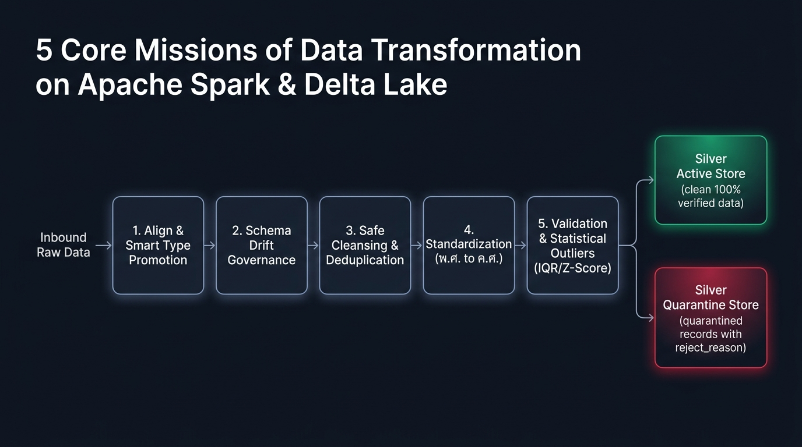
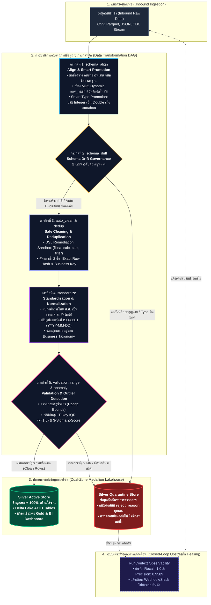

# สไลด์นำเสนอเฉพาะส่วน Data Transformation: 13 ขั้นตอน 5 ภารกิจหลัก (6 สไลด์)

> **เกณฑ์การประเมิน**: ข้อ 4 · ความครบถ้วนสมบูรณ์ของการเปลี่ยนรูปข้อมูล (Data Transformation) — 10 คะแนน  
> **แนวทางการนำเสนอ**: กระชับ ได้ใจความสำคัญ มีตารางเปรียบเทียบชัดเจน และมีตัวเลขพิสูจน์การกระทบยอด 100% ปราศจากโค้ดรกตา  
> **เวลาที่ใช้ในการนำเสนอ**: รวมประมาณ 4 นาที (สไลด์ละประมาณ 35–45 วินาที)

---

## Slide 1: ภาพรวมสถาปัตยกรรม Data Transformation (13 ขั้นตอน 5 ภารกิจหลัก)

* **หัวข้อหลัก (Title)**: Data Transformation Pipeline: Sequential Deterministic DAG
* **หัวข้อย่อย (Subtitle)**: กระบวนการแปลงสภาพและตรวจคุณภาพข้อมูลระดับแถวบน Apache Spark & Delta Lake

### ข้อความบนสไลด์ (Slide Content)
* **กลไกการประมวลผล (Engine Execution)**:
  * ทำงานเป็น **Sequential Deterministic DAG** จำนวน 13 Stages ต่อเนื่องในโหมด ALIGN และ TRANSFORM
  * ควบคุมด้วย `RunContext` บน Apache Spark ประมวลผลแบบ In-Memory ใน RAM ทั้งหมด โดยไม่มีการเขียนดิสก์ซ้ำซ้อน
* **5 ภารกิจหลักในการเปลี่ยนรูปข้อมูล**:
  1. **จัดโครงสร้างและป้องกันข้อมูลสูญหาย (Align & Smart Promotion)**
  2. **รับมือความเปลี่ยนแปลงโครงสร้าง (Schema Drift Governance)**
  3. **ล้างข้อมูลและตัดแถวซ้ำ (Safe Cleaning & Deduplication)**
  4. **ปรับข้อมูลสู่มาตรฐานสากล (Standardization)**
  5. **บังคับกฎธุรกิจและตรวจจับสถิติขั้นสูง (Validation & Outlier Detection)**
* **หลักการ Zero Silent Drop**: ข้อมูลทุกแถวต้องมีที่ไป แถวสะอาดเข้า Silver Active แถวที่มีปัญหาเข้า Silver Quarantine พร้อมระบุเหตุผล

### ภาพผังสถาปัตยกรรม (Architecture Flowchart)

### แผนผังจำลองบนสไลด์ (Mermaid Flowchart)

### บทพูดผู้บรรยาย (~40 วินาที)
"สวัสดีครับ ในส่วนของกระบวนการ Data Transformation ของ DataServe เราออกแบบสถาปัตยกรรมให้ทำงานเป็น Sequential Deterministic DAG จำนวน 13 ขั้นตอนต่อเนื่องบน Apache Spark ครับ โดยควบคุมผ่าน RunContext ทำงานบน RAM ทั้งหมดโดยไม่มีการเขียนดิสก์ซ้ำซ้อน ทั้ง 13 ขั้นตอนนี้ถูกจัดหมวดหมู่เป็น 5 ภารกิจหลัก ตั้งแต่การจัดโครงสร้าง ป้องกันข้อมูลสูญหาย รับมือกับ Schema ที่เปลี่ยนไป ล้างข้อมูล ตัดแถวซ้ำ ปรับมาตรฐานเวลา และตรวจจับความผิดปกติด้วยสถิติขั้นสูง โดยยึดหลักการ Zero Silent Drop คือไม่ลบข้อมูลทิ้ง แต่แยกแถวสะอาดและแถวกักกันออกจากกันอย่างชัดเจนครับ"

---

## Slide 2: ภารกิจที่ 1 & 2 — จัดโครงสร้าง ป้องกันข้อมูลสูญหาย และรับมือ Schema Drift

* **หัวข้อหลัก (Title)**: Missions 1 & 2: Structural Alignment & Schema Drift Governance
* **หัวข้อย่อย (Subtitle)**: จัดระเบียบโครงสร้าง นวัตกรรม Smart Type Promotion และภูมิคุ้มกันท่อข้อมูล

### ข้อความบนสไลด์ (Slide Content)
* **ภารกิจที่ 1: จัดโครงสร้างและป้องกันข้อมูลสูญหาย (Align & Smart Promotion)**:
  * **Column Sanitization**: ตัดช่องว่าง ลบอักขระพิเศษ และทำ Fuzzy Matching กับ Schema มาตรฐาน
  * **Dynamic Primary Key (`row_hash`)**: รวมค่าทุกคอลัมน์แล้วสร้างแฮช MD5 เป็นคีย์หลักอัตโนมัติ สำหรับตารางที่ไม่มี Primary Key จากต้นทาง
  * **Smart Type Promotion (นวัตกรรมป้องกัน Data Loss)**:
    * ท่อข้อมูลทั่วไป เมื่อ Schema กำหนดเป็นจำนวนเต็ม (Integer) แต่ต้นทางส่งทศนิยมมา ข้อมูลจะกลายเป็นค่าว่าง (Null) ทันที
    * DataServe สแกนหาทศนิยมอัตโนมัติ หากพบเศษทศนิยมจริง จะปรับชนิดเป็น `Double` ให้อัตโนมัติ จึงรักษาข้อมูลไว้ได้ครบถ้วน
* **ภารกิจที่ 2: รับมือความเปลี่ยนแปลงโครงสร้าง (Schema Drift Governance)**:
  * **จำแนกความรุนแรง (Severity Scoring)**:
    * *พบคอลัมน์ใหม่ (ความเสี่ยงต่ำ)*: อนุมัติให้อัปเดตโครงสร้างลง Delta Lake อัตโนมัติ (Auto-Evolution)
    * *คอลัมน์สำคัญหาย หรือชนิดข้อมูลเพี้ยน (ความเสี่ยงวิกฤต)*: เติมค่าว่างชั่วคราวเพื่อกันระบบหยุดทำงาน กักกันข้อมูลรอบนั้น และส่ง Webhook แจ้งเตือนทีมงานทันที

### บทพูดผู้บรรยาย (~40 วินาที)
"ในภารกิจที่ 1 เราเริ่มต้นด้วยการจัดโครงสร้างและทำความสะอาดชื่อคอลัมน์ พร้อมสร้าง row_hash ด้วย MD5 สิ่งสำคัญคือฟีเจอร์ Smart Type Promotion ครับ ในระบบทั่วไปถ้าสคีมาเป็น Integer แต่ข้อมูลส่งทศนิยมมา ข้อมูลมักจะกลายเป็น Null ทันที แต่ระบบของเราจะสแกนหาเศษทศนิยมก่อน ถ้าพบจะเลื่อนชนิดเป็น Double ให้อัตโนมัติ ช่วยป้องกันข้อมูลสูญหายได้ 100% และในภารกิจที่ 2 หากต้นทางเปลี่ยนโครงสร้างข้อมูล เช่น คอลัมน์สำคัญหายไป ระบบจะไม่ล่ม แต่จะเติมค่าว่างชั่วคราว กักกันข้อมูลรอบนั้น และส่งแจ้งเตือนให้ทีม Data เข้ามาตรวจสอบทันทีครับ"

---

## Slide 3: ภารกิจที่ 3 & 4 — ล้างข้อมูล ตัดแถวซ้ำ และปรับมาตรฐานสากล

* **หัวข้อหลัก (Title)**: Missions 3 & 4: Data Cleansing, Deduplication & Normalization
* **หัวข้อย่อย (Subtitle)**: เยียวยาข้อมูลด้วย DSL Sandbox, ตัดแถวซ้ำ 2 ชั้น และแปลง พ.ศ. เป็น ค.ศ. อัตโนมัติ

### ข้อความบนสไลด์ (Slide Content)
* **ภารกิจที่ 3: ล้างข้อมูลและตัดแถวซ้ำ (Safe Cleaning & Deduplication)**:
  * **DSL Remediation Sandbox**: รองรับคำสั่ง 4 รูปแบบ (`fillna`, `calculate`, `cast`, `filter`) โดยจำกัดเฉพาะตัวเลขและเครื่องหมายคณิตศาสตร์ เพื่อป้องกัน Code Injection
  * **Business Deduplication (ตัดแถวซ้ำ 2 ชั้น)**:
    * *ชั้นที่ 1 (Auto-Clean)*: ตัดแถวซ้ำที่มีคีย์หลักสมบูรณ์ล่วงหน้า
    * *ชั้นที่ 2 (Anti-Join)*: เปรียบเทียบตามคีย์ธุรกิจและเวลา คงเฉพาะเวอร์ชันล่าสุดไว้ใช้งาน ส่วนแถวซ้ำใช้ Left Anti-Join สกัดส่งเข้าโซนกักกัน
* **ภารกิจที่ 4: ปรับข้อมูลสู่มาตรฐานสากล (Standardization)**:
  * **Auto Buddhist Era Normalization (พ.ศ. เป็น ค.ศ.)**:
    * ระบบตรวจจับปี พ.ศ. หากพบปีมากกว่า 2500 จะหักลบด้วย 543 และปรับให้อยู่ในมาตรฐาน ISO `YYYY-MM-DD` อัตโนมัติ
  * **Generic Categorization**: ดึงพจนานุกรมคำสำคัญจาก Elasticsearch มาจัดกลุ่มสินค้าหรือข้อความเข้าหมวดหมู่มาตรฐาน โดยไม่ต้องแก้ไขโค้ดโปรแกรม

### บทพูดผู้บรรยาย (~40 วินาที)
"ถัดมาเป็นภารกิจที่ 3 และ 4 ครับ ในการทำความสะอาด เรามีเอนจิน DSL ที่ปลอดภัย รองรับการเติมค่าว่างและการคำนวณสูตรพื้นฐาน และมีการตัดแถวซ้ำโดยเปรียบเทียบตามเวลา ซึ่งจะเก็บเฉพาะเวอร์ชันล่าสุดไว้ใช้งาน ส่วนแถวซ้ำจะถูกส่งไปกักกัน และในภารกิจที่ 4 เราแก้ปัญหาคลาสสิกของข้อมูลไทย คือการบันทึกปีเป็น พ.ศ. ระบบจะตรวจจับและแปลงเป็นปี ค.ศ. สากลให้อัตโนมัติ พร้อมทั้งจัดหมวดหมู่ข้อมูลตามพจนานุกรมกลาง ทำให้ข้อมูลเป็นระเบียบและพร้อมใช้งานร่วมกับระบบสากลครับ"

---

## Slide 4: ภารกิจที่ 5 — กฎธุรกิจและการตรวจจับความผิดปกติทางสถิติ

* **หัวข้อหลัก (Title)**: Mission 5: Business Rules & Advanced Statistical Anomaly Detection
* **หัวข้อย่อย (Subtitle)**: ผสานกฎขอบเขตธุรกิจเข้ากับแบบจำลองสถิติขั้นสูง เพื่อดักจับข้อมูลผิดธรรมชาติ

### ข้อความบนสไลด์ (Slide Content)
* **การตรวจความถูกต้องพื้นฐาน (Validation & Missing Checks)**:
  * ตรวจสอบคีย์หลักว่าง (`missing_primary_key`)
  * ตรวจสอบค่าว่างในคอลัมน์สำคัญที่บังคับต้องมีข้อมูล (`null_value_in_<col>`)
* **กฎขอบเขตธุรกิจ (Explicit Business Range Rules)**:
  * บังคับช่วงค่าคงที่ที่ธุรกิจกำหนด เช่น คะแนนสอบต้องอยู่ในช่วง [0, 100] หรือราคาต้องไม่ติดลบ แถวที่หลุดช่วงจะถูกระบุ `out_of_range_<col>`
* **แบบจำลองสถิติขั้นสูง (Advanced Statistical Anomaly Detection)**:
  * **Tukey's IQR Fences**: คำนวณควอร์ไทล์หาช่วงการกระจายตัวของข้อมูลจริงแบบ $O(N)$ ดักจับค่าสุดโต่งผิดธรรมชาติ เช่น ชั่วโมงเรียน 48 ชม./สัปดาห์ แม้ค่าไม่ติดลบแต่เป็นไปไม่ได้จริง
  * **Gaussian 3-Sigma Anomaly**: ตรวจจับค่าที่เบี่ยงเบนเกิน 3 เท่าของส่วนเบี่ยงเบนมาตรฐาน สำหรับข้อมูลการแจกแจงปกติ
* **การประกอบชุดกักกัน (Quarantine Assembly)**: รวบรวมทุกข้อผิดพลาดเข้าด้วยกัน ผูก `run_id` และเหตุผล แล้ว `.cache()` ใน RAM เพื่อส่งลง Delta Lake

### บทพูดผู้บรรยาย (~45 วินาที)
"ในภารกิจที่ 5 คือการตรวจคุณภาพเชิงลึกครับ เราผสาน 2 กลไกเข้าด้วยกัน: หนึ่งคือกฎธุรกิจที่กำหนดไว้ชัดเจน เช่น คะแนนสอบต้องอยู่ระหว่าง 0 ถึง 100 แถวที่ได้คะแนนติดลบหรือเกิน 100 จะถูกคัดออกทันที และสองคือการใช้แบบจำลองสถิติขั้นสูงอย่าง Tukey IQR Fences เข้ามาช่วยดักจับค่าที่ผิดธรรมชาติ เช่น ชั่วโมงเรียน 48 ชั่วโมงต่อสัปดาห์ ซึ่งไม่ติดลบแต่เป็นไปไม่ได้ในโลกจริง เมื่อตรวจครบทุกมิติ ระบบจะนำข้อมูลเสียทั้งหมดมารวมกัน ผูกเหตุผลความผิดพลาดกำกับไว้ทุกแถว และบันทึกลงสู่ Silver Quarantine อย่างเป็นระบบครับ"

---

## Slide 5: ตารางตัวอย่างการแปลงสภาพข้อมูลจริง (Before → After Matrix)

* **หัวข้อหลัก (Title)**: Concrete Transformation Examples
* **หัวข้อย่อย (Subtitle)**: ตัวอย่างเปรียบเทียบข้อมูลก่อนแปลง สภาพผลลัพธ์ และการคัดแยกปลายทาง

### ตารางเปรียบเทียบข้อมูลจริงบนสไลด์

| ลำดับ | ข้อมูลดิบต้นทาง (Before) | กลไกการแปลงสภาพ (Transformation Logic) | ข้อมูลผลลัพธ์ (After) | ปลายทางที่จัดเก็บ |
|:---:|---|---|---|:---:|
| **1** | `"1,234.50"` (ข้อความมีจุลภาค) | ตัดเครื่องหมาย `,` ออก และแปลงชนิดข้อมูลเป็นตัวเลขทศนิยม | `1234.50` (Double) | **Silver Active** (พร้อมคำนวณ) |
| **2** | `"22-07-2569"` (วันที่ปี พ.ศ.) | ตรวจพบปี > 2500 หักออก 543 และแปลงเป็นรูปแบบสากล | `"2026-07-22"` (ISO Date) | **Silver Active** (มาตรฐานสากล) |
| **3** | ข้อมูลรหัส นศ. ซ้ำกัน 2 แถว | ตรวจคีย์หลัก เรียงตามเวลาล่าสุด ตัดแถวซ้ำออก | เก็บเฉพาะแถวล่าสุด แถวซ้ำสกัดส่ง Quarantine | **Active & Quarantine** |
| **4** | คะแนนสอบเป็นค่าว่าง (`NULL`) | ตรวจพบคอลัมน์บังคับมีค่าว่าง | ผูกเหตุผล `missing_score` | **Silver Quarantine** |
| **5** | คะแนนสอบติดลบ `-10` หรือ `145` | ตรวจพบค่าหลุดจากช่วงกฎธุรกิจ [0, 100] | ผูกเหตุผล `out_of_range_score` | **Silver Quarantine** |
| **6** | ชั่วโมงเรียนต่อสัปดาห์ `48.0` ชม. | สถิติ Tukey IQR ตรวจพบค่าเกินรั้วปกติ (> 12 ชม.) | ผูกเหตุผล `outlier_details` | **Silver Quarantine** |

### บทพูดผู้บรรยาย (~35 วินาที)
"สไลด์นี้แสดงให้เห็นภาพตัวอย่างการแปลงสภาพข้อมูลจริง 6 กรณีครับ ข้อมูลตัวเลขที่มีคอมม่าจะถูกแปลงเป็นตัวเลขทศนิยม วันที่ พ.ศ. จะถูกเปลี่ยนเป็น ค.ศ. ข้อมูลที่ส่งซ้ำจะถูกตัดเหลือเฉพาะแถวล่าสุด ส่วนแถวที่มีข้อผิดพลาด เช่น คะแนนว่าง คะแนนติดลบ หรือชั่วโมงเรียนเกินจริง จะถูกส่งเข้า Silver Quarantine โดยมีคอลัมน์ระบุเหตุผลกำกับไว้ทุกแถว ทำให้ระบบปลายทางมั่นใจได้ว่าจะได้รับเฉพาะข้อมูลที่สะอาด 100% ไปใช้งานครับ"

---

## Slide 6: ผลการพิสูจน์เชิงประจักษ์และการกระทบยอดข้อมูล 100% (Empirical Proof)

* **หัวข้อหลัก (Title)**: Empirical Verification & 100% Volume Reconciliation
* **หัวข้อย่อย (Subtitle)**: การพิสูจน์ความถูกต้องทางวิศวกรรมข้อมูลด้วยชุดทดสอบจริงที่มี Ground Truth (10,100 แถว)

### ข้อความบนสไลด์ (Slide Content)
* **ความแม่นยำในการตรวจจับข้อผิดพลาด (Detection Accuracy)**:
  * **Recall = 1.0 (100%)**: ตรวจพบข้อผิดพลาดที่ฉีดไว้ครบ 700 จาก 700 แถว (Zero False Negative)
    * คะแนนว่าง (Missing Score): ตรวจพบครบ **300 / 300 แถว**
    * คะแนนหลุดช่วง (Invalid Range): ตรวจพบครบ **200 / 200 แถว**
    * ชั่วโมงเรียนผิดปกติ (IQR Outlier): ตรวจพบครบ **100 / 100 แถว**
    * ข้อมูลซ้ำซ้อน (Duplicate): ตรวจพบครบ **100 / 100 แถว**
  * **Precision = 95.89%** | **Overall Accuracy = 99.70%** (มีแถวติดเกณฑ์สถิติ 3-Sigma เพิ่มเติม 30 แถวเพื่อความปลอดภัย)
* **สมการกระทบยอดปริมาณข้อมูล 100% (Data Volume Reconciliation)**:
  $$\text{ข้อมูลนำเข้า (10,100 แถว)} = \text{ข้อมูลสะอาด Active (9,370)} + \text{ข้อมูลกักกัน Quarantine (630)} + \text{แถวซ้ำที่ตัดออก (100)}$$
  * **ผลต่าง = 0 แถว**: พิสูจน์ทางคณิตศาสตร์ว่าไม่มีข้อมูลสูญหายแม้แต่แถวเดียว ทุกแถวมีที่ไปชัดเจนและตรวจสอบได้ 100%

### บทพูดผู้บรรยาย (~45 วินาที)
"สไลด์สุดท้ายนี้คือหลักฐานยืนยันความถูกต้องทางวิศวกรรมของระบบครับ เรานำชุดข้อมูลทดสอบ 10,100 แถว ซึ่งมีข้อผิดพลาดที่จงใจใส่ไว้ 700 แถวมาประมวลผลจริง ผลลัพธ์คือระบบสามารถตรวจพบข้อผิดพลาดได้ครบทั้ง 700 แถว บรรลุค่า Recall เต็ม 100% โดยตรวจจับคะแนนว่างได้ 300 แถว, คะแนนหลุดช่วง 200 แถว, ชั่วโมงเรียนผิดปกติ 100 แถว และแถวซ้ำ 100 แถวครบถ้วน และที่สำคัญที่สุดคือสมการกระทบยอดครับ ข้อมูลนำเข้า 10,100 แถว แยกเป็นข้อมูลสะอาด 9,370 แถว ข้อมูลกักกัน 630 แถว และแถวซ้ำ 100 แถว รวมกันได้ 10,100 แถวลงตัวพอดี ผลต่างเป็น 0 แถว ไม่มีข้อมูลสูญหายแม้แต่แถวเดียว นี่คือข้อพิสูจน์ว่า Data Transformation Engine ของ DataServe ทำงานได้อย่างแม่นยำ โปร่งใส และพร้อมสำหรับงานระดับองค์กรอย่างแท้จริงครับ ขอบคุณครับ"
