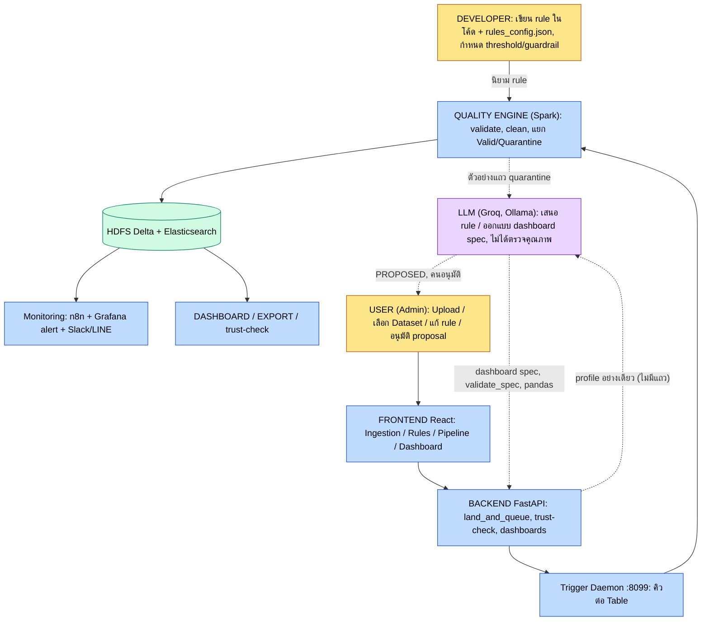

# SDOQAP White Box Analysis

**วิเคราะห์ระบบจาก Code จริง: ใครทำอะไร, Code ส่วนไหนทำ, ข้อมูลไหลอย่างไร**

- ระบบ: SDOQAP (Scalable Data Observability and Quality Assurance Platform)
- Branch / Commit ที่ตรวจ: `new-optimizer` / `e068c13` (Create Dashboard) โดยมีการแก้ไขที่ยังไม่ commit ใน `services/spark/schema_registry.json`
- วันที่จัดทำ: 2026-10-04
- วิธีตรวจ: อ่าน Code แบบ static (File Structure, API, Function, Processing Logic, Database, Workflow) ยังไม่ได้รันระบบ
- กติกา: ส่วนที่ไม่มีหลักฐานใน Code ระบุว่า **"ยังไม่พบหลักฐานใน Code"** ไม่เดา และไม่ให้คะแนนระบบ

## 0. ข้อค้นพบที่ต้องรู้ก่อนอ่านต่อ

**SDOQAP มี "เครื่องมือตรวจคุณภาพ" สองชุดที่แยกกัน** และสองชุดนี้ถูกอธิบายปนกันได้ง่าย:

| | Engine 1: Production Pipeline | Engine 2: White-box Demo |
|---|---|---|
| ผู้ประมวลผล | Spark (`services/spark/spark_quality_engine.py`) | pandas ใน API process (`services/api/app/api/whitebox.py`) |
| ข้อมูลที่รับ | ทุก Table ที่ ingest ผ่าน `/pipeline/ingest/*` | ไฟล์ `dirty_dataset.csv` หรือไฟล์ upload ที่มีคอลัมน์ `student_id, course, score, study_hours` ครบเท่านั้น |
| เก็บผล | Delta บน HDFS + Elasticsearch | ไฟล์ CSV ใน `OUTPUT_DIR` + `workflow_state.json` ไม่เขียน Elasticsearch/HDFS |
| หน้า UI | `/pipeline` (ประวัติการรัน), `/dashboard` | `/whitebox`, ส่วนบนของ `/rules`, `/export`, แผง white-box ใน `/pipeline` |

ถ้าไม่แยกสองชุดนี้ให้ชัด ผู้ชมจะเข้าใจผิดว่าตัวเลข 9400/100/600 บนหน้า Export คือผลของ Spark ทั้งที่มาจาก Engine 2

**แยกสามคำที่มักถูกใช้ปนกัน**

| คำ | ความหมายในเอกสารนี้ |
|---|---|
| Rule Definition | ใครคิด/กำหนดกฎ (Developer, Admin ผ่าน UI, หรือ LLM เสนอแล้วคนอนุมัติ) |
| Rule Execution | ใครบังคับใช้กฎกับข้อมูล ซึ่งเป็น Spark หรือ pandas เสมอ |
| LLM | ผู้ "เสนอ" เท่านั้น ไม่ใช่ผู้ตัดสินว่าแถวใดผ่านหรือไม่ผ่าน (ยกเว้นเส้นทาง auto-remediation ที่ระบุใน Part 6) |

## PART 1 — Workflow ตามขั้นตอน

| Workflow Step | มีจริง? | File | Function/Class | Input | Process | Output | ทำโดยใคร |
|---|---|---|---|---|---|---|---|
| Data Source | จริง (บางส่วน) | `ui/src/pages/Ingestion.jsx`; `api/app/api/pipeline.py` | แท็บ file/rdbms/api/stream | CSV/XLSX, API URL, PostgreSQL, Reddit | ผู้ใช้เลือกแหล่ง แท็บ API และ Stream ของ UI เรียก `/whitebox/ingest-source` ซึ่งจำลอง (`simulated:true`) | ข้อมูลต้นทาง | User + External System |
| Data Ingestion | จริง | `pipeline.py` | `land_and_queue` (L271), `ingest_csv`, `ingest_api`, `ingest_rdbms` | ไฟล์/URL/SQL | เช็ค SHA-256 ซ้ำ, เช็ค PK ใน header, เขียน HDFS, สร้าง run QUEUED, เรียก daemon | `ingest_id`, ไฟล์ใน `/data/raw/<t>/<ingest_id>/` | SDOQAP System (guard: Developer-defined) |
| Data Extraction | จริง | `pipeline.py`; `spark_quality_engine.py` | `ingest_api` (JSON เป็น CSV, ตัว resolve ของ data.go.th), `run_readonly_query`; อ่าน CSV ใน `run_quality_check` | JSON/XLSX/ผลลัพธ์ SQL | แปลงเป็น CSV ฝั่ง API แล้ว Spark อ่าน CSV (header, multiLine, ทุกคอลัมน์เป็น string) ไม่มี JDBC ใน Spark | CSV ใน HDFS | SDOQAP System + Spark |
| Data Validation | จริง | `sdoqap/stages/schema.py`, `cleansing.py` | `schema_align`, `schema_drift`, `validation` | DataFrame ดิบ + schema spec | cast ชนิด, ตรวจ PK/null/type/date, ตรวจ drift | แถว `is_invalid` + `reject_reason`; proposal ใน ES | Spark (Rule: Developer-defined ในโค้ด) |
| Data Transformation | จริง | `cleansing.py`, `standardize.py`, `assembly.py`; `spark_quality_engine.py` | `auto_clean`, `apply_dsl_remediation_rules` (L819), `standardize_dates`, `standardize_categories`, `column_filter` | DataFrame | dedup PK, DSL (fillna/calculate/cast/standardize/semantic_standardize/filter), แปลงวันที่ | `clean_df` | Spark |
| Data Quality Check | จริง | `rules.py`, `anomaly.py`, `data_profile_store.py` | `range_rules`, `anomaly_iqr`, `anomaly_zscore`, `anomaly_induced`, `run_profile_cycle` | `clean_df` + rules | ช่วงค่า, IQR, Z-score, rule จาก decision tree, PSI/null-drift | แถวที่ถูกแยก + ตัวชี้วัด | Spark |
| Quality Gate | บางส่วน | `metrics.py:161-182`; `report.py:75`; `api/.../lineage.py:340-447` | `quality_score`, `report`, `get_table_trust_check` | จำนวน clean/quarantine + threshold | Spark ไม่มี gate แข็ง: คะแนนต่ำกว่า threshold แค่ส่ง alert และตั้ง state `warnings` ส่วน gate จริงคือ API `trust-check` แบบ pull ซึ่งมีผลก็ต่อเมื่อผู้บริโภคเรียกถามเอง | `is_safe_to_consume`, `SAFE` / `HALT_INGEST` / `WARNING_SUSPECT` | SDOQAP System (threshold: Developer-defined / adaptive) |
| Valid / Quarantine | จริง | `assembly.py:6-49` | `quarantine_assembly` | ชุด invalid/dup/range/iqr/zscore/induced | `unionByName` เติม `run_id`, `rejected_at` | DataFrame quarantine | Spark |
| Data Loading | จริง | `spark_quality_engine.py:1702-1753` | Delta MERGE | `clean_df`, `quarantine_df` | Quarantine: ลบ `ingest_id` เดิมแล้ว append; Active: MERGE ตาม PK ทุกครั้ง ไม่ขึ้นกับคะแนน | Delta สองที่ | Spark |
| Data Storage | จริง | `docker-compose.yml`; `report.py` | HDFS, Elasticsearch | | Delta (`/data/active`, `/data/quarantine`), CSV (`/data/raw`, `/data/archive`), index `sdoqap_*` | | External Technology |
| Monitoring | บางส่วน | `infra/n8n/ingestion_workflow.json`; `infra/grafana/.../alert_rules.yaml`; `system.py`; `alert_router.py` | n8n poll ทุก 15 นาที, Grafana 2 rules, `trigger_alert_routing` | `sdoqap_quality_runs` | แจ้งเตือน Slack/LINE ถ้าตั้ง env ไม่ตั้งก็แค่ print ไม่มี Prometheus ที่ใช้งานจริง | alert | n8n, Grafana (External) + API |
| Dashboard | จริง | `ui/src/pages/Dashboard.jsx`; `analytics.py` | `get_executive_overview` ฯลฯ | `sdoqap_quality_runs`, `_pipeline_runs`, `_schema_drifts` | API รวมค่า UI วาดด้วย Recharts/ECharts ไม่มี Grafana dashboard ที่ provision | หน้า Dashboard | SDOQAP System |
| Data Utilization | จริง | `data_export.py`, `lineage.py`, `gold.py`, `dashboards.py` | `export_*`, `trust-check`, Create Dashboard | active layer, gold index | ดาวน์โหลด CSV, trust-check, รายงาน gold, สร้าง Dashboard ด้วย AI | ไฟล์ / Dashboard | User + System (+ LLM ในส่วน Dashboard) |

## PART 2 — ใครทำอะไร (ยืนยันจาก Code)

### A. Developer / ทีมพัฒนา (สิ่งที่ฝังในโค้ดหรือไฟล์ที่ commit)

- กำหนดลำดับขั้นตายตัวใน `sdoqap/pipeline/plan.py` (ALIGN, TRANSFORM, POST_LOAD)
- เขียนเงื่อนไขที่ไม่ผ่าน config: PK null, null ทุกคอลัมน์ใน schema, type cast, Z-score 3.0 (`cleansing.py`, `anomaly.py`)
- กำหนดค่าเริ่มต้นใน `rules_config.json`: threshold 90/70, `iqr_multiplier` 1.5 (3.0 สำหรับ `student_course_scores`), `range_checks`
- เขียน guardrail สำหรับ AI: ห้ามต่ำกว่า 70, ลดได้ไม่เกิน 10%, ห้ามปิด check สำคัญ (`dynamic_rules.py:564-605`)
- เขียนค่าคงที่ใน demo เช่น fence 154/100, ความมั่นใจ 96.0, `"PASSED"` (`whitebox.py`)
- เขียน prompt และ whitelist ของ Dashboard (`dashboard_llm.py`, `dashboard_spec.py`)

### B. User (ผ่าน UI ที่ login ด้วยบัญชี admin เดียว)

- อัปโหลดไฟล์ / ใส่ URL / ใส่ connection ของ PostgreSQL (`Ingestion.jsx`)
- ปรับ rule ผ่าน `/rules`: ช่วงคะแนน, composite key, Tukey multiplier (ส่วนบน) และ `PUT /rules/{table}` (ส่วนขั้นสูง)
- อนุมัติ/ปฏิเสธ: schema proposal, AI rule proposal, หมวดหมู่ใน review queue, review rows
- ใส่ Groq key ในหน้า `/rules` แท็บ settings
- เลือก Dataset, พิมพ์ความต้องการ, เลือก audience, สั่ง refine, บันทึก Dashboard

### C. System (อัตโนมัติ ไม่ใช้ LLM)

- ตรวจไฟล์ซ้ำด้วย SHA-256, ตรวจว่ามีคอลัมน์ PK, ตรวจ allowlist/SSRF
- จัดคิวต่อ Table, lock, heartbeat (`trigger_core.py`, `spark_quality_engine.py`)
- cast / validate / dedup / แยก quarantine, คำนวณ score, threshold แบบ adaptive
- Delta MERGE, archive raw, เขียน log ลง ES, สร้าง gold, ส่ง alert
- ตรวจ drift ของ schema และสร้าง proposal สถานะ PENDING

### D. LLM (Groq, ถ้าไม่ได้ก็ Ollama, ถ้าไม่ได้ก็ heuristic ในเครื่อง)

LLM ทำเฉพาะสามอย่างนี้ และทุกอย่างผ่านการตรวจก่อนมีผล ยกเว้นข้อ 3:

1. สร้าง/แก้ spec ของ Dashboard (JSON) แล้วถูก `validate_spec` ตรวจกับ whitelist
2. วิเคราะห์ตัวอย่างแถว quarantine เสนอ rule (`ai_rule_advisor.py`) เก็บสถานะ PROPOSED รอมนุษย์อนุมัติ
3. สังเคราะห์ DSL remediation (`auto_remediation_engine.py`) และ **บันทึกอัตโนมัติถ้า confidence ≥ 0.80 โดยไม่มีมนุษย์อนุมัติ** (จุดอ่อนสำคัญ ดู Part 11)

LLM **ไม่ได้** อ่านทั้ง dataset, ไม่ได้คำนวณตัวเลข Dashboard (pandas คำนวณ) และไม่ได้อยู่ใน Spark validation stages

### E. External Technology

HDFS/WebHDFS, Delta Lake, Elasticsearch, Spark, n8n (schedule + relay), Grafana (alert rules), Kafka/Reddit (stream), Slack/LINE, data.go.th

## PART 3 — ข้อมูลซ้ำ / Schema ต่างกัน: Code ทำอะไรจริง และควรทำอย่างไร

| # | ปัญหา | ในระบบตอนนี้ (หลักฐาน) | เทคนิคที่เหมาะ | ประเภทวิธี | มนุษย์ยืนยัน? |
|---|---|---|---|---|---|
| 1 | Duplicate Record | **จริง** Spark: dedup ตาม PK (`cleansing.py` `auto_clean` ทิ้งเงียบ, `dedup` quarantine เมื่อ `auto_clean=false`); whitebox: composite key `student_id+course+semester` | Key matching, hashing (`row_hash` มีอยู่แล้ว) | Rule-based | ไม่ ถ้า key ชัดเจน แต่ควร log |
| 1b | ไฟล์ซ้ำ (คนละเรื่องกับแถวซ้ำ) | **จริง** `run_registry.find_duplicate` เทียบ table + SHA-256 | Checksum | Rule-based | ไม่ |
| 2 | Duplicate Column | **ยังไม่พบหลักฐานใน Code** | Data profiling: เทียบ distribution/hash ของค่าในคอลัมน์ | Statistical + Rule | ใช่ ก่อนลบ |
| 3 | Duplicate Table | เจอแค่ไฟล์ซ้ำต่อ Table เดียวกัน การซ้ำข้าม Table **ยังไม่พบหลักฐานใน Code** | Table fingerprint (row-hash set overlap, MinHash) | Statistical | ใช่ |
| 4 | ข้อมูลเดิม ลำดับคอลัมน์ต่าง | ไม่มีการตรวจโดยตรง `schema_align` จับคู่ตามชื่อ จึงไม่พึ่งลำดับ (อนุมานจาก Code) | จับคู่ตามชื่อ ไม่ใช่ตามตำแหน่ง | Rule-based | ไม่ |
| 5 | ชื่อคอลัมน์ต่าง | **บางส่วน** Spark `normalize_name` (ตัดช่องว่าง `-` `_` แล้ว lower, `names.py:4`); whitebox `_normalize_token` ตัดทุกอย่างที่ไม่ใช่ a-z0-9 (`whitebox.py:947`) จับ `studentId` กับ `student_id` ได้ แต่ **ผูกกับสองตารางและคอลัมน์ตายตัว** และความมั่นใจ 96.0 เป็นค่าคงที่ | Schema matching: ชื่อ + ชนิด + profile ของค่า + พจนานุกรม synonym | Rule + Statistical | ใช่ เมื่อชื่อไม่เหมือนกันจริง (`fullName` กับ `student_name`) |
| 6 | ชนิดข้อมูลต่าง | **บางส่วน** Spark `schema_drift` จับ type mismatch แล้ว cast เป็น string + alert (ภายใน Table เดียวเทียบกับ registry) ข้าม Table: whitebox แค่แสดง dtype เป็น evidence | Type inference + type compatibility matrix | Rule-based | ใช่ ถ้าต้องเปลี่ยนชนิดถาวร (มี schema proposal อยู่แล้ว) |
| 7 | Entity เดียวอยู่หลายคอลัมน์ | **ยังไม่พบหลักฐานใน Code** | Column parsing/splitting (regex, พจนานุกรมตำแหน่ง) + profiling | Rule + พจนานุกรม | ใช่ |
| 8 | คนเดียวอยู่หลาย Table | **บางส่วน** whitebox `analyze`/`join`: เทียบ key แบบตรงตัว, match rate, cardinality แล้ว left join (`whitebox.py:979-1135`) **ตายตัว** กับ `studentId` และ `student_id` ไม่มี fuzzy | Key matching ต่อด้วย Entity resolution / record linkage | Rule แล้ว Statistical (fuzzy) | ใช่ ทุกครั้งที่ไม่ใช่ key ตรงตัว |
| 9 | Schema ต่างแต่ความหมายเหมือน | **ยังไม่พบหลักฐานใน Code** (เกินกว่าการเทียบชื่อที่ normalize แล้ว) | Schema mapping + ontology/พจนานุกรมโดเมน; LLM เสนอ mapping เป็น "ข้อเสนอ" ได้ | Rule + LLM (เสนอ) | **ใช่ เสมอ** |
| 10 | Semantically Similar Data | **บางส่วน** `semantic/similarity.py`: `0.4*containment + 0.3*token-overlap + 0.3*char-bigram-cosine` ใช้กับ **ค่าหมวดหมู่ใน Column** (เช่น "Mngr" เป็น "Manager") ไม่ใช่ embedding และไม่ใช่ LLM จึงเป็นความคล้ายเชิงตัวอักษร ไม่ใช่เชิงความหมาย | String similarity แล้ว (ถ้าจำเป็น) embedding | Statistical | ใช่ ช่วง 0.60 ถึง 0.90 (มี review queue แล้ว) |

**หลักการเลือกวิธี:**

- Rule-based เหมาะกับ key ตรงตัว, checksum, type compatibility
- Statistical เหมาะกับ profile overlap และ fuzzy score
- ML/LLM ควรเป็นผู้เสนอ mapping เท่านั้น
- มนุษย์ต้องยืนยันทุกกรณีที่ความผิดพลาดมีผลถาวร (รวมคน, ลบคอลัมน์, ผูกตาราง)

## PART 4 — "คนเดียวแต่ข้อมูลอยู่หลายคอลัมน์"

### แนวคิด

- **Entity** คือสิ่งในโลกจริง (เช่น Somchai ในตำแหน่ง Manager ฝ่ายการเงิน)
- **Natural key** คือค่าที่มีความหมายในธุรกิจ (เลขบัตร, รหัสพนักงาน) **Composite key** คือหลายคอลัมน์ประกอบกัน (ระบบใช้ `student_id+course+semester`) **Primary/Foreign key** คือกุญแจที่ใช้ผูกตาราง
- **Entity Resolution / Entity Matching / Record Linkage** คือการตัดสินว่าสองระเบียนอ้างถึงคนเดียวกันหรือไม่ เมื่อไม่มี key ร่วมที่เชื่อถือได้
- **Semantic similarity** เป็นเพียงหนึ่งใน "หลักฐาน" ไม่ใช่คำตอบเดี่ยว

สามรูปแบบในตัวอย่าง (`Finance | Somchai | Manager`, `Finance Manager | Somchai`, `Somchai | Finance Manager`) ไม่สามารถตัดสินด้วยการเทียบชื่อคอลัมน์ได้ ต้อง **แยก (parse) ค่า** ก่อน แล้วจึงเทียบ entity

### ระบบควรตัดสินเองหรือให้ User ยืนยัน? (แบ่งตามความเสี่ยง)

| กรณี | การตัดสินใจ |
|---|---|
| Key ตรงตัว (รหัสพนักงานตรงกัน) | ระบบทำเอง บันทึก log |
| ไม่มี key แต่ชื่อ+แผนกตรงกันทุกส่วน | ระบบเสนอ ให้ User ยืนยัน (การรวมคนผิดคนมีผลเสียกว่าการไม่รวม) |
| ชื่อคล้ายแต่ไม่แน่ใจ (สะกดต่าง, ชื่อเล่น/ชื่อจริง) | ห้ามรวมเอง เข้าคิวรีวิว |
| แยก `Finance Manager` เป็นสองคอลัมน์ | rule/พจนานุกรมทำเป็น "ข้อเสนอ" แล้วให้ยืนยันครั้งเดียวต่อรูปแบบ (ไม่ต้องยืนยันทุกแถว) |

### Workflow ที่เหมาะกับ SDOQAP

profile ทั้งสองแหล่ง, จับคู่ schema (ชื่อ + ชนิด + การทับซ้อนของค่า), แยกค่าด้วย rule/พจนานุกรม, blocking (จัดกลุ่มผู้สมัคร), ให้คะแนน, แบ่งเป็น auto / review / reject ตาม threshold, มนุษย์ยืนยัน, บันทึก mapping พร้อม provenance, นำ mapping กลับมาใช้

รูปแบบ "auto / review / reject" **มีอยู่แล้ว** ในการ standardize ค่าหมวดหมู่ (คะแนนมากกว่า 0.90 learn อัตโนมัติ, 0.60 ถึง 0.90 เข้า `sdoqap_unmapped_terms` เพื่อ approve/override/reject ใน `standardize.py`) จึงขยายแนวเดียวกันไปยัง entity ได้ โดยเข้มงวดกว่าสำหรับข้อมูลที่เป็นตัวบุคคล

## PART 5 — Recall

**สูตร:** Recall = TP / (TP + FN) โดย TP คือผิดจริงและระบบจับได้ FN คือผิดจริงแต่ระบบจับไม่ได้

**ตัวอย่าง:** Duplicate จริง 100 แถว ระบบตรวจพบ 90 แถว ได้ TP = 90, FN = 10 จึง **Recall = 90/100 = 90%**
ถ้าระบบ flag ทั้งหมด 120 แถว (90 ถูก, 30 ไม่ใช่ duplicate) จะได้ FP = 30 และ Precision = 90/120 = **75%**

| Metric | สูตร | ความหมาย | Data Quality Example |
|---|---|---|---|
| Precision | TP / (TP + FP) | ที่ระบบ flag ว่าผิด ผิดจริงกี่ % | flag 120 แถว ผิดจริง 90 ได้ 75% |
| Recall | TP / (TP + FN) | ที่ผิดจริงทั้งหมด ระบบจับได้กี่ % | ผิดจริง 100 จับได้ 90 ได้ 90% |

- **Recall สูง** คือพลาดข้อมูลเสียน้อย (ข้อมูลเสียหลุดเข้า Active น้อย) **Recall ต่ำ** คือมีข้อมูลเสียหลุดผ่านมาก
- ถ้าเพิ่ม Recall ด้วยการตั้ง rule เข้มขึ้น Precision มักลดลง (กักข้อมูลดีเกินจำเป็น) ต้องดูคู่กันเสมอ
- **ข้อควรระวัง:** Recall คำนวณได้ต่อเมื่อมี Ground Truth ว่าแถวไหนผิดจริง

**ใน Code:**

- `whitebox.py` `evaluate_ground_truth` (L740) คำนวณ TP/FP/FN, precision, recall, F1 แยกตามประเภท เทียบกับ `ground_truth.csv` ใช้ได้เฉพาะชุดประเมินที่ติดมา (ถ้าเป็นไฟล์ upload จะตอบ `NOT_APPLICABLE`) แต่ฟิลด์ `status` **คืน `"PASSED"` เสมอ** ไม่ขึ้นกับผล
- `scripts/evaluation/detection.py` คำนวณ precision / recall / accuracy ของ **ผลรัน Spark** เทียบ `ground_truth.csv` นี่คือหลักฐานฝั่ง Production ที่ตรงกว่า
- ข้อควรระวังตอนนำเสนอ: ชุดประเมินเป็นข้อมูลสังเคราะห์ที่ฝัง error ไว้ และ rule ถูกออกแบบโดยรู้ประเภท error อยู่แล้ว การได้ Recall 100% (ที่ test ยืนยัน) จึงสะท้อนว่า rule ตรงกับ error ที่ฝัง ไม่ได้พิสูจน์ความครอบคลุมกับข้อมูลจริง
- Production ปกติไม่มี ground truth จึง **ยังไม่พบหลักฐานใน Code** ว่ามีการคำนวณ Recall อัตโนมัติกับข้อมูลที่ ingest จริง

## PART 6 — Rule แก้โดย "เรา" หรือ "ระบบ": สถานะปัจจุบันและข้อเสนอ

### แยกสองสิ่งที่มักถูกเรียกรวมกัน

- **Rule Definition** = ใครคิด/กำหนดกฎ (Developer, Admin ผ่าน UI, หรือ LLM เสนอแล้วคนอนุมัติ)
- **Rule Execution** = ใครบังคับใช้กฎกับข้อมูล ซึ่งเป็น "ระบบ" เสมอ แม้กฎจะเขียนโดยคน การรัน rule ของ Developer ไม่ใช่ "ระบบคิดกฎเอง"

### ที่มาของ rule ในระบบตอนนี้ (จาก Code)

| ที่มา | ผู้กำหนด | ผู้ execute | มีคนอนุมัติ? |
|---|---|---|---|
| ค่าคงที่ในโค้ด (PK null, null ทุกคอลัมน์, Z-score 3.0) | Developer | Spark | ไม่เกี่ยวข้อง |
| `rules_config.json` (seed) | Developer | Spark | ไม่เกี่ยวข้อง |
| `PUT /rules/{table}` | Admin ผ่าน UI | Spark | ตัวผู้แก้เอง |
| AI proposal (`ai_rule_advisor`) | LLM เสนอ | Spark (หลังอนุมัติ) | **ใช่** (`approve_proposal`) |
| Decision-tree induced rule | Spark MLlib เสนอ | Spark | **ใช่** ผ่าน proposal |
| Auto-remediation DSL (`auto_remediation_engine.py`) | **LLM** | Spark | **ไม่** (บันทึกอัตโนมัติถ้า confidence ≥ 0.80) |
| Semantic auto-learn (มากกว่า 0.90) | ระบบ (similarity) | Spark | **ไม่** (0.60 ถึง 0.90 มีรีวิว) |

### Metadata ที่เก็บอยู่จริง เทียบกับที่ควรมี

| Field ที่เสนอ | มีใน Code? | หลักฐาน |
|---|---|---|
| `run_id`, `ingest_id`, `timestamp` | มี | `sdoqap_quality_runs`, quarantine (`rejected_at`) |
| `reason` (ระดับแถว) | มี | `reject_reason` ในแถว quarantine |
| `rule_name` (ระดับสรุป) | มีบางส่วน | `remediation_logs` (เช่น `resolved_N_duplicates`) เป็นสตริงต่อ run ไม่ผูกกับ rule id |
| `created_by` / `changed_by` | เฉพาะบางเส้นทาง | `PUT /rules` เขียน `sdoqap_rules_audit_log` (`changed_by`, `body_applied`, `before`); Dashboard มี `created_by`; schema proposal มี `resolved_by` |
| `approval_status` | มี | `status` ของ proposal (PROPOSED / APPROVED / REJECTED) |
| `origin` | มีบางส่วน | `decision_tree_induction`, `profile_drift_detection` ใน induced rule |
| `confidence` | มี | ใน proposal (แต่ค่า 0.0 จากโมเดลถูกแปลงเป็น 0.8 ที่ `ai_rule_advisor.py:231,380`) |
| `rule_id` | ยังไม่พบหลักฐานใน Code | |
| `executed_by`, `execution_mode` (auto/manual) | ยังไม่พบหลักฐานใน Code | |
| `before_value` / `after_value` ระดับเซลล์ | ยังไม่พบหลักฐานใน Code | DSL แก้ค่าแล้วไม่เก็บค่าก่อนแก้ ยกเว้น `_raw_<col>` เมื่อ `schema_mode="evolve"` ซึ่งไม่ได้เปิดโดยค่าเริ่มต้น |
| `approved_by` | ยังไม่พบหลักฐานใน Code | มีแค่ `approved_at` (`dynamic_rules.py:519`) |
| audit ตอนอนุมัติ AI rule | ยังไม่พบหลักฐานใน Code | |
| `created_by`/`origin`/`approval` ของ rule ที่ LLM สังเคราะห์ | ยังไม่พบหลักฐานใน Code | `save_remediation_rules` แค่ `er.update(nr)` ลง ES และไฟล์ local |

### Workflow ที่ถูกต้องเมื่อ Developer เขียน rule แต่ระบบ execute (ข้อเสนอ)

1. Developer/Admin กำหนด rule โดย rule ได้ `rule_id`, `created_by`, `origin=developer`
2. Spark execute และบันทึก `rule_id`, `executed_by=spark`, `execution_mode=auto`, `run_id`
3. ผลบันทึกใน transformation log (`before` / `after` / `reason`) แถวที่ถูกแก้อ้างกลับ `rule_id` ได้
4. UI แสดงว่า "กฎโดย: Developer, ใช้งานโดย: ระบบ"
5. ถ้า LLM เสนอกฎ ต้องเป็น `origin=llm`, `approval_status` และ `approved_by` ก่อนมีผล เส้นทาง AI proposal ทำถูกอยู่แล้ว แต่เส้นทาง auto-remediation ยังข้ามขั้นนี้

## PART 7 — White Box ราย Feature (File/Function จริง)

### 7.1 อัปโหลด CSV เข้า Pipeline (Production)

```
USER      เลือกไฟล์ + ชื่อ Table (Ingestion.jsx)
FRONTEND  POST /whitebox/upload-csv (โปรไฟล์ทันที) + POST /pipeline/ingest/csv (multipart)
API       pipeline.py ingest_csv: read_upload_limited (MAX_UPLOAD_MB), xlsx แปลงเป็น csv
BACKEND   land_and_queue: find_duplicate, missing_primary_key_columns,
          upload_to_webhdfs, create_run, trigger_spark_job
PROCESS   daemon /retry, TableJobQueue, spark-submit spark_quality_engine.py,
          run_quality_check (stage ใน plan.py)
STORAGE   /data/active (Delta MERGE), /data/quarantine (Delta), /data/archive
          ES: sdoqap_quality_runs, _pipeline_runs, _lineage_runs, _runs, _schema_drifts
RESULT    sdoqap_runs state = SUCCEEDED / SKIPPED / FAILED
UI        useRunStatus poll /pipeline/runs/{id} (RunStatusLine), ประวัติใน Pipeline.jsx
LOG       print() ใน API/Spark, เอกสารใน ES, ring buffer 500 บรรทัดของ daemon
```

### 7.2 แก้ Rule ผ่านหน้า Rules

```
USER      ปรับ min/max, composite key, Tukey แล้วกด "บันทึกกฎ" (RulesConfig.jsx syncWbState)
API       POST /whitebox/state (whitebox.py update_workflow_state)
PROCESS   _recompute_interactive_state ประมวลผล pandas ใหม่ (Engine 2 เท่านั้น)
STORAGE   workflow_state.json + 3 CSV ใน OUTPUT_DIR
UI        ตัวเลขใน /rules /pipeline /export
หมายเหตุ  ไม่กระทบ Spark production
ส่วนขั้นสูง: PUT /rules/{table} -> _save_rules_config -> ES sdoqap_rules_registry
          + rules_config.json -> มีผลกับรอบ Spark ถัดไป + เขียน sdoqap_rules_audit_log
```

### 7.3 AI เสนอ rule แล้วคนอนุมัติ

```
SPARK     advisory.py ai_advisory (trigger ตาม rules/anomaly/score<threshold-15)
          หรือ USER กด "วิเคราะห์ด้วย AI"
ADVISOR   ai_rule_advisor.py ai_analyze_quarantined_sample:
          redact PK/คอลัมน์แนว id,email,phone -> Groq -> Ollama -> heuristic
STORAGE   sdoqap_ai_rule_proposals (PROPOSED) + ticket ใน sdoqap_upstream_remediations
UI        RulesConfig แท็บ proposals -> POST /rules/ai-proposals/{id}/approve
APPROVE   dynamic_rules.py approve_proposal: guardrail -> _save_rules_config -> ใช้รอบถัดไป
```

### 7.4 Schema drift

`schema.py schema_drift` ตรวจ แล้วเขียน `sdoqap_schema_drifts` + proposal สถานะ PENDING ผู้ใช้ดูใน `Schema.jsx` แล้ว `schema.py approve_proposal` เขียน `sdoqap_schema_registry` และ `schema_registry.json` จากนั้น `trust-check` นับ proposal ที่ค้างอยู่

### 7.5 Create Dashboard (AI)

```
USER      เลือก Dataset, พิมพ์ความต้องการ, กด "สร้างแดชบอร์ดด้วย AI"
          (DashboardBuilder.jsx, ContextForm.jsx)
FRONTEND  dashboardsApi.generate -> POST /dashboards/generate
API       dashboards.py generate_dashboard -> load_active_dataset (HDFS /data/active)
LLM       dashboard_llm.generate_spec ส่ง Groq แค่ profile
          (ชื่อ/ชนิด/distinct/missing%/min-max) ไม่ส่งแถวข้อมูล
VALIDATE  dashboard_spec.validate_spec (whitelist)
COMPUTE   dashboard_compute.compute_dashboard (pandas)
UI        DashboardCanvas; คลิก/กรอง -> POST /render; refine -> POST /refine;
          บันทึก -> index sdoqap_dashboards
FALLBACK  ไม่มี key: fallback_spec (กฎจากชนิดคอลัมน์) / Refine ไม่มี fallback
```

### 7.6 Trust-check ก่อน Export

`DataExport.jsx` เรียก `GET /lineage/{t}/trust-check` ซึ่ง `lineage.py get_table_trust_check` อ่าน `sdoqap_quality_runs` + `sdoqap_schema_proposals` แล้วแสดงแบนเนอร์ ข้อควรระวัง: การ Export อ่าน Delta ผ่าน `/export/active/*` ซึ่ง **ไม่ได้บังคับ** ผล trust-check

## PART 8 — Data Quality Rule เจาะ Code

| Rule | File | Function | Input | Condition | Action | Output |
|---|---|---|---|---|---|---|
| PK null | `sdoqap/stages/cleansing.py` | `validation` | แถว | PK ใดๆ เป็น null | quarantine | `missing_primary_key` |
| Missing/Null | `cleansing.py` | `validation` | คอลัมน์ใน schema ที่ไม่ใช่ PK | ค่า null | quarantine | `null_value_in_<col>` |
| Data Type | `cleansing.py` | `validation` (+ `schema.py schema_align`) | Integer/Double | cast แล้วเป็น null ทั้งที่มีค่า | quarantine (ส่วนมากถูก null rule จับก่อน) | `invalid_type_<col>` |
| Date null | `cleansing.py` | `validation` | date column | null | quarantine | `missing_date` |
| Duplicate | `cleansing.py` | `auto_clean` / `dedup` | แถวตาม PK | PK ซ้ำ | ทิ้งเงียบ (default) หรือ quarantine | `resolved_N_duplicates` / `duplicate_records` |
| Range | `rules.py` | `range_rules` | `range_checks` | ค่านอก min/max | quarantine | `out_of_range_<col>` |
| Outlier IQR | `anomaly.py` | `anomaly_iqr` | numeric | นอก Q1 - m*IQR ถึง Q3 + m*IQR | quarantine | `col=val (expected [...])` |
| Outlier Z-score | `anomaly.py` | `anomaly_zscore` | numeric | abs(z) มากกว่า 3.0 | quarantine | `<col>_zscore=...` |
| Induced | `anomaly.py` | `anomaly_induced` | `induced.*.condition` | เงื่อนไขเป็นจริง | quarantine | `induced_tree_rule_match` |
| Schema | `schema.py` | `schema_drift` | spec เทียบ actual | คอลัมน์ขาด / ชนิดต่าง / ใหม่ | เติม null / cast string / proposal | `sdoqap_schema_drifts` |
| Transformation | `spark_quality_engine.py` | `apply_dsl_remediation_rules` | `remediation_rules` | ตามชนิด | แก้ค่า (`filter` ทิ้งแถวเงียบ) | `clean_df` |
| Whitebox rules | `whitebox.py` | `_recompute_interactive_state` | พารามิเตอร์ใน state | duplicate, null, range, Tukey ตามลำดับ | Clean / Review / Quarantine | 3 CSV |

| Rule | Developer กำหนด? | System execute? | User แก้ได้? | LLM เกี่ยวข้อง? |
|---|---|---|---|---|
| PK null, null ทุกคอลัมน์, type, Z-score | ใช่ (ฝังโค้ด) | ใช่ (Spark) | **ไม่ได้** (ไม่อ่าน config) | ไม่ |
| Range, IQR multiplier | ใช่ (ค่าเริ่มต้น) | ใช่ | ได้ ผ่าน `PUT /rules` | ไม่ (LLM เสนอปรับได้) |
| Duplicate | ใช่ | ใช่ | ปรับ `auto_clean` ได้ ส่วน `duplicate_check.*` **ไม่ถูกอ่าน** | ไม่ |
| Induced rule | ไม่ (Decision tree เสนอ) | ใช่ หลังอนุมัติ | อนุมัติ/ปฏิเสธ | ไม่ใช่ LLM (MLlib) |
| DSL remediation | บางส่วน (ใน config) หรือ LLM สังเคราะห์ | ใช่ | แก้ใน config ได้ | **ใช่** (auto-remediation) |
| config ที่ Spark ไม่อ่าน (`null_checks.*`, `value_range.column_overrides`, `freshness_threshold_hours`, `null_primary_key.*`, `duplicate_check.*`) | ใช่ | **ไม่ถูก enforce** | แก้ได้แต่ไม่มีผล | LLM เสนอ path เหล่านี้ได้ |

## PART 9 — Feature ทำงานจริงหรือไม่

สถานะ: REAL = ทำงานจริงตาม Code, PARTIAL = ทำงานบางส่วนหรือมีส่วนฝัง, MOCK = จำลอง, UI ONLY = มีแต่หน้าจอ, NOT FOUND = ไม่พบ

| Feature | UI มี | Backend มี | Processing จริง | Database/Storage | Log | สถานะ |
|---|---|---|---|---|---|---|
| Ingestion: ไฟล์/API/RDBMS | ใช่ | ใช่ | ใช่ | HDFS raw + `sdoqap_runs` | print + ES | **REAL** |
| Ingestion: แท็บ API/Stream ใน UI (`/whitebox/ingest-source`) | ใช่ | ใช่ | ไม่ (จำลอง) | `workflow_state.json` | ไม่มี | **MOCK** (ช่อง Method/Token ไม่ถูกส่ง) |
| Ingestion: Reddit stream | ใช่ | ใช่ | ใช่ (ต้องเปิด profile `streaming`) | Parquet + ES `reddit` | buffer ของ daemon | **PARTIAL** (ไม่ผ่านตรวจคุณภาพ) |
| Data Extraction | ไม่มี | ใช่ | ใช่ | HDFS | ไม่มี | **REAL** (ไม่มี JDBC ใน Spark) |
| Data Validation | ไม่มี | ใช่ | ใช่ | quarantine | ES | **REAL** |
| Data Transformation | ไม่มี | ใช่ | ใช่ | active | `remediation_logs` | **REAL** |
| Data Quality | หน้า pipeline/dashboard | ใช่ | ใช่ | ES quality_runs | ES | **REAL** (config บางคีย์ไม่ถูกอ่าน) |
| Quality Gate | แบนเนอร์ใน Export | ใช่ (`trust-check`) | ใช่ แต่ไม่บังคับ | ไม่มี | ไม่มี | **PARTIAL** (Spark ไม่ block การโหลด) |
| Quarantine | ใช่ (RunRecordsPanel) | ใช่ | ใช่ | Delta | ES | **REAL** |
| Data Loading | ไม่มี | ใช่ | ใช่ | Delta MERGE | print | **REAL** |
| Monitoring | หน้า Home/Dashboard | ใช่ | ใช่ | ES | ES | **PARTIAL** (ไม่มี Prometheus; Grafana ไม่มี dashboard; alert Slack/LINE ต้องตั้ง env) |
| Dashboard (หน้า `/dashboard`) | ใช่ | ใช่ | ใช่ แต่บางส่วนเป็นข้อความ/ตัวเลขฝัง | อ่าน ES | ไม่มี | **PARTIAL** (sell-in/out, narrative, durations ฝัง) |
| Create Dashboard | ใช่ | ใช่ | ใช่ (pandas) | `sdoqap_dashboards` | `logging` | **REAL** |
| LLM (Dashboard) | ใช่ | ใช่ | ใช่ | ไม่มี | log warning | **REAL** (ต้องมี key; ไม่งั้น rule-based) |
| LLM (rule advisor) | ใช่ | ใช่ | ใช่ | `sdoqap_ai_rule_proposals` | print | **REAL** (แต่ rule path บางตัวไม่มีผล) |
| AI Recommendation (`/analytics/recommendations`) | ใช่ | ใช่ | กฎจากข้อมูล drift ไม่ใช่ AI | ไม่มี | ไม่มี | **PARTIAL** (UI ระบุเองว่าไม่ใช่ AI) |
| AI Context (whitebox) | ใช่ | ใช่ | Groq ถ้ามี key | cache ในหน่วยความจำ | ไม่มี | **PARTIAL** |
| Data Profiling | ใช่ | ใช่ | ใช่ (pandas และ Spark `run_profile_cycle`) | `sdoqap_data_profiles` | ไม่มี | **REAL** (drift ทำงานเมื่อมี profile เดิม; `ELASTICSEARCH_URL` ใน Spark container น่าจะไม่ถูกตั้ง ต้องตรวจ) |
| Multi-table join | ใช่ (`/whitebox`) | ใช่ | ใช่ แต่ตายตัว 2 ตาราง | CSV | ไม่มี | **PARTIAL** |
| Duplicate column / Entity resolution | ไม่มี | ไม่มี | ไม่มี | ไม่มี | ไม่มี | **NOT FOUND** |

## PART 10 — Diagram สำหรับสไลด์

<!-- DIAGRAM:swimlane -->



<!-- /DIAGRAM -->

**ป้ายที่ควรขึ้นสไลด์:** เหลือง = คนทำ (Developer ≠ User), น้ำเงิน = ระบบทำ, ม่วง = AI ทำ (**LLM ≠ Quality Engine**: LLM ไม่เคยเป็นผู้ตัดสินว่าแถวใดผ่านหรือไม่ผ่าน ยกเว้นเส้นทาง auto-remediation ที่ใช้ rule ที่ LLM สร้างโดยไม่มีมนุษย์อนุมัติ)

## PART 11 — จุดที่กรรมการอาจเข้าใจผิด

### 1. จุดที่อธิบายไม่ชัด

- สองเครื่องมือ (Spark กับ whitebox pandas): ตัวเลข 9400/100/600/93.1 มาจาก whitebox และ UI มี fallback ฝังโดยไม่มีคำเตือน (`DataExport.jsx`)
- "ระบบตรวจคุณภาพ" ทำงานแม้คะแนนต่ำ เพราะ Spark ไม่มี hard gate

### 2. จุดที่ Code กับ UI ไม่ตรงกัน

- แท็บ API/Stream ใน Ingestion เป็นการจำลอง
- ปุ่ม "รัน Pipeline" ใน `Pipeline.jsx` แค่ POST `/whitebox/state {}` ไม่ได้สั่ง Spark
- `/benchmark` คืน `"PASSED"` เสมอ; "แจ้งแล้ว #UP-89" ฝังตายตัว
- "Human confirmation required" ในการ join ถูกบังคับเฉพาะใน UI เพราะ `multi-table/join` เรียกได้โดยตรงโดยไม่ตรวจว่ายืนยันแล้ว
- `rules_config.json` มีคีย์ที่ Spark ไม่อ่าน ผู้ชมจะคิดว่า rule มีผล

### 3. จุดที่ Feature ซ้อนกัน

- ประวัติการรันสองชุดในหน้า Pipeline
- polling `/schema/proposals` ซ้ำสามที่ (NavBar, App, Home)
- "AI recommendation" ที่จริงเป็น rule-based

### 4. จุดที่ควรแยก System Boundary

- Engine 1 (Spark) กับ Engine 2 (whitebox pandas)
- "LLM เสนอ" กับ "ระบบ execute"
- **auto-remediation ที่ LLM เขียน rule แล้วใช้เองทันที** ขัดกับหลักการที่ว่า LLM ≠ Quality Engine

### 5. จุดที่ควรเพิ่ม Workflow

- ขั้นอนุมัติของ auto-remediation
- gate ที่บังคับก่อน export/โหลด Active (หรือแสดงชัดว่าเป็น advisory)

### 6. จุดที่ควรเพิ่ม Log

- audit ของ login / ingest / ลบ Table / เปลี่ยน settings / อนุมัติ AI rule
- ตั้ง logging จริงแทน `print()`

### 7. จุดที่ควรเพิ่ม Metadata

- `rule_id`, `executed_by`, `execution_mode`, `approved_by`, `before/after` ระดับเซลล์สำหรับ DSL (ดู Part 6)

### 8. จุดที่ควรเพิ่มหน้า UI เพื่อทำให้ White Box ชัดขึ้น

- หน้า "Rule Provenance": กฎนี้ใครกำหนด ใครอนุมัติ ถูกใช้กี่แถว
- หน้า "Transformation Log" รายแถว
- ป้ายแยก Developer / User / System / LLM บนทุก rule
- หน้าเปรียบเทียบ schema หลายตาราง (แบบทั่วไป ไม่ตายตัว)

### ประเด็นเพิ่มที่กระทบความน่าเชื่อถือ (ผลการตรวจ)

- `GET /export/raw|active|quarantine|preview` และ GET ส่วนใหญ่ของ quality/lineage/whitebox ไม่ต้อง login ทั้งที่ UI ให้ความรู้สึกว่าต้อง login
- `POST /gold/rebuild` ของ Spark trigger daemon ไม่มีการตรวจสิทธิ์
- `ELASTICSEARCH_URL` น่าจะไม่ถูกตั้งใน container `spark-master` หลายโมดูลอ่านตัวแปรนี้โดยตรง (adaptive threshold, profile store, AI advisor, remediation) ถ้าไม่ได้ตั้ง ส่วนเหล่านั้นจะข้ามหรือถอยกลับเป็นค่าเริ่มต้น ต้องตรวจในสภาพแวดล้อมจริง

## PART 12 — สรุปสุดท้าย

### A. ระบบเราทำอะไร

1. รับข้อมูลจากไฟล์, API, PostgreSQL แล้วเก็บเข้า HDFS พร้อมกันไฟล์ซ้ำด้วย checksum
2. ตรวจ schema (ชนิด, drift) และตรวจแถวด้วย rule (null, PK, ช่วงค่า, outlier)
3. แยกข้อมูลเป็นผ่าน (Active) กับกักกัน (Quarantine) พร้อมเหตุผลรายแถว
4. คำนวณ Quality Score และ threshold แบบ adaptive แล้วบันทึกทุกรอบ
5. ให้ผู้บริโภคตรวจ `trust-check` ก่อนใช้ข้อมูล
6. แจ้งเตือนและแสดงแนวโน้มผ่าน Dashboard
7. เสนอ rule ใหม่ (AI) และให้คนอนุมัติ
8. สร้าง Dashboard ใหม่จากข้อมูลที่ผ่านแล้วด้วยภาษาธรรมชาติ

### B. ผู้ใช้ทำอะไร

อัปโหลด/เชื่อมแหล่ง, เลือก Dataset, ปรับ rule, อนุมัติ proposal/schema/หมวดหมู่, ใส่ Groq key, บอกความต้องการ Dashboard, ดาวน์โหลดผล

### C. Developer ทำอะไร

ออกแบบ pipeline (`plan.py`), เขียน validation ที่ตายตัว, กำหนดค่าเริ่มต้นและ guardrail, ออกแบบ prompt/whitelist, เขียน rule ใน `rules_config.json`, กำหนด infrastructure

### D. ระบบทำอะไรอัตโนมัติ

ทุกอย่างใน Part 2 หัวข้อ C รวมถึงการ execute rule ทุกชนิดไม่ว่าใครกำหนด

### E. LLM ทำอะไร

- เสนอ Dashboard spec
- เสนอ rule จากแถวที่ถูกกัก (เก็บเป็น PROPOSED)
- สังเคราะห์ DSL ซ่อมข้อมูล (ใช้ทันทีถ้ามั่นใจ ≥ 0.80)
- เรียบเรียงข้อความอธิบายในหน้า Technical (ถ้ามี key)

LLM **ไม่ได้**: ตัดสินว่าแถวผ่านหรือไม่, คำนวณคะแนน, คำนวณตัวเลข Dashboard, ทำ entity resolution

### ONE-PAGE WHITE BOX SYSTEM FLOW

<!-- DIAGRAM:onepage -->

```
[คนทำ]  DEVELOPER: rule ในโค้ด/rules_config.json, threshold, guardrail
[คนทำ]  USER: upload/URL/SQL
   -> [ระบบ] UI Ingestion.jsx -> POST /pipeline/ingest/*
   -> [ระบบ] API pipeline.py land_and_queue: checksum, PK check, WebHDFS, sdoqap_runs(QUEUED)
   -> [ระบบ] Trigger daemon (คิวต่อ Table) -> spark-submit
   -> [ระบบ·Spark] schema_align, schema_drift, auto_clean, validation, dedup,
                   standardize, range, IQR, Z-score, induced, quarantine_assembly
   -> clean: HDFS Delta /data/active (MERGE ตาม PK ทุกครั้ง)
   -> quarantine: HDFS Delta /data/quarantine (reject_reason)
   -> [ES] quality_runs, pipeline_runs, lineage_runs
   -> score = clean/total -> state success/warnings + alert
   [AI] ตัวอย่างแถว quarantine -> เสนอ rule (PROPOSED) -> [คนทำ] อนุมัติ -> รอบถัดไป
   [AI] profile (ไม่มีแถว) -> dashboard spec -> validate_spec -> pandas -> Dashboard
   [AI] auto_remediation: สร้าง DSL -> ใช้อัตโนมัติถ้า >= 0.80 (ไม่มีมนุษย์อนุมัติ)
   -> [ระบบ] Monitoring: n8n + Grafana + alert_router
   -> [ระบบ] Utilization: Dashboard, trust-check, Export CSV, Gold, Create Dashboard
```

<!-- /DIAGRAM -->

## ภาคผนวก: ข้อจำกัดของการวิเคราะห์

- เป็นการอ่าน Code แบบ static พฤติกรรมตอนรันจริง (เช่น ตัวแปรสภาพแวดล้อมใน container, เวลาตอบสนอง, ผลลัพธ์จริงของ decision tree) ยังไม่ได้ยืนยันด้วยการรัน
- ข้อค้นพบบางข้อมาจากผู้ช่วยวิเคราะห์ที่อ่าน Code แยกตามส่วน ผู้จัดทำตรวจซ้ำเฉพาะข้อที่สำคัญ ได้แก่ ลำดับ stage, การ MERGE active ที่ไม่ขึ้นกับคะแนน, `/gold/rebuild` ที่ไม่ตรวจสิทธิ์, route export ที่ไม่ตรวจ session, การจับคู่ตารางตายตัวใน `whitebox.py`, การไม่มี `approved_by`/`rule_id` และการบันทึก rule จาก auto-remediation ข้อที่เหลือควรตรวจซ้ำก่อนใช้เป็นหลักฐานทางการ
- `scripts/evaluation/` อ่านเฉพาะ `detection.py` และ `compare_golden.py`
