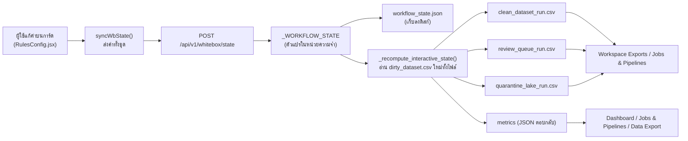
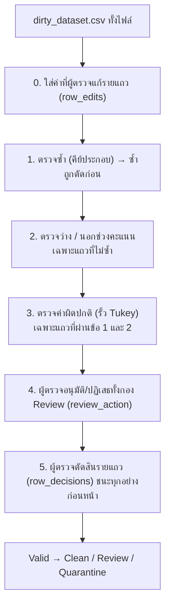

# ส่วนที่ 1A: กฎ 3 การ์ดบนหน้า Expectations & Alerts

เอกสารนี้ตอบคำถาม 4 ข้อของเพื่อนสำหรับ **การ์ดกฎ 3 ใบด้านบนของหน้า Rule** (ช่วงคะแนนและค่าว่าง / ห้ามคีย์ซ้ำ / ค่าผิดปกติ) ซึ่งเป็น "เอนจินแบบโต้ตอบ" ที่ทำงานในหน่วยความจำของ api ส่วนกฎรายตารางที่รันด้วย Spark อยู่ในเอกสาร `02-spark-table-rules.md`

**คำศัพท์ที่ใช้ในเอกสารนี้**

- **pandas / DataFrame:** ไลบรารีตารางของ Python DataFrame คือตารางข้อมูลที่ถูกโหลดไว้ในหน่วยความจำ
- **mask:** รายการค่า จริง/เท็จ หนึ่งค่าต่อหนึ่งแถว บอกว่าแถวนั้น "โดนกฎ" หรือไม่ เหมือนปากกาเมจิกที่ไฮไลต์แถวที่ผิด
- **Q1 / Q3 / IQR:** เรียงค่าจากน้อยไปมาก Q1 คือค่าที่ตำแหน่ง 25% Q3 คือค่าที่ตำแหน่ง 75% และ IQR = Q3 − Q1 บอกความกว้างของช่วง "ค่าปกติตรงกลาง"
- **รั้ว Tukey (Tukey fence):** เส้นตัดสินค่าผิดปกติ = Q3 + k × IQR (รั้วบน) และ Q1 − k × IQR (รั้วล่าง) ค่าที่พ้นรั้วถือว่าผิดปกติ ตัวคูณ k ยิ่งมาก รั้วยิ่งห่าง ยิ่งตัดน้อย
- **คีย์ประกอบ (composite key):** กลุ่มคอลัมน์ที่ใช้ตัดสินว่าสองแถว "เป็นเรื่องเดียวกัน" เช่น รหัสนักเรียน + วิชา + เทอม

**ข้อมูลที่ใช้ยกตัวอย่าง:** `sample_data/student_scores_sample.csv` (1,030 แถว มีปัญหาที่ฝังไว้ให้รู้จำนวนแน่นอน) ตัวเลขทุกตัวมาจากการรันเอนจินจริงด้วย `docs/transform-report/tools/capture_interactive.py` เก็บผลไว้ที่ `docs/transform-report/evidence/interactive-scenarios.json` โดยรันบนสำเนาชั่วคราว ไม่กระทบข้อมูลที่ใช้อยู่ในระบบ

## ภาพรวมใน 5 บรรทัด

1. การ์ด 3 ใบคือสวิตช์กับตัวเลขชุดเดียวกัน ส่งเข้าเอนจินตัวเดียวคือ `_recompute_interactive_state` (`api/app/api/whitebox.py:1248`)
2. ทุกครั้งที่แก้ค่าบนการ์ด หน้าเว็บส่งค่าทั้งชุดไปทันที และเอนจินคำนวณใหม่ทั้งไฟล์ทันที ไม่มีสถานะ "ร่าง" ปุ่ม "บันทึกกฎ" แค่ส่งค่าเดิมซ้ำ (ข้อ 2)
3. เอนจินตรวจตามลำดับจริง: **ซ้ำ → ว่าง/นอกช่วงคะแนน → ค่าผิดปกติ** ซึ่งไม่ตรงกับเลขการ์ด 1→2→3 (ข้อ 3)
4. ผลลัพธ์คือติดป้าย 3 คอลัมน์ให้ทุกแถว แล้วแยกเป็น 3 ไฟล์ Clean / Review / Quarantine เอนจินนี้ **ไม่แก้ค่าในข้อมูล** นอกจากค่าที่ผู้ตรวจพิมพ์แก้เองรายแถว (ข้อ 4)
5. มีจุดที่ป้ายบนหน้าจอไม่ตรงกับสิ่งที่คำนวณจริงอย่างน้อย 3 จุด: คีย์ที่ไม่มีในไฟล์, ป้าย `> 12.0h`, และวงกลมเปอร์เซ็นต์คงที่ (สรุปไว้ท้ายเอกสาร)

## <a id="q1"></a>ข้อ 1: ตั้งกฎไปทำไม แต่ละกฎกันปัญหาอะไร

| การ์ด | ปัญหาที่กัน | ตัวอย่างแถวจริงจากไฟล์ทดสอบ | ถ้าปิดกฎนี้ |
|---|---|---|---|
| **1 ช่วงคะแนนและค่าว่าง** | คะแนนที่เป็นไปไม่ได้ (ติดลบ, เกิน 100) หรือไม่มีคะแนนเลย ทำให้คะแนนเฉลี่ยและอันดับเพี้ยน | แถว #2 `score` ว่าง → Missing Score / แถว #21 `score` = -5.0 → Invalid Score Range | แถวเหล่านี้ไหลเข้า Clean ทั้งหมด (40 ว่าง + 25 นอกช่วง = 65 แถว) |
| **2 ห้ามคีย์ซ้ำ** | บันทึกเดียวกันเข้ามาสองครั้ง (นักเรียนคนเดียว วิชาเดียว เทอมเดียว) ทำให้นับซ้ำ | แถว #219 เป็นสำเนาของแถวก่อนหน้า → Duplicate | 30 แถวสำเนาถูกนับเป็นข้อมูลจริง |
| **3 ค่าผิดปกติ** | ค่าที่ห่างจากส่วนใหญ่มาก อาจเป็นการกรอกผิด เช่น เรียน 41 ชั่วโมง ในขณะที่คนอื่น 1–10 | แถว #27 `study_hours` = 41 → Study Hours Outlier | ปิดแล้ว (S9) Clean เพิ่มจาก 915 เป็น 935 และคะแนนคุณภาพเพิ่มจาก 88.8% เป็น 90.8% เพราะ 20 แถวผิดปกติถูกนับว่าดี |

แถวตัวอย่างมาจาก `S1_default.examples` ส่วนตัวเลขกรณีปิดกฎมาจาก `S9_rule3_off` ในไฟล์หลักฐาน

**ข้อสังเกตเรื่องความแรงของแต่ละกฎ:** โดยค่าเริ่มต้น กฎ 1 และ 2 ส่งแถวไป **Quarantine** (กักกัน) ส่วนกฎ 3 ส่งไป **Review** (รอคนตรวจ) เพราะ "ผิดปกติทางสถิติ" ไม่ได้แปลว่า "ผิด" เสมอไป

**ความสามารถที่เอนจินมีแต่หน้าจอไม่มีช่องให้ตั้ง**

- `null_policy = "adaptive_5"`: ให้ค่าว่างไป Review แทนการกักกัน ถ้าสัดส่วนค่าว่างไม่เกิน `max_null_pct` (`api/app/api/whitebox.py:1295-1296`, `:1324`)
- `dedup_strategy = "review_all"`: ให้แถวซ้ำไป Review แทนการกักกัน (`api/app/api/whitebox.py:1319`)

ทั้งสามค่านี้ (`null_policy`, `max_null_pct`, `dedup_strategy`) มีอยู่ในหน้า Rule เป็นตัวแปรสถานะเท่านั้น ไม่มี input ให้ผู้ใช้เปลี่ยน (`ui/src/pages/RulesConfig.jsx:113-116`) และทุกครั้งที่แก้การ์ดอื่น หน้าเว็บส่งค่าเริ่มต้นของสามตัวนี้ทับไปด้วย (`ui/src/pages/RulesConfig.jsx:135-138`) ดังนั้นถ้าใครตั้งค่าเหล่านี้ผ่าน API มันจะถูกรีเซ็ตเมื่อมีคนแตะการ์ด

## <a id="q2"></a>ข้อ 2: ตั้งค่าแล้ว ค่าถูกส่งไปไหน



**ขั้นที่ 1: หน้าเว็บส่งค่าทั้งชุดทุกครั้งที่มีการเปลี่ยน**

```jsx
// ui/src/pages/RulesConfig.jsx:130-149
  const syncWbState = async (overrides = {}) => {
    try {
      const payload = {
        min_score: Number(overrides.min_score ?? (wbMinRange === "" ? 0 : wbMinRange)),
        max_score: Number(overrides.max_score ?? (wbMaxRange === "" ? 100 : wbMaxRange)),
        null_policy: overrides.null_policy ?? wbNullPolicy,
        max_null_pct: Number(overrides.max_null_pct ?? (wbMaxNullPct === "" ? 5.0 : wbMaxNullPct)),
        composite_key: overrides.composite_key ?? wbCompositeKey,
        dedup_strategy: overrides.dedup_strategy ?? wbDedupStrategy,
        tukey_multiplier: String(overrides.tukey_multiplier ?? wbTukeyMultiplier),
        custom_upper_fence: Number(overrides.custom_upper_fence ?? (wbCustomUpperFence === "" ? 12.0 : wbCustomUpperFence)),
        rule1_confirmed: overrides.rule1_confirmed ?? wbRule1Confirmed,
        rule2_confirmed: overrides.rule2_confirmed ?? wbRule2Confirmed,
        rule3_confirmed: overrides.rule3_confirmed ?? wbRule3Confirmed
      };
      const res = await fetch("/api/v1/whitebox/state", {
        method: "POST",
        headers: { "Content-Type": "application/json" },
        body: JSON.stringify(payload)
      });
```

| บรรทัด | ทำอะไร |
|---|---|
| 133-134 | ส่ง `min_score`, `max_score` จากช่อง input (ช่องว่างจะถูกแทนด้วย 0 / 100) |
| 135-138 | ส่ง `null_policy`, `max_null_pct`, `composite_key`, `dedup_strategy` จากตัวแปรสถานะ (ที่ไม่มี input ให้แก้) |
| 139-140 | ส่ง `tukey_multiplier` และ `custom_upper_fence` (ช่องว่างแทนด้วย 12.0) |
| 141-143 | ส่งสวิตช์เปิด/ปิดของกฎ 1, 2, 3 |
| 145-149 | `POST` ไปที่ `/api/v1/whitebox/state` พร้อม JSON ทั้งก้อน |

อินพุตทุกช่องเรียก `syncWbState` ทันทีที่เปลี่ยน เช่น สวิตช์กฎ 1 (`ui/src/pages/RulesConfig.jsx:645`), ช่วงคะแนน (`:664`, `:677`), คีย์ (`:723`), ตัวคูณ k (`:774`) จึงไม่มีขั้น "ร่าง แล้วค่อยยืนยัน"

**ปุ่ม "บันทึกกฎ" ทำอะไรจริง**

```jsx
// ui/src/pages/RulesConfig.jsx:191-200
  const handleConfirmWhiteBoxRules = async () => {
    setWbConfirming(true);
    try {
      const updated = await syncWbState();
      setWbConfirmedAt(new Date().toLocaleTimeString());
      const m = updated?.metrics || wbLiveMetrics;
      setActionResult({
        success: true,
        message: `ยืนยันและประมวลผลกฎบน ${wbFmt(wbTotalRows)} แถวสำเร็จ: Clean ${wbFmt(m?.clean_rows)} แถว | Review ${wbFmt(m?.review_rows)} แถว | Quarantine ${wbFmt(m?.quarantine_rows)} แถว`
      });
```

| บรรทัด | ทำอะไร |
|---|---|
| 194 | เรียก `syncWbState()` โดยไม่ส่งค่าใหม่ ดังนั้นส่ง **ค่าเดิมซ้ำ** ทั้งชุด |
| 195 | บันทึกเวลาไว้แสดงบนปุ่มว่า "บันทึกแล้ว" |
| 197-200 | แสดงข้อความ "ยืนยันและประมวลผลกฎ ... สำเร็จ" พร้อมตัวเลขจากผลคำนวณ |

`syncWbState` กลืนข้อผิดพลาดแล้วคืน `null` (`ui/src/pages/RulesConfig.jsx:156-159`) แต่ `handleConfirmWhiteBoxRules` ไม่ตรวจว่าเป็น `null` และแสดงข้อความสำเร็จเสมอ (`:196-200`) ถ้า api ล่ม ข้อความก็ยังบอกว่าสำเร็จ โดยตัวเลขที่แสดงเป็นค่าเก่าจากหน้าจอ

**ขั้นที่ 2: ฝั่ง api เก็บค่าและคำนวณใหม่ทันที**

```python
# api/app/api/whitebox.py:1418-1444
@router.post("/state", dependencies=[Depends(require_session)])
def update_workflow_state(payload: Dict[str, Any] = Body(default_factory=dict)):
    for k, v in payload.items():
        if k in _WORKFLOW_STATE:
            if k == "selected_findings":
                current_norm = _normalize_selected_findings(_WORKFLOW_STATE.get("selected_findings"))
                if isinstance(v, dict):
                    current_norm.update({k2: bool(v2) for k2, v2 in v.items() if k2 in ("range", "duplicate", "outlier")})
                    _WORKFLOW_STATE["selected_findings"] = current_norm
                else:
                    _WORKFLOW_STATE["selected_findings"] = _normalize_selected_findings(v)
            elif k == "row_decisions" and isinstance(v, dict):
                if len(v) == 0:
                    _WORKFLOW_STATE["row_decisions"] = {}
                else:
                    _WORKFLOW_STATE["row_decisions"].update(v)
            elif k == "row_edits" and isinstance(v, dict):
                if len(v) == 0:
                    _WORKFLOW_STATE["row_edits"] = {}
                else:
                    _WORKFLOW_STATE["row_edits"].update(v)
            else:
                _WORKFLOW_STATE[k] = v
    if payload.get("confirm_rules"):
        _WORKFLOW_STATE["confirmed_at"] = datetime.now(timezone.utc).strftime("%H:%M:%S")
    _save_workflow_state()
    return _recompute_interactive_state()
```

| บรรทัด | ทำอะไร |
|---|---|
| 1420-1421 | วนทุกคีย์ที่ส่งมา และรับเฉพาะคีย์ที่มีอยู่แล้วใน `_WORKFLOW_STATE` คีย์แปลกปลอมถูกทิ้งเงียบๆ |
| 1422-1428 | `selected_findings` (สวิตช์ "ตรวจเรื่องนี้ไหม" ที่ตั้งจากหน้า Data Ingestion) ถูก normalize แล้วรวมเข้าไป |
| 1429-1438 | `row_decisions` และ `row_edits` (การตัดสินรายแถวจากหน้า Pipeline) ถูกรวมเข้าไป ส่งก้อนว่างคือล้างทั้งหมด |
| 1439-1440 | ค่าอื่นทั้งหมดถูกเขียนทับตรงๆ **ไม่ตรวจช่วงค่า** เช่น `min_score` มากกว่า `max_score` ก็รับ |
| 1443 | `_save_workflow_state()` เขียน `workflow_state.json` ลงดิสก์ (`api/app/api/whitebox.py:1201-1208`) เพื่อให้ค่ารอดการรีสตาร์ต |
| 1444 | คำนวณใหม่ทันทีแล้วตอบกลับ |

การ `GET /api/v1/whitebox/state` ก็เรียกเอนจินคำนวณใหม่ทั้งไฟล์เช่นกัน (`api/app/api/whitebox.py:1413-1415`) ทุกหน้าที่โหลดสถานะจึงเห็นผลตามค่าปัจจุบันเสมอ

**กฎแต่ละข้อมีสวิตช์สองชั้นอยู่คนละหน้า** กฎจะทำงานเมื่อสวิตช์บนการ์ด (`rule1_confirmed` ฯลฯ) เปิด **และ** `selected_findings` ของหน้า Data Ingestion เปิดด้วย (`api/app/api/whitebox.py:1286-1289`) ตัวหลังตั้งจากช่องติ๊กในหน้า Data Ingestion (`ui/src/pages/Ingestion.jsx:241-249`) ผู้ใช้ที่ปิดกฎบนการ์ดจะเห็นผลชัด แต่ผู้ใช้ที่ปิดจากหน้า Ingestion แล้วเห็นการ์ดยังเปิดอยู่ จะไม่รู้ว่ากฎไม่ได้ทำงาน

## <a id="q3"></a>ข้อ 3: ตัวเลขในกฎถูกเอาไปคำนวณยังไง

เอนจินทำงานเป็นลำดับดังนี้ (ลำดับจริงตามโค้ด):



### 3.1 ตรวจซ้ำ (ทำก่อนสุด)

```python
# api/app/api/whitebox.py:1278-1284
    comp_key_str = _WORKFLOW_STATE.get("composite_key", "student_id + course + semester")
    comp_cols = [c.strip() for c in comp_key_str.split("+") if c.strip() in df.columns]
    if not comp_cols:
        comp_cols = ["student_id", "course", "semester"]
    dedup_strategy = _WORKFLOW_STATE.get("dedup_strategy", "keep_first_quarantine")
    tukey_str = str(_WORKFLOW_STATE.get("tukey_multiplier", "3.0"))
    tukey_mult = float(tukey_str) if tukey_str in ("3.0", "1.5") else 3.0
```

| บรรทัด | ทำอะไร |
|---|---|
| 1278 | อ่านสตริงคีย์ที่ผู้ใช้เลือก เช่น `student_id + course + semester` |
| 1279 | แยกด้วย `+` แล้วเก็บ **เฉพาะชื่อที่มีเป็นคอลัมน์จริงในไฟล์** |
| 1280-1281 | ถ้าไม่เหลือคอลัมน์เลย **กลับไปใช้คีย์เริ่มต้น `student_id, course, semester` โดยไม่แจ้งใคร** |
| 1283-1284 | ตัวคูณ k ที่ไม่ใช่ `3.0` หรือ `1.5` (รวมถึง `custom`) ถูกแปลงเป็น 3.0 ในสูตร (แต่ดู 3.3 เรื่อง custom) |

```python
# api/app/api/whitebox.py:1291-1298
    # 1. Duplicate mask (Gate 2)
    dup_mask = df.duplicated(subset=comp_cols, keep="first") if r2_active else pd.Series(False, index=df.index)

    # 2. Missing score & out-of-range masks (Gate 1, evaluated on non-duplicate rows)
    observed_null_pct = (df["score"].isna().sum() / total_rows) * 100.0 if total_rows > 0 else 0.0
    should_quarantine_nulls = (null_policy == "strict_0") or (observed_null_pct > max_null_pct)
    null_mask = (~dup_mask) & df["score"].isna() if r1_active else pd.Series(False, index=df.index)
    range_mask = (~dup_mask) & (~df["score"].isna()) & ((df["score"] < min_s) | (df["score"] > max_s)) if r1_active else pd.Series(False, index=df.index)
```

| บรรทัด | ทำอะไร |
|---|---|
| 1292 | `df.duplicated(subset=comp_cols, keep="first")` แถวแรกของแต่ละกลุ่มคีย์ผ่าน แถวถัดๆ ไปคือ "ซ้ำ" (ถ้ากฎ 2 ปิด ไม่มีแถวซ้ำเลย) |
| 1295 | สัดส่วนค่าว่างที่สังเกตได้ = จำนวนแถว `score` ว่าง ÷ **แถวทั้งหมดทุกแถว** × 100 |
| 1296 | ค่าว่างจะถูก "กักกัน" ถ้านโยบายเป็น `strict_0` หรือสัดส่วนที่สังเกตได้มากกว่าเพดาน |
| 1297 | แถว "ว่าง" คือ **ไม่ซ้ำ** และ `score` ว่าง (ถ้ากฎ 1 เปิด) |
| 1298 | แถว "นอกช่วง" คือ ไม่ซ้ำ, `score` ไม่ว่าง, และต่ำกว่า min หรือสูงกว่า max |

**ตัวอย่าง: ส่งแถวซ้ำไป Review (S6):** เมื่อ `dedup_strategy = "review_all"` แถวซ้ำ 30 แถวไปที่ Review แทน Quarantine (`api/app/api/whitebox.py:1319`) ผลที่วัดได้: Review เพิ่มจาก 20 เป็น 50, Quarantine ลดจาก 95 เป็น 65, Clean เท่าเดิม 915 และ `gate2_quarantined` เป็น 0 (`api/app/api/whitebox.py:1379`)

**ตัวอย่าง: คีย์ที่ไม่มีในไฟล์ (S7)** หน้า Rule มีตัวเลือกคีย์ `record_id` (`ui/src/pages/RulesConfig.jsx:728`) แต่ไฟล์ทดสอบไม่มีคอลัมน์ `record_id` เมื่อเลือก ผลลัพธ์ตรงกับ S1 ทุกตัวเลข (Clean 915 / Review 20 / Quarantine 95 ซ้ำ 30 แถว) เพราะเอนจินใช้คีย์เริ่มต้นแทน แต่ป้ายเหตุผลที่ติดบนแถวเขียนว่า `Composite Key Uniqueness (record_id)` ตามที่ผู้ใช้เลือก (`api/app/api/whitebox.py:1322`) ป้ายจึงบอกคีย์ที่ **ไม่ได้ถูกใช้จริง** (ดู `S7_unknown_key_record_id.rule_applied_counts`)

### 3.2 ตรวจว่างและนอกช่วงคะแนน

ตรวจบนแถวที่ไม่ซ้ำเท่านั้น (บรรทัด 1297-1298 ข้างบน) ป้ายที่ติดคือ `Value Range Check [min, max]` (`api/app/api/whitebox.py:1331`)

**ตัวอย่างช่วงคะแนน (S3):** เปลี่ยน `min_score` จาก 0 เป็น 40 แถวนอกช่วงเพิ่มจาก 25 เป็น 29 (คะแนนที่อยู่ในช่วง 0 ถึงต่ำกว่า 40 มี 4 แถวในไฟล์ทดสอบ ตรวจนับจากไฟล์โดยตรง) Clean ลดจาก 915 เหลือ 911 และคะแนนคุณภาพลดจาก 88.8% เป็น 88.4%

**ตัวอย่างนโยบายค่าว่าง (S4 เทียบ S5):** ไฟล์ทดสอบมี `score` ว่าง 40 แถวจาก 1,030

```text
คำนวณด้วยมือจากสูตรที่ api/app/api/whitebox.py:1295
สัดส่วนค่าว่างที่สังเกตได้ = 40 / 1030 * 100 = 3.883%
```

| สถานการณ์ | เงื่อนไขที่ บรรทัด 1296 | ค่าว่างไปที่ | ผลที่วัดได้ |
|---|---|---|---|
| S4: `adaptive_5`, เพดาน 5% | 3.883 > 5 เป็นเท็จ | Review | Review 60 (เดิม 20 + ว่าง 40) / Quarantine 55 |
| S5: `adaptive_5`, เพดาน 3% | 3.883 > 3 เป็นจริง | Quarantine | เหมือน S1: Review 20 / Quarantine 95 |

ข้อสังเกต: ตัวเลข "สัดส่วนที่สังเกตได้" ในสูตรนี้หารด้วยแถวทั้งหมด **รวมแถวซ้ำ** ทั้งที่แถวซ้ำถูกตัดออกก่อนแล้ว จึงไม่ใช่สัดส่วนของแถวที่เหลือ

### 3.3 ตรวจค่าผิดปกติ (รั้ว Tukey)

```python
# api/app/api/whitebox.py:1300-1313
    # 3. Tukey IQR Outlier mask (Gate 3, evaluated on rows passing Gate 1 & Gate 2)
    clean_hours = df["study_hours"].dropna()
    q1 = float(clean_hours.quantile(0.25))
    q3 = float(clean_hours.quantile(0.75))
    iqr = float(q3 - q1)
    if _WORKFLOW_STATE.get("custom_upper_fence") is not None and tukey_str == "custom":
        upper_fence = float(_WORKFLOW_STATE["custom_upper_fence"])
    else:
        upper_fence = float(q3 + tukey_mult * iqr)
        _WORKFLOW_STATE["custom_upper_fence"] = upper_fence
    lower_fence = float(q1 - tukey_mult * iqr)

    passed_g1_g2 = (~dup_mask) & (~null_mask) & (~range_mask)
    outlier_mask = passed_g1_g2 & (~df["study_hours"].isna()) & ((df["study_hours"] > upper_fence) | (df["study_hours"] < lower_fence)) if r3_active else pd.Series(False, index=df.index)
```

| บรรทัด | ทำอะไร |
|---|---|
| 1301 | เอาคอลัมน์ `study_hours` **ทุกแถว** (ตัดค่าว่างออก) มาคำนวณ ไม่ได้กรองแถวซ้ำหรือแถวที่กักกันแล้วออกก่อน |
| 1302-1304 | หา Q1, Q3 และ IQR = Q3 − Q1 |
| 1305-1306 | ถ้าเลือกโหมด `custom` ใช้ค่ารั้วบนที่ผู้ใช้พิมพ์ตรงๆ |
| 1307-1309 | มิฉะนั้นรั้วบน = Q3 + k × IQR และ **เขียนค่ารั้วนี้ทับ `custom_upper_fence` ในสถานะ** |
| 1310 | รั้วล่าง = Q1 − k × IQR (คำนวณเสมอ) |
| 1312 | แถวที่ "ผ่านด่านก่อนหน้า" คือไม่ซ้ำ ไม่ว่าง ไม่นอกช่วง |
| 1313 | ค่าผิดปกติ = ผ่านด่านก่อนหน้า และ `study_hours` ไม่ว่าง และ (เกินรั้วบน หรือ ต่ำกว่ารั้วล่าง) ถ้ากฎ 3 เปิด |

**ตัวอย่าง (S1 เทียบ S2):** จากหลักฐาน Q1 = 3.0, Q3 = 8.0

```text
คำนวณด้วยมือจากสูตรที่ api/app/api/whitebox.py:1304, 1308, 1310
IQR          = Q3 - Q1 = 8.0 - 3.0 = 5.0
รั้วบน k=3.0 = Q3 + 3.0 * IQR = 8.0 + 15.0 = 23.0   (ตรงกับ upper_fence ใน S1)
รั้วล่าง k=3.0 = Q1 - 3.0 * IQR = 3.0 - 15.0 = -12.0
รั้วบน k=1.5 = 8.0 + 1.5 * 5.0 = 15.5               (ตรงกับ upper_fence ใน S2)
รั้วล่าง k=1.5 = 3.0 - 7.5 = -4.5
```

รั้วล่างเป็นค่าติดลบทั้งสองกรณี และ `study_hours` ในไฟล์ไม่เคยติดลบ จึงไม่จับแถวใดเลย

ผลที่วัดได้: S1 และ S2 จับ **20 แถวเท่ากัน** เพราะ 20 แถวที่ฝังไว้มี `study_hours` 35–60 ซึ่งเกินทั้ง 23.0 และ 15.5 (ตรวจนับจากไฟล์: แถวที่ `study_hours` > 15.5 มี 20 แถว และ > 12 ก็ 20 แถว) การเลื่อน k บนไฟล์นี้จึง **ไม่เปลี่ยนผลลัพธ์แม้แต่แถวเดียว** ผู้ใช้จึงไม่มีทางเห็นจากผลว่า k ทำหน้าที่อะไร

**ตัวอย่างป้าย `> 12.0h` (ตรงข้ามความจริง)** ตัวเลือกใน dropdown เขียนว่า `3.0× IQR (> 12.0h)` และ `1.5× IQR (> 9.0h)` (`ui/src/pages/RulesConfig.jsx:778-779`) เป็นข้อความตายตัวที่เขียนไว้ในโค้ดโดยสมมติชุดข้อมูลเดิม และเมื่อเปลี่ยนตัวเลือก หน้าเว็บส่งรั้ว 12.0 / 9.0 ไปด้วย (`:772-774`) แต่เอนจินไม่ใช้ค่านั้น เพราะใช้เฉพาะเมื่อโหมดเป็น `custom` (`api/app/api/whitebox.py:1305`) และ dropdown ไม่มีตัวเลือก `custom` ให้เลือก บนไฟล์ทดสอบรั้วจริงคือ **23.0 ชั่วโมง** ไม่ใช่ 12.0

**ตัวอย่างโหมด custom (S8):** เมื่อส่ง `custom` กับ 12.0 ผ่าน API ป้ายเปลี่ยนเป็น `Tukey IQR Fence (> 12.0h)` แต่ผลจับ 20 แถวเท่าเดิม เพราะแถวผิดปกติทั้ง 20 แถวเกิน 12 อยู่แล้ว

**ตัวอย่างปิดกฎ 3 (S9):** ไม่มีแถวใดถูกส่ง Review (Review = 0) Clean = 935

### 3.4 การตัดสินโดยมนุษย์ (ทับผลของกฎ)

```python
# api/app/api/whitebox.py:1337-1360
    # Apply Human-in-the-Loop Review Action ("KEEP" | "APPROVE" | "REJECT")
    rev_action = _WORKFLOW_STATE.get("review_action", "KEEP")
    if rev_action == "APPROVE":
        df.loc[df["whitebox_status"] == "Review", "whitebox_rule_applied"] = "Human Approved -> Clean Asset"
        df.loc[df["whitebox_status"] == "Review", "whitebox_status"] = "Valid"
    elif rev_action == "REJECT":
        df.loc[df["whitebox_status"] == "Review", "whitebox_rule_applied"] = "Human Rejected -> Quarantine Lake"
        df.loc[df["whitebox_status"] == "Review", "whitebox_status"] = "Quarantine"

    # Apply individual row overrides if any
    row_decisions = _WORKFLOW_STATE.get("row_decisions", {}) or {}
    for row_key, decision in row_decisions.items():
        try:
            rid = int(str(row_key).replace("#", ""))
            if "dirty_row_id" in df.columns:
                mask = df["dirty_row_id"] == rid
                if decision == "APPROVE":
                    df.loc[mask, "whitebox_status"] = "Valid"
                    df.loc[mask, "whitebox_rule_applied"] = f"Row #{rid} Corrected & Approved"
                elif decision == "REJECT":
                    df.loc[mask, "whitebox_status"] = "Quarantine"
                    df.loc[mask, "whitebox_rule_applied"] = f"Row #{rid} Quarantined by Reviewer"
        except Exception:
            pass
```

| บรรทัด | ทำอะไร |
|---|---|
| 1338-1341 | ถ้า `review_action = APPROVE` แถวที่อยู่ในสถานะ Review ทั้งหมดกลายเป็น Valid |
| 1342-1344 | ถ้า `REJECT` แถว Review ทั้งหมดกลายเป็น Quarantine |
| 1347-1358 | `row_decisions` รายแถวเขียนทับสถานะและป้ายเหตุผล **ไม่ว่าแถวนั้นจะติดกฎไหน หรือไม่ติดเลยก็ตาม** |
| 1359-1360 | ถ้าเลขแถวอ่านไม่ออก ข้ามไปเงียบๆ |

ลำดับความสำคัญจากต่ำไปสูง: ผลของกฎ → `review_action` (เฉพาะแถว Review) → `row_decisions` (ทุกแถว) การแก้ค่ารายแถว `row_edits` ทำตั้งแต่ก่อนตรวจกฎ (`api/app/api/whitebox.py:1260-1272`) จึงเป็นค่าเดียวที่ทำให้ข้อมูลเปลี่ยนจริง เมื่อแถวถูกแก้แล้ว ป้ายที่ติดบนแถวไม่บอกค่าเดิม

## <a id="q4"></a>ข้อ 4: หลังตรวจแล้ว ข้อมูลไปต่อที่ไหน

เมื่อทุกกฎและการตัดสินของผู้ตรวจจบ แต่ละแถวมีสถานะเดียว และเอนจินเขียนเป็น 3 ไฟล์ทุกครั้งที่คำนวณ (`api/app/api/whitebox.py:1362-1372`)

| สถานะ | ไฟล์ | หน้าที่อ่านต่อ |
|---|---|---|
| Valid (Clean) | `clean_dataset_run.csv` | Workspace Exports ดาวน์โหลด (`api/app/api/whitebox.py:1447-1463`) และ Jobs & Pipelines ดูตัวอย่าง (`:1466-1496`) |
| Review | `review_queue_run.csv` | ผู้ตรวจอนุมัติ/ปฏิเสธทั้งกอง (`ui/src/pages/Pipeline.jsx:143`, `:337-351`) หรือรายแถว (`:106`, `:497-505`) ตามข้อ 3.4 |
| Quarantine | `quarantine_lake_run.csv` | ดาวน์โหลดเป็นบันทึกกักกัน และดูเหตุผลรายแถวได้ |

หน้าที่ใช้ผลนี้: Dashboard อ่านสถานะทุก 10 วินาที (`ui/src/pages/Dashboard.jsx:100`), Jobs & Pipelines อ่านสถานะและตารางรายแถว (`ui/src/pages/Pipeline.jsx:171`, `:191`), Workspace Exports อ่านตัวอย่างและดาวน์โหลด (`ui/src/pages/DataExport.jsx:32`, `:90`)

**คะแนนคุณภาพ** คำนวณที่ `api/app/api/whitebox.py:1386` เป็น Clean ÷ ทั้งหมด

```text
คำนวณด้วยมือจากสูตรที่ api/app/api/whitebox.py:1386
quality_score_pct = round(915 / 1030 * 100, 1) = round(88.83, 1) = 88.8   (ตรงกับ S1)
```

**สิ่งที่ยืนยันได้:** เอนจินนี้แค่ **จัดประเภทและติดป้าย** ไม่มีขั้นแก้ค่าอัตโนมัติ (ไม่เติมค่าว่าง ไม่ตัดค่าผิดปกติ ไม่รวมแถวซ้ำ) แถว Clean คือแถวที่ไม่โดนกฎใดและไม่ถูกผู้ตรวจปฏิเสธ ต่างจากฝั่ง Spark ที่ตัดแถวซ้ำและเขียน Delta จริง (ดู `02-spark-table-rules.md`)

**ข้อจำกัดที่ควรรู้:** ไฟล์ทั้งสามถูกเขียนทับทุกครั้งที่มีการ GET หรือ POST สถานะ และตัวเลขทั้งหมดอยู่ในหน่วยความจำ + ไฟล์ของ api ไม่ผ่าน Elasticsearch หรือ HDFS จึงไม่มีประวัติว่ารอบก่อนใช้กฎค่าอะไร

## ข้อที่ต่างจากที่คาด

รายการนี้บันทึกสิ่งที่ตรวจโค้ดแล้วต่างจากข้อสันนิษฐานในแผนงาน หรือเป็นของใหม่ที่เจอระหว่างเขียน

1. **ป้ายคีย์ไม่ตรงกับคีย์ที่ใช้จริง:** เมื่อเลือกคีย์ที่ไม่มีในไฟล์ เอนจินใช้คีย์เริ่มต้นแต่ป้ายเขียนชื่อคีย์ที่เลือก (S7) เป็นความคลาดเคลื่อนที่ยืนยันด้วยการรัน ไม่ใช่แค่การอ่านโค้ด
2. **ปุ่ม "บันทึกกฎ" แสดงสำเร็จแม้ api ล้มเหลว** (`ui/src/pages/RulesConfig.jsx:156-159`, `:194-200`)
3. **การเลื่อน k ไม่เปลี่ยนผลบนไฟล์ทดสอบ** ทั้งที่มีจริงในโค้ด: S1 และ S2 จับ 20 แถวเท่ากัน เพราะค่าผิดปกติที่ฝังไว้ห่างจากรั้วทั้งสองมาก
4. **สวิตช์สองชั้นต่อหนึ่งกฎ** อยู่คนละหน้า (การ์ดกับ Data Ingestion)
5. **รั้วล่างมีอยู่จริงแต่ไม่แสดงบนการ์ด** ป้ายการ์ด 3 เขียนเฉพาะรั้วบน (`ui/src/pages/RulesConfig.jsx:740`)
6. **Q1/Q3 คิดจากทุกแถวรวมแถวซ้ำและแถวที่กักกันแล้ว** (`api/app/api/whitebox.py:1301`) ไม่ใช่เฉพาะแถวที่ผ่านด่านก่อนหน้าแบบที่ความคิดเห็นในโค้ด "evaluated on rows passing Gate 1 & Gate 2" ชวนให้เข้าใจ (ความคิดเห็นอยู่ที่ `api/app/api/whitebox.py:1300`) รั้วจึงอาจต่างจากที่คาดเมื่อข้อมูลมีแถวซ้ำมาก
7. **ป้ายในโค้ดเรียกด่านตรวจซ้ำว่า "Gate 2" แต่รันก่อน "Gate 1"** (`api/app/api/whitebox.py:1291`, `:1294`) และหน้า Jobs & Pipelines ใช้ชื่อ Gate 1 / Gate 2 ตามเลขนี้ (`ui/src/pages/Pipeline.jsx:279-280`) ซึ่งไม่ตรงกับลำดับที่ทำงานจริง
