# ส่วนที่ 1B: กฎรายตาราง (Spark) ในตั้งค่าขั้นสูง

เอกสารนี้ตอบคำถาม 4 ข้อของเพื่อนสำหรับ **กฎรายตาราง** ที่แก้ได้ในหน้า Expectations & Alerts (แท็บตาราง / ตั้งค่าขั้นสูง) กฎชุดนี้ไม่ได้ทำงานในหน้าเว็บ แต่ถูกบันทึกลงไฟล์ตั้งค่าแล้วถูกอ่านโดย **Spark** ตอนรอบตรวจครั้งถัดไป ส่วนการ์ด 3 ใบอยู่ในเอกสาร `01-interactive-rules.md`

**คำศัพท์ที่ใช้ในเอกสารนี้**

- **Spark:** โปรแกรมประมวลผลข้อมูลก้อนใหญ่ที่รันแยกจากเว็บ (ในคอนเทนเนอร์ `spark-master`) อ่านไฟล์ข้อมูลจริงจาก HDFS ทั้งชุด
- **Delta Lake / Delta table:** รูปแบบไฟล์ตารางบน HDFS ที่รองรับการอัปเดตแบบ "ถ้าคีย์ตรงให้แก้ ถ้าไม่มีให้เพิ่ม" (`MERGE`) เหมือนตารางฐานข้อมูลที่เป็นไฟล์
- **Elasticsearch (ES):** ฐานข้อมูลค้นหาที่ระบบใช้เก็บกฎ (`sdoqap_rules_registry`) และผลการรันทุกรอบ (`sdoqap_quality_runs`)
- **Adaptive (ปรับตัวเอง):** ค่าเกณฑ์ที่ระบบคำนวณใหม่จากประวัติ แทนที่จะเป็นเลขคงที่
- **IQR / Q1 / Q3 / รั้ว:** ความหมายเดียวกับเอกสาร 01 (รั้วบน = Q3 + k × IQR, รั้วล่าง = Q1 − k × IQR)
- **Z-score:** จำนวน "ส่วนเบี่ยงเบนมาตรฐาน" ที่ค่าหนึ่งห่างจากค่าเฉลี่ยของคอลัมน์ ยิ่งมากยิ่งผิดปกติ
- **Quarantine:** โซนกักกันแถวที่ไม่ผ่านกฎ เก็บเป็นตาราง Delta แยกตามรหัสรอบรัน (`run_id`)

**ข้อมูลที่ใช้ยกตัวอย่าง:** ผลการรันจริงที่เก็บอยู่ใน Elasticsearch ของระบบนี้ เก็บสำเนาไว้ใน `docs/transform-report/evidence/`

| ตาราง | ใช้ทำอะไรในเอกสารนี้ | ไฟล์หลักฐาน |
|---|---|---|
| `gov_data` (86 รอบ ประวัติมากที่สุด) | ตัวอย่างเกณฑ์ adaptive (ครบหน้าต่าง 15 รอบ) | `spark-quality-runs-gov_data.json`, `spark-rules-gov_data.json` |
| `grocery_sales` (7 รอบ) | ตัวอย่างแถวที่ถูกกักกันจริงและรั้ว IQR จริง | `spark-quality-runs-grocery_sales.json` |
| `benchmark_test` (28 รอบ) | ตัวอย่างตารางที่คะแนนต่ำกว่าเกณฑ์ | `spark-quality-runs-benchmark_test.json` |

เหตุผลที่ไม่ใช้ตารางเดียว: `gov_data` ทุกรอบได้ 100% ไม่มีแถวถูกกักกันเลย จึงไม่มีเหตุผลการกักกันให้ดู ต้องใช้ `grocery_sales` เสริม ผลการคำนวณด้วยมือทั้งหมดอยู่ใน `docs/transform-report/evidence/spark-adaptive-threshold-worked.txt`

## ภาพรวมใน 5 บรรทัด

1. ค่าที่ตั้งบนฟอร์มจะถูกบันทึกลง `rules_config.json` และ Elasticsearch ทันทีที่กดบันทึก แต่ **มีผลกับข้อมูลเมื่อ Spark รันรอบถัดไปเท่านั้น** ไม่มีการคำนวณใหม่กับข้อมูลที่ผ่านมาแล้ว
2. Spark ตรวจตามลำดับ: **ลบแถวซ้ำ → คีย์หลักว่าง → ค่าว่างในทุกคอลัมน์ → ชนิดข้อมูล → วันที่ว่าง → ค่าผิดปกติแบบ IQR → ค่าผิดปกติแบบ Z-score** ทุกแถวที่ไม่ผ่านไปโซนกักกัน ไม่มีโซน Review แบบฝั่งการ์ด
3. แถวที่ผ่านถูก `MERGE` เข้าตาราง `active` ที่สะสมข้อมูลต่อเนื่อง แล้วเทียบคะแนนกับเกณฑ์เพื่อตัดสินว่าแจ้งเตือนและเรียก Gold layer หรือไม่
4. จากฟอร์ม 8 ช่อง **มี 5 ช่อง (ใน 4 หัวข้อ) ที่ไม่มีผลต่อการตัดสิน** (ความอดทนต่อค่าว่าง, โหมดและค่าความหน่วงข้อมูล, ชื่อโมเดล AI, และโหมด adaptive ของเกณฑ์คุณภาพ) รายละเอียดที่ตาราง "ตั้งค่าไหนมีผลจริง"
5. เกณฑ์คุณภาพแบบ adaptive **ไม่เคยทำงานจริงในระบบที่ deploy นี้** ทุกรอบที่บันทึกไว้ใช้ค่าฐาน (90.0) เพราะตัวแปรแวดล้อมที่ฟังก์ชันต้องใช้ไม่ถูกตั้งในคอนเทนเนอร์ Spark (พิสูจน์ที่ข้อ 3)

## <a id="q1"></a>ข้อ 1: ตั้งกฎไปทำไม แต่ละกฎกันปัญหาอะไร

ตารางนี้ลำดับตามที่ Spark ตรวจจริง ป้ายในคอลัมน์ "เหตุผลที่บันทึก" คือข้อความใน `reject_reason` ของแถวที่ถูกกักกัน

| ลำดับ | การตรวจ | กันปัญหาอะไร | เหตุผลที่บันทึกในแถวกักกัน | หลักฐาน |
|---|---|---|---|---|
| 1 | ลบแถวซ้ำ (auto-clean) | ข้อมูลเดียวกันเข้ามาสองครั้ง ทำให้นับซ้ำ | **ไม่บันทึก:** แถวซ้ำถูกลบทิ้ง ไม่ถูกกักกัน บันทึกแค่ข้อความ `resolved_N_duplicates` ในผลการรัน | `spark/spark_quality_engine.py:2043-2060` |
| 2 | คีย์หลักว่าง | แถวที่ระบุตัวตนไม่ได้ ไม่มีทางรวม (`MERGE`) เข้าตารางหลักได้ | `missing_primary_key` | `spark/spark_quality_engine.py:2062-2072` |
| 3 | ค่าว่างในคอลัมน์อื่นทุกคอลัมน์ | ข้อมูลไม่ครบ | `null_value_in_<ชื่อคอลัมน์>` (ตัวอย่างจริง: `null_value_in_ยอดขายรวม` 4 แถวใน `grocery_sales`) | `spark/spark_quality_engine.py:2074-2088` |
| 4 | ชนิดข้อมูลตัวเลข | ตัวอักษรปนในคอลัมน์ตัวเลข | `invalid_type_<ชื่อคอลัมน์>` | `spark/spark_quality_engine.py:2090-2110` |
| 5 | วันที่ว่าง | แถวที่บอกไม่ได้ว่าเกิดเมื่อไร | `missing_date` | `spark/spark_quality_engine.py:2112-2121` |
| 6 | แถวซ้ำที่เหลือหลังตรวจ (dedup รอบสอง) | กันซ้ำอีกชั้นถ้า auto-clean ปิด | `duplicate_records` | `spark/spark_quality_engine.py:2127-2137`, `:2227-2229` |
| 7 | ค่าผิดปกติแบบ IQR | ค่าที่ห่างจากส่วนใหญ่ของคอลัมน์ตัวเลข | `<คอลัมน์>=<ค่าจริง> (expected [ต่ำสุด, สูงสุด])` | `spark/spark_quality_engine.py:2231-2264` |
| 8 | ค่าผิดปกติแบบ Z-score (ตายตัว 3.0) | ค่าที่ห่างเกิน 3 เท่าของส่วนเบี่ยงเบนมาตรฐาน | `<คอลัมน์>_zscore=<ค่า> (val=... deviates > 3.0σ)` | `spark/spark_quality_engine.py:2266-2285` |
| 9 | กฎที่เรียนรู้จาก Decision Tree (ถ้ามี `induced` ในตั้งค่า) | รูปแบบผิดปกติที่ระบบสรุปจากแถวที่กักกัน | `induced_tree_rule_match` | `spark/spark_quality_engine.py:2292-2326` |

ข้อสังเกตที่แตกต่างจากฝั่งการ์ด: ข้อ 7 ให้ **ค่าจริงและช่วงที่คาดไว้ในข้อความเหตุผล** (เช่น `ราคา=999 (expected [-12.5, 87.5])`) ซึ่งเป็นรูปแบบที่ตามรอยได้ดีกว่าป้าย `Value Range Check [0.0, 100.0]` ของฝั่งการ์ด ดูโค้ดสร้างข้อความที่ `spark/dynamic_rules_engine.py:550-559`

**สิ่งที่ไม่ได้อยู่ในตารางนี้แต่มีผลต่อการตัดสิน:** เกณฑ์คะแนนคุณภาพ (`quality_score_threshold`) ไม่ได้กักกันแถวใด แต่ตัดสินว่ารอบนี้ต้องแจ้งเตือนและต้องเรียกกระบวนการต่อไปหรือไม่ (ข้อ 4)

```mermaid
flowchart LR
    A["ฟอร์ม 'Save Rule Overrides'<br/>(RulesConfig.jsx)"] --> B["PUT /api/v1/rules/{table}"]
    B --> C["_validate_rules_body<br/>(ตรวจเฉพาะเกณฑ์ 0-100 และหน่วงไม่ติดลบ)"]
    C --> D["สำรองไฟล์เก่า (เก็บ 10 ชุด)<br/>เขียน rules_config.json"]
    D --> E["สำเนาลง Elasticsearch<br/>sdoqap_rules_registry"]
    E --> F(["รอ Spark รันรอบถัดไป"])
    F --> G["load_rules_config(table)<br/>อ่าน ES ก่อน ไฟล์เป็นตัวสำรอง"]
    G --> H["รวม _default + ของตาราง"]
    H --> I["apply_adaptive_rules<br/>resolve_rule_value"]
    I --> J["ตรวจข้อมูลด้วยค่านี้"]
```

## <a id="q2"></a>ข้อ 2: ตั้งค่าแล้ว ค่าถูกส่งไปไหน



**ขั้นที่ 1: ฟอร์มส่งกฎทั้งก้อนของตาราง**

```jsx
// ui/src/pages/RulesConfig.jsx:461-467
      const res = await fetch(`/api/v1/rules/${tbl}`);
      if (res.ok) {
        const data = await res.json();
        setTableRules(data.effective_rules);
        // Deep-clone snapshot of the as-fetched rules, kept untouched by edits, so the
        // save confirmation can show a real before/after diff instead of a generic message.
        setOriginalTableRules(JSON.parse(JSON.stringify(data.effective_rules)));
```

```jsx
// ui/src/pages/RulesConfig.jsx:537-541
          const res = await fetch(`/api/v1/rules/${selectedTable}`, {
            method: "PUT",
            headers: { "Content-Type": "application/json" },
            body: JSON.stringify(tableRules)
          });
```

| บรรทัด | ทำอะไร |
|---|---|
| 461-464 | เปิดตารางแล้วขอ "กฎที่มีผลจริง" (`effective_rules` = `_default` รวมกับของตาราง) มาเก็บเป็นสถานะฟอร์ม |
| 467 | เก็บสำเนาไว้เทียบก่อน/หลังตอนกดบันทึก |
| 537-541 | ตอนกดบันทึก ส่ง **ทั้งก้อน** `tableRules` ไปด้วย `PUT` ไม่ใช่เฉพาะช่องที่แก้ |

**ขั้นที่ 2: ฝั่ง api รวมเข้ากับส่วนของตารางแล้วเขียนไฟล์**

```python
# api/app/api/dynamic_rules.py:682-690
    config = _load_rules_config()

    # Merge new values into the existing table section (create if absent)
    existing = config.get(table_name, {})
    before_snapshot = copy.deepcopy(existing)
    existing.update(body)
    config[table_name] = existing

    _save_rules_config(config)
```

| บรรทัด | ทำอะไร |
|---|---|
| 682 | อ่านไฟล์ตั้งค่าทั้งไฟล์ |
| 685-688 | เอาส่วนของตารางเดิม (ถ้ามี) มา `update` ด้วยก้อนที่ส่งมา แล้วใส่กลับ |
| 690 | เขียนไฟล์ (สำรองไว้ก่อน เก็บสูงสุด 10 ชุด `api/app/api/dynamic_rules.py:126-145`) |

เพราะฟอร์มส่งกฎที่ **รวมค่าเริ่มต้นแล้ว** กลับมาทั้งก้อน การแก้เพียงช่องเดียวจะ **คัดลอกค่าเริ่มต้นทั้งหมดไปเป็นส่วนของตารางนั้นถาวร** หลังจากนั้นการแก้ `_default` จะไม่มีผลกับตารางนี้อีก ผลกระทบนี้เห็นได้จากโครงสร้างโค้ดสองจุดข้างบน (ฟอร์มส่ง `effective_rules` ที่รวมแล้ว, api ใช้ `existing.update(body)`) ยังไม่ได้ทดสอบด้วยการบันทึกจริง เพราะรายงานนี้ห้ามเปลี่ยนค่าในระบบ

**ขั้นที่ 3: สำเนาลง Elasticsearch**

```python
# api/app/api/dynamic_rules.py:159-168
    # Sync to ES sdoqap_rules_registry index
    try:
        es = _get_es()
        if not es.indices.exists(index="sdoqap_rules_registry"):
            es.indices.create(index="sdoqap_rules_registry")

        for table_name, table_rules in config.items():
            if table_name == "_comment":
                continue
            es.index(index="sdoqap_rules_registry", id=table_name, document=table_rules)
```

ทุกครั้งที่บันทึก ระบบเขียน **ทุกตาราง** ในไฟล์ลง ES ใหม่ (วนตาม `config.items()`) ถ้าเขียน ES ไม่สำเร็จ แต่เขียนไฟล์สำเร็จ การบันทึกยังนับว่าสำเร็จ (`api/app/api/dynamic_rules.py:170-177`)

**ขั้นที่ 4: Spark อ่านกฎตอนเริ่มรอบถัดไป**

```python
# spark/spark_quality_engine.py:1506-1532
    parsed = urlparse(ELASTICSEARCH_URL)
    auth = (parsed.username, parsed.password) if parsed.username else None
    base_url = f"{parsed.scheme}://{parsed.hostname}:{parsed.port}"

    # 1. Try reading from ES
    es_default = {}
    es_table = {}
    es_read_success = False

    try:
        # Read default config
        url_default = f"{base_url}/sdoqap_rules_registry/_doc/_default"
        res_default = requests.get(url_default, auth=auth, timeout=3)
        if res_default.status_code == 200:
            es_default = res_default.json().get("_source", {})
            es_read_success = True

        # Read table-specific overrides
        url_table = f"{base_url}/sdoqap_rules_registry/_doc/{table_name}"
        res_table = requests.get(url_table, auth=auth, timeout=3)
        if res_table.status_code == 200:
            es_table = res_table.json().get("_source", {})
            es_read_success = True

        if es_read_success:
            print(f"[RULES] Successfully loaded configuration for '{table_name}' from Elasticsearch sdoqap_rules_registry.")
            return _merge_configs_dict(es_default, es_table)
```

| บรรทัด | ทำอะไร |
|---|---|
| 1506-1508 | สร้างที่อยู่ ES จากตัวแปร `ELASTICSEARCH_URL` (ที่ Spark สร้างเองได้จากตัวแปรย่อย `spark/spark_quality_engine.py:62-74`) |
| 1517-1521 | อ่านเอกสาร `_default` จาก ES |
| 1524-1528 | อ่านเอกสารของตารางจาก ES |
| 1530-1532 | ถ้าอ่าน ES ได้อย่างน้อยหนึ่งเอกสาร ใช้ ES แล้ว **ไม่ดูไฟล์อีก** |

ถ้าอ่าน ES ไม่ได้เลย จึงกลับไปอ่านไฟล์ (`spark/spark_quality_engine.py:1536-1548`) ผลคือ **ES เป็นแหล่งที่จริงกว่าไฟล์** ถ้าใครแก้ไฟล์ `rules_config.json` ตรงๆ โดยไม่ผ่าน api ค่านั้นจะไม่มีผล ตราบที่ ES ยังมีเอกสารของตารางนั้น

```python
# spark/spark_quality_engine.py:1550-1574
def _merge_configs_dict(default: dict, table_rules: dict) -> dict:
    """Helper to deep merge table-specific configs override default configs."""
    merged = {}
    for key in set(list(default.keys()) + list(table_rules.keys())):
        default_val = default.get(key)
        table_val = table_rules.get(key)
        if table_val is not None:
            if isinstance(default_val, dict) and isinstance(table_val, dict):
                merged[key] = {**default_val, **table_val}
            else:
                merged[key] = table_val
        elif default_val is not None:
            merged[key] = default_val
    return merged


def resolve_rule_value(rule_entry, fallback):
    """Extract the effective scalar value from a rule entry.
    Supports both v1 flat format (e.g., 90.0) and v2 nested format (e.g., {'mode': 'adaptive', 'base_value': 90.0}).
    Returns the base_value from nested format, or the raw value from flat format."""
    if isinstance(rule_entry, dict):
        return rule_entry.get("base_value", fallback)
    if rule_entry is not None:
        return rule_entry
    return fallback
```

| บรรทัด | ทำอะไร |
|---|---|
| 1553-1560 | รวมทีละคีย์: ถ้าทั้งสองฝั่งเป็นกล่อง (dict) ให้ส่วนของตารางทับเฉพาะช่องที่ระบุ ไม่เช่นนั้นส่วนของตารางทับทั้งคีย์ |
| 1561-1562 | คีย์ที่มีเฉพาะใน `_default` ก็ถูกเก็บไว้ |
| 1566-1574 | `resolve_rule_value` ดึงตัวเลขเดียวออกจากกล่องกฎ ถ้าเป็นกล่องจะคืน `base_value` เสมอ **ไม่สนใจ `mode`** |

**สิ่งที่หน้าจอไม่ได้บอก**

- ปุ่มยืนยันบนหน้าจอเขียนว่า "This will immediately affect all incoming ingestion pipelines" (`ui/src/pages/RulesConfig.jsx:532`) จริงๆ มีผลเฉพาะรอบที่รันหลังจากนี้ ข้อมูลที่ตรวจไปแล้วไม่ถูกตรวจใหม่
- หน้าจอขอกฎด้วย `GET /api/v1/rules/{table}` ซึ่งตอบ **ค่าที่ตั้งไว้ (รวมแล้ว)** ไม่ใช่ **ค่าที่ Spark ใช้จริงในรอบล่าสุด** (`api/app/api/dynamic_rules.py:613-634`) สองอย่างนี้ต่างกันได้ ดูข้อ 3 เรื่องเกณฑ์ adaptive

## <a id="q3"></a>ข้อ 3: ตัวเลขในกฎถูกเอาไปคำนวณยังไง

### 3.1 เกณฑ์คะแนนคุณภาพ (`quality_score_threshold`)

Spark เตรียมกฎก่อนตรวจข้อมูล:

```python
# spark/spark_quality_engine.py:1711-1734
    rules = load_rules_config(table_name)
    rules["table_name"] = table_name

    # Try to apply dynamic adaptive rules (Layer 2: Statistical Engine)
    # Falls back gracefully to base values if dynamic_rules_engine is unavailable
    #
    # Note: the raw DataFrame isn't loaded yet at this point in the run, so only the
    # quality_score_threshold branch (which queries ES history, not the DataFrame) is
    # active here — that's the field every table's rules_config.json actually sets to
    # "adaptive" mode. null_checks tolerance-learning has no consumer anywhere else in
    # this file (unlike value_range, which is computed independently further down at
    # the point value_range_profile is built) — it remains unimplemented; treat
    # rules_config.json's null_checks.mode as informational until that's built.
    try:
        from dynamic_rules_engine import apply_adaptive_rules
        rules = apply_adaptive_rules(rules, table_name, df=None, spark=spark)
        print(f"[DYNAMIC RULES] Adaptive rules applied for '{table_name}'")
    except ImportError:
        print(f"[DYNAMIC RULES] dynamic_rules_engine not available, using base config")
    except Exception as dre:
        print(f"[DYNAMIC RULES] Failed to apply adaptive rules: {dre}. Using base config.")

    quality_threshold = resolve_rule_value(rules.get("quality_score_threshold"), 90.0)
    freshness_limit_hours = resolve_rule_value(rules.get("freshness_threshold_hours"), 48)
```

| บรรทัด | ทำอะไร |
|---|---|
| 1711-1712 | โหลดกฎของตาราง |
| 1726 | เรียก `apply_adaptive_rules` โดยส่ง `df=None` (ยังไม่มีข้อมูล) ดังนั้นเฉพาะกฎเกณฑ์คะแนนคุณภาพเท่านั้นที่คำนวณใหม่ได้ ตามที่ความคิดเห็นในโค้ดยอมรับเอง (`spark/spark_quality_engine.py:1717-1723`) |
| 1728-1731 | ถ้านำเข้าโมดูลไม่ได้ หรือการคำนวณล้มเหลว **พิมพ์ข้อความลง log แล้วใช้ค่าฐานต่อ** ไม่มีสถานะใดบอกในผลรันว่าเกิดเหตุนี้ |
| 1733 | ตัวเลขเกณฑ์ที่ใช้จริง = `base_value` ของกล่องกฎที่ได้กลับมา |

ถ้าโหมดเป็น adaptive ฟังก์ชันคำนวณเกณฑ์จากประวัติ:

```python
# spark/dynamic_rules_engine.py:336-349
        if len(values) < 2:
            print(f"[DYNAMIC_RULES] Insufficient history ({len(values)} runs). "
                  f"Using base_value={base_value}.")
            return float(base_value)

        import statistics
        moving_avg = statistics.mean(values)
        std_dev = statistics.stdev(values)
        adaptive = max(moving_avg - std_dev, min_value)

        print(f"[DYNAMIC_RULES] Adaptive threshold for '{table_name}': "
              f"avg={moving_avg:.2f}, std={std_dev:.2f}, "
              f"threshold={adaptive:.2f} (base={base_value})")
        return round(adaptive, 4)
```

| บรรทัด | ทำอะไร |
|---|---|
| 336-339 | มีประวัติน้อยกว่า 2 รอบ ใช้ `base_value` |
| 341-343 | ค่าเฉลี่ย และส่วนเบี่ยงเบนมาตรฐานแบบ **ตัวอย่าง** (หารด้วย n − 1) ของคะแนนคุณภาพในหน้าต่างล่าสุด (ค่าเริ่มต้น 15 รอบ `spark/dynamic_rules_engine.py:309-315`) |
| 344 | เกณฑ์ = `max(ค่าเฉลี่ย − ส่วนเบี่ยงเบน, min_value)` เมื่อ `min_value` ค่าเริ่มต้นคือ 70 |
| 349 | ปัดเป็น 4 ตำแหน่ง |

**ผลการพิสูจน์ (สำคัญ): เกณฑ์ adaptive ไม่เคยทำงานจริงในระบบนี้**

- ฟังก์ชันนี้อ่านที่อยู่ ES จากตัวแปรแวดล้อม `ELASTICSEARCH_URL` โดยตรง ถ้าไม่มีตัวแปรนี้ จะคืน `base_value` ทันทีโดยไม่ค้นประวัติ (`spark/dynamic_rules_engine.py:76-83`, `:301-305`)
- ตรวจในคอนเทนเนอร์จริง: `spark-master` และ `spark-worker` **ไม่มี** `ELASTICSEARCH_URL` (มีแต่ใน `api`) ส่วนตัวรันหลัก `spark_quality_engine.py` ไม่ติดปัญหานี้ เพราะมันประกอบที่อยู่เองจากตัวแปรย่อยได้ (`spark/spark_quality_engine.py:62-74`) จึงเขียนผลลง ES ได้ปกติ
- งาน Spark ถูกสั่งผ่านตัวเดมอนที่รันใน `spark-master` (พอร์ต 8099) ไม่ได้รันในคอนเทนเนอร์ `api`: api เรียก `http://spark-master:8099/retry` (`api/app/api/pipeline.py:204-208`, `:293-297`) และไฟล์เดมอนถูกคัดลอกเข้าอิมเมจ Spark (`spark/Dockerfile:44`) จึงใช้ตัวแปรแวดล้อมของ `spark-master` **ข้อยกเว้น:** ถ้าเดมอนติดต่อไม่ได้ api จะสำรองด้วยการรัน `python spark/spark_quality_engine.py` ในคอนเทนเนอร์ของตัวเอง (`api/app/api/pipeline.py:221`, `:313`) ซึ่ง `ELASTICSEARCH_URL` ถูกตั้งไว้ ทางนั้นเกณฑ์ adaptive น่าจะทำงาน (อนุมานจากโค้ด ยังไม่ได้รัน) แต่ผลรันที่บันทึกไว้ทั้งหมดบ่งว่าใช้ทางเดมอน
- รันฟังก์ชันจริงในคอนเทนเนอร์ `spark-master` กับตาราง `gov_data` (ผลดิบใน `docs/transform-report/evidence/spark-adaptive-threshold-probe.txt`):

| กรณี | ผลที่คืน |
|---|---|
| A. ตามที่ deploy อยู่ (ไม่มี `ELASTICSEARCH_URL`) | `90.0` พร้อมข้อความ "ELASTICSEARCH_URL not set. Using base_value as threshold." |
| B. ระบุ `ELASTICSEARCH_URL` ตอนเรียก | `100.0` (avg=100.00, std=0.00) |

- ผลการรันจริงที่ระบบบันทึกไว้สอดคล้องกับกรณี A: ทั้ง 86 รอบของ `gov_data` เก็บ `effective_quality_threshold = 90.0` และอีก 8 ตารางที่มีฟิลด์นี้ก็เก็บแต่ค่ากลม 90.0 หรือ 85.0 ไม่มีรอบไหนบันทึกค่าที่มีเศษทศนิยมแบบที่สูตร adaptive จะให้ (ดึงจาก `sdoqap_quality_runs` แยกตามตาราง ดูผลรวมใน `docs/transform-report/evidence/spark-threshold-by-table.json`)
- ยืนยันว่าโค้ดในคอนเทนเนอร์ตรงกับ repo: ค่า checksum ของ `dynamic_rules_engine.py`, `spark_quality_engine.py` และ `rules_config.json` เหมือนกันทั้งสองฝั่ง

**คำนวณด้วยมือจากสูตรที่ `spark/dynamic_rules_engine.py:341-349`** (รายละเอียดครบใน `spark-adaptive-threshold-worked.txt`)

```text
gov_data: คะแนน 15 รอบล่าสุดเท่ากับ 100.0 ทุกรอบ
  ค่าเฉลี่ย = 100.0 ; ส่วนเบี่ยงเบน = 0.0
  เกณฑ์ = max(100.0 - 0.0, 70) = 100.0      (ตรงกับกรณี B; ค่าฐานคือ 90.0)

ตัวอย่างสมมติ 5 รอบ (ไม่ใช่ข้อมูลระบบ): 95, 90, 100, 85, 100
  ค่าเฉลี่ย = 94.0 ; ผลรวมกำลังสองของส่วนต่าง = 170 ; ความแปรปรวน = 170/4 = 42.5
  ส่วนเบี่ยงเบน = 6.5192 ; เกณฑ์ = max(94.0 - 6.5192, 70) = 87.4808
```

**พฤติกรรมของสูตรที่ควรรู้ (ถ้าเปิดให้ทำงานจริง)**

1. เกณฑ์ **ไม่ถูกจำกัดด้วยค่าฐาน** `gov_data` จะได้ 100.0 สูงกว่าค่าฐาน 90.0 ทำให้รอบที่ได้ 99.9% ถูกแจ้งเตือนว่าตก
2. ตารางที่คะแนนต่ำคงที่จะ "ปรับตัว" ตามคะแนนต่ำนั้น เช่น `benchmark_test` ได้ 74.07% ทุกรอบ (20 จาก 27 แถว) เกณฑ์จะกลายเป็น 74.07% แทนที่จะเตือนต่อไปว่าต่ำกว่า 90%
3. จากข้อ 2 เมื่อปัด 4 ตำแหน่ง เกณฑ์เป็น 74.0741 ในขณะที่คะแนนจริงคือ 74.07407… จึงเข้าเงื่อนไข "ต่ำกว่าเกณฑ์" ที่ `spark/spark_quality_engine.py:2577` แม้ผลคงที่ทุกรอบ (คำนวณด้วยมือ ไม่ได้สังเกตในระบบจริง เพราะกรณี A ใช้อยู่)

### 3.2 การตรวจระดับแถว

**ค่าว่างทุกคอลัมน์** (คีย์หลักว่างตรวจก่อนหน้านี้ที่ `spark/spark_quality_engine.py:2062-2072` เหตุผล `missing_primary_key`)

```python
# spark/spark_quality_engine.py:2074-2088
    # ─── Null Validation: Check all schema columns for null values ─────────────
    non_pk_cols = [c for c in schema_spec.keys() if c not in pk_cols and c in df.columns]
    for col_name in non_pk_cols:
        null_reason = f"null_value_in_{col_name}"
        df_with_status = df_with_status.withColumn(
            "reject_reason",
            F.when(
                (~F.col("is_invalid")) & F.col(col_name).isNull(),
                F.when(F.col("reject_reason") == F.lit(""), F.lit(null_reason))
                 .otherwise(F.concat(F.col("reject_reason"), F.lit("; "), F.lit(null_reason)))
            ).otherwise(F.col("reject_reason"))
        ).withColumn(
            "is_invalid",
            F.col("is_invalid") | F.col(col_name).isNull()
        )
```

| บรรทัด | ทำอะไร |
|---|---|
| 2075 | เอาทุกคอลัมน์ในสคีมา ที่ไม่ใช่คีย์หลัก |
| 2076-2077 | วนทีละคอลัมน์ เตรียมข้อความ `null_value_in_<คอลัมน์>` |
| 2078-2084 | ถ้าแถวยังไม่ถูกตัดว่าเสีย และคอลัมน์นี้ว่าง ให้ต่อข้อความเหตุผลเข้าไป (ต่อด้วย `; ` ถ้ามีเหตุผลเดิมอยู่แล้ว) |
| 2085-2088 | แถวกลายเป็นเสีย (`is_invalid`) ถ้าคอลัมน์ใดคอลัมน์หนึ่งว่าง |

ข้อนี้ไม่ใช้ค่าจากกฎ `null_checks` เลย ค่าว่างในคอลัมน์ใดของสคีมาก็ทำให้แถวถูกกักกันเสมอ ไม่ว่าฟอร์มจะเลือก Strict หรือ Adaptive (ดูตาราง "ตั้งค่าไหนมีผลจริง")

**ลบแถวซ้ำก่อนตรวจ (auto-clean)**

```python
# spark/spark_quality_engine.py:2043-2060
        non_null_pk_cond = F.col(primary_key).isNotNull() if isinstance(primary_key, str) else F.col(pk_cols[0]).isNotNull()
        df_non_null = df.filter(non_null_pk_cond)
        df_null_pk = df.filter(~non_null_pk_cond)

        df_count_before = df_non_null.count()
        if date_column and date_column in df.columns:
            df_non_null = df_non_null.orderBy(F.col(date_column).desc())

        df_non_null_dedup = df_non_null.dropDuplicates(subset=pk_cols)
        df_count_after = df_non_null_dedup.count()

        dup_resolved = df_count_before - df_count_after
        if dup_resolved > 0:
            print(f"[AUTO-CLEAN] Deduplicated and resolved {dup_resolved} duplicate records.")
            remediation_logs.append(f"resolved_{dup_resolved}_duplicates")

        # Re-combine non-null deduped rows with null PK rows to preserve data integrity
        df = df_non_null_dedup.unionByName(df_null_pk, allowMissingColumns=True)
```

| บรรทัด | ทำอะไร |
|---|---|
| 2043-2045 | แยกแถวที่คีย์หลักไม่ว่างออกจากแถวที่ว่าง |
| 2047-2049 | นับจำนวนก่อน และเรียงตามวันที่จากใหม่ไปเก่า (ถ้ามีคอลัมน์วันที่) |
| 2051 | `dropDuplicates` ตามคีย์หลัก เก็บหนึ่งแถวต่อคีย์ |
| 2054-2057 | ถ้ามีแถวถูกลบ บันทึกแค่ข้อความ `resolved_N_duplicates` ในผลการรัน |
| 2060 | รวมแถวคีย์ว่างกลับเข้าไปเพื่อให้ไปโดนกักกันในขั้นถัดไป |

ผลของขั้นนี้ (ค่าเริ่มต้น `auto_clean = true` ที่ `spark/spark_quality_engine.py:2031`):

- แถวซ้ำ **หายไปเงียบๆ ไม่ถูกกักกัน และไม่นับในคะแนน** เพราะ `total_records` นับจาก Clean + Quarantine หลังลบแล้ว (`spark/spark_quality_engine.py:2358-2360`) ตัวอย่างจริง: `grocery_sales` มี `resolved_1_duplicates` ในทุกรอบ แต่ `quarantine_breakdown` มีแต่ `null_value_in_ยอดขายรวม: 4`
- โค้ดเรียงตามวันที่ก่อน `dropDuplicates` เพื่อหวังเก็บแถวล่าสุด แต่การรับประกันว่า Spark จะเก็บแถวไหนหลัง `dropDuplicates` ขึ้นกับ Spark เอง ไม่ใช่ตัวโค้ดนี้ (ยังไม่ได้ทดสอบว่าเก็บแถวไหนจริง)
- การตรวจ `duplicate_records` (แถว 6 ในตาราง ข้อ 1) จึงแทบไม่มีอะไรให้จับเมื่อ `auto_clean` เปิด

**ค่าผิดปกติแบบ IQR**

```python
# spark/spark_quality_engine.py:2236-2264
        vr_config = rules.get("value_range", {})
        vr_mode = vr_config.get("mode", "off") if isinstance(vr_config, dict) else "off"

        if vr_mode in ("auto", "adaptive"):
            # Identify numeric columns from schema_spec
            numeric_cols = [col for col, t in schema_spec.items()
                           if t in ("IntegerType", "DoubleType") and col in clean_df.columns]

            if numeric_cols:
                iqr_mult = vr_config.get("iqr_multiplier", 1.5) if isinstance(vr_config, dict) else 1.5
                value_range_profile = compute_value_range_rules(clean_df, numeric_cols, multiplier=iqr_mult)

                if value_range_profile:
                    flagged_df = flag_outlier_rows(clean_df, value_range_profile)
                    outlier_df = flagged_df.filter(F.col("_outlier_flag") == True) \
                                          .withColumn("is_invalid", F.lit(True)) \
                                          .withColumn("reject_reason", F.col("_outlier_details")) \
                                          .drop("_outlier_flag", "_outlier_details")
                    clean_df = flagged_df.filter((F.col("_outlier_flag") == False) | F.col("_outlier_flag").isNull()) \
                                        .drop("_outlier_flag", "_outlier_details")

                    outlier_count = outlier_df.count()
                    if outlier_count > 0:
                        print(f"[DYNAMIC RULES] IQR outlier detection flagged {outlier_count} rows as value outliers")
                        remediation_logs.append(f"iqr_outliers_flagged_{outlier_count}")
    except ImportError:
        pass  # dynamic_rules_engine not available, skip outlier detection
    except Exception as ore:
        print(f"[DYNAMIC RULES] IQR outlier detection failed: {ore}. Continuing without outlier flagging.")
```

| บรรทัด | ทำอะไร |
|---|---|
| 2237 | อ่าน `value_range.mode` (ไม่มีให้ถือเป็น `off`) |
| 2239 | ทำงานเมื่อโหมดเป็น `auto` **หรือ** `adaptive` สองโหมดนี้ทำงานเหมือนกันทุกประการ |
| 2241-2242 | ใช้ **ทุกคอลัมน์ตัวเลข** (Integer/Double) ในสคีมา รวมถึงคอลัมน์ id หรือลำดับ |
| 2245 | ตัวคูณเดียวสำหรับทุกคอลัมน์ ค่าเริ่มต้น 1.5 |
| 2246 | คำนวณรั้วของแต่ละคอลัมน์ (`compute_value_range_rules`) |
| 2249-2255 | แถวที่พ้นรั้วของคอลัมน์ใดก็ได้ ไปกักกัน โดยเหตุผลคือข้อความรายละเอียดที่ระบุค่าและช่วงที่คาด แถวที่เหลือไปต่อ |

รั้วคำนวณจาก `approxQuantile` ซึ่งเป็นค่าประมาณ (ความคลาดเคลื่อน 1%) ไม่ใช่ตำแหน่งที่แน่นอน (`spark/dynamic_rules_engine.py:239`) ต่างจากฝั่งการ์ดที่ใช้ตำแหน่งที่แน่นอนของ pandas

**คำนวณด้วยมือจากสูตรที่ `spark/dynamic_rules_engine.py:244-247` (ข้อมูลจริง `grocery_sales` คอลัมน์ ราคาต่อหน่วย)**

```text
Q1 = 25.0 ; Q3 = 50.0 ; ตัวคูณ = 1.5
IQR        = 50.0 - 25.0 = 25.0
รั้วล่าง    = 25.0 - 1.5 * 25.0 = -12.5     (ระบบบันทึกไว้ -12.5)
รั้วบน      = 50.0 + 1.5 * 25.0 = 87.5      (ระบบบันทึกไว้ 87.5)
```

**ข้อควรระวังจากข้อมูลจริง:** โปรไฟล์ IQR ของ `gov_data` มีรั้วสำหรับคอลัมน์ `id` และ `ลำดับ` (Q1 = 3, Q3 = 9, รั้ว −6 ถึง 18) คอลัมน์แบบหมายเลขรันถูกมองเป็นตัวเลขวัดค่า ถ้าตารางนี้โตขึ้นจนหมายเลขเกิน 18 แถวเหล่านั้นจะถูกกักกันเป็น "ค่าผิดปกติ" ทั้งที่เป็นหมายเลขปกติ (อนุมานจากโค้ดและโปรไฟล์ ยังไม่ได้ทดสอบกับข้อมูลที่โตขึ้น)

**ค่าผิดปกติแบบ Z-score (ไม่มีช่องตั้งค่า)**

```python
# spark/spark_quality_engine.py:2271-2280
        numeric_cols = [col for col, t in schema_spec.items()
                       if t in ("IntegerType", "DoubleType") and col in clean_df.columns]
        if numeric_cols:
            flagged_unsupervised = detect_unsupervised_anomalies(clean_df, numeric_cols, threshold=3.0)
            unsupervised_outlier_df = flagged_unsupervised.filter(F.col("_unsupervised_anomaly") == True) \
                                                          .withColumn("is_invalid", F.lit(True)) \
                                                          .withColumn("reject_reason", F.col("_unsupervised_anomaly_details")) \
                                                          .drop("_unsupervised_anomaly", "_unsupervised_anomaly_details")
            clean_df = flagged_unsupervised.filter((F.col("_unsupervised_anomaly") == False) | F.col("_unsupervised_anomaly").isNull()) \
                                           .drop("_unsupervised_anomaly", "_unsupervised_anomaly_details")
```

| บรรทัด | ทำอะไร |
|---|---|
| 2271-2272 | ใช้ทุกคอลัมน์ตัวเลขเช่นเดียวกับ IQR |
| 2274 | เรียกด้วยเกณฑ์ตายตัว `3.0` ไม่อ่านจากกฎใดๆ |
| 2275-2280 | แถวที่ Z-score เกิน 3.0 ในคอลัมน์ใดคอลัมน์หนึ่ง ไปกักกัน |

สูตรอยู่ที่ `spark/dynamic_rules_engine.py:641-643`: `abs(ค่า − ค่าเฉลี่ย) / ส่วนเบี่ยงเบน > 3.0` คอลัมน์ที่ส่วนเบี่ยงเบนเป็น 0 ถูกข้าม (`:637-639`) ขั้นนี้ทำงานหลัง IQR จึงคำนวณค่าเฉลี่ยและส่วนเบี่ยงเบนจากข้อมูลที่ผ่าน IQR มาแล้ว

### ตั้งค่าไหนมีผลจริง

ตารางนี้เทียบทุกช่องที่ผู้ใช้ตั้งได้ (และคีย์สำคัญในไฟล์) กับโค้ดที่อ่านมันจริง

| คีย์ | มีช่องบนฟอร์มไหม | Spark อ่านและใช้ตัดสินไหม | ผลจริง |
|---|---|---|---|
| `quality_score_threshold.base_value` | มี (`ui/src/pages/RulesConfig.jsx:958-982`) | อ่านผ่าน `resolve_rule_value` (`spark/spark_quality_engine.py:1733`) | **มีผล:** ตัดสินการแจ้งเตือน (`:2577`), สถานะ `success`/`warnings` (`:2853`), และการเรียก Gold layer (`:2860`) |
| `quality_score_threshold.mode` = adaptive | มี (`:938-955`) | โค้ดคำนวณใหม่ได้ (`spark/dynamic_rules_engine.py:413-438`) | **ไม่มีผลใน deployment นี้:** ได้ค่าฐานเสมอ (ข้อ 3.1) |
| `quality_score_threshold.min_value`, `adjustment_window_runs` | ไม่มี (มีค่า 70.0 ฝังในโค้ดฟอร์มตอนสร้างกล่องใหม่ `:948`) | อ่านเฉพาะในสาขา adaptive | ไม่มีผลเช่นเดียวกับข้างบน |
| `null_checks.mode`, `default_tolerance` | มี (`:1035-1042`) | สาขา adaptive ต้องมีข้อมูล แต่ส่ง `df=None` (`spark/spark_quality_engine.py:1726`) จึงไม่ทำงาน (`spark/dynamic_rules_engine.py:444`) | **ไม่มีผล:** ค่าว่างในคอลัมน์ใดของสคีมาถูกกักกันเสมอ (`spark/spark_quality_engine.py:2074-2088`) |
| `value_range.mode` | มี (`:1046-1054`) | อ่าน (`spark/spark_quality_engine.py:2237-2239`) | **มีผล:** `off` ปิดการตรวจ IQR ส่วน `auto` และ `adaptive` เหมือนกัน |
| `value_range.iqr_multiplier` | ไม่มี | อ่าน ใช้ตัวเดียวทุกคอลัมน์ (`:2245`) | มีผล แต่แก้ได้ทาง API/ไฟล์เท่านั้น |
| `value_range.column_overrides` | ไม่มี | **ไม่มีโค้ดอ่าน** (ค้นทั้ง `spark/` และ `api/`: มีแค่ตัวที่เขียนคือ AI Advisor และเทมเพลต) | **ไม่มีผล:** ค่าตัวอย่างเช่น `bank_data_csv` ที่ตั้ง `age` เป็น 2.5 ไม่ถูกใช้ |
| `null_primary_key.enabled`, `duplicate_check.enabled`, `null_date_column.enabled` | ไม่มี | **ไม่ถูกอ่านโดยตัวตรวจ** (พบเฉพาะในตัวสร้างเทมเพลต `spark/dynamic_rules_engine.py:708-710` และเส้นทางข้อเสนอ AI) | **ไม่มีผล:** การตรวจเหล่านี้ทำงานเสมอ (`spark/spark_quality_engine.py:2062-2072`, `:2112-2121`, `:2043-2060`) ตัวอย่างเช่น ตั้ง `enabled: false` แล้วก็ยังตรวจ |
| `freshness_threshold_hours` | มี (`ui/src/pages/RulesConfig.jsx:985-1030`) | อ่านค่าไว้ (`spark/spark_quality_engine.py:1734`) และบันทึกลงผลรัน (`:2828`) | **ไม่มีผลต่อการตัดสิน:** คำนวณความหน่วงได้จริง (`:2537-2561`) แต่ไม่มีการเทียบกับเกณฑ์ ไม่พบการเทียบใน `api/`, `ui/src/` หรือ `spark/` (พบเฉพาะการเฉลี่ยความหน่วงใน `spark/spark_gold_layer.py`) |
| `ai_advisor.enabled` | มี (`:1059-1070`) | อ่าน (`spark/spark_quality_engine.py:2614`) | **มีผล:** เปิดเป็นการเรียกส่วนวิเคราะห์ทั้งบล็อก |
| `ai_advisor.model` | มี (`:1072-1079`) | **ตัวที่ใช้จริงไม่อ่านค่านี้** โมเดลมาจากการตั้งค่าใน ES หรือตัวแปร `GROQ_MODEL` (`spark/ai_rule_advisor.py:181-199`) และถ้าชื่อเท่ากับค่าเริ่มต้น `llama-3.3-70b-versatile` โค้ดจะใช้ `openai/gpt-oss-120b` แทน (`:218`) ทั้งที่ข้อความบันทึกยังพิมพ์ชื่อเดิม (`:228`) | **ไม่มีผล** และชื่อที่เห็นในฟอร์มไม่ใช่ชื่อที่ถูกเรียก |
| `ai_advisor.trigger`, `confidence_threshold`, `max_rows_to_analyze` | ไม่มี | อ่าน (`spark/spark_quality_engine.py:2638`, `:2698`, `:2659`) | มีผล แก้ได้ทาง API/ไฟล์เท่านั้น |
| `auto_clean` | ไม่มี | อ่าน (`spark/spark_quality_engine.py:2031`) | มีผล: เปิดอยู่ = ลบแถวซ้ำก่อนตรวจ |
| Z-score เกณฑ์ 3.0 | ไม่มี ไม่มีคีย์ | ค่าตายตัว (`:2274`) | ทำงานเสมอกับทุกตาราง ปิดไม่ได้ |
| `induced` (กฎที่เรียนรู้) | ไม่มี | อ่านถ้ามี (`:2294`) | มีผลเมื่อมีกฎถูกอนุมัติเข้ามา |

สรุป: ฟอร์มมี 8 ช่อง (โหมด+ค่าเกณฑ์คุณภาพ, โหมด+ความหน่วงข้อมูล, โหมดค่าว่าง, โหมด IQR, เปิด AI, ชื่อโมเดล) ในนั้น **มีผลต่อการตัดสินจริง 3 ช่อง** คือค่าเกณฑ์คุณภาพ โหมด IQR และสวิตช์เปิด AI ส่วนที่เหลือไม่มีผล (ความอดทนต่อค่าว่าง, ความหน่วง, ชื่อโมเดล, และโหมด adaptive ของเกณฑ์คุณภาพ ซึ่งไม่ทำงานในระบบนี้) การนับนี้นับโหมด+ค่าของเกณฑ์คุณภาพเป็นสองช่องที่แยกกัน

## <a id="q4"></a>ข้อ 4: หลังตรวจแล้ว ข้อมูลไปต่อที่ไหน

**แถวที่ไม่ผ่านทุกประเภทไปโซนกักกันรวมกัน**

```python
# spark/spark_quality_engine.py:2350-2360
    # Add run_id partition structure to quarantined parquet
    all_quarantined_write = all_quarantined.withColumn("run_id", F.lit(run_id)) \
                                           .withColumn("rejected_at", F.current_timestamp())

    # Cache and count before writing to avoid re-reading and partial failures
    clean_df.cache()
    all_quarantined_write.cache()

    clean_count = clean_df.count()
    quarantine_count = all_quarantined_write.count()
    total_records = clean_count + quarantine_count
```

| บรรทัด | ทำอะไร |
|---|---|
| 2351-2352 | ติดรหัสรอบ (`run_id`) และเวลาที่ถูกปฏิเสธ (`rejected_at`) ให้ทุกแถวกักกัน |
| 2358-2360 | นับ Clean, Quarantine และ `total_records` = ผลรวมของสองอย่าง (แถวซ้ำที่ auto-clean ลบไปแล้วไม่ถูกนับ) |

แถวกักกันถูก **เพิ่มต่อท้าย (append)** ตาราง Delta แยกโฟลเดอร์ตาม `run_id` (`spark/spark_quality_engine.py:2436`) จึงเก็บประวัติทุกรอบ ไม่เขียนทับ

**แถวที่ผ่านถูกรวม (MERGE) เข้าตาราง active**

```python
# spark/spark_quality_engine.py:2383-2406
    # Delta Lake MERGE (True Upsert)
    clean_df_for_upsert = clean_df.withColumn("run_id", F.lit(run_id))

    try:
        from delta.tables import DeltaTable
        if DeltaTable.isDeltaTable(spark, active_path):
            print("Existing Delta Table found. Performing MERGE INTO...")
            delta_table = DeltaTable.forPath(spark, active_path)
            if isinstance(pk_cols, list) and len(pk_cols) > 0:
                merge_cond = " AND ".join([f"old.`{col}` = new.`{col}`" for col in pk_cols])
            else:
                merge_cond = f"old.`{pk_cols}` = new.`{pk_cols}`"
            delta_table.alias("old").merge(
                clean_df_for_upsert.alias("new"),
                merge_cond
            ).whenMatchedUpdateAll().whenNotMatchedInsertAll().execute()
            print("Delta Lake Upsert completed successfully.")
        else:
            print(f"No existing Delta table. Creating new Delta table at: {active_path}")
            clean_df_for_upsert.write \
                .format("delta") \
                .mode("overwrite") \
                .save(active_path)
            print("Delta Lake table created successfully.")
```

| บรรทัด | ทำอะไร |
|---|---|
| 2384 | ติดรหัสรอบให้แถวที่ผ่าน |
| 2388-2398 | ถ้ามีตาราง active อยู่แล้ว: `MERGE` ตามคีย์หลัก คีย์ตรงให้อัปเดตทั้งแถว คีย์ใหม่ให้เพิ่ม |
| 2400-2406 | ถ้ายังไม่มีตาราง: สร้างใหม่ด้วยแถวรอบนี้ |

ผลที่ตามมา: ตาราง `active` คือ **สถานะรวมสะสมของทุกรอบ** ไม่ใช่ผลของรอบล่าสุดเท่านั้น ถ้า `MERGE` ล้มเหลว ระบบหยุดรอบ บันทึกสถานะ `failed` และไม่แตะตาราง active (`spark/spark_quality_engine.py:2407-2420`)

**คะแนนกับเกณฑ์: ตัดสินการเดินต่อ**

```python
# spark/spark_quality_engine.py:2567-2582
    # 4. QUALITY SCORE
    passed_tests = clean_count
    total_tests = total_records
    if total_tests == 0:
        quality_score = 0.0
        remediation_logs.append("Warning: Empty source file ingested. Quality score defaulted to 0.0% to prevent masking upstream ingestion failure.")
    else:
        quality_score = (passed_tests / total_tests) * 100.0

    # FIX 3A: Use per-table threshold from rules_config instead of hardcoded 90.0
    if quality_score < quality_threshold:
        send_n8n_alert(
            title=f"🚨 Critical Data Quality Drop: {table_name}",
            message=f"Run ID: {run_id}\nQuality Score: {quality_score:.1f}% (threshold={quality_threshold}%)\nQuarantined: {quarantine_count} rows\nClean: {clean_count} rows",
            severity="critical"
        )
```

| บรรทัด | ทำอะไร |
|---|---|
| 2568-2574 | คะแนน = Clean ÷ (Clean + Quarantine) × 100 ถ้ารอบว่างให้ 0.0 |
| 2577-2582 | ถ้าคะแนนต่ำกว่าเกณฑ์ ส่งการแจ้งเตือนวิกฤตผ่าน n8n |

**คำนวณด้วยมือจากสูตรที่ `spark/spark_quality_engine.py:2574` (ข้อมูลจริง `grocery_sales`)**

```text
คะแนน = 557 / 561 * 100 = 99.2870%     (ระบบบันทึกไว้ 99.287)
เกณฑ์ที่ใช้ = 90.0  ->  99.287 < 90.0 เป็นเท็จ  ->  ไม่แจ้งเตือน
```

ขั้นต่อจากนี้ขึ้นกับคะแนนเทียบเกณฑ์:

| เงื่อนไข | สิ่งที่เกิด |
|---|---|
| ต่ำกว่าเกณฑ์ | แจ้งเตือน n8n (`:2577`) และสถานะรอบเป็น `warnings` (`:2853`) |
| ตั้งแต่เกณฑ์ขึ้นไป | สถานะรอบเป็น `success` (`:2853`) และเรียกสร้าง Gold layer ใหม่ในพื้นหลัง (`:2860-2870`) |

**สิ่งที่ถูกเขียนลง Elasticsearch ทุกรอบ:** `sdoqap_quality_runs` (คะแนน, จำนวน, เกณฑ์ที่ใช้ `effective_quality_threshold`, รั้ว IQR `value_range_profile`, เหตุผลกักกันรวม `quarantine_breakdown`), `sdoqap_lineage_runs` และ `sdoqap_pipeline_runs` (`spark/spark_quality_engine.py:2806-2855`) ค่าที่ Spark ใช้จริงจึงถูกเก็บไว้แล้ว แต่ **หน้าเว็บส่วนใหญ่ไม่แสดง** (ดู `03-transform-analysis.md`) หนึ่งจุดที่แสดง: เหตุผลกักกันรวมบนแดชบอร์ด (`ui/src/pages/Dashboard.jsx:1627-1632`)

**ตัวช่วยวิเคราะห์ AI (ทำงานหลังคะแนนถูกคำนวณ)**

- เงื่อนไขเรียกตัวช่วย: เปิด `ai_advisor.enabled` **และ** (`trigger` เป็น `always` หรือรอบนี้เป็นค่าผิดปกติทางสถิติ หรือคะแนนต่ำกว่าเกณฑ์เกิน 15 จุด หรือโปรไฟล์ข้อมูลเปลี่ยน) (`spark/spark_quality_engine.py:2638-2640`)
- ตัวช่วยเริ่มทำงานที่ `spark/spark_quality_engine.py:2613-2659` `ai_advisor.enabled` เปิดเป็นค่าเริ่มต้น (`spark/rules_config.json`) และ `trigger: "always"` จึงทำงานทุกรอบ
- ถ้าไม่ได้ตั้งกุญแจ Groq ระบบใช้ตัววิเคราะห์แบบกฎสำเร็จรูปในเครื่อง (heuristic) แทนโมเดลภาษา (`spark/ai_rule_advisor.py:202-204`) วิธีที่ใช้ถูกบันทึกในเอกสารข้อเสนอ (`analysis_metadata.method`, `spark/spark_quality_engine.py:2711`) ไม่ใช่ในผลการรัน
- ผลของมันคือ **ข้อเสนอกฎ (PENDING)** ที่ต้องมีคนอนุมัติ ไม่เขียนลงกฎเองอัตโนมัติ (ความคิดเห็นในโค้ด `:2700-2709`)

**ผู้ใช้เห็นผลย้อนหลังได้ที่ไหน:** ปุ่ม "ดูข้อมูล" ในหน้า Jobs & Pipelines เรียก `GET /api/v1/export/records/{layer}/{table}` ซึ่งอ่านตาราง Delta ชั้น `active` หรือ `quarantine` แล้วกรองตามรหัสรอบได้ (`api/app/api/data_export.py`, ฟังก์ชัน `search_dataset_records`)

## เทียบกับกฎ 3 การ์ด

| หัวข้อ | 3 การ์ด (เอกสาร 01) | กฎรายตาราง Spark (เอกสารนี้) |
|---|---|---|
| ข้อมูลที่ตรวจ | ไฟล์ CSV ที่อัปโหลด 1 ไฟล์ในหน่วยความจำของ api | ข้อมูลใน HDFS ทั้งชุดต่อตาราง หลายตาราง |
| เมื่อไรที่กฎมีผล | ทันทีทุกครั้งที่แก้ (คำนวณใหม่ทั้งไฟล์) | เมื่อ Spark รันรอบถัดไปเท่านั้น |
| ลำดับการตรวจ | ซ้ำ → ว่าง/นอกช่วง → ค่าผิดปกติ | ลบซ้ำ → คีย์ว่าง → ว่างทุกคอลัมน์ → ชนิด → วันที่ → IQR → Z-score |
| คอลัมน์ที่ถูกตรวจ | `score` และ `study_hours` เท่านั้น | ทุกคอลัมน์ในสคีมา (ว่าง), ทุกคอลัมน์ตัวเลข (IQR, Z-score) |
| วิธีหาค่าผิดปกติ | รั้ว Tukey บนคอลัมน์เดียว ตำแหน่งแม่นยำ ค่า k เลือก 3.0/1.5 | IQR ตัวคูณ 1.5 บนทุกคอลัมน์ตัวเลข ตำแหน่งประมาณ (1%) + Z-score 3.0 ตายตัว |
| ค่าผิดปกติไปที่ | **Review** (รอคนตัดสิน) | **Quarantine** (กักกันทันที ไม่มีโซน Review) |
| แถวซ้ำ | ตัดสินตามคีย์ที่เลือก ไปกักกัน (หรือ Review) | ถูกลบเงียบๆ ก่อนตรวจ ไม่นับในคะแนน (เมื่อ `auto_clean` เปิด) |
| ค่าว่าง | ตั้งนโยบายได้ (strict / adaptive_5) แต่ไม่มีช่องบนหน้า | กักกันเสมอทุกคอลัมน์ ช่อง null_checks ไม่มีผล |
| เหตุผลรายแถว | ป้ายข้อความคงที่ (ไม่มีค่าจริง) | รวมค่าจริงและช่วงที่คาดสำหรับ IQR/Z-score |
| ผลลัพธ์ไปที่ | 3 ไฟล์ CSV ในโฟลเดอร์ api (เขียนทับทุกครั้ง) | Delta บน HDFS: active (MERGE สะสม), quarantine (append ตามรอบ) + ผลรันใน Elasticsearch |
| ประวัติ | ไม่มี | ทุกรอบเก็บใน `sdoqap_quality_runs` |

## ข้อที่ต่างจากที่คาด

รายการนี้บันทึกสิ่งที่ตรวจโค้ดหรือรันจริงแล้วต่างจากข้อสันนิษฐานก่อนหน้า (รวมข้อสรุปในแชทก่อนหน้า) หรือเป็นของใหม่ที่เจอระหว่างเขียน

1. **แก้จากที่เคยตอบในแชท:** เคยตอบว่าเกณฑ์ที่ใช้จริงในแต่ละรอบ "ไม่ได้ถูกบันทึกไว้" ซึ่งผิด ระบบบันทึก `effective_quality_threshold`, `value_range_profile` และ `quarantine_breakdown` ไว้ในผลรันทุกรอบ (`spark/spark_quality_engine.py:2823-2830`) จุดบอดคือหน้าเว็บไม่แสดง ไม่ใช่ข้อมูลหาย
2. **แก้จากที่เคยตอบในแชท:** เคยตอบว่า `value_range` แบบ adaptive ตั้งแล้วไม่มีผล ซึ่งผิด ตัวตรวจ IQR ทำงานจริง (ข้อ 3.2) ช่องที่ไม่มีผลคือ `null_checks`
3. **เกณฑ์ adaptive ไม่ทำงานจริง** เพราะตัวแปร `ELASTICSEARCH_URL` ไม่มีในคอนเทนเนอร์ Spark ยืนยันด้วยการรันฟังก์ชันจริง 2 กรณี และประวัติ 86 รอบของ `gov_data` (ข้อ 3.1)
4. **เกณฑ์ adaptive อาจสูงกว่าค่าฐานและตามคะแนนต่ำคงที่** ถ้าซ่อมข้อ 3 โดยไม่แก้สูตร `gov_data` จะได้เกณฑ์ 100.0 (พิสูจน์ด้วยกรณี B) และตารางที่ต่ำคงที่จะหยุดถูกเตือน
5. **ฟอร์มส่งกฎที่รวมแล้วทั้งก้อน** การบันทึกช่องเดียวอาจคัดลอกค่าเริ่มต้นทั้งหมดไปเป็นส่วนของตารางนั้น (อนุมานจากโค้ด ยังไม่ได้ทดสอบเพราะห้ามเปลี่ยนค่าในระบบ)
6. **แถวซ้ำหายไปเงียบๆ เมื่อ `auto_clean` เปิด** ไม่ถูกกักกัน ไม่นับในคะแนน มีร่องรอยเพียงข้อความ `resolved_N_duplicates`
7. **สวิตช์ `*.enabled` และ `column_overrides` ไม่มีโค้ดอ่าน** ตั้งเป็น false หรือเพิ่มรายการแล้วไม่มีอะไรเปลี่ยน
8. **เกณฑ์ความหน่วงข้อมูลมีอยู่แต่ไม่ถูกเทียบกับอะไรเลย** ทั้งที่ฟอร์มมีช่อง "Max Allowed Delay (Hours)"
9. **ชื่อโมเดล AI บนฟอร์มไม่ถูกใช้** และโค้ดสลับเป็น `openai/gpt-oss-120b` เมื่อชื่อเป็นค่าเริ่มต้น
10. **IQR และ Z-score ครอบคลุมคอลัมน์ id/ลำดับ** เห็นในโปรไฟล์จริงของ `gov_data`
11. **ผลรันของ `gov_data` และ `benchmark_test` เป็นข้อมูลซ้ำ** ทุกรอบให้คะแนนเท่ากัน (100.0 และ 74.07) ค่าเฉลี่ยจึงมีส่วนเบี่ยงเบน 0 ตัวอย่างที่มีความแปรปรวนจริงจึงใช้ชุดสมมติที่ระบุชัดเจนในไฟล์หลักฐาน
12. **ฟิลด์ `rules_mode` ในผลรันบอกโครงสร้างของตั้งค่า ไม่ใช่สิ่งที่เกิดขึ้น:** ตั้งเป็น `adaptive` เมื่อกฎเป็นกล่อง (`spark/spark_quality_engine.py:2826`) ทุกรอบของ `gov_data` จึงเขียน `adaptive` ทั้งที่ใช้เกณฑ์ฐาน 90.0 ผู้ดูผลรันจึงถูกชวนให้เข้าใจว่าเกณฑ์ปรับตัวแล้ว
13. **ใน ES มีข้อมูลตัวอย่างปนอยู่:** `api/seed_es.py` เขียนเอกสารผลรันสมมติลงดัชนีเดียวกัน (เช่น บรรทัด 80-149) รายงานนี้ใช้เฉพาะเอกสารที่มีฟิลด์ `effective_quality_threshold` ซึ่งมีแต่เอนจิน Spark ที่เขียน (`spark/spark_quality_engine.py:2827`)
