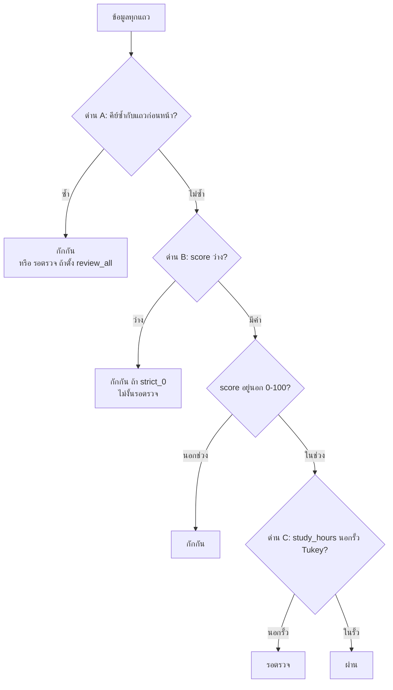

# 01. เอนจินคัดแยกคุณภาพข้อมูลแบบโต้ตอบ (Interactive Quality Gates)

> ผู้ใช้เห็นส่วนนี้ที่: Data Ingestion → Expectations & Alerts → Jobs & Pipelines → Workspace Exports · โค้ดหลัก: `api/app/api/whitebox.py:1173-1335`

## 1. คำตอบ 30 วินาที

เมื่อผู้ใช้อัปโหลดไฟล์คะแนนนักศึกษาในหน้า Data Ingestion เอนจินนี้จะรับข้อมูลเข้ามาไว้ในหน่วยความจำของโปรเซส `api` แล้วให้แต่ละแถวผ่านด่านคัดแยก 3 ด่านตามลำดับ — คีย์ซ้ำ, ค่าว่าง/นอกช่วง, ค่าผิดปกติทางสถิติของชั่วโมงเรียน (`api/app/api/whitebox.py:1173-1335`) — จนได้ผลลัพธ์เป็น 3 กลุ่ม: ผ่าน (Clean), รอตรวจ (Review) และถูกกักกัน (Quarantine) พร้อมคะแนนคุณภาพเป็นเปอร์เซ็นต์ วิธีที่ใช้คือ pandas ธรรมดา (ไม่ใช่ Spark) และกฎทุกข้อปรับได้จากหน้าเว็บแบบเห็นผลทันที ข้อจำกัดหลักคือชื่อคอลัมน์ตายตัว (`student_id`, `course`, `score`, `study_hours`), ค่าคำนวณและคำตัดสินของคนอยู่ในตัวแปรหน่วยความจำ ไม่ใช่ที่เก็บถาวร (หายเมื่อ container ของ `api` ถูกสร้างใหม่) และการอ่านทั้งไฟล์เข้าหน่วยความจำทุกครั้งที่คำนวณใหม่ทำให้ไม่เหมาะกับไฟล์ขนาดใหญ่ระดับล้านแถว

## 2. มุมมองแบบ Black Box

ผู้ใช้อัปโหลดไฟล์ข้อมูลคะแนนนักศึกษาในหน้า Data Ingestion แล้วระบบแสดง

- การ์ดปัญหา 3 ใบ: "ค่าว่างและช่วงค่า", "เรคคอร์ดซ้ำ", "ค่าผิดปกติ"
- ตัวเลขสรุปว่าข้อมูลกี่แถว **ผ่าน** (Clean) กี่แถว **รอตรวจ** (Review) กี่แถว **ถูกกักกัน** (Quarantine) และคะแนนคุณภาพเป็นเปอร์เซ็นต์ — หน้า Expectations & Alerts (`ui/src/pages/RulesConfig.jsx:145,169`) และ Jobs & Pipelines อ่านตัวเลขชุดเดียวกันนี้จาก `/api/v1/whitebox/state`
- ไฟล์ 3 ไฟล์ให้ดาวน์โหลดในหน้า Workspace Exports

จากมุมผู้ใช้ ระบบ "รู้เอง" ว่าแถวไหนดีหรือเสีย บทนี้อธิบายว่ามันตัดสินอย่างไร (เอนจินอีกชุดหนึ่งที่ใช้ Apache Spark กับข้อมูลจริงบน HDFS อธิบายแยกไว้ใน [บทที่ 02 — เอนจินตรวจคุณภาพข้อมูลแบบรอบงาน](02-spark-batch-quality-engine.md); ภาพรวมว่าเอนจินสองชุดนี้ต่างกันตรงไหนอยู่ใน [บทที่ 00 — ภาพรวมระบบทั้งหมด](00-system-overview.md))

## 3. การทำงานภายใน (White Box)

ส่วนนี้ทำงานด้วยไลบรารี **pandas** (ไลบรารีจัดการตารางข้อมูลของภาษา Python ทำงานในหน่วยความจำ ต่างจาก Spark ที่กระจายงานไปหลายเครื่อง) ภายในโปรเซสของ `api` ไม่ได้ใช้ Spark

### 3.1 ขั้นที่ 0: รับไฟล์และคัดว่าไฟล์ไหนเข้าเอนจินได้

เมื่ออัปโหลดผ่าน `/api/v1/whitebox/upload-csv` (endpoint นี้ต้องล็อกอินก่อน — ตรวจคุกกี้ session ผ่าน `dependencies=[Depends(require_session)]`, `api/app/api/whitebox.py:1426`; รายละเอียดการยืนยันตัวตนอยู่ใน [บทที่ 14 — การยืนยันตัวตนและความปลอดภัย](14-authentication-and-security.md)) ระบบอ่านไฟล์ `.csv` หรือ `.xlsx` เป็นตาราง แล้วตรวจว่ามีคอลัมน์ครบ 4 ตัวที่เอนจินต้องใช้หรือไม่ คือ `student_id`, `course`, `score`, `study_hours` (`api/app/api/whitebox.py:59-65`)

- **ครบ** → บันทึกเป็นชุดข้อมูลหลัก เติมคอลัมน์ `dirty_row_id` (เลขแถว 1, 2, 3, …) แล้วส่งเข้าเอนจินคัดแยก (`api/app/api/whitebox.py:1446-1451`)
- **ไม่ครบ** → ทำแค่ "สำรวจข้อมูล" (profile) ไม่ส่งเข้าเอนจิน และหน้า Ingestion แจ้งว่าขาดคอลัมน์ใด

### 3.2 ขั้นที่ 1: สำรวจข้อมูล (Profiling)

ฟังก์ชัน `_compute_profile` (`api/app/api/whitebox.py:165-268`) สรุปสถิติทุกคอลัมน์ ผลนี้คือสิ่งที่การ์ดในหน้า Ingestion แสดง

- ต่อคอลัมน์: จำนวนค่าว่าง, สัดส่วนค่าว่าง, จำนวนค่าไม่ซ้ำ (`api/app/api/whitebox.py:174-177`)
- คอลัมน์ตัวเลข: ต่ำสุด, สูงสุด, ค่าเฉลี่ย, มัธยฐาน, **ควอร์ไทล์** (quartile — ค่าที่แบ่งข้อมูลซึ่งเรียงลำดับแล้วออกเป็น 4 ส่วนเท่ากันตามจำนวนแถว) ที่ 1 (Q1, ตำแหน่ง 25%) และที่ 3 (Q3, ตำแหน่ง 75%), **IQR** (Interquartile Range คือช่วงกว้างของข้อมูลกลุ่มกลาง) = Q3 − Q1 (`api/app/api/whitebox.py:204-210`)
- รั้วค่าผิดปกติสำหรับการ์ด: `Q1 − 1.5×IQR` และ `Q3 + 1.5×IQR` นับค่าที่อยู่นอกรั้วเป็น "ค่าผิดปกติ" — ค่าคูณ 1.5 นี้ **ตายตัวเฉพาะการ์ดนี้เท่านั้น** เขียนตรงในโค้ด ผู้ใช้ปรับไม่ได้ (`api/app/api/whitebox.py:211-214`)
- แถวซ้ำ: นับแถวที่มี `student_id + course + semester` ซ้ำกับแถวก่อนหน้า โดยถือว่าแถวแรกเป็นตัวจริง (`api/app/api/whitebox.py:234-239`)
- ผลของฟังก์ชันนี้ถูกเก็บไว้ในแคช `_LATEST_PROFILING` ต่อชื่อชุดข้อมูล (`api/app/api/whitebox.py:276-277,1450-1451`) — เรียก `/profile` ซ้ำโดยไม่อัปโหลดไฟล์ใหม่จะได้ผลเดิมที่แคชไว้ ไม่คำนวณใหม่ แม้ผู้ใช้จะเปลี่ยนค่า `tukey_multiplier` ของด่านคัดแยกไปแล้วก็ตาม (สำคัญสำหรับคำถามข้อ 8 เรื่องตัวเลขการ์ดกับคิวรอตรวจไม่ตรงกัน)

### 3.3 ขั้นที่ 2: ค่าตั้งต้นของกฎ

กฎทั้งหมดอ่านจากตัวแปร `_WORKFLOW_STATE` (`api/app/api/whitebox.py:1129-1149`) ซึ่งเป็น dict ธรรมดาที่อยู่ใน**หน่วยความจำของโปรเซส Python เท่านั้น** ผู้ใช้ปรับได้ในหน้า Expectations & Alerts ผ่าน `POST /api/v1/whitebox/state` (ต้องล็อกอิน, `api/app/api/whitebox.py:1343`) ซึ่งเรียกจาก `syncWbState` (`ui/src/pages/RulesConfig.jsx:130-160`)

| ค่า | ค่าตั้งต้น | ความหมาย |
|---|---|---|
| `min_score`, `max_score` | 0, 100 | ช่วงคะแนนที่ยอมรับ |
| `null_policy` | `strict_0` | ห้ามมีคะแนนว่างเลย (อีกแบบ `adaptive_5` ยอมให้ว่างได้ไม่เกิน `max_null_pct`) |
| `max_null_pct` | 5.0 | เพดานสัดส่วนค่าว่าง (%) สำหรับแบบ adaptive |
| `composite_key` | `student_id + course + semester` | คีย์ที่ห้ามซ้ำ |
| `dedup_strategy` | `keep_first_quarantine` | เก็บแถวแรก กักกันแถวซ้ำ (อีกแบบ `review_all` ส่งแถวซ้ำไปรอตรวจ) |
| `tukey_multiplier` | `3.0` | ตัวคูณ k ของรั้ว Tukey ของด่านคัดแยก (เลือก `1.5` หรือ `custom` ได้) |
| `review_action` | `KEEP` | สิ่งที่ทำกับคิวรอตรวจทั้งคิว |

### 3.4 ขั้นที่ 3: ด่านคัดแยก 3 ด่าน (ตามลำดับที่โค้ดทำจริง)

ฟังก์ชันหลักคือ `_recompute_interactive_state` (`api/app/api/whitebox.py:1173-1335`) ทำงานใหม่ทุกครั้งที่ข้อมูลหรือกฎเปลี่ยน (ต่างจากการ์ดโปรไฟล์ในข้อ 3.2 ที่แคชผลไว้)



**ด่าน A — คีย์ซ้ำ** (`api/app/api/whitebox.py:1217`)
หาแถวที่ `student_id + course + semester` เหมือนแถวที่อยู่ก่อนหน้าในไฟล์ แถวแรกผ่านด่านนี้ แถวที่มาทีหลังถูกทำเครื่องหมายว่าซ้ำ ถ้าตั้ง `review_all` แถวซ้ำไปคิวรอตรวจแทนการกักกัน (`api/app/api/whitebox.py:1244-1247`)

**ด่าน B — ค่าว่างและช่วงคะแนน** (`api/app/api/whitebox.py:1220-1223`) ตรวจเฉพาะแถวที่ไม่ซ้ำ
- `score` ว่าง: ถ้านโยบายเป็น `strict_0` → กักกันทันที ถ้าเป็นแบบ adaptive → ส่งไปรอตรวจ เว้นแต่สัดส่วนค่าว่างของทั้งไฟล์เกิน `max_null_pct` จึงกักกัน (`api/app/api/whitebox.py:1221`, `api/app/api/whitebox.py:1249-1252`)
- `score` น้อยกว่า `min_score` หรือมากกว่า `max_score` → กักกัน (`api/app/api/whitebox.py:1254-1256`)

**ด่าน C — ค่าผิดปกติของชั่วโมงเรียน (Tukey fence)** (`api/app/api/whitebox.py:1226-1238`) ตรวจเฉพาะแถวที่ผ่านด่าน A และ B แล้ว **Tukey fence** คือรั้วสถิติที่ John Tukey เสนอ ใช้ควอร์ไทล์แทนค่าเฉลี่ยในการหาว่าค่าไหน "ผิดปกติ"

```
Q1  = ควอร์ไทล์ที่ 25 ของ study_hours
Q3  = ควอร์ไทล์ที่ 75 ของ study_hours
IQR = Q3 − Q1
รั้วบน = Q3 + k × IQR        (k = 3.0 ตามค่าตั้งต้น หรือ 1.5)
รั้วล่าง = Q1 − k × IQR
ถ้า study_hours > รั้วบน หรือ < รั้วล่าง → รอตรวจ (ไม่กักกันทันที)
```

เหตุผลที่ส่งไป "รอตรวจ" แทนการกักกัน: ค่าที่สูงผิดปกติอาจเป็นค่าจริง (นักศึกษาขยันจริง) จึงให้คนตัดสิน (`api/app/api/whitebox.py:1258-1260`)

ข้อสำคัญ: Q1 และ Q3 คำนวณจาก `study_hours` ของ**ทุกแถว** รวมแถวที่ตกด่าน A หรือ B ไปแล้ว (`api/app/api/whitebox.py:1226-1228`) และใช้วิธีหาควอร์ไทล์แบบ linear interpolation ซึ่งเป็นค่าตั้งต้นของ pandas

### 3.5 ขั้นที่ 4: คนตัดสินคิวรอตรวจ

- `review_action` ใช้กับทั้งคิว: `KEEP` ปล่อยไว้ในคิว, `APPROVE` ย้ายทุกแถวในคิวไปเป็น "ผ่าน", `REJECT` ย้ายไปกักกัน (`api/app/api/whitebox.py:1263-1269`)
- ตัดสินรายแถวได้ด้วย `row_decisions` และคำตัดสินรายแถวจะทับคำตัดสินทั้งคิว เพราะโค้ดรันคำตัดสินทั้งคิวก่อนแล้วจึงวนลูปทับด้วยคำตัดสินรายแถวทีหลัง (`api/app/api/whitebox.py:1271-1285`)
- แก้ค่า `score` หรือ `study_hours` รายแถวได้ด้วย `row_edits` ก่อนเริ่มตรวจ (`api/app/api/whitebox.py:1186-1197`)

### 3.6 ขั้นที่ 5: ผลลัพธ์

- แยกข้อมูลเป็น 3 ไฟล์ `clean_dataset_run.csv`, `review_queue_run.csv`, `quarantine_lake_run.csv` ซึ่งหน้า Export ให้ดาวน์โหลด (`api/app/api/whitebox.py:1292-1297`)
- คะแนนคุณภาพ = แถวที่ผ่าน ÷ แถวทั้งหมด × 100 ปัดทศนิยม 1 ตำแหน่ง (`api/app/api/whitebox.py:1311`)
- แต่ละแถวมีคอลัมน์ `whitebox_rule_applied` บอกว่ากฎข้อไหนตัดสินแถวนั้น เช่น `Value Range Check [0.0, 100.0]` (`api/app/api/whitebox.py:1240-1260`) นี่คือเหตุผลที่ระบบเรียกตัวเองว่า "White-Box": ทุกแถวอธิบายได้ว่าทำไมถึงถูกคัด

## 4. เดินผ่านโค้ดจริง

**หน้ากากทั้ง 3 ด่านและการคำนวณรั้ว** — จุดที่ตัดสินว่าแถวไหนซ้ำ ว่าง นอกช่วง หรือผิดปกติทางสถิติ ทั้งหมดถูกคำนวณเป็น boolean mask (อาร์เรย์จริง/เท็จขนานกับทุกแถว) ก่อนแล้วจึงนำไปกำหนดสถานะทีหลัง

```python
# api/app/api/whitebox.py:1216-1238
    # 1. Duplicate mask (Gate 2)
    dup_mask = df.duplicated(subset=comp_cols, keep="first") if r2_active else pd.Series(False, index=df.index)

    # 2. Missing score & out-of-range masks (Gate 1, evaluated on non-duplicate rows)
    observed_null_pct = (df["score"].isna().sum() / total_rows) * 100.0 if total_rows > 0 else 0.0
    should_quarantine_nulls = (null_policy == "strict_0") or (observed_null_pct > max_null_pct)
    null_mask = (~dup_mask) & df["score"].isna() if r1_active else pd.Series(False, index=df.index)
    range_mask = (~dup_mask) & (~df["score"].isna()) & ((df["score"] < min_s) | (df["score"] > max_s)) if r1_active else pd.Series(False, index=df.index)

    # 3. Tukey IQR Outlier mask (Gate 3, evaluated on rows passing Gate 1 & Gate 2)
    clean_hours = df["study_hours"].dropna()
    q1 = float(clean_hours.quantile(0.25))
    q3 = float(clean_hours.quantile(0.75))
    iqr = float(q3 - q1)
    if _WORKFLOW_STATE.get("custom_upper_fence") is not None and tukey_str == "custom":
        upper_fence = float(_WORKFLOW_STATE["custom_upper_fence"])
    else:
        upper_fence = float(q3 + tukey_mult * iqr)
        _WORKFLOW_STATE["custom_upper_fence"] = upper_fence
    lower_fence = float(q1 - tukey_mult * iqr)

    passed_g1_g2 = (~dup_mask) & (~null_mask) & (~range_mask)
    outlier_mask = passed_g1_g2 & (~df["study_hours"].isna()) & ((df["study_hours"] > upper_fence) | (df["study_hours"] < lower_fence)) if r3_active else pd.Series(False, index=df.index)
```

| บรรทัด | ทำอะไร |
|---|---|
| 1216-1217 | หาแถวที่คีย์ผสม (`comp_cols`) ซ้ำกับแถวก่อนหน้า ด้วย `df.duplicated(keep="first")` — แถวแรกของแต่ละคีย์ไม่ถูกนับว่าซ้ำ ถ้าปิดกฎนี้ (`r2_active=False`) จะได้ mask เป็นเท็จทั้งหมด |
| 1219-1221 | คำนวณ `observed_null_pct` = สัดส่วนแถวที่ `score` ว่างจากทั้งไฟล์ แล้วตัดสินว่าควรกักกันค่าว่างหรือไม่ (`should_quarantine_nulls`): จริงทันทีถ้านโยบายเป็น `strict_0`, หรือจริงถ้าสัดส่วนว่างเกิน `max_null_pct` แม้อยู่ในนโยบาย adaptive |
| 1222-1223 | `null_mask`/`range_mask` ตรวจ**เฉพาะแถวที่ไม่ซ้ำ** (`~dup_mask`) เท่านั้น — นี่คือเหตุผลที่ด่านคีย์ซ้ำต้องคำนวณก่อนในโค้ด (ดูส่วนที่ 6) |
| 1226-1229 | คำนวณ Q1, Q3, IQR ของ `study_hours` จาก `clean_hours` ซึ่งดรอปเฉพาะค่าว่าง แต่**ไม่ได้กรองแถวที่ตกด่าน A/B ออก** — รวมแถวเสียเข้าไปคำนวณรั้วด้วย |
| 1230-1234 | ถ้าโหมดเป็น `custom` และมีค่า `custom_upper_fence` เดิมอยู่ ใช้ค่านั้นตรงๆ ไม่คำนวณใหม่ มิฉะนั้นคำนวณ `upper_fence = Q3 + k×IQR` แล้ว**เขียนทับ** `custom_upper_fence` ทุกครั้งที่ไม่ใช่โหมด custom |
| 1235 | `lower_fence` คำนวณจาก `k` ปกติเสมอ แม้อยู่ในโหมด `custom` ก็ไม่ถูกแทนที่ด้วยค่าที่ผู้ใช้กำหนดเอง |
| 1237-1238 | `passed_g1_g2` คือแถวที่ผ่านทั้งด่าน A และ B แล้ว `outlier_mask` ตรวจนอกรั้วบน/ล่างเฉพาะแถวกลุ่มนี้ที่มี `study_hours` ไม่ว่าง |

**การกำหนดสถานะและเหตุผลต่อแถว** — จาก mask ทั้ง 3 ชุดข้างต้น โค้ดกำหนดคอลัมน์ `whitebox_status`/`whitebox_error_type`/`whitebox_rule_applied` ทีละกลุ่ม ตามลำดับ (แถวหลังทับแถวก่อนได้ถ้า mask ซ้อนกัน แต่ในทางปฏิบัติ mask ทั้ง 4 ไม่ซ้อนกันเพราะแต่ละอันกรองแถวที่ผ่านด่านก่อนหน้าออกไปแล้ว):

```python
# api/app/api/whitebox.py:1244-1260
    dup_target_status = "Review" if dedup_strategy == "review_all" else "Quarantine"
    df.loc[dup_mask, "whitebox_status"] = dup_target_status
    df.loc[dup_mask, "whitebox_error_type"] = "Duplicate"
    df.loc[dup_mask, "whitebox_rule_applied"] = f"Composite Key Uniqueness ({comp_key_str})"

    null_target_status = "Quarantine" if should_quarantine_nulls else "Review"
    df.loc[null_mask, "whitebox_status"] = null_target_status
    df.loc[null_mask, "whitebox_error_type"] = "Missing Score"
    df.loc[null_mask, "whitebox_rule_applied"] = "Strict Completeness (0% Null)" if should_quarantine_nulls else f"Adaptive Null Review (<={max_null_pct}%)"

    df.loc[range_mask, "whitebox_status"] = "Quarantine"
    df.loc[range_mask, "whitebox_error_type"] = "Invalid Score Range"
    df.loc[range_mask, "whitebox_rule_applied"] = f"Value Range Check [{min_s}, {max_s}]"

    df.loc[outlier_mask, "whitebox_status"] = "Review"
    df.loc[outlier_mask, "whitebox_error_type"] = "Study Hours Outlier"
    df.loc[outlier_mask, "whitebox_rule_applied"] = f"Tukey IQR Fence (> {round(upper_fence, 1)}h)"
```

| บรรทัด | ทำอะไร |
|---|---|
| 1244-1247 | แถวซ้ำ (`dup_mask`) ไปที่ `Quarantine` ตามค่าเริ่มต้น หรือ `Review` ถ้าตั้ง `dedup_strategy = review_all` บันทึกชื่อกฎเป็น `Composite Key Uniqueness (...)` ระบุคีย์ผสมที่ใช้ตรวจ |
| 1249-1252 | แถวคะแนนว่าง (`null_mask`) ไปที่ `Quarantine` ถ้า `should_quarantine_nulls` เป็นจริง ไม่งั้นไป `Review` ชื่อกฎบอกด้วยว่าเป็นนโยบายแบบเข้มงวดหรือแบบผ่อนปรนพร้อมเพดาน % |
| 1254-1256 | แถวคะแนนนอกช่วง (`range_mask`) ไปที่ `Quarantine` เสมอ ไม่มีเงื่อนไขแยกย่อยเหมือนสองด่านบน — คะแนนติดลบหรือเกิน 100 ถือว่าผิดแน่นอน |
| 1258-1260 | แถวชั่วโมงเรียนผิดปกติ (`outlier_mask`) ไปที่ `Review` เสมอ ไม่เคย `Quarantine` ทันที ชื่อกฎบอกค่ารั้วบนที่ใช้จริง (ปัดทศนิยม 1 ตำแหน่ง) |

**การตัดสินของคนทับผลของด่านสถิติ** — คิวรอตรวจไม่ใช่จุดจบเสมอไป ผู้ตรวจสามารถสั่งย้ายทั้งคิวหรือย้ายเป็นรายแถว โค้ดรันคำสั่งระดับคิวก่อน แล้ว "ทับ" ด้วยคำสั่งรายแถวทีหลัง ทำให้คำตัดสินรายแถวชนะเสมอไม่ว่า `review_action` จะเป็นอะไร:

```python
# api/app/api/whitebox.py:1263-1285
    rev_action = _WORKFLOW_STATE.get("review_action", "KEEP")
    if rev_action == "APPROVE":
        df.loc[df["whitebox_status"] == "Review", "whitebox_rule_applied"] = "Human Approved -> Clean Asset"
        df.loc[df["whitebox_status"] == "Review", "whitebox_status"] = "Valid"
    elif rev_action == "REJECT":
        df.loc[df["whitebox_status"] == "Review", "whitebox_rule_applied"] = "Human Rejected -> Quarantine Lake"
        df.loc[df["whitebox_status"] == "Review", "whitebox_status"] = "Quarantine"

    # Apply individual row overrides if any
    row_decisions = _WORKFLOW_STATE.get("row_decisions", {}) or {}
    for row_key, decision in row_decisions.items():
        try:
            rid = int(str(row_key).replace("#", ""))
            if "dirty_row_id" in df.columns:
                mask = df["dirty_row_id"] == rid
                if decision == "APPROVE":
                    df.loc[mask, "whitebox_status"] = "Valid"
                    df.loc[mask, "whitebox_rule_applied"] = f"Row #{rid} Corrected & Approved"
                elif decision == "REJECT":
                    df.loc[mask, "whitebox_status"] = "Quarantine"
                    df.loc[mask, "whitebox_rule_applied"] = f"Row #{rid} Quarantined by Reviewer"
        except Exception:
            pass
```

| บรรทัด | ทำอะไร |
|---|---|
| 1263 | อ่านคำสั่งระดับคิว (`review_action`) ค่าตั้งต้นคือ `KEEP` (ไม่ทำอะไร) |
| 1264-1266 | ถ้าเป็น `APPROVE` ทุกแถวที่สถานะยัง `Review` ถูกเปลี่ยนเป็น `Valid` (ผ่าน) พร้อมบันทึกเหตุผลใหม่ |
| 1267-1269 | ถ้าเป็น `REJECT` ทุกแถวที่สถานะยัง `Review` ถูกเปลี่ยนเป็น `Quarantine` |
| 1271-1273 | เริ่มวนลูปคำตัดสินรายแถวจาก dict `row_decisions` (คีย์เป็นรหัสแถว เช่น `"#5"`) |
| 1274-1277 | แปลงคีย์เป็นเลข `dirty_row_id` แล้วหาแถวที่ตรงกันในตาราง |
| 1278-1280 | คำตัดสิน `APPROVE` รายแถว → เปลี่ยนเป็น `Valid` ทับสถานะเดิมไม่ว่าเดิมจะเป็นอะไร |
| 1281-1283 | คำตัดสิน `REJECT` รายแถว → เปลี่ยนเป็น `Quarantine` |
| 1284-1285 | ดัก error เงียบ (`except Exception: pass`) ถ้ารหัสแถวแปลงเป็นเลขไม่ได้ ไม่ทำให้คำขอทั้งหมดล้ม แต่ก็ไม่แจ้งผู้ใช้ว่าคำตัดสินแถวนั้นถูกข้าม |

**การคำนวณคะแนนคุณภาพ** — หลังแยกทั้ง 3 กลุ่มเป็น DataFrame ย่อยแล้ว คะแนนคุณภาพคำนวณจากสัดส่วนแถวที่ผ่านด่านสุดท้ายจริง (หลังการตัดสินของคนแล้ว) ไม่ใช่จากตัวนับด่านใดด่านหนึ่ง:

```python
# api/app/api/whitebox.py:1308-1311
    clean_cnt = int(len(df_clean))
    review_cnt = int(len(df_review))
    quarantine_cnt = int(len(df_quarantine))
    quality_score_pct = round((clean_cnt / total_rows) * 100, 1) if total_rows > 0 else 0.0
```

| บรรทัด | ทำอะไร |
|---|---|
| 1308-1310 | นับจำนวนแถวจริงในแต่ละ DataFrame ย่อยที่กรองไว้ก่อนหน้านี้ (`df_clean`/`df_review`/`df_quarantine`) ไม่ใช่ผลรวมของ mask ดิบ จึงสะท้อนผลหลังการตัดสินของคนด้วย |
| 1311 | คะแนนคุณภาพ = แถวผ่าน ÷ แถวทั้งหมด × 100 ปัดทศนิยม 1 ตำแหน่ง ป้องกันหารด้วยศูนย์ด้วย `if total_rows > 0` |

## 5. ตัวอย่างการคำนวณจริง

ข้อมูล: `dirty_course_scores_demo.csv` 250 แถว (สร้างด้วย `docs/whitebox-report/tools/gen_demo_dataset.py:1`) อัปโหลดเข้าระบบจริงแล้วดึงผลจาก API หลักฐาน: `evidence/01-profile.json`, `evidence/01-state.json`, `evidence/01-example-rows.txt`, `evidence/01-state-adaptive-k15.json`

**ตัวอย่างแถวจริงที่ตกแต่ละด่าน** (จาก `evidence/01-example-rows.txt` — บทที่ 15 จะไล่ตามแถว 2, 3, 7, 25 ผ่านด่านเหล่านี้อีกครั้งในบริบทปลายทางถึงต้นทาง ดู [บทที่ 15 — เส้นทางข้อมูลต้นทางถึงปลายทาง](15-end-to-end-trace.md))

| ด่าน | แถว | ค่า | ผล |
|---|---|---|---|
| A ซ้ำ | 99 และ 135 | S3026 / CS101 / 2025-1 ทั้งคู่ | แถว 99 ผ่านด่าน A, แถว 135 ถูกกักกัน |
| B ว่าง | 2 | S4004, score ว่าง | กักกัน (นโยบาย `strict_0`) |
| B ต่ำเกิน | 7 | S4113, score = −26.3 | กักกัน (ต่ำกว่า 0) |
| B สูงเกิน | 25 | S4104, score = 117.3 | กักกัน (สูงกว่า 100) |
| C ผิดปกติ | 3 | S4305, study_hours = 40.4 | รอตรวจ |

**คำนวณรั้ว Tukey** (ค่า Q1, Q3 จาก `evidence/01-state.json`)

```
Q1 = 3.8, Q3 = 7.1
IQR = 7.1 − 3.8 = 3.3

รั้วของด่าน C (k = 3.0):  รั้วบน = 7.1 + 3.0 × 3.3 = 17.0   รั้วล่าง = 3.8 − 9.9 = −6.1
รั้วของการ์ด Ingestion (k = 1.5):  รั้วบน = 7.1 + 1.5 × 3.3 = 12.05
```

ระบบรายงาน `upper_fence = 17.0` ตรงกับที่คำนวณมือ `study_hours` ของแถวปกติอยู่ระหว่าง 2.0–8.0 และค่าผิดปกติต่ำสุดคือ 31.9 จึงเกินทั้งรั้ว 17.0 และ 12.05 ได้ 12 แถวเท่ากันทั้งสองแบบ

**นับผลรวม (ค่าตั้งต้น `strict_0` / k = 3.0, จาก `evidence/01-state.json`)**

```
ด่าน A  ซ้ำ                    13 แถว → กักกัน
ด่าน B  score ว่าง             12 แถว → กักกัน
        score นอก 0–100         13 แถว → กักกัน
ด่าน C  study_hours นอกรั้ว     12 แถว → รอตรวจ
ผ่านทุกด่าน                    200 แถว

กักกัน  = 13 + 12 + 13 = 38
รอตรวจ = 12
ผ่าน   = 250 − 38 − 12 = 200
คะแนนคุณภาพ = 200 ÷ 250 × 100 = 80.0%
```

ตรงกับ `clean_rows 200`, `review_rows 12`, `quarantine_rows 38`, `quality_score_pct 80.0` ที่ระบบคืนมา

**เปลี่ยนเป็น `adaptive_5` / k = 1.5 จริงบนระบบที่รันอยู่** (คำสั่งที่ใช้และผลดิบอยู่ใน `evidence/01-state-adaptive-k15.json` เรียกผ่าน `POST /api/v1/whitebox/state` ด้วย `{"null_policy":"adaptive_5","tukey_multiplier":"1.5"}` แล้วคืนค่าตั้งต้นด้วย `{"null_policy":"strict_0","tukey_multiplier":"3.0"}` ทันทีหลังเก็บผล เพื่อไม่ให้กระทบผู้ใช้อื่นที่ใช้ระบบเดียวกัน — ยืนยันด้วย `GET /api/v1/whitebox/state` หลังคืนค่าว่า `null_policy` กลับเป็น `strict_0` และ `tukey_multiplier` กลับเป็น `3.0` จริง)

```
สัดส่วนค่าว่างของไฟล์นี้ = 12 ÷ 250 × 100 = 4.8% (`evidence/01-profile.json`) ซึ่งไม่เกิน max_null_pct = 5.0
→ should_quarantine_nulls = False (นโยบาย adaptive และไม่เกินเพดาน) → 12 แถวคะแนนว่างไปที่ Review แทน Quarantine (api/app/api/whitebox.py:1221,1249)

รั้วที่ k = 1.5:  รั้วบน = 7.1 + 1.5 × 3.3 = 12.05 (ตรงกับ upper_fence: 12.05 ที่ระบบคืนมา)
ค่าผิดปกติต่ำสุด = 31.9 ยังคงเกินรั้ว 12.05 เหมือนที่เกินรั้ว 17.0 จึงยังได้ 12 แถวเท่ากับก่อนหน้า (initial_outlier_count: 12)

กักกัน  = ซ้ำ 13 + นอกช่วง 13 = 26
รอตรวจ = ว่าง 12 + ผิดปกติ 12 = 24
ผ่าน   = 250 − 26 − 24 = 200
คะแนนคุณภาพ = 200 ÷ 250 × 100 = 80.0%
```

ตรงกับ `quarantine_rows 26`, `review_rows 24`, `upper_fence 12.05`, `quality_score_pct 80.0` ใน `evidence/01-state-adaptive-k15.json` เป๊ะทุกตัวเลข — ยืนยันตามที่ระบุไว้ในข้อสั่งงาน (quarantine 26, review 24, รั้ว k = 1.5 ที่ 12.05) คะแนนคุณภาพไม่เปลี่ยน (80.0%) เพราะ 12 แถวที่ย้ายมีผลแค่สลับระหว่าง Quarantine กับ Review เท่านั้น ไม่มีแถวไหนย้ายเข้า/ออกจาก Clean

## 6. ทำไมออกแบบแบบนี้ และทางเลือกอื่น

**ทำไมตรวจคีย์ซ้ำก่อนค่าว่าง/ช่วงค่า** — โค้ดคำนวณ `dup_mask` ก่อน (`api/app/api/whitebox.py:1217`) แล้วให้ `null_mask`/`range_mask` ใช้ `~dup_mask` กรองอีกชั้น (`:1222-1223`) เหตุผลเชิงตรรกะ: ถ้าแถวหนึ่งเป็นสำเนาของแถวอื่นที่ถูกต้องอยู่แล้ว การไปติดป้าย "ค่าว่าง" หรือ "นอกช่วง" ซ้อนบนแถวซ้ำนั้นไม่มีประโยชน์ — สิ่งที่ผู้ตรวจต้องรู้คือ "นี่คือสำเนา" ไม่ใช่ "สำเนานี้บังเอิญมีค่าว่างด้วย" ทางเลือกอื่นคือตรวจอิสระทั้ง 3 ด่านแล้วให้ด่านที่มาทีหลังชนะ (ตามลำดับโค้ด) แต่จะทำให้แถวซ้ำที่บังเอิญคะแนนว่างถูกนับเป็น "Missing Score" แทนที่จะเป็น "Duplicate" ซึ่งซ่อนสาเหตุที่แท้จริงของปัญหา (ทั้งที่ชื่อคอมเมนต์ในโค้ดเรียกด่านนี้ว่า "Gate 2" สลับกับด่านค่าว่างที่เรียก "Gate 1" — ดูข้อ 7)

**ทำไมค่าผิดปกติ (Tukey) ไปรอตรวจ แต่นอกช่วงคะแนนไปกักกันทันที** — ช่วงคะแนน [0, 100] เป็นข้อเท็จจริงที่นิยามไว้ตายตัว (คะแนนสอบเป็นไปไม่ได้ที่จะติดลบหรือเกิน 100) ผิดกฎแปลว่าข้อมูลเสียแน่นอน ไม่ต้องมีคนตัดสินซ้ำ แต่รั้ว Tukey ของชั่วโมงเรียนเป็นการอนุมานทางสถิติจากข้อมูลชุดนี้เอง ไม่ใช่กฎธุรกิจที่แน่นอน (`api/app/api/whitebox.py:1258-1260`) ค่าที่สูงผิดปกติอาจเป็นนักศึกษาที่ขยันเรียนจริง การกักกันทันทีจะทำลายข้อมูลจริงที่อาจมีคุณค่า ระบบจึงเลือกความปลอดภัยที่มากกว่า (ส่งให้คนตัดสิน) แลกกับงานที่คนต้องทำเพิ่ม

**ทำไมใช้ Tukey fence แทนค่าเฉลี่ย ± 3 SD** — ค่าเฉลี่ย (mean) และส่วนเบี่ยงเบนมาตรฐาน (SD) คำนวณจากทุกค่ารวมถึงค่าผิดปกติเอง ยิ่งค่าผิดปกติสุดโต่งมากเท่าไร มันก็ยิ่งดึงค่าเฉลี่ยและ SD ให้เลื่อนตามตัวมันเอง (ปัญหาที่เรียกว่า "masking effect") ทำให้รั้วขยับหนีตามค่าผิดปกติจนตรวจจับได้ยากขึ้น ในทางกลับกัน Q1/Q3 (`api/app/api/whitebox.py:1227-1228`) มาจากตำแหน่งกลางของข้อมูลที่เรียงลำดับแล้ว แทบไม่ขยับแม้มีค่าสุดโต่งไม่กี่ค่า รั้วจึงมั่นคงกว่า ทางเลือกอื่นคือ Z-score (ค่าเฉลี่ย ± c×SD) ซึ่งคำนวณเร็วกว่าแต่เสียความทนทานต่อค่าผิดปกติแบบที่ Tukey มี

**ทำไมค่าตั้งต้นใช้ k = 3.0 ไม่ใช่ 1.5 แบบตำรา** — ค่า k = 1.5 ในทางสถิติมาตรฐานคือ "รั้วใน" (inner fence) จับค่าที่ "น่าสงสัย" ได้ไวแต่กว้างเกินไปสำหรับกฎอัตโนมัติ ส่วน k = 3.0 คือ "รั้วนอก" (outer fence) จับเฉพาะค่าที่ "ผิดปกติชัดเจน" (`api/app/api/whitebox.py:1208-1209`) ระบบเลือกแบบหลวมไว้ก่อนเพื่อไม่ให้คิวรอตรวจล้นด้วยแถวที่จริงๆ ไม่ผิดปกติ (false positive) ผู้ใช้สลับเป็น 1.5 ได้เองถ้าต้องการความเข้มงวดกว่านี้ ทางเลือกอื่นคือใช้ 1.5 เป็นค่าตั้งต้นตามตำรา แต่จะเพิ่มภาระงานตรวจของคนจากข้อมูลตัวอย่างนี้จาก 12 แถวเป็นมากกว่านั้น (ตัวเลข "154 แถว" ที่ปรากฏใน `recommended_rule` ของฟังก์ชันแนะนำกฎที่ `api/app/api/whitebox.py:399,408` เป็นตัวเลขคงที่/ตัวอย่างประกอบคำอธิบาย ไม่ใช่ผลคำนวณจริงจากไฟล์นี้ — ดูข้อ 7)

**ทำไม keep-first สำหรับคีย์ซ้ำ** — `df.duplicated(subset=comp_cols, keep="first")` (`api/app/api/whitebox.py:1217`) ให้แถวที่ปรากฏก่อนในไฟล์เป็นตัวจริงเสมอ เป็นกติกาที่ง่ายและคาดเดาผลได้แน่นอน (deterministic) โดยไม่ต้องมีตรรกะเปรียบเทียบว่าแถวไหน "ถูกต้องกว่า" (เช่น ค่าไหนใหม่กว่า หรือค่าไหนสมบูรณ์กว่า) ซึ่งจะซับซ้อนขึ้นมากและต้องนิยามกฎเพิ่ม ระบบยอมรับตรงๆ ว่าไม่รู้ว่าแถวไหน "ถูก" จริง ถ้าต้องการให้คนเลือกแทน ตั้ง `dedup_strategy = review_all` แถวซ้ำจะไปคิวรอตรวจแทนการกักกันอัตโนมัติ

**ทำไมใช้ pandas ในโปรเซส API แทน Spark สำหรับเส้นทางนี้** — จุดประสงค์ของเอนจินนี้คือให้ผู้ใช้ทดลองปรับกฎแล้วเห็นผลทันทีในหน้า Expectations & Alerts (สอนขั้นตอนการตัดสินใจแบบทีละก้าวในหน้า Audit Trail) การเริ่มงาน Spark ต้องพึ่งคลัสเตอร์ (`spark-master`/`spark-worker`) ซึ่งใช้เวลาราว 120 วินาทีกว่าจะพร้อม (`docker-compose.yml:149`, ดู [บทที่ 00](00-system-overview.md) ข้อ 6) ไม่เหมาะกับการตอบสนองแบบโต้ตอบทันที pandas ในหน่วยความจำของโปรเซสเดียวให้ผลลัพธ์ในเสี้ยววินาทีสำหรับไฟล์ขนาดเล็ก แลกมาด้วยการไม่ทนต่อขนาดข้อมูลใหญ่และไม่มีที่เก็บถาวร (ดูข้อ 7 และ [บทที่ 02](02-spark-batch-quality-engine.md) สำหรับเอนจิน Spark ที่ออกแบบมาสำหรับข้อมูลจริงขนาดใหญ่โดยเฉพาะ)

## 7. ข้อจำกัด ค่าตายตัว และข้อสังเกต

- **ชื่อคอลัมน์ตายตัว:** กฎทั้ง 3 ด่านใช้ชื่อ `score` และ `study_hours` ตรงๆ ในโค้ด (`api/app/api/whitebox.py:1220-1238`) ไฟล์ที่ใช้ชื่ออื่นตรวจอัตโนมัติไม่ได้ ระบบจึงปฏิเสธไม่ส่งเข้าเอนจิน (ขั้นที่ 0)
- **รั้วสองแบบและแคชคนละอายุ:** การ์ด "ค่าผิดปกติ" ในหน้า Ingestion ใช้ k = 1.5 ตายตัว คำนวณครั้งเดียวตอนอัปโหลดแล้วแคชไว้ (`api/app/api/whitebox.py:211-212,276-277`) แต่ด่านคัดแยกใช้ `tukey_multiplier` ที่ผู้ใช้ปรับได้ (ค่าตั้งต้น 3.0) และคำนวณใหม่ทุกครั้ง (`api/app/api/whitebox.py:1208-1209,1173`) กับข้อมูลตัวอย่างนี้ทั้งสองค่า k ให้ผลเท่ากัน (12 แถว) เพราะค่าผิดปกติสุดโต่งมาก แต่ข้อมูลอื่นอาจได้ไม่เท่ากัน และถ้าผู้ใช้เปลี่ยน `tukey_multiplier` หลังอัปโหลด การ์ดโปรไฟล์จะไม่อัปเดตตามเลย (เพราะแคชจาก `_LATEST_PROFILING` ไม่ถูกล้างเมื่อกฎเปลี่ยน) ผู้ใช้จึงอาจเห็นการ์ดบอก N แถวคงที่ ในขณะที่คิวรอตรวจจริงเปลี่ยนไปตามกฎที่ปรับล่าสุด
- **ชื่อด่านในโค้ดสลับกับลำดับจริง:** คอมเมนต์เรียกการตรวจซ้ำว่า "Gate 2" และค่าว่าง/ช่วงว่า "Gate 1" (`api/app/api/whitebox.py:1216-1219`) แต่โค้ดตรวจซ้ำก่อน แล้วจึงตรวจค่าว่าง/ช่วงเฉพาะแถวที่ไม่ซ้ำ ตัวนับ `gate1_passed`/`gate2_passed` (`api/app/api/whitebox.py:1302-1305`) นับตามชื่อ ไม่ใช่ตามลำดับจริง ผลรวมสุดท้ายยังถูกต้อง
- **Q1/Q3 รวมแถวเสีย:** รั้ว Tukey คำนวณจากทุกแถว รวมแถวที่ตกด่านอื่น ถ้าแถวเสียมีสัดส่วนมาก รั้วจะเลื่อน
- **รั้วกำหนดเอง:** ค่า `custom_upper_fence` ถูกเขียนทับด้วยรั้วที่คำนวณได้ทุกครั้งที่ไม่ได้อยู่ในโหมด custom (`api/app/api/whitebox.py:1233-1234`) และรั้วล่างใช้ k ตามปกติแม้อยู่ในโหมด custom (`api/app/api/whitebox.py:1235`)
- **สถานะอยู่ในหน่วยความจำ:** กฎที่ตั้ง คำตัดสินของคน และข้อมูลที่อัปโหลดอยู่ในตัวแปรของโปรเซส (`api/app/api/whitebox.py:1129`) และไฟล์ใน container เมื่อ API รีสตาร์ต ค่าที่ตั้งและคำตัดสินหายทั้งหมด (รายละเอียดที่ไม่มี volume ถาวรของ container `api` อยู่ใน [บทที่ 00](00-system-overview.md) ข้อ 3.2/7)
- **คำอธิบายในโค้ดเก่า:** docstring ยังบอกว่าทำงานกับ "10,100 rows of dirty_dataset.csv" (`api/app/api/whitebox.py:1175`) แต่จริงๆ ทำงานกับไฟล์ที่อัปโหลดล่าสุด
- **ตัวเลข "154 แถว" เป็นค่าคงที่ ไม่ใช่ผลคำนวณจริง:** ฟังก์ชันแนะนำกฎ `_generate_recommendations` เขียนตัวเลข `inner_fence_flagged_count: 154` และ `outer_fence_flagged_count: 100` ตรงในโค้ด (`api/app/api/whitebox.py:399,402`) เป็นข้อความประกอบคำอธิบายสำหรับชุดข้อมูลตัวอย่างอื่น ไม่ใช่ค่าที่คำนวณจาก `study_hours` ของไฟล์ที่ผู้ใช้เพิ่งอัปโหลดจริง ผู้ใช้ที่อ่านคำแนะนำนี้อาจเข้าใจผิดว่าเป็นผลคำนวณสดจากไฟล์ของตน

## 8. คำถามกรรมการ

### พื้นฐาน

1. **ถาม:** ทำไมค่าผิดปกติไปรอตรวจ แต่คะแนนนอกช่วงถูกกักกันทันที?
   **ตอบ:** คะแนนติดลบหรือเกิน 100 เป็นไปไม่ได้ตามนิยาม จึงผิดแน่นอน (`api/app/api/whitebox.py:1254-1256`) แต่ชั่วโมงเรียนสูงผิดปกติอาจเป็นค่าจริง ระบบจึงให้คนเป็นผู้ตัดสิน (`:1258-1260`) ดูส่วนที่ 6 สำหรับเหตุผลเต็ม
2. **ถาม:** ทำไมใช้ Tukey fence แทนค่าเฉลี่ย ± 3 SD?
   **ตอบ:** ค่าเฉลี่ยและ SD ถูกดึงโดยค่าผิดปกติเอง แต่ Q1/Q3 แทบไม่ขยับเมื่อมีค่าสุดโต่งไม่กี่ค่า รั้วจึงไม่เลื่อนตามค่าผิดปกติ (ส่วนที่ 6)
3. **ถาม:** ถ้าแถวซ้ำ ระบบรู้ได้อย่างไรว่าแถวไหนถูก?
   **ตอบ:** ไม่รู้ ระบบใช้กติกา "เก็บแถวแรกที่พบ" (`api/app/api/whitebox.py:1217`) ถ้าต้องการให้คนเลือก ให้ตั้ง `review_all` แถวซ้ำจะไปคิวรอตรวจแทน
4. **ถาม:** ผลการคัดแยกตรวจสอบย้อนหลังได้ไหม?
   **ตอบ:** ได้ ทุกแถวในไฟล์ผลลัพธ์มีคอลัมน์ `whitebox_error_type` และ `whitebox_rule_applied` บอกกฎที่ตัดสิน (ส่วนที่ 3.6)

### เชิงลึก

1. **ถาม:** ถ้าไฟล์มีหนึ่งล้านแถว ส่วนนี้ยังใช้ได้ไหม?
   **ตอบ:** ใช้ได้ในทางเทคนิค (pandas ประมวลผลแบบ vectorized ไม่ใช่วนลูปทีละแถว) แต่ทุกครั้งที่กฎเปลี่ยนหรือมีคำตัดสินใหม่ `_recompute_interactive_state` จะ `pd.read_csv` ทั้งไฟล์เข้าหน่วยความจำใหม่ทั้งหมดแล้วคำนวณ mask ทั้ง 3 ชุดใหม่ทั้งหมด (`api/app/api/whitebox.py:1179-1182`) ไม่มีการคำนวณส่วนต่าง (incremental) หนึ่งล้านแถวจะทำให้ทุกการโต้ตอบในหน้า Expectations & Alerts (ปรับ slider หนึ่งครั้ง) ต้องอ่าน-คำนวณใหม่ทั้งไฟล์ ซึ่งอาจช้าจนไม่ "โต้ตอบ" ได้จริงอีกต่อไป และทั้งไฟล์ต้องพอดีกับ RAM ที่จำกัดไว้ให้ container `api` — เอนจิน Spark ใน [บทที่ 02](02-spark-batch-quality-engine.md) ถูกออกแบบมาสำหรับขนาดนี้แทน
2. **ถาม:** ทำไมการ์ดบอกค่าผิดปกติ N แถว แต่คิวรอตรวจไม่เท่ากับ N?
   **ตอบ:** เป็นคนละรั้วและคนละเวลาคำนวณ การ์ดโปรไฟล์ใช้ k = 1.5 ตายตัว คำนวณครั้งเดียวตอนอัปโหลดแล้วแคชไว้ใน `_LATEST_PROFILING` (`api/app/api/whitebox.py:211-212,276-277`) ส่วนคิวรอตรวจใช้ `tukey_multiplier` ที่ผู้ใช้ปรับได้ (ตั้งต้น 3.0) และคำนวณใหม่ทุกครั้งที่เรียก `_recompute_interactive_state` (`:1208-1209,1226-1238`) ถ้าค่า k ต่างกันและมีแถวที่อยู่ระหว่างรั้วทั้งสอง ตัวเลขจะไม่ตรงกัน — กับข้อมูลตัวอย่างของบทนี้บังเอิญได้ 12 เท่ากันทั้งคู่เพราะค่าผิดปกติสุดโต่งมาก (ส่วนที่ 5) แต่ไม่ควรเข้าใจว่าเป็นแบบนี้เสมอไป นอกจากนี้คิวรอตรวจที่ผู้ใช้เห็นจริงบนจอยังถูกคำสั่งของคน (`review_action`/`row_decisions`) ทับได้อีกชั้นหนึ่ง (`:1263-1285`) จึงยิ่งต่างจากตัวเลขในการ์ดได้อีก
3. **ถาม:** ทำไมคำตัดสินระดับคิว (`review_action`) กับระดับแถว (`row_decisions`) ถึงไม่ขัดกัน?
   **ตอบ:** เพราะโค้ดรันคำสั่งระดับคิวก่อน (`api/app/api/whitebox.py:1263-1269`) แล้ว "เขียนทับ" ด้วยลูปคำตัดสินรายแถวทีหลัง (`:1271-1285`) ลำดับการเขียนในภาษา pandas ทำให้คำสั่งที่มาทีหลังชนะเสมอ คำตัดสินรายแถวจึงพิเศษกว่าคำสั่งทั้งคิวเสมอ ไม่ว่าจะตั้ง `review_action` เป็นอะไรไว้ก่อน

### จุดอ่อน

1. **ถาม:** ถ้า API รีสตาร์ต สิ่งที่ผู้ตรวจอนุมัติไปแล้วหายไหม?
   **ตอบ:** หายจริง `_WORKFLOW_STATE` ที่เก็บ `row_decisions`, `review_action` และกฎทุกข้อ เป็น dict ในหน่วยความจำของโปรเซส Python เท่านั้น (`api/app/api/whitebox.py:1129-1149`) container `api` ไม่มี volume ถาวรสำหรับตำแหน่งนี้ ([บทที่ 00](00-system-overview.md) ข้อ 3.2/7) เมื่อ container ถูกสร้างใหม่ (ไม่ใช่แค่ restart ธรรมดา) ทุกคำตัดสินของคนจะกลับไปเป็นค่าตั้งต้นโดยไม่มีการเตือนในหน้าเว็บ ทางแก้ที่ตรงไปตรงมาคือย้ายสถานะนี้ไปเก็บใน Elasticsearch เหมือนผลของเอนจิน Spark หรือเพิ่ม volume ถาวรให้ container นี้
2. **ถาม:** ทำไมต้องยอมรับว่าไม่รู้ว่าแถวไหน "ถูก" เวลาซ้ำ ระบบทำได้ดีกว่านี้ไหม?
   **ตอบ:** ยอมรับตรงๆ ว่ากติกา "เก็บแถวแรก" (`api/app/api/whitebox.py:1217`) เป็นทางลัดที่ไม่ต้องมีตรรกะเปรียบเทียบคุณภาพระหว่างแถว ผลกระทบคือถ้าแถวหลังมีข้อมูลถูกต้องกว่าแถวแรก (เช่นแก้ไขคะแนนใหม่) ระบบจะกักกันแถวที่ถูกต้องทิ้งไปโดยไม่รู้ตัว ทางแก้ที่มีอยู่แล้วบางส่วนคือสลับเป็น `dedup_strategy = review_all` ให้คนเลือกแทน แต่ยังไม่มีกฎอัตโนมัติที่ฉลาดกว่านี้ เช่นเลือกแถวที่ข้อมูลครบถ้วนกว่า
3. **ถาม:** การดักข้อผิดพลาดแบบเงียบ (`except Exception: pass`) ในโค้ดตัดสินรายแถวเสี่ยงอะไร?
   **ตอบ:** ที่ `api/app/api/whitebox.py:1284-1285` และจุดที่คล้ายกันสำหรับ `row_edits` (`:1196-1197`) ถ้ารหัสแถวในคำตัดสินแปลงเป็นเลขไม่ได้ หรือค่าที่แก้ไขไม่ใช่ตัวเลขที่ถูกต้อง โค้ดจะข้ามเงียบๆ โดยไม่แจ้ง response กลับไปว่าคำตัดสินแถวนั้นไม่ถูกนำไปใช้ ผู้ตรวจอาจเข้าใจผิดว่าคำตัดสินของตนมีผลแล้วทั้งที่จริงไม่มีผล ทางแก้คือเก็บรายการรหัสแถวที่ล้มเหลวไว้ใน response แทนการกลืนข้อผิดพลาดทิ้งไปเฉยๆ
