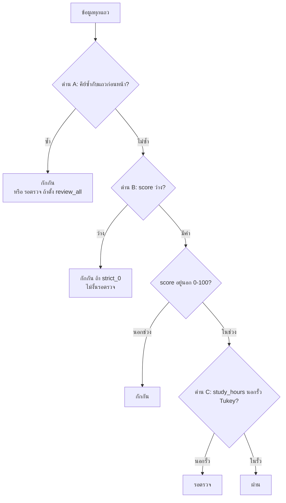

# 01. เอนจินคัดแยกคุณภาพข้อมูลแบบโต้ตอบ (Interactive Quality Gates)

> ผู้ใช้เห็นส่วนนี้ที่: Data Ingestion → Expectations & Alerts → Jobs & Pipelines → Workspace Exports · โค้ดหลัก: `api/app/api/whitebox.py:1173-1335`

## 1. มุมมองแบบ Black Box (ผู้ใช้เห็นอะไร)

ผู้ใช้อัปโหลดไฟล์ข้อมูลคะแนนนักศึกษาในหน้า Data Ingestion แล้วระบบแสดง

- การ์ดปัญหา 3 ใบ: "ค่าว่างและช่วงค่า", "เรคคอร์ดซ้ำ", "ค่าผิดปกติ"
- ตัวเลขสรุปว่าข้อมูลกี่แถว **ผ่าน** (Clean) กี่แถว **รอตรวจ** (Review) กี่แถว **ถูกกักกัน** (Quarantine) และคะแนนคุณภาพเป็นเปอร์เซ็นต์
- ไฟล์ 3 ไฟล์ให้ดาวน์โหลดในหน้า Workspace Exports

จากมุมผู้ใช้ ระบบ "รู้เอง" ว่าแถวไหนดีหรือเสีย บทนี้อธิบายว่ามันตัดสินอย่างไร

## 2. การทำงานภายใน (White Box)

ส่วนนี้ทำงานด้วยไลบรารี pandas ภายในโปรเซสของ API ไม่ได้ใช้ Spark (Spark เป็นเอนจินอีกชุดหนึ่ง อธิบายในบทที่ 02)

### 2.1 ขั้นที่ 0: รับไฟล์และคัดว่าไฟล์ไหนเข้าเอนจินได้

เมื่ออัปโหลด ระบบอ่านไฟล์ `.csv` หรือ `.xlsx` เป็นตาราง แล้วตรวจว่ามีคอลัมน์ครบ 4 ตัวที่เอนจินต้องใช้หรือไม่ คือ `student_id`, `course`, `score`, `study_hours` (`api/app/api/whitebox.py:59-65`)

- **ครบ** → บันทึกเป็นชุดข้อมูลหลัก เติมคอลัมน์ `dirty_row_id` (เลขแถว 1, 2, 3, …) แล้วส่งเข้าเอนจินคัดแยก (`api/app/api/whitebox.py:1446-1451`)
- **ไม่ครบ** → ทำแค่ "สำรวจข้อมูล" (profile) ไม่ส่งเข้าเอนจิน และหน้า Ingestion แจ้งว่าขาดคอลัมน์ใด

### 2.2 ขั้นที่ 1: สำรวจข้อมูล (Profiling)

ฟังก์ชัน `_compute_profile` (`api/app/api/whitebox.py:165-268`) สรุปสถิติทุกคอลัมน์ ผลนี้คือสิ่งที่การ์ดในหน้า Ingestion แสดง

- ต่อคอลัมน์: จำนวนค่าว่าง, สัดส่วนค่าว่าง, จำนวนค่าไม่ซ้ำ (`api/app/api/whitebox.py:174-177`)
- คอลัมน์ตัวเลข: ต่ำสุด, สูงสุด, ค่าเฉลี่ย, มัธยฐาน, ควอร์ไทล์ที่ 1 (Q1), ควอร์ไทล์ที่ 3 (Q3), IQR = Q3 − Q1 (`api/app/api/whitebox.py:204-210`)
- รั้วค่าผิดปกติสำหรับการ์ด: `Q1 − 1.5×IQR` และ `Q3 + 1.5×IQR` นับค่าที่อยู่นอกรั้วเป็น "ค่าผิดปกติ" (`api/app/api/whitebox.py:211-214`)
- แถวซ้ำ: นับแถวที่มี `student_id + course + semester` ซ้ำกับแถวก่อนหน้า โดยถือว่าแถวแรกเป็นตัวจริง (`api/app/api/whitebox.py:234-239`)

### 2.3 ขั้นที่ 2: ค่าตั้งต้นของกฎ

กฎทั้งหมดอ่านจากตัวแปร `_WORKFLOW_STATE` (`api/app/api/whitebox.py:1129-1149`) ซึ่งผู้ใช้ปรับได้ในหน้า Expectations & Alerts

| ค่า | ค่าตั้งต้น | ความหมาย |
|---|---|---|
| `min_score`, `max_score` | 0, 100 | ช่วงคะแนนที่ยอมรับ |
| `null_policy` | `strict_0` | ห้ามมีคะแนนว่างเลย (อีกแบบ `adaptive_5` ยอมให้ว่างได้ไม่เกิน `max_null_pct`) |
| `max_null_pct` | 5.0 | เพดานสัดส่วนค่าว่าง (%) สำหรับแบบ adaptive |
| `composite_key` | `student_id + course + semester` | คีย์ที่ห้ามซ้ำ |
| `dedup_strategy` | `keep_first_quarantine` | เก็บแถวแรก กักกันแถวซ้ำ (อีกแบบ `review_all` ส่งแถวซ้ำไปรอตรวจ) |
| `tukey_multiplier` | `3.0` | ตัวคูณ k ของรั้ว Tukey (เลือก 1.5 ได้) |
| `review_action` | `KEEP` | สิ่งที่ทำกับคิวรอตรวจทั้งคิว |

### 2.4 ขั้นที่ 3: ด่านคัดแยก 3 ด่าน (ตามลำดับที่โค้ดทำจริง)

ฟังก์ชันหลักคือ `_recompute_interactive_state` (`api/app/api/whitebox.py:1173-1335`) ทำงานใหม่ทุกครั้งที่ข้อมูลหรือกฎเปลี่ยน



**ด่าน A — คีย์ซ้ำ** (`api/app/api/whitebox.py:1217`)
หาแถวที่ `student_id + course + semester` เหมือนแถวที่อยู่ก่อนหน้าในไฟล์ แถวแรกผ่านด่านนี้ แถวที่มาทีหลังถูกทำเครื่องหมายว่าซ้ำ ถ้าตั้ง `review_all` แถวซ้ำไปคิวรอตรวจแทนการกักกัน (`api/app/api/whitebox.py:1244-1247`)

**ด่าน B — ค่าว่างและช่วงคะแนน** (`api/app/api/whitebox.py:1220-1223`) ตรวจเฉพาะแถวที่ไม่ซ้ำ
- `score` ว่าง: ถ้านโยบายเป็น `strict_0` → กักกันทันที ถ้าเป็นแบบ adaptive → ส่งไปรอตรวจ เว้นแต่สัดส่วนค่าว่างของทั้งไฟล์เกิน `max_null_pct` จึงกักกัน (`api/app/api/whitebox.py:1221`, `api/app/api/whitebox.py:1249-1252`)
- `score` น้อยกว่า `min_score` หรือมากกว่า `max_score` → กักกัน (`api/app/api/whitebox.py:1254-1256`)

**ด่าน C — ค่าผิดปกติของชั่วโมงเรียน (Tukey fence)** (`api/app/api/whitebox.py:1226-1238`) ตรวจเฉพาะแถวที่ผ่านด่าน A และ B แล้ว

```
Q1  = ควอร์ไทล์ที่ 25 ของ study_hours
Q3  = ควอร์ไทล์ที่ 75 ของ study_hours
IQR = Q3 − Q1
รั้วบน = Q3 + k × IQR        (k = 3.0 ตามค่าตั้งต้น หรือ 1.5)
รั้วล่าง = Q1 − k × IQR
ถ้า study_hours > รั้วบน หรือ < รั้วล่าง → รอตรวจ (ไม่กักกันทันที)
```

เหตุผลที่ส่งไป "รอตรวจ" แทนการกักกัน: ค่าที่สูงผิดปกติอาจเป็นค่าจริง (นักศึกษาขยันจริง) จึงให้คนตัดสิน (`api/app/api/whitebox.py:1258-1260`)

ข้อสำคัญ: Q1 และ Q3 คำนวณจาก `study_hours` ของ**ทุกแถว** รวมแถวที่ตกด่าน A หรือ B ไปแล้ว (`api/app/api/whitebox.py:1226-1228`) และใช้วิธีหาควอร์ไทล์แบบ linear interpolation ซึ่งเป็นค่าตั้งต้นของ pandas

### 2.5 ขั้นที่ 4: คนตัดสินคิวรอตรวจ

- `review_action` ใช้กับทั้งคิว: `KEEP` ปล่อยไว้ในคิว, `APPROVE` ย้ายทุกแถวในคิวไปเป็น "ผ่าน", `REJECT` ย้ายไปกักกัน (`api/app/api/whitebox.py:1263-1269`)
- ตัดสินรายแถวได้ด้วย `row_decisions` และคำตัดสินรายแถวจะทับคำตัดสินทั้งคิว (`api/app/api/whitebox.py:1272-1285`)
- แก้ค่า `score` หรือ `study_hours` รายแถวได้ด้วย `row_edits` ก่อนเริ่มตรวจ (`api/app/api/whitebox.py:1186-1197`)

### 2.6 ขั้นที่ 5: ผลลัพธ์

- แยกข้อมูลเป็น 3 ไฟล์ `clean_dataset_run.csv`, `review_queue_run.csv`, `quarantine_lake_run.csv` ซึ่งหน้า Export ให้ดาวน์โหลด (`api/app/api/whitebox.py:1292-1297`)
- คะแนนคุณภาพ = แถวที่ผ่าน ÷ แถวทั้งหมด × 100 ปัดทศนิยม 1 ตำแหน่ง (`api/app/api/whitebox.py:1311`)
- แต่ละแถวมีคอลัมน์ `whitebox_rule_applied` บอกว่ากฎข้อไหนตัดสินแถวนั้น เช่น `Value Range Check [0.0, 100.0]` (`api/app/api/whitebox.py:1240-1260`) นี่คือเหตุผลที่ระบบเรียกตัวเองว่า "White-Box": ทุกแถวอธิบายได้ว่าทำไมถึงถูกคัด

## 3. ตัวอย่างการคำนวณจริง

ข้อมูล: `dirty_course_scores_demo.csv` 250 แถว (สร้างด้วย `docs/whitebox-report/tools/gen_demo_dataset.py:1`) อัปโหลดเข้าระบบจริงแล้วดึงผลจาก API หลักฐาน: `evidence/01-profile.json`, `evidence/01-state.json`, `evidence/01-example-rows.txt`

**ตัวอย่างแถวจริงที่ตกแต่ละด่าน** (จาก `evidence/01-example-rows.txt`)

| ด่าน | แถว | ค่า | ผล |
|---|---|---|---|
| A ซ้ำ | 99 และ 135 | S3026 / CS101 / 2025-1 ทั้งคู่ | แถว 99 ผ่านด่าน A, แถว 135 ถูกกักกัน |
| B ว่าง | 2 | S4004, score ว่าง | กักกัน (นโยบาย `strict_0`) |
| B ต่ำเกิน | 7 | S4113, score = −26.3 | กักกัน (ต่ำกว่า 0) |
| B สูงเกิน | 25 | S4104, score = 117.3 | กักกัน (สูงกว่า 100) |
| C ผิดปกติ | 3 | S4305, study_hours = 40.4 | รอตรวจ |

**คำนวณรั้ว Tukey** (ค่า Q1, Q3 จาก `evidence/01-state.json`)

```
Q1 = 3.8, Q3 = 7.1
IQR = 7.1 − 3.8 = 3.3

รั้วของด่าน C (k = 3.0):  รั้วบน = 7.1 + 3.0 × 3.3 = 17.0   รั้วล่าง = 3.8 − 9.9 = −6.1
รั้วของการ์ด Ingestion (k = 1.5):  รั้วบน = 7.1 + 1.5 × 3.3 = 12.05
```

ระบบรายงาน `upper_fence = 17.0` ตรงกับที่คำนวณมือ `study_hours` ของแถวปกติอยู่ระหว่าง 2.0–8.0 และค่าผิดปกติต่ำสุดคือ 31.9 จึงเกินทั้งรั้ว 17.0 และ 12.05 ได้ 12 แถวเท่ากันทั้งสองแบบ

**นับผลรวม** (จาก `evidence/01-state.json`)

```
ด่าน A  ซ้ำ                    13 แถว → กักกัน
ด่าน B  score ว่าง             12 แถว → กักกัน
        score นอก 0–100         13 แถว → กักกัน
ด่าน C  study_hours นอกรั้ว     12 แถว → รอตรวจ
ผ่านทุกด่าน                    200 แถว

กักกัน  = 13 + 12 + 13 = 38
รอตรวจ = 12
ผ่าน   = 250 − 38 − 12 = 200
คะแนนคุณภาพ = 200 ÷ 250 × 100 = 80.0%
```

ตรงกับ `clean_rows 200`, `review_rows 12`, `quarantine_rows 38`, `quality_score_pct 80.0` ที่ระบบคืนมา

**ถ้าเปลี่ยนนโยบายค่าว่างเป็น adaptive:** สัดส่วนค่าว่างของไฟล์นี้ = 12 ÷ 250 = 4.8% (`evidence/01-profile.json`) ซึ่งไม่เกิน 5% ดังนั้น 12 แถวที่คะแนนว่างจะย้ายจาก "กักกัน" ไป "รอตรวจ" (กักกันเหลือ 26, รอตรวจเป็น 24)

## 4. สิ่งที่เป็นค่าคงที่ ข้อจำกัด และข้อสังเกต

- **ชื่อคอลัมน์ตายตัว:** กฎทั้ง 3 ด่านใช้ชื่อ `score` และ `study_hours` ตรงๆ ในโค้ด (`api/app/api/whitebox.py:1220-1238`) ไฟล์ที่ใช้ชื่ออื่นตรวจอัตโนมัติไม่ได้ ระบบจึงปฏิเสธไม่ส่งเข้าเอนจิน (ขั้นที่ 0)
- **รั้วสองแบบ:** การ์ด "ค่าผิดปกติ" ในหน้า Ingestion ใช้ k = 1.5 (`api/app/api/whitebox.py:211-212`) แต่ด่านคัดแยกใช้ k = 3.0 เป็นค่าตั้งต้น (`api/app/api/whitebox.py:1208-1209`) กับข้อมูลตัวอย่างได้ 12 เท่ากัน แต่ข้อมูลอื่นอาจได้ไม่เท่ากัน ผู้ใช้อาจสงสัยว่าทำไมการ์ดบอก N แถวแต่คิวรอตรวจมีไม่ถึง N
- **ชื่อด่านในโค้ดสลับกับลำดับจริง:** คอมเมนต์เรียกการตรวจซ้ำว่า "Gate 2" และค่าว่าง/ช่วงว่า "Gate 1" (`api/app/api/whitebox.py:1216-1219`) แต่โค้ดตรวจซ้ำก่อน แล้วจึงตรวจค่าว่าง/ช่วงเฉพาะแถวที่ไม่ซ้ำ ตัวนับ `gate1_passed`/`gate2_passed` (`api/app/api/whitebox.py:1302-1305`) นับตามชื่อ ไม่ใช่ตามลำดับจริง ผลรวมสุดท้ายยังถูกต้อง
- **Q1/Q3 รวมแถวเสีย:** รั้ว Tukey คำนวณจากทุกแถว รวมแถวที่ตกด่านอื่น ถ้าแถวเสียมีสัดส่วนมาก รั้วจะเลื่อน
- **รั้วกำหนดเอง:** ค่า `custom_upper_fence` ถูกเขียนทับด้วยรั้วที่คำนวณได้ทุกครั้งที่ไม่ได้อยู่ในโหมด custom (`api/app/api/whitebox.py:1233-1234`) และรั้วล่างใช้ k ตามปกติแม้อยู่ในโหมด custom (`api/app/api/whitebox.py:1235`)
- **สถานะอยู่ในหน่วยความจำ:** กฎที่ตั้ง คำตัดสินของคน และข้อมูลที่อัปโหลดอยู่ในตัวแปรของโปรเซส (`api/app/api/whitebox.py:1129`) และไฟล์ใน container เมื่อ API รีสตาร์ต ค่าที่ตั้งและคำตัดสินหายทั้งหมด
- **คำอธิบายในโค้ดเก่า:** docstring ยังบอกว่าทำงานกับ "10,100 rows of dirty_dataset.csv" (`api/app/api/whitebox.py:1175`) แต่จริงๆ ทำงานกับไฟล์ที่อัปโหลดล่าสุด

## 5. คำถามที่กรรมการอาจถาม

1. **ถาม:** ทำไมค่าผิดปกติไปรอตรวจ แต่คะแนนนอกช่วงถูกกักกันทันที?
   **ตอบ:** คะแนนติดลบหรือเกิน 100 เป็นไปไม่ได้ตามนิยาม จึงผิดแน่นอน แต่ชั่วโมงเรียนสูงผิดปกติอาจเป็นค่าจริง ระบบจึงให้คนเป็นผู้ตัดสิน
2. **ถาม:** ทำไมใช้ Tukey fence แทนค่าเฉลี่ย ± 3 SD?
   **ตอบ:** ค่าเฉลี่ยและ SD ถูกดึงโดยค่าผิดปกติเอง แต่ Q1/Q3 แทบไม่ขยับเมื่อมีค่าสุดโต่งไม่กี่ค่า รั้วจึงไม่เลื่อนตามค่าผิดปกติ
3. **ถาม:** ทำไมค่าตั้งต้นใช้ k = 3.0 ไม่ใช่ 1.5 แบบตำรา?
   **ตอบ:** k = 1.5 จับ "ค่าที่น่าสงสัย" ส่วน k = 3.0 จับเฉพาะ "ค่าที่ผิดปกติชัดเจน" ระบบเลือกแบบหลวมไว้ก่อนเพื่อไม่ให้คิวรอตรวจล้น ผู้ใช้สลับเป็น 1.5 ได้
4. **ถาม:** ถ้าแถวซ้ำ ระบบรู้ได้อย่างไรว่าแถวไหนถูก?
   **ตอบ:** ไม่รู้ ระบบใช้กติกา "เก็บแถวแรกที่พบ" ถ้าต้องการให้คนเลือก ให้ตั้ง `review_all` แถวซ้ำจะไปคิวรอตรวจแทน
5. **ถาม:** ผลการคัดแยกตรวจสอบย้อนหลังได้ไหม?
   **ตอบ:** ได้ ทุกแถวในไฟล์ผลลัพธ์มีคอลัมน์ `whitebox_error_type` และ `whitebox_rule_applied` บอกกฎที่ตัดสิน
