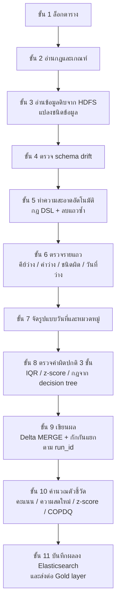

# 02. เอนจินตรวจคุณภาพข้อมูลแบบรอบงาน (Spark Batch Quality Engine)

> ผู้ใช้เห็นส่วนนี้ที่: Dashboards, Query & Metrics, Audit Trail (ตัวเลขคะแนนคุณภาพ, จำนวนกักกัน, ประวัติรอบการทำงาน) · โค้ดหลัก: `spark/spark_quality_engine.py:1684-2893`

## 1. มุมมองแบบ Black Box (ผู้ใช้เห็นอะไร)

ข้อมูลจากแหล่งต่างๆ (ไฟล์, ฐานข้อมูล, API, Kafka) ถูกนำเข้าเป็นรอบ (run) แต่ละรอบผู้ใช้เห็น

- คะแนนคุณภาพ (quality score) ของตารางในรอบนั้น
- จำนวนแถวที่สะอาดและถูกกักกัน พร้อมเหตุผลการกักกัน
- สถานะรอบ `success` หรือ `warnings` และการแจ้งเตือนเมื่อคุณภาพต่ำ

บทนี้อธิบายว่าในหนึ่งรอบ เอนจินทำอะไรบ้าง ตามลำดับ

## 2. การทำงานภายใน (White Box)

เอนจินนี้เป็นคนละตัวกับบทที่ 01 ตัวนี้ใช้ Apache Spark อ่านข้อมูลดิบจาก HDFS ทำงานทีละตาราง และเขียนผลทุกรอบลง Elasticsearch ดัชนี `sdoqap_quality_runs` (`spark/spark_quality_engine.py:2838`) ซึ่งหน้า Dashboards และ Query & Metrics อ่านไปแสดง



### ขั้น 1: ล็อกตาราง

ก่อนเริ่ม Spark ระบบสร้างเอกสารล็อกในดัชนี `sdoqap_run_locks` แบบ "สร้างได้ครั้งเดียว" (`op_type=create`) ถ้ามีรอบอื่นของตารางเดียวกันกำลังทำงานอยู่ รอบนี้จะหยุดทันที ล็อกหมดอายุใน 15 นาที (`spark/spark_quality_engine.py:148-175`, `spark/spark_quality_engine.py:1698-1701`) ป้องกันไม่ให้สองรอบเขียนตารางเดียวกันพร้อมกัน

ระบบเลือก "ทางด่วน" (fast track) ถ้าข้อมูลดิบเล็กกว่า 50 MB ซึ่งแค่ลดจำนวน partition ของ Spark จาก 10 เหลือ 2 (`spark/spark_quality_engine.py:1576-1597`, `spark/spark_quality_engine.py:1705-1709`)

### ขั้น 2: อ่านกฎและเกณฑ์

กฎของแต่ละตารางอ่านจาก Elasticsearch ดัชนี `sdoqap_rules_registry` ถ้าอ่านไม่ได้ใช้ไฟล์ `rules_config.json` แทน (`spark/spark_quality_engine.py:1501-1520`) จากนั้นปรับเกณฑ์แบบ adaptive (อธิบายในบทที่ 04) (`spark/spark_quality_engine.py:1724-1731`)

- เกณฑ์คะแนนคุณภาพ `quality_score_threshold` ค่าสำรอง 90 (`spark/spark_quality_engine.py:1733`)
- เกณฑ์ความสดใหม่ `freshness_threshold_hours` ค่าสำรอง 48 ชั่วโมง (`spark/spark_quality_engine.py:1734`)

### ขั้น 3: อ่านข้อมูลดิบและแปลงชนิดข้อมูล

อ่านไฟล์ CSV ทั้งโฟลเดอร์ `/data/raw/<ตาราง>` บน HDFS เป็นข้อความทุกคอลัมน์ (`spark/spark_quality_engine.py:1736-1762`) แล้ว

1. ป้องกันไฟล์ว่าง และเตือนถ้าคอลัมน์ข้อความยาวเกิน 150 ตัวอักษรเฉลี่ย (CSV แบบนี้มักแถวเลื่อน) (`spark/spark_quality_engine.py:1764-1792`)
2. จับคู่ชื่อคอลัมน์ที่เขียนต่างกันเล็กน้อยให้ตรงกับ schema เช่นตัวพิมพ์หรือขีดล่าง (`spark/spark_quality_engine.py:1808-1816`)
3. แปลงชนิดตาม schema (`spark/spark_quality_engine.py:1818-1874`)
   - ตัวเลขจำนวนเต็ม: ลบทุกตัวอักษรที่ไม่ใช่ตัวเลขหรือเครื่องหมายลบ แล้วแปลง
   - ทศนิยม: ลบทุกตัวอักษรที่ไม่ใช่ตัวเลข จุด หรือเครื่องหมายลบ แล้วแปลง
   - ถ้าคอลัมน์จำนวนเต็มมีค่าที่มีทศนิยมไม่ใช่ศูนย์ (เช่น 12.5) จะเลื่อนทั้งคอลัมน์เป็นทศนิยมก่อน (`spark/spark_quality_engine.py:1821-1843`)
   - วันเวลา: ลองรูปแบบ 6 แบบ และรองรับเลข epoch

### ขั้น 4: ตรวจ schema drift

เทียบคอลัมน์ที่ได้จริงกับ schema ที่ลงทะเบียนไว้ (`spark/spark_quality_engine.py:1891-1934`)

| สิ่งที่พบ | สิ่งที่ระบบทำ | น้ำหนักความรุนแรง |
|---|---|---|
| คอลัมน์หายไป | เติมคอลัมน์นั้นด้วยค่าว่าง และแจ้งเตือนระดับวิกฤต | 5 |
| ชนิดข้อมูลไม่ตรง | แปลงเป็นข้อความ และแจ้งเตือนระดับวิกฤต | 5 |
| คอลัมน์ใหม่ | เพิ่มเข้า schema ชั่วคราวในรอบนี้ | 1 |

ผลรวมน้ำหนักคือ `drift_severity` บันทึกในดัชนี `sdoqap_schema_drifts` (`spark/spark_quality_engine.py:1938-1956`) และใช้ต่อในสูตรความเสียหายทางการเงิน (บทที่ 07) การตัดสินว่าจะอัปเดต schema อัตโนมัติหรือรอคนอนุมัติ อธิบายในบทที่ 09

### ขั้น 5: ทำความสะอาดอัตโนมัติ (auto-clean)

ถ้ากฎ `auto_clean` เปิดอยู่ (ค่าตั้งต้นคือเปิด) (`spark/spark_quality_engine.py:2031`)

1. ใช้กฎแก้ข้อมูลแบบ DSL ที่ตั้งไว้ต่อตาราง เช่น ตัดช่องว่าง แทนค่า จัดหมวดหมู่ (บทที่ 03) (`spark/spark_quality_engine.py:2037`)
2. ลบแถวที่คีย์หลักซ้ำ ถ้ามีคอลัมน์วันที่ ตั้งใจเก็บแถวที่ใหม่ที่สุด (`spark/spark_quality_engine.py:2039-2060`)

โค้ดตั้งใจ**ไม่สร้างคีย์หรือวันที่ปลอม**ให้แถวที่ไม่มีค่าเหล่านี้ (`spark/spark_quality_engine.py:2028-2030`) แถวพวกนั้นไปถูกกักกันในขั้นถัดไปแทน

### ขั้น 6: ตรวจรายแถว

ทุกแถวได้ธง `is_invalid` และข้อความเหตุผล `reject_reason` ที่ต่อกันด้วย `; ` ถ้าผิดหลายข้อ (`spark/spark_quality_engine.py:2062-2121`)

| เงื่อนไข | เหตุผลที่บันทึก |
|---|---|
| คีย์หลักว่าง | `missing_primary_key` |
| คอลัมน์ใดใน schema ว่าง | `null_value_in_<คอลัมน์>` |
| ค่าที่ควรเป็นตัวเลขแปลงไม่ได้ | `invalid_type_<คอลัมน์>` |
| คอลัมน์วันที่ว่าง | `missing_date` |

แถวที่ผ่านทุกข้อไปต่อ แถวที่ไม่ผ่านไปรวมกลุ่มกักกัน (`spark/spark_quality_engine.py:2123-2125`) จากนั้นตรวจคีย์ซ้ำอีกรอบในแถวที่ผ่าน แถวซ้ำที่ถูกตัดออกในรอบนี้ได้เหตุผล `duplicate_records` (`spark/spark_quality_engine.py:2127-2137`, `spark/spark_quality_engine.py:2226-2229`)

### ขั้น 7: จัดรูปแบบวันที่และหมวดหมู่

- คอลัมน์ชื่อ `วันที่`, `date` หรือ `Date` ถูกแปลงเป็น `YYYY-MM-DD` ถ้าปีเกิน 2500 ถือเป็นพุทธศักราชและลบ 543 (`spark/spark_quality_engine.py:2139-2185`)
- คอลัมน์ที่มีกฎ `standardization_rules` ใน schema registry ถูกจัดหมวดด้วยการหาคำสำคัญในข้อความ (`spark/spark_quality_engine.py:2187-2224`) รายละเอียดในบทที่ 03

### ขั้น 8: ตรวจค่าผิดปกติ 3 ชั้น (เฉพาะแถวที่ผ่านขั้น 6)

1. **IQR** ต่อคอลัมน์ตัวเลข ตัวคูณค่าตั้งต้น 1.5 ทำงานเมื่อกฎ `value_range.mode` เป็น `auto` หรือ `adaptive` (`spark/spark_quality_engine.py:2231-2264`)
2. **z-score** ต่อคอลัมน์ตัวเลข เกณฑ์ 3.0 ทำงานทุกรอบ (`spark/spark_quality_engine.py:2266-2289`)
3. **กฎจาก decision tree** ที่คนอนุมัติแล้ว (อยู่ในกฎ `induced`) ถูกรวมเป็นเงื่อนไข SQL เดียว แถวที่เข้าเงื่อนไขได้เหตุผล `induced_tree_rule_match` (`spark/spark_quality_engine.py:2291-2326`)

สูตรของชั้น 1 และ 2 อธิบายในบทที่ 04 ที่มาของกฎชั้น 3 อธิบายในบทที่ 05

แถวที่ถูกจับในขั้นนี้**ถูกกักกัน** (ต่างจากบทที่ 01 ที่ส่งค่าผิดปกติไปรอตรวจ)

### ขั้น 9: เขียนผล

- รวมทุกแถวที่ถูกกักกัน ติดป้าย `run_id` และเวลา (`spark/spark_quality_engine.py:2328-2352`)
- ตัดคอลัมน์ที่ไม่อยู่ใน schema ออกจากข้อมูลสะอาด (`spark/spark_quality_engine.py:2364-2381`)
- ข้อมูลสะอาดเขียนเข้าตาราง Delta Lake ที่ `/data/active/<ตาราง>` ด้วยคำสั่ง MERGE ตามคีย์หลัก: คีย์เดิมอัปเดต คีย์ใหม่เพิ่ม (`spark/spark_quality_engine.py:2383-2406`) ถ้า MERGE ล้มเหลว รอบนั้นหยุดโดยไม่แตะตารางเดิม (`spark/spark_quality_engine.py:2407-2423`)
- ข้อมูลกักกันต่อท้ายที่ `/data/quarantine/<ตาราง>` แบ่งโฟลเดอร์ตาม `run_id` ย้อนดูได้ว่ารอบไหนกักอะไร (`spark/spark_quality_engine.py:2435-2436`)

### ขั้น 10: คำนวณตัวชี้วัด

**คะแนนคุณภาพ** (`spark/spark_quality_engine.py:2567-2574`)

```
total_records  = แถวสะอาด + แถวกักกัน           (spark/spark_quality_engine.py:2358-2360)
quality_score  = แถวสะอาด ÷ total_records × 100
ถ้า total_records = 0 → quality_score = 0  (ไม่ให้ไฟล์ว่างดูเหมือนคุณภาพดี)
ถ้า quality_score < เกณฑ์ → แจ้งเตือนผ่าน n8n
```

**z-score ของอัตรากักกัน** ตรวจว่ารอบนี้ผิดปกติเทียบกับประวัติหรือไม่ (`spark/spark_quality_engine.py:2584-2610`)

```
อัตรากักกัน r   = แถวกักกัน ÷ total_records
ประวัติ          = อัตรากักกันของ 15 รอบล่าสุดของตารางนี้   (spark/spark_quality_engine.py:1630-1667)
ต้องมีประวัติอย่างน้อย 3 รอบ
ค่าเฉลี่ย μ, ส่วนเบี่ยงเบน σ (หารด้วย n), σ ต่ำสุด 0.05
ถ้า |r − μ| < 0.02 → z = 0  (ไม่สนใจการเปลี่ยนเล็กน้อย)
ไม่เช่นนั้น z = |r − μ| ÷ σ
z > 3.0 → รอบนี้ "ผิดปกติ" แจ้งเตือนระดับวิกฤต
```

**ความสดใหม่ (freshness lag)** = เวลาปัจจุบัน − วันที่ล่าสุดในข้อมูลของรอบนี้ หน่วยชั่วโมง (`spark/spark_quality_engine.py:2532-2565`)

**คะแนนผลกระทบเชิงปฏิบัติการ (operational impact)** ให้น้ำหนักแต่ละแถวที่ถูกกักกันตามเหตุผล แล้วเอาน้ำหนักสูงสุดของแถวนั้น (`spark/spark_quality_engine.py:2762-2801`)

```
เหตุผลเกี่ยวกับคีย์หลักหรือแถวซ้ำ → น้ำหนักของคีย์หลัก (ค่าตั้งต้น 1.0)
เหตุผลเกี่ยวกับวันที่             → 0.5
เหตุผลเกี่ยวกับคอลัมน์ที่ตั้งน้ำหนักไว้ → น้ำหนักนั้น
เหตุผลอื่นใด                        → อย่างน้อย 0.2
operational_impact_score = ผลรวมน้ำหนัก ÷ total_records × 100
```

**มูลค่าข้อมูลที่ถูกกักกัน** หาคอลัมน์การเงินคอลัมน์แรกที่พบจากรายชื่อ `total_sales, sales, revenue, profit, price, amount, total` แล้วรวมค่าในแถวที่ถูกกักกัน (`spark/spark_quality_engine.py:2513-2530`) ใช้ในบทที่ 07

**สรุปเหตุผลการกักกัน** แยกข้อความเหตุผลที่ต่อกันด้วย `; ` แล้วนับแต่ละเหตุผล (`spark/spark_quality_engine.py:2489-2511`)

### ขั้น 11: บันทึกผลและส่งต่อ

- เขียนเอกสารผลรอบลง `sdoqap_quality_runs` (`spark/spark_quality_engine.py:2803-2838`), ข้อมูล lineage ลง `sdoqap_lineage_runs` และสถานะรอบลง `sdoqap_pipeline_runs`: `success` ถ้าคะแนน ≥ เกณฑ์ ไม่งั้น `warnings` (`spark/spark_quality_engine.py:2840-2855`)
- ถ้าคะแนนผ่านเกณฑ์ สั่งสร้าง Gold layer ใหม่ทำงานเบื้องหลัง (`spark/spark_quality_engine.py:2859-2870`)
- ลบไฟล์ดิบบน HDFS เฉพาะเมื่อไม่มีแถวถูกกักกันเลย ถ้ามี เก็บไฟล์ดิบไว้ให้แก้ไขภายหลัง (`spark/spark_quality_engine.py:2872-2889`)
- ปลดล็อก (`spark/spark_quality_engine.py:2891-2893`)

ถ้าเปิดใช้ AI advisor ในกฎ ระหว่างขั้น 10 จะมีการวิเคราะห์เพิ่ม (สำรวจการกระจายข้อมูล, ส่งตัวอย่างแถวที่ถูกกักกันให้วิเคราะห์, สร้างกฎด้วย decision tree) ซึ่งทุกข้อเสนอต้องรอคนอนุมัติ (`spark/spark_quality_engine.py:2612-2759`) รายละเอียดในบทที่ 04 และ 05

## 3. ตัวอย่างการคำนวณจริง

หลักฐาน: `evidence/02-latest-quality-run.json` คือเอกสารผลรอบล่าสุดที่มีการกักกัน ดึงจาก Elasticsearch ของระบบที่รันอยู่ (ตาราง `grocery_sales`, รอบ `run_20260924_053430_142489`)

| ช่องในเอกสาร | ค่า |
|---|---|
| `total_records` | 561 |
| `clean_records` | 557 |
| `quarantined_records` | 4 |
| `quality_score` | 99.28698752228165 |
| `quarantine_breakdown` | `{"null_value_in_ยอดขายรวม": 4}` |
| `remediation_logs` | `["resolved_1_duplicates"]` |
| `operational_impact_score` | 0.14260249554367202 |
| `effective_quality_threshold` | 90.0 |
| `value_range_profile.ราคาต่อหน่วย` | q1 25, q3 50, iqr 25, ขอบล่าง −12.5, ขอบบน 87.5 |

**คำนวณซ้ำด้วยมือ**

```
total_records = 557 + 4 = 561                                   ✓
quality_score = 557 ÷ 561 × 100 = 99.2870%                      ✓ (ผ่านเกณฑ์ 90 → สถานะ success)
อัตรากักกัน   = 4 ÷ 561 = 0.713%

operational impact: ทั้ง 4 แถวถูกกักเพราะ null_value_in_ยอดขายรวม
  ไม่เกี่ยวกับคีย์หรือวันที่ และตารางนี้ไม่ได้ตั้งน้ำหนักคอลัมน์ → น้ำหนักแถวละ 0.2
  = (4 × 0.2) ÷ 561 × 100 = 0.8 ÷ 561 × 100 = 0.14260%          ✓

รั้ว IQR ของ ราคาต่อหน่วย (ตัวคูณ 1.5):
  ขอบล่าง = 25 − 1.5 × 25 = −12.5                               ✓
  ขอบบน  = 50 + 1.5 × 25 = 87.5                                 ✓
```

**แถวที่หายไป:** บันทึก `resolved_1_duplicates` บอกว่าขั้น 5 ลบแถวซ้ำไป 1 แถว แถวนั้นไม่อยู่ทั้งในแถวสะอาดและแถวกักกัน ข้อมูลเข้าจริงจึงมี 561 + 1 = 562 แถว แต่ตัวหารของคะแนนคุณภาพคือ 561

## 4. สิ่งที่เป็นค่าคงที่ ข้อจำกัด และข้อสังเกต

- **แถวซ้ำที่ถูกลบในขั้น auto-clean ไม่ถูกนับ:** ขั้น 5 ลบแถวซ้ำทิ้งโดยไม่ส่งไปกักกัน (`spark/spark_quality_engine.py:2051-2060`) และ `total_records` นับแค่แถวสะอาดกับแถวกักกัน (`spark/spark_quality_engine.py:2358-2360`) แถวซ้ำจึงไม่อยู่ในคะแนนคุณภาพและไม่มีสำเนาให้ตรวจ ตัวอย่างจริงในข้อ 3: รับเข้า 562 แถว รายงาน 561 แถว เหตุผล `duplicate_records` จะเกิดเฉพาะเมื่อปิด `auto_clean`
- **"เก็บแถวใหม่สุด" ไม่รับประกัน:** โค้ดเรียง `orderBy(date desc)` แล้วตามด้วย `dropDuplicates` (`spark/spark_quality_engine.py:2048-2051`, `spark/spark_quality_engine.py:2132-2136`) แต่ใน Spark ที่ทำงานแบบกระจาย `dropDuplicates` ไม่รับประกันว่าจะเก็บแถวแรกตามลำดับที่เรียงไว้
- **บั๊กแปลงตัวเลขจำนวนเต็ม:** ค่า `12.00` ในคอลัมน์ `IntegerType` กลายเป็น `1200` เพราะนิพจน์ลบจุดทศนิยมก่อนแปลง (`spark/spark_quality_engine.py:1845-1849`) ทดสอบกับ Spark จริงแล้ว ดู `evidence/02-numeric-cast-check.txt` ค่าอย่าง `12 units` หรือ `1,234` ก็ถูกแปลงเป็นตัวเลขเงียบๆ แทนที่จะถูกรายงานว่าชนิดผิด
- **คอลัมน์ที่หายไปทำให้ทุกแถวถูกกักกัน:** ขั้น 4 เติมค่าว่างให้คอลัมน์ที่หายไป (`spark/spark_quality_engine.py:1897-1910`) แล้วขั้น 6 กักกันแถวที่มีค่าว่างในคอลัมน์ใน schema (`spark/spark_quality_engine.py:2075-2088`) ผลคือทุกแถวของรอบนั้นถูกกักกันด้วยเหตุผล `null_value_in_<คอลัมน์ที่หาย>`
- **ค่าตายตัวในโค้ด:** ตารางที่ข้ามการตรวจความสดใหม่ระบุชื่อตรงๆ (`global_ecommerce_sales` และชื่อที่ลงท้าย `_historical`) (`spark/spark_quality_engine.py:2535`); รายชื่อคอลัมน์การเงิน (`spark/spark_quality_engine.py:2517`); รายชื่อคอลัมน์หมวดหมู่สำหรับกราฟการกระจาย (`spark/spark_quality_engine.py:2449`); ชื่อคอลัมน์วันที่ที่จัดรูปแบบ (`spark/spark_quality_engine.py:2141`)
- **จัดรูปแบบวันที่เดาได้ผิด:** วันที่แบบ `05/07/2026` ถือเป็นวัน/เดือน/ปีเสมอ ชื่อเดือนภาษาอังกฤษที่ไม่รู้จักถูกตีเป็นมกราคม และค่าที่แปลงไม่ได้ถูกคืนเป็นข้อความเดิมโดยไม่ถูกกักกัน (`spark/spark_quality_engine.py:2153-2181`)
- **ยังไม่ได้ทำ:** การเรียนรู้ค่าความทนทานต่อค่าว่าง (`null_checks` แบบ adaptive) เขียนไว้ในคอมเมนต์ว่ายังไม่มีโค้ดใช้งาน ค่าในไฟล์กฎส่วนนี้เป็นแค่ข้อมูลประกอบ (`spark/spark_quality_engine.py:1717-1723`)
- **ตารางที่ยังไม่มี schema ถูกเดาให้อัตโนมัติ:** ระบบอ่านข้อมูลดิบแล้วเดาชนิดคอลัมน์ (คอลัมน์ที่มีเลขศูนย์นำหน้าเช่น `01234` ถูกเก็บเป็นข้อความเพื่อไม่ให้ศูนย์หาย) เลือกคีย์หลักจากคอลัมน์ชื่อ `id` หรือชื่อที่มีคำว่า `id` ถ้าไม่มีใช้ค่าแฮชของทั้งแถว (`row_hash`) และเลือกคอลัมน์วันที่จากชื่อ แล้วบันทึกลง registry (`spark/spark_quality_engine.py:2917-3016`) การเดาจากชื่ออาจเลือกผิด เช่นคอลัมน์ `paid` มีตัวอักษร `id` อยู่ในชื่อ
- **ต้องมีโครงสร้างพื้นฐานครบ:** เอนจินนี้ต้องมีข้อมูลดิบบน HDFS และ Elasticsearch ทำงานอยู่

## 5. คำถามที่กรรมการอาจถาม

1. **ถาม:** ทำไมมีเอนจินสองชุด?
   **ตอบ:** ชุดในบทที่ 01 ใช้ตอนผู้ใช้ทดลองตั้งกฎกับไฟล์เดียวแบบโต้ตอบได้ทันที ชุดนี้ใช้กับข้อมูลจริงที่เข้ามาเป็นรอบและอาจมีขนาดใหญ่ จึงใช้ Spark และเก็บประวัติทุกรอบ
2. **ถาม:** คะแนนคุณภาพ 99.29% หมายความว่าอะไรแน่?
   **ตอบ:** สัดส่วนแถวที่ผ่านการตรวจทุกข้อ ต่อแถวที่ถูกประมวลผลในรอบนั้น ไม่รวมแถวซ้ำที่ถูกลบในขั้นทำความสะอาด (ดูข้อ 4)
3. **ถาม:** ข้อมูลเสียหายไปไหน?
   **ตอบ:** ไม่ถูกลบ ถูกเก็บในโซนกักกันแยกโฟลเดอร์ตามรอบ พร้อมเหตุผลทุกแถว ยกเว้นแถวซ้ำที่ auto-clean ลบไป
4. **ถาม:** ถ้ารอบนี้พังกลางทาง ข้อมูลเดิมเสียไหม?
   **ตอบ:** ไม่ ถ้า MERGE ล้มเหลว รอบหยุดโดยไม่แตะตาราง active และไฟล์ดิบยังอยู่ให้รันใหม่ได้ ล็อกป้องกันไม่ให้สองรอบชนกัน
5. **ถาม:** z-score ของอัตรากักกันต่างจากคะแนนคุณภาพอย่างไร?
   **ตอบ:** คะแนนคุณภาพดูรอบเดียว z-score ดูว่ารอบนี้ต่างจากปกติของตารางนี้มากแค่ไหน ตารางที่ปกติกักกัน 20% อาจไม่ผิดปกติ แต่ตารางที่ปกติกักกัน 0% แล้วกระโดดเป็น 20% ถือว่าผิดปกติ
