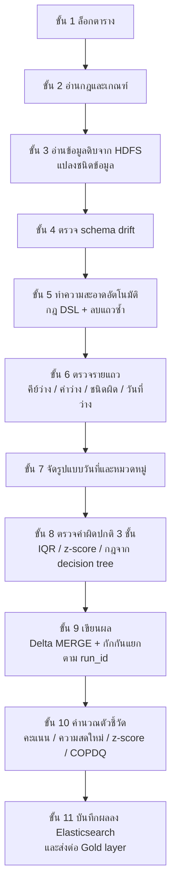

# 02. เอนจินตรวจคุณภาพข้อมูลแบบรอบงาน (Spark Batch Quality Engine)

> ผู้ใช้เห็นส่วนนี้ที่: Dashboards, Query & Metrics, Jobs & Pipelines, Catalog, Audit Trail (คะแนนคุณภาพ, จำนวนกักกัน, ประวัติรอบการทำงาน, การเปลี่ยนโครงสร้างตาราง) · โค้ดหลัก: `spark/spark_quality_engine.py:1684-2893`

## 1. คำตอบ 30 วินาที

เมื่อข้อมูลจริงถูกนำเข้าเป็นไฟล์ CSV บน HDFS ([บทที่ 11](11-ingestion-and-job-triggering.md) อธิบายว่าใครสั่งให้รอบนี้เริ่ม) เอนจินนี้ใช้ **Apache Spark** (เครื่องมือประมวลผลข้อมูลขนาดใหญ่แบบกระจายไปหลายเครื่อง ต่างจากบทที่ 01 ที่ใช้ pandas ตัวเดียวในหน่วยความจำ) อ่านข้อมูลทั้งตาราง แปลงชนิด ทำความสะอาด ตรวจทีละแถวและตรวจค่าผิดปกติ 3 ชั้น แล้วเขียนผลลง **Delta Lake** (รูปแบบไฟล์บน HDFS ที่เพิ่มความสามารถอัปเดตแบบ MERGE และธุรกรรมระดับแถวให้ Spark) พร้อมบันทึกตัวชี้วัดทุกตัวลง Elasticsearch ถาวร (`spark/spark_quality_engine.py:1684-2893`) ผลลัพธ์ที่ผู้ใช้เห็นคือคะแนนคุณภาพ จำนวนแถวกักกันพร้อมเหตุผล และค่า **z-score** (ตัวเลขบอกว่าค่าหนึ่งห่างจากค่าเฉลี่ยของประวัติกี่เท่าของส่วนเบี่ยงเบนมาตรฐาน) บอกว่ารอบนี้ผิดปกติเทียบกับประวัติของตารางนั้นหรือไม่ ข้อจำกัดหลักคือ **แถวที่ถูกลบเป็นแถวซ้ำในขั้นทำความสะอาดไม่ถูกนับในคะแนนคุณภาพเลย** และการแปลงชนิดตัวเลขมีบั๊กที่ทำให้ค่าอย่าง `12.00` กลายเป็น `1200` อย่างเงียบๆ (ดูข้อ 4 และ 7)

## 2. มุมมองแบบ Black Box

ข้อมูลจากแหล่งต่างๆ (ไฟล์, ฐานข้อมูล, API, Kafka) ถูกนำเข้าเป็นรอบ (run) แต่ละรอบผู้ใช้เห็น

- คะแนนคุณภาพ (quality score) ของตารางในรอบนั้น
- จำนวนแถวที่สะอาดและถูกกักกัน พร้อมเหตุผลการกักกัน
- สถานะรอบ `success` หรือ `warnings` และการแจ้งเตือนเมื่อคุณภาพต่ำหรือผิดปกติ ([บทที่ 13](13-auto-remediation-and-alerts.md) อธิบายช่องทางแจ้งเตือนและตั๋วแก้ไขต้นทาง)

จากมุมผู้ใช้ ระบบ "รู้เอง" ว่าตารางไหนมีปัญหาแค่ไหนในแต่ละรอบ บทนี้อธิบายว่าในหนึ่งรอบเอนจินทำอะไรบ้างตามลำดับ เอนจินนี้เป็นคนละตัวกับ [บทที่ 01 — เอนจินคัดแยกคุณภาพข้อมูลแบบโต้ตอบ](01-interactive-quality-gates.md) ภาพรวมว่าเอนจินสองชุดต่างกันตรงไหนอยู่ใน [บทที่ 00 — ภาพรวมระบบทั้งหมด](00-system-overview.md)

## 3. การทำงานภายใน (White Box)

เอนจินนี้อ่านข้อมูลดิบจาก HDFS ทำงานทีละตาราง และเขียนผลทุกรอบลง Elasticsearch ดัชนี `sdoqap_quality_runs` (`spark/spark_quality_engine.py:2838`) ซึ่งหน้า Dashboards และ Query & Metrics อ่านไปแสดง



### ขั้น 1: ล็อกตาราง

ก่อนเริ่ม Spark ระบบสร้างเอกสารล็อกในดัชนี `sdoqap_run_locks` แบบ "สร้างได้ครั้งเดียว" (`op_type=create`) ถ้ามีรอบอื่นของตารางเดียวกันกำลังทำงานอยู่ รอบนี้จะหยุดทันที ล็อกหมดอายุใน 15 นาที (`spark/spark_quality_engine.py:148-175`, `spark/spark_quality_engine.py:1698-1701`) ป้องกันไม่ให้สองรอบเขียนตารางเดียวกันพร้อมกัน ถ้าติดต่อ Elasticsearch ไม่ได้ตอนขอล็อก ระบบเลือก**หยุดรอบทันที**แทนที่จะปล่อยให้ทำงานต่อโดยไม่มีการกันชน (`spark/spark_quality_engine.py:210-215`)

ระบบเลือก "ทางด่วน" (fast track) ถ้าข้อมูลดิบเล็กกว่า 50 MB ซึ่งแค่ลดจำนวน partition ของ Spark จาก 10 เหลือ 2 (`spark/spark_quality_engine.py:1576-1597`, `spark/spark_quality_engine.py:1705-1709`)

### ขั้น 2: อ่านกฎและเกณฑ์

กฎของแต่ละตารางอ่านจาก Elasticsearch ดัชนี `sdoqap_rules_registry` ถ้าอ่านไม่ได้ใช้ไฟล์ `rules_config.json` แทน (`spark/spark_quality_engine.py:1501-1520`) จากนั้นปรับเกณฑ์แบบ adaptive ([บทที่ 04](04-adaptive-rules-and-drift.md) อธิบายสูตรเต็ม) (`spark/spark_quality_engine.py:1724-1731`)

- เกณฑ์คะแนนคุณภาพ `quality_score_threshold` ค่าสำรอง 90 (`spark/spark_quality_engine.py:1733`)
- เกณฑ์ความสดใหม่ `freshness_threshold_hours` ค่าสำรอง 48 ชั่วโมง (`spark/spark_quality_engine.py:1734`)

### ขั้น 3: อ่านข้อมูลดิบและแปลงชนิดข้อมูล

อ่านไฟล์ CSV ทั้งโฟลเดอร์ `/data/raw/<ตาราง>` บน HDFS เป็นข้อความทุกคอลัมน์ (`spark/spark_quality_engine.py:1736-1762`) แล้ว

1. ป้องกันไฟล์ว่าง และเตือนถ้าคอลัมน์ข้อความยาวเกิน 150 ตัวอักษรเฉลี่ย (CSV แบบนี้มักแถวเลื่อน) (`spark/spark_quality_engine.py:1764-1792`)
2. จับคู่ชื่อคอลัมน์ที่เขียนต่างกันเล็กน้อยให้ตรงกับ schema เช่นตัวพิมพ์หรือขีดล่าง (`spark/spark_quality_engine.py:1808-1816`)
3. แปลงชนิดตาม schema (`spark/spark_quality_engine.py:1818-1874`)
   - ตัวเลขจำนวนเต็ม: ลบทุกตัวอักษรที่ไม่ใช่ตัวเลขหรือเครื่องหมายลบ แล้วแปลง
   - ทศนิยม: ลบทุกตัวอักษรที่ไม่ใช่ตัวเลข จุด หรือเครื่องหมายลบ แล้วแปลง
   - ถ้าคอลัมน์จำนวนเต็มมีค่าที่มีทศนิยมไม่ใช่ศูนย์ (เช่น 12.5) จะเลื่อนทั้งคอลัมน์เป็นทศนิยมก่อน (`spark/spark_quality_engine.py:1821-1843`) — โค้ดจริงของขั้นแปลงชนิดจำนวนเต็ม/ทศนิยม (พร้อมบั๊กที่ซ่อนอยู่) อยู่ในข้อ 4
   - วันเวลา: ลองรูปแบบ 6 แบบ และรองรับเลข epoch

### ขั้น 4: ตรวจ schema drift

เทียบคอลัมน์ที่ได้จริงกับ schema ที่ลงทะเบียนไว้ (`spark/spark_quality_engine.py:1891-1934`)

| สิ่งที่พบ | สิ่งที่ระบบทำ | น้ำหนักความรุนแรง |
|---|---|---|
| คอลัมน์หายไป | เติมคอลัมน์นั้นด้วยค่าว่าง และแจ้งเตือนระดับวิกฤต | 5 |
| ชนิดข้อมูลไม่ตรง | แปลงเป็นข้อความ และแจ้งเตือนระดับวิกฤต | 5 |
| คอลัมน์ใหม่ | เพิ่มเข้า schema ชั่วคราวในรอบนี้ | 1 |

ผลรวมน้ำหนักคือ `drift_severity` บันทึกในดัชนี `sdoqap_schema_drifts` (โค้ดจริงอยู่ในข้อ 4 ของหัวข้อ "เดินผ่านโค้ดจริง") และใช้ต่อในสูตรความเสียหายทางการเงิน ([บทที่ 07](07-copdq-financial-impact.md)) การตัดสินว่าจะอัปเดต schema อัตโนมัติหรือรอคนอนุมัติ อธิบายใน [บทที่ 09 — Schema Drift และ Catalog](09-schema-drift-and-catalog.md)

**ผลที่ตามมาเมื่อคอลัมน์หายไปทั้งคอลัมน์:** ขั้นนี้เติมค่าว่างให้คอลัมน์ที่หาย (`spark/spark_quality_engine.py:1897-1910`) แต่ขั้น 6 กักกันทุกแถวที่มีค่าว่างในคอลัมน์ตาม schema — ผลคือรอบนั้น **ทุกแถวถูกกักกัน** ด้วยเหตุผล `null_value_in_<คอลัมน์ที่หาย>` (ดูข้อ 7)

### ขั้น 5: ทำความสะอาดอัตโนมัติ (auto-clean)

ถ้ากฎ `auto_clean` เปิดอยู่ (ค่าตั้งต้นคือเปิด) (`spark/spark_quality_engine.py:2031`)

1. ใช้กฎแก้ข้อมูลแบบ DSL ที่ตั้งไว้ต่อตาราง เช่น ตัดช่องว่าง แทนค่า จัดหมวดหมู่ ([บทที่ 03](03-semantic-standardization.md)) (`spark/spark_quality_engine.py:2037`)
2. ลบแถวที่คีย์หลักซ้ำ ถ้ามีคอลัมน์วันที่ ตั้งใจเก็บแถวที่ใหม่ที่สุด — โค้ดจริงอยู่ในข้อ 4 (`spark/spark_quality_engine.py:2039-2060`)

โค้ดตั้งใจ**ไม่สร้างคีย์หรือวันที่ปลอม**ให้แถวที่ไม่มีค่าเหล่านี้ (`spark/spark_quality_engine.py:2028-2030`) แถวพวกนั้นไปถูกกักกันในขั้นถัดไปแทน

### ขั้น 6: ตรวจรายแถว

ทุกแถวได้ธง `is_invalid` และข้อความเหตุผล `reject_reason` ที่ต่อกันด้วย `; ` ถ้าผิดหลายข้อ (`spark/spark_quality_engine.py:2062-2121`)

| เงื่อนไข | เหตุผลที่บันทึก |
|---|---|
| คีย์หลักว่าง | `missing_primary_key` |
| คอลัมน์ใดใน schema ว่าง | `null_value_in_<คอลัมน์>` |
| ค่าที่ควรเป็นตัวเลขแปลงไม่ได้ | `invalid_type_<คอลัมน์>` |
| คอลัมน์วันที่ว่าง | `missing_date` |

โค้ดจริงของ 2 เงื่อนไขแรก (คีย์ว่าง + ค่าว่าง) อยู่ในข้อ 4 แถวที่ผ่านทุกข้อไปต่อ แถวที่ไม่ผ่านไปรวมกลุ่มกักกัน (`spark/spark_quality_engine.py:2123-2125`) จากนั้นตรวจคีย์ซ้ำอีกรอบในแถวที่ผ่าน แถวซ้ำที่ถูกตัดออกในรอบนี้ได้เหตุผล `duplicate_records` (`spark/spark_quality_engine.py:2127-2137`, `spark/spark_quality_engine.py:2226-2229`)

### ขั้น 7: จัดรูปแบบวันที่และหมวดหมู่

- คอลัมน์ชื่อ `วันที่`, `date` หรือ `Date` ถูกแปลงเป็น `YYYY-MM-DD` ถ้าปีเกิน 2500 ถือเป็นพุทธศักราชและลบ 543 (`spark/spark_quality_engine.py:2139-2185`)
- คอลัมน์ที่มีกฎ `standardization_rules` ใน schema registry ถูกจัดหมวดด้วยการหาคำสำคัญในข้อความ (`spark/spark_quality_engine.py:2187-2224`) รายละเอียดใน [บทที่ 03](03-semantic-standardization.md)

### ขั้น 8: ตรวจค่าผิดปกติ 3 ชั้น (เฉพาะแถวที่ผ่านขั้น 6)

1. **IQR** ต่อคอลัมน์ตัวเลข ตัวคูณค่าตั้งต้น 1.5 ทำงานเมื่อกฎ `value_range.mode` เป็น `auto` หรือ `adaptive` (`spark/spark_quality_engine.py:2231-2264`)
2. **z-score** ต่อคอลัมน์ตัวเลข เกณฑ์ 3.0 ทำงานทุกรอบ (`spark/spark_quality_engine.py:2266-2289`) — คนละตัวกับ z-score ของอัตรากักกันทั้งรอบในขั้น 10
3. **กฎจาก decision tree** ที่คนอนุมัติแล้ว (อยู่ในกฎ `induced`) ถูกรวมเป็นเงื่อนไข SQL เดียว แถวที่เข้าเงื่อนไขได้เหตุผล `induced_tree_rule_match` (`spark/spark_quality_engine.py:2291-2326`)

สูตรของชั้น 1 และ 2 อธิบายใน [บทที่ 04](04-adaptive-rules-and-drift.md) ที่มาของกฎชั้น 3 อธิบายใน [บทที่ 05 — AI ในระบบ](05-ai-in-the-system.md)

แถวที่ถูกจับในขั้นนี้**ถูกกักกัน** (ต่างจากบทที่ 01 ที่ส่งค่าผิดปกติไปรอตรวจ)

### ขั้น 9: เขียนผล

- รวมทุกแถวที่ถูกกักกัน ติดป้าย `run_id` และเวลา (`spark/spark_quality_engine.py:2328-2352`)
- ตัดคอลัมน์ที่ไม่อยู่ใน schema ออกจากข้อมูลสะอาด (`spark/spark_quality_engine.py:2364-2381`)
- ข้อมูลสะอาดเขียนเข้าตาราง **Delta Lake** (รูปแบบไฟล์บน HDFS ที่เพิ่มความสามารถทำธุรกรรมระดับแถวและคำสั่ง MERGE ให้ Spark) ที่ `/data/active/<ตาราง>` ด้วยคำสั่ง **MERGE** ตามคีย์หลัก: คีย์เดิมอัปเดต คีย์ใหม่เพิ่ม (`spark/spark_quality_engine.py:2383-2406`) ถ้า MERGE ล้มเหลว รอบนั้นหยุดโดยไม่แตะตารางเดิม (`spark/spark_quality_engine.py:2407-2423`) เหตุผลที่เลือก MERGE แทนการเขียนทับอยู่ในข้อ 6
- ข้อมูลกักกันต่อท้ายที่ `/data/quarantine/<ตาราง>` แบ่งโฟลเดอร์ตาม `run_id` ย้อนดูได้ว่ารอบไหนกักอะไร (`spark/spark_quality_engine.py:2435-2436`) เหตุผลที่แบ่งตาม `run_id` อยู่ในข้อ 6

### ขั้น 10: คำนวณตัวชี้วัด

**คะแนนคุณภาพ** — โค้ดจริงอยู่ในข้อ 4 (`spark/spark_quality_engine.py:2567-2574`)

```
total_records  = แถวสะอาด + แถวกักกัน           (spark/spark_quality_engine.py:2358-2360)
quality_score  = แถวสะอาด ÷ total_records × 100
ถ้า total_records = 0 → quality_score = 0  (ไม่ให้ไฟล์ว่างดูเหมือนคุณภาพดี)
ถ้า quality_score < เกณฑ์ → แจ้งเตือนผ่าน n8n ([บทที่ 13](13-auto-remediation-and-alerts.md))
```

**z-score ของอัตรากักกัน** ตรวจว่ารอบนี้ผิดปกติเทียบกับประวัติหรือไม่ — โค้ดจริงอยู่ในข้อ 4 (`spark/spark_quality_engine.py:2584-2610`)

```
อัตรากักกัน r   = แถวกักกัน ÷ total_records
ประวัติ          = อัตรากักกันของ 15 รอบล่าสุดของตารางนี้ที่บันทึกไว้ "ก่อน" รอบนี้   (spark/spark_quality_engine.py:1630-1667)
ต้องมีประวัติอย่างน้อย 3 รอบ
ค่าเฉลี่ย μ, ส่วนเบี่ยงเบนมาตรฐานประชากร σ (หารด้วย n ไม่ใช่ n-1), σ ต่ำสุด 0.05
ถ้า |r − μ| < 0.02 → z = 0  (ไม่สนใจการเปลี่ยนเล็กน้อย)
ไม่เช่นนั้น z = |r − μ| ÷ σ
z > 3.0 → รอบนี้ "ผิดปกติ" แจ้งเตือนระดับวิกฤต
```

เหตุผลของค่าคงที่ 0.05 และ 0.02 อยู่ในข้อ 6

**ความสดใหม่ (freshness lag)** = เวลาปัจจุบัน − วันที่ล่าสุดในข้อมูลของรอบนี้ หน่วยชั่วโมง (`spark/spark_quality_engine.py:2532-2565`)

**คะแนนผลกระทบเชิงปฏิบัติการ (operational impact)** ให้น้ำหนักแต่ละแถวที่ถูกกักกันตามเหตุผล แล้วเอาน้ำหนักสูงสุดของแถวนั้น — โค้ดจริงอยู่ในข้อ 4 (`spark/spark_quality_engine.py:2762-2801`)

```
เหตุผลเกี่ยวกับคีย์หลักหรือแถวซ้ำ → น้ำหนักของคีย์หลัก (ค่าตั้งต้น 1.0)
เหตุผลเกี่ยวกับวันที่             → 0.5
เหตุผลเกี่ยวกับคอลัมน์ที่ตั้งน้ำหนักไว้ → น้ำหนักนั้น
เหตุผลอื่นใด                        → อย่างน้อย 0.2
operational_impact_score = ผลรวมน้ำหนัก ÷ total_records × 100
```

**มูลค่าข้อมูลที่ถูกกักกัน** หาคอลัมน์การเงินคอลัมน์แรกที่พบจากรายชื่อ `total_sales, sales, revenue, profit, price, amount, total` แล้วรวมค่าในแถวที่ถูกกักกัน (`spark/spark_quality_engine.py:2513-2530`) ใช้ใน [บทที่ 07](07-copdq-financial-impact.md)

**สรุปเหตุผลการกักกัน** แยกข้อความเหตุผลที่ต่อกันด้วย `; ` แล้วนับแต่ละเหตุผล (`spark/spark_quality_engine.py:2489-2511`)

### ขั้น 11: บันทึกผลและส่งต่อ

- เขียนเอกสารผลรอบลง `sdoqap_quality_runs` (`spark/spark_quality_engine.py:2803-2838`), ข้อมูล lineage ลง `sdoqap_lineage_runs` และสถานะรอบลง `sdoqap_pipeline_runs`: `success` ถ้าคะแนน ≥ เกณฑ์ ไม่งั้น `warnings` (`spark/spark_quality_engine.py:2840-2855`)
- ถ้าคะแนนผ่านเกณฑ์ สั่งสร้าง Gold layer ใหม่ทำงานเบื้องหลัง (`spark/spark_quality_engine.py:2859-2870`)
- ลบไฟล์ดิบบน HDFS เฉพาะเมื่อไม่มีแถวถูกกักกันเลย ถ้ามี เก็บไฟล์ดิบไว้ให้แก้ไขภายหลัง (`spark/spark_quality_engine.py:2872-2889`) เหตุผลอยู่ในข้อ 6
- ปลดล็อก (`spark/spark_quality_engine.py:2891-2893`)

ถ้าเปิดใช้ AI advisor ในกฎ ระหว่างขั้น 10 จะมีการวิเคราะห์เพิ่ม (สำรวจการกระจายข้อมูล, ส่งตัวอย่างแถวที่ถูกกักกันให้วิเคราะห์, สร้างกฎด้วย decision tree) ซึ่งทุกข้อเสนอต้องรอคนอนุมัติ (`spark/spark_quality_engine.py:2612-2759`) รายละเอียดใน [บทที่ 04](04-adaptive-rules-and-drift.md) และ [บทที่ 05](05-ai-in-the-system.md)

### เอนจินยังทำอีกงานหนึ่ง: ตารางที่ไม่มี schema ลงทะเบียน

ถ้าเรียกเอนจินกับตารางที่ยังไม่มีอยู่ใน schema registry ระบบจะสลับไปเดา schema เองก่อนเรียก `run_quality_check` ตามปกติ (`spark/spark_quality_engine.py:2917-3016`) รายละเอียดและความเสี่ยงอยู่ในข้อ 6 และ 7

## 4. เดินผ่านโค้ดจริง

**ขั้น 4 — น้ำหนักความรุนแรงของ schema drift** จุดที่ตัดสิน `drift_severity` ที่ถูกบันทึกและใช้ต่อในสูตรความเสียหายทางการเงิน (บทที่ 07)

```python
# spark/spark_quality_engine.py:1938-1956
        # Calculate overall drift severity weight (Root Cause Fix for Binary Drift - Point 26)
        total_drift_severity = 0
        for col, details in drift_details.items():
            if details["error"] == "new_column":
                total_drift_severity += 1  # Low risk
            elif details["error"] == "missing_column":
                total_drift_severity += 5  # High risk
            elif details["error"] == "type_mismatch":
                total_drift_severity += 5  # High risk

        log_to_elasticsearch("sdoqap_schema_drifts", {
            "run_id": run_id,
            "table_name": table_name,
            "registered_schema": schema_spec,
            "detected_schema": actual_columns,
            "drift_details": drift_details,
            "drift_severity": total_drift_severity,
            "timestamp": datetime.now(timezone.utc).isoformat()
        })
```

| บรรทัด | ทำอะไร |
|---|---|
| 1939 | ตั้งตัวนับความรุนแรงเริ่มต้นที่ 0 ต่อรอบ |
| 1940-1946 | วนทุกคอลัมน์ที่มีปัญหา ให้คะแนน 1 ถ้าเป็นแค่คอลัมน์ใหม่ (ความเสี่ยงต่ำ) หรือ 5 ถ้าคอลัมน์หายหรือชนิดข้อมูลเปลี่ยน (ความเสี่ยงสูง) — ตัวเลข 1 และ 5 เขียนตายตัวในโค้ด |
| 1948-1956 | บันทึกเอกสารลงดัชนี `sdoqap_schema_drifts` พร้อมทั้ง schema เดิม/schema ที่ตรวจจริง รายละเอียดที่พบ และผลรวมความรุนแรง |

**ขั้น 5 — การลบแถวซ้ำในขั้นทำความสะอาดอัตโนมัติ** นี่คือจุดที่แถวหายไปโดยไม่ถูกนับในคะแนนคุณภาพ (ดูข้อ 5 และ 7)

```python
# spark/spark_quality_engine.py:2039-2060
        # 2.1 Safe Deduplication (Resolve duplicates on valid PKs)
        pk_cols = [primary_key] if isinstance(primary_key, str) else primary_key
        
        # Filter rows with non-null PKs for deduplication, leaving null PKs to be quarantined
        non_null_pk_cond = F.col(primary_key).isNotNull() if isinstance(primary_key, str) else F.col(pk_cols[0]).isNotNull()
        df_non_null = df.filter(non_null_pk_cond)
        df_null_pk = df.filter(~non_null_pk_cond)
        
        df_count_before = df_non_null.count()
        if date_column and date_column in df.columns:
            df_non_null = df_non_null.orderBy(F.col(date_column).desc())
            
        df_non_null_dedup = df_non_null.dropDuplicates(subset=pk_cols)
        df_count_after = df_non_null_dedup.count()
        
        dup_resolved = df_count_before - df_count_after
        if dup_resolved > 0:
            print(f"[AUTO-CLEAN] Deduplicated and resolved {dup_resolved} duplicate records.")
            remediation_logs.append(f"resolved_{dup_resolved}_duplicates")
            
        # Re-combine non-null deduped rows with null PK rows to preserve data integrity
        df = df_non_null_dedup.unionByName(df_null_pk, allowMissingColumns=True)
```

| บรรทัด | ทำอะไร |
|---|---|
| 2042-2045 | แยกแถวที่คีย์หลักว่าง (`df_null_pk`) ออกไปก่อน — แถวเหล่านี้ไม่ผ่านการลบซ้ำ จะไปถูกกักกันด้วยเหตุผล `missing_primary_key` ในขั้น 6 แทน |
| 2047 | นับจำนวนแถวที่มีคีย์หลักก่อนลบซ้ำ |
| 2048-2049 | ถ้ามีคอลัมน์วันที่ เรียงข้อมูลจากวันที่ใหม่สุดไปเก่าสุดก่อน — **ความตั้งใจ**คือให้ `dropDuplicates` ข้างล่างเก็บแถวที่ใหม่ที่สุดไว้ |
| 2051 | `dropDuplicates(subset=pk_cols)` ลบแถวที่คีย์หลักซ้ำ เหลือไว้แถวเดียวต่อคีย์ — Spark ไม่รับประกันว่าจะเก็บแถวแรกตามลำดับที่เรียงไว้เสมอเมื่อทำงานแบบกระจาย (ดูข้อ 7) |
| 2054-2057 | นับผลต่างก่อน/หลัง ถ้ามีแถวถูกลบ **แค่พิมพ์ log และบันทึกข้อความสรุปจำนวน** (`remediation_logs`) เท่านั้น — แถวที่ถูกลบไม่ถูกเก็บไว้ที่ไหนเลย ไม่ถูกส่งไปกักกัน ไม่มีสำเนาให้ตรวจย้อนหลัง |
| 2060 | รวมแถวที่ลบซ้ำแล้วกลับเข้ากับแถวคีย์ว่างที่แยกไว้ตอนต้น เพื่อส่งต่อเข้าขั้นตรวจรายแถว |

**ขั้น 6 — ตรวจคีย์หลักว่างและค่าว่างในคอลัมน์ schema** จุดที่สร้างธง `is_invalid` และข้อความ `reject_reason` เริ่มต้น

```python
# spark/spark_quality_engine.py:2062-2088
    # 3. DATA VALIDATION (Row-level Quality check)
    pk_cols = [primary_key] if isinstance(primary_key, str) else primary_key
    if isinstance(primary_key, list):
        null_cond = F.col(primary_key[0]).isNull()
        for pk in primary_key[1:]:
            null_cond = null_cond | F.col(pk).isNull()
        df_with_status = df.withColumn("is_invalid", null_cond) \
                           .withColumn("reject_reason", F.when(F.col("is_invalid"), F.lit("missing_primary_key")).otherwise(F.lit("")))
    else:
        df_with_status = df.withColumn("is_invalid", F.col(primary_key).isNull()) \
                           .withColumn("reject_reason", F.when(F.col("is_invalid"), F.lit("missing_primary_key")).otherwise(F.lit("")))

    # ─── Null Validation: Check all schema columns for null values ─────────────
    non_pk_cols = [c for c in schema_spec.keys() if c not in pk_cols and c in df.columns]
    for col_name in non_pk_cols:
        null_reason = f"null_value_in_{col_name}"
        df_with_status = df_with_status.withColumn(
            "reject_reason",
            F.when(
                (~F.col("is_invalid")) & F.col(col_name).isNull(),
                F.when(F.col("reject_reason") == F.lit(""), F.lit(null_reason))
                 .otherwise(F.concat(F.col("reject_reason"), F.lit("; "), F.lit(null_reason)))
            ).otherwise(F.col("reject_reason"))
        ).withColumn(
            "is_invalid",
            F.col("is_invalid") | F.col(col_name).isNull()
        )
```

| บรรทัด | ทำอะไร |
|---|---|
| 2064-2072 | รองรับคีย์หลักแบบผสมหลายคอลัมน์ (`list`) หรือคอลัมน์เดียว (`str`) — ถ้าคีย์ (หรือคอลัมน์ใดในคีย์ผสม) ว่าง ตั้ง `is_invalid = true` และ `reject_reason = "missing_primary_key"` |
| 2075 | รวบรวมทุกคอลัมน์ใน schema ที่ไม่ใช่คีย์หลักและมีอยู่จริงในข้อมูล |
| 2076-2088 | วนทีละคอลัมน์ ถ้าแถวยังไม่ถูกตีว่าผิด (`~is_invalid`) และคอลัมน์นี้ว่าง ต่อข้อความ `null_value_in_<คอลัมน์>` เข้ากับ `reject_reason` เดิมด้วย `; ` แล้วยกธง `is_invalid` เป็นจริง — ทำแบบนี้ทีละคอลัมน์จึงสะสมได้หลายเหตุผลถ้าแถวเดียวมีหลายคอลัมน์ว่าง |

**ขั้น 10 — คะแนนคุณภาพ** จุดตัดสินตัวเลขเดียวที่ผู้ใช้เห็นเป็นอันดับแรกในทุกหน้าจอ

```python
# spark/spark_quality_engine.py:2567-2574
    # 4. QUALITY SCORE
    passed_tests = clean_count
    total_tests = total_records
    if total_tests == 0:
        quality_score = 0.0
        remediation_logs.append("Warning: Empty source file ingested. Quality score defaulted to 0.0% to prevent masking upstream ingestion failure.")
    else:
        quality_score = (passed_tests / total_tests) * 100.0
```

| บรรทัด | ทำอะไร |
|---|---|
| 2568-2569 | ตั้งชื่อให้ชัดว่าตัวตั้งคือแถวสะอาด ตัวหารคือ `total_records` (สะอาด + กักกัน จากขั้น 9) |
| 2570-2572 | ถ้าไม่มีแถวเลย (ไฟล์ว่างหลังผ่านทุกขั้น) บังคับคะแนนเป็น 0 แทนที่จะหารด้วยศูนย์หรือถือว่า "ไม่มีข้อมูลเสียเลยเท่ากับ 100%" |
| 2574 | สัดส่วนแถวสะอาดคูณ 100 — **ตัวหารนี้ไม่รวมแถวซ้ำที่ถูกลบไปในขั้น 5** (ดูข้อ 5 และ 7) |

**ขั้น 10 — z-score ของอัตรากักกัน** จุดตัดสินว่ารอบนี้ "ผิดปกติ" เทียบกับประวัติของตารางเดียวกันหรือไม่ (ไม่ใช่ z-score ของค่าตัวเลขในขั้น 8 ข้อ 2 ซึ่งเป็นคนละสูตรคนละจุดประสงค์)

```python
# spark/spark_quality_engine.py:2584-2610
    # 4.1 Z-Score Anomaly Detection on Quarantine Rate (Task 3 with Bug 6 Fix)
    current_quarantine_rate = 0.0 if total_records == 0 else float(quarantine_count) / float(total_records)
    historical_rates = get_historical_stats(table_name)
    z_score = 0.0
    is_anomaly = False
    
    # We need at least 3 historical runs to compute standard deviation
    if len(historical_rates) >= 3:
        avg_rate = sum(historical_rates) / len(historical_rates)
        variance = sum((x - avg_rate) ** 2 for x in historical_rates) / len(historical_rates)
        std_dev = variance ** 0.5
        # Robust Z-Score: minimum standard deviation floor of 0.05 (5%) to prevent scaling blowup
        std_dev = max(std_dev, 0.05)
        # Prevent false alarms on tiny, insignificant fluctuations by ignoring changes under 2%
        if abs(current_quarantine_rate - avg_rate) < 0.02:
            z_score = 0.0
        else:
            z_score = abs(current_quarantine_rate - avg_rate) / std_dev
        
        if z_score > 3.0:
            is_anomaly = True
            print(f"[ANOMALY] Statistical Anomaly Detected! Quarantine Rate: {current_quarantine_rate*100:.2f}% vs Avg: {avg_rate*100:.2f}%, Z-Score: {z_score:.2f}")
            send_n8n_alert(
                title=f"🚨 CRITICAL ANOMALY: {table_name} Data Anomaly",
                message=f"Run ID: {run_id}\nQuarantine Rate: {current_quarantine_rate*100:.2f}% (Historical Avg: {avg_rate*100:.2f}%)\nZ-Score: {z_score:.2f} (exceeds threshold 3.0)",
                severity="critical"
            )
```

| บรรทัด | ทำอะไร |
|---|---|
| 2585 | คำนวณอัตรากักกันของรอบปัจจุบัน |
| 2586 | ดึงประวัติอัตรากักกันของ**ตารางเดียวกัน** 15 รอบล่าสุด**ที่มีอยู่แล้วในดัชนีตอนนี้** ผ่าน `get_historical_stats` (`spark/spark_quality_engine.py:1630-1667`) — เรียกก่อนที่เอกสารของรอบนี้เองจะถูกเขียนที่บรรทัด 2838 จึงไม่รวมตัวเอง |
| 2591 | ต้องมีประวัติอย่างน้อย 3 รอบ ไม่งั้น `z_score` ค้างที่ 0.0 ตามค่าตั้งต้น (บรรทัด 2587) — ตารางใหม่จึงตรวจ anomaly แบบนี้ไม่ได้จนกว่าจะมีประวัติพอ |
| 2592-2593 | ค่าเฉลี่ย μ และความแปรปรวนแบบ**ประชากร** (หารด้วย n ไม่ใช่ n-1) ของอัตรากักกันในประวัติ |
| 2594-2596 | ส่วนเบี่ยงเบนมาตรฐาน σ แล้วบังคับค่าต่ำสุดไว้ที่ 0.05 — ป้องกันไม่ให้ตารางที่ประวัติเสถียรมาก (σ เกือบ 0) ทำให้ z พุ่งสูงจากการเปลี่ยนแปลงเล็กน้อย |
| 2598-2601 | ถ้าค่าต่างจากค่าเฉลี่ยน้อยกว่า 2 จุดร้อยละ ถือว่าไม่มีนัยสำคัญ บังคับ z = 0 ทันทีโดยไม่หารด้วย σ เลย ไม่เช่นนั้นจึงคำนวณ z-score ตามสูตรมาตรฐาน |
| 2603-2610 | ถ้า z เกิน 3.0 ตั้งธง `is_anomaly` และส่งแจ้งเตือนระดับวิกฤตผ่าน n8n ([บทที่ 13](13-auto-remediation-and-alerts.md)) |

**ขั้น 10 — คะแนนผลกระทบเชิงปฏิบัติการ (operational impact)** เกิน 30 บรรทัด จึงแบ่งเป็น 2 ส่วนตามกติกา

```python
# spark/spark_quality_engine.py:2762-2780
    # 4.2 Weighted Operational COPDQ Score (Task 4 with Bug 5 Row-Level Max Weight Fix)
    column_weights = rules.get("column_weights", {})
    pk_weight = column_weights.get(primary_key if isinstance(primary_key, str) else pk_cols[0], 1.0)
    date_weight = column_weights.get(date_column, 0.5) if date_column else 0.5
    
    operational_impact_score = 0.0
    if total_records > 0 and quarantine_count > 0:
        try:
            # Build Spark expression to calculate max failure weight per row
            weight_col = F.lit(0.0)
            weight_col = F.when(
                F.col("reject_reason").contains("primary") | F.col("reject_reason").contains("duplicate"),
                F.lit(pk_weight)
            ).otherwise(weight_col)
            
            weight_col = F.when(
                F.col("reject_reason").contains("date"),
                F.greatest(weight_col, F.lit(date_weight))
            ).otherwise(weight_col)
```

| บรรทัด | ทำอะไร |
|---|---|
| 2763-2765 | อ่านน้ำหนักคอลัมน์จากกฎ ถ้าไม่ได้ตั้งไว้ คีย์หลักได้น้ำหนัก 1.0 และคอลัมน์วันที่ได้ 0.5 เป็นค่าตั้งต้น |
| 2771 | เริ่มน้ำหนักของทุกแถวที่ 0.0 |
| 2772-2775 | ถ้าเหตุผลมีคำว่า `primary` หรือ `duplicate` ปรากฏอยู่ (เช่น `missing_primary_key`, `duplicate_records`) ตั้งน้ำหนักเป็นน้ำหนักคีย์หลัก |
| 2777-2780 | ถ้าเหตุผลมีคำว่า `date` ปรากฏอยู่ (เช่น `missing_date`) เอาค่าที่สูงกว่าระหว่างน้ำหนักเดิมกับน้ำหนักวันที่ (`F.greatest`) — ใช้ `greatest` เพราะแถวหนึ่งอาจผิดได้หลายเหตุผลพร้อมกัน ต้องการน้ำหนัก**สูงสุด**ของแถวนั้น ไม่ใช่ผลรวม |

```python
# spark/spark_quality_engine.py:2781-2797
            
            for col, w in column_weights.items():
                pks = primary_key if isinstance(primary_key, list) else [primary_key]
                if col not in pks and col != date_column:
                    weight_col = F.when(
                        F.col("reject_reason").contains(col),
                        F.greatest(weight_col, F.lit(w))
                    ).otherwise(weight_col)
            
            weight_col = F.when(
                (F.col("reject_reason") != "") & (F.col("reject_reason").isNotNull()),
                F.greatest(weight_col, F.lit(0.2))
            ).otherwise(weight_col)
            
            sum_val = all_quarantined.select(F.sum(weight_col)).collect()[0][0]
            sum_of_max_row_weights = float(sum_val) if sum_val is not None else 0.0
            operational_impact_score = (sum_of_max_row_weights / total_records) * 100.0
```

| บรรทัด | ทำอะไร |
|---|---|
| 2782-2788 | วนทุกคอลัมน์ที่ตั้งน้ำหนักไว้เป็นการเฉพาะ (ไม่ใช่คีย์หลักหรือคอลัมน์วันที่) ถ้าชื่อคอลัมน์ปรากฏในข้อความเหตุผล เอาน้ำหนักที่สูงกว่าไว้ |
| 2790-2793 | ถ้าแถวมีเหตุผลอะไรก็ตามที่ไม่ว่างเปล่าแต่ยังไม่เข้าเงื่อนไขไหนเลย บังคับน้ำหนักขั้นต่ำ 0.2 — ไม่มีแถวไหนได้น้ำหนัก 0 ถ้าถูกกักกันจริง |
| 2795-2797 | รวมน้ำหนักสูงสุดของทุกแถวที่ถูกกักกัน หารด้วย `total_records` (ไม่ใช่แค่จำนวนแถวกักกัน) คูณ 100 ได้คะแนนผลกระทบเชิงปฏิบัติการ |

**ขั้น 3 — บั๊กการแปลงตัวเลขจำนวนเต็ม** จุดที่ค่า `12.00` กลายเป็น `1200` อย่างเงียบๆ

```python
# spark/spark_quality_engine.py:1845-1853
                if type_str == "IntegerType":
                    # Remove all non-numeric characters (except digits and negative sign)
                    clean_col = F.regexp_replace(F.col(col_name), r"[^\d\-]", "")
                    # Cast to double first, then to integer, so float strings like "12.00" don't become null
                    df = df.withColumn(col_name, clean_col.cast("double").cast(IntegerType()))
                elif type_str == "DoubleType":
                    # Remove all non-numeric characters (except digits, decimal point, and negative sign)
                    clean_col = F.regexp_replace(F.col(col_name), r"[^\d\.\-]", "")
                    df = df.withColumn(col_name, clean_col.cast(DoubleType()))
```

| บรรทัด | ทำอะไร |
|---|---|
| 1847 | คอลัมน์ที่ประกาศเป็น `IntegerType` ถูกลบ**ทุกตัวอักษรที่ไม่ใช่เลขหรือเครื่องหมายลบ** ออกก่อน — **รวมถึงจุดทศนิยม** `regexp_replace(col, "[^\d\-]", "")` ไม่มี `\.` อยู่ในชุดอักขระที่ยกเว้น จุดจึงถูกลบทิ้งเหมือนอักขระขยะอื่น |
| 1849 | คัดลอกความคิดเห็นในโค้ดตรงๆ: ตั้งใจแปลงเป็น double ก่อนแล้วค่อยแปลงเป็น integer "เพื่อไม่ให้สตริงทศนิยมกลายเป็น null" — แต่เพราะจุดถูกลบไปแล้วที่บรรทัด 1847 ค่า `"12.00"` จึงกลายเป็นสตริง `"1200"` ก่อนถูกแปลงเป็น double แล้วเป็น integer ผลคือ `1200` ไม่ใช่ `12` |
| 1851-1852 | คอลัมน์ `DoubleType` ใช้ชุดยกเว้นที่มีจุดทศนิยม (`[^\d\.\-]`) จึงไม่มีปัญหานี้ — ยืนยันด้วยการทดสอบจริงใน `evidence/02-numeric-cast-check.txt` ที่ `'12.00'` ให้ `IntegerType: 1200 | DoubleType: 12.0` |

## 5. ตัวอย่างการคำนวณจริง

หลักฐาน: `evidence/02-latest-quality-run.json` คือเอกสารผลรอบล่าสุดที่มีการกักกัน ดึงจาก Elasticsearch ของระบบที่รันอยู่ (ตาราง `grocery_sales`, รอบ `run_20260924_053430_142489`)

| ช่องในเอกสาร | ค่า |
|---|---|
| `total_records` | 561 |
| `clean_records` | 557 |
| `quarantined_records` | 4 |
| `quality_score` | 99.28698752228165 |
| `quarantine_breakdown` | `{"null_value_in_ยอดขายรวม": 4}` |
| `remediation_logs` | `["resolved_1_duplicates"]` |
| `operational_impact_score` | 0.14260249554367202 |
| `z_score` / `is_anomaly` | `0.0` / `false` |
| `effective_quality_threshold` | 90.0 |
| `value_range_profile.ราคาต่อหน่วย` | q1 25, q3 50, iqr 25, ขอบล่าง −12.5, ขอบบน 87.5 |

**คำนวณซ้ำด้วยมือ (คุณภาพ / operational impact / รั้ว IQR)**

```
total_records = 557 + 4 = 561                                   ✓
quality_score = 557 ÷ 561 × 100 = 99.2870%                      ✓ (ผ่านเกณฑ์ 90 → สถานะ success)
อัตรากักกัน   = 4 ÷ 561 = 0.713012%

operational impact: ทั้ง 4 แถวถูกกักเพราะ null_value_in_ยอดขายรวม
  ไม่เกี่ยวกับคีย์หรือวันที่ และตารางนี้ไม่ได้ตั้งน้ำหนักคอลัมน์ → น้ำหนักแถวละ 0.2
  = (4 × 0.2) ÷ 561 × 100 = 0.8 ÷ 561 × 100 = 0.14260%          ✓

รั้ว IQR ของ ราคาต่อหน่วย (ตัวคูณ 1.5):
  ขอบล่าง = 25 − 1.5 × 25 = −12.5                               ✓
  ขอบบน  = 50 + 1.5 × 25 = 87.5                                 ✓
```

**คำนวณซ้ำด้วยมือ z-score ของอัตรากักกัน (คำนวณด้วยมือจากสูตรที่ `spark/spark_quality_engine.py:2591-2601`)**

หลักฐาน: `evidence/02-grocery-history.json` ดึงจาก Elasticsearch จริงด้วยคำสั่ง

```bash
ES_PASS=$(MSYS_NO_PATHCONV=1 docker compose exec -T api printenv ELASTICSEARCH_PASSWORD | tr -d '\r')
curl -s -u "elastic:$ES_PASS" -H "Content-Type: application/json" \
  "http://localhost:9200/sdoqap_quality_runs/_search" \
  -d '{"size":15,"sort":[{"timestamp":"desc"}],"_source":["run_id","timestamp","total_records","quarantined_records","quality_score","z_score","is_anomaly"],"query":{"term":{"table_name.keyword":"grocery_sales"}}}'
```

ผลจริงพบเอกสารของตาราง `grocery_sales` เพียง **7 รอบทั้งหมด** (ไม่ถึง 15 ที่ขอ เพราะตารางนี้มีประวัติน้อยกว่านั้นจริง) ประเด็นสำคัญที่โจทย์เตือนไว้: `get_historical_stats` (`spark/spark_quality_engine.py:2586`) ทำงาน**ก่อน**เอกสารของรอบนั้นถูกเขียนลง `sdoqap_quality_runs` (`spark/spark_quality_engine.py:2838`) ดังนั้นประวัติที่เอนจินใช้จริงตอนคำนวณ z-score ของรอบล่าสุด (`run_20260924_053430_142489`) คือ **6 รอบที่มีอยู่ก่อนหน้าเท่านั้น** ไม่รวมตัวเอง

| run_id | timestamp | total_records | quarantined_records | อัตรากักกัน |
|---|---|---|---|---|
| run_20260924_053146_012002 | 2026-09-24T05:33:51 | 561 | 4 | 0.0071301 |
| run_20260909_175848_701744 | 2026-09-09T18:00:23 | 561 | 4 | 0.0071301 |
| run_20260909_175022_823408 | 2026-09-09T17:51:55 | 561 | 4 | 0.0071301 |
| run_20260909_171148_347664 | 2026-09-09T17:13:34 | 561 | 4 | 0.0071301 |
| run_20260909_170936_151100 | 2026-09-09T17:11:22 | 561 | 4 | 0.0071301 |
| run_20260909_170006_518472 | 2026-09-09T17:01:35 | 561 | 4 | 0.0071301 |

```
n (ประวัติ) = 6 ≥ 3 → คำนวณ z ได้

μ = ผลรวมอัตรากักกัน 6 รอบ ÷ 6 = (0.0071301 × 6) ÷ 6 = 0.0071301
variance (ประชากร) = Σ(xᵢ − μ)² ÷ 6 = 0    (ทุกรอบมีอัตรากักกันเท่ากันเป๊ะ)
σ = √0 = 0 → floor ที่ 0.05 → σ_ที่ใช้จริง = 0.05

อัตรากักกันของรอบล่าสุด r = 4 ÷ 561 = 0.0071301
|r − μ| = |0.0071301 − 0.0071301| = 0 < 0.02 (dead-band)
→ z_score = 0.0                                                 ✓ ตรงกับ z_score: 0.0, is_anomaly: false ที่ระบบบันทึกจริง
```

ตัวเลข `z_score: 0.0` ที่ระบบบันทึกจริงถูกผลิตซ้ำได้ แต่การผลิตซ้ำนี้**ไม่ได้ทดสอบพื้นที่ที่ยากของสูตร** เพราะ 6 รอบก่อนหน้าและรอบล่าสุดของตารางนี้บังเอิญมี `total_records`/`quarantined_records` เท่ากันทุกตัว (อัตรากักกันจึงเท่ากันเป๊ะ ไม่ใช่แค่ใกล้เคียง) ผลคือทั้ง dead-band 0.02 และ σ floor 0.05 ไม่เคยถูกใช้งานจริงในหลักฐานชุดนี้ — ดู "แถวที่หายไป" และข้อ 7 สำหรับข้อสังเกตอื่นของรอบเดียวกันนี้

**คำนวณด้วยมือจากสูตรที่ `spark/spark_quality_engine.py:2584-2610` — ตัวเลขสมมติ** (เพื่อแสดงว่า σ floor, dead-band และเกณฑ์ 3.0 ทำงานอย่างไรเมื่อประวัติมีความแปรปรวนจริงและเมื่ออัตรากักกันเปลี่ยนไปมาก ต่างจากตัวอย่างจริงข้างบนที่ประวัติทุกรอบเท่ากันเป๊ะ) สมมติประวัติ 5 รอบมีอัตรากักกัน `[0.010, 0.014, 0.009, 0.016, 0.011]` ยืนยันด้วยสคริปต์ Python สั้นๆ ที่ทำตามสูตรเดียวกัน (`evidence/02-zscore-worked.txt`):

```
n = 5
μ = (0.010+0.014+0.009+0.016+0.011) ÷ 5 = 0.060 ÷ 5 = 0.012
variance (ประชากร) = Σ(xᵢ−μ)² ÷ 5 = 0.0000068 = 6.8×10⁻⁶
σ = √(6.8×10⁻⁶) = 0.0026077
σ_floor = max(0.0026077, 0.05) = 0.05     (σ จริงต่ำกว่า floor มาก จึงถูกดันขึ้นมาที่ 0.05)
```

กรณี A — อัตรากักกันรอบนี้ r = 0.025 (เกือบสองเท่าของ μ = 0.012 ทางตัวเลข):

```
|r − μ| = |0.025 − 0.012| = 0.013
0.013 < 0.02 → เข้า dead-band → z_score = 0.0, is_anomaly = false
```

แม้ตัวเลขจะเปลี่ยนไปเกือบสองเท่าของค่าเฉลี่ยประวัติ **dead-band ก็ยังซ่อนการเปลี่ยนแปลงนี้ไว้ทั้งหมด** เพราะผลต่างสัมบูรณ์ (1.3 จุดร้อยละ) ยังต่ำกว่า 2 จุดร้อยละที่ตั้งไว้ — นี่คือสิ่งที่ dead-band ตั้งใจทำจริง แต่ก็เป็นข้อจำกัดที่ผู้อ่านควรรู้ (ดูข้อ 7)

กรณี B — อัตรากักกันรอบนี้ r = 0.20:

```
|r − μ| = |0.20 − 0.012| = 0.188
0.188 ≥ 0.02 → ไม่เข้า dead-band → z_score = 0.188 ÷ 0.05 = 3.76
3.76 > 3.0 → is_anomaly = true → ส่งแจ้งเตือนระดับวิกฤตผ่าน n8n (spark/spark_quality_engine.py:2603-2610)
```

ตรงกับผลจริงจากสคริปต์ Python ใน `evidence/02-zscore-worked.txt`: `mean= 0.012`, `variance= 6.800000000000001e-06`, `sd_floor= 0.05`, กรณี A ได้ `z= 0.0 is_anomaly: False`, กรณี B ได้ `z= 3.76 is_anomaly: True` ✓ ทั้งสองกรณี

**แถวที่หายไป:** บันทึก `resolved_1_duplicates` บอกว่าขั้น 5 ลบแถวซ้ำไป 1 แถว แถวนั้นไม่อยู่ทั้งในแถวสะอาดและแถวกักกัน ข้อมูลเข้าจริงจึงมี 561 + 1 = 562 แถว แต่ตัวหารของคะแนนคุณภาพคือ 561

## 6. ทำไมออกแบบแบบนี้ และทางเลือกอื่น

**ทำไมเขียนข้อมูลสะอาดด้วย Delta MERGE แทนการเขียนทับ (`overwrite`)** — ตารางที่ผู้ใช้เห็นสะสมประวัติแถวสะอาดข้ามหลายรอบ ถ้าเขียนทับทั้งตารางด้วยข้อมูลของรอบนี้รอบเดียว (`mode("overwrite")`) แถวสะอาดของรอบก่อนๆ ที่ไม่ได้อยู่ในไฟล์ดิบรอบนี้จะหายไปทั้งหมด — ยิ่งไปกว่านั้น ขั้น 11 ลบไฟล์ดิบทิ้งทันทีที่รอบไม่มีการกักกัน (`spark/spark_quality_engine.py:2872-2889`) ดังนั้นถ้าใช้ overwrite ข้อมูลรอบเก่าจะไม่มีทางกู้กลับมาได้เลย MERGE (`spark/spark_quality_engine.py:2383-2406`) แก้ปัญหานี้โดยอัปเดตเฉพาะแถวที่คีย์ตรงกันและเพิ่มเฉพาะแถวใหม่ ส่วนแถวเก่าที่ไม่ถูกแตะยังอยู่เหมือนเดิม โค้ดยังระบุชัดว่าถ้า MERGE ล้มเหลวต้อง**ไม่ตกกลับไปใช้ overwrite** แต่ให้รอบนั้นล้มเหลวไปเลยโดยไม่แตะตาราง active (`spark/spark_quality_engine.py:2407-2423`, คอมเมนต์ในโค้ดระบุเหตุผลตรงๆ ว่าการ fallback ไป overwrite เคยเป็นความเสี่ยงที่ทำลายประวัติสะสมทั้งหมด) ทางเลือกที่เสียไปคือความเรียบง่ายของ overwrite (ไม่ต้องคำนวณ join ตามคีย์) แลกกับกู้ข้อมูลไม่ได้ถ้าไฟล์ดิบถูกลบไปแล้ว

**ทำไมข้อมูลกักกันต่อท้ายและแบ่งโฟลเดอร์ตาม `run_id`** — `all_quarantined_write.write...mode("append").partitionBy("run_id")` (`spark/spark_quality_engine.py:2436`) ต่อท้ายเสมอ ไม่เคยเขียนทับ และแยกโฟลเดอร์ย่อยตามรอบ เหตุผลคือ Audit Trail และ Workspace Exports ต้องย้อนดูได้ว่า "รอบไหนกักกันอะไรไปบ้าง" แยกจากรอบอื่น ถ้าเขียนทับหรือไม่แบ่งตาม `run_id` จะไม่มีทางแยกว่าแถวกักกันที่เห็นตอนนี้มาจากรอบใด ต้นทุนที่แลกคือพื้นที่เก็บข้อมูลโตขึ้นเรื่อยๆ ตามจำนวนรอบ (ไม่มีการลบข้อมูลกักกันเก่าอัตโนมัติในโค้ดส่วนนี้)

**ทำไมใช้ล็อกใน Elasticsearch แทนล็อกในฐานข้อมูลเชิงสัมพันธ์** — `acquire_lock` สร้างเอกสารด้วย `op_type=create` (`spark/spark_quality_engine.py:165-169`) ซึ่ง Elasticsearch รับประกันว่าเอกสาร ID เดียวกัน (ชื่อตาราง) ถูกสร้างสำเร็จได้เพียงครั้งเดียว คำขอที่มาทีหลังจะได้ 409 Conflict ทันที เป็นกลไกล็อกแบบอะตอมมิกในตัว ระบบนี้ไม่มี PostgreSQL อยู่ในเส้นทางของรอบตรวจคุณภาพเลย (`postgres` ในระบบนี้เป็นแค่แหล่งข้อมูลตัวอย่างสำหรับสาธิต ดู [บทที่ 00](00-system-overview.md)) การเพิ่มฐานข้อมูลใหม่เข้ามาเฉพาะเพื่อทำ advisory lock จะเพิ่มจุดเชื่อมต่อและจุดล้มเหลวใหม่ ในเมื่อ Elasticsearch ถูกเรียกอยู่แล้วในทุกขั้นตอนของรอบนี้ (อ่านกฎ, บันทึกผล) ใช้ที่เดียวกันทำหน้าที่ล็อกด้วยจึงไม่เพิ่ม dependency ระบบยังเลือก **fail-closed** เมื่อ Elasticsearch ต่อไม่ติดตอนขอล็อก (`spark/spark_quality_engine.py:210-215`) คือหยุดรอบทันทีแทนที่จะปล่อยให้ทำงานต่อโดยไม่มีการกันชน ข้อเสียเทียบกับล็อกในฐานข้อมูลเชิงสัมพันธ์คือ Elasticsearch ไม่มีการหมดอายุอัตโนมัติของเอกสารหรือ transaction จริง ระบบจึงต้องเขียน logic ตรวจ `expires_at` และใช้ optimistic concurrency (`if_seq_no`/`if_primary_term`) เองเพื่อจำลองพฤติกรรมล็อกหมดอายุ (`spark/spark_quality_engine.py:175-208`)

**ทำไม z-score ของอัตรากักกันใช้ σ ต่ำสุด 0.05 และ dead-band 0.02** — ทั้งสองเป็นทางแก้ปัญหาคนละแบบของสูตร z-score เดียวกัน (`spark/spark_quality_engine.py:2594-2601`) σ ต่ำสุด (floor) ป้องกันตารางที่ปกติอัตรากักกันเสถียรมาก (ส่วนเบี่ยงเบนในประวัติใกล้ 0) จากการทำให้ z พุ่งสูงมากแม้อัตรากักกันเปลี่ยนไปเพียงเล็กน้อยในทางตัวเลข (เพราะหารด้วยตัวเลขที่เกือบเป็น 0) ส่วน dead-band ป้องกันการแจ้งเตือนเท็จจากความผันผวนเล็กน้อยที่ไม่มีนัยสำคัญทางธุรกิจ (ต่ำกว่า 2 จุดร้อยละ) แม้ทางสถิติจะคำนวณ z ได้ค่าหนึ่งก็ตาม ทางเลือกอื่นคือใช้ z-score มาตรฐานตรงๆ ไม่มี floor/dead-band แต่จะทำให้ตารางที่ประวัตินิ่งมากๆ (เช่นตัวอย่างในข้อ 5 ที่ σ จริง = 0) แจ้งเตือนผิดปกติทุกครั้งที่มีการเปลี่ยนแปลงแม้เพียงเศษเสี้ยวเปอร์เซ็นต์ ข้อเสียของค่าคงที่ทั้งสองคือเป็นตัวเลขตายตัวที่ไม่ได้ปรับตามลักษณะเฉพาะของแต่ละตาราง (ดู [บทที่ 04](04-adaptive-rules-and-drift.md) สำหรับสูตรอื่นที่ใช้ค่า adaptive)

**ทำไมเก็บไฟล์ดิบไว้เมื่อมีแถวถูกกักกัน** — ขั้น 11 ลบไฟล์ดิบบน HDFS ก็ต่อเมื่อ `quarantine_count == 0` เท่านั้น (`spark/spark_quality_engine.py:2882-2887`) เหตุผลคือถ้ามีแถวถูกกักกัน ไฟล์ดิบยังเป็นหลักฐานเดียวที่จะย้อนกลับไปแก้ไขต้นทางได้ (เช่นแก้ค่าที่ผิดแล้วนำเข้าใหม่) ถ้าลบไฟล์ดิบไปพร้อมกับที่ยังมีปัญหาค้างอยู่ ผู้ดูแลจะไม่มีทางรู้ว่าข้อมูลต้นฉบับก่อนแปลงชนิดหน้าตาเป็นอย่างไร ทางเลือกอื่นคือลบไฟล์ดิบเสมอเพื่อประหยัดพื้นที่ HDFS แต่จะตัดทางแก้ไขปัญหาที่ต้นทางทิ้งไปโดยสิ้นเชิง ต้นทุนที่แลกคือไฟล์ดิบของตารางที่มีปัญหาเรื้อรังจะสะสมอยู่บน HDFS ไปเรื่อยๆ โดยไม่มีการล้างอัตโนมัติ

**ทำไมเอนจินเดาโครงสร้าง (schema) เองให้ตารางที่ยังไม่รู้จัก** — ถ้าเรียกเอนจินกับตารางที่ไม่มีอยู่ใน `sdoqap_schema_registry` เลย ระบบจะอ่านข้อมูลดิบด้วย `inferSchema` ของ Spark เพื่อเดาชนิดคอลัมน์ เดาคีย์หลักจากชื่อคอลัมน์ และเดาคอลัมน์วันที่จากชื่อ ก่อนบันทึกเป็น schema ถาวรแล้วค่อยเรียก `run_quality_check` ตามปกติ (`spark/spark_quality_engine.py:2917-3016`) เหตุผลคือช่วยให้ทีมนำเข้าตารางใหม่ได้ทันทีโดยไม่ต้องรอมนุษย์ไปกำหนด schema ในหน้า Catalog ก่อน ([บทที่ 09](09-schema-drift-and-catalog.md)) เหมาะกับการสาธิตหรือทดลองตารางใหม่เร็วๆ ทางเลือกอื่นคือปฏิเสธไม่ประมวลผลตารางที่ไม่มี schema ลงทะเบียนไว้ล่วงหน้าเลย ซึ่งปลอดภัยกว่าแต่ผู้ใช้ต้องกำหนด schema เองทุกตารางก่อนนำเข้าได้ ข้อเสียของการเดาคือกฎการเดาอิงจาก**ชื่อคอลัมน์**เป็นหลัก (เช่นค้นหาคำว่า `id` ในชื่อ) จึงเลือกผิดได้ (ดูข้อ 7 และคำถามกรรมการข้อ "ระบบเดาคีย์หลักผิดได้ไหม")

## 7. ข้อจำกัด ค่าตายตัว และข้อสังเกต

- **แถวซ้ำที่ถูกลบในขั้น auto-clean ไม่ถูกนับ:** ขั้น 5 ลบแถวซ้ำทิ้งโดยไม่ส่งไปกักกัน (`spark/spark_quality_engine.py:2051-2060`) และ `total_records` นับแค่แถวสะอาดกับแถวกักกัน (`spark/spark_quality_engine.py:2358-2360`) แถวซ้ำจึงไม่อยู่ในคะแนนคุณภาพและไม่มีสำเนาให้ตรวจ ตัวอย่างจริงในข้อ 5: รับเข้า 562 แถว รายงาน 561 แถว เหตุผล `duplicate_records` จะเกิดเฉพาะเมื่อปิด `auto_clean`
- **"เก็บแถวใหม่สุด" ไม่รับประกัน:** โค้ดเรียง `orderBy(date desc)` แล้วตามด้วย `dropDuplicates` (`spark/spark_quality_engine.py:2048-2051`, `spark/spark_quality_engine.py:2132-2136`) แต่ใน Spark ที่ทำงานแบบกระจาย `dropDuplicates` ไม่รับประกันว่าจะเก็บแถวแรกตามลำดับที่เรียงไว้
- **บั๊กแปลงตัวเลขจำนวนเต็ม:** ค่า `12.00` ในคอลัมน์ `IntegerType` กลายเป็น `1200` เพราะนิพจน์ลบจุดทศนิยมก่อนแปลง (`spark/spark_quality_engine.py:1845-1849`) ทดสอบกับ Spark จริงแล้ว ดู `evidence/02-numeric-cast-check.txt` ค่าอย่าง `12 units` หรือ `1,234` ก็ถูกแปลงเป็นตัวเลขเงียบๆ แทนที่จะถูกรายงานว่าชนิดผิด
- **คอลัมน์ที่หายไปทำให้ทุกแถวถูกกักกัน:** ขั้น 4 เติมค่าว่างให้คอลัมน์ที่หายไป (`spark/spark_quality_engine.py:1897-1910`) แล้วขั้น 6 กักกันแถวที่มีค่าว่างในคอลัมน์ใน schema (`spark/spark_quality_engine.py:2075-2088`) ผลคือทุกแถวของรอบนั้นถูกกักกันด้วยเหตุผล `null_value_in_<คอลัมน์ที่หาย>`
- **ค่าตายตัวในโค้ด:** ตารางที่ข้ามการตรวจความสดใหม่ระบุชื่อตรงๆ (`global_ecommerce_sales` และชื่อที่ลงท้าย `_historical`) (`spark/spark_quality_engine.py:2535`); รายชื่อคอลัมน์การเงิน (`spark/spark_quality_engine.py:2517`); รายชื่อคอลัมน์หมวดหมู่สำหรับกราฟการกระจาย (`spark/spark_quality_engine.py:2449`); ชื่อคอลัมน์วันที่ที่จัดรูปแบบ (`spark/spark_quality_engine.py:2141`); น้ำหนักความรุนแรง 1 และ 5 ของ schema drift (`spark/spark_quality_engine.py:1942-1946`); σ floor 0.05 และ dead-band 0.02 ของ z-score (`spark/spark_quality_engine.py:2596,2598`)
- **จัดรูปแบบวันที่เดาได้ผิด:** วันที่แบบ `05/07/2026` ถือเป็นวัน/เดือน/ปีเสมอ ชื่อเดือนภาษาอังกฤษที่ไม่รู้จักถูกตีเป็นมกราคม และค่าที่แปลงไม่ได้ถูกคืนเป็นข้อความเดิมโดยไม่ถูกกักกัน (`spark/spark_quality_engine.py:2153-2181`)
- **ยังไม่ได้ทำ:** การเรียนรู้ค่าความทนทานต่อค่าว่าง (`null_checks` แบบ adaptive) เขียนไว้ในคอมเมนต์ว่ายังไม่มีโค้ดใช้งาน ค่าในไฟล์กฎส่วนนี้เป็นแค่ข้อมูลประกอบ (`spark/spark_quality_engine.py:1717-1723`) รายละเอียดของกฎ adaptive ที่ทำงานจริงอยู่ใน [บทที่ 04](04-adaptive-rules-and-drift.md)
- **ตารางที่ยังไม่มี schema ถูกเดาให้อัตโนมัติ:** ระบบอ่านข้อมูลดิบแล้วเดาชนิดคอลัมน์ (คอลัมน์ที่มีเลขศูนย์นำหน้าเช่น `01234` ถูกเก็บเป็นข้อความเพื่อไม่ให้ศูนย์หาย) เลือกคีย์หลักจากคอลัมน์ชื่อ `id` หรือชื่อที่มีคำว่า `id` ถ้าไม่มีใช้ค่าแฮชของทั้งแถว (`row_hash`) และเลือกคอลัมน์วันที่จากชื่อ แล้วบันทึกลง registry (`spark/spark_quality_engine.py:2917-3016`) การเดาจากชื่ออาจเลือกผิด เช่นคอลัมน์ `paid` มีตัวอักษร `id` อยู่ในชื่อ จึงถูกเลือกเป็นคีย์หลักทั้งที่ไม่ใช่คีย์จริง (`spark/spark_quality_engine.py:2979-2983`) ผลคือถ้าค่านี้ซ้ำกันในหลายแถวจริง (เช่นคอลัมน์บอกสถานะจ่ายเงินที่มีแค่ true/false) ขั้น 5 จะลบแถวส่วนใหญ่ทิ้งเป็นแถวซ้ำ โดยไม่มีการแจ้งเตือนว่าคีย์หลักที่เดามาอาจผิด
- **ล็อกใช้ฐานข้อมูลเอกสารจำลองพฤติกรรมล็อก:** `sdoqap_run_locks` ไม่มี TTL หรือ transaction จริงของฐานข้อมูลเชิงสัมพันธ์ ระบบต้องเขียน logic ตรวจสอบวันหมดอายุและ optimistic concurrency เองทั้งหมด (`spark/spark_quality_engine.py:175-208`) ถ้า process ของ Spark ตายกลางทางโดยไม่ผ่าน `lock_protector` (`spark/spark_quality_engine.py:1668-1681`) ล็อกจะค้างจนกว่าจะครบ 15 นาทีจึงถูกรอบถัดไปเขียนทับได้
- **ต้องมีโครงสร้างพื้นฐานครบ:** เอนจินนี้ต้องมีข้อมูลดิบบน HDFS และ Elasticsearch ทำงานอยู่ ปิด Elasticsearch คือปิดทั้งการล็อกกันชนและการบันทึกผลทุกตัว (ดู [บทที่ 00](00-system-overview.md) ข้อ 8)

## 8. คำถามกรรมการ

### พื้นฐาน

1. **ถาม:** ทำไมมีเอนจินตรวจคุณภาพสองชุด?
   **ตอบ:** ชุดใน [บทที่ 01](01-interactive-quality-gates.md) ใช้ตอนผู้ใช้ทดลองตั้งกฎกับไฟล์เดียวแบบโต้ตอบได้ทันที ชุดนี้ใช้กับข้อมูลจริงที่เข้ามาเป็นรอบและอาจมีขนาดใหญ่ จึงใช้ Spark และเก็บประวัติทุกรอบถาวรใน Elasticsearch (ข้อ 2, [บทที่ 00](00-system-overview.md))
2. **ถาม:** คะแนนคุณภาพ 99.29% หมายความว่าอะไรแน่?
   **ตอบ:** สัดส่วนแถวที่ผ่านการตรวจทุกข้อ ต่อแถวที่ถูกประมวลผลในรอบนั้น (`spark/spark_quality_engine.py:2567-2574`) ไม่รวมแถวซ้ำที่ถูกลบในขั้นทำความสะอาด (ข้อ 4, 7)
3. **ถาม:** ข้อมูลเสียหายไปไหน?
   **ตอบ:** ไม่ถูกลบ ถูกเก็บในโซนกักกันแยกโฟลเดอร์ตามรอบพร้อมเหตุผลทุกแถว (`spark/spark_quality_engine.py:2435-2436`) ยกเว้นแถวซ้ำที่ auto-clean ลบไป (ข้อ 4)
4. **ถาม:** ถ้าสองคนสั่งรันตารางเดียวกันพร้อมกันเกิดอะไรขึ้น?
   **ตอบ:** คนแรกได้รับล็อกจาก `sdoqap_run_locks` (`op_type=create` สำเร็จ) รอบของคนที่สองจะได้ 409 Conflict ทันทีและ**หยุดทำงานทั้งรอบก่อนที่ Spark จะเริ่มด้วยซ้ำ** (`spark/spark_quality_engine.py:148-175`, `:1698-1701`) ไม่มีสองรอบเขียนตารางเดียวกันพร้อมกัน ถ้ารอบแรกค้างเกิน 15 นาทีโดยไม่ปลดล็อก รอบถัดไปจะเข้ามาแทนที่ล็อกที่หมดอายุได้ (ข้อ 6, 7)

### เชิงลึก

1. **ถาม:** z-score ของอัตรากักกันต่างจากคะแนนคุณภาพอย่างไร?
   **ตอบ:** คะแนนคุณภาพดูรอบเดียว z-score ดูว่ารอบนี้ต่างจากปกติของตารางนี้มากแค่ไหนเทียบกับ 15 รอบก่อนหน้า (`spark/spark_quality_engine.py:2584-2610`) ตารางที่ปกติกักกัน 20% อาจไม่ผิดปกติ แต่ตารางที่ปกติกักกัน 0% แล้วกระโดดเป็น 20% ถือว่าผิดปกติ (ข้อ 4, 5)
2. **ถาม:** ระบบเดาคีย์หลักผิดได้ไหม ผลคืออะไร?
   **ตอบ:** ได้ กติกาเดาคีย์หลักของตารางที่ยังไม่มี schema คือหาคอลัมน์ชื่อ `id` ตรงๆ ก่อน แล้วค้นหาคำว่า `id` เป็นส่วนหนึ่งของชื่อคอลัมน์ใดก็ได้ถ้าไม่เจอชื่อตรง (`spark/spark_quality_engine.py:2971-2987`) คอลัมน์อย่าง `paid` (สถานะจ่ายเงิน) มีตัวอักษร `id` อยู่ในชื่อจึงถูกเลือกเป็นคีย์หลักผิดๆ ได้ ผลคือขั้นลบแถวซ้ำ (ข้อ 4) จะถือว่าแถวที่มีค่า `paid` เดียวกัน (เช่น true ทั้งหมด) เป็น "คีย์ซ้ำ" แล้วลบทิ้งเกือบทั้งตารางโดยไม่มีการเตือน (ข้อ 6, 7)
3. **ถาม:** ทำไมต้องมี Delta Lake แทนไฟล์ Parquet ธรรมดา?
   **ตอบ:** Delta Lake เพิ่มความสามารถ MERGE (upsert ตามคีย์หลัก) และธุรกรรมระดับไฟล์ ซึ่ง Parquet ธรรมดาเขียนทับได้อย่างเดียว ทำ upsert ตามคีย์ไม่ได้ (ข้อ 6, [บทที่ 00](00-system-overview.md) ข้อ 6)
4. **ถาม:** ถ้ารอบนี้พังกลางทาง ข้อมูลเดิมเสียไหม?
   **ตอบ:** ไม่ ถ้า MERGE ล้มเหลว รอบหยุดโดยไม่แตะตาราง active และไฟล์ดิบยังอยู่ให้รันใหม่ได้ (`spark/spark_quality_engine.py:2407-2423`) ล็อกป้องกันไม่ให้สองรอบชนกันระหว่างที่แก้ไขปัญหา (ข้อ 6)

### จุดอ่อน

1. **ถาม:** คะแนน 99.29% เชื่อได้แค่ไหน ในเมื่อแถวซ้ำไม่ถูกนับ?
   **ตอบ:** ยอมรับตรงๆ ว่าเชื่อได้เฉพาะ "สัดส่วนแถวที่ผ่านการตรวจ ต่อแถวที่เอนจินยังนับว่ามีอยู่หลังลบซ้ำ" ไม่ใช่ต่อจำนวนแถวที่นำเข้าจริงทั้งหมด ตัวอย่างจริงในข้อ 5 คือรับเข้า 562 แถว แต่ตัวหารของคะแนนคือ 561 เพราะแถวซ้ำ 1 แถวถูกลบไปเงียบๆ ก่อนคำนวณคะแนน (`spark/spark_quality_engine.py:2051-2060`, `:2358-2360`, `:2567-2574`) ถ้าตารางมีแถวซ้ำเป็นสัดส่วนสูง ตัวเลข "99%" อาจซ่อนปัญหาข้อมูลซ้ำจำนวนมากที่ไม่เคยถูกนับเป็นตัวหารเลย ทางแก้ที่ตรงไปตรงมาคือเพิ่มฟิลด์ `duplicates_removed_by_autoclean` แยกไว้ในเอกสารผลรอบ แล้วให้หน้าเว็บแสดงคู่กับคะแนนคุณภาพเสมอ แทนที่จะฝังไว้แค่ในข้อความอิสระของ `remediation_logs`
2. **ถาม:** ทำไมยอมให้เอนจินเดา schema เองแทนที่จะบังคับให้คนกำหนดก่อนเสมอ?
   **ตอบ:** ยอมรับว่าเป็นการแลกความสะดวก (นำเข้าตารางใหม่ได้ทันที) กับความเสี่ยงเดาผิด (ข้อ 6) โดยเฉพาะคีย์หลักที่เดาจากชื่อคอลัมน์ (คำถามเชิงลึกข้อ 2) ทางแก้ที่มีอยู่บางส่วนคือหน้า Catalog ให้คนอนุมัติ schema drift รอบถัดๆ ไปได้ ([บทที่ 09](09-schema-drift-and-catalog.md)) แต่ schema ที่เดาไว้ตั้งแต่รอบแรกถูกบันทึกและใช้งานทันทีโดยไม่มีขั้นตอนให้คนตรวจสอบก่อน
3. **ถาม:** การส่งแจ้งเตือนผ่าน n8n ที่ล้มเหลวเงียบๆ (thread แยกต่างหาก) เสี่ยงอะไร?
   **ตอบ:** `send_n8n_alert` ส่งคำขอในเธรดพื้นหลังแยกจากงานหลัก (`spark/spark_quality_engine.py:1615-1628`) ถ้าส่งไม่สำเร็จ รอบงานหลักยังถือว่าเสร็จสมบูรณ์ตามปกติ ผู้ดูแลจะไม่รู้ว่าควรมีการแจ้งเตือนวิกฤต (เช่น z-score ผิดปกติ หรือคุณภาพต่ำกว่าเกณฑ์) แต่ไม่ได้รับจริง ข้อดีคือรอบงานไม่มีวันค้างเพราะปัญหาการแจ้งเตือน ข้อเสียคือไม่มีกลไกยืนยันว่าแจ้งเตือนสำคัญไปถึงปลายทางจริง ([บทที่ 13](13-auto-remediation-and-alerts.md) มีรายละเอียดช่องทางแจ้งเตือนเพิ่มเติม)
