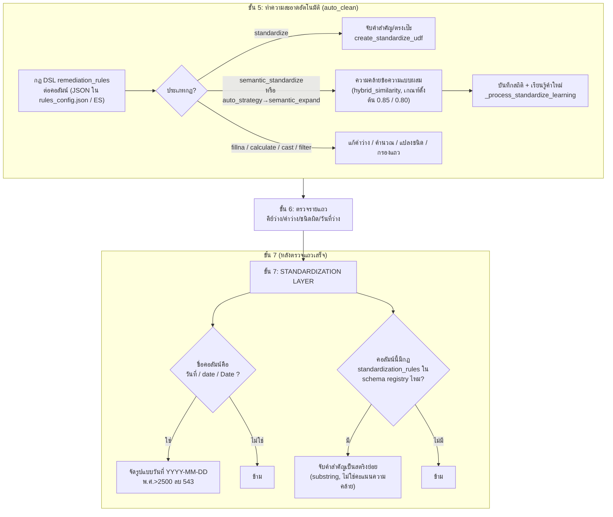

# 03. การจัดมาตรฐานค่า (Standardisation of values)

> ผู้ใช้เห็นส่วนนี้ที่: Expectations & Alerts (แท็บ "Standardize" — คิวรออนุมัติคำแนะนำจัดหมวดหมู่), Catalog (schema ของตารางที่มีกฎ `standardization_rules`), Query & Metrics และ Dashboards (คอลัมน์วันที่และคอลัมน์หมวดหมู่ที่ถูกจัดมาตรฐานแล้วในข้อมูลสะอาด) · โค้ดหลัก: `spark/spark_quality_engine.py:944-1348`, `:2139-2224`

## 1. คำตอบ 30 วินาที

ระบบมี **3 กลไกจัดมาตรฐานค่าที่แยกจากกันโดยสิ้นเชิง** ทำงานคนละจุดในรอบเดียวกัน: (ก) กฎ DSL (**Domain-Specific Language** — ภาษาย่อยที่ออกแบบมาเฉพาะงานหนึ่ง ในที่นี้คือ "สูตรทำความสะอาดข้อมูล" เขียนเป็น JSON) ที่ตั้งไว้ต่อคอลัมน์ ทำงานตอนต้นของขั้นทำความสะอาดอัตโนมัติ รองรับ 7 ประเภทกฎรวมถึงการจับคู่คำสำคัญแบบง่ายและการจับคู่แบบ**ความคล้ายข้อความ** (string similarity — วัดว่าข้อความสองชิ้นคล้ายกันแค่ไหนโดยเทียบตัวอักษร ไม่ใช่ความหมาย) (`spark/spark_quality_engine.py:944-1348`), (ข) กฎ `standardization_rules` ของ schema registry ที่จับคำสำคัญเป็นสตริงย่อยแบบตรงไปตรงมา ทำงานหลังขั้นตรวจรายแถวเสร็จ (`:2187-2224`), และ (ค) การจัดรูปแบบวันที่ให้เป็น `YYYY-MM-DD` สำหรับคอลัมน์ที่ชื่อ `วันที่`, `date` หรือ `Date` เท่านั้น (`:2139-2185`) ทั้ง 3 กลไกเป็น**อัลกอริทึมกำหนดตายตัว (deterministic)** ไม่มีจุดใดเรียกโมเดลปัญญาประดิษฐ์เลย แม้ป้ายในหน้าเว็บจะเขียนว่า "AI Suggestion" ก็ตาม (ดูข้อ 7) ข้อจำกัดหลักคือความคล้ายข้อความแบบนี้เทียบตัวอักษร ไม่เข้าใจความหมาย จึงพลาดคำพ้องความที่สะกดต่างกันมาก (เช่น "coke" ไม่ถูกจับเป็น Beverage — ดูข้อ 5 และข้อ 8)

## 2. มุมมองแบบ Black Box

ผู้ใช้เห็นผลของการจัดมาตรฐานในหลายที่โดยไม่เห็นว่าเบื้องหลังใช้กลไกไหน

- **Expectations & Alerts** หน้า `/rules` แท็บ "Standardize": ตาราง "Standardization & Auto-Learning Governance" แสดงค่าดิบที่ระบบจับหมวดหมู่ไม่ได้แน่ใจ (`Raw Value`), หมวดที่ระบบเดา (`AI Suggestion`), เปอร์เซ็นต์ความมั่นใจ (`Confidence`), ความถี่ และปุ่ม "Approve" / "Override" / "Reject" ให้คนตัดสิน
- **Query & Metrics / Dashboards / Catalog**: เห็นเฉพาะผลลัพธ์ปลายทาง — คอลัมน์วันที่เป็น `YYYY-MM-DD` เสมอ และคอลัมน์ที่มีกฎหมวดหมู่ถูกแทนที่ด้วยชื่อหมวด (เช่น "Dairy", "Beverage") — ไม่เห็นคะแนนความมั่นใจหรือค่าดิบเดิม เว้นแต่กฎตั้งให้เก็บคอลัมน์คู่ขนานไว้
- ผู้ใช้ไม่เห็นเลยว่ากฎ `standardization_rules` ของ schema registry (กลไก ข) คืออะไรจากหน้าเว็บใดเลย ต้องตั้งค่าโดยเขียนเอกสาร Elasticsearch ดัชนี `sdoqap_schema_registry` โดยตรง (ดูข้อ 6 และ 7)

บทนี้อธิบายว่าทั้ง 3 กลไกทำงานต่างกันอย่างไร และทำไมผลลัพธ์ที่ผู้ใช้เห็นถึงดูเหมือนมาจากที่เดียวกัน เอนจินที่รันทั้งหมดนี้คือเอนจินเดียวกับ[บทที่ 02 — เอนจินตรวจคุณภาพข้อมูลแบบรอบงาน](02-spark-batch-quality-engine.md) (ขั้น 5 และ 7 ของบทนั้น)

## 3. การทำงานภายใน (White Box)



**กลไก (ก): กฎ DSL ระหว่างทำความสะอาดอัตโนมัติ** — เรียกที่ `apply_dsl_remediation_rules(df, rules)` (`spark/spark_quality_engine.py:2037`) ถ้ากฎ `auto_clean` เปิดอยู่ (ค่าตั้งต้นคือเปิด, `:2031`) ฟังก์ชันนี้วนทุกกฎใน `rules_dict["remediation_rules"]` (รายการ dict ต่อคอลัมน์ อ่านจาก `sdoqap_rules_registry` หรือไฟล์ `rules_config.json`) และรองรับ 7 ประเภท (`r.get("type")`, `spark/spark_quality_engine.py:972-1306`):

| ประเภทกฎ | ทำอะไร | บรรทัด |
|---|---|---|
| `fillna` | แทนค่าว่างด้วยค่าคงที่ | `:976-980` |
| `calculate` | คำนวณคอลัมน์ใหม่ด้วยนิพจน์ Spark SQL (มี/ไม่มีเงื่อนไข) — นิพจน์ต้องผ่าน regex ที่ยอมเฉพาะตัวอักษร ตัวเลข ช่องว่าง และเครื่องหมายคณิตศาสตร์เท่านั้น กันการฉีดโค้ด | `:982-1008` |
| `cast` | แปลงชนิดข้อมูลคอลัมน์ (`int`/`double`/`string`/`timestamp` ฯลฯ) | `:1010-1014` |
| `standardize` | จับคำสำคัญแบบ **ตรงเป๊ะหรือเป็นสตริงย่อย** เท่านั้น (ไม่มีคะแนนความคล้าย) ผ่าน `create_standardize_udf` | `:1016-1028` |
| `semantic_standardize` | จับคู่ด้วย**ความคล้ายข้อความแบบผสม** (หัวข้อถัดไปอธิบายสูตร) พร้อมบันทึกคะแนนความมั่นใจและเรียนรู้คำใหม่ | `:1030-1148` |
| `auto_strategy` | เดายุทธศาสตร์เองจากลักษณะข้อมูลของคอลัมน์นั้น (ตัวเลข/หมวดหมู่น้อย/ข้อความอิสระ) แล้วเลือกใช้ 1 ใน 4: `numeric_cleaning`, `categorical_mapping` (เหมือน `standardize`), `semantic_expand` (เหมือน `semantic_standardize`), หรือ `preserve_mode` (ไม่ทำอะไร) | `:1150-1297` |
| `filter` | กรองแถวออกด้วยเงื่อนไข SQL ที่ผ่าน regex ป้องกันการฉีดโค้ดเช่นกัน | `:1299-1306` |

ก่อนวนกฎ ฟังก์ชันตรวจ**ความเป็นไปเพียงครั้งเดียว (idempotency)**: ถ้าข้อมูลมีคอลัมน์ `_meta.execution_id` ตรงกับรอบนี้อยู่แล้ว ถือว่าประมวลผลไปแล้ว ข้ามทั้งฟังก์ชันทันที (`:952-961`) ป้องกันการรันกฎซ้ำถ้าฟังก์ชันถูกเรียกสองครั้งโดยไม่ได้ตั้งใจ

ประเภทที่ซับซ้อนที่สุดคือ `semantic_standardize`: หาค่าที่ตรงเป๊ะก่อนด้วยการ join แบบ broadcast (เร็ว ไม่ใช้ **UDF** — User-Defined Function คือฟังก์ชันที่ผู้เขียนโค้ดกำหนดเองแล้วลงทะเบียนให้ Spark เรียกใช้กับค่าทีละแถวได้ ต่างจากฟังก์ชันสำเร็จรูปของ Spark เองซึ่งเร็วกว่าเพราะไม่ต้องส่งงานไปที่ตัวแปลภาษา Python ทีละค่า) แล้วเรียก UDF ความคล้ายข้อความเฉพาะค่าที่เหลือ (`apply_optimized_semantic_standardize`, `:443-557`) `output_mode` ควบคุมว่าผลลัพธ์ไปไว้ที่ไหน — `enriched` (ค่าตั้งต้น) ห่อคะแนน/วิธี/เวอร์ชันเป็นคอลัมน์ struct แยกชื่อ `_semantic_<col>`, `semantic_overwrite` เขียนทับคอลัมน์เดิม, `full` เก็บคอลัมน์เดิมและแยกฟิลด์ lineage เป็นคอลัมน์เดี่ยว, `clean_only` แค่ตัดช่องว่าง/ตัวพิมพ์เล็กโดยไม่จับคู่หมวดหมู่เลย ถ้า `schema_mode` ของตารางเป็น `strict` (ค่าตั้งต้น) ระบบจะบังคับ `output_mode` เป็น `semantic_overwrite` เสมอ ป้องกันไม่ให้กฎสร้างคอลัมน์ใหม่ที่ไม่อยู่ใน schema (`:1064-1066`)

**กลไก (ข): คำสำคัญของ schema registry หลังตรวจรายแถว** — ทำงานที่ `:2187-2224` **หลัง**ขั้นตรวจรายแถวและกรองแถวถูก/ผิดเสร็จแล้ว (แถวที่ผ่านเท่านั้นที่มาถึงจุดนี้) อ่านฟิลด์ `standardization_rules` ของตารางนั้นจากเอกสาร schema registry (`_load_standardization_rules`, `:233-268`) รูปแบบคือ `{ "column_name": { "categories": { "หมวด A": ["คำ1","คำ2"], ... }, "fallback": "Other" } }` — สังเกตว่ารูปแบบนี้ **สลับด้าน** กับกฎ DSL (ก): กฎ (ก) เก็บ `{ "raw_value": "category" }` (ค่าดิบ→หมวด) ส่วนกฎ (ข) เก็บ `{ "category": ["keyword", ...] }` (หมวด→รายการคำสำคัญ) ตรวจแบบสตริงย่อย (`kw in v`, ไม่มีคะแนนความคล้ายหรือ threshold เลย) หมวดแรกที่คำสำคัญตัวใดตัวหนึ่งพบในค่าเป็นผู้ชนะ ถ้าไม่พบเลยใช้ `fallback` ของกฎนั้น หรือถ้าไม่ได้ตั้ง fallback คืนค่าดิบเดิม (`:2217`) กลไกนี้ **ไม่มีหน้าเว็บให้ตั้งค่า** ผู้ดูแลระบบต้องเขียนเอกสาร Elasticsearch ดัชนี `sdoqap_schema_registry` ตรง (หรือแก้ไฟล์ `spark/schema_registry.json` สำรอง) เท่านั้น (ดูข้อ 7)

**กลไก (ค): การจัดรูปแบบวันที่** — ทำงานก่อนกลไก (ข) ในขั้นเดียวกัน (`:2141-2185`) เฉพาะคอลัมน์ที่ชื่อ**ตรงตัวอักษร**กับ `วันที่`, `date` หรือ `Date` เท่านั้น (`:2141`) รายละเอียดสูตรอยู่ในข้อ 4

### เมื่อไหร่ควรใช้กลไกไหน

`standardize` (ก) และกลไก (ข) เหมาะกับกรณีที่คำสำคัญตายตัวชัดเจน ("มีคำว่า cola ที่ไหนก็เป็น Beverage") เพราะเร็วและอธิบายผลได้ 100% `semantic_standardize`/`auto_strategy` (ก) เหมาะกับข้อมูลที่สะกดต่างกันเยอะ (พิมพ์ผิด ตัวย่อ ใส่ขนาดต่อท้าย) เพราะให้คะแนนความมั่นใจและเรียนรู้คำใหม่ได้ ส่วนกลไก (ข) เหมาะเมื่อผู้ดูแลระบบต้องการกฎที่ไม่ผูกกับ pipeline ทำความสะอาด แต่ยอมรับว่าต้องเขียน ES เอง

## 4. เดินผ่านโค้ดจริง

**การทำดัชนีคำเพื่อค้นหาผู้สมัคร (candidate) ของ `LocalSemanticStandardizer`** — จุดนี้สร้างโครงสร้างข้อมูลที่ทำให้ไม่ต้องเทียบค่าใหม่กับหมวดหมู่ทุกหมวด (คลาสนี้ถูกใช้จริงใน `_process_standardize_learning`, `:829`, เพื่อคำนวณสถิติ/เรียนรู้คำใหม่ — ไม่ใช่จุดที่เขียนค่าคอลัมน์ผลลัพธ์จริงของ Spark ดูข้อ 6 และ 7)

```python
# spark/spark_quality_engine.py:306-330
class LocalSemanticStandardizer:
    def __init__(self, categories: dict, threshold: float, fallback: str):
        self.threshold = threshold
        self.fallback = fallback
        self.norm_categories = {str(k).lower().strip(): str(v) for k, v in categories.items()}
        
        self.first_token_to_keys = {}
        self.word_token_to_keys = {}
        for key in self.norm_categories.keys():
            words = str(key).split()
            if words:
                self.first_token_to_keys.setdefault(words[0], set()).add(key)
                for word in words:
                    if len(word) >= 2:
                        self.word_token_to_keys.setdefault(word, set()).add(key)

        self.ngram_to_keys = {}
        for key in self.norm_categories.keys():
            for ng in self.get_char_ngrams(key):
                self.ngram_to_keys.setdefault(ng, set()).add(key)

    def get_char_ngrams(self, s, n=2):
        s = str(s).lower().strip()
        return [s[i:i+n] for i in range(len(s)-n+1)]

```

| บรรทัด | ทำอะไร |
|---|---|
| 307-310 | รับ `categories` (dict ค่าดิบ→หมวด), เกณฑ์ตัดสิน `threshold`, ค่าสำรอง `fallback` แล้วปรับ key ของ `categories` เป็นตัวพิมพ์เล็กและตัดช่องว่างหัวท้ายไว้ล่วงหน้า |
| 312-320 | สร้างดัชนี "โทเคนแรก" (`first_token_to_keys`) และ "โทเคนคำ" (`word_token_to_keys`, เฉพาะคำยาว ≥ 2 ตัวอักษร) จากคำในแต่ละ key เพื่อค้นหาผู้สมัครที่เป็นไปได้เร็วโดยไม่ต้องเทียบทุก key |
| 322-325 | สร้างดัชนีย้อนกลับของ **character bigram** (กลุ่มอักษร 2 ตัวติดกัน) ต่อ key — ใช้เป็นทางสำรองเมื่อดัชนีคำสองแบบข้างต้นหาผู้สมัครไม่ได้ (เช่น พิมพ์ผิด) |
| 327-329 | `get_char_ngrams` ตัดพิมพ์เล็ก/ตัดช่องว่างแล้วคืนรายการ bigram ทั้งหมดของสตริง เช่น `"ab cd"` → `["ab","b ","c d"... ]` (ตัวอย่างจริงในข้อ 5) |

**สูตรคะแนนความคล้าย: n-gram cosine** — คำนวณ**ความคล้ายโคไซน์** (cosine similarity — วัดมุมระหว่างเวกเตอร์สองอันจากการนับความถี่ ยิ่งเวกเตอร์ชี้ไปทิศเดียวกันมากยิ่งได้คะแนนใกล้ 1) ของถุง bigram สองถุง

```python
# spark/spark_quality_engine.py:331-360
    def n_gram_cosine_similarity(self, s1, s2):
        ngrams1 = self.get_char_ngrams(s1)
        ngrams2 = self.get_char_ngrams(s2)
        if not ngrams1 or not ngrams2:
            return 0.0
        
        bag1 = {}
        for ng in ngrams1:
            bag1[ng] = bag1.get(ng, 0) + 1
        
        bag2 = {}
        for ng in ngrams2:
            bag2[ng] = bag2.get(ng, 0) + 1
            
        all_ngrams = set(bag1.keys()).union(set(bag2.keys()))
        dot = sum(bag1.get(ng, 0) * bag2.get(ng, 0) for ng in all_ngrams)
        norm1 = sum(v**2 for v in bag1.values())**0.5
        norm2 = sum(v**2 for v in bag2.values())**0.5
        
        if norm1 == 0 or norm2 == 0:
            return 0.0
        return dot / (norm1 * norm2)

    def hybrid_similarity(self, s1, s2):
        s1_clean = str(s1).lower().strip()
        s2_clean = str(s2).lower().strip()
        
        if s1_clean == s2_clean:
            return 1.0
            
```

| บรรทัด | ทำอะไร |
|---|---|
| 332-335 | หา bigram ของทั้งสองสตริง ถ้าฝั่งใดว่าง (สตริงสั้นกว่า 2 ตัวอักษร) คืน 0.0 ทันที |
| 337-343 | นับความถี่ของแต่ละ bigram ในแต่ละสตริงเป็น "ถุงคำ" (`bag1`, `bag2`) — เช่น bigram `"re"` ปรากฏ 2 ครั้งในสตริงหนึ่ง ค่าจะเป็น 2 |
| 345-346 | **dot product**: ผลรวมของ (ความถี่ฝั่ง 1 × ความถี่ฝั่ง 2) ของทุก bigram ที่ปรากฏในฝั่งใดฝั่งหนึ่ง |
| 347-348 | **norm** (ขนาดเวกเตอร์) ของแต่ละฝั่ง = รากที่สองของผลรวมกำลังสองของความถี่ |
| 350-352 | ถ้า norm ฝั่งใดเป็น 0 คืน 0.0 กันหารด้วยศูนย์ ไม่งั้นคืน `dot / (norm1 × norm2)` — สูตรโคไซน์มาตรฐาน |
| 354-360 | `hybrid_similarity` ตัดพิมพ์เล็ก/ตัดช่องว่างทั้งสองฝั่งก่อน แล้วเทียบเท่ากันเป๊ะก่อน — ถ้าเท่ากันคืน 1.0 ทันทีโดยไม่คำนวณอะไรต่อ |

```python
# spark/spark_quality_engine.py:361-389
        # 1. Substring component (containment check)
        sub_score = 0.0
        if s2_clean in s1_clean or s1_clean in s2_clean:
            sub_score = 1.0
            
        # 2. Token Overlap component
        overlap = 0.0
        tokens1 = set(s1_clean.split())
        tokens2 = set(s2_clean.split())
        if tokens1 and tokens2:
            intersection = tokens1.intersection(tokens2)
            overlap = len(intersection) / min(len(tokens1), len(tokens2))
            
        # 3. N-gram Cosine component
        ngram = self.n_gram_cosine_similarity(s1_clean, s2_clean)
        
        # If token overlap is 0 (like in Thai run-together words), fallback to n-gram overlap
        if overlap == 0.0:
            ng1 = self.get_char_ngrams(s1_clean)
            ng2 = self.get_char_ngrams(s2_clean)
            if ng1 and ng2:
                overlap = len(set(ng1).intersection(set(ng2))) / min(len(set(ng1)), len(set(ng2)))
                
        final_score = (sub_score * 0.4) + (overlap * 0.3) + (ngram * 0.3)
        if final_score >= 0.95:
            return 1.0
            
        return final_score

```

| บรรทัด | ทำอะไร |
|---|---|
| 361-364 | **ส่วนที่ 1 — containment**: ถ้าสตริงหนึ่งเป็นส่วนหนึ่งของอีกสตริง (ไม่ว่าทิศทางไหน) ให้ `sub_score = 1.0` ไม่งั้น 0.0 |
| 366-372 | **ส่วนที่ 2 — token overlap**: แยกแต่ละสตริงเป็นคำด้วยช่องว่าง (`.split()`) แล้วหาสัดส่วนคำที่ซ้อนทับกัน หารด้วยจำนวนคำของฝั่งที่**สั้นกว่า** (ไม่ใช่ union) — ทำให้สตริงสั้นที่เป็นส่วนย่อยของสตริงยาวได้คะแนนสูง |
| 374-375 | **ส่วนที่ 3** เรียก `n_gram_cosine_similarity` ที่อธิบายไปข้างต้น |
| 377-382 | ถ้า token overlap เป็น 0 (เช่น ข้อความไทยที่เขียนติดกันไม่มีช่องว่างแยกคำ ทำให้ `.split()` ได้แค่ 1 "คำ" ทั้งประโยค) สลับไปใช้สัดส่วนการซ้อนทับของ bigram แทน หารด้วยจำนวน bigram ไม่ซ้ำของฝั่งที่น้อยกว่า |
| 384 | รวมคะแนนถ่วงน้ำหนักตายตัว: **containment 40% + overlap 30% + cosine 30%** — ตัวเลข 0.4/0.3/0.3 เขียนตรงในโค้ด ไม่มีที่ปรับ |
| 385-388 | ถ้าคะแนนรวม ≥ 0.95 ปัดเป็น 1.0 (ถือว่า "เหมือนกันจริงๆ" ทั้งที่ containment/overlap/cosine ไม่มีส่วนไหนถึง 1.0 พอดีเป๊ะเสมอไป) ไม่งั้นคืนคะแนนดิบ |

**การเลือกหมวดหมู่ที่ดีที่สุดและตัดสินด้วยเกณฑ์** — จุดที่ตัดสินว่าค่าดิบจะได้หมวดอะไรและความมั่นใจเท่าไร

```python
# spark/spark_quality_engine.py:390-419
    def standardize(self, val):
        if val is None:
            if self.fallback == "original":
                return (None, 0.0)
            return (self.fallback, 0.0)
            
        val_str = str(val).strip()
        val_lower = val_str.lower()
        
        if val_lower in self.norm_categories:
            return (self.norm_categories[val_lower], 1.0)
            
        val_words = val_lower.split()
        first_token = val_words[0] if val_words else ""
        
        candidates = set()
        
        if first_token and first_token in self.first_token_to_keys:
            candidates.update(self.first_token_to_keys[first_token])
            
        if len(candidates) < 5:
            for token in val_words:
                if len(token) >= 2 and token in self.word_token_to_keys:
                    candidates.update(self.word_token_to_keys[token])
                    
        if not candidates or len(candidates) < 3:
            val_ngrams = self.get_char_ngrams(val_lower)
            for ng in val_ngrams:
                if ng in self.ngram_to_keys:
                    candidates.update(self.ngram_to_keys[ng])
```

| บรรทัด | ทำอะไร |
|---|---|
| 391-394 | ค่าว่าง (`None`): ถ้า `fallback == "original"` คืน `(None, 0.0)` ไม่งั้นคืน `(fallback, 0.0)` |
| 396-400 | ตัดช่องว่างและแปลงตัวพิมพ์เล็ก ถ้าตรงกับ key ใน `norm_categories` **เป๊ะ** คืนหมวดนั้นทันทีด้วยความมั่นใจ **1.0** (ไม่ต้องคำนวณความคล้ายเลย) |
| 402-408 | แยกคำด้วยช่องว่าง เอาคำแรกไปค้นใน `first_token_to_keys` ก่อน — เร็วที่สุดถ้าค่าดิบขึ้นต้นด้วยคำเดียวกับหมวดหมู่ |
| 410-413 | ถ้าได้ผู้สมัครน้อยกว่า 5 ราย ขยายการค้นด้วยทุกคำ (ยาว ≥ 2 ตัวอักษร) ผ่าน `word_token_to_keys` |
| 415-419 | ถ้ายังไม่มีผู้สมัครหรือน้อยกว่า 3 ราย ขยายอีกชั้นด้วย bigram ของค่าดิบทั้งหมด ผ่าน `ngram_to_keys` — ชั้นนี้ทนต่อคำที่พิมพ์ผิดเพราะไม่สนใจการแบ่งคำเลย |

```python
# spark/spark_quality_engine.py:420-442
                    
        if not candidates:
            if self.fallback == "original":
                return (val_str, 0.0)
            return (self.fallback, 0.0)
            
        best_match = None
        best_score = -1.0
        
        for key in candidates:
            target_val = self.norm_categories[key]
            score = self.hybrid_similarity(val_lower, key)
            if score > best_score:
                best_score = score
                best_match = target_val
                
        if best_score >= self.threshold:
            return (best_match, float(best_score))
            
        if self.fallback == "original":
            return (val_str, float(best_score) if best_score > 0 else 0.0)
        return (self.fallback, float(best_score) if best_score > 0 else 0.0)

```

| บรรทัด | ทำอะไร |
|---|---|
| 421-424 | ถ้าทั้ง 3 ชั้นการค้นหาไม่ได้ผู้สมัครเลย (bigram ของค่าดิบไม่ตรงกับ bigram ของหมวดใดเลย) คืนค่าสำรองทันที **ไม่คำนวณความคล้ายเลย** |
| 426-434 | วนทุกผู้สมัคร คำนวณ `hybrid_similarity` เทียบกับค่าดิบ เก็บผู้สมัครที่คะแนนสูงสุด |
| 436-437 | ถ้าคะแนนสูงสุด ≥ `self.threshold` (ค่าที่ส่งเข้ามาตอนสร้าง object) ถือว่าจับคู่สำเร็จ คืน `(หมวด, คะแนน)` |
| 439-441 | ถ้าคะแนนไม่ถึงเกณฑ์ คืนค่าสำรองแทน — พร้อมคะแนนที่ทำได้จริง (ไม่ใช่ 0 เสมอไป) เพื่อให้ผู้เรียก (`_process_standardize_learning`) รู้ว่า "เกือบจับได้" แค่ไหน |

**ตัวเลขเกณฑ์ (threshold) ตัวจริงที่เอนจินใช้** — `LocalSemanticStandardizer.__init__` (`:307-308`) **ไม่มีค่าเกณฑ์ตั้งต้นในตัวเอง** ต้องรับ `threshold` จากผู้เรียกเสมอ ผู้เรียกจริงคือ `_process_standardize_learning` (`:829`) ซึ่งได้ค่า `threshold` มาจากกฎ DSL: rule ประเภท `semantic_standardize` ใช้ `float(rule.get("threshold", 0.85))` (`:1032`, ค่าสำรอง **0.85**) ส่วน `auto_strategy` ที่เลือกยุทธศาสตร์ `semantic_expand` ใช้ `float(rule.get("confidence_threshold", 0.80))` (`:1152`, ค่าสำรอง **0.80**) เกณฑ์ **0.5** ที่ใช้สาธิตในข้อ 5 ของบทนี้เป็นค่าที่คำสั่งสาธิตตั้งเองเพื่อให้เห็นพฤติกรรมเมื่อคะแนนต่ำ ไม่ใช่ค่าตั้งต้นจริงของระบบ

**`low_confidence_policy` — ทำอะไรเมื่อคะแนนไม่ถึงเกณฑ์** — พารามิเตอร์นี้มีเฉพาะในเส้นทาง UDF ที่เขียนค่าคอลัมน์ผลลัพธ์จริง (`create_semantic_standardize_udf`, `:559`) ควบคุม 3 จุดตัดสินใจที่มีรูปแบบเดียวกัน: ค่าเข้าเป็น `None` (`:650-656`), ไม่มีผู้สมัครเลยหลังค้นทั้ง 3 ชั้น (`:696-704`), และคะแนนดีที่สุดไม่ถึง `threshold` (`:718-724`)

| ค่า `low_confidence_policy` | ผลลัพธ์เมื่อคะแนนต่ำ/ไม่มีผู้สมัคร | ผลลัพธ์เมื่อค่าเข้าเป็น `None` | อ้างอิง |
|---|---|---|---|
| `keep_original` | คืนค่าดิบเดิมที่ตัดช่องว่างแล้ว (`val_str`) พร้อมคะแนนจริงที่ทำได้ (ไม่ใช่ 0 เสมอไป) | คืน `None` (ค่าดิบไม่มีให้ "เก็บ" อยู่แล้ว) | `:697-698`, `:719-720`, `:651-652` |
| `null` | คืน `None` เสมอ ไม่ว่าคะแนนจะสูงแค่ไหนที่ไม่ถึงเกณฑ์ | คืน `None` | `:699-700`, `:721-722`, `:653-654` |
| อื่นๆ (ค่าตั้งต้น `map_to_fallback`, และค่าอื่นที่ไม่ตรง 2 แบบข้างต้นก็ตกมาที่ `else` นี้เหมือนกัน) | คืนค่า `fallback` ของกฎ — ถ้า `fallback == "original"` คืนค่าดิบเดิม (`val_str`) แทน | คืนค่า `fallback` — ถ้า `fallback == "original"` คืน `None` (ไม่ใช่ `val_str` เพราะไม่มีค่าดิบให้ใช้) | `:701-702`, `:723-724`, `:655-656` |

ค่าตั้งต้นของ `low_confidence_policy` คือ **`"map_to_fallback"`** ทั้งสำหรับกฎ `semantic_standardize` (`rule.get("low_confidence_policy", "map_to_fallback")`, `:1056`) และสำหรับ `auto_strategy` ที่เลือกยุทธศาสตร์ `semantic_expand` (`:1218`) — ทุกกรณีที่คืนค่าจะติดฉลาก `match_method = "fallback"` เสมอ (คอลัมน์ `_semantic_<col>.method`) ทำให้ตรวจสอบย้อนหลังได้ว่าแถวไหนเป็นผลจากนโยบายนี้

**คลาส `LocalSemanticStandardizer` ไม่รับรู้ `low_confidence_policy` เลย**: เมธอด `standardize()` ของคลาส (`:390-441`, ใช้ใน `_process_standardize_learning` เพื่อคำนวณสถิติ/เรียนรู้คำใหม่ ไม่ใช่เขียนคอลัมน์ผลลัพธ์จริง) มีแค่พารามิเตอร์ `fallback` สองทาง (`"original"` หรือคืนค่า `fallback`) ไม่มีทางเลือก `"null"` เลย — ถ้าตั้ง `low_confidence_policy = "null"` ในกฎ DSL สถิติที่คลาสนี้คำนวณ (เช่น `fallback_rate`, `avg_confidence`) จะไม่ได้จำลองพฤติกรรม "คืนค่าว่าง" ของ UDF จริงเป๊ะ เป็นอีกจุดที่ตรรกะสองชุด (คลาสกับ UDF) ไม่ตรงกันทุกประการ (ดูข้อ 7)

**การจัดรูปแบบวันที่ (กลไก ค)** — ตรวจ พ.ศ., วิเคราะห์รูปแบบวันที่ 2 แบบ

```python
# spark/spark_quality_engine.py:2146-2175
        def parse_and_standardize_date(date_str):
            if not date_str:
                return None
            date_str = str(date_str).strip()
            import re
            date_str = re.sub(r'\s+', ' ', date_str)
            
            # Pattern A: 21 Jul 2026 or 21 July 2026
            match_eng = re.search(r'(\d+)\s+([A-Za-z]+)\s+(\d+)', date_str)
            if match_eng:
                day = int(match_eng.group(1))
                month_str = match_eng.group(2)[:3].lower()
                year = int(match_eng.group(3))
                months = {'jan':1, 'feb':2, 'mar':3, 'apr':4, 'may':5, 'jun':6, 'jul':7, 'aug':8, 'sep':9, 'oct':10, 'nov':11, 'dec':12}
                month = months.get(month_str, 1)
                if year > 2500:
                    year -= 543
                return f"{year:04d}-{month:02d}-{day:02d}"
                
            # Pattern B: split by - or /
            parts = re.split(r'[-/]', date_str)
            if len(parts) == 3:
                try:
                    p0 = int(parts[0])
                    p1 = int(parts[1])
                    p2 = int(parts[2])
                    if p0 > 1000: # yyyy-mm-dd
                        year, month, day = p0, p1, p2
                    else: # dd-mm-yyyy
                        day, month, year = p0, p1, p2
```

| บรรทัด | ทำอะไร |
|---|---|
| 2146-2151 | ค่าว่าง/`None` คืน `None` ทันที ไม่งั้นตัดช่องว่างหัวท้ายและยุบช่องว่างซ้ำให้เหลืออันเดียว |
| 2154-2158 | **รูปแบบ A**: หาก text มีรูปแบบ "ตัวเลข + ตัวอักษร + ตัวเลข" คั่นด้วยช่องว่าง (เช่น `"21 Jul 2026"`) ถือว่าเป็น วัน-เดือน(ชื่อย่อ)-ปี ตัดชื่อเดือนเหลือ 3 ตัวอักษรแรกแล้วแปลงเป็นตัวพิมพ์เล็กเพื่อค้นในตาราง `months` |
| 2159-2160 | ค้นเลขเดือนจากชื่อย่อ 3 ตัวอักษร ถ้าไม่พบในตาราง (สะกดผิดหรือไม่ใช่ภาษาอังกฤษ) **ค่าเริ่มต้นคือเดือน 1 (มกราคม) เงียบๆ** โดยไม่มีการแจ้งเตือน |
| 2161-2163 | ถ้าปี > 2500 ถือว่าเป็น**พุทธศักราช**แล้วลบ 543 ให้เป็นคริสต์ศักราช แล้วประกอบเป็น `YYYY-MM-DD` |
| 2166-2167 | **รูปแบบ B**: ถ้าไม่ตรงรูปแบบ A ลองแยกด้วย `-` หรือ `/` ต้องได้ 3 ส่วนพอดี |
| 2172-2175 | **สมมติฐานวัน-เดือน-ปีก่อน (day-first)**: ถ้าส่วนแรก > 1000 ถือเป็นปีอยู่หน้าสุด (`yyyy-mm-dd`) ไม่งั้น**สันนิษฐานว่าเป็น `dd-mm-yyyy`เสมอ** ไม่มีการตรวจว่าส่วนที่สองเกิน 12 หรือไม่ (ดูข้อ 5 และ 8 สำหรับผลเมื่อวันที่กำกวมอย่าง `05/07/2026`) |

```python
# spark/spark_quality_engine.py:2176-2181
                    if year > 2500:
                        year -= 543
                    return f"{year:04d}-{month:02d}-{day:02d}"
                except ValueError:
                    pass
            return date_str
```

| บรรทัด | ทำอะไร |
|---|---|
| 2176-2178 | รูปแบบ B ก็ตรวจ พ.ศ. > 2500 แล้วลบ 543 เหมือนรูปแบบ A |
| 2179-2180 | ถ้าแปลงส่วนใดเป็นเลขไม่ได้ (`ValueError`, เช่นมีตัวอักษรปน) จับ exception เงียบๆ แล้วปล่อยผ่านไปบรรทัดถัดไป |
| 2181 | **ทางออกสุดท้าย**: ถ้าไม่ตรงทั้งรูปแบบ A และ B (หรือ B ตรงจำนวนส่วนแต่แปลงเลขไม่ได้) **คืนค่าดิบเดิมกลับไปโดยไม่แก้ไข** — คอลัมน์วันที่ในผลลัพธ์จึงอาจมีทั้งรูปแบบ `YYYY-MM-DD` และรูปแบบเดิมปนกันได้ถ้าข้อมูลมีวันที่แปลกๆ ปนอยู่ |

**คำสำคัญของ schema registry (กลไก ข)** — จับคำสำคัญเป็นสตริงย่อยล้วนๆ ไม่มีคะแนนความคล้าย

```python
# spark/spark_quality_engine.py:2207-2221
                def make_standardize_udf(cat_kw_list, fallback_val):
                    def standardize_value(val):
                        if not val:
                            return fallback_val
                        v = str(val).strip().lower()
                        if not v:
                            return fallback_val
                        for cat_name, keywords in cat_kw_list:
                            if any(kw in v for kw in keywords):
                                return cat_name
                        return fallback_val if fallback_val else val
                    return standardize_value

                std_udf = udf(make_standardize_udf(cat_keywords, fb), StringType())
                clean_df = clean_df.withColumn(col_name, std_udf(F.col(col_name)))
```

| บรรทัด | ทำอะไร |
|---|---|
| 2207-2213 | ค่าว่าง/สตริงว่างหลังตัดช่องว่างคืน `fallback_val` ทันที |
| 2214-2216 | วนทีละหมวดหมู่ตามลำดับที่เก็บใน dict (`cat_kw_list`) ถ้าคำสำคัญ**ตัวใดตัวหนึ่ง**ของหมวดนั้นเป็นสตริงย่อยของค่า (`kw in v`) ให้ผลเป็นหมวดนั้นทันที — **หมวดแรกที่พบชนะ ไม่เทียบหมวดอื่นต่อ** แม้จะมีคำสำคัญของหมวดอื่นตรงกว่าก็ตาม |
| 2217 | ถ้าไม่มีคำสำคัญใดตรงเลย คืน `fallback_val` ถ้าตั้งไว้ ไม่งั้นคืนค่าดิบเดิม (`v`, ซึ่งถูกตัดช่องว่าง/พิมพ์เล็กไปแล้ว ต่างจากกลไก ก ที่คืนค่าดิบไม่ผ่านการแก้ไข) |

## 5. ตัวอย่างการคำนวณจริง

รันคำสั่งสาธิตในคอนเทนเนอร์ `spark-master` เรียกคลาส `LocalSemanticStandardizer` ตัวจริงด้วยเกณฑ์ 0.5 (ตั้งเองเพื่อสาธิต ไม่ใช่ค่าตั้งต้นจริง — ดูข้อ 4), หมวดหมู่ 3 หมวด: `{'fresh milk': 'Dairy', 'whole wheat bread': 'Bakery', 'coca cola': 'Beverage'}` (บันทึกไว้ที่ `docs/whitebox-report/evidence/03-standardizer-run.txt`):

```
'fresh milk' -> ('Dairy', 1.0)
'Fresh Milk 1L' -> ('Dairy', 1.0)
'wheat bred' -> ('Other', 0.37360679774997896)
'coke' -> ('Other', 0.2095445115010332)
'laptop' -> ('Other', 0.10242640687119284)
None -> ('Other', 0.0)
---hybrid_similarity check---
wheat bred vs whole wheat bread: 0.7453559924999299
hybrid: 0.37360679774997896
```

**กรณีที่ 1 — `'fresh milk'` ตรงเป๊ะ**: `val_lower = 'fresh milk'` ตรงกับ key `'fresh milk'` ใน `norm_categories` พอดี เข้าเงื่อนไข `:399` คืน `('Dairy', 1.0)` ทันที ไม่มีการคำนวณความคล้ายเลย

**กรณีที่ 2 — `'Fresh Milk 1L'` ก็ได้คะแนน 1.0 เหมือนกันทั้งที่ไม่ตรงเป๊ะ**: `val_lower = 'fresh milk 1l'` ไม่ตรงกับ key ใดเป๊ะ ผ่านไปคำนวณ `hybrid_similarity('fresh milk 1l', 'fresh milk')` — **คำนวณด้วยมือจากสูตรที่ `spark/spark_quality_engine.py:361-384`**: `sub_score` = 1.0 (เพราะ `'fresh milk'` เป็นส่วนย่อยของ `'fresh milk 1l'`) `tokens1 = {fresh, milk, 1l}` (3 คำ), `tokens2 = {fresh, milk}` (2 คำ), ซ้อนทับกัน 2 คำ → `overlap = 2 / min(3,2) = 2/2 = 1.0` n-gram cosine ของสองสตริงนี้สูงมากเช่นกัน (สตริงหนึ่งเป็นสตริงอีกอันบวกอักษรเพิ่ม) ดังนั้น `final_score = 0.4×1.0 + 0.3×1.0 + 0.3×(ค่าที่สูง) ≥ 0.95` → ปัดเป็น **1.0** ตามกติกา `:385-386` นี่คือเหตุผลที่ทั้งค่าตรงเป๊ะและค่าที่ "เกือบตรงเป๊ะแต่มีคำเพิ่ม" ได้คะแนนความมั่นใจสูงสุดเท่ากันหมด

**กรณีที่ 3 — `'wheat bred'` เทียบกับ `'whole wheat bread'` (ตัวอย่างที่โจทย์กำหนด)**: คำนวณด้วยมือจากสูตรที่ `spark/spark_quality_engine.py:327-352`

*Bigram ของ `'wheat bred'`* (10 ตัวอักษรรวมช่องว่าง `w-h-e-a-t-␣-b-r-e-d`) มี 9 คู่ ทุกคู่ไม่ซ้ำกัน: `wh, he, ea, at, t␣, ␣b, br, re, ed` (นับความถี่ 1 ทุกตัว, norm₁ = √9 = 3)

*Bigram ของ `'whole wheat bread'`* (17 ตัวอักษร `w-h-o-l-e-␣-w-h-e-a-t-␣-b-r-e-a-d`) มี 16 คู่: `wh, ho, ol, le, e␣, ␣w, wh, he, ea, at, t␣, ␣b, br, re, ea, ad` — สังเกตว่า `wh` และ `ea` ปรากฏคนละ 2 ครั้ง ส่วนที่เหลือปรากฏครั้งละ 1 (ผลรวมกำลังสองของความถี่ = 2²+2²+12×1² = 4+4+12 = 20, norm₂ = √20 ≈ 4.472135955)

*dot product*: เทียบ 9 คู่ของ `'wheat bred'` กับถุงคำของ `'whole wheat bread'` — คู่ที่พบตรงกันคือ `wh(1×2), he(1×1), ea(1×2), at(1×1), t␣(1×1), ␣b(1×1), br(1×1), re(1×1)` (คู่ `ed` ของ `'wheat bred'` ไม่มีในอีกฝั่งเลย เพราะอีกฝั่งมี `ad` แทน) รวม = 2+1+2+1+1+1+1+1 = **10**

*โคไซน์* = 10 / (3 × 4.472135955) = 10 / 13.416407865 ≈ **0.7453559925** — ตรงกับผลจากระบบจริง `0.7453559924999299` เป๊ะ (ต่างกันแค่การปัดเศษทศนิยม)

*ต่อด้วย hybrid_similarity*: `sub_score` = 0 (`'wheat bred'` ไม่ใช่ส่วนย่อยของ `'whole wheat bread'` เพราะมันคือ "bred" ไม่ใช่ "bread") `tokens1 = {wheat, bred}` (2 คำ), `tokens2 = {whole, wheat, bread}` (3 คำ) ซ้อนทับกันแค่คำว่า `wheat` → `overlap = 1/min(2,3) = 1/2 = 0.5` `final_score = 0.4×0 + 0.3×0.5 + 0.3×0.7453559925 = 0 + 0.15 + 0.22360679775 ≈ 0.3736068` ตรงกับผลจากระบบจริง `0.37360679774997896` — เมื่อเทียบกับเกณฑ์สาธิต 0.5 คะแนนนี้**ไม่ถึงเกณฑ์** จึงตกไปเป็นค่าสำรอง `('Other', 0.374)` ตามผลจริงข้างต้น (ในระบบจริงที่ threshold ตั้งต้น 0.85 ยิ่งไม่มีทางผ่าน)

**กรณีที่ 4 — `'coke'` ไม่ถูกจัดเป็น `Beverage`**: `'coke'` ไม่ตรง key ใดเป๊ะ คำเดียว (`first_token='coke'`) ไม่ตรงกับโทเคนแรกของหมวดใด (`fresh`, `whole`, `coca`) ขยายไป `word_token_to_keys` — โทเคนคำของหมวดที่มีคือ `fresh, milk, whole, wheat, bread, coca, cola` ก็ไม่มี `coke` ตรงเป๊ะ ขยายไปชั้น bigram — bigram ของ `'coke'` คือ `co, ok, ke` มี `co` ตรงกับ bigram ตัวแรกของ `'coca cola'` เท่านั้น ทำให้ `'coca cola'` เป็นผู้สมัครเดียว คำนวณ `hybrid_similarity('coke', 'coca cola')` ได้ต่ำมาก (`sub_score=0`, ไม่มีคำซ้อนทับกันเป๊ะ, bigram คล้ายกันน้อย) ผลจริงคือ **0.2095445115010332** ต่ำกว่าเกณฑ์สาธิต 0.5 (และต่ำกว่าเกณฑ์จริง 0.85 มาก) จึงตกเป็น `('Other', 0.21)`

## 6. ทำไมออกแบบแบบนี้ และทางเลือกอื่น

**ทำไมใช้ความคล้ายข้อความ (string similarity) แทนโมเดลภาษา (LLM) หรือ embeddings** — ระบบเลือกอัลกอริทึมกำหนดตายตัวที่รันในหน่วยความจำเดียวกับ Spark worker แลกกับ 4 เรื่อง: **ต้นทุน** ไม่ต้องเรียก API โมเดลภายนอกหรือรันโมเดลหนักในเครื่อง จึงไม่มีค่าใช้จ่ายต่อการเรียกเลย, **ความเร็ว** การนับ bigram/token overlap เป็นเลขคณิตล้วนๆ เร็วกว่าการฝัง (embed) ข้อความด้วยโมเดลภาษาหลายเท่า เหมาะกับข้อมูลนับล้านแถวต่อรอบที่เอนจินนี้ประมวลผล, **ความเป็นส่วนตัว** ค่าดิบ (ชื่อสินค้า ที่อยู่ ฯลฯ) ไม่ต้องออกจากคลัสเตอร์ไปยังบริการภายนอกเลย, **อธิบายผลได้ (explainability)** ทุกคะแนนไล่ตามสูตรคณิตศาสตร์ตรงไปตรงมาได้ (ดังที่คำนวณด้วยมือในข้อ 5) ต่างจากเวกเตอร์ embedding ที่อธิบายไม่ได้ว่า "ทำไมถึงคล้ายกัน" ราคาที่ต้องจ่ายคือความแม่นยำเชิงความหมาย: `'coke'` กับ `'coca cola'` ความหมายเดียวกันสำหรับมนุษย์ แต่สะกดต่างกันเกินกว่าที่ตัวชี้วัดระดับตัวอักษรจะจับได้ (ข้อ 5, กรณีที่ 4) โมเดล embedding แบบทันสมัยจะจับคำพ้องความแบบนี้ได้ดีกว่ามาก แต่แลกมาด้วยต้นทุน ความหน่วง และการอธิบายผลที่ยากกว่า ระบบนี้ไม่มีจุดใดในโค้ดที่เรียกโมเดลปัญญาประดิษฐ์เพื่อจัดมาตรฐานค่าเลย (ยืนยันจากการค้นทั้งไฟล์ ไม่พบคำว่า `groq`/`llama`/`openai`) ต่างจาก AI advisor ที่ใช้จริงในกฎ decision-tree ของ[บทที่ 05 — AI ในระบบ](05-ai-in-the-system.md) ซึ่งเป็นคนละกลไกคนละจุดประสงค์กันโดยสิ้นเชิง

**ทำไมเก็บค่าดิบไว้แยกคอลัมน์แทนที่จะเขียนทับ** — ค่าตั้งต้นของ `semantic_standardize` คือ `output_mode = "enriched"` (`:1060,1092-1113`) ซึ่งเก็บค่าดิบที่ทำความสะอาดแล้ว (ตัดช่องว่าง/พิมพ์เล็ก) ไว้ในคอลัมน์เดิม และห่อผลจัดหมวด/คะแนน/วิธีการไว้ใน struct แยก เหตุผลคือค่าความมั่นใจต่ำ (เช่น 0.6) ไม่ได้แปลว่าระบบ "ผิดแน่นอน" — การเขียนทับค่าดิบทิ้งไปเลยทำให้ย้อนกลับไปแก้ไม่ได้ถ้าคำแนะนำผิด ผู้ตรวจในหน้า Expectations & Alerts ต้องเห็นทั้งค่าดิบและคำแนะนำคู่กันเพื่อตัดสินใจอนุมัติ/ปฏิเสธ (ข้อ 2) แต่ถ้า `schema_mode = "strict"` (ค่าตั้งต้นของตาราง) ระบบจะบังคับเป็น `semantic_overwrite` แทนเสมอ (`:1064-1066`) เพราะโหมด strict ห้ามคอลัมน์ใหม่งอกเพิ่มเข้าไปนอก schema ที่ลงทะเบียนไว้ — ระบบเลือกความเข้ากันได้ของ schema เหนือกว่าการเก็บ lineage ในกรณีนี้ (ดูข้อ 7)

**ทำไมต้องมีหมวดสำรอง (fallback)** — ทุกกลไกมีค่าสำรองเมื่อจับคู่ไม่ได้หรือคะแนนไม่ถึงเกณฑ์ (`fallback` ของกฎ DSL ค่าตั้งต้น `"original"` คือคืนค่าดิบ, ของ schema registry ไม่มีค่าตั้งต้นเป็นข้อความเสมอ) เพราะการบังคับจัดหมวดที่ไม่แน่ใจให้ตรงกับหมวดใดหมวดหนึ่งไปเลยจะทำให้ตัวเลขสรุปเชิงธุรกิจ (เช่น ยอดขายต่อหมวด) ผิดโดยไม่มีสัญญาณเตือน การมีหมวด "อื่นๆ"/"Other" แยกไว้ทำให้เห็นชัดว่าระบบไม่มั่นใจแค่ไหน (`fallback_rate` ใน `LATEST_FALLBACK_METRICS`, `:930-940`) แทนที่จะซ่อนความไม่แน่ใจนั้นไว้ในหมวดที่ดูถูกต้อง

**ทำไมมี 2 กฎ (`standardize` และ `semantic_standardize`) ที่ดูคล้ายกัน** — `standardize` ตรง/สตริงย่อยเท่านั้น ไม่มีคะแนน ไม่มีการเรียนรู้ เหมาะกับกฎที่ผู้ดูแลมั่นใจเต็มร้อยอยู่แล้วและต้องการความเร็วสูงสุด (ไม่ต้องคำนวณความคล้าย) ส่วน `semantic_standardize` ช้ากว่าเพราะคำนวณความคล้ายและบันทึกสถิติ แลกกับการทนต่อคำสะกดผิด/หลากหลายและมีเส้นทางเรียนรู้อัตโนมัติ ระบบไม่ได้รวมสองแบบเป็นกฎเดียวเพราะต้นทุนการคำนวณต่างกันมาก และบางคอลัมน์ (เช่นรหัสสินค้าตายตัว) ไม่ต้องการความยืดหยุ่นแบบนั้นเลย

## 7. ข้อจำกัด ค่าตายตัว และข้อสังเกต

- **ป้าย "AI Suggestion" ในหน้าเว็บทำให้เข้าใจผิด:** แท็บ Standardize ของหน้า Expectations & Alerts เขียนหัวตารางว่า "AI Suggestion" (`ui/src/pages/RulesConfig.jsx:1569`) แต่ค่าที่แสดงมาจาก `hybrid_similarity` ซึ่งเป็นสูตรคณิตศาสตร์ตายตัว ไม่มีโมเดลปัญญาประดิษฐ์เกี่ยวข้องเลย (ยืนยันในข้อ 6) ผู้ใช้ที่ไม่รู้โค้ดอาจเข้าใจว่าเป็นคำแนะนำจากโมเดล ทั้งที่จริงคือการนับตัวอักษรที่ซ้อนทับกัน
- **มีตรรกะความคล้ายข้อความ 2 ชุดคู่ขนานที่อาจไม่ตรงกัน:** `LocalSemanticStandardizer` (class, `:306-441`, ใช้จริงเฉพาะใน `_process_standardize_learning` สำหรับคำนวณสถิติ/เรียนรู้คำใหม่) กับ `create_semantic_standardize_udf`/`apply_optimized_semantic_standardize` (ฟังก์ชันเดี่ยว, `:443-744`, ใช้เขียนค่าคอลัมน์ผลลัพธ์จริงที่ผู้ใช้เห็น) มีสูตร `get_char_ngrams`/`n_gram_cosine_similarity`/`hybrid_similarity` **คัดลอกซ้ำกันทุกตัวอักษร** ไม่ได้เรียกใช้ฟังก์ชันร่วมกัน ถ้าใครแก้สูตรในจุดหนึ่งแต่ลืมอีกจุด สถิติที่แสดงในคิวรอตรวจ (จากคลาส) กับค่าจริงที่เขียนลง Delta Lake (จากฟังก์ชัน) จะเริ่มไม่ตรงกันโดยไม่มีการเตือน
- **กลไก (ข) ไม่มีหน้าเว็บให้ตั้งค่าเลย:** `standardization_rules` ของ schema registry ไม่ปรากฏในโค้ด `api/` แม้แต่บรรทัดเดียว (ค้นทั้งโฟลเดอร์ไม่พบ) ต่างจากกฎ DSL (ก) ที่มีหน้า Expectations & Alerts ให้แก้ไขและมี endpoint `api/app/api/standardize.py` ดูแลคิวอนุมัติ ผู้ดูแลระบบต้องเขียนเอกสาร Elasticsearch ดัชนี `sdoqap_schema_registry` โดยตรงเพื่อใช้กลไกนี้
- **การเรียนรู้อัตโนมัติข้ามเกณฑ์คะแนนไปเลยได้โดยไม่มีคนอนุมัติ:** ใน `_process_standardize_learning` ถ้าคะแนนของค่าที่พบ > 0.90 ระบบเรียก `_update_standardization_memory` เขียนแมปใหม่ลง `rules_config.json` และ ES ทันที (`spark/spark_quality_engine.py:885-887`) โดยไม่ผ่านคิวรอตรวจเลย มีแต่คะแนนช่วง 0.60–0.90 เท่านั้นที่ไปเข้าคิวให้คนอนุมัติ (`:888-905`) ถ้าค่าดิบสองค่าที่ต่างความหมายกันบังเอิญมีคะแนนความคล้ายสูงกว่า 0.90 กับหมวดผิด ระบบจะ "จำผิด" ถาวรโดยไม่มีใครรู้จนกว่าจะมีคนสังเกตผลลัพธ์ปลายทาง (ดูคำถามกรรมการข้อ 8)
- **ข้อความหมวดสำรองที่ส่งเข้าคิวรอตรวจเขียนตายตัว ไม่ตรงกับ `fallback` ที่ตั้งไว้จริง:** เมื่อคะแนน ≤ 0.60 ค่า `suggested_category` ที่บันทึกลง `sdoqap_unmapped_terms` ถูกเขียนเป็นสตริงตายตัว `"อื่นๆ"` เสมอ (`spark/spark_quality_engine.py:915`) ไม่ได้อ้างค่าตัวแปร `fallback` ที่กฎนั้นตั้งไว้จริง ถ้าผู้ดูแลตั้ง `fallback` เป็นคำอื่น (เช่น `"Unknown"`) หน้าจอคิวรอตรวจจะแสดงคำแนะนำที่ไม่ตรงกับค่าที่ระบบจะใช้จริงถ้าไม่มีใครอนุมัติ
- **เดือนที่สะกดผิดหรือไม่ใช่ภาษาอังกฤษเงียบๆ กลายเป็นมกราคม:** `months.get(month_str, 1)` (`:2160`) ถ้าไม่พบชื่อเดือนย่อ 3 ตัวอักษรในตาราง (เช่นพิมพ์ผิดหรือเป็นภาษาไทย) ค่าเริ่มต้นคือเดือน 1 โดยไม่มีข้อความเตือนหรือทำเครื่องหมายแถวนั้นเลย ข้อมูลวันที่จะผิดแบบเงียบสนิท
- **สมมติฐาน day-first ไม่มีการตรวจสอบขอบเขต:** รูปแบบ B (`:2172-2175`) ถือว่าส่วนแรกที่ไม่เกิน 1000 คือ "วัน" เสมอ ไม่ตรวจว่าค่านั้นเกิน 31 หรือส่วนที่สอง (เดือน) เกิน 12 หรือไม่เลย วันที่ `13/13/2569` จะถูกแปลงเป็น `2026-13-13` ซึ่งไม่ใช่วันที่จริงแต่โค้ดไม่ตรวจจับ (ดูคำถามกรรมการข้อ 8)
- **ค่าที่แปลงวันที่ไม่ได้เลยถูกส่งกลับแบบเงียบ:** บรรทัด `:2181` คืนค่าดิบเดิมถ้าไม่ตรงทั้งสองรูปแบบ คอลัมน์วันที่ในผลลัพธ์จึงอาจปนกันระหว่างรูปแบบ `YYYY-MM-DD` และรูปแบบเดิมที่แปลงไม่สำเร็จ โดยไม่มีธงบอกว่าแถวไหนแปลงสำเร็จหรือไม่

## 8. คำถามกรรมการ

### พื้นฐาน

1. **ถาม:** ทำไม `'coke'` ไม่ถูกจัดเป็น `Beverage` ทั้งที่หมวดนั้นมี `'coca cola'` อยู่แล้ว?
   **ตอบ:** ระบบเทียบ**ตัวอักษร**ที่ซ้อนทับกัน ไม่เข้าใจความหมาย `'coke'` กับ `'coca cola'` มีตัวอักษรร่วมกันน้อยมาก (bigram ร่วมกันแค่ `co`) ทำให้คะแนนความคล้าย `hybrid_similarity` ได้แค่ประมาณ 0.21 ต่ำกว่าเกณฑ์ตั้งต้น 0.85 มาก จึงตกไปเป็นหมวดสำรอง `'Other'` (คำนวณด้วยมือในข้อ 5 กรณีที่ 4, สูตรที่ `spark/spark_quality_engine.py:354-388`)
2. **ถาม:** ถ้าวันที่เป็น `05/07/2026` ระบบรู้ได้อย่างไรว่าเป็นวันที่ 5 เดือน 7 หรือวันที่ 7 เดือน 5?
   **ตอบ:** ระบบ**ไม่ได้ "รู้"** — โค้ดสันนิษฐานตายตัวว่าเป็น**วันก่อนเดือน (day-first)** เสมอเมื่อส่วนแรกไม่เกิน 1000 (`spark/spark_quality_engine.py:2172-2175`) จึงอ่าน `05/07/2026` เป็นวันที่ 5 เดือน 7 ปี 2026 โดยไม่ตรวจสอบเลยว่าอาจหมายถึงเดือน 5 วันที่ 7 ตามธรรมเนียมสหรัฐอเมริกา
3. **ถาม:** คอลัมน์ไหนได้รับการจัดรูปแบบวันที่อัตโนมัติ?
   **ตอบ:** เฉพาะคอลัมน์ที่ชื่อ**ตรงตัวอักษรเป๊ะ**กับ `วันที่`, `date` หรือ `Date` เท่านั้น (`spark/spark_quality_engine.py:2141`) ชื่อคอลัมน์อื่นแม้จะเก็บวันที่จริงก็ไม่ถูกจัดรูปแบบ
4. **ถาม:** ค่าที่ถูกจัดหมวดหมู่แล้วดูค่าดิบเดิมได้ไหม?
   **ตอบ:** ได้ ถ้ากฎ DSL ใช้ `output_mode = "enriched"` (ค่าตั้งต้น) ค่าดิบที่ทำความสะอาดแล้วยังอยู่ในคอลัมน์เดิม ส่วนหมวด/คะแนนอยู่ใน struct แยกชื่อ `_semantic_<คอลัมน์>` (`spark/spark_quality_engine.py:1092-1113`) แต่ถ้าตารางตั้ง `schema_mode = "strict"` (ค่าตั้งต้นของตาราง) ระบบจะบังคับเขียนทับค่าเดิมแทน (ข้อ 6)

### เชิงลึก

1. **ถาม:** เกณฑ์ความมั่นใจ (threshold) จริงของระบบคือเท่าไร ไม่ใช่ 0.5 ที่สาธิตในบทนี้?
   **ตอบ:** กฎ `semantic_standardize` ใช้ค่าสำรอง **0.85** (`rule.get("threshold", 0.85)`, `spark/spark_quality_engine.py:1032`) ส่วน `auto_strategy` ที่เลือกยุทธศาสตร์ `semantic_expand` ใช้ค่าสำรอง **0.80** (`:1152`) ค่า 0.5 ในข้อ 5 เป็นค่าที่คำสั่งสาธิตตั้งเองเพื่อให้เห็นพฤติกรรมเมื่อคะแนนต่ำเท่านั้น
2. **ถาม:** ทำไมค่าอย่าง `'Fresh Milk 1L'` ถึงได้คะแนนความมั่นใจสูงสุด 1.0 เท่ากับค่าที่ตรงเป๊ะ?
   **ตอบ:** เพราะกติกาที่ `spark/spark_quality_engine.py:385-386` ปัดคะแนนรวมเป็น 1.0 ทันทีเมื่อ `final_score ≥ 0.95` — `'Fresh Milk 1L'` มี `sub_score` และ `overlap` เต็ม 1.0 ทั้งคู่ (เพราะ `'fresh milk'` เป็นส่วนย่อยและคำซ้อนทับครบ) รวมกับ n-gram cosine ที่สูง ทำให้คะแนนรวมเกิน 0.95 (คำนวณด้วยมือในข้อ 5 กรณีที่ 2) ผลคือระบบแยกแยะ "ตรงเป๊ะจริง" กับ "เกือบตรงเป๊ะ" ไม่ได้จากคะแนนอย่างเดียว ต้องดูฟิลด์ `match_method` (`"exact"` เทียบ `"fuzzy_token"`/`"fuzzy_ngram"`) ที่บันทึกคู่กันแทน (`spark/spark_quality_engine.py:665-668,709-717`)
3. **ถาม:** ทำไมมีทั้งคลาส `LocalSemanticStandardizer` และฟังก์ชัน UDF ที่ทำสิ่งเดียวกัน?
   **ตอบ:** คลาสถูกสร้างขึ้นเพื่อรันบน**ไดรเวอร์ Spark** (เครื่องควบคุมงาน ไม่ใช่ worker ที่กระจายงาน) เพื่อประเมินสถิติภาพรวมและตัดสินใจเรียนรู้คำใหม่ใน `_process_standardize_learning` — งานนี้ collect ข้อมูลมาที่ไดรเวอร์อยู่แล้วสำหรับนับความถี่ (`spark/spark_quality_engine.py:819-820`) ส่วนฟังก์ชัน UDF ต้องส่งไปรันแบบกระจายบน worker หลายเครื่องเพื่อแปลงคอลัมน์จริงในดาต้าเฟรมขนาดใหญ่ Spark UDF ต้อง serialize ฟังก์ชันไปยัง worker จึงเขียนเป็นฟังก์ชันปิด (closure) แยกจากอินสแตนซ์คลาส ผลคือโค้ดซ้ำซ้อนกันดังที่ระบุในข้อ 7

### จุดอ่อน

1. **ถาม:** การเรียนรู้ของระบบเรียนผิดได้ไหม?
   **ตอบ:** ได้ และเกิดขึ้นได้โดยไม่มีใครอนุมัติเลย ถ้าค่าดิบใหม่ได้คะแนนความคล้าย > 0.90 กับหมวดใดหมวดหนึ่ง (แม้จะเป็นการจับคู่ที่ผิดโดยบังเอิญ เช่นสะกดคล้ายกันแต่ความหมายต่างกัน) ระบบเขียนแมปนั้นลง `rules_config.json`/ES ทันทีผ่าน `_update_standardization_memory` (`spark/spark_quality_engine.py:885-887`) โดยไม่ผ่านคิวรอตรวจของมนุษย์เลย มีแค่คะแนนช่วง 0.60–0.90 เท่านั้นที่ไปรอคนอนุมัติในหน้า Expectations & Alerts ผลกระทบคือค่าที่ "จำผิด" จะกลายเป็นค่าตรงเป๊ะ (คะแนน 1.0) ในทุกรอบถัดไปทันที เพราะจะเข้าเงื่อนไข exact-match ก่อนถึงขั้นคำนวณความคล้ายเลย (`:399-400`) ทางแก้ที่ตรงไปตรงมาคือลดเพดานการเรียนรู้อัตโนมัติ หรือบังคับให้ทุกการเรียนรู้ผ่านคิวรอตรวจเสมอไม่ว่าคะแนนจะสูงแค่ไหน
2. **ถาม:** ป้าย "AI Suggestion" ในหน้าเว็บผิดตรงไหน และเป็นปัญหาแค่ไหน?
   **ตอบ:** ผิดตรงที่ไม่มีโมเดลปัญญาประดิษฐ์ทำงานอยู่เบื้องหลังเลย เป็นแค่สูตรนับตัวอักษร (`hybrid_similarity`) ผลกระทบคือกรรมการหรือผู้บริหารที่อ่านหน้านี้อาจเข้าใจผิดว่าระบบมีความสามารถเข้าใจภาษาแบบโมเดลภาษาใหญ่ (LLM) ทั้งที่จริงเป็นอัลกอริทึมกำหนดตายตัวที่อธิบายได้เต็มร้อย (ข้อ 6) ซึ่งเป็นข้อดีเชิงวิศวกรรม (เร็ว ถูก อธิบายได้) แต่ป้ายกำกับที่ผิดทำให้สื่อสารความสามารถจริงของระบบคลาดเคลื่อน ทางแก้ตรงไปตรงมาคือเปลี่ยนข้อความในหน้าเว็บเป็น "Suggested Category" หรือ "Rule-based Suggestion" แทน
3. **ถาม:** ถ้าวันที่กำกวมอย่าง `13/02/2026` กับ `02/13/2026` ปนกันในไฟล์เดียว ระบบจะรู้ไหมว่าผิด?
   **ตอบ:** ไม่รู้ `13/02/2026` ถูกอ่านเป็นวันที่ 13 เดือน 2 (ผ่านเพราะเดือน ≤ 12) ส่วน `02/13/2026` ถูกอ่านเป็นวันที่ 2 เดือน 13 ซึ่ง**ไม่ใช่เดือนจริง** แต่โค้ด (`spark/spark_quality_engine.py:2172-2178`) ไม่ตรวจสอบขอบเขตเดือน/วันเลย จึงประกอบเป็นสตริง `"2026-13-02"` ที่ไม่ใช่วันที่ที่ถูกต้องตามปฏิทินโดยไม่มีการเตือนหรือกักกัน แถวนั้นจะผ่านเข้าไปในข้อมูลสะอาดพร้อมค่าวันที่ที่เสียหาย ทางแก้คือเพิ่มการตรวจสอบว่าค่าเดือนอยู่ในช่วง 1–12 และวันสอดคล้องกับเดือนนั้นก่อนประกอบสตริงผลลัพธ์
