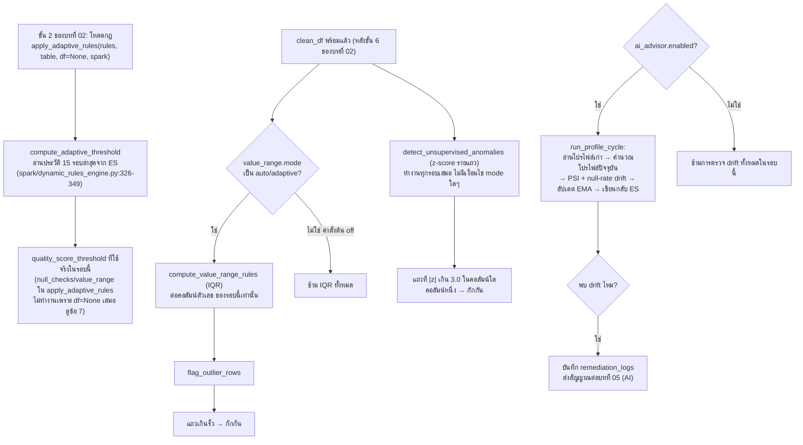

# 04. เกณฑ์แบบปรับตัว การตรวจจับความผิดปกติ และการเลื่อนของข้อมูล (Adaptive thresholds, anomaly detection and drift)

> ผู้ใช้เห็นส่วนนี้ที่: Dashboards, Query & Metrics, Audit Trail (เหตุผลกักกันที่ลงท้ายด้วย `_zscore=...` หรือ `(expected [...])`, ฟิลด์ `effective_quality_threshold`, `value_range_profile`, `remediation_logs` ที่มีข้อความ `profile_drift_detected_...`) · โค้ดหลัก: `spark/dynamic_rules_engine.py:112-762`, `spark/data_profile_store.py:166-673`

## 1. คำตอบ 30 วินาที

บทนี้อธิบาย 5 กลไกที่ [บทที่ 02](02-spark-batch-quality-engine.md) เรียกใช้แต่ไม่ได้ลงรายละเอียดสูตร: เกณฑ์คะแนนคุณภาพแบบปรับตัว (`compute_adaptive_threshold`, ใช้ประวัติ 15 รอบจริงของตารางนั้นจาก Elasticsearch), รั้ว IQR (`compute_value_range_rules`) และ **z-score รายแถว** (`detect_unsupervised_anomalies`) ที่คำนวณจากสถิติของ**เฉพาะข้อมูลรอบปัจจุบัน** ไม่ใช่ประวัติ (คนละกลไกกับ z-score ของอัตรากักกันทั้งรอบในบทที่ 02 ซึ่งใช้ประวัติข้ามรอบ), และการตรวจ**การเลื่อนของการกระจายข้อมูล (distribution drift)** ด้วย **PSI** บวกการตรวจอัตราค่าว่างเทียบค่าเฉลี่ยเคลื่อนที่แบบ **EMA** ทั้งหมดเป็นสูตรทางสถิติล้วน ไม่มีจุดใดฝึกหรือเรียกใช้โมเดลแมชชีนเลิร์นนิงเลย ("adaptive" ในที่นี้แปลว่า "คำนวณจากตัวเลขของข้อมูลเอง" ไม่ใช่ "เรียนรู้ข้ามเวลาแบบโมเดล" — ดูข้อ 8) ข้อจำกัดหลักคือ IQR และ z-score รายแถวมองเห็นแค่ข้อมูลของรอบเดียว ไม่มีความจำข้ามรอบ ส่วน z-score รายแถวไม่มีตัวป้องกันเหมือนกลไกอื่นในระบบเดียวกัน (ไม่มี floor ของส่วนเบี่ยงเบนมาตรฐาน ไม่มี dead-band) จึงถูกค่าผิดปกติสุดขั้วบดบังตัวเองได้ (ดูข้อ 5)

## 2. มุมมองแบบ Black Box

ผู้ใช้ไม่เห็นหน้าจอเฉพาะสำหรับกลไกในบทนี้ — ผลของมันแทรกอยู่ในสิ่งที่ [บทที่ 02](02-spark-batch-quality-engine.md) แสดงอยู่แล้ว:

- แถวที่ถูกกักกันบางแถวมีเหตุผลรูปแบบ `<คอลัมน์>=<ค่า> (expected [ล่าง, บน])` (มาจาก IQR) หรือ `<คอลัมน์>_zscore=<ค่า> (val=<คอลัมน์> deviates > 3.0σ)` (มาจาก z-score รายแถว) ปนอยู่กับเหตุผลอื่นในหน้า Audit Trail และไฟล์กักกัน
- เอกสารผลรอบใน Elasticsearch (ที่ Query & Metrics และ Dashboards อ่าน) มีฟิลด์ `effective_quality_threshold` (ตัวเลขที่คำนวณจากบทนี้ ไม่ใช่ค่าคงที่ตายตัวเสมอไป) และ `value_range_profile` (รั้ว IQR ของแต่ละคอลัมน์ในรอบนั้น)
- ถ้าเปิด `ai_advisor` ไว้ (ต่อตาราง) `remediation_logs` ของรอบนั้นจะมีข้อความ `profile_drift_detected_<n>_columns` เมื่อพบการเลื่อนของข้อมูล ซึ่งเป็นสัญญาณที่ส่งต่อไปยัง [บทที่ 05 — AI ในระบบ](05-ai-in-the-system.md)

ผู้ใช้จึงเห็นแค่ "ผลลัพธ์ปลายทาง" (ตัวเลขเกณฑ์ ข้อความเหตุผล) โดยไม่เห็นว่าเบื้องหลังมีสูตรและแหล่งข้อมูลคนละชุดกันถึง 4-5 ชุดผสมกันอยู่ บทนี้แกะแต่ละชุดออกมาทีละสูตร

## 3. การทำงานภายใน (White Box)

กลไกทั้งหมดอยู่ในไฟล์ `spark/dynamic_rules_engine.py` (เกณฑ์ปรับตัว, IQR, z-score รายแถว) และ `spark/data_profile_store.py` (โปรไฟล์ข้อมูล, PSI, EMA, การตรวจค่าว่างเลื่อน) ทั้งสองไฟล์ไม่ได้ทำงานเป็นลำดับเดียวต่อเนื่องกัน แต่ถูกเรียกจาก [บทที่ 02](02-spark-batch-quality-engine.md) คนละจุด คนละเงื่อนไข ดังนี้



### 3.1 เกณฑ์คะแนนคุณภาพแบบปรับตัว — `compute_adaptive_threshold`

เรียกผ่าน `apply_adaptive_rules` ที่ `spark/spark_quality_engine.py:1724-1731` **ก่อน**อ่านข้อมูลดิบ (`df=None` ถูกส่งเข้าไปตรงๆ ที่บรรทัด 1726) สูตร (`spark/dynamic_rules_engine.py:268-354`):

1. ดึงเอกสาร `window` (ค่าตั้งต้น 15) รอบล่าสุดของ**ตารางเดียวกัน**จากดัชนี `sdoqap_quality_runs` เรียงตามเวลาล่าสุดก่อน (`:307-316`)
2. ถ้า `ELASTICSEARCH_URL` ไม่ได้ตั้งค่า, query ล้มเหลว (HTTP ≠ 200), หรือดึงค่ามาได้น้อยกว่า 2 ค่า → คืน `base_value` (ค่าจากไฟล์กฎ) ทันที ไม่คำนวณอะไรเลย (`:303-305`, `:321-324`, `:336-339`)
3. ถ้ามีอย่างน้อย 2 ค่า: `moving_avg = mean(values)`, `std_dev = statistics.stdev(values)` (ส่วนเบี่ยงเบนมาตรฐานแบบ**ตัวอย่าง** หารด้วย n−1 — สังเกตว่าฟังก์ชันนี้**ไม่มี floor** ของ `std_dev` เหมือนกลไกอื่นในระบบ แต่ก็ไม่จำเป็นเพราะสูตรเป็นการ*ลบ* ไม่ใช่การ*หาร*) แล้ว `adaptive_threshold = max(moving_avg − std_dev, min_value)` (`:341-344`)
4. `min_value` (ค่าตั้งต้น 70.0) เป็นพื้นตายตัวที่เกณฑ์ลดต่ำกว่านี้ไม่ได้ ไม่ว่าประวัติจะแย่แค่ไหน

ผลลัพธ์ถูกห่อกลับเข้า `rules["quality_score_threshold"]` โดยเก็บ `base_value` เดิมไว้ในคีย์ `_static_base_value` (`spark/dynamic_rules_engine.py:424-430`) แล้วอ่านออกมาใช้จริงผ่าน `resolve_rule_value` (`spark/spark_quality_engine.py:1566-1574`, `:1733`)

### 3.2 รั้ว IQR — `compute_value_range_rules`

เรียกจากจุดที่ **แยกต่างหาก**จาก `apply_adaptive_rules` โดยสิ้นเชิง — ที่ `spark/spark_quality_engine.py:2231-2264`, **หลัง**ข้อมูลผ่านขั้นตรวจรายแถวแล้ว (`clean_df`) ทำงานก็ต่อเมื่อ `value_range.mode` เป็น `"auto"` หรือ `"adaptive"` (ค่าตั้งต้นของกฎที่จุดเรียกนี้คือ `"off"`) คอลัมน์ตัวเลขมาจากชนิดใน `schema_spec` (`IntegerType`/`DoubleType`) ไม่ใช่จากการเดาชนิดของ Spark ต่อคอลัมน์:

1. `df.stat.approxQuantile(col, [0.25, 0.75], 0.01)` — **relativeError = 0.01** (`spark/dynamic_rules_engine.py:239`) หมายความว่าอันดับที่ได้อาจคลาดเคลื่อนได้ไม่เกิน 1% ของจำนวนแถวจากอันดับจริง (ดูตัวอย่างจริงในข้อ 5 ว่าต่างจาก Python เชิงเส้นอย่างไร)
2. `iqr = q3 − q1`, `lower_bound = q1 − 1.5×iqr`, `upper_bound = q3 + 1.5×iqr` (ตัวคูณ 1.5 เป็นค่าเริ่มต้นของพารามิเตอร์ `multiplier`, ปรับได้ผ่านกฎ `value_range.iqr_multiplier`)
3. ผลลัพธ์ส่งต่อให้ `flag_outlier_rows` (`spark/dynamic_rules_engine.py:498-589`) ติดธง `_outlier_flag` และสร้างข้อความ `_outlier_details` ต่อแถว แถวที่ค่าคอลัมน์ใดคอลัมน์หนึ่งอยู่นอกรั้วถูกกักกันทันที (`is_invalid=True`, `reject_reason` = ข้อความรายละเอียดนั้น)

### 3.3 z-score รายแถว — `detect_unsupervised_anomalies`

เรียกที่ `spark/spark_quality_engine.py:2266-2289` **ไม่มีเงื่อนไข mode ใดๆ ทั้งสิ้น** — ทำงานทุกรอบตราบใดที่มีคอลัมน์ตัวเลข ต่างจาก IQR ที่ต้องเปิดโหมดก่อน สูตร (`spark/dynamic_rules_engine.py:593-676`):

1. คำนวณ `F.mean(col)` และ `F.stddev(col)` (Spark's `F.stddev` คือ `stddev_samp` — ส่วนเบี่ยงเบนมาตรฐาน**ตัวอย่าง** หารด้วย n−1 เช่นเดียวกับ `compute_adaptive_threshold`) ของ**ข้อมูลรอบปัจจุบันทั้งหมด**ในครั้งเดียว (single aggregation pass)
2. ถ้า `stddev` เป็น `None` หรือ 0 (คอลัมน์ค่าเดียวทั้งหมด) — ข้ามคอลัมน์นั้นไปเลย ไม่คำนวณ z-score
3. `z = |value − mean| / stddev`; ถ้า `z > threshold` (ค่าตั้งต้น 3.0, และค่าที่ใช้จริงที่จุดเรียกก็ hardcode เป็น 3.0 เช่นกัน) → ติดธง `_unsupervised_anomaly = true` พร้อมรายละเอียด `<col>_zscore=<ค่า>`
4. **ไม่มี floor ของ stddev และไม่มี dead-band** เหมือนที่ z-score ของอัตรากักกันในบทที่ 02 มี (σ floor 0.05, dead-band 0.02) — จุดนี้เป็นสูตร z-score "ดิบ" ที่สุดในทั้งระบบ (ดูผลกระทบในข้อ 5 และ 8)

หมายเหตุสำคัญ: mean/stddev ที่ใช้ตัดสิน**มาจากข้อมูลชุดเดียวกับที่กำลังถูกตรวจเอง** (ไม่ใช่ประวัติจากรอบก่อนหน้าเหมือนข้อ 3.1) — ค่าที่ผิดปกติมากพอจะไปเปลี่ยนทั้ง mean และ stddev ที่ใช้วัดตัวมันเอง (ดูตัวอย่างจริงในข้อ 5)

### 3.4 การเลื่อนของข้อมูล (drift) — `data_profile_store.py`

ทำงานเฉพาะเมื่อกฎของตาราง `ai_advisor.enabled = true` (`spark/spark_quality_engine.py:2612-2636`) ผ่าน `run_profile_cycle(profile_df, table_name)` (`spark/data_profile_store.py:574-661`) ซึ่งอ่านข้อมูลจาก Delta ที่เพิ่งเขียนเสร็จ (`active_path`) ไม่ใช่ `clean_df` ในหน่วยความจำโดยตรง:

1. **อ่านโปรไฟล์เก่า** จากดัชนี `sdoqap_data_profiles` (`read_profile`, `:92-132`) ถ้าไม่มีเลยถือเป็น `is_first_run` — ข้ามการตรวจ drift ทั้งหมดในรอบแรก (ไม่มี baseline ให้เทียบ)
2. **คำนวณโปรไฟล์ปัจจุบัน** (`compute_current_profile`, `:166-283`) — อัตราค่าว่างของทุกคอลัมน์ + `mean/stddev/min/max/percentiles/skewness/kurtosis/cardinality` ของคอลัมน์ตัวเลข พร้อมสร้าง `histogram_boundaries` (จุดตัดควอนไทล์ **10 ช่วง** จาก `df.stat.approxQuantile(col, [0/10,1/10,...,10/10], 0.02)` — สังเกตว่าใช้ `relativeError=0.02` ต่างจาก IQR ที่ใช้ 0.01)
3. **ตรวจ distribution drift ด้วย PSI** (`detect_distribution_drift` → `compute_psi`, ข้อ 3.5 ด้านล่าง) เทียบ batch ปัจจุบันกับ `histogram_boundaries` ที่เก็บไว้จากรอบก่อน
4. **ตรวจ null-rate drift** (`detect_null_rate_drift`, `:513-567`) — ดูข้อ 3.6
5. **อัปเดตโปรไฟล์ด้วย EMA** (`update_profiles_ema`, ข้อ 3.7) แล้วเขียนกลับ ES ทีละคอลัมน์ (`write_profile`)

ถ้า `total_drifted_columns > 0` (นับรวมทั้ง PSI drift และ null-rate drift) รอบนั้นบันทึก `profile_drift_detected_<n>_columns` และถือเป็นสัญญาณ escalate ไปยังการวิเคราะห์ของ AI Advisor ต่อ แม้ `is_anomaly` (z-score อัตรากักกันของบทที่ 02) จะเป็น `false` ก็ตาม (`spark/spark_quality_engine.py:2626-2640`) — **การเลื่อนของการกระจายข้อมูล (distribution drift) เป็นคนละเรื่องกับการเลื่อนของ schema (schema drift)** ที่ [บทที่ 09](09-schema-drift-and-catalog.md) อธิบาย: schema drift คือ "คอลัมน์หาย/เพิ่ม/ชนิดเปลี่ยน" ส่วน drift ในบทนี้คือ "ค่าที่ยังอยู่ในคอลัมน์เดิม แต่การกระจายของค่าต่างไปจากเดิม" — ตรวจคนละกลไก คนละดัชนี ES คนละที่ในโค้ดโดยสิ้นเชิง

### 3.5 Population Stability Index (PSI)

**PSI** (Population Stability Index — ตัวเลขเดียวที่สรุปว่าการกระจายของข้อมูลเปลี่ยนไปจากเดิมมากแค่ไหน โดยแบ่งข้อมูลเป็นช่วงๆ แล้วเทียบสัดส่วนในแต่ละช่วง) คำนวณที่ `compute_psi` (`spark/data_profile_store.py:389-454`):

1. รับ `baseline_boundaries` (จุดตัดควอนไทล์จากโปรไฟล์รอบก่อน) ต้องมีอย่างน้อย 3 ค่า (คือ ≥ 2 ช่วง) ไม่งั้นคืน `-1.0` (คำนวณไม่ได้)
2. `expected_prop = 1 / n_buckets` — **สมมติว่า baseline กระจายเท่ากันทุกช่วง** ไม่ได้วัดสัดส่วนจริงของ baseline ณ เวลาที่เทียบ (ใช้ได้ถูกต้องเพราะ `baseline_boundaries` เป็นจุดตัดควอนไทล์ที่บังคับให้แต่ละช่วงมี 1/n_buckets ของข้อมูล ณ ตอนสร้างเท่านั้น — ดูข้อ 7 สำหรับข้อจำกัดของสมมติฐานนี้)
3. นับจำนวนแถวของ batch ปัจจุบันที่ตกในแต่ละช่วง (ช่วงแรก `<= ขอบบน`, ช่วงสุดท้าย `> ขอบล่าง`, ช่วงกลาง `> ขอบล่าง และ <= ขอบบน`) หารด้วยจำนวนแถวทั้งหมดได้ `actual_prop`
4. ทั้ง `actual_prop` และ `expected_prop` ถูก floor ไว้ที่ `epsilon = 1e-6` กัน `log(0)` และหารด้วยศูนย์
5. `PSI = Σ (actual_prop − expected_prop) × ln(actual_prop / expected_prop)` สะสมทีละช่วง แล้ว `round(abs(psi), 6)`

ตีความผล (`spark/data_profile_store.py:70-71`, ใช้ที่ `detect_distribution_drift:486-494`): `PSI ≤ 0.1` = `STABLE`, `0.1 < PSI ≤ 0.25` = `MODERATE_DRIFT`, `PSI > 0.25` = `CRITICAL_DRIFT`

### 3.6 การตรวจอัตราค่าว่างเลื่อน (null-rate drift)

`detect_null_rate_drift` (`spark/data_profile_store.py:513-567`) เทียบ `current_null_rate` ของรอบนี้กับ `null_rate_ema` ที่เก็บไว้จากรอบก่อน (ไม่ใช่เทียบกับรอบก่อนโดยตรง แต่เทียบกับค่าเฉลี่ยเคลื่อนที่):

| เงื่อนไข | สถานะ |
|---|---|
| `ema_rate ≤ 0` และ `current_rate > 0.05` | `NEW_NULLS_DETECTED` |
| `current_rate > ema_rate × 3.0` และ `current_rate > 0.05` | `CRITICAL_NULL_DRIFT` |
| `current_rate > ema_rate × 2.0` และ `current_rate > 0.03` | `MODERATE_NULL_DRIFT` |
| อื่นๆ | `STABLE` (ไม่ถูกบันทึกลงผลลัพธ์เลย — เห็นเฉพาะคอลัมน์ที่ผิดปกติ) |

สังเกตว่าเงื่อนไขต้องผ่าน**ทั้งอัตราส่วน**（3 เท่า/2 เท่า）**และค่าสัมบูรณ์ขั้นต่ำ**（5%/3%）พร้อมกัน — ป้องกันคอลัมน์ที่ปกติมีค่าว่างน้อยมาก (เช่น 0.001%) ไม่ให้เปลี่ยนเป็น 0.004% (เพิ่มขึ้น 4 เท่า) แล้วถูกฟ้องว่าเป็น drift ทั้งที่ไม่มีนัยสำคัญในทางปฏิบัติ

### 3.7 EMA (Exponential Moving Average)

**EMA** (ค่าเฉลี่ยเคลื่อนที่แบบถ่วงน้ำหนักลดทอน — ผสมค่าใหม่กับค่าเก่าที่เก็บไว้ โดยให้น้ำหนักค่าใหม่คงที่ทุกครั้ง แทนที่จะเก็บค่าย้อนหลังทุกจุดไว้คำนวณเฉลี่ยใหม่) คำนวณที่ `update_profiles_ema` (`spark/data_profile_store.py:290-382`) ด้วย `alpha = EMA_ALPHA = 0.3` (ค่าคงที่ระดับโมดูล, `:69`):

```
new_value = α × current_value + (1 − α) × stored_value
```

ใช้กับสถิติการกระจาย (`mean, stddev, median, p5, p25, p75, p95, skewness, kurtosis`) ทีละตัว และกับ `null_rate_ema` แยกต่างหาก (`:344-365`) ส่วน `min`/`max` **ไม่ถูก EMA** แต่เก็บเป็นค่าสุดขั้วสะสมตลอดกาล (`min(curr, stored)` / `max(curr, stored)`, `:332-333`) และ `histogram_boundaries` (ที่ PSI ใช้เป็น baseline) **ไม่ถูก EMA เช่นกัน** แต่ถูกแทนที่ทั้งชุดด้วยของรอบล่าสุดเสมอ (`:372-375`) — ผลคือ "baseline" ของ PSI จริงๆ แล้วคือภาพรวมของรอบก่อนหน้าเพียงรอบเดียว ไม่ใช่ baseline ระยะยาวที่ถูกทำให้เรียบด้วย EMA เหมือนสถิติตัวอื่น (ดูข้อ 6 และ 7)

รอบแรกที่ไม่มีโปรไฟล์เก่าเลย (`stored_dist` ว่าง) ใช้ค่าปัจจุบันเป็น baseline ตรงๆ โดยไม่ผสม (`:337-338`)

## 4. เดินผ่านโค้ดจริง

**`compute_adaptive_threshold` — ส่วนที่ตัดสินค่าเกณฑ์จริง** (ส่วนอ่าน ES และ error-handling อยู่ก่อนบล็อกนี้ อธิบายไว้ในข้อ 3.1)

```python
# spark/dynamic_rules_engine.py:326-354
        hits = res.json().get("hits", {}).get("hits", [])
        values = []
        for hit in hits:
            v = hit.get("_source", {}).get(metric_key)
            if v is not None:
                try:
                    values.append(float(v))
                except (TypeError, ValueError):
                    pass

        if len(values) < 2:
            print(f"[DYNAMIC_RULES] Insufficient history ({len(values)} runs). "
                  f"Using base_value={base_value}.")
            return float(base_value)

        import statistics
        moving_avg = statistics.mean(values)
        std_dev = statistics.stdev(values)
        adaptive = max(moving_avg - std_dev, min_value)

        print(f"[DYNAMIC_RULES] Adaptive threshold for '{table_name}': "
              f"avg={moving_avg:.2f}, std={std_dev:.2f}, "
              f"threshold={adaptive:.2f} (base={base_value})")
        return round(adaptive, 4)

    except Exception as e:
        print(f"[DYNAMIC_RULES] Error computing adaptive threshold: {e}. "
              f"Falling back to base_value={base_value}.")
        return float(base_value)
```

| บรรทัด | ทำอะไร |
|---|---|
| 326-334 | แปลงแต่ละเอกสารที่ดึงมาให้เป็นตัวเลข `float` ข้ามค่าที่แปลงไม่ได้หรือเป็น `None` แบบเงียบๆ (ไม่นับรวมใน `values`) |
| 336-339 | ถ้าเหลือค่าที่ใช้ได้น้อยกว่า 2 ค่า **ไม่คำนวณสถิติใดๆ เลย** คืน `base_value` ทันที — ป้องกัน `statistics.stdev` ที่ต้องการอย่างน้อย 2 จุดข้อมูล |
| 341-344 | คำนวณค่าเฉลี่ยและส่วนเบี่ยงเบนมาตรฐาน**ตัวอย่าง** (n−1) ของประวัติ แล้ว `adaptive = max(avg − std, min_value)` — ลบด้วยส่วนเบี่ยงเบนมาตรฐานเสมอ ไม่ใช่บวก จึงเป็นเกณฑ์ที่ "เข้มงวดกว่าค่าเฉลี่ย" โดยอัตโนมัติ |
| 349 | ปัดเศษเป็น 4 ตำแหน่งทศนิยมก่อนคืนค่า |
| 351-354 | ดักข้อผิดพลาดอื่นทั้งหมดที่อาจเกิดระหว่างเรียก ES (timeout, network) แล้ว fallback ไป `base_value` เหมือนกัน |

**`compute_value_range_rules` — ส่วนที่ตัดสินรั้ว IQR ต่อคอลัมน์**

```python
# spark/dynamic_rules_engine.py:233-261
    for col_name in numeric_columns:
        if col_name not in available_columns:
            print(f"[DYNAMIC_RULES] Column '{col_name}' not in DataFrame — skipped.")
            continue
        try:
            # approxQuantile is preferred for large datasets: O(n) single pass.
            quantiles = df.stat.approxQuantile(col_name, [0.25, 0.75], 0.01)
            if len(quantiles) < 2 or quantiles[0] is None or quantiles[1] is None:
                print(f"[DYNAMIC_RULES] Could not compute quantiles for '{col_name}'.")
                continue

            q1, q3 = quantiles[0], quantiles[1]
            iqr = q3 - q1
            lower_bound = q1 - (multiplier * iqr)
            upper_bound = q3 + (multiplier * iqr)

            value_ranges[col_name] = {
                "q1": round(q1, 6),
                "q3": round(q3, 6),
                "iqr": round(iqr, 6),
                "lower_bound": round(lower_bound, 6),
                "upper_bound": round(upper_bound, 6),
                "method": method,
            }
        except Exception as e:
            print(f"[DYNAMIC_RULES] Error computing range for '{col_name}': {e}")

    print(f"[DYNAMIC_RULES] Value-range rules computed for {len(value_ranges)} columns.")
    return value_ranges
```

| บรรทัด | ทำอะไร |
|---|---|
| 233-236 | ข้ามคอลัมน์ที่ผู้เรียกระบุมาแต่ไม่มีจริงใน DataFrame |
| 239 | `approxQuantile` ด้วย `relativeError = 0.01` — ยิ่งเลขนี้เล็ก ยิ่งแม่นยำแต่ยิ่งช้า/ใช้หน่วยความจำมากขึ้นกับข้อมูลใหญ่ (ดูข้อ 5 สำหรับผลต่างจากการคำนวณแบบไม่ประมาณ) |
| 240-242 | ถ้าคำนวณควอนไทล์ไม่ได้ (เช่นคอลัมน์ว่างทั้งหมด) ข้ามคอลัมน์นั้น ไม่ใส่ค่าอะไรใน `value_ranges` |
| 244-247 | สูตร Tukey fence มาตรฐาน: `IQR = Q3−Q1`, รั้วล่าง/บน = `Q1/Q3 ∓ multiplier×IQR` |
| 249-256 | เก็บทุกค่าที่ปัดเศษ 6 ตำแหน่งไว้ใน dict คืนค่า พร้อมชื่อ `method` (ปัจจุบันมีแค่ `"iqr"` — ค่า `method` พารามิเตอร์ของฟังก์ชันนี้ไม่ได้ถูกใช้เลือกอัลกอริทึมจริง เป็นแค่ป้ายกำกับที่คัดลอกกลับ) |
| 257-258 | ข้อผิดพลาดอื่นต่อคอลัมน์ไม่ทำให้ทั้งฟังก์ชันล้ม แค่ข้ามคอลัมน์นั้นไป |

**`detect_unsupervised_anomalies` — ส่วนที่ตัดสิน z-score รายแถว**

```python
# spark/dynamic_rules_engine.py:616-645
    # Compute mean and stddev for all numeric columns in a single aggregation
    stats_exprs = []
    for col in numeric_columns:
        stats_exprs.append(F.mean(col).alias(f"{col}_mean"))
        stats_exprs.append(F.stddev(col).alias(f"{col}_stddev"))

    try:
        stats = df.select(*stats_exprs).first()
        if not stats:
            return df.withColumn("_unsupervised_anomaly", F.lit(False)).withColumn("_unsupervised_anomaly_details", F.lit(""))
    except Exception as e:
        print(f"[DYNAMIC_RULES] Failed to compute column statistics for unsupervised check: {e}")
        return df.withColumn("_unsupervised_anomaly", F.lit(False)).withColumn("_unsupervised_anomaly_details", F.lit(""))

    anomaly_conditions = []
    detail_exprs = []

    for col in numeric_columns:
        mean_val = stats[f"{col}_mean"]
        std_val = stats[f"{col}_stddev"]

        # Handle zero variance or single-value columns
        if std_val is None or std_val == 0.0:
            continue

        # Z-score condition: abs(val - mean) / stddev > threshold
        z_score_expr = F.abs(F.col(col) - F.lit(mean_val)) / F.lit(std_val)
        is_anomaly = z_score_expr > F.lit(threshold)
        anomaly_conditions.append(is_anomaly)

```

| บรรทัด | ทำอะไร |
|---|---|
| 616-620 | สร้างนิพจน์รวม `F.mean` และ `F.stddev` ของทุกคอลัมน์ตัวเลขที่ขอมา เพื่อคำนวณทั้งหมดในเพียง**หนึ่งรอบการ aggregate** (ประหยัดกว่าคำนวณทีละคอลัมน์) |
| 622-628 | ดึงแถวผลลัพธ์เดียว (`.first()`) ถ้าไม่มีผลหรือเกิดข้อผิดพลาด คืน DataFrame เดิมพร้อมธง `False` ทั้งหมดทันที |
| 633-639 | วนทีละคอลัมน์ ถ้า stddev เป็น `None` หรือ 0 (ทุกค่าในคอลัมน์เท่ากันหมด) **ข้ามคอลัมน์นั้นไปเลย ไม่มีทางถูกตั้งธงจากคอลัมน์นี้** |
| 641-643 | สูตร z-score มาตรฐาน `\|value − mean\| / stddev` เทียบกับ `threshold` (ส่งเข้ามาเป็น 3.0 จากจุดเรียก) — **mean และ stddev ที่ใช้มาจากบรรทัด 619-620 ของโค้ดบล็อกเดียวกันนี้ คือสถิติของข้อมูล batch เดียวกับที่กำลังตรวจ ไม่ใช่ประวัติ** |
| 644 | สะสมเงื่อนไขไว้ในลิสต์ เพื่อรวมเป็นเงื่อนไข "ผิดปกติในคอลัมน์ใดคอลัมน์หนึ่ง" ในบรรทัดถัดจากบล็อกนี้ (`spark/dynamic_rules_engine.py:659-662`) |

**`update_profiles_ema` — ส่วนที่ตัดสินการผสมค่าสถิติเก่า/ใหม่**

```python
# spark/data_profile_store.py:311-338
    alpha = EMA_ALPHA
    updated = {}

    for col_name, current in current_profiles.items():
        stored = stored_profiles.get(col_name, {})
        merged = {}

        # ── Distribution: EMA update ──────────────────────────────────────
        curr_dist = current.get("distribution", {})
        stored_dist = stored.get("distribution", {})

        if curr_dist:
            if stored_dist:
                merged_dist = {}
                for key in ["mean", "stddev", "median", "p5", "p25", "p75", "p95",
                            "skewness", "kurtosis"]:
                    curr_val = curr_dist.get(key, 0.0)
                    stored_val = stored_dist.get(key, curr_val)
                    merged_dist[key] = round(alpha * curr_val + (1 - alpha) * stored_val, 6)
                
                # min/max: keep absolute extremes
                merged_dist["min"] = min(curr_dist.get("min", 0), stored_dist.get("min", float('inf')))
                merged_dist["max"] = max(curr_dist.get("max", 0), stored_dist.get("max", float('-inf')))
                merged_dist["non_null_count"] = curr_dist.get("non_null_count", 0)
                merged["distribution"] = merged_dist
            else:
                # First run: use current as baseline
                merged["distribution"] = curr_dist
```

| บรรทัด | ทำอะไร |
|---|---|
| 311 | ตั้ง `alpha` จากค่าคงที่ระดับโมดูล `EMA_ALPHA = 0.3` (`spark/data_profile_store.py:69`) |
| 322-323 | ทำ EMA เฉพาะเมื่อมีทั้งโปรไฟล์ปัจจุบัน**และ**โปรไฟล์เก่า — ถ้าไม่มีโปรไฟล์เก่า ข้ามไปกิ่ง `else` |
| 325-329 | วนทีละสถิติ 9 ตัว ใช้สูตร `α×ปัจจุบัน + (1−α)×เก่า` ทุกตัวเหมือนกัน ปัดเศษ 6 ตำแหน่ง — ถ้าค่าปัจจุบันไม่มีให้ default 0.0, ถ้าค่าเก่าไม่มีใช้ค่าปัจจุบันแทน (เท่ากับ EMA ครั้งแรกของสถิติตัวนั้นๆ) |
| 332-333 | `min`/`max` **ไม่ใช้สูตร EMA** แต่เก็บค่าสุดขั้วที่เคยเจอมาตลอด (`min`/`max` ของค่าเดิมกับค่าใหม่) |
| 337-338 | รอบแรกที่ไม่มีโปรไฟล์เก่าเลย ใช้ค่าปัจจุบันเป็นฐานตรงๆ โดยไม่ผสมกับอะไร |

**`compute_psi` — ส่วนที่ตัดสินค่า PSI ต่อคอลัมน์**

```python
# spark/data_profile_store.py:421-450
        total_count = df.filter(F.col(col_name).isNotNull()).count()
        if total_count == 0:
            return -1.0

        n_buckets = len(baseline_boundaries) - 1
        # Expected proportion per bucket (uniform from baseline quantiles)
        expected_prop = 1.0 / n_buckets

        psi = 0.0
        epsilon = 1e-6  # Prevent log(0) and division by zero

        for i in range(n_buckets):
            lower = baseline_boundaries[i]
            upper = baseline_boundaries[i + 1]

            if i == 0:
                bucket_count = df.filter(F.col(col_name) <= upper).count()
            elif i == n_buckets - 1:
                bucket_count = df.filter(F.col(col_name) > lower).count()
            else:
                bucket_count = df.filter(
                    (F.col(col_name) > lower) & (F.col(col_name) <= upper)
                ).count()

            actual_prop = max(bucket_count / total_count, epsilon)
            expected = max(expected_prop, epsilon)

            psi += (actual_prop - expected) * math.log(actual_prop / expected)

        return round(abs(psi), 6)
```

| บรรทัด | ทำอะไร |
|---|---|
| 421-423 | นับแถวที่ไม่ใช่ค่าว่างของคอลัมน์นี้ในข้อมูลรอบปัจจุบัน ถ้าไม่มีแถวเลยคืน `-1.0` (คำนวณไม่ได้) |
| 425-427 | จำนวนช่วง = จำนวนจุดตัด−1 สัดส่วนที่ "คาดว่าจะเจอ" ในแต่ละช่วงคือ**ค่าคงที่เท่ากันทุกช่วง** ไม่ใช่สัดส่วนจริงที่วัดจาก baseline ตรงๆ (ดูข้อ 3.5 และ 7) |
| 432-443 | วนทีละช่วง นับแถวของ batch ปัจจุบันที่ตกอยู่ในช่วงนั้นตามกติกา: ช่วงแรกรวมทุกค่า ≤ ขอบบน, ช่วงสุดท้ายรวมทุกค่า > ขอบล่าง (กันค่าที่หลุดขอบเขตเดิมของ baseline ไปทั้งสองด้าน), ช่วงกลางเป็นช่วงเปิด-ปิดปกติ |
| 445-448 | ทั้งสัดส่วนจริงและสัดส่วนคาดหวังถูก floor ที่ `epsilon=1e-6` ก่อนหาร/ log กัน error ถ้าช่วงใดไม่มีข้อมูลตกเลย (`actual_prop` จะเป็น 0 พอดี ซึ่ง log(0) ไม่ได้) สะสมผลคูณ `(actual−expected)×ln(actual/expected)` ของทุกช่วงเข้า `psi` |
| 450 | ปัดเศษค่าสัมบูรณ์ของผลรวมเป็น 6 ตำแหน่ง — ใช้ `abs()` เผื่อการสะสมของพจน์ลบ/บวกทำให้ผลรวมติดลบเล็กน้อยจากความคลาดเคลื่อนจุดทศนิยม (ทางทฤษฎี PSI ที่คำนวณถูกต้องไม่ควรติดลบอยู่แล้วเพราะแต่ละพจน์มีเครื่องหมายเดียวกับ `actual−expected` คูณ `ln` ที่มีเครื่องหมายเดียวกันเสมอ) |

## 5. ตัวอย่างการคำนวณจริง

หลักฐานทั้งหมดของข้อนี้อยู่ใน `evidence/04-worked-math.txt` (สคริปต์ `ws04.py` คำนวณด้วยค่าคงที่จริงของโค้ด แล้วรันจริงด้วย `PYTHONIOENCODING=utf-8 python`) Docker Desktop เข้าถึงไม่ได้ในเซสชันที่เขียนบทนี้ (`docker ps` คืนข้อผิดพลาด `open //./pipe/dockerDesktopLinuxEngine: The system cannot find the file specified.`) จึงไม่มีการรัน Spark จริงเทียบเพิ่มเติม — การเทียบอัลกอริทึมควอนไทล์ด้านล่างเป็นการวิเคราะห์จากพฤติกรรมที่มีเอกสารของ `approxQuantile` เทียบกับสูตร Python ธรรมดา ไม่ใช่ผลรันจริงสองระบบเทียบกัน

**5.1 รั้ว IQR ของชุดข้อมูล `[4, 5, 5, 6, 6, 7, 30]` (คำนวณด้วยมือจากสูตรที่ `spark/dynamic_rules_engine.py:239-247`)**

`df.stat.approxQuantile` เป็นอัลกอริทึมสรุปควอนไทล์แบบประมาณ (คล้าย Greenwald-Khanna) ควบคุมความคลาดเคลื่อนด้วย `relativeError` (ที่นี่ 0.01) และ**คืนค่าที่มีอยู่จริงในข้อมูล** ไม่ได้เฉลี่ยถ่วงน้ำหนักระหว่างสองค่าเหมือนสูตร "เชิงเส้น (linear interpolation)" ที่ไลบรารี Python ทั่วไป (เช่น `numpy.percentile` แบบค่าเริ่มต้น) ใช้ ด้วย `n=7` และ `relativeError=0.01` ความคลาดเคลื่อนอันดับที่ยอมให้มีคือ `0.01×7=0.07` อันดับ — น้อยกว่า 1 อันดับ จึงเทียบเท่าการหาอันดับแบบแม่นตรง (nearest-rank) ไม่ใช่การประมาณจริงจังสำหรับข้อมูลเล็กขนาดนี้

| วิธี | Q1 | Q3 | IQR | รั้วล่าง | รั้วบน | 30 เกินรั้วบนไหม |
|---|---|---|---|---|---|---|
| แบบ Spark (nearest-rank, จำลอง approxQuantile) | 5 | 7 | 2 | 2.0 | 10.0 | ใช่ (30 > 10.0) |
| แบบ Python เชิงเส้น (linear interpolation, เพื่อเทียบ) | 5.0 | 6.5 | 1.5 | 2.75 | 8.75 | ใช่ (30 > 8.75) |

ทั้งสองวิธีสรุปตรงกันว่า 30 เป็นค่าผิดปกติ แต่ค่ารั้วบนที่แน่นอน (10.0 เทียบ 8.75) **ต่างกันจริง** — ถ้ามีแถวที่ค่าอยู่ระหว่าง 8.75 กับ 10.0 พอดี สองวิธีนี้จะให้ผลตัดสินต่างกัน (วิธีหนึ่งว่าปกติ อีกวิธีว่าผิดปกติ) ดังนั้นการที่ระบบใช้ `approxQuantile` แทนการคำนวณควอนไทล์แบบเชิงเส้นมีผลจริงต่อขอบเขตที่ใช้กักกันแถว ไม่ใช่แค่รายละเอียดภายในที่ไม่กระทบผลลัพธ์

**5.2 z-score รายแถวของชุดข้อมูลเดียวกัน (คำนวณด้วยมือจากสูตรที่ `spark/dynamic_rules_engine.py:641-643`)**

```
mean = 9.0, stddev (ตัวอย่าง, n−1, เหมือน F.stddev ของ Spark) = 9.3095
```

| ค่า | z-score | เกิน 3.0 ไหม |
|---|---|---|
| 4 | 0.5371 | ไม่ |
| 5 | 0.4297 | ไม่ |
| 5 | 0.4297 | ไม่ |
| 6 | 0.3223 | ไม่ |
| 6 | 0.3223 | ไม่ |
| 7 | 0.2148 | ไม่ |
| 30 | 2.2558 | **ไม่** |

ผลที่ยืนยันจาก `evidence/04-worked-math.txt`: **ไม่มีแถวใดถูกตั้งธง `_unsupervised_anomaly` เลย แม้แต่ค่า 30** เหตุผลคือค่า 30 เองไปดันทั้ง `mean` (จาก ~5.5 เป็น 9.0) และ `stddev` (สูงถึง 9.31) ให้สูงขึ้นมาก ทำให้ระยะห่างของมันเองเมื่อวัดเป็น "จำนวนส่วนเบี่ยงเบนมาตรฐาน" กลับไม่เกินเกณฑ์ — ปรากฏการณ์นี้เรียกว่า **masking/swamping effect** เป็นจุดอ่อนที่รู้จักกันดีของ z-score เมื่อใช้ตรวจจับค่าผิดปกติสุดขั้วเพียงจุดเดียวในชุดข้อมูลเล็ก **นี่คือความต่างสำคัญกับ IQR ในข้อ 5.1 ที่จับ 30 ได้ถูกต้อง** เพราะ IQR อิงตำแหน่งอันดับ (median-based) ซึ่งค่าผิดปกติเดี่ยวๆ ไม่มีอิทธิพลต่อ Q1/Q3 มากนัก ในขณะที่ z-score อิงค่าเฉลี่ยและส่วนเบี่ยงเบนมาตรฐาน ซึ่งค่าผิดปกติสุดขั้วมีอิทธิพลสูงมาก (ดูข้อ 6 และ 8)

**5.3 EMA หนึ่งครั้งของค่าเฉลี่ยที่เก็บไว้ (คำนวณด้วยมือจากสูตรที่ `spark/data_profile_store.py:329`)**

สมมติ: ค่าเฉลี่ยที่เก็บไว้จากรอบก่อน (`stored_value`) = 100.0, ค่าเฉลี่ยของ batch รอบนี้ (`curr_val`) = 130.0, `α = EMA_ALPHA = 0.3`

```
new_mean = 0.3 × 130.0 + 0.7 × 100.0 = 39.0 + 70.0 = 109.0    ✓ (evidence/04-worked-math.txt)
```

ค่าที่เก็บกลับ ES จึงขยับจาก 100.0 มาที่ 109.0 เพียง 9 หน่วย ไม่ใช่กระโดดไปที่ 130.0 เต็มค่าของรอบนี้ทันที — ต้องผ่านหลายรอบติดต่อกันที่ batch ยังคงสูงแบบนี้ ค่าที่เก็บไว้จึงจะค่อยๆ ไล่ตามทัน

**5.4 PSI ของการแจกแจง 4 กลุ่ม (คำนวณด้วยมือจากสูตรที่ `spark/data_profile_store.py:432-448`)**

`baseline_boundaries = [0, 10, 20, 30, 40]` (4 ช่วง, `expected_prop = 0.25` ทุกช่วง), batch ปัจจุบัน 20 ค่า กระจุกตัวเข้าช่วงต้นมากขึ้น:

| ช่วง | เงื่อนไข | จำนวนที่นับได้ | สัดส่วนจริง | สัดส่วนคาดหวัง | ผลคูณสะสม |
|---|---|---|---|---|---|
| 0 | x ≤ 10 | 9 | 0.4500 | 0.2500 | +0.117557 |
| 1 | 10 < x ≤ 20 | 6 | 0.3000 | 0.2500 | +0.009116 |
| 2 | 20 < x ≤ 30 | 3 | 0.1500 | 0.2500 | +0.051083 |
| 3 | x > 30 | 2 | 0.1000 | 0.2500 | +0.137444 |

```
PSI = 0.117557 + 0.009116 + 0.051083 + 0.137444 = 0.3152    ✓ (evidence/04-worked-math.txt)
เทียบเกณฑ์: 0.3152 > 0.25 → CRITICAL_DRIFT
```

ข้อมูลกระจุกตัวเข้าช่วงล่างมากขึ้น (45% ตกอยู่ในช่วงที่ "ควร" มีแค่ 25%) ถูกจับเป็น `CRITICAL_DRIFT` ทันที แม้จำนวนช่วงทั้งหมดจะมีแค่ 4 ช่วง (ระบบจริงใช้ 10 ช่วง ตัวอย่างนี้ลดเหลือ 4 ตามที่โจทย์กำหนดเพื่อให้ตารางคำนวณด้วยมือตามได้ง่าย)

**5.5 เกณฑ์คะแนนคุณภาพแบบปรับตัวจากประวัติสมมติ 10 รอบ (คำนวณด้วยมือจากสูตรที่ `spark/dynamic_rules_engine.py:341-344`)**

```
history = [92.5, 91.0, 93.2, 89.5, 90.1, 94.0, 88.7, 92.9, 91.5, 76.0]   (รอบสุดท้ายจำลองรอบที่แย่ลงมาก)
moving_avg = 89.94
std_dev (ตัวอย่าง, n−1) = 5.1861
adaptive_threshold = max(89.94 − 5.1861, min_value=70.0) = max(84.7539, 70.0) = 84.7539   ✓ (evidence/04-worked-math.txt)
```

สังเกตว่า `base_value` (สมมติ 90.0 ในตัวอย่างนี้) **ไม่ถูกผสมเข้าสูตรเลย** เมื่อมีประวัติเพียงพอ (≥ 2 ค่า) มันถูกใช้เป็นค่าคืนกลับแบบเต็มจำนวนเฉพาะตอนประวัติไม่พอเท่านั้น (ตัวอย่างกรณีนี้ก็อยู่ใน `evidence/04-worked-math.txt`: history เหลือ 1 ค่า → คืน `90.0` ทันที) เพื่ออ้างอิงกับข้อมูลจริงของระบบ: เอกสารผลรอบล่าสุดของตาราง `grocery_sales` (`evidence/02-latest-quality-run.json`, ใช้ซ้ำจากบทที่ 02 — [บทที่ 15 — เส้นทางข้อมูลต้นทางถึงปลายทาง](15-end-to-end-trace.md) ไล่ตามรอบเดียวกันนี้ตั้งแต่ไฟล์ดิบจนถึงผลลัพธ์) มี `effective_quality_threshold: 90.0` เท่ากับ `base_value` เป๊ะ ซึ่ง**สอดคล้องได้กับทั้งสองกรณี** — ประวัติของตารางนั้นไม่พอ (< 2 ค่า) ตอนคำนวณ หรือ ES เข้าถึงไม่ได้ชั่วขณะนั้น — ไม่สามารถชี้ขาดได้ว่าเป็นกรณีไหนในเซสชันนี้เพราะไม่มีสิทธิ์เข้าถึง Elasticsearch แบบสดเพื่อตรวจสอบ (ดูหมายเหตุ Docker ด้านบน)

## 6. ทำไมออกแบบแบบนี้ และทางเลือกอื่น

**ทำไมต้องมีเกณฑ์แบบปรับตัวเลย ในเมื่อมีค่าคงที่ในไฟล์กฎอยู่แล้ว** — ตารางแต่ละตารางมี "คุณภาพปกติ" ไม่เท่ากันโดยธรรมชาติ (บางตารางข้อมูลสะอาดตลอด 99%+ บางตารางมีสัญญาณรบกวนมากกว่าและอยู่แถว 80% เป็นปกติ) ถ้าใช้เกณฑ์ตายตัวเดียวกันทุกตาราง (เช่น 90%) ตารางที่ปกติต่ำกว่านั้นจะแจ้งเตือน `warnings` ทุกรอบทั้งที่ไม่มีอะไรผิดปกติจริง ในขณะที่ตารางที่ปกติสูงกว่ามากอาจไม่แจ้งเตือนแม้คุณภาพเริ่มตกลงจริง `compute_adaptive_threshold` แก้ปัญหานี้ด้วยการอิงประวัติ 15 รอบล่าสุดของ**ตารางนั้นเอง** ทางเลือกอื่นคือให้คนตั้งเกณฑ์แยกทีละตารางเอง (แม่นกว่าถ้าคนตั้งเข้าใจข้อมูลจริง) แต่ต้องมีคนคอยปรับเกณฑ์เมื่อพฤติกรรมข้อมูลเปลี่ยนไปตามธรรมชาติ (ฤดูกาล การเติบโตของธุรกิจ ฯลฯ) ซึ่งเกณฑ์แบบปรับตัวทำให้อัตโนมัติ แลกกับความเสี่ยงที่ตอบคำถามยาก (ข้อ 8) ว่าเกณฑ์ที่ "ปรับตาม" อาจไล่ตามข้อมูลที่แย่ลงเรื่อยๆ ได้เช่นกัน

**ทำไม IQR กับ z-score รายแถวใช้ข้อมูลแค่รอบเดียว ไม่ใช้ประวัติเหมือนเกณฑ์คะแนนคุณภาพ** — ทั้งสองกลไกตรวจ "แถวไหนในรอบนี้ผิดปกติเมื่อเทียบกับแถวอื่นในรอบเดียวกัน" ซึ่งเป็นคำถามคนละแบบจาก "รอบนี้ทั้งรอบผิดปกติเมื่อเทียบกับรอบก่อนๆ ไหม" (คำถามหลังต้องมีประวัติข้ามรอบ) การรวมสองกลไกแรกเข้ากับประวัติข้ามรอบจะซับซ้อนขึ้นมาก (ต้องตัดสินว่าค่าผิดปกติของรอบนี้ "ผิดปกติเทียบกับรอบนี้เอง" หรือ "ผิดปกติเทียบกับค่าปกติในอดีต" ต่างกัน) และ Spark คำนวณ `F.mean`/`F.stddev`/`approxQuantile` บน DataFrame ปัจจุบันได้ในการ pass เดียวอยู่แล้วโดยไม่ต้องพึ่งพา Elasticsearch เลย ทำให้สองกลไกนี้ทำงานได้แม้ ES ล่ม (ต่างจากเกณฑ์คะแนนคุณภาพที่ fallback ไป `base_value` ทันทีถ้า ES ใช้ไม่ได้) ทางเลือกอื่นคือเก็บสถิติ mean/stddev/quantile ของทุกคอลัมน์ไว้ข้ามรอบด้วย (คล้ายกับที่ `data_profile_store.py` ทำอยู่แล้วสำหรับ PSI) แล้วใช้ค่านั้นแทนสถิติของรอบปัจจุบัน แต่ต้องเปิด `ai_advisor` ถึงจะมีโปรไฟล์ข้ามรอบให้ใช้ ส่วน IQR/z-score รายแถวถูกออกแบบให้ทำงานได้แม้ไม่ได้เปิดฟีเจอร์นั้นเลย

**ทำไมเลือก PSI สำหรับตรวจ distribution drift แทนการเทียบแค่ค่าเฉลี่ย/ส่วนเบี่ยงเบนมาตรฐานข้ามรอบ** — ค่าเฉลี่ยและส่วนเบี่ยงเบนมาตรฐานสามารถ "คงเดิม" ได้ทั้งที่รูปทรงการกระจายเปลี่ยนไปจริง (เช่นข้อมูลเปลี่ยนจากโค้งเดียวเป็นสองโค้ง หรือค่าย้ายจากช่วงกลางไปกระจุกที่ปลายทั้งสองข้างแต่ค่าเฉลี่ยรวมยังใกล้เดิม) PSI ตรวจสัดส่วนของข้อมูลในหลายช่วงพร้อมกัน จึงจับความเปลี่ยนแปลงรูปทรงที่สถิติสรุปตัวเดียวจับไม่ได้ และเป็นตัวเลขมาตรฐานที่ใช้กันแพร่หลายในวงการวิเคราะห์ความเสี่ยง/โมเดลเครดิต พร้อมช่วงตีความที่เข้าใจง่าย (ต่ำกว่า 0.1 / 0.1-0.25 / สูงกว่า 0.25) ทางเลือกอื่นคือการทดสอบทางสถิติเช่น Kolmogorov-Smirnov ซึ่งให้ค่า p-value ที่ตีความทางสถิติเข้มงวดกว่า แต่คำนวณซับซ้อนกว่าการนับจำนวนแถวต่อช่วงแบบ PSI และไม่มีเกณฑ์ตัดสิน "เตือน/วิกฤต" ที่เป็นธรรมเนียมสำเร็จรูปเหมือน PSI

**ทำไมใช้ EMA แทนการเก็บประวัติทั้งหมดไว้คำนวณเฉลี่ยใหม่ทุกครั้ง** — `update_profiles_ema` เก็บแค่ตัวเลขสรุปหนึ่งชุดต่อคอลัมน์ (ไม่ใช่ทุกค่าจากทุก batch ที่เคยผ่านมา) ทำให้ทั้งพื้นที่เก็บข้อมูลใน Elasticsearch และเวลาคำนวณคงที่ไม่ว่าตารางนั้นจะผ่านมากี่รอบแล้วก็ตาม ในขณะที่ยังคงลดน้ำหนักของข้อมูลเก่าลงเรื่อยๆ แบบ exponential แทนที่จะถ่วงน้ำหนักเท่ากันหมดหรือตัดทิ้งแข็งๆ ที่ขอบหน้าต่าง น่าสังเกตว่าโค้ดฐานเดียวกันนี้เลือกกลยุทธ์ "ความจำ" ต่างกันสองแบบสำหรับปัญหาที่คล้ายกัน: `compute_adaptive_threshold` ใช้หน้าต่างเลื่อนแบบตายตัว 15 รอบ (ถ่วงน้ำหนักเท่ากันทุกรอบในหน้าต่าง ตัดทิ้งสิ้นเชิงนอกหน้าต่าง) ส่วน `update_profiles_ema` ใช้ EMA ไม่มีขอบเขตหน้าต่างเลย (ถ่วงน้ำหนักลดทอนไปเรื่อยๆ ไม่มีวันเป็นศูนย์สนิท) โค้ดไม่มีคอมเมนต์อธิบายว่าทำไมสองฟังก์ชันที่แก้ปัญหาคล้ายกันจึงเลือกวิธีต่างกัน จึงเป็นข้อสังเกตมากกว่าการออกแบบที่ตั้งใจให้สอดคล้องกัน (ดูข้อ 7)

## 7. ข้อจำกัด ค่าตายตัว และข้อสังเกต

- **`null_checks` แบบ adaptive และการเดาคอลัมน์ตัวเลขอัตโนมัติใน `apply_adaptive_rules` เป็นโค้ดที่ตายแล้วในทางปฏิบัติ:** จุดเรียกจริงเพียงจุดเดียวของ `apply_adaptive_rules` ในทั้งระบบ (`spark/spark_quality_engine.py:1726`) ส่ง `df=None` เสมอ ทำให้เงื่อนไข `df is not None` ของกิ่ง 4b (`compute_null_profile`) และกิ่ง 4c (การเดาคอลัมน์ตัวเลข + `compute_value_range_rules` ในกิ่งนี้) ไม่เป็นจริงเลยไม่ว่ากฎจะตั้ง mode เป็นอะไรก็ตาม (`spark/dynamic_rules_engine.py:444`, `:458`) มีเพียงกิ่ง 4a (เกณฑ์คะแนนคุณภาพ) เท่านั้นที่ทำงานจริงผ่านทางนี้ — สอดคล้องกับที่บทที่ 02 สังเกตไว้แล้วว่า `null_checks` แบบ adaptive ยังไม่มีจุดใช้งานจริง (`spark/spark_quality_engine.py:1717-1723`, [บทที่ 02](02-spark-batch-quality-engine.md) ข้อ 7) ส่วน `compute_value_range_rules` ที่**ทำงานจริง**มาจากอีกจุดเรียกหนึ่งที่แยกกันโดยสิ้นเชิง (`spark/spark_quality_engine.py:2231-2264`) ไม่เกี่ยวกับ `apply_adaptive_rules` เลย
- **z-score รายแถวไม่มีตัวป้องกันที่กลไก z-score อื่นในระบบเดียวกันมี:** `detect_unsupervised_anomalies` ไม่มี floor ของ `stddev` (เทียบกับ `compute_adaptive_threshold` ที่แม้จะไม่มี floor เช่นกันแต่ก็ไม่จำเป็นเพราะสูตรเป็นการลบ) และไม่มี dead-band (เทียบกับ z-score ของอัตรากักกันในบทที่ 02 ที่มีทั้ง floor 0.05 และ dead-band 0.02) ผลคือค่าที่ผิดปกติสุดขั้วในคอลัมน์ที่มีความแปรปรวนเดิมต่ำอยู่แล้วอาจดันค่า `stddev` ขึ้นมามากพอที่จะ "บดบังตัวเอง" ไม่ให้ถูกจับ ดังที่แสดงในตัวอย่างจริงข้อ 5.2 (ค่า 30 ไม่ถูกจับทั้งที่ IQR จับได้)
- **สมมติฐาน "baseline กระจายเท่ากันทุกช่วง" ของ PSI ใช้ได้เฉพาะช่วงเวลาที่สร้าง boundaries:** `expected_prop = 1/n_buckets` ถูกต้องก็ต่อเมื่อ `baseline_boundaries` เป็นจุดตัดควอนไทล์ที่คำนวณจากข้อมูล ณ ขณะนั้นจริง (ซึ่งเป็นจริงตอนสร้าง) แต่ `histogram_boundaries` ถูกแทนที่ทั้งชุดด้วยของรอบล่าสุดทุกครั้ง**โดยไม่ผ่าน EMA** (`spark/data_profile_store.py:372-375`) ต่างจากสถิติตัวอื่นในโปรไฟล์เดียวกันที่ถูกทำให้เรียบด้วย EMA ทั้งหมด ผลคือ "baseline" ของ PSI จริงๆ คือรอบก่อนหน้าเพียงรอบเดียว (ไม่ใช่ค่าเฉลี่ยที่สะสมความจำระยะยาวเหมือนสถิติอื่น) การเลื่อนของข้อมูลที่ค่อยๆ เกิดขึ้นทีละน้อยทุกรอบอาจไม่เคยถูกจับเป็น `CRITICAL_DRIFT` เลยเพราะ boundaries เปรียบเทียบขยับตามข้อมูลทุกรอบไปด้วย (เทียบรอบต่อรอบเสมอ ไม่เทียบกับอดีตไกลๆ)
- **`method="iqr"` ในผลลัพธ์ของ `compute_value_range_rules` เป็นแค่ป้ายข้อความ:** พารามิเตอร์ `method` ของฟังก์ชันไม่ได้ถูกใช้เลือกอัลกอริทึมการคำนวณจริงเลย (`spark/dynamic_rules_engine.py:204-261`) โค้ดเขียนสูตร IQR ไว้ตรงๆ เท่านั้น ค่าที่ส่งเข้ามาถูกคัดลอกกลับไปเป็นข้อความในผลลัพธ์อย่างเดียว — เอกสารของฟังก์ชันเองระบุไว้ว่า "Currently only 'iqr' is implemented"
- **ค่าคงที่ตายตัวในโค้ด:** `EMA_ALPHA=0.3` (`spark/data_profile_store.py:69`); `PSI_WARN_THRESHOLD=0.1`, `PSI_CRITICAL_THRESHOLD=0.25` (`:70-71`); `PSI_NUM_BUCKETS=10` และ `relativeError=0.02` ของ `histogram_boundaries` (`:72`, `:270-274`) ต่างจาก `relativeError=0.01` ของ IQR (`spark/dynamic_rules_engine.py:239`) — ไม่มีคำอธิบายในโค้ดว่าทำไมสองจุดที่เรียก `approxQuantile` เหมือนกันจึงใช้ค่าความคลาดเคลื่อนต่างกัน; เกณฑ์ null-rate drift 3 เท่า/5% และ 2 เท่า/3% (`spark/data_profile_store.py:548,550`); `min_value=70.0` และ `window=15` ของเกณฑ์คะแนนคุณภาพ (`spark/dynamic_rules_engine.py:269`); `threshold=3.0` ของ z-score รายแถวและ multiplier `1.5` ของ IQR (ทั้งคู่ปรับได้ผ่านกฎต่อตาราง แต่ค่าตั้งต้นเขียนตรงในโค้ด)
- **`generate_rules_from_schema` (`spark/dynamic_rules_engine.py:679-751`) เขียนกฎชุดเดียวกันให้ทุกตารางใหม่โดยไม่ดูลักษณะข้อมูลจริงเลย:** ตารางที่ยังไม่มีอยู่ใน `rules_config.json` (เกิดจากเส้นทางเดาสคีมาอัตโนมัติของ [บทที่ 02](02-spark-batch-quality-engine.md) ข้อ 6) ได้ค่าตั้งต้นชุดเดียวกันเป๊ะเสมอ: `null_checks.mode="adaptive"` (แต่ไม่มีจุดใช้งานจริงตามข้อสังเกตแรกของข้อนี้), `value_range.mode="auto"` พร้อม `iqr_multiplier=1.5`, `quality_score_threshold` แบบ `adaptive` ที่ `base_value=90.0, min_value=70.0, window=15` เท่ากับค่าตั้งต้นของ `compute_adaptive_threshold` เป๊ะ, และ `ai_advisor.enabled=true` ทันที (จุดนี้เปิดใช้ `run_profile_cycle` และการวิเคราะห์ AI ให้ตารางใหม่โดยอัตโนมัติโดยไม่มีคนอนุมัติก่อน — รายละเอียดผลกระทบของ `ai_advisor` อยู่ใน [บทที่ 05](05-ai-in-the-system.md)); ถ้าตารางนั้นมีอยู่ใน config แล้ว ฟังก์ชันจะไม่เขียนทับเพื่อกันทำลายกฎที่คนตั้งเองไว้ (`:702-704`)
- **ต้องมี Elasticsearch ทำงานอยู่:** เกณฑ์คะแนนคุณภาพ, PSI/EMA/null-rate drift ทั้งหมดพึ่งพา Elasticsearch เป็นที่เก็บประวัติ/โปรไฟล์ ถ้า ES ล่ม เกณฑ์คะแนนคุณภาพ fallback เป็น `base_value` ทันที (ปลอดภัย) แต่ `run_profile_cycle` ทั้งชุดจะอ่านโปรไฟล์เก่าไม่ได้และตีความเป็น `is_first_run` เสมอ (ข้ามการตรวจ drift ทั้งหมดในรอบนั้นแบบเงียบๆ ไม่มีการแจ้งเตือนว่า ES มีปัญหาโดยเฉพาะ)

## 8. คำถามกรรมการ

### พื้นฐาน

1. **ถาม:** "เกณฑ์แบบปรับตัว" ในบทนี้กับ "z-score ของอัตรากักกัน" ในบทที่ 02 คือสิ่งเดียวกันไหม?
   **ตอบ:** ไม่ใช่ คนละกลไกกันโดยสิ้นเชิง เกณฑ์แบบปรับตัวในบทนี้ (`compute_adaptive_threshold`) คำนวณ**ตัวเลขเกณฑ์คะแนนคุณภาพ**จากค่าเฉลี่ยลบส่วนเบี่ยงเบนมาตรฐานของประวัติ 15 รอบ ส่วน z-score ของบทที่ 02 คือการ**ตัดสินว่ารอบนี้ผิดปกติไหม**โดยเทียบอัตรากักกันปัจจุบันกับประวัติ ทั้งสองใช้ประวัติจาก Elasticsearch เหมือนกันแต่ตอบคำถามคนละคำถาม (`spark/dynamic_rules_engine.py:268-354` เทียบ `spark/spark_quality_engine.py:2584-2610`)
2. **ถาม:** z-score ในบทนี้ (ข้อ 3.3) กับ z-score ของอัตรากักกันในบทที่ 02 ต่างกันตรงไหนบ้าง?
   **ตอบ:** ต่างกันทั้งข้อมูลที่ใช้ (บทนี้ใช้ค่าตัวเลขรายแถวของ batch ปัจจุบันเอง, บทที่ 02 ใช้อัตรากักกันของ 15 รอบประวัติ) และสูตรส่วนเบี่ยงเบนมาตรฐาน (บทนี้ใช้แบบตัวอย่าง n−1 ผ่าน `F.stddev`, บทที่ 02 ใช้แบบประชากร หารด้วย n) และตัวป้องกัน (บทที่ 02 มี floor 0.05 กับ dead-band 0.02, บทนี้ไม่มีทั้งคู่) ผลคือทั้งสองใช้เกณฑ์ 3.0 เหมือนกันโดยบังเอิญ แต่คำนวณจากคนละแหล่งข้อมูลด้วยคนละสูตรย่อย (ข้อ 3.3, 5.2)
3. **ถาม:** ถ้าตารางหนึ่งเปิด `ai_advisor` ไว้ ผู้ใช้จะเห็นผลของการตรวจ drift ที่ไหน?
   **ตอบ:** ในฟิลด์ `remediation_logs` ของเอกสารผลรอบ (ข้อความ `profile_drift_detected_<n>_columns`) ที่ Query & Metrics และ Audit Trail อ่านได้ ไม่มีหน้าจอเฉพาะสำหรับ PSI หรือ null-rate drift โดยตรง (ข้อ 2)
4. **ถาม:** ทำไมค่า 30 ในตัวอย่าง [4,5,5,6,6,7,30] ถูก IQR จับแต่ z-score ไม่จับ?
   **ตอบ:** IQR อิงตำแหน่งอันดับ (ควอนไทล์) ซึ่งไม่ไวต่อค่าผิดปกติเดี่ยวๆ ส่วน z-score อิงค่าเฉลี่ยและส่วนเบี่ยงเบนมาตรฐานซึ่งถูกค่า 30 เองดันให้สูงขึ้นมาก จนระยะห่างของ 30 เมื่อวัดเป็นจำนวนส่วนเบี่ยงเบนมาตรฐานไม่เกิน 3.0 (ข้อ 5.1, 5.2)

### เชิงลึก

1. **ถาม:** ทำไม IQR ถึงต้องเปิด mode ก่อนถึงจะทำงาน แต่ z-score รายแถวทำงานทุกรอบเสมอ?
   **ตอบ:** โค้ดไม่มีคำอธิบายเหตุผลไว้ตรงๆ — จากพฤติกรรมจริงที่อ่านได้ (`spark/spark_quality_engine.py:2237-2239` เทียบ `:2266`) เป็นการตัดสินใจของผู้พัฒนาที่ต่างกันสองจุดในโค้ด ไม่ใช่หลักการออกแบบเดียวที่ตั้งใจให้สอดคล้องกัน — ผลในทางปฏิบัติคือตารางที่ไม่เคยตั้งค่า `value_range.mode` เลยจะไม่มีการตรวจ IQR เลยแม้แต่น้อย แต่ยังคงถูกตรวจ z-score รายแถวอยู่เสมอ (ข้อ 3.2, 3.3, 7)
2. **ถาม:** PSI คำนวณจาก "สัดส่วนจริง" ของ baseline หรือแค่สมมติเอาว่ากระจายเท่ากัน?
   **ตอบ:** สมมติเอาว่ากระจายเท่ากันทุกช่วง (`expected_prop = 1/n_buckets` คงที่) ไม่ได้วัดสัดส่วนจริงของ baseline ณ เวลาที่เทียบเลย ใช้ได้ถูกต้องเพราะ boundaries เป็นจุดตัดควอนไทล์ที่คำนวณจากข้อมูล ณ ตอนสร้างเท่านั้น แต่ boundaries ชุดนั้นถูกแทนที่ใหม่ทุกรอบ (ไม่ใช่ baseline คงที่ระยะยาว) จึงเป็นการเทียบ "รอบนี้กับรอบก่อนหน้ารอบเดียว" มากกว่า "รอบนี้กับค่าปกติระยะยาว" (ข้อ 3.5, 3.7, 7)
3. **ถาม:** เกณฑ์คะแนนคุณภาพแบบปรับตัวใช้ `base_value` ตอนไหนบ้าง?
   **ตอบ:** เฉพาะตอนที่คำนวณจากประวัติไม่ได้เลย — ES ไม่ได้ตั้งค่า, query ล้มเหลว, หรือมีประวัติที่ใช้ได้น้อยกว่า 2 ค่า เมื่อมีประวัติเพียงพอ `base_value` จะไม่ถูกผสมเข้าสูตรเลยแม้แต่น้อย เกณฑ์ที่ได้มาจากค่าเฉลี่ยลบส่วนเบี่ยงเบนมาตรฐานของประวัติล้วนๆ (มี `min_value` เป็นแค่พื้นกันตกต่ำเกินไป) (ข้อ 3.1, 5.5)
4. **ถาม:** ทำไมข้อมูลกักกันจาก IQR กับ z-score รายแถวถึงไม่ถูกแยกนับต่างหากจากเหตุผลกักกันอื่นในคะแนนคุณภาพของบทที่ 02?
   **ตอบ:** เพราะทั้งสองกลไกเพิ่ม `is_invalid=True` และ `reject_reason` ให้แถวเหมือนเหตุผลอื่นๆ ทุกประการ (`spark/spark_quality_engine.py:2247-2251`, `:2270-2273`) แล้วไหลเข้ากระบวนการนับคะแนนคุณภาพเดียวกันกับเหตุผลอื่นทั้งหมดในบทที่ 02 ข้อ 4/ขั้น 10 ผลคือรายงานคะแนนคุณภาพเดียวไม่แยกว่าความเสียหายมาจากค่าผิดปกติทางสถิติหรือจากกฎทางธุรกิจ ต้องดูข้อความ `reject_reason` เต็มถึงจะแยกได้ (บทที่ 02 ข้อ 4 ขั้น 10)

### จุดอ่อน

1. **ถาม:** ถ้าข้อมูลแย่ลงทีละนิดทุกวัน เกณฑ์แบบ adaptive จะลดตามจนไม่เตือนเลยไหม?
   **ตอบ:** ใช่ได้จริง และนี่คือสิ่งที่สูตรตั้งใจทำ — `adaptive = max(avg(15 รอบล่าสุด) − stddev(15 รอบล่าสุด), min_value)` เมื่อคุณภาพแย่ลงทีละน้อยทุกวัน ค่าเฉลี่ยของ 15 รอบล่าสุดก็จะขยับต่ำลงตามไปด้วยเสมอ (เพราะรอบเก่าที่ดีกว่าค่อยๆ หลุดออกจากหน้าต่าง 15 รอบ) เกณฑ์จึงไล่ตามข้อมูลที่แย่ลงได้เรื่อยๆ จนกว่าจะถึง `min_value` (ค่าตั้งต้น 70.0) ซึ่งเป็นพื้นเดียวที่หยุดการไล่ตามนี้ได้ ระหว่างทางจาก 90 ลงมาถึง 70 ระบบอาจไม่ส่งสัญญาณ `warnings` เลยแม้คุณภาพจะลดลงต่อเนื่องจริง เพราะเกณฑ์ที่ใช้เทียบก็ลดลงตามไปพร้อมกัน ทางแก้บางส่วนที่มีอยู่แล้วในระบบ (แต่ไม่ได้เชื่อมกับเกณฑ์นี้โดยตรง) คือ PSI/null-rate drift ซึ่งอาจจับความเปลี่ยนแปลงของการกระจายข้อมูลได้ถ้าสาเหตุที่คุณภาพลดลงมาจากค่าคอลัมน์ตัวเลขหรืออัตราค่าว่างที่เปลี่ยนไปจริง แต่ถ้าคุณภาพแย่ลงจากสาเหตุอื่น (เช่นคีย์ซ้ำเพิ่มขึ้นทีละน้อย) จะไม่มีกลไกใดในระบบจับสัญญาณ "แย่ลงทีละนิดต่อเนื่อง" ได้เลยนอกจาก `min_value` เป็นพื้นสุดท้าย ทางแก้ที่ตรงไปตรงมากว่าคือเปรียบเทียบ `quality_score` ปัจจุบันกับค่าเฉลี่ยของ**หน้าต่างที่ยาวกว่ามากและนิ่งกว่า** (เช่น 90 รอบ) คู่ขนานกับเกณฑ์ 15 รอบที่มีอยู่ เพื่อจับแนวโน้มไหลลงระยะยาวที่หน้าต่างสั้นมองไม่เห็น — การพยากรณ์แนวโน้มคุณภาพล่วงหน้าแทนที่จะรอให้เกณฑ์ไล่ตามข้อมูลที่แย่ลงไปก่อน เป็นสิ่งที่ [บทที่ 06 — การพยากรณ์คุณภาพ](06-quality-forecast.md) พยายามแก้จากอีกมุมหนึ่ง
2. **ถาม:** z-score บนข้อมูลที่ไม่ใช่การแจกแจงปกติใช้ได้หรือ?
   **ตอบ:** ใช้คำนวณได้เสมอ (สูตรไม่ตรวจสอบรูปร่างการแจกแจงเลย) แต่การตีความ "เกิน 3 ส่วนเบี่ยงเบนมาตรฐาน = ผิดปกติ" อิงสมมติฐานว่าข้อมูลใกล้เคียงโค้งปกติ (bell curve) ซึ่งไม่จำเป็นต้องเป็นจริงกับข้อมูลจริงทุกคอลัมน์ ตัวอย่างจริงในข้อ 5.2 แสดงผลที่ชัดเจน: ค่าผิดปกติสุดขั้วเพียงจุดเดียว (30 ในชุดข้อมูลเบ้) ไปดันค่าเฉลี่ยและส่วนเบี่ยงเบนมาตรฐานของตัวมันเองให้สูงขึ้น จนวัดออกมาว่า "ไม่ผิดปกติ" ทั้งที่มองด้วยตาเปล่าก็เห็นชัดว่าต่างจากกลุ่มอื่นมาก และฟังก์ชันนี้ไม่มี dead-band หรือ floor ใดๆ มาช่วยบรรเทาแบบที่กลไก z-score อื่นในระบบมี (ข้อ 3.3, 7) ทางแก้ที่เป็นไปได้คือสลับไปใช้สถิติที่ทนทานต่อค่าผิดปกติมากกว่า (เช่น median กับ MAD — Median Absolute Deviation แทนค่าเฉลี่ยกับส่วนเบี่ยงเบนมาตรฐาน) แต่ระบบปัจจุบันไม่มีทางเลือกนี้ให้ตั้งค่าเลย
3. **ถาม:** ทำไมเรียกว่า "adaptive" ถ้าไม่มีการฝึกโมเดล?
   **ตอบ:** ยอมรับตรงไปตรงมาว่าคำว่า "adaptive" ในโค้ดทั้งหมดของบทนี้หมายถึง "คำนวณตัวเลขจากสถิติของข้อมูลเอง (ค่าเฉลี่ย ส่วนเบี่ยงเบนมาตรฐาน ควอนไทล์) แทนที่จะเป็นค่าคงที่ตายตัวในไฟล์กฎ" เท่านั้น ไม่มีจุดใดในทั้ง `dynamic_rules_engine.py` และ `data_profile_store.py` ที่ฝึกโมเดล มีพารามิเตอร์ที่เรียนรู้ (weights) หรือใช้ gradient descent เลยแม้แต่น้อย — เป็นสูตรทางสถิติล้วนๆ ที่คำนวณใหม่ทุกครั้งจากข้อมูลชุดปัจจุบันหรือประวัติที่ดึงมาสดๆ (ตรงกับที่ [บทที่ 03](03-semantic-standardization.md) ข้อ 1 พบในเรื่องป้าย "AI Suggestion" ที่จริงเป็นอัลกอริทึมกำหนดตายตัวเช่นกัน) แม้แต่คำว่า "ปรับตัว (adaptive)" เองก็ยังไม่สม่ำเสมอในความหมาย: เกณฑ์คะแนนคุณภาพปรับตามประวัติข้ามรอบจริง ในขณะที่ IQR และ z-score รายแถวที่ถูกเรียกว่า "dynamic rules" เช่นกัน กลับคำนวณใหม่จากศูนย์ทุกรอบโดยไม่มีความจำข้ามรอบเลย (ข้อ 3.2, 3.3, 6)

