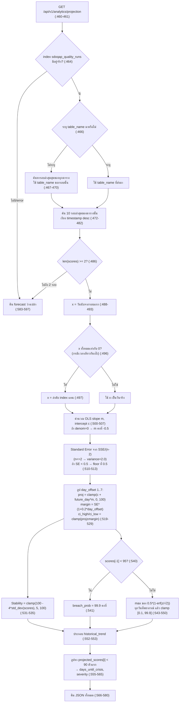

# 06. พยากรณ์คุณภาพและความน่าจะเป็นที่จะหลุด SLA (Quality forecast and SLA breach probability)

> ผู้ใช้เห็นส่วนนี้ที่: หน้า Analytics การ์ด "พยากรณ์ N วัน" และ KPI "Stability Index" / "SLA Breach Prob" · โค้ดหลัก: `api/app/api/analytics.py:460-597`, `ui/src/pages/Analytics.jsx:44-95`

## 1. คำตอบ 30 วินาที

Endpoint `GET /api/v1/analytics/projection` (`api/app/api/analytics.py:460-597`) ดึงคะแนนคุณภาพ (quality score) 10 รอบล่าสุดของตารางที่เพิ่งมีรอบตรวจล่าสุด แล้วลากเส้นตรงผ่านจุดเหล่านั้นด้วย **การถดถอยเชิงเส้นแบบกำลังสองน้อยที่สุด (OLS linear regression** — วิธีทางสถิติที่หาเส้นตรงที่ทำให้ผลรวมความคลาดเคลื่อนยกกำลังสองน้อยที่สุด) โดยแกน x คือ "จำนวนวันนับจากรอบแรก" จากนั้นต่อเส้นออกไปข้างหน้า 7 วัน พร้อมแถบความเชื่อมั่น (confidence interval, CI) ที่กว้างขึ้นเรื่อยๆ ตามระยะเวลา คำนวณดัชนีความนิ่ง (Stability Index) จากส่วนเบี่ยงเบนมาตรฐานของ 10 คะแนนย้อนหลัง และคำนวณ "ความน่าจะเป็นที่จะหลุด SLA" จากฟังก์ชันการแจกแจงสะสมแบบปกติ (normal CDF) เทียบกับเกณฑ์ตายตัว 95% ข้อจำกัดใหญ่ที่สุดคือ ตัวเลขที่ API คำนวณมีแค่ 7 วันข้างหน้า แต่หน้าเว็บมีตัวเลือกให้ดู 14 และ 30 วัน — วันที่ 8 เป็นต้นไปเป็นตัวเลข**ที่หน้าเว็บแต่งขึ้นเองจากสูตรลาก drift คงที่** ไม่ใช่ผลจากการถดถอยใดๆ ทั้งสิ้น (`ui/src/pages/Analytics.jsx:57-70`) และค่า "SLA Breach Probability" ที่ API คำนวณจริงจากสูตร normal CDF ก็**ไม่ถูกแสดงบนหน้าเว็บเลย** — KPI ที่ติดป้ายชื่อเดียวกันบนหน้าจอเป็นตัวเลขคนละตัวที่คำนวณฝั่งไคลเอนต์จากสัดส่วนวัน (ซึ่งรวมวันที่แต่งขึ้นเองด้วย) ที่คะแนนต่ำกว่าเป้า SLA ที่ผู้ใช้กำหนด (ดูข้อ 7)

## 2. มุมมองแบบ Black Box

ผู้ใช้เข้าหน้า Analytics แล้วเห็น:

- แถบควบคุมด้านบน: ช่องกรอกตัวเลข "เป้า SLA (%)" (ค่าเริ่มต้น 95) และดรอปดาวน์ "พยากรณ์ล่วงหน้า" ให้เลือก 7 / 14 / 30 วัน (`ui/src/pages/Analytics.jsx:12-13, 124-147`)
- กราฟเส้น "พยากรณ์ N วัน · เป้า X%" แสดงคะแนนที่พยากรณ์ (เส้นสีม่วง) พร้อมแถบสูง-ต่ำของ CI (พื้นที่เขียว/แดง) และเส้นประสีเหลืองที่ระดับเป้า SLA
- การ์ด KPI สองใบ: "Stability Index" และ "SLA Breach Prob (X%)"
- ข้อความสรุปแนวโน้ม "Historical Trend Summary" ใต้กราฟ
- ข้อความสถานะสีเขียว/แดง บอกว่าผ่านเกณฑ์ SLA ทุกวันหรือหลุดกี่วันจากกี่วันที่แสดง

ข้อมูลทั้งหน้าดึงจาก 4 endpoint พร้อมกัน (`/analytics/projection`, `/analytics/clustering`, `/analytics/impact`, `/analytics/recommendations`) และรีเฟรชอัตโนมัติทุก 60 วินาที (`refreshInterval: 60000`, `ui/src/pages/Analytics.jsx:18-21`; กลไกตั้งเวลาอยู่ที่ `ui/src/hooks/useApi.js:32-36`) ผู้ใช้ยังกดปุ่ม "คำนวณใหม่" เพื่อเรียกซ้ำได้ทันที ผู้ใช้ไม่เห็นว่าตัวเลขวันที่ 8 เป็นต้นไปมาจากไหน และไม่เห็นว่า KPI "SLA Breach Prob" ที่แสดงนั้นไม่ใช่ตัวเลขที่ API ส่งมาให้ในฟิลด์ `sla_breach_probability` — บทนี้จะแกะให้เห็นทั้งสองจุด

## 3. การทำงานภายใน (White Box)



### 3.1 การเลือกข้อมูลเข้า — ตารางไหน กี่รอบ

ถ้าไม่ระบุ `table_name` มาใน query string ระบบจะค้นหารอบตรวจล่าสุดสุดของ**ทุก**ตารางรวมกัน (เรียง `timestamp` มากไปน้อย, ขนาด 1 แถว) แล้วใช้ `table_name` ของรอบนั้นเป็นตัวกรอง (`:466-470`) จากนั้นค้น 10 รอบล่าสุดของตารางนั้นโดยเฉพาะ เรียง `timestamp` มากไปน้อยเช่นกัน (`:472-482`) แปลว่าเอกสารรอบตรวจของตารางที่ **เพิ่งมีการรันล่าสุด** เท่านั้นที่ถูกใช้พยากรณ์ ไม่ใช่ตารางที่ผู้ใช้กำลังดูอยู่จริงเสมอไป (หน้าเว็บไม่ได้ส่ง `table_name` มาเลย — ดู `ui/src/pages/Analytics.jsx:18`) คะแนนและเวลาจะถูกกลับลำดับเป็นเก่า→ใหม่ (`[::-1]`, `:484-485`) เพื่อให้แกน x เพิ่มขึ้นตามเวลา ถ้าน้อยกว่า 2 รอบ ฟังก์ชันข้าม `if` ทั้งก้อนไปคืนโครงว่าง (`:486`, `:583-597`)

### 3.2 แกน x — วันจริงหรือแค่ลำดับ

`x` ปกติคือจำนวนวัน (เป็นทศนิยม) นับจากเวลาของรอบแรกสุด (`t0`) ถึงแต่ละรอบ (`:488-493`) แต่ถ้ารอบทั้งหมดมี timestamp เดียวกันเป๊ะ (ทำให้ `x[-1] == 0`) ระบบจะเปลี่ยนไปใช้ index (`0,1,2,...`) แทนเพื่อไม่ให้ตัวหารเป็นศูนย์ในขั้นถัดไป (`:496-497`) — ในหลักฐานของบทนี้ (ข้อ 5) รอบทั้ง 10 มีเวลาต่างกันจริง (ห่างกันประมาณ 30 นาทีถึงหลายชั่วโมง) จึงใช้เส้นทางวันจริง ไม่เข้าเงื่อนไขนี้

### 3.3 การถดถอยและส่วนเบี่ยงเบนมาตรฐาน

สูตร OLS มาตรฐาน: `m = (nΣxy − ΣxΣy) / (nΣx² − (Σx)²)`, `c = (Σy − mΣx) / n` (`:500-507`) ถ้าตัวหาร (`denom`) เป็นศูนย์พอดี (เช่น x ทุกค่าเท่ากันเพราะ index ซ้ำกันหมด) `m` จะถูก**ตั้งค่าตายตัวเป็น −0.5** แทนการหารด้วยศูนย์ (`:506`) ซึ่งเป็นค่าที่เลือกเองล่วงหน้า ไม่ใช่ผลจากข้อมูล

ส่วนเบี่ยงเบนมาตรฐานของค่าคลาดเคลื่อน (standard error, SE) มาจาก `SSE/(n-2)` ยกกำลังสอง (`SSE` = ผลรวมกำลังสองของ (คะแนนจริง − คะแนนบนเส้นถดถอย) ทุกจุด) ถ้า `n <= 2` จะใช้ `variance = 2.0` ตายตัวแทน (กัน n-2 เป็นศูนย์หรือติดลบ, `:511`) และไม่ว่าผลลัพธ์จะเป็นเท่าไร ถ้าต่ำกว่า 0.5 จะถูก**ปัดขึ้นเป็น 0.5 เสมอ** (`:513`) — พื้นที่นี้สำคัญมากในตัวอย่างข้อ 5 เพราะข้อมูลจริงนิ่งสนิท (คะแนน 100% ทุกรอบ) ทำให้ SE ที่คำนวณได้จริงเกือบเป็นศูนย์ (~2.7×10⁻¹⁴) แต่ค่าที่ใช้จริงในสูตรถัดไปคือ 0.5 จากฟลอร์นี้เสมอ

### 3.4 การพยากรณ์ 7 วันและ CI

พยากรณ์เดินหน้าจาก `last_day` (ค่า x ของรอบล่าสุด) ทีละวัน (`day_offset` 1 ถึง 7) ค่าพยากรณ์ดิบ `c + future_day * m` ถูก**หนีบ (clamp)** ให้อยู่ในช่วง [0, 100] เสมอ (`:523`) ส่วนแถบ CI มาจาก `margin = SE * (1 + day_offset * 0.2)` — ยิ่งพยากรณ์ไกลยิ่งคูณมากขึ้นเชิงเส้น (วันที่ 1 คูณ 1.2, วันที่ 7 คูณ 2.4) แล้วนำ margin ไปบวก/ลบกับค่าพยากรณ์และหนีบ [0,100] อีกชั้น (`:526-529`)

### 3.5 Stability Index

คำนวณจากค่าเบี่ยงเบนมาตรฐานของ **10 คะแนนจริงย้อนหลัง** (ไม่ใช่ค่าพยากรณ์) `stability = clamp(100 − 4×σ, 5, 100)` (`:531-535`) ตัวคูณ 4 เป็นค่าคงที่ที่เลือกไว้ล่วงหน้า ไม่มีที่มาทางสถิติอื่นอธิบายไว้ในโค้ด — ยิ่งคะแนนแกว่งมาก (σ สูง) ดัชนีก็ยิ่งต่ำ

### 3.6 SLA Breach Probability

เกณฑ์ SLA ในสูตรนี้**ตายตัวที่ 95.0** (`sla_threshold = 95.0`, `:539`) ไม่เกี่ยวกับช่องกรอก "เป้า SLA" ที่ผู้ใช้ปรับบนหน้าเว็บเลย ตรรกะแบ่งเป็น 2 เส้นทาง:

- ถ้าคะแนน**รอบล่าสุด**ต่ำกว่า 95 อยู่แล้ว → บังคับ `breach_prob = 99.9` ทันที ไม่คำนวณ CDF (`:540-541`)
- ถ้าไม่ใช่ → หาค่า `z = (proj − 95) / SE` ของค่าพยากรณ์**ทุกวัน**ใน 7 วัน แล้วแปลงเป็นความน่าจะเป็นด้วย `0.5 × (1 − erf(z/√2))` (สูตรมาตรฐานของการแจกแจงปกติสะสม (normal CDF) — ความน่าจะเป็นที่ค่าจริงจะต่ำกว่าเกณฑ์ ถ้าค่าคลาดเคลื่อนกระจายแบบระฆังคว่ำรอบค่าพยากรณ์) เอาค่า**สูงสุด**ในบรรดา 7 วัน แล้วหนีบผลลัพธ์สุดท้ายในช่วง [0.1, 99.9]% เสมอ (`:543-550`) — แปลว่าต่อให้ทุกวันเสี่ยงต่ำมากจนควรได้ 0.0%, ตัวเลขที่แสดงจะไม่มีวันต่ำกว่า 0.1%

### 3.7 ข้อความแนวโน้มและการพยากรณ์วิกฤต

`trend_desc` เลือกคำว่า "Decline detected" ถ้า `m < 0` ไม่ว่าจะติดลบเพียงเล็กน้อยแค่ไหน (เช่น −0.0000000000001) มิฉะนั้นใช้ "Stable or improving" (`:552-553`) ส่วนการพยากรณ์วิกฤต ไล่ดูค่าพยากรณ์ทั้ง 7 วันตามลำดับ พบวันแรกที่ต่ำกว่า 90 จึงตั้ง `days_until_crisis` (`:559-561`) ชื่อ "component" ที่ได้รับผลกระทบเป็นการ**เดาจากค่า slope**ล้วนๆ: ถ้า `m < -1.0` ใช้ชื่อ "Ingestion Pipeline Gateway" มิฉะนั้นใช้ "Data Quality Validation Layer" (`:562`) — ไม่มีการตรวจสอบจริงว่าคอมโพเนนต์ไหนเป็นต้นเหตุ เป็นข้อความคงที่ 2 แบบเท่านั้น ความรุนแรง (`severity`) เป็น `"CRITICAL"` ถ้าค่าต่ำกว่า 80 มิฉะนั้น `"WARNING"` (`:564`) ถ้าไม่มีวันใดต่ำกว่า 90 เลย ค่าตั้งต้นคงเดิม: `days_until_crisis=7`, `severity="LOW"` (`:555-558`)

## 4. เดินผ่านโค้ดจริง

**ส่วนที่ 1 — เตรียมแกน x และคำนวณเส้นถดถอย OLS**

```python
# api/app/api/analytics.py:486-515
            if len(scores) >= 2:
                # Root Cause Fix: Authentic Linear Regression using actual Time Deltas (Days)
                t0 = datetime.fromisoformat(timestamps[0].replace("Z", "+00:00")).replace(tzinfo=None)
                x = []
                for ts in timestamps:
                    t = datetime.fromisoformat(ts.replace("Z", "+00:00")).replace(tzinfo=None)
                    days_diff = (t - t0).total_seconds() / 86400.0
                    x.append(days_diff)

                # If all runs happened at the exact same second (e.g. testing), spread them slightly to avoid ZeroDivision
                if x[-1] == 0:
                    x = list(range(len(scores)))

                y = scores
                n = len(scores)
                sum_x = sum(x)
                sum_y = sum(y)
                sum_xx = sum(xi*xi for xi in x)
                sum_xy = sum(xi*yi for xi, yi in zip(x, y))
                denom = (n * sum_xx - sum_x * sum_x)
                m = (n * sum_xy - sum_x * sum_y) / denom if denom != 0 else -0.5
                c = (sum_y - m * sum_x) / n

                # Calculate Standard Error of the Regression for realistic Confidence Intervals
                sse = sum((y[i] - (m * x[i] + c))**2 for i in range(n))
                variance = sse / (n - 2) if n > 2 else 2.0
                std_error = variance ** 0.5
                if std_error < 0.5: std_error = 0.5

                projected_scores = []
```

| บรรทัด | ทำอะไร |
|---|---|
| 486 | เข้าเงื่อนไขนี้เฉพาะเมื่อมีอย่างน้อย 2 รอบตรวจ น้อยกว่านี้จะข้ามไปคืนโครงว่างท้ายฟังก์ชัน |
| 488 | เก็บเวลาของรอบแรกสุด (`t0`) หลังกลับลำดับเป็นเก่า→ใหม่แล้ว ตัด timezone ออกด้วย `replace(tzinfo=None)` |
| 489-493 | สร้างลิสต์ `x` เป็นจำนวนวัน (ทศนิยม) ที่แต่ละรอบห่างจาก `t0` โดยแปลงวินาทีเป็นวันด้วยการหาร 86400 |
| 496-497 | ถ้ารอบทั้งหมดตกที่วันเดียวกันเป๊ะ (x[-1] เป็น 0) เปลี่ยนไปใช้ index 0..n-1 แทน กันตัวหารเป็นศูนย์ในสูตรถัดไป |
| 500-505 | สูตรผลรวมมาตรฐานของ OLS: Σx, Σy, Σx², Σxy และตัวหารร่วม `denom = nΣx² − (Σx)²` |
| 506 | สโลป `m` จากสูตร OLS ปกติ **เว้นแต่** `denom == 0` (x ทุกค่าเท่ากันหมด) จะบังคับ `m = -0.5` แทน |
| 507 | อินเตอร์เซปต์ `c` จากค่าเฉลี่ยที่ปรับด้วยสโลปแล้ว |
| 510 | SSE: ผลรวมกำลังสองของระยะห่างระหว่างคะแนนจริงกับเส้นถดถอยที่จุด x เดียวกัน |
| 511 | ความแปรปรวนของค่าคลาดเคลื่อน = SSE/(n-2) ยกเว้น n ≤ 2 ใช้ 2.0 ตายตัว |
| 513 | ฟลอร์ (floor) ของ standard error ที่ 0.5 เสมอ ไม่ว่าค่าจริงจะต่ำกว่านี้แค่ไหน |

**ส่วนที่ 2 — พยากรณ์ 7 วันและ CI**

```python
# api/app/api/analytics.py:516-529
                ci_high = []
                ci_low = []
                # Project from the last known day
                last_day = x[-1]
                for day_offset in range(1, 8):
                    future_day = last_day + day_offset
                    # Pure Linear Regression, NO math.sin fake wave!
                    proj_val = max(0.0, min(100.0, c + (future_day * m)))
                    projected_scores.append(round(proj_val, 2))

                    # CI widens over time (uncertainty increases)
                    margin = std_error * (1 + (day_offset * 0.2))
                    ci_high.append(round(min(100.0, proj_val + margin), 2))
                    ci_low.append(round(max(0.0, proj_val - margin), 2))
```

| บรรทัด | ทำอะไร |
|---|---|
| 519 | จุดเริ่มพยากรณ์คือค่า x ของรอบล่าสุด (`last_day`) |
| 520-521 | วนซ้ำ 7 ครั้ง (`day_offset` 1..7) คำนวณ `future_day = last_day + day_offset` |
| 523 | ค่าพยากรณ์ดิบจากเส้นตรง `c + future_day*m` ถูกหนีบ [0, 100] เสมอ กันค่าติดลบหรือเกิน 100% |
| 524 | ปัดเศษ 2 ตำแหน่งแล้วเก็บลงลิสต์ผลลัพธ์ |
| 527 | ระยะขอบ CI ขยายเป็นเส้นตรงตาม `day_offset` (คูณ 1.2 ถึง 2.4 เท่าของ SE) |
| 528-529 | ขอบบน/ล่างของ CI = ค่าพยากรณ์ ± margin หนีบ [0, 100] อีกชั้นหนึ่ง |

**ส่วนที่ 3 — Stability Index และ SLA Breach Probability**

```python
# api/app/api/analytics.py:531-560
                # 1. Compute Data Stability Index (DSI) based on standard deviation of scores
                mean_score = sum(scores) / len(scores)
                variance = sum((s - mean_score)**2 for s in scores) / len(scores)
                std_dev = variance ** 0.5
                stability = max(5.0, min(100.0, 100.0 - (std_dev * 4.0)))

                # 2. Compute SLA Breach Probability (SBP) based on normal CDF of projected scores
                # SLA Threshold is 95.0%
                sla_threshold = 95.0
                if scores[-1] < sla_threshold:
                    breach_prob = 99.9
                else:
                    max_breach = 0.0
                    for val in projected_scores:
                        z_sla = (val - sla_threshold) / std_error
                        # Normal CDF approximation using math.erf
                        prob = 0.5 * (1.0 - math.erf(z_sla / math.sqrt(2.0)))
                        if prob > max_breach:
                            max_breach = prob
                    breach_prob = max(0.1, min(99.9, max_breach * 100.0))

                trend_desc = "Decline detected" if m < 0 else "Stable or improving trend detected"
                trend_desc += f" in pipeline runs (slope: {m:.3f} per run)"

                days_until_crisis = 7
                crisis_component = "None"
                crisis_reason = "No quality crisis predicted in the next 7 days."
                severity = "LOW"
                for idx, val in enumerate(projected_scores):
                    if val < 90.0:
```

```python
# api/app/api/analytics.py:561-565
                        days_until_crisis = idx + 1
                        crisis_component = "Ingestion Pipeline Gateway" if m < -1.0 else "Data Quality Validation Layer"
                        crisis_reason = f"Quality score is projected to drop below 90% (estimated: {val}%) due to cumulative errors."
                        severity = "CRITICAL" if val < 80.0 else "WARNING"
                        break
```

| บรรทัด | ทำอะไร |
|---|---|
| 532-535 | Stability Index: ค่าเฉลี่ยและความแปรปรวนของ **คะแนนจริง 10 รอบ** (ประชากรทั้งหมด หารด้วย n ไม่ใช่ n-1) แล้วแปลงเป็นดัชนี 5-100 ด้วยสูตรคงที่ `100 − 4σ` |
| 539-541 | ถ้าคะแนนรอบล่าสุดต่ำกว่า 95 อยู่แล้ว ข้ามการคำนวณ CDF ทั้งหมด บังคับ 99.9% ทันที |
| 543-549 | มิฉะนั้น ไล่ทุกวันที่พยากรณ์ หา z-score เทียบ 95 แล้วแปลงเป็นความน่าจะเป็นด้วย `math.erf` เก็บค่าสูงสุดที่พบ |
| 550 | หนีบผลลัพธ์สุดท้ายให้อยู่ในช่วง [0.1, 99.9]% เสมอ ไม่มีทางได้ 0% หรือ 100% พอดี |
| 552-553 | สร้างข้อความแนวโน้มจากเครื่องหมายของ `m` เท่านั้น ไม่สนขนาด |
| 559-565 | ไล่หาวันแรกที่คะแนนพยากรณ์ต่ำกว่า 90 ตั้งชื่อ component จากเครื่องหมาย/ขนาดของ `m` (ข้อความคงที่ 2 แบบ) และความรุนแรงจากว่าต่ำกว่า 80 หรือไม่ |

**ส่วนที่ 4 — วันที่ 8 เป็นต้นไปในหน้าเว็บเป็นของที่แต่งขึ้นเอง ไม่ใช่ผลจาก API**

```javascript
// ui/src/pages/Analytics.jsx:57-70

    if (horizonDays <= base.length) {
      return base.slice(0, horizonDays);
    }
    const last = base[base.length - 1] || { Score: 93.1, High: 95.5, Low: 90.5 };
    const extended = [...base];
    for (let d = base.length + 1; d <= horizonDays; d++) {
      const drift = Math.min(4.5, (d - base.length) * 0.18);
      extended.push({
        day: `Day ${d}`,
        Score: parseFloat(Math.min(99.5, last.Score + drift).toFixed(2)),
        High: parseFloat(Math.min(100.0, (last.High || last.Score + 1.5) + drift).toFixed(2)),
        Low: parseFloat(Math.max(75.0, (last.Low || last.Score - 1.5) + drift * 0.8).toFixed(2)),
      });
```

| บรรทัด | ทำอะไร |
|---|---|
| 58-60 | ถ้าผู้ใช้เลือก 7 วัน (หรือน้อยกว่าจำนวนวันที่ API คืนมาจริง) ตัดลิสต์ที่มาจาก API มาแสดงตรงๆ ไม่แต่งอะไรเพิ่ม |
| 61 | ถ้าผู้ใช้เลือก 14 หรือ 30 วัน จำค่าของวันสุดท้ายที่ API คำนวณจริง (`base[base.length-1]`) ถ้าไม่มีเลยใช้ค่าคงที่สำรอง `{Score:93.1, High:95.5, Low:90.5}` ที่เขียนไว้ในโค้ดตรงๆ |
| 63-64 | วนสร้างวันที่ 8 เป็นต้นไปจนถึง `horizonDays` แต่ละวันคำนวณ `drift` เพิ่มขึ้นทีละ 0.18 หนีบเพดานไว้ที่ 4.5 — **ตัวเลข 0.18 และ 4.5 นี้เป็นค่าคงที่ที่เขียนไว้ในหน้าเว็บ ไม่เกี่ยวกับสถิติหรือเส้นถดถอยใดๆ ทั้งสิ้น** |
| 65-70 | สร้างจุดข้อมูลใหม่โดยเอาค่าของวันสุดท้ายที่ API คำนวณจริง **บวก** `drift` ที่เพิ่มขึ้นเรื่อยๆ พร้อมหนีบเพดาน/พื้นต่างๆ (99.5, 100.0, 75.0) — คะแนนจึง**ไต่ขึ้นเข้าใกล้ 99.5 เสมอ**ไม่ว่าแนวโน้มจริงจาก API จะเป็นขาลงแค่ไหน |

## 5. ตัวอย่างการคำนวณจริง

หลักฐานทั้งหมดในส่วนนี้มาจาก `docs/whitebox-report/evidence/06-history.json` (ผลดิบจาก Elasticsearch), `docs/whitebox-report/evidence/06-projection.json` (ผลจริงจาก endpoint) และ `docs/whitebox-report/evidence/06-recompute.txt` (สคริปต์คำนวณซ้ำด้วยมือ + ผลลัพธ์)

**ข้อมูลเข้า:** ตารางที่ตรวจล่าสุดคือ `gov_data` มีทั้งหมด 53 รอบในดัชนี (`hits.total.value = 53`) API ดึงมาเฉพาะ 10 รอบล่าสุด เรียงเก่า→ใหม่แล้วได้คะแนน (`quality_score`) เป็น **100.0 ทั้ง 10 รอบ** ตั้งแต่ 2026-09-26T21:01:32Z ถึง 2026-09-27T09:02:31Z (`06-history.json`)

**คำนวณด้วยมือจากสูตรที่ `api/app/api/analytics.py:488-493`:** `t0` = 2026-09-26T21:01:32.581476 → `x` (วัน) = `[0.0, 0.021640, 0.042340, 0.062292, 0.396696, 0.417140, 0.438185, 0.458229, 0.480141, 0.500687]` (ห่างกันจริงเพราะเวลาไม่เท่ากัน จึง**ไม่**เข้าเงื่อนไข fallback ที่ `:496-497`)

**OLS (สูตร `:500-507`):** n=10, Σx=2.817349, Σy=1000.0, Σx²=1.220717, Σxy=281.734911, `denom = 10×1.220717 − 2.817349² = 4.269716` (ไม่เป็นศูนย์ จึงไม่เข้าเงื่อนไข `m=-0.5`) → `m = -1.065×10⁻¹³` (ในทางปฏิบัติคือ 0 พอดี เพราะคะแนนทุกจุดเท่ากันหมด) → `c = 100.00000000000003`

**Standard Error (สูตร `:510-513`):** SSE = 5.65×10⁻²⁷ (แทบเป็นศูนย์) → variance = SSE/(10-2) = 7.07×10⁻²⁸ → SE ก่อนฟลอร์ = 2.66×10⁻¹⁴ → **ต่ำกว่า 0.5 จึงถูกฟลอร์เป็น 0.5** (นี่คือค่าที่ใช้จริงในทุกสูตรถัดไป ไม่ใช่ค่าที่คำนวณได้จริงจากข้อมูล)

**พยากรณ์ 7 วัน (สูตร `:519-529`, `last_day = 0.500687`):**

| วัน | future_day | ค่าดิบ (c+future_day·m) | พยากรณ์ (clamp) | margin=0.5×(1+0.2d) | ci_low | ci_high |
|---|---|---|---|---|---|---|
| 1 | 1.5007 | 100.0000 | 100.0 | 0.60 | 99.4 | 100.0 |
| 2 | 2.5007 | 100.0000 | 100.0 | 0.70 | 99.3 | 100.0 |
| 3 | 3.5007 | 100.0000 | 100.0 | 0.80 | 99.2 | 100.0 |
| 4 | 4.5007 | 100.0000 | 100.0 | 0.90 | 99.1 | 100.0 |
| 5 | 5.5007 | 100.0000 | 100.0 | 1.00 | 99.0 | 100.0 |
| 6 | 6.5007 | 100.0000 | 100.0 | 1.10 | 98.9 | 100.0 |
| 7 | 7.5007 | 100.0000 | 100.0 | 1.20 | 98.8 | 100.0 |

ตรงกับ `projected_scores`, `ci_high`, `ci_low` ใน `06-projection.json` **ทุกค่า** (`[100.0]×7`, `[100.0]×7`, `[99.4, 99.3, 99.2, 99.1, 99.0, 98.9, 98.8]`)

**Stability Index (สูตร `:531-535`):** คะแนนทั้ง 10 รอบเท่ากันหมด (100.0) → mean=100.0, variance=0, σ=0 → `stability = clamp(100 − 4×0, 5, 100) = 100.0` → แสดงเป็น `"100.0%"` ตรงกับ `stability_index` ใน `06-projection.json`

**SLA Breach Probability (สูตร `:537-550`):** คะแนนรอบล่าสุด (100.0) ไม่ต่ำกว่า 95 → เข้าทาง CDF ทุกวันได้ `z = (100−95)/0.5 = 10` → `prob = 0.5×(1−erf(10/√2)) ≈ 0.5×(1−0.999999999...) ≈ 0` → หนีบด้วยพื้น 0.1 → `breach_prob = 0.1%` ตรงกับ `sla_breach_probability` ใน `06-projection.json`

**ตัวบ่งชี้แนวโน้มและวิกฤต:** `m` ติดลบเล็กน้อยระดับ 10⁻¹³ (ทางเทคนิคถือว่า `m < 0` เป็นจริง) จึงได้ข้อความ `"Decline detected in pipeline runs (slope: -0.000 per run)"` (ปัดเศษ 3 ตำแหน่งใน f-string ทำให้ดูเหมือน 0 พอดี) ตรงกับ `historical_trend` ใน `06-projection.json` เป๊ะ ไม่มีวันใดในผลพยากรณ์ต่ำกว่า 90 → `severity = "LOW"`, `days_until_crisis = 7`, `impacted_component = "None"` ตรงกับ `crisis_forecast` ใน `06-projection.json` ทุกฟิลด์

**ผลการรันสคริปต์คำนวณซ้ำ (`06-recompute.txt`):** ตรงกับ `06-projection.json` **ทุกค่าภายใน 0.01** (`projected_scores`, `ci_high`, `ci_low`, `stability_index`, `sla_breach_probability`, `historical_trend`, `crisis_forecast.severity` — เทียบทีละฟิลด์ พิมพ์ `match=True` ทุกบรรทัด จบด้วย `OVERALL MATCH: True`) ไม่พบความคลาดเคลื่อนใดที่ต้องอธิบายเพิ่ม เพราะชุดข้อมูลนี้เป็นกรณีขอบ (edge case) ที่ทุกคะแนนเท่ากันพอดี ทำให้เห็นชัดว่าฟลอร์ 0.5 ของ standard error (`:513`) เป็นตัวกำหนดแถบ CI และ breach probability ทั้งหมดในกรณีนี้ ไม่ใช่ความแปรปรวนจริงของข้อมูล (ซึ่งเป็นศูนย์)

## 6. ทำไมออกแบบแบบนี้ และทางเลือกอื่น

**เลือก linear regression แทน moving average หรือ ARIMA/Prophet:** ด้วยข้อมูลแค่ 10 จุด การถดถอยเชิงเส้นอย่างง่ายเป็นทางเลือกที่สมเหตุสมผลที่สุด — ตีความง่าย (สโลปเดียวบอกทิศทาง) คำนวณเร็วไม่ต้องมีไลบรารีเพิ่ม และไม่มีพารามิเตอร์ให้ over-fit ทางเลือกอื่น: (1) **Moving average** จะให้ค่าพยากรณ์เป็นเส้นแบนราบเสมอ (ไม่มีทิศทาง) เหมาะกับข้อมูลที่ไม่มีแนวโน้มชัด แต่จะพยากรณ์ "ขาลง" ไม่ได้เลย ซึ่งขัดกับจุดประสงค์ของฟีเจอร์นี้ที่ต้องการเตือนก่อนคุณภาพตก (2) **ARIMA/Prophet** ต้องการจุดข้อมูลมากกว่านี้มาก (โดยทั่วไปหลายสิบถึงหลายร้อยจุด และควรมีรอบซ้ำตามฤดูกาลอย่างน้อย 2 รอบเพื่อประมาณ seasonality ได้อย่างน่าเชื่อถือ) การใช้กับ 10 จุดจะทำให้พารามิเตอร์ของโมเดลไม่เสถียร (overfit ต่อสัญญาณรบกวนเพียงไม่กี่จุด) และเพิ่มความซับซ้อนของโค้ด/dependency โดยไม่ได้ความแม่นยำที่เพิ่มขึ้นจริงในสเกลข้อมูลนี้ ข้อเสียของ linear regression ที่เลือกใช้คือ ถือว่าแนวโน้มเป็นเส้นตรงตลอด ไม่จับความเปลี่ยนแปลงแบบ non-linear หรือการกลับทิศกะทันหันได้เลย

**ทำไม CI ต้องกว้างขึ้นเรื่อยๆ:** เป็นหลักการมาตรฐานของการพยากรณ์แบบนอกช่วงข้อมูล (extrapolation) — ยิ่งพยากรณ์ไกลจากข้อมูลจริงเท่าไร ความไม่แน่นอนก็ยิ่งสะสมมากขึ้น (เส้นถดถอยฟิตกับ 10 จุดที่มีอยู่เท่านั้น ไม่มีอะไรยืนยันว่าแนวโน้มเดิมจะดำเนินต่อไปแบบเป๊ะๆ) สูตรที่ใช้ (`SE × (1 + 0.2×d)`) ขยาย margin แบบเส้นตรงตาม `d` ซึ่งง่ายและคาดเดาได้ แต่ไม่ใช่สูตรมาตรฐานทางสถิติของช่วงพยากรณ์ (prediction interval) ที่มักขยายแบบไม่เป็นเส้นตรง (เช่นตามรากที่สองของระยะห่างจากจุดกึ่งกลางข้อมูล) เป็นการประมาณแบบเรียบง่ายที่ให้ "ความรู้สึก" ของความไม่แน่นอนที่เพิ่มขึ้น มากกว่าจะเป็นช่วงความเชื่อมั่นทางสถิติที่พิสูจน์ได้เป๊ะ

**ทำไมใช้ normal CDF แทนการเทียบตรงๆ ว่าต่ำกว่า 95 หรือไม่:** การเทียบแบบ binary (พยากรณ์ < 95 ใช่/ไม่ใช่) จะให้คำตอบ 0% หรือ 100% เท่านั้น ไม่สื่อว่า "เกือบจะหลุด" ต่างจาก "หลุดชัวร์" อย่างไร การแปลงผ่าน z-score และ normal CDF (สมมติว่าความคลาดเคลื่อนรอบเส้นพยากรณ์กระจายแบบระฆังคว่ำ) ให้ตัวเลขความน่าจะเป็นแบบต่อเนื่องที่สะท้อนทั้ง "ระยะห่างจากเกณฑ์" และ "ความไม่แน่นอน (SE)" ไปพร้อมกัน — ยิ่งพยากรณ์ใกล้ 95 หรือ SE ยิ่งกว้าง ความน่าจะเป็นก็ยิ่งสูงขึ้นอย่างต่อเนื่อง ข้อสมมติที่ยังไม่ถูกตรวจสอบคือความคลาดเคลื่อนจริงกระจายแบบปกติหรือไม่ (โค้ดไม่เคยทดสอบสมมติฐานนี้กับข้อมูลจริงเลย)

## 7. ข้อจำกัด ค่าตายตัว และข้อสังเกต

**คำนวณจริงจากข้อมูล:** สโลป/อินเตอร์เซปต์ของเส้นถดถอย (`:500-507`), SSE/variance ก่อนฟลอร์ (`:510-511`), ค่าพยากรณ์และ CI ของ 7 วันแรก (`:519-529`), Stability Index จาก σ ของคะแนนจริง (`:531-535`), breach probability จาก CDF เมื่อคะแนนล่าสุด ≥ 95 (`:543-550`)

**เป็นค่าคงที่/ค่าตายตัว ไม่ใช่ผลจากข้อมูล:** `m = -0.5` เมื่อ denom เป็นศูนย์ (`:506`), `variance = 2.0` เมื่อ n ≤ 2 (`:511`), ฟลอร์ SE ที่ 0.5 เสมอ (`:513`, มีผลจริงในตัวอย่างข้อ 5 นี้), ตัวคูณ 4 ในสูตร Stability (`:535`), `sla_threshold = 95.0` ตายตัว ไม่อ่านจากช่องกรอกของผู้ใช้เลย (`:539`), พื้น/เพดาน 0.1%/99.9% ของ breach probability (`:550`), ชื่อ component "Ingestion Pipeline Gateway"/"Data Quality Validation Layer" เลือกจากเครื่องหมาย/ขนาดของ `m` เท่านั้น ไม่ได้ตรวจสอบจริงว่าคอมโพเนนต์ใดเป็นต้นเหตุ (`:562`), และวันที่ 8 เป็นต้นไปทั้งหมดในหน้าเว็บ (ตัวเลข drift 0.18/4.5/99.5/75.0 ที่ `ui/src/pages/Analytics.jsx:63-69`)

**ค่าสำรอง (fallback):** ถ้าไม่มีรอบตรวจเลยหรือน้อยกว่า 2 รอบ คืนโครงว่างทั้งหมด (`projection_days: []`, `stability_index: "N/A"`, `:583-597`) หน้าเว็บใช้ `{Score: 93.1, High: 95.5, Low: 90.5}` เป็นฐานสำรองถ้า `base` ว่างเปล่าตอนขยายวัน (`ui/src/pages/Analytics.jsx:61`)

**บั๊ก/ข้อสังเกตที่พบระหว่างเขียนบทนี้:**

1. **ฟิลด์ `sla_breach_probability` ที่ API คำนวณจริง (ในตัวอย่างนี้คือ 0.1%) ไม่ถูกแสดงบนหน้าเว็บที่ไหนเลย** — ค้นทั้งไฟล์ `ui/src/pages/Analytics.jsx` ด้วย `grep -n "sla_breach_probability"` พบว่าไม่มีการอ้างถึงฟิลด์นี้แม้แต่ครั้งเดียว KPI ที่ติดป้าย "SLA Breach Prob (X%)" บนหน้าจอ (`:217-220`) แสดงตัวเลขคนละตัวที่คำนวณฝั่งไคลเอนต์ล้วนๆ จาก `breachDaysCount / projectionData.length` (`:75-77, 219`) คือสัดส่วนของ "จำนวนวันที่แสดงบนกราฟ" ที่คะแนนต่ำกว่าเป้า SLA ที่ผู้ใช้กำหนดเอง — และ `projectionData` นับรวมวันที่ 8 เป็นต้นไปที่แต่งขึ้นเองด้วย (ข้อ 3.4, ข้อ 4) ผลกระทบ: ผู้ใช้เห็นตัวเลขที่มีชื่อเหมือนกับสิ่งที่ backend ออกแบบมาให้เป็นสถิติแบบ normal-CDF แต่จริงๆ ได้ตัวเลขนับสัดส่วนวันแบบง่ายๆ ที่พึ่งพาข้อมูลปลอมบางส่วน
2. **การพยากรณ์ 14/30 วันในหน้าเว็บไม่ใช่ผลจากสถิติใดๆ** เป็นการต่อเส้นด้วยค่า drift คงที่ (`ui/src/pages/Analytics.jsx:63-69`) ทำให้คะแนนไต่ขึ้นเข้าใกล้ 99.5% เสมอ ไม่ว่าแนวโน้มจริงจาก 7 วันแรกจะเป็นขาลงรุนแรงแค่ไหนก็ตาม — ทิศทางของ "พยากรณ์ 30 วัน" ที่ผู้ใช้เห็นจึงอาจ**ขัดแย้งโดยตรง**กับแนวโน้มจริงที่ backend คำนวณไว้ในวันที่ 1-7
3. ฟลอร์ standard error ที่ 0.5 (`:513`) ทำให้ข้อมูลที่นิ่งสนิทจริง (σ=0 อย่างในตัวอย่างข้อ 5) ยังคงแสดง CI ที่กว้างขึ้นเรื่อยๆ (99.4% ถึง 98.8% ที่ขอบล่าง) ราวกับมีความไม่แน่นอนอยู่ ทั้งที่ข้อมูลจริงไม่มีความแปรปรวนเลย — เป็นการออกแบบเชิงระมัดระวัง (ไม่อยากให้ CI แคบจนดูมั่นใจเกินจริง) แต่ก็ทำให้ตัวเลข CI ไม่ได้สะท้อนความแปรปรวนจริงของข้อมูลในกรณีนี้
4. `sla_threshold` ที่ backend ใช้คำนวณ breach probability ตายตัวที่ 95 (`:539`) ไม่เชื่อมกับช่องกรอก "เป้า SLA" ที่ผู้ใช้ปรับได้บนหน้าเว็บ (`ui/src/pages/Analytics.jsx:12, 124-132`) เห็นได้จากบั๊กข้อ 1 ที่หน้าเว็บต้องคำนวณตัวเลขเองใหม่ฝั่งไคลเอนต์แทนที่จะใช้ของ backend เพราะ backend ไม่รองรับเกณฑ์ที่ปรับได้เลย

## 8. คำถามกรรมการ

### พื้นฐาน (อย่างน้อย 3 ข้อ)

1. **หน้าพยากรณ์นี้ใช้ข้อมูลจากตารางไหน และดึงมากี่รายการ?** ระบบเลือกตารางที่เพิ่งมีรอบตรวจล่าสุดสุดโดยอัตโนมัติ (ไม่ใช่ตารางที่ผู้ใช้กำลังดูอยู่เสมอไป) แล้วดึง 10 รอบล่าสุดของตารางนั้น เรียงตามเวลา (`api/app/api/analytics.py:466-482`) ในหลักฐานที่เก็บไว้คือตาราง `gov_data` จาก 53 รอบทั้งหมด (`docs/whitebox-report/evidence/06-history.json`)
2. **Stability Index ที่เห็นบนการ์ดคำนวณจากอะไร?** จากส่วนเบี่ยงเบนมาตรฐาน (σ) ของ 10 คะแนนจริงย้อนหลัง ด้วยสูตร `clamp(100 − 4σ, 5, 100)` (`api/app/api/analytics.py:531-535`) ยิ่งคะแนนแกว่งมาก ดัชนียิ่งต่ำ ดูตัวอย่างคำนวณจริงในข้อ 5 ของบทนี้
3. **ทำไมตัวอย่างในบทนี้พยากรณ์คะแนนคงที่ 100% ทุกวัน ไม่มีแนวโน้มลดลงเลย?** เพราะ 10 รอบตรวจล่าสุดของตาราง `gov_data` ที่ดึงมามีคะแนน 100.0 เท่ากันทุกรอบพอดี (`06-history.json`) ทำให้สโลปที่คำนวณได้ใกล้ศูนย์มาก (~10⁻¹³) เส้นถดถอยจึงเป็นเส้นตรงราบที่ 100% ดูการคำนวณเต็มในข้อ 5

### เชิงลึก (อย่างน้อย 3 ข้อ)

1. **ทำไมผู้ใช้เปลี่ยนเป้า SLA บนหน้าเว็บได้ แต่ API ยังใช้ 95 เสมอ?** ช่องกรอก "เป้า SLA (%)" (`ui/src/pages/Analytics.jsx:12, 124-132`) เป็น state ฝั่งไคลเอนต์ล้วนๆ ใช้แค่ตำแหน่งเส้นประบนกราฟและตัวหารในสัดส่วนวันที่หลุดเกณฑ์ (`:75-77, 163-165`) โค้ด backend ที่คำนวณ `sla_breach_probability` จริงตายตัวที่ 95.0 (`api/app/api/analytics.py:539`) ไม่เคยรับค่านี้จากผู้ใช้เลย — เห็นได้ชัดจากบั๊กข้อ 7.1 ที่ผู้ใช้ไม่ได้เห็นตัวเลขที่ backend คำนวณจริงด้วยซ้ำ หน้าเว็บเลี่ยงปัญหานี้ด้วยการคำนวณตัวเลขคนละแบบเองฝั่งไคลเอนต์
2. **ทำไมเลือก normal CDF (erf) แทนการเทียบตรงๆ ว่าต่ำกว่า 95 หรือไม่?** เพื่อให้ได้ตัวเลขความน่าจะเป็นแบบต่อเนื่องที่สะท้อนทั้งระยะห่างจากเกณฑ์และความไม่แน่นอน (SE) พร้อมกัน แทนคำตอบ 0%/100% ที่ไม่สื่อระดับความเสี่ยง อธิบายเต็มในข้อ 6 ของบทนี้ ข้อจำกัดคือสมมติฐานการแจกแจงแบบปกติไม่เคยถูกทดสอบกับข้อมูลจริง
3. **ทำไมเลือก linear regression แทน ARIMA/Prophet หรือ moving average ทั้งที่มีแค่ 10 จุดข้อมูล?** ตีความง่าย ไม่มีพารามิเตอร์ให้ over-fit และไม่ต้องมีข้อมูลจำนวนมากเหมือน ARIMA/Prophet ที่ต้องการหลายสิบถึงหลายร้อยจุดเพื่อประมาณ seasonality ได้อย่างน่าเชื่อถือ ส่วน moving average จะไม่มีทิศทางเลย ขัดกับจุดประสงค์ที่ต้องเตือนแนวโน้มขาลงล่วงหน้า รายละเอียดเปรียบเทียบเต็มในข้อ 6
4. **ฟลอร์ของ standard error ที่ 0.5 (`api/app/api/analytics.py:513`) มีผลอย่างไรกับข้อมูลที่นิ่งสนิทแบบในตัวอย่างนี้?** ข้อมูลจริงมี σ=0 พอดี (SE ที่คำนวณได้จริง ~2.7×10⁻¹⁴) แต่ค่าที่ใช้จริงในทุกสูตรถัดไป (CI, breach probability) คือ 0.5 จากฟลอร์เสมอ — แปลว่าแถบ CI ที่เห็น (99.4%-100% ถึง 98.8%-100%) ไม่ได้สะท้อนความแปรปรวนจริงของข้อมูลเลยแม้แต่น้อย เป็นค่าคงที่ที่ปรากฏทุกครั้งที่ข้อมูลนิ่งพอ ดูการคำนวณเต็มในข้อ 5

### จุดอ่อน (อย่างน้อย 2 ข้อ) — ตอบตรงไปตรงมา: ยอมรับข้อจำกัด อธิบายผลกระทบ และบอกว่าจะแก้อย่างไร

1. **"พยากรณ์ 30 วัน" ในหน้าเว็บมาจากไหน?** ตอบตรงๆ: มาจาก API จริงแค่ 7 วันแรก (`api/app/api/analytics.py:520`) วันที่ 8 เป็นต้นไปทั้งหมดเป็นตัวเลขที่หน้าเว็บ**แต่งขึ้นเอง**ด้วยสูตร drift คงที่ (`ui/src/pages/Analytics.jsx:57-70`) ที่ทำให้คะแนนไต่เข้าใกล้ 99.5% เสมอ ไม่เกี่ยวกับสถิติหรือแนวโน้มจริงใดๆ ผลกระทบ: ผู้ใช้ที่เลือกดู 30 วันอาจเข้าใจผิดว่าได้เห็นการพยากรณ์ทางสถิติที่แม่นยำระยะยาว ทั้งที่ 23 วันจาก 30 วันเป็นข้อความตกแต่งเชิงกราฟล้วนๆ วิธีแก้ที่ตรงไปตรงมาที่สุดคือให้ backend ขยาย `range(1, 8)` เป็น `range(1, horizon+1)` ตามพารามิเตอร์ที่ส่งมาจริง (คำนวณด้วยสูตร OLS เดิมต่อเนื่องไปเรื่อยๆ) แทนการให้ frontend แต่งตัวเลขเอง หรืออย่างน้อยต้องติดป้ายกำกับชัดเจนบนกราฟว่าวันที่ 8 เป็นต้นไปเป็นการประมาณแบบกราฟ ไม่ใช่ผลการพยากรณ์
2. **ใช้ข้อมูลแค่ 10 จุดพยากรณ์ได้จริงหรือ?** ทางสถิติถือว่าน้อยมาก — ไม่พอสำหรับตรวจสอบว่าความคลาดเคลื่อนกระจายแบบปกติจริงหรือไม่ (สมมติฐานที่สูตร CDF ต้องพึ่งพา, ข้อ 6) ไม่มีการแบ่งข้อมูลเป็น train/test เพื่อวัดว่าเส้นถดถอยทำนายข้อมูลใหม่ได้แม่นแค่ไหน และจุดข้อมูลเพียงไม่กี่จุดทำให้สโลปไวต่อความผิดปกติของแค่ 1-2 รอบมาก (เช่น รอบตรวจ 1 รอบที่คะแนนตกฮวบผิดปกติ จะดึงเส้นทั้งเส้นให้ชันขึ้นทันที) กรณีในบทนี้เป็นตัวอย่างสุดขั้วที่ตรงข้าม (ข้อมูลนิ่งสนิทจนไม่มีอะไรให้สโลปจับ) แต่ก็แสดงให้เห็นว่าฟลอร์ต่างๆ ในสูตร (SE=0.5, breach=0.1%) เข้ามาแทนที่ผลจากข้อมูลจริงเกือบทั้งหมด ทางแก้ที่เหมาะสมคือเพิ่มจำนวนรอบที่ใช้พยากรณ์ (เช่น 30-50 รอบ) เมื่อมีประวัติเพียงพอ และรายงานช่วงความเชื่อมั่นของสโลปเอง (ไม่ใช่แค่ของค่าพยากรณ์) เพื่อให้ผู้ใช้เห็นว่าเส้นแนวโน้มนี้ "แน่น" หรือ "หลวม" แค่ไหน
