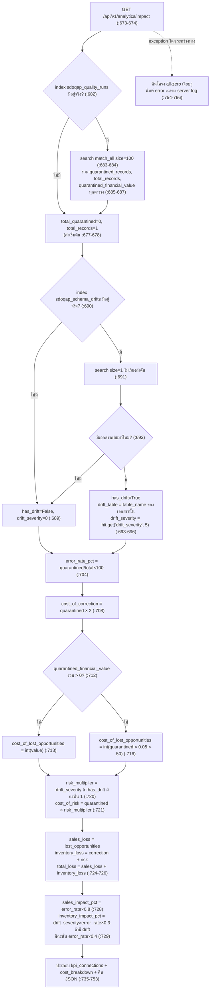

# 07. ต้นทุนความเสียหายจากข้อมูลไม่มีคุณภาพ (Cost of Poor Data Quality — COPDQ)

> ผู้ใช้เห็นส่วนนี้ที่: หน้า Dashboard การ์ด "Financial COPDQ Risk" และ "COPDQ Financial Loss Breakdown" · หน้า Analytics ส่วน "ผลกระทบทางธุรกิจ" · โค้ดหลัก: `api/app/api/analytics.py:673-770`

## 1. คำตอบ 30 วินาที

Endpoint `GET /api/v1/analytics/impact` (`api/app/api/analytics.py:673-766`) แปลงตัวเลขคุณภาพข้อมูล (จำนวนแถวที่ถูกกักกัน หรือ quarantine — แถวข้อมูลที่ตรวจพบว่าผิดกฎจึงถูกแยกออกจากข้อมูลสะอาด ไม่ให้ไหลต่อเข้าสู่รายงาน) ให้กลายเป็นตัวเลขดอลลาร์ตามกรอบ **COPDQ (Cost of Poor Data Quality — ต้นทุนความเสียหายจากข้อมูลไม่มีคุณภาพ)** ซึ่งประกอบด้วย 3 ส่วน: **ต้นทุนการแก้ไข** (จำนวนแถวที่กักกัน × 2 ดอลลาร์ต่อแถว, ค่าคงที่ตายตัว), **ต้นทุนโอกาสที่เสียไป** (ผลรวมมูลค่าทางการเงินจริงของแถวที่กักกันถ้ามี มิฉะนั้นประมาณจาก 5%×50 ดอลลาร์ต่อแถว) และ **ต้นทุนความเสี่ยง** (จำนวนแถวที่กักกัน × ค่าความรุนแรงของการเปลี่ยนแปลงโครงสร้างข้อมูล หรือ schema drift ที่พบล่าสุด — ถ้าไม่มีบันทึก drift เลยจะคูณด้วย 1) ค่าคงที่ทั้งหมด ($2, 5%, $50) มาจากคอมเมนต์ที่อ้างกรอบอุตสาหกรรม Gartner/IBM แต่ไม่มีลิงก์หรือแหล่งอ้างอิงจริงในโค้ด ตัวเลขบาทที่แสดงคู่กันเป็นแค่การแปลงอัตราคงที่ 36.5 เพื่อการแสดงผลเท่านั้น ไม่ใช่อัตราแลกเปลี่ยนสด ข้อจำกัดใหญ่ที่สุดคือ ตัวคูณความเสี่ยงใช้ค่า drift ของ**ตารางแรกที่ค้นเจอเพียงตารางเดียว**ไปคูณกับผลรวมแถวที่กักกันของ**ทุกตารางรวมกัน** และการค้นรอบตรวจก็ดึงมาแค่ 100 รายการแบบไม่เรียงลำดับ (ดูข้อ 3 และ 7)

## 2. มุมมองแบบ Black Box

ผู้ใช้เห็นตัวเลขดอลลาร์นี้ในสองหน้า:

- **หน้า Dashboard**: การ์ด KPI ผู้บริหาร "Financial COPDQ Risk" แสดงตัวเลขดอลลาร์รวมตัวใหญ่ พร้อมป้าย "ACTION"/"CLEAR" และตัวเลขบาทประมาณใต้ป้าย (`ui/src/pages/Dashboard.jsx:478-489`) และการ์ดแยก "COPDQ Financial Loss Breakdown" ที่มีป้ายกำกับ "Gartner & IBM Framework: Cost of Poor Data Quality" พร้อมยอดรวมที่มุมขวาบน (`ui/src/pages/Dashboard.jsx:1044-1047`) และตารางแจกแจง 3 บรรทัด: "Cost of Correction", "Cost of Lost Opportunities", "Cost of Risk & Compliance" พร้อมตัวเลขดอลลาร์และบาทกำกับแต่ละบรรทัด (`ui/src/pages/Dashboard.jsx:1055-1084`)
- **หน้า Analytics**: ส่วน "ผลกระทบทางธุรกิจ" แสดงแถบสีของ 3 KPI ปลายทาง ("Sales Report Accuracy", "Inventory Forecast Reliability", "User Recommendations CTR") พร้อมเปอร์เซ็นต์ผลกระทบ และกล่องสรุป "ความเสียหายโดยประมาณ" ที่แสดงตัวเลขดอลลาร์รวมกับบาทประมาณด้านล่าง (`ui/src/pages/Analytics.jsx:275-306`)

ผู้ใช้ไม่เห็นว่าตัวเลขทั้งหมดนี้มาจาก endpoint เดียวกัน (`/analytics/impact`) หรือบางส่วนมาจาก endpoint คนละตัว (`/executive/overview`) ที่เรียกฟังก์ชันคำนวณเดียวกันซ้ำอีกครั้งโดยอิสระ (ดูข้อ 7) และไม่เห็นว่าค่าคงที่ $2/$50/5%/36.5 ที่อยู่เบื้องหลังตัวเลขนี้มาจากไหน — บทนี้จะแกะให้เห็นทั้งหมด

## 3. การทำงานภายใน (White Box)



### 3.1 แหล่งข้อมูลเข้า — รวมทุกตาราง ไม่กรองตารางไหนทั้งสิ้น

ถ้า index `sdoqap_quality_runs` มีอยู่ ระบบค้นด้วย `match_all` ขนาด 100 เอกสาร **ไม่มีเงื่อนไข `sort` และไม่กรอง `table_name` เลย** (`:682-684`) แล้วรวม (`sum`) ฟิลด์ `quarantined_records`, `total_records`, `quarantined_financial_value` ของทั้ง 100 เอกสารเข้าด้วยกัน (`:685-687`) แปลว่าตัวเลขที่ได้เป็นผลรวมของ**ทุกตารางที่เคยตรวจในระบบปนกัน** ไม่ใช่ของตารางใดตารางหนึ่ง และเพราะไม่มี `sort` เอกสารที่ถูกเลือกมา 100 รายการจาก Elasticsearch จึงเป็นไปตามลำดับภายในของ Lucene ณ ขณะนั้น (ปกติใกล้เคียงลำดับที่เขียนเข้า แต่ไม่มีการรับประกันคงที่) ถ้า index นี้ไม่มีอยู่เลยหรือหา `total_records` ไม่ได้ ระบบใช้ค่าเริ่มต้น `total_quarantined=0`, `total_records=1` (กันหารด้วยศูนย์, `:677-678`)

### 3.2 ตัวคูณความเสี่ยง — ดึงจาก schema drift "เอกสารแรกที่เจอ" ของตารางใดก็ได้

ถ้า index `sdoqap_schema_drifts` มีอยู่ ระบบค้นด้วย `size=1` **ไม่มีเงื่อนไข `sort` เช่นกัน** (`:690-691`) ถ้ามีผลลัพธ์กลับมา จะตั้ง `has_drift=True`, `drift_table` เป็นชื่อตารางของเอกสารนั้น และ `drift_severity` อ่านจากฟิลด์ `drift_severity` ของเอกสารนั้น **ถ้าไม่มีฟิลด์นี้จะใช้ค่าเริ่มต้น 5** (`hit_source.get("drift_severity", 5)`, `:693-696`) จุดสำคัญคือ เอกสาร drift ที่ค้นเจอนี้เป็นของ**ตารางเดียว ตารางไหนก็ได้ที่บังเอิญมีประวัติ drift และถูก Elasticsearch คืนมาเป็นอันดับแรก** ไม่เกี่ยวกับว่าตารางนั้นจะเป็นตารางที่มีส่วนในยอด `total_quarantined` มากหรือน้อยแค่ไหนเลย (ดูตัวอย่างจริงในข้อ 5 และคำถามกรรมการข้อ "ทำไมความเสี่ยงคูณ drift_severity ของตารางอื่น" ในข้อ 8)

### 3.3 สูตร COPDQ ทั้งสามส่วน

- **ต้นทุนการแก้ไข (Cost of Correction):** `quarantined × 2` ดอลลาร์ (`:708`) — ค่าคงที่ 2 มาจากคอมเมนต์ "Industry avg: ~$2 per record in engineering/compute time" (`:707`) ไม่มีการวัดต้นทุนแรงงาน/ทรัพยากรจริงของระบบนี้เลย
- **ต้นทุนโอกาสที่เสียไป (Cost of Lost Opportunities):** ถ้าผลรวม `quarantined_financial_value` (มูลค่าทางการเงินจริงที่คำนวณจาก Spark ต่อรอบ ดูข้อ 3.4) มากกว่า 0 ใช้ค่านั้นตรงๆ (`int(...)`, `:712-713`) มิฉะนั้น**สำรอง**ด้วยสูตร `quarantined × 0.05 × 50` — สมมติว่า 5% ของแถวที่กักกันเป็นธุรกรรมมูลค่า 50 ดอลลาร์ (`:715-716`) เป็นค่าคาดเดาล้วนๆ ไม่ได้มาจากข้อมูลของระบบนี้
- **ต้นทุนความเสี่ยง (Cost of Risk):** `quarantined × risk_multiplier` โดย `risk_multiplier = drift_severity` ถ้ามี drift หรือ **1** ถ้าไม่มี drift เลย (`:720-721`)

จากนั้นจัดสรรเข้า 2 กลุ่ม KPI: `sales_loss_usd = cost_of_lost_opportunities` และ `inventory_loss_usd = cost_of_correction + cost_of_risk` รวมเป็น `total_loss` (`:724-726`) — การจัดกลุ่มนี้เป็นการกำหนดตายตัวในโค้ด ไม่ได้มาจากการวิเคราะห์ว่าต้นทุนแต่ละประเภทกระทบ KPI ไหนจริงๆ

### 3.4 มูลค่าทางการเงินจริงมาจากไหน (ฝั่ง Spark)

ทุกครั้งที่ Spark ประมวลผลคุณภาพข้อมูลของตารางหนึ่งรอบ (`spark/spark_quality_engine.py`) ถ้ามีแถวถูกกักกัน (`quarantine_count > 0`) ระบบจะหาว่าตารางนั้นมีคอลัมน์การเงินคอลัมน์ไหนไหมจากรายชื่อที่กำหนดไว้ล่วงหน้า (`total_sales`, `sales`, `revenue`, `profit`, `price`, `amount`, `total` — ตรวจแบบไม่สนตัวพิมพ์เล็กใหญ่ เรียงลำดับความสำคัญตามลิสต์ พบชื่อแรกที่ตรงก็หยุด) แล้ว**รวมผลรวม (`SUM`) ของคอลัมน์นั้นเฉพาะแถวที่ถูกกักกันของรอบนั้น** เก็บเป็น `quarantined_financial_value` (`spark/spark_quality_engine.py:2513-2530`) ค่านี้ถูกเขียนลงเอกสาร `quality_run_doc` ที่ส่งเข้า Elasticsearch ทุกรอบ (ฟิลด์ `quarantined_financial_value`) ซึ่งเป็นฟิลด์เดียวกับที่ endpoint ในข้อ 3.1 อ่านมารวมกัน ถ้าตารางนั้นไม่มีคอลัมน์การเงินคอลัมน์ไหนตรงเลย ค่านี้จะเป็น 0.0 ตายตัว ทำให้ endpoint ต้องใช้สูตรสำรอง (ข้อ 3.3)

### 3.5 ตาราง Gold-layer สรุปต้นทุนรายวัน

นอกจาก endpoint ข้างต้น ระบบยังมีงานสรุปแยกต่างหาก `build_gold_financial_impact()` (`spark/spark_gold_layer.py:317-378`) ที่จัดกลุ่มรอบตรวจทั้งหมด (ดึงสูงสุด 1,000 รอบ เรียงตามเวลา) ตามวันที่ แล้วรวมต้นทุนต่อวันเป็น 2 แบบ: **ค่าจริง** (`real_cost` — บวก `quarantined_financial_value` ของรอบนั้นตรงๆ ถ้ามี) และ **ค่าประมาณ** (`estimated_cost` — ใช้เฉพาะรอบเก่าที่ไม่มีฟิลด์นี้ คูณ `quarantined_records × COST_PER_QUARANTINED_RECORD_USD` โดยค่าคงที่นี้คือ **11.0 ดอลลาร์ต่อแถว** ซึ่งเป็นค่าคงที่คนละตัวกับ $2 ที่ endpoint ในข้อ 3.3 ใช้ — `spark/spark_gold_layer.py:48`) แต่ละวันบันทึกว่าใช้โหมดไหน (`cost_source`: `real_financial_value` / `mixed` / `flat_estimate`, `:371`) และสะสมยอดรวมทุกวัน (`cumulative_cost_usd`, `:363,372`) เขียนลง index `sdoqap_gold_financial_impact` (`:376`) — ตารางนี้เป็นสรุปเชิงประวัติศาสตร์รายวัน คนละที่มากับตัวเลขสดใน endpoint `/analytics/impact` ที่หน้าเว็บ 2 หน้าในข้อ 2 ใช้จริง

### 3.6 ตัวเลขบาทเป็นแค่การแสดงผล

ทุกจุดที่แสดงตัวเลขดอลลาร์ในหน้าเว็บ จะมีตัวเลขบาทกำกับด้วยเสมอ ซึ่งคำนวณจากอัตราคงที่ `USD_TO_THB_RATE = 36.5` (`ui/src/utils/currency.js:14`) **ไม่ใช่อัตราแลกเปลี่ยนสด** ดอลลาร์เป็นตัวเลขหลักที่คำนวณจริงจากสูตรข้างต้นเสมอ ส่วนบาทเป็นค่าอ้างอิงรองที่คูณอัตราคงที่แล้วปัดเศษ (`usdToThb`, `:16-18`)

## 4. เดินผ่านโค้ดจริง

**ส่วนที่ 1 — สูตร COPDQ สามส่วนและการจัดสรร KPI**

```python
# api/app/api/analytics.py:704-733
        error_rate_pct = (total_quarantined / total_records) * 100

        # 1. Cost of Correction (Operational cost to fix/re-ingest data)
        # Industry avg: ~$2 per record in engineering/compute time
        cost_of_correction = total_quarantined * 2

        # 2. Cost of Lost Opportunities (Business revenue impact)
        # Root Cause Fix: Calculated dynamically from the real financial value of quarantined rows
        if total_quarantined_financial_value > 0:
            cost_of_lost_opportunities = int(total_quarantined_financial_value)
        else:
            # Fallback for tables without financial columns (Assume 5% error rate on $50 txn)
            cost_of_lost_opportunities = int(total_quarantined * 0.05 * 50)

        # 3. Cost of Risk (Compliance, GDPR, SLA breaches)
        # Root Cause Fix (Point 26): Use actual drift_severity instead of generic multiplier
        risk_multiplier = drift_severity if has_drift else 1
        cost_of_risk = total_quarantined * risk_multiplier

        # Apportion costs to KPI Connections
        sales_loss_usd = cost_of_lost_opportunities
        inventory_loss_usd = cost_of_correction + cost_of_risk
        total_loss = sales_loss_usd + inventory_loss_usd

        sales_impact_pct = round(error_rate_pct * 0.8, 2)
        inventory_impact_pct = round((drift_severity * error_rate_pct * 0.3) if has_drift else (error_rate_pct * 0.4), 2)

        degradation_desc = f"Sales Report accuracy degraded by {sales_impact_pct}%. (Framework: Gartner/IBM COPDQ - Calculated from Lost Opportunities)."
        if has_drift:
            degradation_desc += f" Schema drift on '{drift_table}' adds severe compliance & operational risk."
```

| บรรทัด | ทำอะไร |
|---|---|
| 704 | อัตราความผิดพลาด (%) = แถวกักกันรวม ÷ แถวทั้งหมดรวม × 100 (ทุกตารางปนกัน) |
| 707-708 | ต้นทุนแก้ไข = แถวกักกัน × 2 ดอลลาร์ (ค่าคงที่ตามคอมเมนต์ อ้างค่าเฉลี่ยอุตสาหกรรม ไม่มีแหล่งอ้างอิงจริงแนบมา) |
| 712-713 | ถ้ามูลค่าการเงินจริงที่รวมมาจาก Spark (ข้อ 3.4) มากกว่า 0 ใช้ค่านั้นตรงๆ (ปัดเศษเป็นจำนวนเต็มด้วย `int()`) |
| 715-716 | มิฉะนั้นใช้สูตรสำรอง: แถวกักกัน × 5% × 50 ดอลลาร์ (สมมติฐานล้วนๆ) |
| 719-721 | ตัวคูณความเสี่ยง = `drift_severity` ของเอกสาร drift ที่เจอ ถ้าไม่มี drift เลยใช้ 1 แล้วคูณด้วยแถวกักกันรวม |
| 724-726 | จัดสรร: ยอดขาย = ต้นทุนโอกาสเสีย, คลังสินค้า = ต้นทุนแก้ไข+ความเสี่ยง, รวมทั้งหมด = ผลบวกสองกลุ่ม |
| 728 | เปอร์เซ็นต์ผลกระทบยอดขาย = อัตราผิดพลาด × 0.8 (ค่าคงที่ตายตัว ไม่มีที่มาทางสถิติ) |
| 729 | เปอร์เซ็นต์ผลกระทบคลังสินค้า: ถ้ามี drift = `drift_severity × อัตราผิดพลาด × 0.3`; ถ้าไม่มี = `อัตราผิดพลาด × 0.4` (ค่าคงที่ทั้งคู่ตายตัว) |
| 731-733 | ประกอบข้อความอธิบายผลกระทบ ต่อท้ายด้วยชื่อตารางที่มี drift ถ้ามี |

**ส่วนที่ 2 — ประกอบผลลัพธ์เป็น KPI พร้อมเกณฑ์สถานะ**

```python
# api/app/api/analytics.py:734-741

        return {
            "kpi_connections": [
                {"kpi_name": "Sales Report Accuracy", "status": "WARN" if sales_impact_pct < 10 else "CRITICAL", "impact_pct": sales_impact_pct, "monetary_loss_usd": sales_loss_usd},
                {"kpi_name": "Inventory Forecast Reliability", "status": "CRITICAL" if inventory_impact_pct > 5 else "OK", "impact_pct": inventory_impact_pct, "monetary_loss_usd": inventory_loss_usd},
                {"kpi_name": "User Recommendations CTR", "status": "OK", "impact_pct": 0.0, "monetary_loss_usd": 0}
            ],
            "total_financial_impact_usd": total_loss,
```

| บรรทัด | ทำอะไร |
|---|---|
| 737 | KPI "Sales Report Accuracy": สถานะ `WARN` ถ้าเปอร์เซ็นต์ผลกระทบ < 10, มิฉะนั้น `CRITICAL` |
| 738 | KPI "Inventory Forecast Reliability": สถานะ `CRITICAL` ถ้าเปอร์เซ็นต์ผลกระทบ > 5, มิฉะนั้น `OK` |
| 739 | KPI "User Recommendations CTR" ไม่ถูกคำนวณจริงเลย ค่าตายตัว 0%/`OK`/$0 เสมอ |
| 741 | ตัวเลขรวมที่หน้าเว็บนำไปแสดงเป็น "ความเสียหายโดยประมาณ" |

**ส่วนที่ 3 — Spark คำนวณมูลค่าทางการเงินจริงของแถวที่กักกัน**

```python
# spark/spark_quality_engine.py:2513-2530
    # Calculate Dynamic Financial COPDQ (Root Cause Fix for hardcoded math)
    quarantined_financial_value = 0.0
    if quarantine_count > 0:
        try:
            fin_cols = ["total_sales", "sales", "revenue", "profit", "price", "amount", "total"]
            fin_col_actual = None
            df_cols_lower = {c.lower(): c for c in quar_run_df.columns}
            for c in fin_cols:
                if c in df_cols_lower:
                    fin_col_actual = df_cols_lower[c]
                    break
            
            if fin_col_actual:
                sum_val = quar_run_df.select(F.sum(F.col(fin_col_actual).cast("double"))).collect()[0][0]
                quarantined_financial_value = float(sum_val) if sum_val is not None else 0.0
                print(f"Dynamic COPDQ: Calculated ${quarantined_financial_value:.2f} lost from '{fin_col_actual}'")
        except Exception as e:
            print(f"Error computing financial loss: {e}")
```

| บรรทัด | ทำอะไร |
|---|---|
| 2514-2515 | ค่าเริ่มต้น 0.0 คำนวณเฉพาะเมื่อรอบนี้มีแถวถูกกักกันจริง |
| 2517 | รายชื่อคอลัมน์การเงินที่ยอมรับ เรียงตามลำดับความสำคัญ |
| 2519-2523 | หาคอลัมน์แรกในลิสต์ที่ตรงกับชื่อคอลัมน์ของตาราง (ไม่สนตัวพิมพ์เล็กใหญ่) พบตัวแรกแล้วหยุดค้นทันที |
| 2526-2527 | รวมผลรวม (`SUM`) ของคอลัมน์นั้น **เฉพาะแถวที่ถูกกักกันของรอบนี้** (`quar_run_df` คือ dataframe ที่กรองมาจาก delta ตาราง quarantine เฉพาะ `run_id` ปัจจุบัน) |
| 2529-2530 | ถ้าเกิดข้อผิดพลาดระหว่างทาง (เช่น cast ไม่ได้) จะจับไว้เงียบๆ และค่ายังคงเป็น 0.0 ค่าเริ่มต้น |

**ส่วนที่ 4 — บาทเป็นแค่การแปลงเพื่อแสดงผล ไม่ใช่อัตราแลกเปลี่ยนสด**

```javascript
// ui/src/utils/currency.js:1-18
// Shared currency helpers for displaying the system's business-impact
// estimates (see /api/v1/analytics/impact on the backend).
//
// The underlying cost model is USD-denominated by design: its per-unit
// constants ($2/record correction cost, $50 avg transaction value, etc.)
// come from published industry benchmarks (Gartner/IBM COPDQ framework),
// which are only published in USD. There is no Thai-market-specific source
// for these figures, so we do NOT convert the formula's inputs to Baht —
// doing so would invent unsourced "baht constants" with false precision.
//
// Instead, USD stays the primary, computed figure everywhere it's shown,
// and a Baht conversion is added in parentheses as a fixed, approximate,
// display-only reference (not a live FX rate).
export const USD_TO_THB_RATE = 36.5;

export function usdToThb(usd) {
  return Math.round((usd || 0) * USD_TO_THB_RATE);
}
```

| บรรทัด | ทำอะไร |
|---|---|
| 4-9 | คำอธิบายในโค้ดเอง: ค่าคงที่ของสูตร ($2, $50) มาจากรายงานอุตสาหกรรมที่เผยแพร่เป็นดอลลาร์เท่านั้น ไม่มีแหล่งอ้างอิงสำหรับตลาดไทยโดยเฉพาะ จึง**ไม่แปลงค่าคงที่ในสูตรเป็นบาท** เพราะจะเป็นการสร้างค่าคงที่บาทที่ไม่มีที่มาขึ้นมาเอง |
| 11-13 | ยืนยันการออกแบบ: ดอลลาร์เป็นตัวเลขหลักเสมอ บาทเป็นค่าอ้างอิงรองแบบวงเล็บ ไม่ใช่อัตราแลกเปลี่ยนสด |
| 14 | อัตราคงที่ 36.5 บาทต่อดอลลาร์ ที่ใช้แปลงทุกจุดในหน้าเว็บ |
| 16-18 | ฟังก์ชันแปลง: คูณด้วยอัตราคงที่แล้วปัดเศษเป็นจำนวนเต็ม |

```javascript
// ui/src/utils/currency.js:19-34

// "$14,277 USD" — the primary figure, unchanged in meaning from the backend.
export function formatUsd(usd) {
  return `$${(usd || 0).toLocaleString()} USD`;
}

// "≈ ฿521,111" — the secondary, approximate reference figure.
export function formatThbApprox(usd) {
  return `≈ ฿${usdToThb(usd).toLocaleString('th-TH')}`;
}

// Compact single-line form for tight spaces (table cells, chips):
// "$14,277 USD (≈ ฿521,111)"
export function formatUsdWithThb(usd) {
  return `${formatUsd(usd)} (${formatThbApprox(usd)})`;
}
```

| บรรทัด | ทำอะไร |
|---|---|
| 20-23 | จัดรูปดอลลาร์เป็นสตริง `"$X,XXX USD"` ด้วย `toLocaleString()` ของ JavaScript |
| 25-28 | จัดรูปบาทประมาณเป็นสตริง `"≈ ฿X,XXX,XXX"` โดยเรียก `usdToThb` ก่อน — ตัวเลข `"$14,277 USD"` และ `"≈ ฿521,111"` ในคอมเมนต์ทั้งสองจุดนี้เป็น**ตัวอย่างสมมติที่เขียนไว้ตรงๆ ในซอร์สโค้ด** ไม่ใช่ผลลัพธ์จริงจากการรันระบบครั้งไหน (ดูข้อ 5 และคำถามกรรมการข้อ "ตัวเลข 14,277 ดอลลาร์เป็นเงินจริงไหม") |
| 30-34 | ฟังก์ชันรวมรูปแบบกะทัดรัด ใช้ในช่องตารางที่พื้นที่จำกัด |

## 5. ตัวอย่างการคำนวณจริง

หลักฐานทั้งหมดในส่วนนี้มาจาก `docs/whitebox-report/evidence/07-impact.json` (ผลจริงจาก endpoint `/api/v1/analytics/impact` ที่รันเมื่อ 2026-09-27) และ `docs/whitebox-report/evidence/07-aggregates.json` (คำขอ Elasticsearch ตรงๆ 2 คำขอต่อกัน: `sdoqap_quality_runs` ขนาด 100 และ `sdoqap_schema_drifts` ขนาด 1 — ใช้คำขอเดียวกับที่ endpoint ใช้จริงเพื่อให้คำนวณซ้ำได้ตรงเป๊ะ)

**ข้อมูลเข้า (จาก `07-aggregates.json`):** index `sdoqap_quality_runs` มีทั้งหมด **103 เอกสาร** (`hits.total.value = 103`) คำขอแบบไม่เรียงลำดับดึงมาได้ 100 เอกสาร (ขาดไป 3 เอกสารจากทั้งหมด โดยไม่มีการรับประกันว่าเป็น 3 เอกสารไหน) รวมค่าจากทั้ง 100 เอกสารได้:

- `total_quarantined` = 983
- `total_records` = 898,630
- `total_quarantined_financial_value` = 7,340.0

index `sdoqap_schema_drifts` มีทั้งหมด 4 เอกสาร คำขอ `size=1` ไม่เรียงลำดับคืนเอกสารของตาราง `global_ecommerce_sales` (`run_id: run_20260630_143549_827292`, เวลา `2026-06-30T14:35:50`) ซึ่ง**ไม่มีฟิลด์ `drift_severity` อยู่เลย** → `has_drift=True`, `drift_table="global_ecommerce_sales"`, `drift_severity = 5` (จากค่าเริ่มต้นของ `.get(..., 5)` ที่ `:696` เพราะฟิลด์ไม่มีในเอกสารนี้จริงๆ)

**คำนวณด้วยมือจากสูตรที่ `api/app/api/analytics.py:704-729`:**

| ขั้น | สูตร | ผลลัพธ์ |
|---|---|---|
| error_rate_pct | 983 ÷ 898630 × 100 | 0.10939% |
| cost_of_correction | 983 × 2 | **1,966** |
| cost_of_lost_opportunities | `int(7340.0)` (ใช้ค่าจริงเพราะ > 0 ไม่เข้าทางสำรอง) | **7,340** |
| risk_multiplier | has_drift=True → drift_severity | 5 |
| cost_of_risk | 983 × 5 | **4,915** |
| sales_loss_usd | = cost_of_lost_opportunities | 7,340 |
| inventory_loss_usd | 1,966 + 4,915 | 6,881 |
| total_loss | 7,340 + 6,881 | **14,221** |
| sales_impact_pct | round(0.10939 × 0.8, 2) | 0.09 |
| inventory_impact_pct | round(5 × 0.10939 × 0.3, 2) | 0.16 |

**เทียบกับผลจริงใน `07-impact.json`:** `{"total_financial_impact_usd": 14221, "cost_breakdown": {"cost_of_correction_usd": 1966, "cost_of_lost_opportunities_usd": 7340, "cost_of_risk_usd": 4915}, "kpi_connections": [{"kpi_name": "Sales Report Accuracy", "status": "WARN", "impact_pct": 0.09, "monetary_loss_usd": 7340}, {"kpi_name": "Inventory Forecast Reliability", "status": "OK", "impact_pct": 0.16, "monetary_loss_usd": 6881}]}` — **ตรงกันทุกตัวเลข** ทั้งเกณฑ์สถานะก็ตรง: `sales_impact_pct=0.09 < 10` → `WARN` ตรงตามสูตร; `inventory_impact_pct=0.16` ไม่เกิน 5 → `OK` ตรงตามสูตร

**ตัวเลข "14,277 ดอลลาร์" ที่ปรากฏในคำถามกรรมการ (ข้อ 8) มาจากไหน:** ตัวเลขนี้**ไม่ได้มาจากการรันระบบครั้งไหนเลย** มันคือตัวอย่างสมมติที่เขียนไว้ตรงๆ ในคอมเมนต์ของซอร์สโค้ด (`ui/src/utils/currency.js:20,31`, ดูข้อ 4 ส่วนที่ 4) เพื่ออธิบายรูปแบบการจัดรูปสตริงเฉยๆ ตัวเลขจริงที่ระบบคำนวณได้ ณ ขณะที่เก็บหลักฐานของบทนี้ (27 กันยายน 2026) คือ **14,221 ดอลลาร์** ต่างจากตัวอย่างในคอมเมนต์เพราะเป็นข้อมูลสด (live data) ที่เปลี่ยนแปลงตลอดเวลาตามจำนวนรอบตรวจและแถวที่ถูกกักกันจริง ณ ขณะนั้น (ดูข้อ 7 และข้อ 8 สำหรับรายละเอียดว่าทำไมตัวเลขนี้ไม่มั่นคงระหว่างการรันแต่ละครั้งด้วยซ้ำ)

## 6. ทำไมออกแบบแบบนี้ และทางเลือกอื่น

**ทำไมต้องมีโมเดลต้นทุนเลย (ทำไมไม่แสดงแค่ % คุณภาพ):** ตัวเลข "คุณภาพข้อมูล 95%" หรือ "กักกัน 983 แถว" เป็นนามธรรมที่ผู้บริหารตีความยาก ไม่รู้ว่าควรกังวลแค่ไหนหรือควรจัดสรรงบเท่าไรมาแก้ การแปลงเป็นดอลลาร์ทำให้เทียบกับงบลงทุนด้าน data quality ได้ตรงๆ และเป็นภาษาที่ทีมผู้บริหาร (ไม่ใช่วิศวกร) ใช้ตัดสินใจอยู่แล้ว — นี่คือเหตุผลที่กรอบ COPDQ ของ Gartner/IBM ถูกออกแบบมาแต่แรกและถูกอ้างถึงในคอมเมนต์ (`api/app/api/analytics.py:700`) ทางเลือกอื่นคือแสดงแค่ % หรือจำนวนแถว/รอบ ซึ่งตรงไปตรงมากว่าแต่ขาดพลังในการสื่อสารกับผู้ที่ไม่ใช่วิศวกร ข้อเสียของแนวทางที่เลือกคือ ตัวเลขดอลลาร์ดู "แม่นยำ" กว่าความเป็นจริง (false precision) ทั้งที่เบื้องหลังเป็นค่าคงที่คาดเดา (ดูข้อ 7)

**ทำไมค่าคงที่ยังคงเป็นดอลลาร์ ไม่แปลงเป็นบาท:** ตามที่อธิบายไว้ตรงๆ ในคอมเมนต์ต้นไฟล์ `ui/src/utils/currency.js:4-9` ค่าคงที่ ($2/record, $50/txn) มาจากรายงานอุตสาหกรรมที่เผยแพร่เป็นดอลลาร์เท่านั้น ไม่มีแหล่งอ้างอิงสำหรับตลาดไทยโดยเฉพาะ การเอา 2 ดอลลาร์ไปคูณ 36.5 แล้วเรียกว่า "73 บาทต่อแถว" จะเป็นการสร้างค่าคงที่บาทที่ดูมีที่มาแต่จริงๆ ไม่มี (false precision) ทางเลือกที่เลือกใช้คือให้ดอลลาร์เป็นค่าคำนวณหลักเสมอ แล้วแปลงเป็นบาทแค่ตอนแสดงผล (display-only) ด้วยอัตราคงที่ที่บอกไว้ชัดเจนว่าเป็นค่าประมาณ ข้อเสียคือผู้ใช้ในไทยอาจรู้สึกว่าตัวเลขดอลลาร์ "ไกลตัว" กว่าตัวเลขบาท แต่ก็ยังดีกว่าให้ความรู้สึกผิดๆ ว่าตัวเลขบาทมีความแม่นยำเท่าดอลลาร์

**ถ้าเป็นบริษัทจริง ค่าคงที่เหล่านี้ควรถูกแทนที่ด้วยอะไร:** (1) **$2/แถวสำหรับต้นทุนแก้ไข** ควรแทนที่ด้วยต้นทุนแรงงาน/ระบบจริงที่วัดได้ เช่น ชั่วโมงทำงานเฉลี่ยของทีม data engineer ในการตรวจ/แก้/re-ingest ข้อมูล 1 แถวที่กักกันจริง คูณค่าแรงเฉลี่ยต่อชั่วโมงของทีมนั้น (2) **5%×$50 สำหรับต้นทุนโอกาสเสีย (กรณีสำรอง)** ควรแทนที่ด้วยมูลค่าธุรกรรมเฉลี่ยจริงต่อแถวของแต่ละตาราง (คำนวณจากข้อมูลย้อนหลังของตารางนั้นเอง แทนที่จะสมมติ 50 ดอลลาร์คงที่ทุกตาราง) ซึ่งในระบบนี้มีกลไกที่ดีกว่าอยู่แล้วบางส่วน (การหาผลรวมคอลัมน์การเงินจริงที่ข้อ 3.4) เพียงแต่ยังไม่ครอบคลุมทุกตาราง (3) **drift_severity สำหรับต้นทุนความเสี่ยง** ควรอิงจากประวัติค่าปรับ/ค่าเสียหายจริงจากเหตุการณ์ compliance ที่เคยเกิดขึ้น (SLA penalty ที่เคยจ่ายจริง, ค่าปรับ GDPR ที่เคยโดน ฯลฯ) หรือประเมินร่วมกับทีมกฎหมาย/ประกันภัยแทนตัวเลข 1/5/5 ที่ให้คะแนนตายตัวตามประเภทการเปลี่ยนแปลงโครงสร้าง (`spark/spark_quality_engine.py:1941-1946`)

## 7. ข้อจำกัด ค่าตายตัว และข้อสังเกต

**คำนวณจริงจากข้อมูล:** ผลรวม `quarantined_records`/`total_records` ของ 100 รอบที่ดึงมา (`api/app/api/analytics.py:685-686`), มูลค่าทางการเงินจริงต่อรอบจากคอลัมน์การเงินของตาราง (`spark/spark_quality_engine.py:2513-2530`), `error_rate_pct` และเปอร์เซ็นต์ผลกระทบ KPI ที่อิงจากค่าเหล่านี้ (`:704,728-729`)

**เป็นค่าคงที่/ค่าตายตัว ไม่ใช่ผลจากข้อมูล:** $2/แถวของต้นทุนแก้ไข (`:708`), สูตรสำรอง 5%×$50 (`:716`), ตัวคูณ 0.8/0.3/0.4 ของเปอร์เซ็นต์ผลกระทบ (`:728-729`), เกณฑ์สถานะ WARN<10/CRITICAL≥10 และ OK≤5/CRITICAL>5 (`:737-738`), KPI "User Recommendations CTR" ที่ตายตัวเป็น 0%/OK/$0 เสมอ ไม่เคยคำนวณจริง (`:739`), ค่าเริ่มต้น `drift_severity=5` เมื่อฟิลด์ไม่มีในเอกสาร (`:696`), น้ำหนักความรุนแรง drift 1/5/5 ตามประเภท (`spark/spark_quality_engine.py:1941-1946`), `COST_PER_QUARANTINED_RECORD_USD=11.0` ในตาราง Gold-layer (`spark/spark_gold_layer.py:48`, คนละค่ากับ $2 ที่ endpoint ใช้), อัตราแปลงบาท 36.5 (`ui/src/utils/currency.js:14`)

**ค่าสำรอง (fallback):** `cost_of_lost_opportunities` ใช้สูตร 5%×$50 เมื่อไม่มีคอลัมน์การเงินในตารางหรือผลรวมเป็น 0 (`:714-716`); `risk_multiplier=1` เมื่อไม่มี index `sdoqap_schema_drifts` หรือไม่มีเอกสารเลย (`:689,720`); ทั้งฟังก์ชันมี `try/except` ครอบทั้งก้อน — ถ้าเกิดข้อผิดพลาดใดๆ ระหว่างทาง (เช่น Elasticsearch ล่ม) จะคืนโครง**ศูนย์ทั้งหมด**อย่างเงียบๆ พิมพ์ error แค่ใน server log เท่านั้น ผู้ใช้จะเห็นว่า "ไม่มีความเสียหาย" ทั้งที่จริงๆ ระบบคำนวณไม่สำเร็จ (`:754-766`)

**บั๊ก/ข้อสังเกตที่พบระหว่างเขียนบทนี้:**

1. **ต้นทุนความเสี่ยงคูณผลรวมทุกตารางด้วย drift severity ของตารางเดียวที่บังเอิญเจอก่อน** ตามที่อธิบายในข้อ 3.2: `total_quarantined` เป็นผลรวมข้ามทุกตาราง แต่ `risk_multiplier` มาจาก schema-drift ของตารางเดียว (`drift_table`) ที่ Elasticsearch คืนมาเป็นอันดับแรกจากคำขอ `size=1` แบบไม่เรียงลำดับ (`api/app/api/analytics.py:690-696,720-721`) ในหลักฐานของบทนี้ ตารางนั้นคือ `global_ecommerce_sales` แต่แถวที่ถูกกักกัน 983 แถวที่ถูกคูณด้วยความรุนแรงนี้มาจากหลายตารางปนกัน (พบรูปแบบ `quarantined_records=7` จากทั้งหมด `total_records=27` ซ้ำกันหลายเอกสารใน `07-aggregates.json` ซึ่งเป็นคนละขนาดกับตารางที่มี drift) ผลกระทบ: ตัวเลขความเสี่ยงไม่ได้สะท้อนว่าความเสี่ยงจริงมาจากตารางไหน และถ้าตารางที่มี drift severity สูงเปลี่ยนไปเป็นตารางเล็กๆ ที่ไม่มีผลกระทบจริง ตัวเลขความเสี่ยงรวมก็ยังสูงตามไปด้วยอย่างไม่สมเหตุสมผล
2. **ตัวคูณ 5 ที่ใช้จริงในตัวอย่างข้อ 5 มาจากค่าเริ่มต้นของโค้ด ไม่ใช่ค่าที่บันทึกไว้ในเอกสารนั้น** เอกสาร drift ที่ endpoint ดึงมา (`run_20260630_143549_827292`, ดูข้อ 5) ไม่มีฟิลด์ `drift_severity` เลย เพราะเป็นเอกสารที่เขียนขึ้น**ก่อน**ที่โค้ดจะเพิ่มฟิลด์นี้ (โค้ดปัจจุบันเขียนฟิลด์นี้เสมอที่ `spark/spark_quality_engine.py:1954`) การตรวจสอบเอกสารทั้ง 4 รายการในดัชนีพบว่า 3 ใน 4 เอกสาร (เขียนหลังจากนั้น) มีค่า `drift_severity=5` จริง ส่วนเอกสารที่เก่าที่สุด (ซึ่งบังเอิญเป็นเอกสารที่คำขอไม่เรียงลำดับคืนมาเป็นอันดับแรก) ไม่มีฟิลด์นี้ จึงตกไปใช้ค่าเริ่มต้น 5 — ตัวเลขที่แสดงในตัวอย่างจึงถูกต้อง**เพราะบังเอิญ**ค่าเริ่มต้นตรงกับค่าจริงของเอกสารรุ่นใหม่ ไม่ใช่เพราะกลไกทำงานถูกต้องเสมอไป ถ้าเอกสารรุ่นเก่าที่ไม่มีฟิลด์นี้เคยมีความรุนแรงจริงต่างจาก 5 ตัวเลขที่แสดงก็จะผิดโดยไม่มีใครรู้
3. **การ์ดผู้บริหารบนหน้า Dashboard ผสมตัวเลขจากสอง endpoint คนละตัวในการ์ดเดียวกัน** ยอดรวมบนป้าย "Financial COPDQ Risk" (`ui/src/pages/Dashboard.jsx:478-489`) และยอดรวมที่มุมขวาบนของการ์ด "COPDQ Financial Loss Breakdown" (`ui/src/pages/Dashboard.jsx:1047`) ทั้งคู่อ่านจาก `bizImpact.monetary_loss_usd` ซึ่งมาจาก endpoint `/executive/overview` (`ui/src/pages/Dashboard.jsx:73,147`) endpoint นั้นเรียก `get_business_impact()` ซ้ำอีกครั้งด้วยตัวเอง แล้วคัดลอกค่า `total_financial_impact_usd` ไปเป็น `business_impact.monetary_loss_usd` (`api/app/api/analytics.py:166-167,342-347`) ในขณะที่ 3 บรรทัดแจกแจงด้านล่างในการ์ดเดียวกัน (Cost of Correction/Lost Opportunities/Risk) อ่านจาก `impact.data?.cost_breakdown` ซึ่งมาจากการเรียก `/analytics/impact` **อีกครั้งหนึ่งแยกต่างหาก** โดยตรงจากหน้า Dashboard เอง (`ui/src/pages/Dashboard.jsx:73`) ทั้งสองคำเรียกนี้มี `refreshInterval` ต่างกัน (15000ms กับ 30000ms, `ui/src/pages/Dashboard.jsx:66,73`) และหน้า Analytics ก็เรียก `/analytics/impact` เองอีกรอบด้วย `refreshInterval` 60000ms (`ui/src/pages/Analytics.jsx:20`) เพราะ index `sdoqap_quality_runs` เป็นข้อมูลสดที่เพิ่มขึ้นเรื่อยๆ และคำขอไม่เรียงลำดับ (ข้อ 3.1) ตัวเลขจากการเรียกคนละครั้งกัน**ไม่รับประกันว่าจะตรงกันเป๊ะ**แม้สูตรตั้งใจให้เป็นปริมาณเดียวกันก็ตาม — ยอดรวมในป้ายกับผลรวม 3 บรรทัดด้านล่างในการ์ดเดียวกันจึงอาจไม่เท่ากันพอดีในบางขณะ
4. **การอ้างอิง Gartner/IBM เป็นแค่คอมเมนต์ ไม่ใช่แหล่งอ้างอิงที่ตรวจสอบได้** คอมเมนต์ที่ `api/app/api/analytics.py:700` ระบุ "Gartner ($12.9M avg annual cost) & IBM ($3.1 Trillion US economic cost)" แต่ตัวเลขเหล่านี้ไม่ปรากฏที่ไหนในสูตรจริงเลย (สูตรใช้ $2, $50, 5% ซึ่งเป็นตัวเลขคนละชุด ไม่มีการคำนวณย้อนกลับว่ามาจากตัวเลข Gartner/IBM อย่างไร) และไม่มีลิงก์หรือชื่อรายงานที่ระบุปีที่แน่ชัดแนบมาด้วย ถือเป็นการอ้างชื่อกรอบเพื่อสร้างความน่าเชื่อถือ มากกว่าจะเป็นสูตรที่สืบย้อนไปถึงตัวเลขต้นทางได้จริง

## 8. คำถามกรรมการ

### พื้นฐาน (อย่างน้อย 3 ข้อ)

1. **ตัวเลขความเสียหายทางการเงินที่เห็นบนหน้าเว็บมาจาก 3 ส่วนอะไรบ้าง และมีค่าคงที่อะไรซ่อนอยู่?** สามส่วนคือต้นทุนการแก้ไข (แถวกักกัน×$2), ต้นทุนโอกาสเสีย (ผลรวมมูลค่าการเงินจริงจาก Spark หรือสำรอง 5%×$50) และต้นทุนความเสี่ยง (แถวกักกัน×ความรุนแรง drift หรือ×1) รวมเป็นยอดเดียว (`api/app/api/analytics.py:704-726`) ค่าคงที่ $2/$50/5%/1/5 ทั้งหมดเป็นตัวเลขที่เขียนตายตัวในโค้ด อ้างอิงกรอบ Gartner/IBM แค่ในคอมเมนต์ ดูรายละเอียดเต็มในข้อ 3.3 และ 6
2. **ทำไมมีทั้งดอลลาร์และบาทแสดงพร้อมกัน ตัวไหนคือค่าจริง?** ดอลลาร์เป็นตัวเลขที่คำนวณจริงจากสูตรเสมอ ส่วนบาทเป็นแค่การแปลงด้วยอัตราคงที่ 36.5 เพื่อการแสดงผล ไม่ใช่อัตราแลกเปลี่ยนสด (`ui/src/utils/currency.js:1-18`) เพราะค่าคงที่ของสูตรมาจากรายงานที่เผยแพร่เป็นดอลลาร์เท่านั้น ไม่มีแหล่งอ้างอิงตลาดไทยให้แปลงค่าคงที่โดยตรง อธิบายเต็มในข้อ 6
3. **การ์ด "Financial COPDQ Risk" กับส่วน "ผลกระทบทางธุรกิจ" ในหน้า Analytics เป็นตัวเลขเดียวกันหรือเปล่า?** ตั้งใจให้เป็นปริมาณเดียวกัน (`total_financial_impact_usd`) แต่มาจากการเรียก API คนละครั้งกัน (บางการ์ดผ่าน `/executive/overview` ที่เรียก `get_business_impact()` ซ้ำ บางส่วนผ่าน `/analytics/impact` โดยตรง) ด้วย `refreshInterval` ต่างกัน จึงอาจไม่ตรงกันเป๊ะในบางขณะ ดูรายละเอียดในข้อ 7 ข้อ 3

### เชิงลึก (อย่างน้อย 3 ข้อ)

1. **ทำไมความเสี่ยงคูณ drift_severity ของตารางอื่น?** เพราะคำขอค้นหา schema drift ใช้ `size=1` โดยไม่กรอง `table_name` และไม่เรียงลำดับ (`api/app/api/analytics.py:690-691`) จึงได้เอกสาร drift ของ**ตารางใดตารางหนึ่งตารางเดียว**ที่บังเอิญถูกคืนมาก่อน แล้วนำความรุนแรงของตารางนั้นไปคูณกับผลรวมแถวกักกันของ**ทุกตารางรวมกัน** (`:704-706,720-721`) ไม่มีการจับคู่ตารางต่อตารางเลย ผลคือความเสี่ยงที่แสดงไม่ได้สะท้อนว่าตารางไหนมีปัญหาจริง ดูตัวอย่างจริงและผลกระทบเต็มในข้อ 3.2 และข้อ 7.1
2. **ทำไมค่าเริ่มต้นของ `drift_severity` (5) ที่ endpoint ใช้ กับน้ำหนักความรุนแรงที่ Spark เขียนจริง (1/5/5) ถึงดู "พอดี" กันในตัวอย่างของบทนี้?** เป็นความบังเอิญของชุดข้อมูลนี้ ไม่ใช่การออกแบบที่ประสาน — เอกสาร drift ที่เก่าที่สุดในระบบเขียนขึ้นก่อนที่ฟิลด์ `drift_severity` จะถูกเพิ่มเข้าโค้ด (`spark/spark_quality_engine.py:1948-1956`) จึงไม่มีฟิลด์นี้และตกไปใช้ค่าเริ่มต้น 5 ของ endpoint ซึ่งบังเอิญตรงกับค่าที่เอกสารรุ่นใหม่บันทึกจริงพอดี (ทั้งสองมาจาก "type_mismatch"/"missing_column" ที่ให้น้ำหนัก 5 ตามโค้ด, `:1943-1946`) ถ้าเอกสารเก่านั้นมีความรุนแรงจริงต่างจาก 5 ตัวเลขที่ผู้ใช้เห็นจะผิดโดยไม่มีสัญญาณเตือนใดๆ ดูหลักฐานเต็มในข้อ 7.2
3. **ทำไมคำขอ Elasticsearch ทั้งสองจุด (`quality_runs` และ `schema_drifts`) ไม่ใส่ `sort` เลย?** ผลคือลำดับเอกสารที่ได้ขึ้นกับลำดับภายในของ Elasticsearch ณ ขณะนั้น ซึ่งปกติใกล้เคียงลำดับที่เขียนเข้าแต่ไม่มีการรับประกันคงที่ ถ้าไม่ใส่ `sort` แล้ว index มีเอกสารมากกว่าขนาดที่ขอ (เช่น 103 เอกสารแต่ขอแค่ 100) 3 เอกสารที่ตกหล่นไปอาจเปลี่ยนแปลงได้ทุกครั้งที่ segment ของ Elasticsearch ถูกจัดเรียงใหม่ ทำให้ผลรวมที่ได้ไม่ใช่ผลรวม "ทั้งหมด" แต่เป็นผลรวมของ "ตัวอย่าง 100 รายการที่ไม่แน่นอน" อธิบายเต็มในข้อ 3.1 และ 7
4. **ทำไม endpoint นี้จับ Exception ทั้งก้อนแล้วคืนค่าศูนย์เงียบๆ แทนที่จะแจ้ง error?** เป็นการออกแบบป้องกันไม่ให้หน้าเว็บพังทั้งหน้าถ้า Elasticsearch มีปัญหาชั่วคราว (`api/app/api/analytics.py:754-766`) แต่ผลข้างเคียงคือผู้ใช้เห็น "ไม่มีความเสียหายทางการเงิน" ซึ่งอาจถูกตีความผิดว่าคุณภาพข้อมูลดีจริง ทั้งที่จริงๆ ระบบคำนวณล้มเหลว ไม่มีทางแยกแยะสองกรณีนี้จากหน้าเว็บได้เลย ดูข้อ 7

### จุดอ่อน (อย่างน้อย 2 ข้อ) — ตอบตรงไปตรงมา: ยอมรับข้อจำกัด อธิบายผลกระทบ และบอกว่าจะแก้อย่างไร

1. **ตัวเลข 14,277 ดอลลาร์เป็นเงินจริงไหม?** ตอบตรงๆ: ตัวเลข 14,277 ที่ปรากฏในคำถามนี้**ไม่ได้มาจากการรันระบบเลย** มันคือตัวอย่างสมมติที่เขียนไว้ในคอมเมนต์ของซอร์สโค้ดเพื่ออธิบายรูปแบบการจัดรูปสตริงเท่านั้น (`ui/src/utils/currency.js:20,31`) ไม่ใช่ "เงินจริง" ในความหมายที่มีใครจ่ายหรือสูญเสียจริง ต่อให้เป็นตัวเลขที่ระบบคำนวณได้จริง (เช่น 14,221 ดอลลาร์จากหลักฐานของบทนี้) ก็ยังไม่ใช่เงินที่สูญเสียไปแล้วจริงๆ แต่เป็น**ประมาณการ**จากค่าคงที่สมมติ ($2/แถว, 5%×$50) ผสมกับข้อมูลจริงบางส่วน (มูลค่าคอลัมน์การเงินที่กักกันจริง) วิธีแก้คือต้องติดป้ายกำกับให้ชัดว่าเป็น "ประมาณการ" ไม่ใช่ "ยอดสูญเสียจริง" ทุกจุดที่แสดงตัวเลขนี้ และควรแยกให้เห็นว่าส่วนไหนคำนวณจากข้อมูลจริง ส่วนไหนจากค่าคงที่สมมติ (เช่น แสดงช่วงค่าต่ำสุด-สูงสุดแทนตัวเลขเดี่ยว)
2. **ทำไมความเสี่ยงคูณ drift_severity ของตารางอื่น?** (ตอบซ้ำโดยสรุปจากข้อ "เชิงลึก" ข้อ 1 ในมุมข้อจำกัด) นี่คือจุดอ่อนเชิงออกแบบที่ชัดเจนที่สุดของฟีเจอร์นี้: สูตรผสมข้อมูลข้ามตาราง (ผลรวมแถวกักกันทุกตาราง) เข้ากับข้อมูลเจาะจงตารางเดียว (ความรุนแรง drift ของตารางที่ค้นเจอก่อน) โดยไม่มีการตรวจสอบว่าตารางนั้นเกี่ยวข้องกันหรือไม่ ผลกระทบ: ถ้าองค์กรมีหลายสิบตาราง ตัวเลขความเสี่ยงที่ผู้บริหารเห็นอาจถูกครอบงำโดย drift ของตารางเล็กๆ ตารางเดียวที่ไม่สำคัญ ในขณะที่ตารางสำคัญจริงที่ไม่มี drift เลยไม่ถูกนับความเสี่ยงเลย วิธีแก้ที่ตรงไปตรงมาคือเปลี่ยนให้คำนวณความเสี่ยงต่อตาราง (จับคู่ `quarantined_records` กับ `drift_severity` ของตารางเดียวกันจริงๆ) แล้วค่อยรวมยอดข้ามตาราง แทนการรวมยอดก่อนแล้วคูณด้วยค่าของตารางเดียวทีหลัง
3. **ถ้าผู้บริหารเอาตัวเลขนี้ไปตัดสินใจ (เช่น อนุมัติงบเพิ่ม หรือเปรียบเทียบระหว่างไตรมาส) จะเสี่ยงอะไร?** ตอบตรงๆ: เสี่ยงหลายชั้น — (1) ตัวเลขอิงค่าคงที่สมมติที่ไม่เคยตรวจสอบกับต้นทุนจริงขององค์กรนี้ ($2/แถว, 5%×$50 ไม่ได้วัดจากค่าแรงหรือรายได้จริง) (2) ตัวอย่างที่ 100 รอบไม่เรียงลำดับจาก index ที่มีมากกว่านั้น ทำให้ยอดรวมไม่มั่นคง อาจเปลี่ยนแปลงระหว่างการรันแต่ละครั้งโดยไม่มีการเปลี่ยนแปลงคุณภาพข้อมูลจริงเลย (3) ตัวคูณความเสี่ยงมาจากตารางเดียวที่ไม่เกี่ยวกับตารางอื่นที่ถูกนับรวม (ข้อ 7.1) (4) การ์ดต่างๆ บนหน้าเว็บอาจแสดงยอดรวมที่ไม่ตรงกันเป๊ะเพราะดึงจาก endpoint คนละตัวคนละเวลา (ข้อ 7.3) ถ้านำตัวเลขนี้ไปเทียบไตรมาสต่อไตรมาสหรือใช้ตัดสินอนุมัติงบโดยไม่เข้าใจข้อจำกัดเหล่านี้ อาจได้ข้อสรุปที่คลาดเคลื่อนทั้งทิศทาง (ดีขึ้น/แย่ลง) และขนาด (มากน้อยแค่ไหน) ทางแก้คือใช้ตัวเลขนี้เป็น**สัญญาณเตือนเชิงทิศทาง** (มีปัญหาหรือไม่ อยู่ตารางไหนบ้าง) ไม่ใช่ตัวเลขที่นำไปคำนวณ ROI หรือเปรียบเทียบเชิงปริมาณที่แม่นยำ จนกว่าจะแทนที่ค่าคงที่ด้วยข้อมูลต้นทุนจริงตามข้อเสนอในข้อ 6
