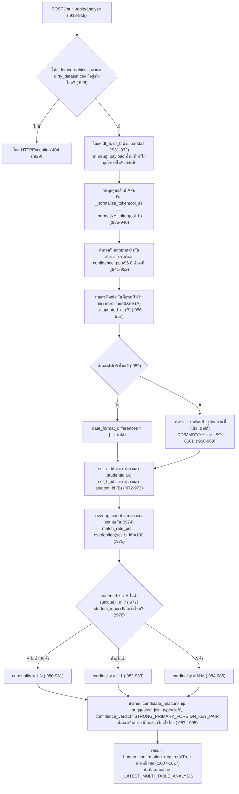

# 08. การวิเคราะห์ความสัมพันธ์หลายตารางและการรวมข้อมูล (Multi-table Relationship Analysis & Join)

> ผู้ใช้เห็นส่วนนี้ที่: หน้า White-Box Pipeline (`/whitebox`) ขั้นที่ 0 "เชื่อมโยงตาราง" · โค้ดหลัก: `api/app/api/whitebox.py:918-1017`

## 1. คำตอบ 30 วินาที

ขั้นที่ 0 ของหน้า White-Box Pipeline เปรียบเทียบตารางข้อมูลนักศึกษาสองตาราง (`student_demographics` กับ `student_course_score`) แล้วเสนอว่าน่าจะรวม (join) กันได้อย่างไร โดยคำนวณจริง 3 อย่างจากข้อมูล: การจับคู่ชื่อคอลัมน์ที่สะกดต่างกันแต่ความหมายเดียวกัน (`studentId` กับ `student_id`) ด้วยการแปลงชื่อให้เป็นรูปแบบเดียวกัน (token normalization, `api/app/api/whitebox.py:886-888`), อัตราการซ้อนทับของค่าคีย์ (key overlap rate, `:972-975`) และการอนุมานชนิดความสัมพันธ์ (cardinality) จากความเป็นค่าไม่ซ้ำของแต่ละคอลัมน์ (`:977-985`) แต่ส่วนสำคัญอีกหลายจุด — ตัวเลขความมั่นใจ 96%, รูปแบบวันที่ที่แสดง, ชื่อตาราง/คอลัมน์คีย์, ชนิด join ที่แนะนำ (`left`) และคำตัดสิน "ความสัมพันธ์แข็งแรง" — เป็น**ค่าคงที่ที่เขียนตายตัวในโค้ด ไม่ได้คำนวณจากข้อมูลเลย** ระบบไม่รวมข้อมูลให้อัตโนมัติ แต่ตั้งค่า `human_confirmation_required: true` เสมอ (`:1012`) และหน้าเว็บมีปุ่ม "Confirm Relationship & Execute Semi-Auto Join" ให้ผู้ใช้กดยืนยันก่อน ข้อจำกัดใหญ่ที่สุดคือ ทั้งชื่อไฟล์ตาราง ชื่อคอลัมน์คีย์ และคอลัมน์วันที่ล้วนเขียนตายตัวในโค้ด (payload ที่รับเข้ามาถูกละเลยบางส่วนหรือทั้งหมด) และในสภาพแวดล้อมที่ตรวจสอบบทนี้ (27 กันยายน 2026) ไฟล์ตาราง A (`student_demographics.csv`) ไม่มีอยู่จริง ทำให้ endpoint นี้คืนค่า 404 เสมอ (ดูข้อ 2, 5 และ 7)

## 2. มุมมองแบบ Black Box

ผู้ใช้เปิดหน้า `/whitebox` ระบบจะเรียก `POST /api/v1/whitebox/run-all` โดยอัตโนมัติทันทีที่หน้าโหลดเสร็จ (`ui/src/pages/WhiteBoxPipeline.jsx:70-74`) ซึ่งจะประมวลผลขั้นที่ 0 (เชื่อมโยงตาราง) ให้เสร็จล่วงหน้าเพื่อให้หน้าเว็บ "พร้อมสาธิต" ทันที ถ้าไม่มีข้อผิดพลาด ผู้ใช้จะเห็น 3 ส่วนในขั้นที่ 0:

1. **ตาราง "Schema & Naming Differences Detected"** — แถวที่บอกว่าคอลัมน์ไหนของตาราง A ตรงกับคอลัมน์ไหนของตาราง B ในเชิงความหมาย แม้สะกดต่างกัน พร้อมป้าย "Confidence" เป็นเปอร์เซ็นต์ และ "Evidence / Rationale" 3 บรรทัด (`ui/src/pages/WhiteBoxPipeline.jsx:494-523`)
2. **ตาราง "Format Reconciliation (Date Discrepancies)"** — แถวที่บอกว่าฟิลด์วันที่ของตาราง A กับ B ใช้รูปแบบต่างกันอย่างไร พร้อมค่าตัวอย่างจริงจากแต่ละตาราง (`:526-556`)
3. **การ์ด "Suggested Candidate Key" พร้อม "Human Confirmation Gate"** — แสดง Key Match Rate, Inferred Cardinality, และปุ่ม "Confirm Relationship & Execute Semi-Auto Join →" ที่ผู้ใช้ต้องกดเองก่อนระบบจะรวมตารางจริง (`:558-628`)

ผู้ใช้ไม่เห็นว่า: (ก) endpoint เดียวกันนี้ก็ถูกเรียกอัตโนมัติผ่าน `run-all` อยู่แล้วตั้งแต่หน้าโหลด รวมถึง**การรวมตารางจริงก็ถูกเรียกอัตโนมัติไปพร้อมกันด้วย ไม่ต้องรอกดปุ่มยืนยันเลย** (ดูข้อ 3.4 และ 7); (ข) ปุ่ม "Confirm" ที่เห็นบนจอไม่ได้ส่งค่าที่วิเคราะห์ได้จริงกลับไป แต่ส่ง payload ที่เขียนตายตัวไว้ในโค้ดหน้าเว็บเอง (ดูข้อ 3.5); และ (ค) ตัวเลข 96% และคำตัดสิน "ความสัมพันธ์แข็งแรง" ไม่ได้มาจากการคำนวณความมั่นใจทางสถิติใดๆ เลย

## 3. การทำงานภายใน (White Box)



### 3.1 การจับคู่ชื่อคอลัมน์ (Schema Differences) — token normalization ที่คำนวณจริง แต่ความมั่นใจตายตัว

`_normalize_token` (`api/app/api/whitebox.py:886-888`) รับชื่อคอลัมน์ ตัดทุกตัวอักษรที่ไม่ใช่ a-z หรือ 0-9 ออก แล้วแปลงเป็นตัวพิมพ์เล็ก ด้วยวิธีนี้ `studentId`, `student_id` และ `Student ID` ทั้งสามแบบจะกลายเป็นสตริงเดียวกันคือ `studentid` (ยืนยันด้วยหลักฐานจริงในข้อ 5) โค้ดวนเทียบทุกคู่คอลัมน์ระหว่างตาราง A และ B (`:936-940`) ถ้า token ตรงกันแต่การสะกดต่างกัน จะถือว่าเป็นคอลัมน์เดียวกันที่ใช้ชื่อคนละแบบ (naming convention difference) — ส่วนนี้**คำนวณจริง**จากชื่อคอลัมน์ของไฟล์ที่โหลดมา แต่ `confidence_pct` ที่แนบไปด้วยเป็นเลข `96.0` ที่เขียนตายตัวในทุกกรณีที่จับคู่ได้ (`:945`) ไม่มีการวัดความมั่นใจทางสถิติใดๆ เบื้องหลังตัวเลขนี้เลย เช่นเดียวกับข้อความ `"difference_type": "Naming Convention (camelCase vs snake_case)"` ที่เป็นสตริงตายตัว ไม่ได้ตรวจรูปแบบการสะกดจริงว่าเป็น camelCase หรือ snake_case จริงหรือไม่ (`:944`)

### 3.2 การจับคู่รูปแบบวันที่ — ตรวจแบบมีเงื่อนไขจริง แต่ป้ายกำกับรูปแบบตายตัว

โค้ดอ่านค่าแรกที่ไม่ว่าง (`.dropna().iloc[0]`) ของคอลัมน์ `enrollmentDate` จากตาราง A และ `updated_at` จากตาราง B (`:956-957`) — **นี่คือชื่อคอลัมน์ที่เขียนตายตัว** ไม่ใช่ชื่อที่ตรวจพบจากข้อ 3.1 หรือรับมาจาก payload ถ้าคอลัมน์ใดคอลัมน์หนึ่งไม่มีในตารางหรือค่าที่ได้เป็นสตริงว่าง เงื่อนไข `if sample_date_a and sample_date_b` (`:959`) จะเป็นเท็จ และ `date_format_differences` จะเป็นลิสต์ว่างเปล่าเงียบๆ โดยไม่มีข้อความแจ้งเตือนใดๆ ถ้าเงื่อนไขเป็นจริง ระบบจะเติมรายการที่มีป้ายกำกับรูปแบบวันที่เป็น**สตริงตายตัว** สองแบบเสมอ: `"DD/MM/YYYY (UK/TH Standard)"` สำหรับตาราง A และ `"YYYY-MM-DD HH:MM:SS (ISO-8601)"` สำหรับตาราง B (`:963,966`) — ไม่มีการตรวจจับรูปแบบวันที่จริงด้วย regex หรือไลบรารีใดๆ เพียงแค่มีค่าที่ไม่ว่างก็พอ ป้ายกำกับจะขึ้นเหมือนเดิมทุกครั้งไม่ว่าค่าจริงจะเป็นรูปแบบอะไรก็ตาม

**ข้อสังเกตสำคัญที่ตรวจพบระหว่างเขียนบทนี้:** ไฟล์ `dirty_dataset.csv` จริงในระบบ (ที่ `DIRTY_DATASET_PATH` ชี้ไป และเป็นไฟล์เดียวกับที่ endpoint นี้โหลดเป็นตาราง B) มีคอลัมน์เพียง `dirty_row_id, student_id, course, semester, score, study_hours` เท่านั้น (ตรวจสอบตรงด้วย `pandas.read_csv` ในคอนเทนเนอร์ `api` เมื่อ 2026-09-27) **ไม่มีคอลัมน์ `updated_at` อยู่เลย** แปลว่าต่อให้ไฟล์ตาราง A มีอยู่จริง เงื่อนไขที่ `:959` ก็จะเป็นเท็จเสมอ เพราะ `sample_date_b` จะเป็นสตริงว่างตลอด (`"updated_at" in df_b` เป็นเท็จที่ `:957`) ทำให้ตาราง "Format Reconciliation" บนหน้าเว็บว่างเปล่าเสมอในสภาพข้อมูลปัจจุบัน ไม่ใช่เพราะไม่มีความต่างของรูปแบบวันที่จริง แต่เพราะชื่อคอลัมน์ที่โค้ดค้นหาไม่ตรงกับคอลัมน์ที่มีอยู่จริงในไฟล์

### 3.3 การซ้อนทับของคีย์และ Cardinality — คำนวณจริงทั้งหมด

ส่วนนี้เป็นส่วนที่ "คำนวณจริง" มากที่สุดของทั้ง endpoint: `set_a_id`/`set_b_id` คือเซตของค่าไม่ซ้ำ (หลังตัดค่าว่างด้วย `.dropna()`) ของคอลัมน์ `studentId`/`student_id` (`:972-973`) `overlap_count` คือขนาดของเซตตัดกัน (`:974`) และ `match_rate_pct` คือ `overlap_count / len(set_b_id) × 100` ปัดเศษ 2 ตำแหน่ง — **หารด้วยจำนวนคีย์ไม่ซ้ำของตาราง B เท่านั้น ไม่ใช่ค่าเฉลี่ยหรือ Jaccard ของทั้งสองตาราง** (`:975`) ส่วน cardinality ใช้คุณสมบัติ `.is_unique` ของ pandas (`:977-978`) แล้วตัดสินด้วย if/elif/else ง่ายๆ 3 ทาง (`:980-985`) — ทั้งหมดนี้เปลี่ยนตามข้อมูลจริงทุกครั้งที่ไฟล์เปลี่ยน (ดูตัวอย่างคำนวณด้วยมือในข้อ 5)

อย่างไรก็ตาม ผลลัพธ์ของการคำนวณจริงนี้ถูกนำไปห่อด้วยค่าคงที่อีกชั้นหนึ่งในขั้นตอนถัดไป (ข้อ 3.4)

### 3.4 ค่าคงที่ที่ห่อผลการคำนวณ และช่องว่างระหว่างการวิเคราะห์กับการรวมข้อมูลจริง

`candidate_relationship` ที่ endpoint คืนกลับมามีฟิลด์ `suggested_join_type: "left"` และ `confidence_verdict: "STRONG_PRIMARY_FOREIGN_KEY_PAIR"` ซึ่ง**ทั้งสองเป็นสตริงตายตัวที่เขียนไว้ในโค้ดโดยตรง ไม่ผ่านเงื่อนไขใดๆ เลย** (`:997-998`) ต่อให้ `match_rate_pct` ที่คำนวณได้จริงในข้อ 3.3 ออกมาต่ำ (เช่น 10%) ข้อความ "STRONG_PRIMARY_FOREIGN_KEY_PAIR" ก็ยังจะปรากฏเหมือนเดิม เพราะไม่มีเกณฑ์ (threshold) ใดๆ มาเปรียบเทียบกับตัวเลขนี้เลยในซอร์สโค้ด และ `result["human_confirmation_required"]` ก็เป็น `True` ตายตัวเสมอเช่นกัน ไม่ได้แปรผันตามความมั่นใจของการวิเคราะห์ (`:1012`)

จุดที่สำคัญกว่านั้นคือ endpoint `/multi-table/join` (`execute_multi_table_join`, `:1020-1074`) **ไม่ได้รับหรืออ่านผลลัพธ์จาก `/multi-table/analyze` เลยแม้แต่ฟิลด์เดียว** มันทำงานจาก `MultiTableJoinPayload` ของตัวเองซึ่งมีค่าเริ่มต้นตายตัว (`join_key_a="studentId"`, `join_key_b="student_id"`, `join_type="left"`, `:875-882`) กระบวนการภายในคือ: (1) ถ้า `standardize_dates=True` และมีคอลัมน์ `enrollmentDate` ในตาราง A ให้แปลงเป็น `enrollment_date` รูปแบบ ISO แล้วลบคอลัมน์เดิมทิ้ง (`:1038-1040` — สังเกตว่าชื่อคอลัมน์ `enrollmentDate` เขียนตายตัว ไม่ได้อ่านจาก payload) (2) ถ้า `reconcile_schema=True` และ `payload.join_key_a` มีอยู่จริงในตาราง A ให้เปลี่ยนชื่อคอลัมน์นั้นเป็น `payload.join_key_b` พร้อมเปลี่ยนชื่อ `fullName` เป็น `student_name` ไปด้วยในบรรทัดเดียวกัน (`:1043-1044` — `fullName`→`student_name` เขียนตายตัว ไม่เกี่ยวกับ payload เลย) (3) รวมตารางจริงด้วย `pd.merge(df_b, df_a, on=payload.join_key_b, how=payload.join_type)` (`:1047-1052`)

### 3.5 หน้าเว็บกดปุ่ม "Confirm" แต่ส่งค่าตายตัว ไม่ใช่ค่าที่วิเคราะห์ได้

ปุ่ม "Confirm Relationship & Execute Semi-Auto Join" เรียก `handleConfirmJoin` (`ui/src/pages/WhiteBoxPipeline.jsx:129-146`) ซึ่งส่ง body ที่**เขียนตายตัวไว้ในโค้ดหน้าเว็บเอง** (`table_a_name`, `table_b_name`, `join_key_a: "studentId"`, `join_key_b: "student_id"`, `join_type: "left"` ฯลฯ, `:135-143`) — ไม่ได้อ่านค่าจาก `multiTableAnalysis` (ผลลัพธ์ของ `/analyze` ที่เก็บไว้ใน state) เลยแม้แต่ฟิลด์เดียว แปลว่าปุ่มนี้ "ยืนยัน" ในทางความหมาย/ผู้ใช้เท่านั้น (มนุษย์อ่านตัวเลขบนจอแล้วตัดสินใจกด) แต่ในทางเทคนิคปุ่มนี้ไม่ได้ส่งต่อผลการวิเคราะห์ที่เพิ่งคำนวณเสร็จไปยัง endpoint join เลย ถ้าการวิเคราะห์ครั้งนั้นบังเอิญพบคีย์คนละคู่หรือ cardinality คนละแบบ ปุ่มก็ยังจะสั่ง join ด้วยคีย์ตายตัวชุดเดิมอยู่ดี

### 3.6 การรวมข้อมูลจริงถูกเรียกอัตโนมัติตั้งแต่หน้าโหลด — ขัดกับ "Human Confirmation Gate" ที่อธิบายไว้

`run_all_stages()` (`api/app/api/whitebox.py:1081-1100+`) ซึ่งถูกเรียกจาก `POST /api/v1/whitebox/run-all` เรียก `analyze_multi_table_relationship()` แล้วเรียก `execute_multi_table_join(MultiTableJoinPayload())` **ต่อกันทันทีในบรรทัดถัดไป** โดยไม่มีการรอผู้ใช้ยืนยันใดๆ เลย และหน้า `WhiteBoxPipeline.jsx` เรียก `run-all` นี้อัตโนมัติทันทีที่คอมโพเนนต์ถูก mount ผ่าน `useEffect(() => { runFullPipeline(); }, [])` (`ui/src/pages/WhiteBoxPipeline.jsx:70-72`) แปลว่าในทางปฏิบัติ **การรวมตารางจริงเกิดขึ้นแล้วตั้งแต่ผู้ใช้เปิดหน้าเว็บ ก่อนที่จะเห็นปุ่ม "Confirm" ด้วยซ้ำ** ปุ่มบนการ์ด "Human Confirmation Gate" ที่ข้อ 2 อธิบาย จึงเป็นการยืนยันซ้ำของสิ่งที่ระบบทำไปแล้วเงียบๆ ไม่ใช่ประตูกั้นก่อนการกระทำจริงตามที่ข้อความในหน้าเว็บสื่อ (ข้อความ "The system does **not** blindly join datasets... requires human confirmation to seal the data contract", `ui/src/pages/WhiteBoxPipeline.jsx:591-595`) รายละเอียดผลกระทบดูข้อ 7

## 4. เดินผ่านโค้ดจริง

**ส่วนที่ 1 — จับคู่ชื่อคอลัมน์ด้วย token normalization**

```python
# api/app/api/whitebox.py:934-952
    # 1. Schema differences (Naming comparison)
    schema_mappings = []
    for col_a in df_a.columns:
        norm_a = _normalize_token(col_a)
        for col_b in df_b.columns:
            norm_b = _normalize_token(col_b)
            if norm_a == norm_b and col_a != col_b:
                schema_mappings.append({
                    "source_a_column": col_a,
                    "source_b_column": col_b,
                    "difference_type": "Naming Convention (camelCase vs snake_case)",
                    "confidence_pct": 96.0,
                    "evidence": [
                        f"Identical semantic token: '{norm_a}'",
                        f"Shared data types: {df_a[col_a].dtype} vs {df_b[col_b].dtype}",
                        "High cardinality unique identifier role"
                    ],
                    "suggested_standard": col_b
                })
```

| บรรทัด | ทำอะไร |
|---|---|
| 936-939 | วนทุกคู่คอลัมน์ (A×B) แปลงชื่อทั้งคู่ด้วย `_normalize_token` |
| 940 | เงื่อนไข: token เหมือนกัน **และ** ชื่อดิบต่างกัน (ถ้าชื่อเหมือนกันเป๊ะจะไม่ถูกนับว่าเป็น "ความต่าง") |
| 944 | ข้อความประเภทความต่างเป็นสตริงตายตัว ไม่ได้ตรวจรูปแบบการสะกดจริง |
| 945 | **`confidence_pct` = 96.0 ค่าคงที่ ใช้ค่าเดียวกันทุกคู่ที่จับคู่ได้ ไม่มีการคำนวณความมั่นใจจริง** |
| 946-950 | ข้อความ "evidence" 3 บรรทัด บรรทัดแรกใส่ค่า token จริงที่คำนวณได้ บรรทัดที่ 2 ใส่ชนิดข้อมูล (dtype) จริงของทั้งสองคอลัมน์ ส่วนบรรทัดที่ 3 เป็นข้อความตายตัว ไม่ได้ตรวจสอบว่าคอลัมน์นั้นเป็น "high cardinality unique identifier" จริงหรือไม่ |
| 951 | ค่ามาตรฐานที่แนะนำ = ชื่อคอลัมน์ของตาราง B เสมอ (ให้ตาราง B เป็นบรรทัดฐาน) |

**ส่วนที่ 2 — เปรียบเทียบรูปแบบวันที่**

```python
# api/app/api/whitebox.py:954-969
    # 2. Date format differences
    date_format_differences = []
    sample_date_a = str(df_a["enrollmentDate"].dropna().iloc[0]) if "enrollmentDate" in df_a else ""
    sample_date_b = str(df_b["updated_at"].dropna().iloc[0]) if "updated_at" in df_b else ""

    if sample_date_a and sample_date_b:
        date_format_differences.append({
            "source_a_field": "enrollmentDate",
            "source_a_sample": sample_date_a,
            "source_a_detected_format": "DD/MM/YYYY (UK/TH Standard)",
            "source_b_field": "updated_at",
            "source_b_sample": sample_date_b,
            "source_b_detected_format": "YYYY-MM-DD HH:MM:SS (ISO-8601)",
            "suggested_standard_format": "YYYY-MM-DD",
            "action": "Standardize to ISO-8601 YYYY-MM-DD upon join"
        })
```

| บรรทัด | ทำอะไร |
|---|---|
| 956-957 | ชื่อคอลัมน์วันที่ที่ค้นหาเขียนตายตัว (`enrollmentDate`, `updated_at`) ไม่เกี่ยวกับผลจากส่วนที่ 1 หรือ payload |
| 959 | ต้องมีค่าตัวอย่างทั้งสองฝั่งไม่ว่าง ถึงจะรายงานความต่าง — ถ้าคอลัมน์ใดไม่มีหรือว่างทั้งคอลัมน์ ผลลัพธ์จะว่างเปล่าเงียบๆ |
| 963,966 | ป้ายกำกับรูปแบบวันที่เป็นสตริงตายตัวเสมอ ไม่มีการตรวจจับรูปแบบจริงด้วย regex หรือ parser ใดๆ |
| 967-968 | รูปแบบมาตรฐานที่แนะนำ (`YYYY-MM-DD`) และคำอธิบายการกระทำ เป็นสตริงตายตัวเช่นกัน |

**ส่วนที่ 3 — การซ้อนทับของคีย์และ Cardinality**

```python
# api/app/api/whitebox.py:971-985
    # 3. Key Overlap & Relationship Cardinality Analysis
    set_a_id = set(df_a["studentId"].dropna())
    set_b_id = set(df_b["student_id"].dropna())
    overlap_count = len(set_a_id.intersection(set_b_id))
    match_rate_pct = round((overlap_count / len(set_b_id)) * 100, 2) if len(set_b_id) > 0 else 0.0

    is_a_unique = df_a["studentId"].is_unique
    is_b_unique = df_b["student_id"].is_unique

    if is_a_unique and not is_b_unique:
        cardinality = "1 Student -> Many Scores (1:N)"
    elif is_a_unique and is_b_unique:
        cardinality = "1:1 (One-to-One)"
    else:
        cardinality = "N:M (Many-to-Many)"
```

| บรรทัด | ทำอะไร |
|---|---|
| 972-973 | ชื่อคอลัมน์คีย์ (`studentId`, `student_id`) เขียนตายตัวเช่นกัน ไม่ได้มาจากผลตรวจจับคอลัมน์คีย์อัตโนมัติ — สร้างเซตค่าไม่ซ้ำหลังตัดค่าว่าง |
| 974 | จำนวนค่าคีย์ที่ปรากฏในทั้งสองตาราง (คำนวณจริง) |
| 975 | อัตราจับคู่ = ซ้อนทับ ÷ จำนวนคีย์ไม่ซ้ำของตาราง B × 100 (หารด้วย B เท่านั้น ไม่ใช่เฉลี่ยหรือ Jaccard ของทั้งคู่) กันหารศูนย์ด้วย `if len(set_b_id) > 0` |
| 977-978 | ตรวจว่าแต่ละคอลัมน์คีย์มีค่าไม่ซ้ำกัน (`is_unique` ของ pandas) หรือไม่ — คำนวณจริงจากข้อมูล |
| 980-985 | if/elif/else 3 ทาง: A ไม่ซ้ำ+B ซ้ำ→1:N, ทั้งคู่ไม่ซ้ำ→1:1, มิฉะนั้น (A ซ้ำ)→N:M — ไม่ครอบคลุมกรณี A ซ้ำ+B ไม่ซ้ำแยกจาก A ซ้ำ+B ซ้ำ ทั้งสองกรณีถูกจัดเป็น N:M เหมือนกันหมด |

**ส่วนที่ 4 — แก่นของฟังก์ชันรวมตารางจริง (join)**

```python
# api/app/api/whitebox.py:1037-1052
    # 1. Date standardization on Table A
    if payload.standardize_dates and "enrollmentDate" in df_a.columns:
        df_a["enrollment_date"] = pd.to_datetime(df_a["enrollmentDate"], format="%d/%m/%Y", errors="coerce").dt.strftime("%Y-%m-%d")
        df_a.drop(columns=["enrollmentDate"], inplace=True)

    # 2. Schema alignment (Rename key)
    if payload.reconcile_schema and payload.join_key_a in df_a.columns:
        df_a.rename(columns={payload.join_key_a: payload.join_key_b, "fullName": "student_name"}, inplace=True)

    # 3. Perform Join
    merged_df = pd.merge(
        df_b,
        df_a,
        on=payload.join_key_b,
        how=payload.join_type
    )
```

| บรรทัด | ทำอะไร |
|---|---|
| 1038-1040 | ถ้าเปิดใช้ `standardize_dates` และตาราง A มีคอลัมน์ `enrollmentDate` (ชื่อตายตัว) ให้แปลงรูปแบบ `DD/MM/YYYY`→ISO ด้วย `pd.to_datetime(..., format="%d/%m/%Y", errors="coerce")` (ค่าที่แปลงไม่ได้จะกลายเป็น `NaT`/ว่างเปล่าเงียบๆ) แล้วลบคอลัมน์เดิมทิ้ง |
| 1043-1044 | ถ้าเปิดใช้ `reconcile_schema` และตาราง A มีคอลัมน์ชื่อ `payload.join_key_a` ให้เปลี่ยนชื่อเป็น `payload.join_key_b` **พร้อมเปลี่ยนชื่อ `fullName`→`student_name` ไปในบรรทัดเดียวกันโดยไม่เกี่ยวกับ payload เลย** |
| 1047-1052 | รวมตารางจริงด้วย `pd.merge`: อาร์กิวเมนต์แรก (`df_b`) คือตาราง "ซ้าย" ในความหมายของ pandas ดังนั้น `how="left"` (ค่าเริ่มต้นจาก payload) จะ**รักษาทุกแถวของตาราง B (คะแนน) ไว้ทั้งหมด** และเติมข้อมูลจากตาราง A เท่าที่จับคู่ได้ — ตรงกับคำอธิบาย "Left Join to preserve all course score entries" ในผลวิเคราะห์ (ข้อ 3.4) แต่สังเกตว่าฟังก์ชันนี้ไม่ได้อ่านฟิลด์ `left_table`/`right_table` จาก `candidate_relationship` เลยแม้แต่น้อย — ชื่อสองฟิลด์นั้นในผลวิเคราะห์กับลำดับอาร์กิวเมนต์จริงในโค้ดนี้เป็นคนละกลไกที่บังเอิญให้ผลตรงกันเท่านั้น |

## 5. ตัวอย่างการคำนวณจริง

**หลักฐานจากการรันจริง (`docs/whitebox-report/evidence/08-analyze.json`, รันเมื่อ 2026-09-27):** เรียก `POST /api/v1/whitebox/multi-table/analyze` ด้วยเซสชันที่ล็อกอินแล้ว (`admin`/`admin` ตามรูปแบบใน `chapter-rules.md`) endpoint คืนค่า:

```
{"detail":"Source tables not found for multi-table analysis."}
```

พร้อมสถานะ HTTP `404` — ตรวจสอบตรงในคอนเทนเนอร์ `api` ยืนยันว่า `DEMOGRAPHICS_DATASET_PATH` (`/app/student_course_score_evaluation_dataset/student_demographics.csv`) **ไม่มีไฟล์อยู่จริง** ในสภาพแวดล้อมนี้ (`os.path.exists(...)` คืน `False`) ในขณะที่ `DIRTY_DATASET_PATH` มีไฟล์อยู่จริง เข้าเงื่อนไข `:928` พอดี จึงโยน 404 ตามที่โค้ดออกแบบไว้ (`:928-929`) นี่คือพฤติกรรมจริงของระบบในสภาพข้อมูลปัจจุบัน ไม่ใช่ข้อผิดพลาดของการเรียก — endpoint `/multi-table/join` ก็จะคืน 404 เช่นเดียวกันด้วยเหตุผลเดียวกัน (`:1031-1032`) เพราะพึ่งพาไฟล์เดียวกัน

**หลักฐานจากการรัน `_normalize_token` จริง (`docs/whitebox-report/evidence/08-normalize.txt`):**

```
'studentId' -> 'studentid'
'student_id' -> 'studentid'
'Student ID' -> 'studentid'
'enrollmentDate' -> 'enrollmentdate'
'updated_at' -> 'updatedat'
```

ยืนยันตรงตามสูตรที่ `:886-888`: `studentId`, `student_id`, `Student ID` แปลงเป็น token เดียวกัน (`studentid`) จึงถูกจับคู่ได้ ในขณะที่ `enrollmentDate` (`enrollmentdate`) กับ `updated_at` (`updatedat`) เป็นคนละ token — **ต่อให้ทั้งสองคอลัมน์นี้มีอยู่ในไฟล์จริงพร้อมกัน ระบบก็จะไม่จับคู่ชื่อคอลัมน์วันที่ทั้งสองนี้ในขั้นตอนที่ 1 (schema differences) เลย** เพราะ token ไม่ตรงกัน — ส่วนขั้นตอนที่ 2 (date format differences) ใช้ชื่อคอลัมน์ตายตัวเปรียบเทียบตรงๆ อยู่แล้ว ไม่ได้พึ่งผลจากขั้นตอนที่ 1 (ดูข้อ 3.2)

**เนื่องจาก endpoint คืน 404 ในสภาพแวดล้อมนี้ (ไม่มีไฟล์ตาราง A) จึงไม่มีผลลัพธ์จริงของ `candidate_relationship`/`schema_differences`/`date_format_differences`/การรวมตารางให้แสดง ส่วนนี้จึงคำนวณด้วยมือจากสูตรที่ `api/app/api/whitebox.py:936-985` และ `:1037-1052` บนตัวอย่าง 5 แถวต่อตารางที่กำหนดขึ้นเองในบทนี้ (ระบุชัดว่าเป็นค่าสมมติ ไม่ใช่ข้อมูลจริงในระบบ):**

ตาราง A (`student_demographics`, สมมติ 5 แถว):

| studentId | fullName | enrollmentDate |
|---|---|---|
| S001 | Alice | 12/01/2024 |
| S002 | Bob | 15/01/2024 |
| S003 | Cara | 20/01/2024 |
| S004 | Dan | 01/02/2024 |
| S005 | Eve | 05/02/2024 |

ตาราง B (`student_course_score`, สมมติ 5 แถว — ใช้โครงคอลัมน์จริงของ `dirty_dataset.csv` ที่ตรวจพบในข้อ 3.2 คือไม่มี `updated_at`):

| student_id | course | semester | score | study_hours |
|---|---|---|---|---|
| S002 | MATH201 | 2025-2 | 70.9 | 6.5 |
| S002 | PHYS110 | 2025-2 | 65.0 | 5.0 |
| S003 | MATH201 | 2025-2 | 78.8 | 40.4 |
| S003 | ENG101 | 2025-2 | 55.0 | 10.0 |
| S006 | MATH201 | 2025-2 | 90.0 | 12.0 |

**คำนวณด้วยมือจากสูตรที่ `api/app/api/whitebox.py:936-985`:**

| ขั้น | สูตร/การพิจารณา | ผลลัพธ์ |
|---|---|---|
| schema_mappings (`:936-952`) | `_normalize_token("studentId")="studentid"` ตรงกับ `_normalize_token("student_id")="studentid"` และสะกดต่างกัน → จับคู่ได้ 1 คู่; `fullName`/`enrollmentDate` ไม่ตรงกับคอลัมน์ใดใน B เลย | 1 รายการ: `studentId`↔`student_id`, `confidence_pct=96.0` (ค่าคงที่) |
| date_format_differences (`:956-969`) | ตาราง B ไม่มีคอลัมน์ `updated_at` เลย → `sample_date_b=""` → เงื่อนไข `:959` เป็นเท็จ | ว่างเปล่า `[]` (แม้ตาราง A จะมีวันที่รูปแบบ DD/MM/YYYY จริงก็ตาม) |
| set_a_id (`:972`) | {S001,S002,S003,S004,S005} | ขนาด 5 |
| set_b_id (`:973`) | {S002,S003,S006} (ค่าไม่ซ้ำ แม้ B มี 5 แถวแต่ S002/S003 ซ้ำกัน) | ขนาด 3 |
| overlap_count (`:974`) | {S002,S003,S006} ∩ {S001,...,S005} = {S002,S003} | **2** |
| match_rate_pct (`:975`) | round(2 ÷ 3 × 100, 2) | **66.67%** |
| is_a_unique (`:977`) | studentId ของ A ไม่ซ้ำเลยทั้ง 5 แถว | True |
| is_b_unique (`:978`) | student_id ของ B ซ้ำ (S002, S003 ซ้ำ) | False |
| cardinality (`:980-981`) | A ไม่ซ้ำ + B ซ้ำ → เข้าเงื่อนไขแรก | **"1 Student -> Many Scores (1:N)"** |
| suggested_join_type (`:997`) | ค่าคงที่เสมอ ไม่ผ่านเงื่อนไข | `"left"` |
| confidence_verdict (`:998`) | ค่าคงที่เสมอ ไม่ว่า match_rate_pct จะเป็น 66.67% หรือค่าอื่นใด | `"STRONG_PRIMARY_FOREIGN_KEY_PAIR"` |

**เดินผ่านการรวมตารางด้วยมือจากสูตรที่ `:1037-1052`** (ค่าเริ่มต้น payload: `standardize_dates=True`, `reconcile_schema=True`, `join_key_a="studentId"`, `join_key_b="student_id"`, `join_type="left"`):

1. แปลง `enrollmentDate` ของ A เป็น `enrollment_date` รูปแบบ ISO: `12/01/2024→2024-01-12`, `15/01/2024→2024-01-15`, ... แล้วลบคอลัมน์ `enrollmentDate` เดิม
2. เปลี่ยนชื่อ `studentId→student_id` ในตาราง A (คอลัมน์ `fullName` จะพยายามเปลี่ยนเป็น `student_name` ด้วย แต่ในตัวอย่างนี้ A มีคอลัมน์ชื่อ `fullName` อยู่แล้วพอดี จึงเปลี่ยนสำเร็จ)
3. `pd.merge(df_b, df_a, on="student_id", how="left")` — เก็บทุกแถวของ B (5 แถว) ไว้ทั้งหมด: แถว `S002`×2 และ `S003`×2 จะได้ `fullName`/`enrollment_date` จาก A มาเติม ส่วนแถว `S006` จะได้ `fullName`/`enrollment_date` เป็นค่าว่าง (`NaN`) เพราะ `S006` ไม่มีอยู่ในตาราง A เลย → ผลลัพธ์คือตารางรวม 5 แถว โดย 1 แถวไม่มีข้อมูลประชากรศาสตร์แนบมา (`matched_rows=4`, `unmatched_rows=1` ตามสูตรที่ `:1068-1069` ซึ่งนับจากคอลัมน์ `faculty` — ในตัวอย่างสมมตินี้ไม่มีคอลัมน์ `faculty` จึงเป็นการประมาณจากตรรกะเดียวกัน ไม่ใช่ผลจริงจากระบบ)

## 6. ทำไมออกแบบแบบนี้ และทางเลือกอื่น

**ทำไมต้องมีมนุษย์ยืนยันก่อน join (Human Confirmation Gate):** การรวมสองตารางเข้าด้วยกันเป็นการตัดสินใจที่ผิดพลาดแล้วแก้ยาก — ถ้าเดาคีย์หรือชนิดความสัมพันธ์ผิด ข้อมูลที่ได้จะดูสมบูรณ์แต่ผิดพลาดโดยไม่มีสัญญาณเตือน (เช่น จับคู่ผิดคนถ้าคีย์ไม่ใช่ unique จริง หรือรวมข้อมูลซ้ำซ้อนถ้าเข้าใจ cardinality ผิด) หน้าเว็บจึงออกแบบให้ผู้ใช้เห็นตัวเลข (match rate, cardinality) ก่อนกดยืนยัน แทนที่จะรวมข้อมูลให้อัตโนมัติแบบ "กล่องดำ" — นี่คือเจตนาการออกแบบที่ระบุตรงในคอมเมนต์ของฟังก์ชัน (`api/app/api/whitebox.py:926`: "Prepares recommendations for the User Confirmation Gate (No silent auto-joins)") ทางเลือกอื่นคือรวมอัตโนมัติทันทีที่ match rate เกินเกณฑ์ที่ตั้งไว้ ซึ่งเร็วกว่าแต่เสี่ยงกว่า ข้อเสียของแนวทางที่เลือกคือ ต้องพึ่งพาผู้ใช้เข้าใจตัวเลขที่แสดง (match rate, cardinality) มากพอจะตัดสินใจได้ถูก และในทางปฏิบัติของระบบนี้ (ข้อ 3.6) ประตูยืนยันนี้ก็ถูกข้ามไปแล้วโดย `run-all` เสียเอง ทำให้เจตนาการออกแบบไม่ตรงกับพฤติกรรมจริง

**ทำไมจับคู่ชื่อคอลัมน์ด้วยการตัดอักขระพิเศษ+ตัวพิมพ์เล็ก (token normalization) แทนวิธีอื่น:** วิธีนี้ง่ายและครอบคลุมกรณีตั้งชื่อคอลัมน์ที่พบบ่อยที่สุด (camelCase vs snake_case vs "มีช่องว่าง") ด้วยโค้ดบรรทัดเดียว (`:886-888`) ทางเลือกอื่นคือใช้ Levenshtein/fuzzy string matching (จับคู่ชื่อที่ใกล้เคียงกันแม้ไม่ตรง token เป๊ะ) หรือใช้พจนานุกรมคำพ้องความหมายทางธุรกิจ (เช่น `sid` กับ `student_id`) ข้อเสียของวิธีที่เลือกคือจับคู่ได้เฉพาะกรณีที่ตัดอักขระพิเศษแล้วเหมือนกันเป๊ะ — ชื่อที่มีความหมายเดียวกันแต่สะกดคนละคำเลย (เช่น `sid` กับ `student_number`) จะไม่ถูกตรวจพบเลย

**ทำไม `confidence_pct`/`confidence_verdict`/`suggested_join_type` ไม่คำนวณจริง:** เป็นข้อจำกัดของการที่ฟีเจอร์นี้ถูกออกแบบมาสำหรับสาธิต 2 ตารางที่รู้จักล่วงหน้า (`student_demographics`/`student_course_score`) ไม่ใช่เครื่องมือค้นความสัมพันธ์ทั่วไป — เมื่อรู้ล่วงหน้าอยู่แล้วว่าคีย์คู่ไหนคือคีย์จริง การเขียนค่าความมั่นใจสูงตายตัวจึงดู "ใช้งานได้" ในสภาพแวดล้อมสาธิต แต่ถ้านำไปใช้กับข้อมูลอื่นที่ไม่รู้จักคีย์ล่วงหน้า ค่าคงที่เหล่านี้จะทำให้ผู้ใช้เข้าใจผิดว่าเป็นความมั่นใจที่วัดได้จริง

**สิ่งที่การค้นหาความสัมพันธ์ระหว่างตาราง (relationship discovery) ที่ทำได้จริงต้องมีเพิ่ม:** ระบบปัจจุบันรู้ล่วงหน้าแล้วว่าคีย์คือ `studentId`/`student_id` (เขียนตายตัวที่ `:972-973`) การค้นหาความสัมพันธ์แบบทั่วไปที่ไม่รู้คีย์ล่วงหน้าต้องทำอย่างน้อย 2 อย่างเพิ่มเติม: (1) **สแกนค่าซ้อนทับ (value-overlap scan) ข้ามทุกคู่คอลัมน์** ไม่ใช่แค่คู่ที่ชื่อ token ตรงกัน — เพราะคีย์ที่แท้จริงอาจมีชื่อไม่เกี่ยวข้องกันเลย (เช่น `school_id` ในตาราง A กับ `campus_code` ในตาราง B ที่บังเอิญเก็บค่าเดียวกัน) วิธีนี้ต้องคำนวณอัตราซ้อนทับของทุกคู่คอลัมน์ (ไม่ใช่แค่คู่ studentId/student_id ที่เขียนตายตัวไว้) แล้วจัดอันดับตามอัตราซ้อนทับสูงสุด (2) **ตรวจสอบ Inclusion Dependency อย่างเป็นระบบ** คือตรวจว่าค่าเกือบทั้งหมด (หรือทั้งหมด) ของคอลัมน์ผู้สมัคร foreign key ปรากฏอยู่ในคอลัมน์ผู้สมัคร primary key จริงหรือไม่ (ไม่ใช่แค่ดูว่ามีค่าซ้อนทับบางส่วน) ร่วมกับตรวจว่าฝั่ง primary key เป็นค่าไม่ซ้ำจริง (`is_unique`) ซึ่งระบบนี้ทำเฉพาะขั้นตอนหลังสำหรับคีย์คู่เดียวที่รู้ล่วงหน้าเท่านั้น (`:977-978`) ไม่ได้ทำเป็นการค้นหาทั่วทั้งตาราง

## 7. ข้อจำกัด ค่าตายตัว และข้อสังเกต

**คำนวณจริง:** การจับคู่ชื่อคอลัมน์ด้วย token normalization ผ่าน `_normalize_token` (`api/app/api/whitebox.py:886-888,936-940`); อัตราการซ้อนทับของค่าคีย์ (key overlap rate) — `overlap_count`, `match_rate_pct` (`:972-975`); การอนุมาน cardinality จากความไม่ซ้ำของแต่ละคอลัมน์คีย์ (`:977-985`); ชนิดข้อมูล (dtype) จริงที่แนบในข้อความ evidence ของแต่ละคู่คอลัมน์ (`:948`); ผลลัพธ์การแปลงวันที่จริงในขั้นตอนรวมตาราง (`:1039`)

**เป็นค่าคงที่/ค่าตายตัว ไม่ใช่ผลจากข้อมูล:** `confidence_pct=96.0` สำหรับทุกคู่คอลัมน์ที่จับคู่ได้ (`:945`); ข้อความประเภทความต่าง `"Naming Convention (camelCase vs snake_case)"` (`:944`); ป้ายกำกับรูปแบบวันที่ `"DD/MM/YYYY (UK/TH Standard)"` และ `"YYYY-MM-DD HH:MM:SS (ISO-8601)"` (`:963,966`); ชื่อตารางและชื่อคอลัมน์คีย์ที่เขียนตายตัวตลอดฟังก์ชัน (`studentId`, `student_id`, `enrollmentDate`, `updated_at`, `fullName`, `:928,931-932,956-957,972-973,1038,1044`); `suggested_join_type="left"` (`:997`); `confidence_verdict="STRONG_PRIMARY_FOREIGN_KEY_PAIR"` ที่ไม่ผ่านเงื่อนไขใดๆ (`:998`); `human_confirmation_required=True` ตายตัวเสมอ ไม่แปรผันตามผลวิเคราะห์ (`:1012`)

**ค่าสำรอง (fallback) และพฤติกรรมเงียบ:** `match_rate_pct=0.0` เมื่อ `set_b_id` ว่างเปล่า กันหารด้วยศูนย์ (`:975`); `date_format_differences` เป็นลิสต์ว่างเปล่าเงียบๆ โดยไม่มีข้อความแจ้งเตือนเมื่อคอลัมน์วันที่ที่ค้นหาไม่มีอยู่จริงหรือว่างทั้งคอลัมน์ (`:959`) — ยืนยันแล้วว่าเกิดขึ้นจริงกับ `dirty_dataset.csv` ปัจจุบันเพราะไม่มีคอลัมน์ `updated_at` เลย (ข้อ 3.2); ทั้ง `/multi-table/analyze` และ `/multi-table/join` คืน 404 เงียบๆ เมื่อไฟล์ตารางใดตารางหนึ่งไม่มีอยู่ (`:928-929,1031-1032`) — ในสภาพแวดล้อมของบทนี้เกิดขึ้นจริงเพราะไม่มี `student_demographics.csv`

**บั๊ก/ข้อสังเกตที่พบระหว่างเขียนบทนี้:**

1. **การรวมตารางจริงถูกเรียกอัตโนมัติตั้งแต่หน้าโหลด ขัดกับคำอธิบาย "Human Confirmation Gate" บนหน้าเว็บเอง** ตามที่อธิบายในข้อ 3.6: `run_all_stages()` เรียก `execute_multi_table_join(MultiTableJoinPayload())` ทันทีต่อจาก `analyze_multi_table_relationship()` โดยไม่รอผู้ใช้ (`api/app/api/whitebox.py:1081` เป็นต้นไป บรรทัดเรียกฟังก์ชันทั้งสองอยู่ติดกัน) และหน้าเว็บเรียก `run-all` นี้อัตโนมัติทันทีที่โหลด (`ui/src/pages/WhiteBoxPipeline.jsx:70-72`) ในขณะที่ข้อความบนหน้าเว็บเดียวกันยืนยันตรงๆ ว่า "The system does **not** blindly join datasets... requires human confirmation to seal the data contract" (`:591-595`) ผลกระทบ: ผู้ใช้ที่แค่เปิดหน้าเว็บโดยไม่ได้กดปุ่มอะไรเลย จะพบว่าไฟล์ผลลัพธ์รวม (`unified_multitable_dataset.csv`) ถูกเขียนไปแล้วจริงๆ (`:1055`) และแคชการ profiling ก็ถูกอัปเดตไปแล้วเช่นกัน (`:1059-1060`) โดยไม่มีการกดยืนยันใดๆ เกิดขึ้นจริง
2. **`analyze_multi_table_relationship` รับพารามิเตอร์ `payload` (`MultiTableAnalyzePayload` ที่มีฟิลด์ `table_a_name`/`table_b_name`) แต่ไม่ใช้ค่าจากพารามิเตอร์นี้เลยแม้แต่บรรทัดเดียวในฟังก์ชัน** (ตรวจสอบด้วย `grep` ทั้งฟังก์ชัน `:919-1017` ไม่พบการอ้างถึงตัวแปร `payload` เลย) ฟังก์ชันโหลดไฟล์จาก `DEMOGRAPHICS_DATASET_PATH`/`DIRTY_DATASET_PATH` ที่เขียนตายตัวเสมอ และค้นหาคอลัมน์ชื่อ `studentId`/`student_id`/`enrollmentDate`/`updated_at` ที่เขียนตายตัวเสมอ ไม่ว่าผู้เรียก endpoint จะส่งชื่อตารางอะไรมาก็ตาม ผลกระทบ: endpoint นี้ทำงานได้กับตาราง 2 ตารางนี้เท่านั้น แม้ API schema จะสื่อว่ารับชื่อตารางแบบกำหนดเองได้
3. **ปุ่ม "Confirm" บนหน้าเว็บไม่ส่งผลการวิเคราะห์กลับไปยัง endpoint join** (ข้อ 3.5) `handleConfirmJoin` ส่ง body ที่เขียนตายตัวในโค้ดหน้าเว็บเอง ไม่ใช่ค่าจาก state `multiTableAnalysis` ที่เพิ่งคำนวณเสร็จ (`ui/src/pages/WhiteBoxPipeline.jsx:135-143`) ผลกระทบ: "การยืนยัน" ที่ผู้ใช้ทำเป็นเพียงการยืนยันเชิงความหมายว่า "เห็นตัวเลขแล้วโอเค" แต่ในทางเทคนิคไม่ได้เชื่อมโยงกับตัวเลขที่เห็นเลย
4. **`dirty_dataset.csv` จริงในระบบไม่มีคอลัมน์ `updated_at`** (ยืนยันด้วย `pandas.read_csv` ตรงในคอนเทนเนอร์ `api`, คอลัมน์จริงคือ `dirty_row_id, student_id, course, semester, score, study_hours`) ทำให้ `date_format_differences` จะว่างเปล่าเสมอในสภาพข้อมูลปัจจุบัน ต่อให้ไฟล์ตาราง A มีอยู่ครบก็ตาม (ข้อ 3.2)
5. **`match_rate_pct` หารด้วยจำนวนคีย์ไม่ซ้ำของตาราง B เท่านั้น** (`:975`) ไม่ใช่ค่าเฉลี่ยหรือ Jaccard similarity ของทั้งสองตาราง ทำให้ตัวเลขนี้ไม่สมมาตร — ถ้าสลับตาราง A/B ตัวเลขจะเปลี่ยนไปด้วย แม้ความสัมพันธ์เชิงข้อมูลจะเหมือนเดิม
6. **ทั้งไฟล์ต้นฉบับ (`student_demographics.csv`) หายไปจากระบบ** ทำให้ endpoint นี้ใช้งานจริงไม่ได้เลยในสภาพแวดล้อมที่ตรวจสอบบทนี้ (2026-09-27) — เป็นข้อจำกัดของสภาพแวดล้อมการทดสอบ ไม่ใช่บั๊กในตรรกะของโค้ด แต่ก็หมายความว่าฟีเจอร์นี้ไม่เคยถูกสาธิตได้จริงในสภาพแวดล้อมปัจจุบัน

## 8. คำถามกรรมการ

### พื้นฐาน (อย่างน้อย 3 ข้อ)

1. **ระบบรู้ได้อย่างไรว่า `studentId` กับ `student_id` คือคอลัมน์เดียวกัน?** ระบบตัดอักขระพิเศษออกและแปลงเป็นตัวพิมพ์เล็กด้วยฟังก์ชัน `_normalize_token` (`api/app/api/whitebox.py:886-888`) ทำให้ทั้งสองชื่อกลายเป็นสตริงเดียวกันคือ `studentid` ยืนยันด้วยหลักฐานจริงใน `docs/whitebox-report/evidence/08-normalize.txt` แล้วนำไปเทียบทุกคู่คอลัมน์ระหว่างสองตาราง (`:936-940`) ดูรายละเอียดในข้อ 3.1
2. **ระบบรวม (join) ตารางให้อัตโนมัติเลยไหม หรือต้องมีคนกดยืนยัน?** ผลวิเคราะห์คืนค่า `human_confirmation_required: true` เสมอ (`:1012`) และหน้าเว็บมีปุ่มให้กดยืนยันก่อนเรียก endpoint join จริง แต่มีข้อยกเว้นสำคัญ: `run-all` ที่ทำงานอัตโนมัติทันทีที่หน้าโหลดได้เรียกทั้งการวิเคราะห์และการรวมตารางจริงต่อกันไปแล้วโดยไม่รอผู้ใช้ (ข้อ 3.6 และข้อ 7 ข้อ 1) จึงตอบตรงๆ ว่า "ในทางทฤษฎีต้องกดยืนยัน แต่ในทางปฏิบัติของหน้านี้ การรวมได้เกิดขึ้นไปแล้วตั้งแต่ก่อนกด"
3. **cardinality (1:N, 1:1, N:M) ที่ระบบแสดงมาจากไหน?** มาจากการตรวจสอบว่าคอลัมน์คีย์ของแต่ละตารางมีค่าไม่ซ้ำ (`is_unique` ของ pandas) หรือไม่ แล้วตัดสินด้วยเงื่อนไข if/elif/else 3 ทาง (`:977-985`) เป็นการคำนวณจริงจากข้อมูล ไม่ใช่ค่าคงที่ ดูตัวอย่างคำนวณด้วยมือในข้อ 5

### เชิงลึก (อย่างน้อย 3 ข้อ)

1. **ความมั่นใจ 96% คำนวณจากอะไร?** ตอบตรงไปตรงมา: **ไม่ได้คำนวณจากอะไรเลย** เป็นตัวเลขคงที่ (`confidence_pct: 96.0`) ที่เขียนไว้ในโค้ดสำหรับทุกคู่คอลัมน์ที่จับคู่ชื่อได้ (`api/app/api/whitebox.py:945`) ไม่มีสูตรทางสถิติ ไม่มีการเทียบกับเกณฑ์ใดๆ อยู่เบื้องหลัง ต่อให้จับคู่ผิดโดยบังเอิญ (token ชนกันแต่ความหมายไม่เกี่ยวกัน) ตัวเลขก็ยังจะแสดง 96% เท่ากันทุกครั้ง เช่นเดียวกับ `confidence_verdict="STRONG_PRIMARY_FOREIGN_KEY_PAIR"` ที่เขียนตายตัวไม่ผ่านเงื่อนไขใดๆ (`:998`) แม้ `match_rate_pct` ที่คำนวณได้จริงจะต่ำแค่ไหนก็ตาม ดูข้อ 3.4 และข้อ 7
2. **ฟีเจอร์นี้ใช้กับตารางคู่อื่นได้ไหม?** ตอบตรงไปตรงมา: **ไม่ได้ในสภาพปัจจุบัน** แม้ endpoint จะรับ payload ที่มีฟิลด์ `table_a_name`/`table_b_name` แต่ฟังก์ชัน `analyze_multi_table_relationship` ไม่อ่านค่าพารามิเตอร์นี้เลยแม้แต่บรรทัดเดียว (ยืนยันด้วย grep ทั้งฟังก์ชัน) มันโหลดไฟล์และค้นหาคอลัมน์ชื่อ `studentId`/`student_id`/`enrollmentDate`/`updated_at` ที่เขียนตายตัวเสมอ (`:928,931-932,956-957,972-973`) ส่วนฟังก์ชัน join แม้จะอ่าน `payload.join_key_a`/`join_key_b` จริง แต่ก็ยังเขียนชื่อคอลัมน์ `enrollmentDate`/`fullName` ตายตัวปนอยู่ในตรรกะเดียวกัน (`:1038,1044`) จึงใช้ได้จริงเฉพาะกับตารางคู่ `student_demographics`/`student_course_score` เท่านั้น ดูรายละเอียดในข้อ 3.4 และข้อ 7 ข้อ 2
3. **ถ้า join ผิด (จับคีย์ผิด หรือ cardinality เข้าใจผิด) จะเกิดอะไรขึ้น?** ผลลัพธ์ของ `pd.merge` จะยังคืนตารางที่ "ดูสมบูรณ์" เสมอ ไม่มีการแจ้งเตือนเมื่อจับคู่ผิด — ถ้าคีย์ที่เข้าใจว่าไม่ซ้ำ (unique) จริงๆ มีค่าซ้ำอยู่ การ join แบบ `how="left"` จะเพิ่มจำนวนแถวขึ้นจากการจับคู่ 1-ต่อ-หลาย (fan-out) โดยไม่มีสัญญาณเตือนใดๆ เพราะระบบตรวจสอบ `is_unique` เพียงครั้งเดียวตอนวิเคราะห์ (`:977-978`) แต่ไม่ตรวจซ้ำตอน join จริง (`:1047-1052`) ถ้าข้อมูลเปลี่ยนไประหว่างสองขั้นตอนนี้ (เช่น endpoint วิเคราะห์ถูกเรียกจากไฟล์ชุดหนึ่ง แต่ endpoint join โหลดไฟล์ใหม่ที่เพิ่งอัปเดต) ผลลัพธ์ที่ผู้ใช้ยืนยันไปอาจไม่ตรงกับข้อมูลที่ join จริงเลย เพราะทั้งสอง endpoint ต่างคนต่างโหลดไฟล์ CSV ใหม่ทุกครั้งที่ถูกเรียก ไม่มีการล็อกอ้างอิงเวอร์ชันข้อมูลระหว่างสองขั้นตอน

### จุดอ่อน (อย่างน้อย 2 ข้อ) — ตอบตรงไปตรงมา: ยอมรับข้อจำกัด อธิบายผลกระทบ และบอกว่าจะแก้อย่างไร

1. **"Human Confirmation Gate" ที่หน้าเว็บโฆษณาไว้ ถูกข้ามไปแล้วจริงๆ ในทางปฏิบัติ ใช่หรือไม่?** ตอบตรงๆ: **ใช่** ตามที่พิสูจน์ในข้อ 3.6 และข้อ 7 ข้อ 1 — `run-all` ที่ทำงานอัตโนมัติทันทีที่เปิดหน้าเว็บได้เรียกทั้งวิเคราะห์และรวมตารางจริงไปแล้ว ก่อนผู้ใช้จะเห็นปุ่ม "Confirm" ด้วยซ้ำ ปุ่มที่เห็นจึงเป็นเพียงการยืนยันซ้ำของสิ่งที่เกิดขึ้นไปแล้วเงียบๆ ผลกระทบคือถ้าผู้ใช้เข้าใจว่าการรวมข้อมูลจะไม่เกิดขึ้นจนกว่าจะกดปุ่ม (ตามข้อความในหน้าเว็บ) ความเข้าใจนั้นผิดสำหรับเส้นทาง `run-all` ทางแก้ที่ตรงไปตรงมาคือแยกให้ `run-all` เรียกเฉพาะขั้นตอนวิเคราะห์และ preview เท่านั้น ไม่เรียก `execute_multi_table_join` อัตโนมัติ ปล่อยให้การรวมตารางจริงเกิดขึ้นเฉพาะเมื่อผู้ใช้กดปุ่มเท่านั้น
2. **ตัวเลข 96%/"STRONG_PRIMARY_FOREIGN_KEY_PAIR" ที่ดูน่าเชื่อถือ อาจทำให้ผู้ใช้เข้าใจผิดอย่างไร?** ตอบตรงๆ: ตัวเลขและคำตัดสินเหล่านี้ถูกเขียนให้ดูเหมือนผลจากการวิเคราะห์ทางสถิติ (มีเปอร์เซ็นต์ มีคำตัดสิน "STRONG") แต่จริงๆ เป็นค่าคงที่ตายตัวที่ไม่แปรผันตามข้อมูลเลย (ข้อ 3.4) ถ้าผู้ใช้เห็นตัวเลข 96% แล้วเชื่อว่าเป็นความมั่นใจที่วัดได้จริง อาจตัดสินใจกดยืนยันการ join โดยไม่ตรวจสอบตัวเลขที่คำนวณจริงอื่นๆ (เช่น `match_rate_pct` ที่อาจต่ำ) ให้ถี่ถ้วนพอ ผลกระทบยิ่งชัดเจนขึ้นถ้านำฟีเจอร์นี้ไปใช้กับตารางอื่นที่ไม่ใช่คู่สาธิต (ซึ่งตามข้อ 7 ข้อ 2 ทำไม่ได้อยู่แล้วในโค้ดปัจจุบัน) เพราะค่าคงที่เหล่านี้จะยังแสดงเหมือนเดิมไม่ว่าคุณภาพการจับคู่จริงจะเป็นอย่างไร ทางแก้คือแทนที่ `confidence_pct`/`confidence_verdict` ด้วยค่าที่คำนวณจริงจาก `match_rate_pct` ผ่านเกณฑ์ที่กำหนดไว้ชัดเจน (เช่น >95%→"STRONG", 70-95%→"MODERATE", <70%→"WEAK — ตรวจสอบก่อน join") แทนสตริงตายตัวเดียว
