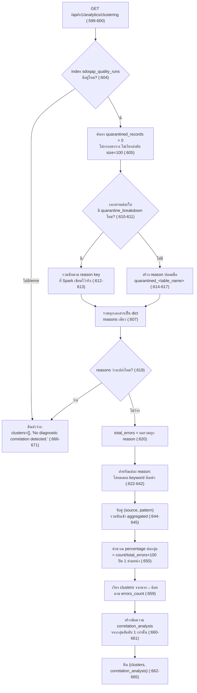

# 10. การจัดกลุ่มรูปแบบข้อผิดพลาด ("Error Clustering")

> ผู้ใช้เห็นส่วนนี้ที่: หน้า **Query & Metrics** (`/analytics`, label "Query & Metrics" ใน `ui/src/config/pages.js:15`) การ์ด "รูปแบบข้อผิดพลาด" · โค้ดหลัก: `api/app/api/analytics.py:599-671`

## 1. คำตอบ 30 วินาที

การ์ด "รูปแบบข้อผิดพลาด" ในหน้า Query & Metrics **ไม่ได้ใช้อัลกอริทึม clustering ใดๆ เลย** — เป็นเพียง endpoint `GET /api/v1/analytics/clustering` (`api/app/api/analytics.py:599-671`) ที่ดึงเอกสารคุณภาพข้อมูล (quality run) สูงสุด 100 รายการที่ `quarantined_records > 0` จากดัชนี Elasticsearch `sdoqap_quality_runs` แบบไม่เรียงลำดับ (`:605`) แล้วนำ "เหตุผลการกักกัน" (reason) ของแต่ละรายการไปเทียบกับ**เงื่อนไข `if/elif` ที่ค้นหาคำใน string ตรงๆ (keyword matching)** ทีละคำ (`:625-642`) เพื่อจับคู่เข้ากับหนึ่งใน 5 คู่ "แหล่งที่มา/รูปแบบ" ที่เขียนตายตัวไว้ในโค้ด ถ้าไม่มีคำใดตรงเลยจะตกไปอยู่ในกลุ่ม `Unknown` คำว่า "clustering" ในชื่อ endpoint และในหัวข้อบทนี้จึงเป็น**ชื่อเรียกเท่านั้น ไม่ใช่เทคนิคที่ใช้จริง** — ไม่มีการฝึกโมเดล ไม่มีการคำนวณระยะห่างระหว่างจุดข้อมูล และไม่มีขั้นตอนทางสถิติใดๆ ทั้งสิ้น จากหลักฐานจริงที่บันทึกไว้ (`docs/whitebox-report/evidence/10-clustering.json`) กลุ่ม `Unknown` มีสัดส่วนสูงสุดถึง 74.7% (734 จาก 983 แถว) เพราะเอกสารเพียง 1 ฉบับที่ไม่มีรายละเอียดเหตุผลกักกันเลย (ดูข้อ 5) ข้อจำกัดใหญ่ที่สุดคือชุดคำที่ใช้จับคู่มีแค่ 10 คำ ครอบคลุมเฉพาะกรณีที่เคยพบในระบบทดสอบเท่านั้น เอกสารใหม่ที่ใช้คำอื่นจะตกไปเป็น `Unknown` เสมอ

## 2. มุมมองแบบ Black Box

ผู้ใช้เห็นในหน้า Query & Metrics (`ui/src/pages/Analytics.jsx:233-273`):

1. การ์ดหัวข้อ **"รูปแบบข้อผิดพลาด"** (`:236`) มีกราฟแท่งแนวนอนแสดง "แหล่งที่มา" (source) 5 แบบ พร้อมสี (`:104,253-254`)
2. ใต้กราฟเป็นรายการบรรทัดละ 1 แหล่ง แสดงชื่อแหล่งที่มา จำนวน events และเปอร์เซ็นต์ (`:261-268`)
3. ช่องค้นหา "ค้นหาความผิดปกติ" ที่มุมบนของหน้า (`:150-161`) กรองรายการโดยเทียบข้อความกับชื่อ source/pattern แบบ substring ที่ฝั่งเบราว์เซอร์เอง ไม่เรียก API ใหม่ (`:93-95`)
4. ข้อมูลรีเฟรชอัตโนมัติทุก 60 วินาที (`:19`) หรือกดปุ่ม "คำนวณใหม่" ที่หัวหน้า (`:23-30`)

ผู้ใช้ไม่เห็นว่า: (ก) "แหล่งที่มา" ที่แสดง (เช่น "CSV File Ingestion", "Text Ingestion Service", "Classification Service") เป็น**ข้อความคงที่ที่เขียนตายตัว**ในโค้ด ไม่ได้มาจากการตรวจสอบจริงว่าข้อผิดพลาดเกิดที่ส่วนไหนของระบบ (ข้อ 3.2) (ข) หน้า **Dashboard** ก็ดึงข้อมูลจาก endpoint เดียวกันนี้ทุก 30 วินาทีเช่นกัน (`ui/src/pages/Dashboard.jsx:75`) แต่**ไม่เคยนำค่าที่ได้ไปแสดงผลที่ไหนเลยในไฟล์นั้น** เป็นการดึงข้อมูลทิ้งโดยเปล่าประโยชน์ (ดูข้อ 7)

## 3. การทำงานภายใน (White Box)

**นิยามคำศัพท์ที่ใช้ในบทนี้:** *keyword rule* คือกฎแบบ "ถ้าข้อความมีคำนี้อยู่ ให้จัดเข้ากลุ่มนี้" เขียนด้วย `if`/`elif` ธรรมดา ต่างจาก *clustering* ในความหมายที่ถูกต้องทางสถิติ/แมชชีนเลิร์นนิง ซึ่งหมายถึงอัลกอริทึมที่คำนวณความคล้ายกันระหว่างจุดข้อมูล (เช่น ระยะห่างของเวกเตอร์) แล้วจัดกลุ่มขึ้นมาเองโดยไม่มีใครบอกล่วงหน้าว่ากลุ่มไหนคืออะไร (เช่น k-means, DBSCAN) *quarantine breakdown* คือฟิลด์ที่ Spark เขียนไว้ตอนรันคุณภาพข้อมูลจบ บอกว่าภายในรอบนั้น มีแถวถูกกักกันเพราะเหตุผลใดบ้าง แยกเป็นคู่ "เหตุผล → จำนวนแถว"



### 3.1 ข้อมูลนำเข้า — สูงสุด 100 เอกสาร ไม่เรียงลำดับ ไม่กรองตาราง

โค้ดค้นหาเอกสารในดัชนี `sdoqap_quality_runs` ที่ `quarantined_records > 0` ด้วย `size=100` โดยไม่มี `sort` และไม่มี `table_name` ในเงื่อนไขค้นหาเลย (`:605`) หมายความว่าถ้าจำนวนเอกสารที่ตรงเงื่อนไขในระบบมีมากกว่า 100 รายการ Elasticsearch จะคืนมาแค่ 100 รายการแรกตามลำดับภายในของมันเอง (ไม่ใช่ล่าสุดหรือเรียงตามเวลาเสมอไป) — **ในสภาพแวดล้อมนี้ ณ ตอนบันทึกหลักฐาน (2026-09-27) มีเอกสารที่ตรงเงื่อนไขทั้งหมดเพียง 40 รายการ** (`docs/whitebox-report/evidence/10-quality-runs-breakdown.json`, ฟิลด์ `hits.total.value` = 40) จึงยังไม่ถึงเพดาน 100 แต่ถ้าระบบทำงานต่อไปนานขึ้นจนมีมากกว่า 100 เอกสาร ตัวเลขที่แสดงจะกลายเป็นผลรวมของ "ตัวอย่าง 100 รายการที่ไม่แน่นอน" ไม่ใช่ผลรวมทั้งหมดจริง (รูปแบบปัญหาเดียวกับที่พบใน [บทที่ 07](07-copdq-financial-impact.md))

### 3.2 การจับคู่คำ — 5 กลุ่มปลายทาง จาก 10 คำค้น (`:622-645`)

โค้ดวนทุก `reason` ใน dict `reasons` แล้วทดสอบด้วย `if/elif` ตามลำดับนี้ (ตรวจแค่ว่ามีคำนั้นเป็น substring ของ `reason` หรือไม่ ใช้ตัวดำเนินการ `in` ของ Python ธรรมดา ไม่ใช่ regex หรือ NLP):

| ลำดับ | เงื่อนไข (คำที่ค้นหาใน `reason`) | source | pattern |
|---|---|---|---|
| 1 | `"schema_drift"` หรือ `"drift"` | CSV File Ingestion | Schema Drift Mismatch |
| 2 | `"missing_text"` หรือ `"missing_content"` หรือ `"quarantined_mbti"` | Text Ingestion Service | Content Ingestion (Missing Text Content) |
| 3 | `"invalid_label"` หรือ `"invalid_mbti_label"` | Classification Service | Classifier Agent (Invalid Classification Label) |
| 4 | `"mbti"` หรือ `"text"` | Text Ingestion Service | Text Processing Fault |
| 5 | `"missing"` หรือ `"null"` | Database Sync | Null Primary Key Constraint |
| 6 | `"duplicate"` | API Gateway | Duplicate Payload Ingestion |
| ไม่ตรงข้อใดเลย | — | **Unknown** | ใช้ `reason` เดิมทั้งสตริงเป็น pattern ตรงๆ (`:624`) |

เพราะเป็น `if/elif` ตามลำดับ (ไม่ใช่ `if` แยกอิสระ) **คำที่ตรวจก่อนชนะเสมอ** เช่น reason ที่มีทั้งคำว่า `"missing"` และ `"drift"` ปนกันจะถูกจัดเป็น "Schema Drift Mismatch" (ข้อ 1) ไม่ใช่ "Null Primary Key Constraint" (ข้อ 5) เพราะเงื่อนไขข้อ 1 ถูกทดสอบก่อนและเจอคำว่า `"drift"` (`:625`) — reason ที่แท้จริงหายไปจากผลลัพธ์ที่ผู้ใช้เห็น เหลือแค่ป้ายกำกับตายตัวใน pattern เท่านั้น (ยกเว้นกรณี `Unknown` ที่ยังโชว์ reason ดิบ)

### 3.3 กลุ่ม `Unknown` เกิดจากอะไร — ไม่ใช่แค่ "คำไม่ตรง"

`Unknown` เกิดได้ 2 ทาง: (1) reason ที่มาจาก `quarantine_breakdown` จริงแต่ไม่มีคำใน 10 คำข้างต้นปรากฏอยู่เลย หรือ (2) เอกสารนั้น**ไม่มีฟิลด์ `quarantine_breakdown` เลย** (`breakdown` เป็น `{}`/falsy ที่ `:611`) โค้ดจึงสร้าง reason ปลอมขึ้นมาเองจากชื่อตาราง เป็นสตริง `f"quarantined_{table_name}"` (`:615-617`) ซึ่งมีคำว่า `"quarantined"` นำหน้าเสมอ — ถ้าชื่อตารางนั้นไม่บังเอิญมีคำใน 10 คำค้นปนอยู่ (เช่น `mbti`, `text`, `missing`, `null`, `duplicate`, `drift`) reason ที่ประดิษฐ์ขึ้นนี้จะไม่ตรงเงื่อนไขใดเลยและตกเป็น `Unknown` โดยอัตโนมัติ **ดูตัวอย่างจริงที่หลักฐานยืนยันกรณีนี้ในข้อ 5**

### 3.4 Gold Layer มีตารางสรุปเหตุผลข้อผิดพลาดอีกชุดหนึ่ง — แยกกันเด็ดขาดกับ endpoint นี้

งานสร้างตาราง Gold รายวัน (`spark/spark_gold_layer.py`) มีฟังก์ชัน `build_gold_error_patterns` (`:256-310`) ที่ทำสิ่งคล้ายกันแต่**เป็นคนละระบบเด็ดขาด**: มันดึงเอกสารสูงสุด **1000** รายการ (ไม่ใช่ 100, `:265`) ด้วยเงื่อนไขกว้างกว่า (`quarantined_records>0` **หรือ** มีฟิลด์ `quarantine_breakdown` เลย, `:261-264`) จัดกลุ่มตาม `(วันที่, reason, ชื่อตาราง)` เก็บ**เหตุผลดิบ**ไว้ตรงๆ ไม่มีการจับคู่ keyword เป็น source/pattern ใดๆ ทั้งสิ้น (`:283-284`) และถ้าไม่มี `quarantine_breakdown` จะใช้ชื่อ reason ว่า `"unclassified"` (`:287`) — **คนละชื่อกับ `f"quarantined_{table}"` ที่ endpoint `/analytics/clustering` ใช้ในกรณีเดียวกัน** (`:617`) ผลลัพธ์ของ Gold layer นี้ถูกเขียนลงดัชนี `sdoqap_gold_error_patterns` (`:308`) และเปิดให้ดึงผ่าน endpoint คนละตัว คือ `GET /api/v1/gold/error-patterns` (`api/app/api/gold.py:38-39`) ซึ่งใช้จริงในหน้า **Data Export** (`ui/src/pages/DataExport.jsx:178`) ไม่ใช่หน้า Query & Metrics — **การ์ด "รูปแบบข้อผิดพลาด" ที่กำลังพูดถึงในบทนี้ไม่ได้อ่านข้อมูลจาก Gold layer เลยแม้แต่น้อย** มันคำนวณจากข้อมูลดิบใหม่ทุกครั้งที่เรียก endpoint (ข้อ 3.1-3.2) ตัวเลขจากสองแหล่งนี้จึงไม่จำเป็นต้องตรงกัน แม้จะมาจากข้อมูลตั้งต้นชุดเดียวกัน

## 4. เดินผ่านโค้ดจริง

**บล็อกที่ 1 — ค้นข้อมูลและรวม reason (มี breakdown หรือสร้างจากชื่อตาราง)**

```python
# api/app/api/analytics.py:599-621
@router.get("/api/v1/analytics/clustering")
def get_diagnostic_clustering():
    es = get_es_client()
    default_clusters = []
    try:
        if es.indices.exists(index="sdoqap_quality_runs"):
            res = es.search(index="sdoqap_quality_runs", body={"query": {"range": {"quarantined_records": {"gt": 0}}}, "size": 100})
            hits = res.get("hits", {}).get("hits", [])
            reasons = {}
            for hit in hits:
                doc = hit["_source"]
                breakdown = doc.get("quarantine_breakdown", {})
                if breakdown:
                    for reason, count in breakdown.items():
                        reasons[reason] = reasons.get(reason, 0) + count
                else:
                    table = doc.get("table_name", "unknown")
                    count = doc.get("quarantined_records", 0)
                    reasons[f"quarantined_{table}"] = reasons.get(f"quarantined_{table}", 0) + count

            if reasons:
                total_errors = sum(reasons.values())
                aggregated = {}
```

| บรรทัด | ทำอะไร |
|---|---|
| 604-605 | ตรวจว่าดัชนีมีอยู่ก่อน แล้วค้นเอกสารที่ `quarantined_records > 0` สูงสุด 100 รายการ ไม่มี `sort`, ไม่กรอง `table_name` |
| 610-613 | ถ้าเอกสารมีฟิลด์ `quarantine_breakdown` (Spark เขียนไว้ตอนรันจริง) ให้รวมนับทีละ reason เข้า dict `reasons` ข้ามทุกเอกสาร |
| 614-617 | ถ้าไม่มี `quarantine_breakdown` เลย ให้ประดิษฐ์ reason ปลอมชื่อ `quarantined_<table_name>` แทน — นี่คือทางที่ทำให้เกิด `Unknown` (ดูข้อ 3.3 และ 5) |
| 619-621 | ถ้ามี reason อย่างน้อย 1 รายการ คำนวณผลรวมทั้งหมด (`total_errors`) เตรียมเป็นตัวหาร percentage |

**บล็อกที่ 2 — กฎคำค้น (keyword rules) ที่ตัดสินกลุ่มปลายทาง**

```python
# api/app/api/analytics.py:622-645
                for reason, count in reasons.items():
                    source = "Unknown"
                    pattern = reason
                    if "schema_drift" in reason or "drift" in reason:
                        source = "CSV File Ingestion"
                        pattern = "Schema Drift Mismatch"
                    elif "missing_text" in reason or "missing_content" in reason or "quarantined_mbti" in reason:
                        source = "Text Ingestion Service"
                        pattern = "Content Ingestion (Missing Text Content)"
                    elif "invalid_label" in reason or "invalid_mbti_label" in reason:
                        source = "Classification Service"
                        pattern = "Classifier Agent (Invalid Classification Label)"
                    elif "mbti" in reason or "text" in reason:
                        source = "Text Ingestion Service"
                        pattern = "Text Processing Fault"
                    elif "missing" in reason or "null" in reason:
                        source = "Database Sync"
                        pattern = "Null Primary Key Constraint"
                    elif "duplicate" in reason:
                        source = "API Gateway"
                        pattern = "Duplicate Payload Ingestion"

                    key = (source, pattern)
                    aggregated[key] = aggregated.get(key, 0) + count
```

| บรรทัด | ทำอะไร |
|---|---|
| 623-624 | ค่าเริ่มต้นก่อนตรวจคือ `Unknown` และ pattern = reason ดิบทั้งสตริง — ถ้าไม่มีเงื่อนไขใดข้างล่างตรงเลย ค่านี้จะคงอยู่ |
| 625-642 | ไล่ทดสอบ 6 เงื่อนไขตามลำดับด้วย `in` (ค้นหา substring ธรรมดา ไม่ใช่ regex) เงื่อนไขแรกที่ตรงจะชนะทันทีเพราะเป็น `if/elif` ลูกโซ่ (ดูข้อ 3.2 เรื่องการชนกันของคำ) |
| 644-645 | รวมนับจำนวนแถวเข้ากลุ่ม `(source, pattern)` — เอกสารหลายรายการที่ reason ต่างกันแต่ map ไปกลุ่มเดียวกันจะถูกรวมยอดที่นี่ |

**บล็อกที่ 3 — คำนวณเปอร์เซ็นต์ เรียงลำดับ และสร้างข้อความสรุป**

```python
# api/app/api/analytics.py:646-665

                clusters = []
                idx = 1
                for (source, pattern), count in aggregated.items():
                    pct = round((count / total_errors) * 100, 1) if total_errors > 0 else 0.0
                    clusters.append({
                        "id": idx,
                        "source": source,
                        "pattern": pattern,
                        "errors_count": count,
                        "percentage": pct
                    })
                    idx += 1
                clusters.sort(key=lambda x: x["errors_count"], reverse=True)
                max_cluster = clusters[0]
                corr = f"{max_cluster['percentage']}% of errors are concentrated in '{max_cluster['source']}' caused by '{max_cluster['pattern']}' ({max_cluster['errors_count']} records impacted)."
                return {
                    "clusters": clusters,
                    "correlation_analysis": corr
                }
```

| บรรทัด | ทำอะไร |
|---|---|
| 650 | `percentage = (count / total_errors) × 100` ปัดเศษ 1 ตำแหน่งทศนิยม — ตัวหารคือผลรวมทุกกลุ่มรวมกัน ไม่ใช่ผลรวมของทั้งระบบ |
| 659 | เรียงกลุ่มจากจำนวนแถวมากไปน้อย |
| 660-661 | สร้างข้อความ "correlation_analysis" จาก**กลุ่มอันดับ 1 เพียงกลุ่มเดียว** — คำว่า "correlation" (ความสัมพันธ์) ในชื่อฟิลด์นี้ก็เป็นชื่อเรียกเช่นกัน ไม่มีการคำนวณค่าสหสัมพันธ์ทางสถิติใดๆ เป็นแค่การต่อสตริงจากตัวเลขที่มีอยู่แล้ว |

**บล็อกที่ 4 — ถ้าเกิดข้อผิดพลาดหรือไม่มี reason เลย**

```python
# api/app/api/analytics.py:666-671
    except Exception:
        pass
    return {
        "clusters": default_clusters,
        "correlation_analysis": "No diagnostic correlation detected."
    }
```

| บรรทัด | ทำอะไร |
|---|---|
| 666-667 | ดักทุก `Exception` แล้วไม่ทำอะไรเลย (ไม่ log, ไม่แจ้งเตือน) ปล่อยให้โค้ดตกไปที่ `return` ด้านล่าง |
| 668-671 | คืนค่า `clusters: []` เสมอเมื่อไม่มี reason หรือเกิด error — หน้าเว็บเห็นแค่ "ไม่พบคลัสเตอร์" (`ui/src/pages/Analytics.jsx:239-243,270-272`) แยกไม่ออกว่าเป็นเพราะข้อมูลสะอาดจริงหรือระบบคำนวณล้มเหลว |

**บล็อกที่ 5 — Gold layer: จัดกลุ่มดิบตาม (วันที่, reason, ตาราง) ไม่มี keyword rule**

```python
# spark/spark_gold_layer.py:256-270
def build_gold_error_patterns():
    print("[GOLD 2/4] Building error_patterns summary...")

    hits = es_search(
        "sdoqap_quality_runs",
        {"query": {"bool": {"should": [
            {"range": {"quarantined_records": {"gt": 0}}},
            {"exists": {"field": "quarantine_breakdown"}}
        ]}}},
        size=1000
    )

    if not hits:
        print("  No quarantine data found. Skipping.")
        return
```

| บรรทัด | ทำอะไร |
|---|---|
| 259-266 | ค้นเอกสารสูงสุด 1000 รายการ (มากกว่า 100 ของ endpoint หน้าเว็บ 10 เท่า) ด้วยเงื่อนไข "หรือ" 2 แบบ กว้างกว่าเงื่อนไขของ endpoint ที่ใช้แค่ `quarantined_records > 0` อย่างเดียว |
| 268-270 | ถ้าไม่มีเอกสารตรงเงื่อนไขเลยให้หยุดฟังก์ชันทันที ไม่เขียนอะไรลง Gold index |

```python
# spark/spark_gold_layer.py:272-292
    # Group by (date, error_type, source_table)
    groups = defaultdict(int)

    for hit in hits:
        src = hit.get("_source", {})
        ts = src.get("timestamp", "")
        date_key = ts[:10] if ts else "unknown"
        table = src.get("table_name", "unknown")
        breakdown = src.get("quarantine_breakdown", {})

        if breakdown:
            for reason, count in breakdown.items():
                groups[(date_key, reason, table)] += count
        else:
            q_count = src.get("quarantined_records", 0)
            groups[(date_key, "unclassified", table)] += q_count

    # Compute daily totals for percentage
    daily_totals = defaultdict(int)
    for (date_key, reason, table), count in groups.items():
        daily_totals[date_key] += count
```

| บรรทัด | ทำอะไร |
|---|---|
| 275-284 | จัดกลุ่มตามคีย์ผสม (วันที่, reason ดิบ, ชื่อตาราง) ถ้ามี breakdown ใช้ reason จริง ไม่มีการ map เป็น source/pattern แบบ endpoint หน้าเว็บเลย |
| 285-287 | ถ้าไม่มี breakdown ใช้ reason ชื่อ `"unclassified"` ตรงๆ — **คนละชื่อกับ `f"quarantined_{table}"`** ที่ endpoint ใช้ในสถานการณ์เดียวกัน (ข้อ 3.4) |
| 290-292 | รวมยอดต่อวันไว้ล่วงหน้า เพื่อใช้เป็นตัวหาร percentage รายวัน (คนละตัวหารกับ endpoint หน้าเว็บที่หารด้วยผลรวมทั้งชุด) |

```python
# spark/spark_gold_layer.py:293-310

    now_iso = datetime.now(timezone.utc).isoformat()

    for (date_key, reason, table), count in groups.items():
        total_day = daily_totals[date_key]
        pct = round((count / total_day * 100), 1) if total_day > 0 else 0.0
        doc_id = sanitize_id(f"{date_key}_{reason}_{table}")
        doc = {
            "date": date_key,
            "error_type": reason,
            "source_table": table,
            "count": count,
            "percentage": pct,
            "computed_at": now_iso
        }
        es_write("sdoqap_gold_error_patterns", doc_id, doc)

    print(f"  Done. {len(groups)} error pattern records written.")
```

| บรรทัด | ทำอะไร |
|---|---|
| 298 | percentage ที่นี่คือสัดส่วนต่อ**วันเดียวกัน** ไม่ใช่ต่อผลรวมทั้งชุดแบบ endpoint หน้าเว็บ — ตัวเลขสองชุดนี้เทียบกันตรงๆ ไม่ได้ |
| 300-307 | เขียนเอกสารดิบทีละ (วันที่, reason, ตาราง) ลงดัชนี `sdoqap_gold_error_patterns` — ไม่มีขั้นตอนจับคู่ keyword เป็น "แหล่งที่มา" ใดๆ ในตารางนี้เลย |

**บล็อกที่ 6 — ฝั่งเว็บ: กรองข้อมูลด้วยคำค้นก่อนแสดงผล**

```javascript
// ui/src/pages/Analytics.jsx:90-102
  // Transform clustering data with live search filter
  const clusteringData = React.useMemo(() => {
    if (!clustering.data || !clustering.data.clusters) return [];
    const q = clusterSearch.trim().toLowerCase();
    return clustering.data.clusters
      .filter(c => !q || String(c.source).toLowerCase().includes(q) || String(c.pattern || "").toLowerCase().includes(q))
      .map(c => ({
        name: c.source,
        pattern: c.pattern,
        count: c.errors_count,
        pct: c.percentage,
      }));
  }, [clustering.data, clusterSearch]);
```

| บรรทัด | ทำอะไร |
|---|---|
| 93 | แปลงคำค้นเป็นตัวพิมพ์เล็กและตัดช่องว่างหัวท้าย |
| 95 | กรองเฉพาะกลุ่มที่ `source` หรือ `pattern` มีคำค้นเป็น substring (ไม่สนตัวพิมพ์เล็ก-ใหญ่) — การกรองนี้เกิดที่เบราว์เซอร์ล้วนๆ ข้อมูลจาก API ไม่เปลี่ยน (`percentage` ที่แสดงต่อกลุ่มยังคำนวณจาก`total_errors`ก่อนกรองเสมอ ไม่ได้คำนวณใหม่จากกลุ่มที่เหลือหลังกรอง) |

## 5. ตัวอย่างการคำนวณจริง

หลักฐานหลัก: `docs/whitebox-report/evidence/10-clustering.json` (เรียก `GET /api/v1/analytics/clustering` ตรงตามคำสั่งในแผนงาน) หลักฐานประกอบ: `docs/whitebox-report/evidence/10-quality-runs-breakdown.json` (ค้น ES ดิบด้วยเงื่อนไขเดียวกับ `:605` เพื่อตรวจที่มาของแต่ละกลุ่ม)

**ผลลัพธ์จริงจาก endpoint:**

```json
{"clusters":[
  {"id":3,"source":"Unknown","pattern":"quarantined_customer_data","errors_count":734,"percentage":74.7},
  {"id":1,"source":"Database Sync","pattern":"Null Primary Key Constraint","errors_count":237,"percentage":24.1},
  {"id":2,"source":"API Gateway","pattern":"Duplicate Payload Ingestion","errors_count":12,"percentage":1.2}
],"correlation_analysis":"74.7% of errors are concentrated in 'Unknown' caused by 'quarantined_customer_data' (734 records impacted)."}
```

**ตรวจย้อนกลับว่าตัวเลขเหล่านี้มาจากที่ใดจริง** — ค้น ES ดิบด้วยเงื่อนไขเดียวกับ `:605` (`quarantined_records > 0`, size 100) ได้ 40 เอกสาร (`hits.total.value = 40`) จำแนกได้ 2 กลุ่ม:

- **39 เอกสารมี `quarantine_breakdown` จริง** — รวม reason ทั้งหมดตามข้อ 3.1 ได้: `missing_primary_key` = 141, `missing_date` = 56, `null_value_in_ยอดขายรวม` = 40 (ชื่อคอลัมน์ภาษาไทยของตาราง `restaurant_sales`/`grocery_sales`), `duplicate_records` = 12
- **1 เอกสารไม่มี `quarantine_breakdown`** — เป็นของตาราง `customer_data` มี `quarantined_records = 734` โค้ดจึงสร้าง reason ปลอมชื่อ `quarantined_customer_data` ตามข้อ 3.1 (`:615-617`)

**คำนวณซ้ำด้วยมือเทียบกับผลของระบบ (`total_errors`, `:620` และ `percentage`, `:650`):**

```
total_errors = 141 + 56 + 40 + 12 + 734 = 983   ตรงกับผลรวม errors_count ทั้ง 3 กลุ่มใน evidence (734+237+12=983)

จับคู่ keyword (:625-642) ทีละ reason:
  missing_primary_key → เข้าเงื่อนไขข้อ 5 ("missing" อยู่ใน "missing_primary_key") → (Database Sync, Null Primary Key Constraint)
  missing_date        → เข้าเงื่อนไขข้อ 5 เช่นกัน → (Database Sync, Null Primary Key Constraint)
  null_value_in_...    → เข้าเงื่อนไขข้อ 5 ("null" อยู่ใน reason) → (Database Sync, Null Primary Key Constraint)
    → รวม 3 reason นี้: 141+56+40 = 237  →  237/983×100 = 24.11...% → ปัด 1 ตำแหน่ง = 24.1%  (ตรงกับ evidence)
  duplicate_records    → เข้าเงื่อนไขข้อ 6 → (API Gateway, Duplicate Payload Ingestion)
    → 12/983×100 = 1.22...% → ปัด 1 ตำแหน่ง = 1.2%  (ตรงกับ evidence)
  quarantined_customer_data → ไม่มีคำใดใน 10 คำค้นปรากฏในสตริงนี้เลย → ตกเป็น (Unknown, "quarantined_customer_data")
    → 734/983×100 = 74.66...% → ปัด 1 ตำแหน่ง = 74.7%  (ตรงกับ evidence)
```

การคำนวณด้วยมือให้ผลตรงกับ `docs/whitebox-report/evidence/10-clustering.json` ทุกตัวเลข ยืนยันว่ากลุ่ม `Unknown` ใหญ่ที่สุดในสภาพแวดล้อมนี้เพราะ**เอกสารเดียว**ของตาราง `customer_data` ที่กักกันไป 734 แถวในรอบเดียว แต่ไม่เคยมีการบันทึกรายละเอียดเหตุผล (`quarantine_breakdown`) เข้าไปเลย ไม่ใช่เพราะระบบ "ตรวจพบรูปแบบใหม่ที่ไม่รู้จัก" ในเชิงการวิเคราะห์แต่อย่างใด

## 6. ทำไมออกแบบแบบนี้ และทางเลือกอื่น

**ทำไมเลือกกฎ keyword คงที่ แทนที่จะทำ clustering จริง:** วิธีนี้เร็ว (`if/elif` เทียบ substring ไม่กี่รอบ ไม่ต้องมีขั้นตอนฝึกโมเดลหรือโหลดไลบรารีวิทยาศาสตร์ข้อมูล) และ**อธิบายได้ทันที** — ทุกกลุ่มที่ปรากฏบนหน้าเว็บมีเหตุผลตายตัวว่าทำไมถึงถูกจัดเข้ากลุ่มนั้น (สามารถชี้ไปที่บรรทัดโค้ดตรงๆ ได้) เหมาะกับระบบที่รู้ล่วงหน้าอยู่แล้วว่ามีสาเหตุความผิดพลาดกี่แบบตายตัว (จากกฎคุณภาพข้อมูลที่ทีมเขียนเอง) ทางเลือกที่แท้จริงคือทำ **clustering ในความหมายจริง** เช่น แปลงข้อความ reason แต่ละอันเป็นเวกเตอร์ตัวเลขด้วย **TF-IDF** (Term Frequency–Inverse Document Frequency — วิธีให้น้ำหนักคำที่ปรากฏบ่อยในเอกสารหนึ่งแต่หายากในเอกสารอื่นๆ ว่าสำคัญกว่า) แล้วรันอัลกอริทึม **k-means** (แบ่งจุดข้อมูลออกเป็น k กลุ่มโดยพยายามให้จุดในกลุ่มเดียวกันอยู่ใกล้กันที่สุด) บนข้อความ reason ทั้งหมดที่เคยพบจริงในระบบ

**ข้อแลกเปลี่ยน — อธิบายได้ (explainability) กับ ครอบคลุม (coverage):** วิธี keyword ปัจจุบันอธิบายได้ 100% แต่ครอบคลุมได้แค่ 10 คำที่เขียนไว้ล่วงหน้า — reason ใหม่ที่ไม่เคยเจอจะตกเป็น `Unknown` เสมอไม่ว่าจะมีรูปแบบซ้ำกันมากแค่ไหน (ข้อ 3.3) วิธี clustering จริงด้วย TF-IDF+k-means จะ**ครอบคลุมกว้างกว่า** เพราะจัดกลุ่ม reason ที่มีคำคล้ายกันได้เองโดยไม่ต้องเขียนกฎล่วงหน้า แม้จะเป็น reason ที่ไม่เคยเห็นมาก่อน แต่แลกมาด้วย**อธิบายยากกว่า** — ผลลัพธ์เป็นแค่ "กลุ่มที่ 1, กลุ่มที่ 2, ..." ที่ต้องมีคนมาอ่านตัวอย่างในแต่ละกลุ่มแล้วตั้งชื่อเอาเอง (centroid ของกลุ่มไม่ใช่ข้อความที่อ่านรู้เรื่องได้ทันที) และผลลัพธ์อาจเปลี่ยนไปทุกครั้งที่มีข้อมูลใหม่เข้ามาฝึกโมเดลใหม่ (ไม่คงที่/deterministic เท่าเดิม) ทีมจึงเลือกความชัดเจนที่ตรวจสอบได้ง่ายไว้ก่อน โดยยอมรับว่า `Unknown` จะโตขึ้นเรื่อยๆ ถ้าไม่มีใครมาเพิ่มคำค้นใหม่ตามรูปแบบ reason ที่เจอเพิ่ม

**ทำไมใช้ Elasticsearch ดิบแทนการอ่านจาก Gold layer ที่มีอยู่แล้ว:** Gold layer (`spark/spark_gold_layer.py:256-310`) รันเป็นงานแบตช์ (batch job) ตามรอบ ไม่ใช่ทุกครั้งที่ผู้ใช้เปิดหน้าเว็บ ข้อมูลอาจ "เก่า" กว่าการค้น ES สดๆ ตรงๆ ทุกครั้งที่เรียก endpoint จึงเลือกอ่านสดเพื่อความสดใหม่ของตัวเลข ข้อเสียคือทำให้เกิดโค้ดจัดกลุ่มซ้ำซ้อน 2 ชุดที่ไม่ตรงกัน (ข้อ 3.4) ถ้าจะรวมให้เหลือชุดเดียว endpoint ควรอ่านจาก `sdoqap_gold_error_patterns` ที่มีอยู่แล้วแทน (Gold layer มี "unclassified" reason อยู่แล้ว เพียงแต่ยังไม่มีขั้นตอนจับคู่เป็น source/pattern)

## 7. ข้อจำกัด ค่าตายตัว และข้อสังเกต

- **"Clustering" เป็นชื่อ ไม่ใช่เทคนิค** — ยืนยันตามหลักการความซื่อสัตย์ของรายงานฉบับนี้: ไม่มีโมเดล ไม่มีการคำนวณระยะห่าง ไม่มีการฝึกด้วยข้อมูล เป็นแค่ `if/elif` ทดสอบ substring 10 คำ (`api/app/api/analytics.py:625-642`)
- **`correlation_analysis` ก็เป็นชื่อเช่นกัน** — ไม่มีการคำนวณค่าสหสัมพันธ์ทางสถิติ (เช่น Pearson correlation) เป็นแค่การต่อสตริงจากกลุ่มอันดับ 1 (`:660-661`)
- **ชุดคำค้น 10 คำเป็นค่าตายตัวที่ครอบคลุมเฉพาะข้อมูลทดสอบที่เคยมี** — ไม่มีกลไกเพิ่มคำใหม่อัตโนมัติ ทีมพัฒนาต้องแก้โค้ดเองทุกครั้งที่พบ reason แบบใหม่ที่ไม่ตรงกับคำเดิม (`:622-645`)
- **แคป 100 เอกสาร ไม่เรียงลำดับ** (`:605`) — ในสภาพแวดล้อมนี้ยังไม่ถึงเพดาน (มี 40 เอกสารจริง) แต่ถ้าระบบมีข้อมูลมากกว่า 100 รายการที่ตรงเงื่อนไข ผลลัพธ์จะไม่ใช่ผลรวมทั้งหมดอีกต่อไป และไม่มีสัญญาณใดๆ บนหน้าเว็บบอกผู้ใช้ว่าตัวเลขนี้เป็นแค่ตัวอย่าง
- **หน้า Dashboard ดึงข้อมูลนี้ทุก 30 วินาทีแต่ไม่ใช้เลย** — `const clustering = useApi('/analytics/clustering', { refreshInterval: 30000 })` (`ui/src/pages/Dashboard.jsx:75`) เป็นตัวแปรเดียวที่ประกาศไว้ ไม่มีการอ้างถึง `clustering.data`/`clustering.loading`/ฯลฯ ที่ไหนอีกเลยในไฟล์ 1,658 บรรทัดนี้ (ตรวจด้วย `grep -c "clustering" ui/src/pages/Dashboard.jsx` ได้ 1 ครั้งเท่านั้น) เป็นการเรียก API ทิ้งเปล่าประโยชน์ทุก 30 วินาที เพิ่มภาระ Elasticsearch โดยไม่มีผลต่อสิ่งที่ผู้ใช้เห็น — ไม่กระทบผู้ใช้โดยตรงแต่เป็นภาระเซิร์ฟเวอร์ที่ไม่จำเป็น
- **มีตารางสรุปเหตุผลข้อผิดพลาดอีกชุดที่ไม่เกี่ยวข้องกัน** — `sdoqap_gold_error_patterns` (Gold layer, ข้อ 3.4) ใช้ reason ดิบและตัวหารเปอร์เซ็นต์ต่อวัน คนละแบบกับ endpoint หน้า Query & Metrics ที่ใช้ตัวหารต่อผลรวมทั้งชุดและจับคู่เป็น source/pattern — ชื่อ reason กรณี "ไม่มี breakdown" ก็ต่างกัน (`unclassified` เทียบกับ `quarantined_<table>`) ทำให้ตัวเลขจากสองหน้า (Query & Metrics เทียบกับ Data Export) ไม่สามารถเทียบกันตรงๆ ได้แม้จะมาจากข้อมูลตั้งต้นชุดเดียวกัน
- **จับ `Exception` ทั้งก้อนแล้วคืนค่าว่างเงียบๆ** (`:666-671`) — ผู้ใช้เห็น "ไม่มีคลัสเตอร์" เหมือนกันไม่ว่าจะเป็นเพราะข้อมูลสะอาดจริงหรือ Elasticsearch ล่ม แยกไม่ออกจากหน้าเว็บ
- **สีของแต่ละกลุ่มบนกราฟผูกกับตำแหน่ง ไม่ใช่ผูกกับกลุ่ม** — `clusterColors[idx % clusterColors.length]` (`ui/src/pages/Analytics.jsx:104,253-254,264`) วนสีตามลำดับ index หลังเรียงแล้ว ถ้าลำดับกลุ่มเปลี่ยนระหว่างการรีเฟรช (เช่น กลุ่มที่เคยอันดับ 2 กลายเป็นอันดับ 1) สีของกลุ่มเดิมจะเปลี่ยนไปเป็นสีอื่นโดยที่ผู้ใช้อาจไม่ทันสังเกต

## 8. คำถามกรรมการ

### พื้นฐาน (อย่างน้อย 3 ข้อ)

1. **การ์ด "รูปแบบข้อผิดพลาด" ใช้อัลกอริทึม clustering จริงหรือไม่?** ไม่ใช่ เป็นการทดสอบว่าข้อความ "เหตุผลกักกัน" มีคำใดใน 10 คำที่เขียนไว้ล่วงหน้าอยู่บ้าง (`if/elif` ธรรมดา, `api/app/api/analytics.py:625-642`) ไม่มีการคำนวณความคล้ายหรือฝึกโมเดลใดๆ ดูรายละเอียดเต็มในข้อ 1 และ 3.2
2. **ข้อมูลนำเข้ามาจากไหน และมีจำกัดจำนวนไหม?** มาจากดัชนี Elasticsearch `sdoqap_quality_runs` ที่ `quarantined_records > 0` สูงสุด 100 เอกสาร ไม่เรียงลำดับ ไม่กรองตาราง (`:605`) ในสภาพแวดล้อมนี้มีจริง 40 เอกสาร (ยังไม่ถึงเพดาน) ดูข้อ 3.1 และหลักฐาน `docs/whitebox-report/evidence/10-quality-runs-breakdown.json`
3. **กลุ่ม "Unknown" ที่เห็นบนหน้าเว็บคืออะไร ทำไมถึงมีสัดส่วนสูงสุด?** คือ reason ที่ไม่ตรงกับคำค้นใดเลยใน 10 คำ ในหลักฐานจริงมีสัดส่วน 74.7% เพราะเอกสารตาราง `customer_data` 1 รายการกักกันไป 734 แถวโดยไม่มีการบันทึก `quarantine_breakdown` เลย ทำให้ระบบสร้าง reason ปลอมชื่อ `quarantined_customer_data` ซึ่งไม่ตรงคำค้นใดเลย ดูการคำนวณซ้ำเต็มในข้อ 5

### เชิงลึก (อย่างน้อย 3 ข้อ)

1. **ทำไมเรียกฟีเจอร์นี้ว่า "clustering" ทั้งที่ไม่ได้ใช้เทคนิค clustering เลย?** ตอบตรงไปตรงมา: เป็น**ทางเลือกในการตั้งชื่อ**ของผู้พัฒนา ไม่ใช่คำอธิบายเทคนิคที่ใช้จริง ชื่อ endpoint (`/analytics/clustering`) และชื่อฟังก์ชัน (`get_diagnostic_clustering`) สื่อว่าน่าจะมีการจัดกลุ่มด้วยวิธีทางสถิติ/แมชชีนเลิร์นนิง แต่โค้ดจริงมีแค่ `if/elif` เทียบ substring (`:622-645`) ไม่มีเวกเตอร์ ไม่มีระยะห่าง ไม่มีการฝึกโมเดล เป็นไปได้ว่าตั้งชื่อไว้ตามแผนออกแบบเดิมที่ตั้งใจจะทำ clustering จริงแต่สุดท้ายเขียนแบบกฎคงที่แทนเพื่อความเร็วในการส่งมอบ ดูข้อ 1 และ 6
2. **ทำไม `Unknown` ใหญ่ที่สุดในระบบนี้ ทั้งที่ตั้งใจให้แยกเป็นแหล่งที่มาต่างๆ?** เพราะการจัดกลุ่มพึ่งพา 2 อย่างที่ไม่แน่นอน: (ก) reason ต้องมีคำในชุด 10 คำที่ครอบคลุมแค่รูปแบบที่เคยพบตอนพัฒนา และ (ข) ถ้าเอกสารไม่มี `quarantine_breakdown` เลย ระบบต้องเดาจากชื่อตารางแทน ซึ่งชื่อตาราง (`customer_data`) ไม่มีคำสื่อถึงสาเหตุความผิดพลาดใดๆ อยู่แล้ว ในหลักฐานจริง เอกสารที่กักกันมากที่สุด (734 แถว) ดันเป็นเอกสารที่ไม่มี breakdown พอดี ทำให้ `Unknown` ครองสัดส่วนสูงสุดโดยปริยาย ไม่ใช่เพราะระบบพบรูปแบบใหม่ที่ซับซ้อนแต่อย่างใด ดูข้อ 3.3 และ 5
3. **ถ้าจะทำให้เป็น clustering จริงต้องแก้อะไรบ้าง?** อย่างน้อย 3 อย่าง: (1) เปลี่ยนจาก `if/elif` เป็นการแปลงข้อความ reason เป็นเวกเตอร์ตัวเลขด้วยเทคนิคอย่าง TF-IDF แล้วรันอัลกอริทึมจัดกลุ่มจริง เช่น k-means หรือ DBSCAN บนชุด reason ทั้งหมดที่เคยพบ (2) ต้องมีขั้นตอนตั้งชื่อกลุ่มที่จัดได้ (คนต้องอ่านตัวอย่างในกลุ่มแล้วสรุปเป็นชื่อที่เข้าใจได้ เพราะผลลัพธ์ดิบจากอัลกอริทึมเป็นแค่หมายเลขกลุ่ม) (3) ต้องมีกระบวนการรันซ้ำ/ปรับปรุงโมเดลเมื่อมี reason แบบใหม่เข้ามาเรื่อยๆ ต่างจากกฎคงที่ปัจจุบันที่ไม่ต้องฝึกอะไรเลย และต้องยอมรับว่าผลลัพธ์จะไม่ตายตัว 100% เหมือนเดิมอีกต่อไป ดูข้อ 6 เรื่องข้อแลกเปลี่ยนอธิบายได้ vs ครอบคลุม
4. **endpoint นี้กับตาราง Gold layer `sdoqap_gold_error_patterns` สัมพันธ์กันอย่างไร?** ไม่สัมพันธ์กันเลยในเชิงโค้ด — เป็นสองระบบจัดกลุ่มแยกอิสระที่อ่านข้อมูลตั้งต้นชุดเดียวกันจาก `sdoqap_quality_runs` แต่คำนวณคนละสูตร คนละตัวหารเปอร์เซ็นต์ และคนละชื่อ reason กรณีไม่มี breakdown (`unclassified` เทียบกับ `quarantined_<table>`) endpoint ที่ใช้ในบทนี้ไม่เคยอ่านจาก Gold layer เลย ดูข้อ 3.4

### จุดอ่อน (อย่างน้อย 2 ข้อ) — ตอบตรงไปตรงมา: ยอมรับข้อจำกัด อธิบายผลกระทบ และบอกว่าจะแก้อย่างไร

1. **ถ้ากรรมการถามว่า "ทำไมไม่ใช้ machine learning clustering จริงตั้งแต่แรก" จะตอบอย่างไร?** ตอบตรงๆ ว่านี่คือข้อจำกัดจริงของระบบปัจจุบัน ไม่ใช่การออกแบบที่สมบูรณ์แบบ — ทีมเลือกความเร็วในการส่งมอบและความสามารถอธิบายผลลัพธ์ได้ทันที (ไม่ต้องมีคนคอยตีความว่า "กลุ่มที่ 3" คืออะไร) แลกกับความสามารถจัดการรูปแบบข้อผิดพลาดใหม่ๆ ที่ไม่เคยเห็นมาก่อน ผลกระทบคือระบบนี้ "หยุดเรียนรู้" ตั้งแต่วันที่เขียนโค้ด ไม่ว่าจะผ่านไปกี่เดือนก็ยังมีแค่ 5 กลุ่มปลายทางเท่าเดิม ยกเว้นมีคนแก้โค้ดเพิ่มคำค้นเอง วิธีแก้คือทำตามข้อเสนอในข้อ 6/8.เชิงลึก-3 คือเปลี่ยนไปใช้ TF-IDF+k-means จริง หรืออย่างน้อยที่สุดควรเปลี่ยนชื่อฟีเจอร์และฟิลด์ (`clustering`, `correlation_analysis`) ให้ตรงกับสิ่งที่ทำจริง เช่น "การจัดกลุ่มด้วยกฎคำค้น (Keyword-Based Error Grouping)" เพื่อไม่ให้ผู้อ่านเข้าใจผิดว่ามีการวิเคราะห์เชิงสถิติอยู่เบื้องหลัง
2. **สัดส่วน `Unknown` ที่สูงมาก (74.7% ในหลักฐานนี้) บอกอะไรเกี่ยวกับคุณภาพของฟีเจอร์นี้?** ตอบตรงๆ ว่าบอกว่าฟีเจอร์นี้**ยังไม่พร้อมใช้งานจริงกับข้อมูลที่หลากหลาย** — ในตัวอย่างจริงชุดนี้ กลุ่มที่มีความหมายจริง (Database Sync, API Gateway) รวมกันมีแค่ 25.3% ของข้อผิดพลาดทั้งหมด ที่เหลือเกือบ 3 ใน 4 ผู้ใช้เห็นแค่ป้าย "Unknown" พร้อมชื่อตารางดิบ ไม่ได้รับข้อมูลเชิงลึกอะไรเพิ่มเติมเลยว่าทำไมตาราง `customer_data` ถึงกักกันไปมากขนาดนั้น วิธีแก้ระยะสั้นที่ทำได้เลยโดยไม่ต้องรื้อระบบคือ**บังคับให้ Spark เขียน `quarantine_breakdown` ทุกครั้งที่มีการกักกัน** ไม่ปล่อยให้มีเอกสารที่กักกันแล้วไม่มีรายละเอียดเหตุผลเหมือนกรณีนี้ ซึ่งจะลดการเกิด `Unknown` จากสาเหตุ (ข) ในข้อ 3.3 ได้ทันทีโดยไม่ต้องเปลี่ยนกฎ keyword เลย ส่วนสาเหตุ (ก) — คำค้นไม่ครอบคลุม — ยังต้องอาศัยการเพิ่มคำค้นเองหรือเปลี่ยนไปใช้ clustering จริงตามข้อ 6
